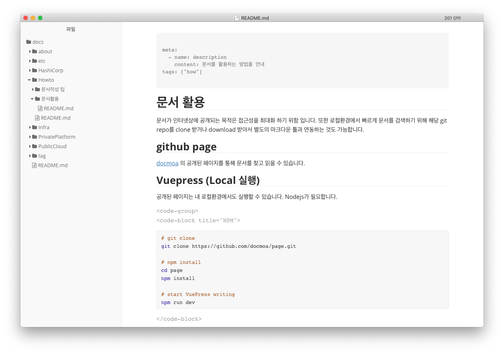

---

title: docmoa 활용 가이드
meta:
  - name: description
    content: 문서를 활용하는 방법을 안내
tags: ["how", "docmoa"]

---

# docmoa 활용 가이드


문서가 인터넷상에 공개되는 목적은 접근성을 극대화 하기 위함 입니다. 또한 로컬환경에서 빠르게 문서를 검색하기 위해 해당 git repo를 clone 받거나 download 받아서 별도의 마크다운 툴과 연동하는 것도 가능합니다. `VuePress` 기반으로 구성되었기 때문에 이외의 방식은 문서 표기에 제약이 있을 수 있습니다.

## github page
[docmoa](https://docmoa.github.io/)의 공개된 페이지를 통해 문서를 읽을 수 있습니다.

## VuePress (Local 실행)
공개된 페이지는 내 로컬환경에서도 실행할 수 있습니다. Nodejs가 필요합니다.

<code-group>
<code-block title="NPM">
```bash {2,5-6,9}
# git clone
git clone https://github.com/docmoa/docs.git

# npm install
cd docs
npm install

# start VuePress writing
npm run dev
```
</code-block>

<code-block title="YARN">
```bash {2,5-6,9}
# git clone
git clone https://github.com/docmoa/docs.git

# npm install
cd docs
yarn install

# start VuePress writing
yarn vuepress dev
```
</code-block>
</code-group>

실행이 완료되면 로그에 다음과 같은 메시지와 접속할 수 있는 링크가 나타납니다.
```text
success [10:48:28] Build 6f9dd7 finished in 1179 ms! ( http://localhost:8000/ )
```

웹브라우저에서 실행시 표기되는 로그의 링크를 입력하면 공개된 웹화면과 동일한 환경을 확인할 수 있습니다.


## typora
`typora`는 멀티 OS를 지원하는 마크다운 에디터/뷰어 입니다. VuePress의 플러그인과 일부 호환되지 않는 표기들이 있으나, 전역 검색이 가능하고 개인 노트를 활용하듯 관리할 수 있습니다.

1. [typora.io](https://typora.io/) 를 통해 에디터를 다운로드 받고 설치합니다.
2. docmoa의 소스를 clone/download 합니다.
    ```bash
    git clone https://github.com/docmoa/page.git
    ```
3.`typora`를 실행하고 옵션에서 [파일] > [열기] 를 클릭하여 앞서 받은 소스 디렉토리의 `docs` 디렉토리를 열어줍니다.


4. 전역검색은 다음과 같이 사용 가능합니다.
    * Mac: <button>⌘</button><button>⇧</button>+f 
    * Windows: <button>Ctrl</button><button>Shift</button>+f 

## VS Code
`Visual Studio Code`에서는 마크다운의 프리뷰를 지원합니다. 앞서 [typora](./#typora)는 마크다운으로 작성하는 즉시 마크다운 형태로 변경되었다면, `VS Code`에서는 좌우 비교하면서 작성한 표현이 어떻게 반영되는지 확인할 수 있습니다.

1. VS Code [Download](https://code.visualstudio.com/Download) 사이트에서 환경에 맞는 설치 파일을 다운로드 받고 설치합니다.
2. docmoa의 소스를 clone/download 합니다.
    ```bash
    git clone https://github.com/docmoa/page.git
    ```
3. `VS Code`를 실행하고 [파일] > [열기] 를 클릭하여 앞서 받은 소스 디렉토리의 `docs` 디렉토리를 열어줍니다.
4. `Preview` 버튼을 클릭하면 양쪽으로 비교하면서 글을 확인/편집 할 수 있습니다.

5. 전역검색은 다음과 같이 사용 가능합니다.
    * Mac: <button>⌘</button><button>⇧</button>+f 
    * Windows: <button>Ctrl</button><button>Shift</button>+f 
