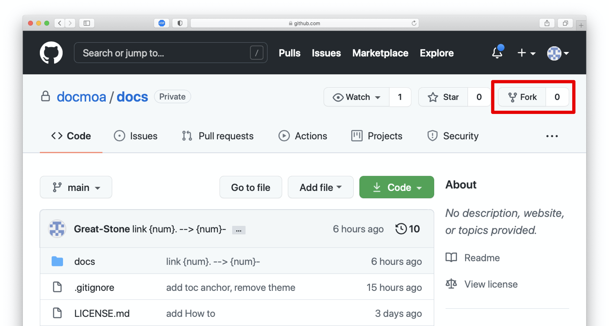
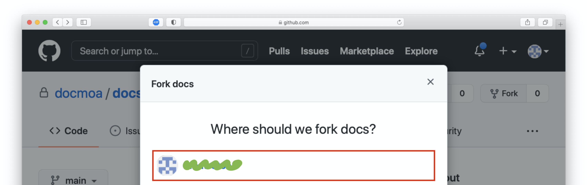

---

meta:
  - name: description
    content: 문서를 작성하는 방법을 안내
tags: ["how", "docmoa"]

---

# Contribute

docmoa에 문서 기여하기위한 가이드를 설명합니다. 일반적인 github 상에서의 코드 기여 방식과 동일합니다.

## git 설치(Option)
로컬 환경에서 git 명령을 수행하기 위해 설치합니다. github 브라우저 환경에서 수정하는 것도 가능하지만, 로컬에서 문서를 활용하고 오프라인 작업을 위해서는 설치하시기를 권장합니다.

[Git 설치 방법 안내](https://git-scm.com/book/ko/v2/%EC%8B%9C%EC%9E%91%ED%95%98%EA%B8%B0-Git-%EC%84%A4%EC%B9%98)를 참고하여 아래 설명합니다.

:::: tabs
::: tab Mac
- Mavericks(10.9)부터는 Terminal에 단지 처음으로 'git’을 실행하는 것으로 설치가 시작됩니다.
- 공식 배포판 : <http://git-scm.com/download/mac> 에서 다운로드 받은 설치파일을 실행하여 설치합니다.
:::
::: tab Windows
- 공식 배포판 : <http://git-scm.com/download/win> 에서 다운로드 받은 설치파일을 실행하여 설치합니다.
- GitHub Desktop : [GitHub Desktop 웹사이트](https://desktop.github.com/)에서 내려받아 설치합니다.
:::
::: tab Linux(Fedora/RHEL/CentOS/Rocky)
```bash
sudo dnf install git-all
```
:::
::: tab Linux(Debian/Ubuntu)
```bash
sudo apt install git-all
```
:::
::::

## github `Fork`
문서는 github상에서 관리됩니다. 우선 문서를 추가구성하고 수정할 수 있도록 원본 github repo를 `Fork` 합니다.

1. `https://github.com/docmoa/docs`로 이동합니다.
2. 우측 상단의 `Fork`를 클릭하고 나의 github Org를 선택합니다.



## git `Fetch` or `Pull`


