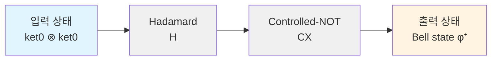
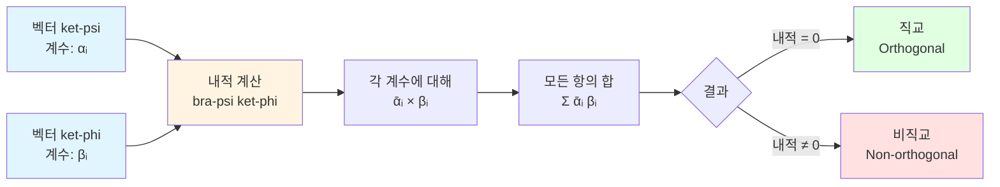
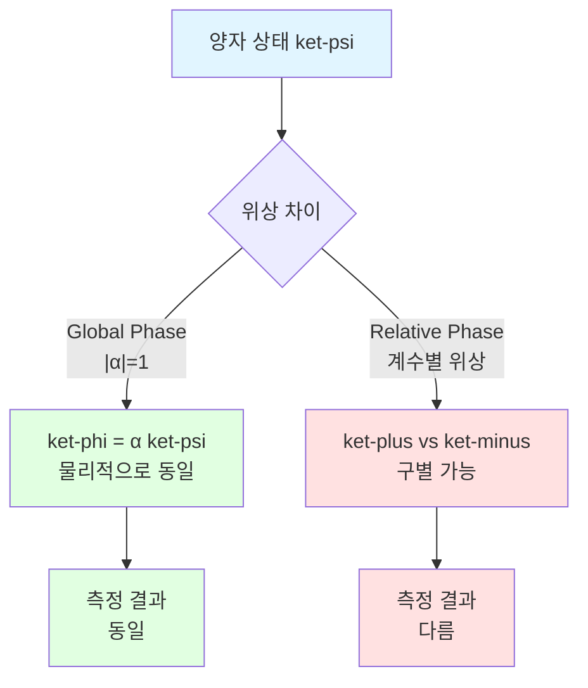
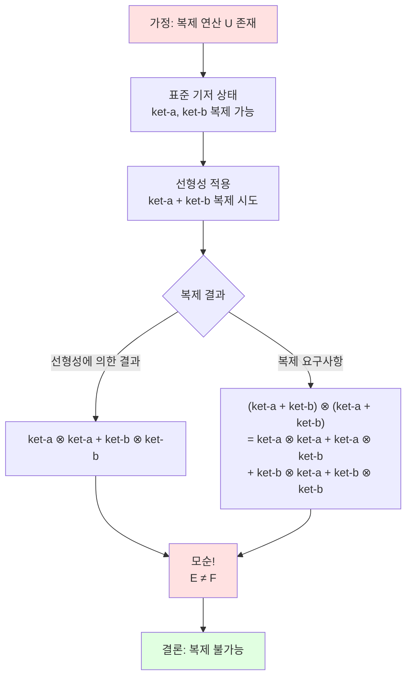
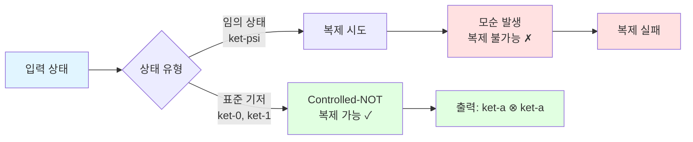
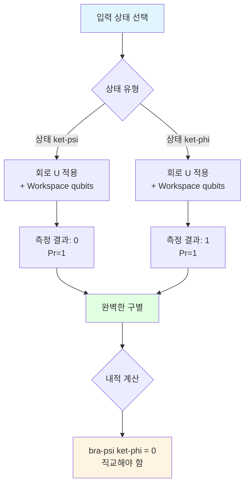
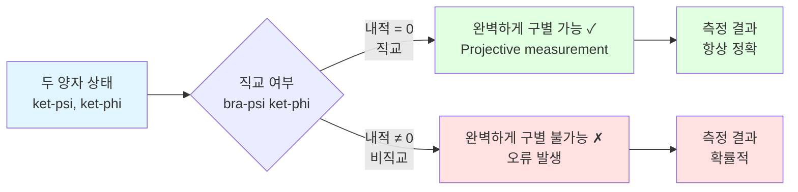
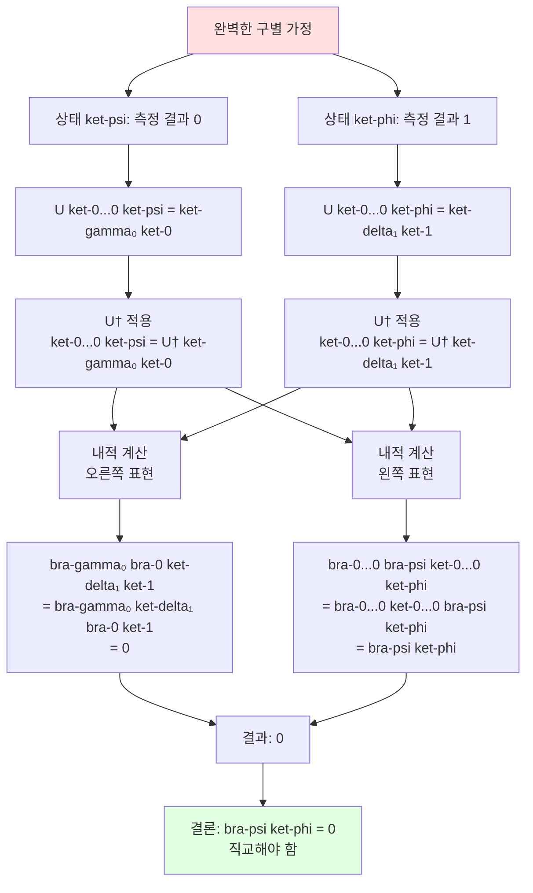
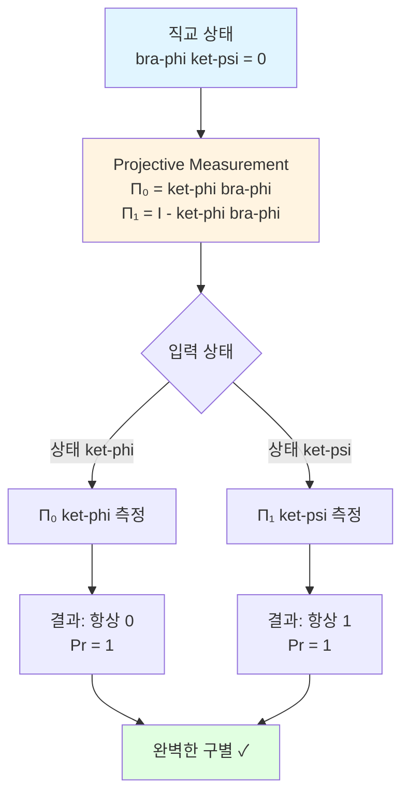

---

description: 이 글은 양자 정보와 계산에 대한 내용으로, 양자 회로에 대해 다룹니다.
tag: ["quantum", "information", "computation", "quantum-circuits"]

---

# Lesson 3: 양자 회로 - 양자 정보와 계산 이해하기

이 글은 양자 정보와 계산에 대한 세 번째 강의로, 양자 회로 모델과 양자 정보의 제한사항에 대해 설명합니다.

## Circuits (회로)

Circuits (회로)는 계산의 모델입니다:

- Wires (선)는 정보를 전달합니다
- Gates (게이트)는 연산을 나타냅니다

이 시리즈에서 circuits (회로)는 항상 acyclic (비순환적)입니다 — 정보는 왼쪽에서 오른쪽으로 흐릅니다.

### 예시: Boolean circuits (불린 회로)

Wires (선)는 이진 값을 저장하고, gates (게이트)는 AND (∧), OR (∨), NOT (¬), FANOUT (∙)과 같은 Boolean logic operations (불린 논리 연산)을 나타냅니다.

### 예시: Arithmetic circuits (산술 회로)

Wires (선)는 숫자를 저장하고, gates (게이트)는 addition (+)과 multiplication (*)과 같은 arithmetic operations (산술 연산)을 나타냅니다.

## Quantum circuits (양자 회로)

Quantum circuit (양자 회로) 모델에서, wires (선)는 qubit을 나타내고, gates (게이트)는 unitary operations (유니터리 연산)과 measurements (측정)을 모두 나타냅니다.

### Convention (규약)

이 시리즈(그리고 Qiskit)에서, qubit을 bottom-to-top (아래에서 위로) 정렬하는 것은 left-to-right (왼쪽에서 오른쪽) 정렬하는 것과 동일합니다.

::: tip 용어 설명: Quantum circuit (양자 회로)
- **의미**: Quantum circuit (양자 회로)는 양자 계산을 표현하는 표준 방법입니다
- **발음**: "양자 회로" 또는 "quantum circuit"
- **구성 요소**: 
  - Wires (선): qubit을 나타냄
  - Gates (게이트): unitary operations (유니터리 연산)과 measurements (측정)을 나타냄
- **특징**: 정보는 왼쪽에서 오른쪽으로 흐르며, 비순환적(acyclic)입니다.
:::

### 양자 회로 예시

다음은 단일 qubit에 대한 간단한 양자 회로 예시입니다:

```
|0⟩ ──[H]──[S]──[H]──[T]──
```

이 회로는 다음 연산의 합성을 나타냅니다: $THSH$.

두 qubit에 대한 예시:

```
|0⟩ ──[H]───────●──
                │
|0⟩ ────────────⊕──
```

여기서 $H$는 Hadamard operation (Hadamard 연산)을 나타내고, ●는 control qubit (제어 qubit), ⊕는 target qubit (대상 qubit)을 나타내는 controlled-NOT operation (제어-NOT 연산)입니다.

이 회로는 Bell state (벨 상태) $|\phi^+\rangle$를 생성합니다.

### 양자 회로의 정보 흐름

양자 회로에서 정보의 흐름을 다이어그램으로 표현하면 다음과 같습니다:



이 다이어그램은 Bell state (벨 상태) 생성 회로의 정보 흐름을 보여줍니다.

### 양자 회로의 일반적인 구조

양자 회로의 일반적인 구조를 다이어그램으로 표현하면:


## Inner products (내적)

Dirac notation (Dirac 표기법)을 사용할 때, ket는 열 벡터이고 그에 해당하는 bra는 행 벡터입니다:

$$
|\psi\rangle=\left(\begin{array}{c}
\alpha_{1} \\
\vdots \\
\alpha_{n}
\end{array}\right) \quad\langle\psi|=\left(\begin{array}{ccc}
\overline{\alpha_{1}} & \cdots & \overline{\alpha_{n}}
\end{array}\right)
$$

두 ket가 있다고 가정합니다:

$$
|\psi\rangle=\left(\begin{array}{c}
\alpha_{1} \\
\vdots \\
\alpha_{n}
\end{array}\right) \quad \text{그리고} \quad|\phi\rangle=\left(\begin{array}{c}
\beta_{1} \\
\vdots \\
\beta_{n}
\end{array}\right)
$$

그러면 다음을 가집니다:

$$
\langle\psi \mid \phi\rangle=\left(\begin{array}{ccc}
\overline{\alpha_{1}} & \cdots & \overline{\alpha_{n}}
\end{array}\right)\left(\begin{array}{c}
\beta_{1} \\
\vdots \\
\beta_{n}
\end{array}\right)=\overline{\alpha_{1}} \beta_{1}+\cdots+\overline{\alpha_{n}} \beta_{n}
$$

이것은 $|\psi\rangle$와 $|\phi\rangle$의 inner product (내적)입니다.

::: tip 기호 설명: $\langle\psi|\phi\rangle$ (내적)
- **의미**: 두 벡터 $|\psi\rangle$와 $|\phi\rangle$의 inner product (내적)을 나타냅니다
- **발음**: "파이 브라 파이 켓" 또는 "bra psi ket phi"
- **계산**: $\langle\psi|\phi\rangle = \sum_{i} \overline{\alpha_i} \beta_i$ (각 계수의 복소 켤레와 다른 계수의 곱의 합)
- **특징**: 
  - $\langle\psi|\phi\rangle = \overline{\langle\phi|\psi\rangle}$ (켤레 대칭)
  - $\langle\psi|\psi\rangle = \||\psi\rangle\|^2$ (자기 자신과의 내적은 노름의 제곱)
:::

### 내적의 개념과 계산

내적의 개념과 계산 과정을 다이어그램으로 표현하면:



### 대안적 표현

두 열 벡터가 다음과 같이 표현된다고 가정합니다:

$$
|\psi\rangle=\sum_{a \in \Sigma} \alpha_{a}|a\rangle \quad \text{그리고} \quad|\phi\rangle=\sum_{b \in \Sigma} \beta_{b}|b\rangle
$$

그러면 이러한 벡터의 inner product (내적)는 다음과 같습니다:

$$
\begin{aligned}
\langle\psi \mid \phi\rangle & =\left(\sum_{a \in \Sigma} \overline{\alpha_{a}}\langle a|\right)\left(\sum_{b \in \Sigma} \beta_{b}|b\rangle\right) \\
& =\sum_{a \in \Sigma} \sum_{b \in \Sigma} \overline{\alpha_{a}} \beta_{b}\langle a \mid b\rangle \\
& =\sum_{a \in \Sigma} \overline{\alpha_{a}} \beta_{a}
\end{aligned}
$$

::: tip 수식 읽기: $\langle\psi \mid \phi\rangle = \sum_{a \in \Sigma} \overline{\alpha_{a}} \beta_{a}$
- **읽는 방법**: "파이 브라 파이 켓은 시그마에 속하는 모든 a에 대해 알파 a의 켤레 곱하기 베타 a의 합과 같다"
- **의미**: 두 양자 상태 벡터의 내적은 각 기저 상태에 대한 계수의 복소 켤레와 계수의 곱의 합입니다.
- **물리적 의미**: 두 상태의 유사도나 겹침을 나타냅니다.
:::

### Euclidean norm과의 관계

임의의 벡터

$$
|\psi\rangle=\sum_{a \in \Sigma} \alpha_{a}|a\rangle
$$

에 대해, 자기 자신과의 inner product (내적)는 다음과 같습니다:

$$
\langle\psi \mid \psi\rangle=\sum_{a \in \Sigma} \overline{\alpha_{a}} \alpha_{a}=\sum_{a \in \Sigma}\left|\alpha_{a}\right|^{2}=\||\psi\rangle \|^{2}
$$

즉, 벡터 $|\psi\rangle$의 Euclidean norm (유클리드 노름)은 다음과 같이 주어집니다:

$$
\||\psi\rangle\|=\sqrt{\langle\psi \mid \psi\rangle}
$$

::: tip 수식 읽기: $\||\psi\rangle\|=\sqrt{\langle\psi \mid \psi\rangle}$
- **읽는 방법**: "파이 켓의 노름은 파이 브라 파이 켓의 제곱근과 같다"
- **의미**: 벡터의 유클리드 노름은 자기 자신과의 내적의 제곱근입니다.
- **양자 상태**: 양자 상태 벡터는 노름이 1이므로, $\langle\psi|\psi\rangle = 1$입니다.
:::

### Conjugate symmetry (켤레 대칭)

임의의 두 벡터

$$
|\psi\rangle=\sum_{a \in \Sigma} \alpha_{a}|a\rangle \text{ 그리고 }|\phi\rangle=\sum_{b \in \Sigma} \beta_{b}|b\rangle
$$

에 대해 다음을 가집니다:

$$
\langle\psi \mid \phi\rangle=\sum_{a \in \Sigma} \overline{\alpha_{a}} \beta_{a} \text{ 그리고 }\langle\phi \mid \psi\rangle=\sum_{a \in \Sigma} \overline{\beta_{a}} \alpha_{a}
$$

따라서

$$
\langle\psi \mid \phi\rangle=\overline{\langle\phi \mid \psi\rangle}
$$

입니다.

### Linearity (선형성)

두 번째 인수에서의 선형성: $|\psi\rangle,\left|\phi_{1}\right\rangle$, $\left|\phi_{2}\right\rangle$가 벡터이고 $\alpha_{1}$과 $\alpha_{2}$가 복소수라고 가정합니다. 새로운 벡터를 다음과 같이 정의하면:

$$
|\phi\rangle=\alpha_{1}\left|\phi_{1}\right\rangle+\alpha_{2}\left|\phi_{2}\right\rangle
$$

다음을 가집니다:

$$
\langle\psi \mid \phi\rangle=\langle\psi|\left(\alpha_{1}\left|\phi_{1}\right\rangle+\alpha_{2}\left|\phi_{2}\right\rangle\right)=\alpha_{1}\left\langle\psi \mid \phi_{1}\right\rangle+\alpha_{2}\left\langle\psi \mid \phi_{2}\right\rangle
$$

첫 번째 인수에서의 켤레 선형성: $\left|\psi_{1}\right\rangle,\left|\psi_{2}\right\rangle$, $|\phi\rangle$가 벡터이고 $\beta_{1}$과 $\beta_{2}$가 복소수라고 가정합니다. 새로운 벡터를 다음과 같이 정의하면:

$$
|\psi\rangle=\beta_{1}\left|\psi_{1}\right\rangle+\beta_{2}\left|\psi_{2}\right\rangle
$$

다음을 가집니다:

$$
\langle\psi \mid \phi\rangle=\left(\overline{\beta_{1}}\left\langle\psi_{1}\right|+\overline{\beta_{2}}\left\langle\psi_{2}\right|\right)|\phi\rangle=\overline{\beta_{1}}\left\langle\psi_{1} \mid \phi\right\rangle+\overline{\beta_{2}}\left\langle\psi_{2} \mid \phi\right\rangle
$$

### Orthogonality (직교성)

두 벡터 $|\psi\rangle$와 $|\phi\rangle$가 orthogonal (직교)한다는 것은 $\langle\psi|\phi\rangle = 0$을 의미합니다.

::: tip 용어 설명: Orthogonality (직교성)
- **의미**: 두 벡터가 orthogonal (직교)한다는 것은 내적이 0이라는 의미입니다
- **발음**: "직교성" 또는 "orthogonality"
- **수학적 정의**: $\langle\psi|\phi\rangle = 0$
- **물리적 의미**: 두 양자 상태가 완전히 구별 가능함을 의미합니다.
:::

## Irrelevance of global phases (전역 위상의 무관성)

Global phase (전역 위상)의 개념은 양자 상태 벡터로 양자 상태를 표현하는 방식의 약간의 퇴화(degeneracy)에 관한 것으로, 실제 제한사항이라기보다는 표현 방식의 특성입니다.

$|\psi\rangle$와 $|\phi\rangle$가 어떤 시스템의 양자 상태를 나타내는 단위 벡터라고 가정하고, 단위원 위의 복소수 $\alpha$가 존재하여 $|\alpha| = 1$ (또는 대안적으로 어떤 실수 $\theta$에 대해 $\alpha = e^{i\theta}$)이고 다음을 만족한다고 가정합니다:

$$
|\phi\rangle = \alpha |\psi\rangle
$$

벡터 $|\psi\rangle$와 $|\phi\rangle$는 global phase (전역 위상)만큼 다르다고 말합니다. 때때로 $\alpha$를 global phase (전역 위상)라고 부르기도 하지만, 이것은 맥락에 따라 다릅니다. 단위원 위의 모든 수는 단위 벡터에 곱해질 때 global phase (전역 위상)로 생각할 수 있습니다.

시스템이 두 양자 상태 $|\psi\rangle$와 $|\phi\rangle$ 중 하나에 있고, 시스템이 standard basis measurement (표준 기저 측정)를 받는다고 가정합니다. 첫 번째 경우(시스템이 상태 $|\psi\rangle$에 있는 경우)에서, 임의의 고전 상태 $a$를 측정할 확률은 다음과 같습니다:

$$
\bigl|\langle a | \psi \rangle \bigr|^2
$$

두 번째 경우(시스템이 상태 $|\phi\rangle$에 있는 경우)에서, 임의의 고전 상태 $a$를 측정할 확률은 다음과 같습니다:

$$
\bigl|\langle a | \phi \rangle \bigr|^2 = \bigl|\alpha \langle a | \psi \rangle \bigr|^2 = |\alpha|^2 \bigl|\langle a | \psi \rangle \bigr|^2 = \bigl|\langle a | \psi \rangle \bigr|^2
$$

$|\alpha| = 1$이기 때문입니다. 즉, 결과가 나타날 확률은 두 상태 모두에서 동일합니다.

이제 임의의 unitary operation (유니터리 연산) $U$를 두 상태에 모두 적용하면 어떻게 되는지 고려해봅시다. 첫 번째 경우(초기 상태가 $|\psi\rangle$인 경우)에서, 상태는 다음과 같이 됩니다:

$$
U |\psi\rangle
$$

두 번째 경우(초기 상태가 $|\phi\rangle$인 경우)에서, 상태는 다음과 같이 됩니다:

$$
U |\phi\rangle = \alpha U |\psi\rangle
$$

즉, 두 결과 상태는 여전히 같은 global phase (전역 위상) $\alpha$만큼 다릅니다.

결과적으로, global phase (전역 위상)만큼 다른 두 양자 상태 $|\psi\rangle$와 $|\phi\rangle$는 완전히 구별할 수 없습니다. 어떤 연산이나 연산 시퀀스를 두 상태에 적용하더라도, 항상 global phase (전역 위상)만큼 다르며, standard basis measurement (표준 기저 측정)를 수행하면 정확히 같은 확률로 결과를 생성합니다. 이러한 이유로, global phase (전역 위상)만큼 다른 두 양자 상태 벡터는 동등한 것으로 간주되며, 효과적으로 같은 상태로 봅니다.

### 예시

다음 양자 상태들:

$$
|-\rangle=\frac{1}{\sqrt{2}}|0\rangle-\frac{1}{\sqrt{2}}|1\rangle \quad \text{그리고} \quad-|-\rangle=-\frac{1}{\sqrt{2}}|0\rangle+\frac{1}{\sqrt{2}}|1\rangle
$$

는 global phase (전역 위상)만큼 다릅니다(이 예시에서는 $-1$).

반면, 다음 양자 상태들:

$$
|+\rangle=\frac{1}{\sqrt{2}}|0\rangle+\frac{1}{\sqrt{2}}|1\rangle \quad \text{그리고} \quad|-\rangle=\frac{1}{\sqrt{2}}|0\rangle-\frac{1}{\sqrt{2}}|1\rangle
$$

는 global phase (전역 위상)만큼 다르지 않습니다. (이것은 relative phase difference (상대 위상 차이)입니다.)

이것은 이전에 관찰한 것과 일치합니다. 즉, 상태 $|+\rangle$와 $|-\rangle$는 완벽하게 구별할 수 있습니다. 특히, Hadamard operation (Hadamard 연산)을 수행한 다음 측정하면 다음과 같은 결과 확률을 얻습니다:

$$
\begin{array}{c|c}
|\langle 0| H|+\rangle|^{2}=1 & |\langle 0| H|-\rangle|^{2}=0 \\
|\langle 1| H|+\rangle|^{2}=0 & |\langle 1| H|-\rangle|^{2}=1
\end{array}
$$

::: tip 용어 설명: Global phase (전역 위상)
- **의미**: Global phase (전역 위상)는 양자 상태 벡터에 단위원 위의 복소수를 곱한 것입니다
- **발음**: "전역 위상" 또는 "global phase"
- **특징**: 
  - Global phase (전역 위상)는 측정 결과에 영향을 주지 않습니다
  - Global phase (전역 위상)만큼 다른 두 상태는 물리적으로 동일합니다
- **차이점**: Relative phase (상대 위상)는 측정 결과에 영향을 줍니다.
:::

### Global phase와 Relative phase의 차이

Global phase (전역 위상)와 relative phase (상대 위상)의 차이를 다이어그램으로 표현하면:



## No-cloning theorem (복제 불가 정리)

No-cloning theorem (복제 불가 정리)는 알려지지 않은 양자 상태의 완벽한 복사본을 만드는 것이 불가능하다는 것을 보여줍니다.

### 정리 (No-cloning theorem)

$\Sigma$가 최소 두 개의 원소를 가진 classical state set (고전 상태 집합)이고, $X$와 $Y$가 같은 classical state set (고전 상태 집합) $\Sigma$를 공유하는 시스템이라고 가정합니다. $Y$의 양자 상태 $|\phi\rangle$와 쌍 $(X, Y)$에 대한 unitary operation (유니터리 연산) $U$가 존재하지 않아서, $X$의 모든 상태 $|\psi\rangle$에 대해 다음을 만족합니다:

$$
U(|\psi\rangle \otimes |0\rangle) = |\psi\rangle \otimes |\psi\rangle
$$

즉, 시스템 $Y$를 초기화하고(어떤 상태 $|\phi\rangle$로든) 결합 시스템 $(X, Y)$에 unitary operation (유니터리 연산) $U$를 수행하여 $X$의 상태 $|\psi\rangle$를 복제하는 방법은 없습니다 — 결과적으로 $(X, Y)$가 상태 $|\psi\rangle \otimes |\psi\rangle$에 있게 됩니다.

이 정리의 증명은 실제로 매우 간단합니다: 매핑

$$
|\psi\rangle \otimes |\phi\rangle \longmapsto |\psi\rangle \otimes |\psi\rangle
$$

이 $|\psi\rangle$에서 선형이 아니라는 관찰로 요약됩니다.

특히, $\Sigma$가 최소 두 개의 원소를 가지므로, $a \neq b$인 $a,b\in\Sigma$를 선택할 수 있습니다. $X$의 모든 양자 상태 $|\psi\rangle$에 대해 $U(|\psi\rangle \otimes |\phi\rangle) = |\psi\rangle \otimes |\psi\rangle$를 만족하는 $Y$의 양자 상태 $|\phi\rangle$와 쌍 $(X, Y)$에 대한 unitary operation (유니터리 연산) $U$가 존재한다면, 다음이 성립해야 합니다:

$$
U(|a\rangle \otimes |\phi\rangle) = |a\rangle \otimes |a\rangle \quad \text{그리고} \quad U(|b\rangle \otimes |\phi\rangle) = |b\rangle \otimes |b\rangle
$$

선형성에 의해, 구체적으로 첫 번째 인수에서 텐서 곱의 선형성과 두 번째(벡터) 인수에서 행렬-벡터 곱셈의 선형성을 고려하면, 다음을 가져야 합니다:

$$
U\left(\left(\frac{1}{\sqrt{2}}|a\rangle + \frac{1}{\sqrt{2}}|b\rangle\right) \otimes |\phi\rangle\right) = \frac{1}{\sqrt{2}}|a\rangle \otimes |a\rangle + \frac{1}{\sqrt{2}}|b\rangle \otimes |b\rangle
$$

그러나 모든 양자 상태 $|\psi\rangle$에 대해 $U(|\psi\rangle \otimes |\phi\rangle) = |\psi\rangle \otimes |\psi\rangle$라는 요구사항은 다음을 요구합니다:

$$
\begin{aligned}
& U\left(\left(\frac{1}{\sqrt{2}}|a\rangle + \frac{1}{\sqrt{2}}|b\rangle\right) \otimes |\phi\rangle\right) \\
& \qquad = \left(\frac{1}{\sqrt{2}}|a\rangle + \frac{1}{\sqrt{2}}|b\rangle\right) \otimes \left(\frac{1}{\sqrt{2}}|a\rangle + \frac{1}{\sqrt{2}}|b\rangle\right) \\
& \qquad = \frac{1}{2}|a\rangle \otimes |a\rangle + \frac{1}{2}|a\rangle \otimes |b\rangle + \frac{1}{2}|b\rangle \otimes |a\rangle + \frac{1}{2}|b\rangle \otimes |b\rangle \\
& \qquad \neq \frac{1}{\sqrt{2}}|a\rangle \otimes |a\rangle + \frac{1}{\sqrt{2}}|b\rangle \otimes |b\rangle
\end{aligned}
$$

따라서 모든 양자 상태 벡터 $|\psi\rangle$에 대해 $U(|\psi\rangle \otimes |\phi\rangle) = |\psi\rangle \otimes |\psi\rangle$를 만족하는 상태 $|\phi\rangle$와 unitary operation (유니터리 연산) $U$가 존재할 수 없습니다.

### No-cloning theorem의 논리 흐름

No-cloning theorem (복제 불가 정리)의 증명 논리를 다이어그램으로 표현하면:



### 표준 기저 상태 복제

표준 기저 상태는 복제 가능하지만, 임의의 양자 상태는 복제할 수 없습니다:



### 비고

No-cloning theorem (복제 불가 정리)에 대한 몇 가지 비고가 있습니다.

첫 번째는 위의 no-cloning theorem (복제 불가 정리)의 진술이 절대적이라는 것입니다. 즉, 완벽한 복제가 불가능하다고 말하지만, 제한된 정확도로 복제하는 것에 대해서는 아무 말도 하지 않습니다. 여기서는 두 다른 양자 상태가 얼마나 유사할 수 있는지를 측정하는 어떤 방법에 대해 근사 복제본을 생성하는 데 성공할 수 있습니다. 실제로, 근사 복제에 대한 제한을 두는 no-cloning theorem (복제 불가 정리)의 진술이 있으며, 제한된 정확도로 근사 복제를 달성하는 방법도 있습니다.

두 번째 비고는 no-cloning theorem (복제 불가 정리)가 임의의 상태 $|\psi\rangle$를 복제하는 불가능성에 대한 진술이라는 것입니다. 대조적으로, 표준 기저 상태를 복제하는 것은 쉽게 할 수 있습니다. 예를 들어, controlled-NOT operation (제어-NOT 연산)을 사용하여 qubit 표준 기저 상태를 복제할 수 있습니다:

```
|a⟩ ──●──
      │
|0⟩ ──⊕──
```

여기서 $|a\rangle$는 $|0\rangle$ 또는 $|1\rangle$이며, 이는 고전적으로 실현 가능한 상태입니다. 표준 기저 상태의 복제본을 만드는 데 어려움이 없지만, 이것은 no-cloning theorem (복제 불가 정리)와 모순되지 않습니다. 예를 들어, 이 controlled-NOT gate (제어-NOT 게이트) 접근 방식은 상태 $|+\rangle$의 복제본을 만드는 데 성공하지 못할 것입니다.

no-cloning theorem (복제 불가 정리)에 대한 마지막 비고는 이것이 양자 정보에만 고유한 것이 아니라는 것입니다 — 고전적(결정론적 또는 확률적) 프로세스를 사용하여 임의의 probabilistic state (확률적 상태)를 복제하는 것도 불가능합니다. 누군가가 어떤 probabilistic state (확률적 상태)에 있는 시스템을 건네주지만, 그 probabilistic state (확률적 상태)가 무엇인지 확실하지 않다고 상상해봅시다. 예를 들어, 그들이 $1$과 $10$ 사이의 숫자를 무작위로 생성했지만, 그 숫자를 어떻게 생성했는지 알려주지 않았을 수 있습니다. 같은 probabilistic state (확률적 상태)의 두 개의 독립적인 복사본을 얻을 수 있는 물리적 프로세스는 확실히 없습니다: 손에 있는 것은 $1$과 $10$ 사이의 숫자뿐이며, 다른 모든 결과가 나타날 확률을 어떻게든 재구성할 수 있을 만큼 충분한 정보가 없습니다.

수학적으로 말하면, probabilistic states (확률적 상태)에 대한 no-cloning theorem (복제 불가 정리)의 버전은 일반적인 no-cloning theorem (복제 불가 정리)(양자 상태에 대한)와 정확히 같은 방식으로 증명할 수 있습니다. 즉, 임의의 probabilistic state (확률적 상태)를 복제하는 것은 비선형 프로세스이므로, 확률 행렬로 표현될 수 없습니다.

::: tip 용어 설명: No-cloning theorem (복제 불가 정리)
- **의미**: No-cloning theorem (복제 불가 정리)는 알려지지 않은 양자 상태를 완벽하게 복제하는 것이 불가능하다는 정리입니다
- **발음**: "복제 불가 정리" 또는 "no-cloning theorem"
- **핵심**: 복제 연산은 비선형이므로 유니터리 연산으로 표현될 수 없습니다
- **예외**: 표준 기저 상태는 복제 가능합니다
- **중요성**: 양자 암호학과 양자 정보 이론의 기초가 됩니다.
:::

## Discriminating non-orthogonal states (비직교 상태 구분)

두 양자 상태 $|\psi\rangle$와 $|\phi\rangle$가 orthogonal (직교)하지 않으면, 즉 $\langle \phi|\psi\rangle \neq 0$이면, 이들을 완벽하게 구별하는(또는 달리 말하면 구분하는) 것이 불가능하다는 것을 보여드리겠습니다.

실제로, 우리는 논리적으로 동등한 것을 보여드리겠습니다: 두 상태를 완벽하게, 오류 없이 구별하는 방법이 있다면, 그것들은 반드시 orthogonal (직교)해야 합니다.

임의의 수의 unitary gates (유니터리 게이트)로 구성되고, 그 다음 top qubit의 단일 standard basis measurement (표준 기저 측정)가 뒤따르는 양자 회로에 대한 주의를 제한하겠습니다. 양자 회로가 상태 $|\psi\rangle$와 $|\phi\rangle$를 완벽하게 구별한다고 말하기 위해 요구되는 것은, 측정이 항상 두 상태 중 하나에 대해서는 값 $0$을 산출하고 다른 상태에 대해서는 항상 $1$을 산출한다는 것입니다.

정확하게 말하면, 다음 다이어그램이 제안하는 것처럼 작동하는 양자 회로가 있다고 가정합니다:

```
|0⋯0⟩ ──[U]──[M]── 0 (for |ψ⟩)
|ψ⟩  ────────┘

|0⋯0⟩ ──[U]──[M]── 1 (for |φ⟩)
|φ⟩  ────────┘
```

### 비직교 상태 구분 과정

비직교 상태를 구분하는 과정을 다이어그램으로 표현하면:



### 직교 상태와 비직교 상태의 구분 가능성

직교 상태와 비직교 상태의 구분 가능성을 다이어그램으로 표현하면:



$U$로 표시된 상자는 회로의 모든 unitary gates (유니터리 게이트)의 결합된 동작을 나타내는 unitary operation (유니터리 연산)을 나타내지만, 최종 측정은 포함하지 않습니다. 측정이 $|\psi\rangle$에 대해서는 $0$을 출력하고 $|\phi\rangle$에 대해서는 $1$을 출력한다고 가정하는 데 일반성을 잃지 않습니다. 이러한 출력 값이 반대라면 분석이 근본적으로 다르지 않을 것입니다.

회로가 상태 $|\psi\rangle$에서 실행될 때(초기화된 workspace qubit들과 함께), 측정이 수행되기 직전의 결과 상태는 다음과 같이 쓸 수 있습니다:

$$
U \bigl(  |0\cdots 0 \rangle | \psi \rangle\bigr) = | \gamma_0\rangle|0 \rangle + | \gamma_1 \rangle|1 \rangle
$$

top qubit을 제외한 모든 qubit에 해당하는 두 벡터 $| \gamma_0\rangle$와 $| \gamma_1 \rangle$에 대해. 일반적으로, 이러한 상태에 대해 top qubit의 측정이 결과 $0$과 $1$을 산출할 확률은 다음과 같습니다:

$$
\operatorname{Pr}(\text{결과가 $0$}) = \bigl\| |\gamma_0\rangle \bigr\|^2 \quad \text{그리고} \quad \operatorname{Pr}(\text{결과가 $1$}) = \bigl\| |\gamma_1\rangle \bigr\|^2
$$

회로가 항상 상태 $|\psi\rangle$에 대해 $0$을 출력하므로, $|\gamma_1\rangle = 0$이어야 하며, 따라서

$$
U \bigl( |0\cdots 0\rangle| \psi \rangle  \bigr) = |\gamma_0\rangle|0 \rangle
$$

입니다.

이 방정식의 양변에 $U^{\dagger}$를 곱하면 다음 방정식을 얻습니다:

$$
|0\cdots 0\rangle| \psi \rangle = U^{\dagger} \bigl( | \gamma_0\rangle|0 \rangle \bigr) \tag{1}
$$

$|\phi\rangle$에 대해서도 유사하게 추론하면, 다음을 결론지을 수 있습니다:

$$
U \bigl( |0\cdots 0\rangle| \phi \rangle  \bigr) =  | \delta_1\rangle|1 \rangle
$$

어떤 벡터 $|\delta_1\rangle$에 대해, 따라서

$$
|0\cdots 0\rangle| \phi \rangle = U^{\dagger} \bigl(  | \delta_1\rangle|1 \rangle\bigr) \tag{2}
$$

입니다.

이제 방정식 $(1)$과 $(2)$로 표현된 벡터의 inner product (내적)를 취하겠습니다. 각 방정식의 오른쪽 표현부터 시작합니다:

$$
\bigl(U^{\dagger} \bigl( | \gamma_0\rangle|0 \rangle \bigr)\bigr)^{\dagger} = \bigl( \langle\gamma_0|\langle 0| \bigr)U
$$

따라서 벡터 $(1)$과 벡터 $(2)$의 inner product (내적)는 다음과 같습니다:

$$
\bigl( \langle\gamma_0|\langle 0| \bigr)U U^{\dagger} \bigl(  | \delta_1\rangle|1 \rangle\bigr) = \bigl( \langle\gamma_0|\langle 0| \bigr) \bigl(  | \delta_1\rangle|1 \rangle\bigr) =  \langle \gamma_0 | \delta_1\rangle \langle 0 | 1 \rangle = 0
$$

여기서 $U U^{\dagger} = \mathbb{I}$라는 사실과 텐서 곱의 inner product (내적)가 inner products (내적)의 곱이라는 사실을 사용했습니다:

$$
\langle u \otimes v | w \otimes x\rangle = \langle u | w\rangle \langle v | x\rangle
$$

이러한 벡터의 모든 선택에 대해 (이러한 벡터가 같은 수의 항목을 가지도록 가정). Inner product (내적) $\langle \gamma_0 | \delta_1\rangle$의 값은 $\langle 0 | 1 \rangle = 0$과 곱해지기 때문에 무관합니다.

마지막으로, 방정식 $(1)$과 $(2)$의 왼쪽에 있는 벡터의 inner product (내적)를 취하면 이미 계산한 것과 같은 0 값을 가져야 하므로:

$$
0 = \bigl(  |0\cdots 0\rangle | \psi\rangle\bigr)^{\dagger} \bigl(|0\cdots 0\rangle| \phi\rangle\bigr) =  \langle 0\cdots 0 | 0\cdots 0 \rangle \langle \psi | \phi \rangle = \langle \psi | \phi \rangle
$$

따라서 원하는 것을 결론지었습니다. 즉, $|\psi\rangle$와 $|\phi\rangle$는 orthogonal (직교)합니다: $\langle \psi | \phi \rangle = 0$.

### 내적 계산 과정

비직교 상태 구분 불가능성 증명의 내적 계산 과정을 다이어그램으로 표현하면:



### 역으로, 직교 양자 상태는 완벽하게 구별할 수 있습니다

반대로, orthogonal (직교)한 양자 상태는 완벽하게 구별할 수 있습니다. 특히, 구별할 두 상태가 $|\phi\rangle$와 $|\psi\rangle$이고, $\langle \phi|\psi\rangle = 0$이면, 예를 들어 다음 행렬로 설명되는 projective measurement (사영 측정)를 수행하여 이러한 상태를 완벽하게 구별할 수 있습니다:

### 직교 상태의 완벽한 구별

직교 상태를 완벽하게 구별하는 과정을 다이어그램으로 표현하면:



$$
\bigl\{ |\phi\rangle\langle\phi|, \mathbb{I} - |\phi\rangle\langle\phi| \bigr\}
$$

상태 $|\phi\rangle$에 대해, 첫 번째 결과가 항상 얻어집니다:

$$
\begin{aligned}
& \bigl\| |\phi\rangle\langle\phi| |\phi\rangle \bigr\|^2 = \bigl\| |\phi\rangle\langle\phi|\phi\rangle \bigr\|^2 = \bigl\| |\phi\rangle \bigr\|^2 = 1 \\
& \bigl\| (\mathbb{I} - |\phi\rangle\langle\phi|) |\phi\rangle \bigr\|^2 = \bigl\| |\phi\rangle - |\phi\rangle\langle\phi|\phi\rangle \bigr\|^2 = \bigl\| |\phi\rangle - |\phi\rangle \bigr\|^2 = 0
\end{aligned}
$$

그리고 상태 $|\psi\rangle$에 대해, 두 번째 결과가 항상 얻어집니다:

$$
\begin{aligned}
& \bigl\| |\phi\rangle\langle\phi| |\psi\rangle \bigr\|^2 = \bigl\| |\phi\rangle\langle\phi|\psi\rangle \bigr\|^2 = \bigl\| 0 \bigr\|^2 = 0 \\
& \bigl\| (\mathbb{I} - |\phi\rangle\langle\phi|) |\psi\rangle \bigr\|^2 = \bigl\| |\psi\rangle - |\phi\rangle\langle\phi|\psi\rangle \bigr\|^2 = \bigl\| |\psi\rangle \bigr\|^2 = 1
\end{aligned}
$$

::: tip 용어 설명: Projective measurement (사영 측정)
- **의미**: Projective measurement (사영 측정)는 standard basis measurement (표준 기저 측정)를 일반화한 측정 방법입니다
- **발음**: "사영 측정" 또는 "projective measurement"
- **특징**: 
  - 측정 연산자 $\{\Pi_i\}$는 $\sum_i \Pi_i = \mathbb{I}$와 $\Pi_i^2 = \Pi_i$를 만족합니다
  - 각 $\Pi_i$는 사영 연산자(projection operator)입니다
- **표준 기저 측정**: Standard basis measurement (표준 기저 측정)는 projective measurement (사영 측정)의 특수한 경우입니다.
:::

::: details 양자 회로에 대한 추가 설명

### Boolean circuits (불린 회로)

Boolean circuits (불린 회로)의 예시로, XOR (exclusive-OR) 연산을 계산하는 회로가 있습니다:

```
X ──[∙]──[∧]──[∨]── XOR
    │    │
Y ──┴────┴──[∧]──
```

여기서:
- $X$와 $Y$는 입력 비트입니다
- $∙$는 FANOUT (팬아웃) 연산입니다
- $∧$는 AND 연산입니다
- $∨$는 OR 연산입니다

XOR 연산의 진리표:

$$
\begin{array}{c|c}
  ab & a \oplus b \\
  \hline
  00 & 0 \\
  01 & 1 \\
  10 & 1 \\
  11 & 0
\end{array}
$$

### 양자 회로의 구성 요소

양자 회로는 다음 요소들로 구성됩니다:

1. **Qubit wires (Qubit 선)**: 수평선으로 표현되며, 각 선은 하나의 qubit을 나타냅니다
2. **Unitary gates (유니터리 게이트)**: 
   - 단일 qubit 게이트: $H$, $X$, $Y$, $Z$, $S$, $T$ 등
   - 다중 qubit 게이트: Controlled-NOT, SWAP 등
3. **Measurement gates (측정 게이트)**: 표준 기저 측정을 나타냅니다

### Qiskit의 qubit 순서 규약

Qiskit에서, 회로 다이어그램의 가장 위쪽 qubit은 인덱스 $0$을 가지며, qubit 튜플(또는 문자열, Cartesian product, 텐서 곱)의 가장 오른쪽 위치에 해당합니다. 두 번째로 위쪽 qubit은 인덱스 $1$을 가지며, 튜플에서 오른쪽에서 두 번째 위치에 해당합니다. 가장 아래쪽 qubit은 가장 높은 인덱스를 가지며, 따라서 튜플의 가장 왼쪽 위치에 해당합니다.

특히, Qiskit의 $n$-qubit 회로에서 qubit의 기본 이름은 $n$-튜플 $(\mathsf{q_{n-1}},\ldots,\mathsf{q_{0}})$로 표현되며, $\mathsf{q_{0}}$는 회로 다이어그램에서 위쪽에 있고 $\mathsf{q_{n-1}}$는 아래쪽에 있습니다.

이것은 회로에서 qubit을 정렬하는 더 일반적인 규약의 역순이며, 혼란의 빈번한 원천입니다.

### Bell state 생성 회로

다음 회로는 Bell state (벨 상태) $|\phi^+\rangle$를 생성합니다:

```
|0⟩ ──[H]───────●──
                │
|0⟩ ────────────⊕──
```

이 회로의 동작:

1. 첫 번째 연산은 $Y$에 대한 Hadamard operation (Hadamard 연산)입니다:
   $$
   \mathbb{I} \otimes H
   $$

2. 두 번째 연산은 $Y$가 control (제어)이고 $X$가 target (대상)인 controlled-NOT operation (제어-NOT 연산)입니다.

전체 회로에 의해 구현된 unitary operation (유니터리 연산)은 다음과 같습니다:

$$
U = \begin{pmatrix}
\frac{1}{\sqrt{2}} & \frac{1}{\sqrt{2}} & 0 & 0 \\
0 & 0 & \frac{1}{\sqrt{2}} & -\frac{1}{\sqrt{2}} \\
0 & 0 & \frac{1}{\sqrt{2}} & \frac{1}{\sqrt{2}} \\
\frac{1}{\sqrt{2}} & -\frac{1}{\sqrt{2}} & 0 & 0
\end{pmatrix}
$$

특히, Bell states (벨 상태)에 대한 표기법을 상기하면:

$$
\begin{aligned}
U |00\rangle & = |\phi^+\rangle \\
U |01\rangle & = |\phi^-\rangle \\
U |10\rangle & = |\psi^+\rangle \\
U |11\rangle & = -|\psi^-\rangle
\end{aligned}
$$

이 회로는 따라서 두 qubit이 $|00\rangle$로 초기화된 상태에서 실행하면 상태 $|\phi^+\rangle$를 만드는 방법을 제공합니다. 더 일반적으로, 이것은 표준 기저를 Bell basis (벨 기저)로 변환하는 방법을 제공합니다.

### 측정이 포함된 회로

양자 회로는 classical bit wires (고전 비트 선)도 포함할 수 있으며, 이는 이중 선으로 표시됩니다:

```
|0⟩ ──[H]───────●──[M]──→ A
                │
|0⟩ ────────────⊕──[M]──→ B
```

여기서 $A$와 $B$는 classical bits (고전 비트)이며, measurement gates (측정 게이트)는 표준 기저 측정을 나타냅니다. Qubit은 측정 후 상태로 변경되며, 측정 결과는 화살표가 가리키는 classical bits (고전 비트)에 덮어씌워집니다.

:::

::: details Inner products에 대한 추가 설명

### 내적의 기하학적 해석

두 벡터 $|\psi\rangle$와 $|\phi\rangle$의 inner product (내적)는 다음과 같이 기하학적으로 해석할 수 있습니다:

$$
\langle\psi|\phi\rangle = \||\psi\rangle\| \||\phi\rangle\| \cos\theta
$$

여기서 $\theta$는 두 벡터 사이의 각도입니다.

두 벡터가 orthogonal (직교)하면 ($\langle\psi|\phi\rangle = 0$), $\cos\theta = 0$이므로 $\theta = 90^\circ$입니다.

### Orthonormality (정규직교성)

벡터 집합 $\{|v_1\rangle, |v_2\rangle, \ldots, |v_n\rangle\}$가 orthonormal (정규직교)하다는 것은 다음을 만족한다는 의미입니다:

$$
\langle v_i | v_j \rangle = \delta_{ij}
$$

여기서 $\delta_{ij}$는 Kronecker delta입니다:

$$
\delta_{ij} = \begin{cases}
1 & \text{if } i = j \\
0 & \text{if } i \neq j
\end{cases}
$$

::: tip 기호 설명: $\delta_{ij}$ (크로네커 델타)
- **의미**: Kronecker delta (크로네커 델타)로, 두 인덱스가 같으면 1, 다르면 0인 함수입니다
- **발음**: "크로네커 델타" 또는 "Kronecker delta"
- **사용**: $\delta_{ij}$는 $i = j$일 때 1, $i \neq j$일 때 0입니다.
- **응용**: 정규직교 기저를 정의하는 데 사용됩니다.
:::

표준 기저 벡터 $\{|0\rangle, |1\rangle\}$는 orthonormal (정규직교)합니다:

$$
\langle 0 | 0 \rangle = 1, \quad \langle 0 | 1 \rangle = 0, \quad \langle 1 | 0 \rangle = 0, \quad \langle 1 | 1 \rangle = 1
$$

:::

::: details Qiskit을 사용한 양자 회로 구현

이 섹션에서는 Qiskit을 사용하여 양자 회로를 구성하고 실행하는 방법을 살펴봅니다.

### QuantumCircuit 클래스

Qiskit의 `QuantumCircuit` 클래스를 사용하여 양자 회로를 만들 수 있습니다:

```python
from qiskit import QuantumCircuit

# 2-qubit 회로 생성
circuit = QuantumCircuit(2)

# Hadamard 게이트를 첫 번째 qubit에 적용
circuit.h(0)

# Controlled-NOT 게이트 (첫 번째 qubit이 제어, 두 번째 qubit이 대상)
circuit.cx(0, 1)

# 회로 시각화
display(circuit.draw(output="mpl"))
```

### Bell state 생성

Bell state (벨 상태)를 생성하는 회로:

```python
from qiskit import QuantumCircuit
from qiskit.quantum_info import Statevector

# Bell state 생성 회로
circuit = QuantumCircuit(2)
circuit.h(0)  # Hadamard on qubit 0
circuit.cx(0, 1)  # CNOT with control=0, target=1

# 초기 상태 |00⟩에서 회로 실행
initial_state = Statevector([1, 0, 0, 0])
final_state = initial_state.evolve(circuit)

display(final_state.draw("latex"))
# 출력: \frac{\sqrt{2}}{2} |00\rangle+\frac{\sqrt{2}}{2} |11\rangle
```

### 측정 추가

회로에 측정을 추가할 수 있습니다:

```python
from qiskit import QuantumCircuit
from qiskit.quantum_info import Statevector

circuit = QuantumCircuit(2, 2)  # 2 qubits, 2 classical bits
circuit.h(0)
circuit.cx(0, 1)
circuit.measure([0, 1], [0, 1])  # qubits를 classical bits에 측정

display(circuit.draw(output="mpl"))
```

### 회로의 유니터리 행렬 얻기

회로에 해당하는 유니터리 행렬을 얻는 방법:

```python
from qiskit import QuantumCircuit
from qiskit.quantum_info import Operator

circuit = QuantumCircuit(2)
circuit.h(0)
circuit.cx(0, 1)

# 회로에서 Operator 생성
U = Operator.from_circuit(circuit)
display(U.draw("latex"))
```

:::

## 요약


1. **Circuits (회로)**: 계산의 모델로, wires (선)가 정보를 전달하고 gates (게이트)가 연산을 나타냅니다
2. **Quantum circuits (양자 회로)**: 
   - Wires (선)는 qubit을 나타냅니다
   - Gates (게이트)는 unitary operations (유니터리 연산)과 measurements (측정)을 나타냅니다
   - 정보는 왼쪽에서 오른쪽으로 흐르며 비순환적입니다
3. **Inner products (내적)**: 
   - 두 벡터의 내적: $\langle\psi|\phi\rangle = \sum_a \overline{\alpha_a} \beta_a$
   - Euclidean norm과의 관계: $\||\psi\rangle\| = \sqrt{\langle\psi|\psi\rangle}$
   - Conjugate symmetry (켤레 대칭)과 linearity (선형성)
4. **Irrelevance of global phases (전역 위상의 무관성)**: 
   - Global phase (전역 위상)만큼 다른 두 상태는 물리적으로 동일합니다
   - 측정 결과에 영향을 주지 않습니다
5. **No-cloning theorem (복제 불가 정리)**: 
   - 알려지지 않은 양자 상태를 완벽하게 복제하는 것은 불가능합니다
   - 복제 연산은 비선형이므로 유니터리 연산으로 표현될 수 없습니다
   - 표준 기저 상태는 복제 가능합니다
6. **Discriminating non-orthogonal states (비직교 상태 구분)**: 
   - 비직교 양자 상태는 완벽하게 구별할 수 없습니다
   - 완벽하게 구별 가능한 두 상태는 반드시 직교해야 합니다
   - Projective measurement (사영 측정)를 사용하여 직교 상태를 구별할 수 있습니다

이러한 개념들은 양자 알고리즘과 양자 정보 이론을 이해하는 데 필수적입니다.

