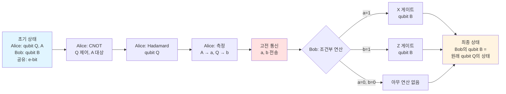
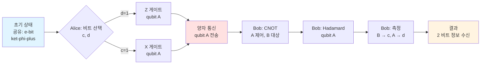
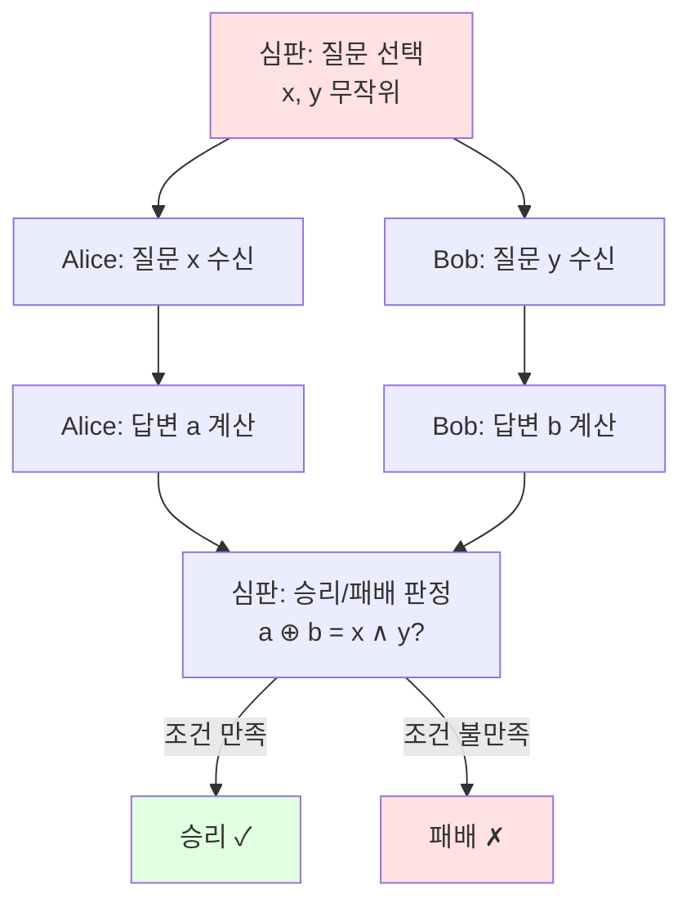

---

description: 이 글은 양자 정보와 계산에 대한 내용으로, 얽힘(entanglement)의 실제 활용에 대해 다룹니다.
tag: ["quantum", "information", "computation", "entanglement"]

---

# Lesson 4: 얽힘의 활용 - 양자 정보와 계산 이해하기

이 글은 양자 정보와 계산에 대한 네 번째 강의로, 얽힘(entanglement)을 활용한 세 가지 중요한 예시를 다룹니다: 양자 순간이동(quantum teleportation), 초밀도 코딩(superdense coding), 그리고 CHSH 게임입니다.

## Alice와 Bob

Alice와 Bob은 정보 교환이 포함된 시스템, 프로토콜, 게임에서 가상의 개체나 에이전트에 주어진 이름입니다.

- Alice와 Bob은 서로 다른 위치에 있다고 가정됩니다.
- 그들이 수행하는 구체적인 역할은 상황에 따라 명확히 해야 합니다.
- 필요에 따라 추가 인물(예: Charlie, Diane, Eve, Mallory)을 도입할 수 있습니다.

::: tip 용어 설명: Alice와 Bob
- **의미**: 정보 교환 프로토콜에서 사용되는 표준 가상 인물 이름
- **발음**: "앨리스"와 "밥"
- **역할**: 
  - Alice: 일반적으로 송신자(sender) 역할
  - Bob: 일반적으로 수신자(receiver) 역할
- **사용**: 암호학, 양자 정보, 게임 이론 등 다양한 분야에서 사용됩니다.
:::

## 얽힘에 대한 설명

Lesson 2에서 우리는 두 qubit의 얽힌 상태(entangled state)의 예시를 만났습니다:

$$
\left|\phi^{+}\right\rangle=\frac{1}{\sqrt{2}}|00\rangle+\frac{1}{\sqrt{2}}|11\rangle
$$

또한 두 비트의 확률적 상태(probabilistic state)의 예시도 만났습니다:

$$
\frac{1}{2}|00\rangle+\frac{1}{2}|11\rangle
$$

양자 정보와 계산 연구에서 일반적으로 얽힘을 다양한 작업을 수행하는 데 사용할 수 있는 자원(resource)으로 봅니다.

이렇게 할 때, 상태 $\left|\phi^{+}\right\rangle$를 e-bit (이비트)라고 불리는 얽힘의 한 단위를 나타내는 것으로 봅니다.

### 용어

Alice와 Bob이 e-bit을 공유한다는 것은 Alice가 qubit A를 가지고 있고, Bob이 qubit B를 가지고 있으며, 함께 쌍 $(A, B)$가 상태 $\left|\phi^{+}\right\rangle$에 있다는 것을 의미합니다.

::: tip 용어 설명: e-bit (이비트)
- **의미**: Entanglement bit의 약자로, 얽힘의 한 단위를 나타냅니다
- **발음**: "이비트" 또는 "e-bit"
- **정의**: Bell 상태 $\left|\phi^{+}\right\rangle = \frac{1}{\sqrt{2}}|00\rangle+\frac{1}{\sqrt{2}}|11\rangle$가 1 e-bit을 나타냅니다
- **특징**: 두 qubit의 물리적 상태이지만, 얽힘의 양은 1 e-bit입니다
:::

<details>
<summary>Qiskit 구현 예제</summary>

다음은 Qiskit을 사용하여 얽힘의 활용에 대한 아이디어를 구현한 예제입니다.

```python
from qiskit import QuantumCircuit, QuantumRegister, ClassicalRegister
from qiskit_aer import AerSimulator
from qiskit.visualization import plot_histogram, array_to_latex
from qiskit.result import marginal_distribution
from qiskit.circuit.library import UGate
from numpy import pi, random
```

이 노트북에서는 양자 순간이동, 초밀도 코딩, CHSH 게임을 Qiskit으로 구현하는 방법을 다룹니다.

</details>

## 양자 순간이동 (Quantum Teleportation)

양자 순간이동(quantum teleportation) 또는 단순히 순간이동(teleportation)은 송신자(Alice)가 공유된 얽힌 양자 상태(구체적으로는 1 e-bit)와 두 비트의 고전 통신을 사용하여 qubit을 수신자(Bob)에게 전송하는 프로토콜입니다.

### 시나리오

Alice가 Bob에게 전송하고자 하는 qubit $Q$를 가지고 있습니다.

- Alice는 $Q$를 물리적으로 Bob에게 보낼 수 없습니다 — 고전 정보만 보낼 수 있습니다.
- Alice와 Bob은 e-bit을 공유합니다.

### 주의사항

- $Q$의 상태는 Alice와 Bob 모두에게 "알려지지 않았습니다".
- $Q$와 다른 시스템 간의 상관관계(얽힘 포함)는 전송에 의해 보존되어야 합니다.
- 복제 불가 정리(no-cloning theorem)는 Bob이 전송을 받으면, Alice가 더 이상 원래 상태의 qubit을 가질 수 없음을 의미합니다.

### 프로토콜

#### 초기 조건

Alice와 Bob은 1 e-bit을 공유합니다: Alice는 qubit A를 가지고 있고, Bob은 qubit B를 가지고 있으며, $(A, B)$는 상태 $|\phi^+\rangle$에 있습니다.

Alice는 또한 Bob에게 전송하고자 하는 qubit Q를 가지고 있습니다.

#### 프로토콜 단계

1. Alice는 Controlled-NOT 연산을 수행합니다. 여기서 Q는 제어(control)이고 A는 대상(target)입니다.
2. Alice는 Q에 대해 Hadamard 연산을 수행합니다.
3. Alice는 A와 Q를 측정하여 각각 이진 결과 $a$와 $b$를 얻습니다.
4. Alice는 $a$와 $b$를 Bob에게 보냅니다.
5. Bob은 다음 두 단계를 수행합니다:
   - 5.1 만약 $a = 1$이면, Bob은 qubit B에 X 연산을 적용합니다.
   - 5.2 만약 $b = 1$이면, Bob은 qubit B에 Z 연산을 적용합니다.



#### Bob이 수행하는 연산

| 연산 | 조건 |
| --- | --- |
| $\mathbb{I}$ | $ab = 00$인 경우 |
| $Z$ | $ab = 01$인 경우 |
| $X$ | $ab = 10$인 경우 |
| $ZX$ | $ab = 11$인 경우 |

### 분석

초기 상태를 $|\pi_0\rangle$라고 하면:

$$
\begin{aligned}
|\pi_0\rangle &= \frac{\alpha|000\rangle + \alpha|110\rangle + \beta|001\rangle + \beta|111\rangle}{\sqrt{2}} \\
|\pi_1\rangle &= \frac{\alpha|000\rangle + \alpha|110\rangle + \beta|011\rangle + \beta|101\rangle}{\sqrt{2}} \\
|\pi_2\rangle &= \frac{\alpha|00\rangle|+\rangle + \alpha|11\rangle|+\rangle + \beta|01\rangle|-\rangle + \beta|10\rangle|-\rangle}{\sqrt{2}}
\end{aligned}
$$

Hadamard 게이트 적용 후:

$$
\begin{aligned}
|\pi_{2}\rangle & =\frac{\alpha|00\rangle\left|+\right\rangle+\alpha|11\rangle\left|+\right\rangle+\beta|01\rangle\left|-\right\rangle+\beta|10\rangle\left|-\right\rangle}{\sqrt{2}} \\
& =\frac{\alpha|00\rangle(|0\rangle+|1\rangle)+\alpha|11\rangle(|0\rangle+|1\rangle)+\beta|01\rangle(|0\rangle-|1\rangle)+\beta|10\rangle(|0\rangle-|1\rangle)}{2} \\
& =\frac{\alpha|000\rangle+\alpha|001\rangle+\alpha|110\rangle+\alpha|111\rangle+\beta|010\rangle-\beta|011\rangle+\beta|100\rangle-\beta|101\rangle}{2} \\
& =\frac{1}{2}(\alpha|0\rangle+\beta|1\rangle)|00\rangle+\frac{1}{2}(\alpha|0\rangle-\beta|1\rangle)|01\rangle+\frac{1}{2}(\alpha|1\rangle+\beta|0\rangle)|10\rangle+\frac{1}{2}(\alpha|1\rangle-\beta|0\rangle)|11\rangle
\end{aligned}
$$

측정 확률:

$$
\begin{aligned}
\operatorname{Pr}(ab=00)&=\frac{1}{4}\|\alpha|0\rangle+\beta|1\rangle\|^{2}=\frac{1}{4} \\
\operatorname{Pr}(ab=01)&=\frac{1}{4}\|\alpha|0\rangle-\beta|1\rangle\|^{2}=\frac{1}{4} \\
\operatorname{Pr}(ab=10)&=\frac{1}{4}\|\alpha|1\rangle+\beta|0\rangle\|^{2}=\frac{1}{4} \\
\operatorname{Pr}(ab=11)&=\frac{1}{4}\|\alpha|1\rangle-\beta|0\rangle\|^{2}=\frac{1}{4}
\end{aligned}
$$

모든 경우에 대해, Bob이 적절한 보정 연산을 수행한 후, qubit B는 원래 qubit Q의 상태 $\alpha|0\rangle + \beta|1\rangle$를 가지게 됩니다.

::: tip 용어 설명: Quantum Teleportation (양자 순간이동)
- **의미**: 공유된 얽힘과 고전 통신을 사용하여 qubit을 전송하는 프로토콜
- **발음**: "양자 순간이동" 또는 "quantum teleportation"
- **요구사항**: 
  - 1 e-bit의 공유 얽힘
  - 2 비트의 고전 통신
- **결과**: qubit의 양자 정보가 완벽하게 전송됨
:::

<details>
<summary>양자 순간이동 상세 설명</summary>

양자 순간이동은 양자 정보를 전송하는 프로토콜입니다. 이 프로토콜의 핵심은:

1. **알려지지 않은 상태 전송**: qubit Q의 상태는 Alice와 Bob 모두에게 알려지지 않았습니다.
2. **상관관계 보존**: Q가 다른 시스템과 얽혀 있다면, 그 상관관계도 보존됩니다.
3. **복제 불가**: No-cloning theorem에 의해, 전송 후 Alice는 더 이상 원래 상태를 가지지 않습니다.

프로토콜이 작동하는 이유는 측정 결과가 완전히 무작위이기 때문입니다. Alice의 측정 결과는 Q의 상태에 대한 정보를 제공하지 않으며, 따라서 Q의 상태가 방해받지 않고 Bob에게 전송될 수 있습니다.

</details>

## 초밀도 코딩 (Superdense Coding)

초밀도 코딩(superdense coding)은 어떤 의미에서 순간이동과 상호 보완적인 목표를 달성하는 프로토콜입니다. 순간이동이 1 e-bit의 얽힘 비용으로 2 비트의 고전 통신을 사용하여 1 qubit을 전송하는 것을 허용하는 반면, 초밀도 코딩은 1 e-bit의 비용으로 1 qubit의 양자 통신을 사용하여 2 비트의 고전 통신을 전송하는 것을 허용합니다.

### 프로토콜

Alice와 Bob은 1 e-bit의 얽힘을 공유합니다: Alice는 qubit $\mathsf{A}$를 가지고 있고, Bob은 qubit $\mathsf{B}$를 가지고 있으며, 쌍 $(\mathsf{A},\mathsf{B})$는 상태 $|\phi^+\rangle$에 있습니다.

Alice는 Bob에게 전송하고자 하는 두 고전 비트를 $c$와 $d$로 표기하며, 이를 1 qubit을 보내서 달성할 것입니다.

### Alice의 동작

1. 만약 $d=1$이면, Alice는 qubit $\mathsf{A}$에 $Z$ 게이트를 수행합니다 (그리고 $d=0$이면 수행하지 않습니다).
2. 만약 $c=1$이면, Alice는 qubit $\mathsf{A}$에 $X$ 게이트를 수행합니다 (그리고 $c=0$이면 수행하지 않습니다).

그런 다음 Alice는 qubit $\mathsf{A}$를 Bob에게 보냅니다.

### Bob의 동작

Bob이 qubit $\mathsf{A}$를 받으면, 먼저 Controlled-NOT 게이트를 수행합니다. 여기서 $\mathsf{A}$는 제어이고 $\mathsf{B}$는 대상입니다. 그런 다음 $\mathsf{A}$에 Hadamard 게이트를 적용합니다. 그런 다음 $\mathsf{B}$를 측정하여 $c$를 얻고, $\mathsf{A}$를 측정하여 $d$를 얻습니다. 두 경우 모두 표준 기저 측정을 사용합니다.



### 분석

이 프로토콜의 아이디어는 간단합니다: Alice는 효과적으로 Bob과 공유하고 싶은 Bell 상태를 선택하고, Bob에게 qubit을 보내면, Bob은 측정하여 Alice가 선택한 Bell 상태를 결정합니다.

즉, 그들은 초기에 $|\phi^+\rangle$를 공유하며, 비트 $c$와 $d$에 따라 Alice는 qubit $\mathsf{A}$에 $\mathbb{I}$, $X$, $Z$, 또는 $XZ$를 적용하여 이 상태를 그대로 두거나 다른 Bell 상태 중 하나로 이동시킵니다.

$$
\begin{aligned}
(\mathbb{I} \otimes \mathbb{I}) |\phi^+ \rangle & = |\phi^+\rangle \\
(\mathbb{I} \otimes Z) |\phi^+ \rangle & = |\phi^-\rangle \\
(\mathbb{I} \otimes X) |\phi^+ \rangle & = |\psi^+\rangle \\
(\mathbb{I} \otimes XZ) |\phi^+ \rangle & = |\psi^-\rangle
\end{aligned}
$$

Bob의 동작은 네 가지 Bell 상태에 대해 다음과 같은 효과를 가집니다:

$$
\begin{aligned}
|\phi^+\rangle & \mapsto |00\rangle\\
|\phi^-\rangle & \mapsto |01\rangle\\
|\psi^+\rangle & \mapsto |10\rangle\\
|\psi^-\rangle & \mapsto -|11\rangle\\
\end{aligned}
$$

따라서 Bob이 측정을 수행하면 Alice가 선택한 Bell 상태를 결정할 수 있습니다.

::: tip 용어 설명: Superdense Coding (초밀도 코딩)
- **의미**: 1 qubit의 양자 통신으로 2 비트의 고전 정보를 전송하는 프로토콜
- **발음**: "초밀도 코딩" 또는 "superdense coding"
- **요구사항**: 
  - 1 e-bit의 공유 얽힘
  - 1 qubit의 양자 통신
- **결과**: 2 비트의 고전 정보 전송
- **이론적 배경**: Holevo's theorem에 따르면, 공유 얽힘 없이는 1 qubit으로 1 비트 이상의 고전 정보를 전송할 수 없습니다.
:::

<details>
<summary>초밀도 코딩 상세 설명</summary>

초밀도 코딩은 얽힘을 활용하여 고전 정보의 전송 용량을 두 배로 늘리는 프로토콜입니다. 

**Holevo's theorem (홀레보 정리)**: 공유 얽힘 상태를 사용하지 않으면, 단일 qubit을 보내서 1 비트 이상의 고전 정보를 전송하는 것은 불가능합니다. Holevo's theorem은 더 일반적이지만, 이것은 그 결과 중 하나입니다.

따라서 초밀도 코딩을 통해 공유 얽힘은 qubit을 보내는 것의 고전 정보 전달 용량을 효과적으로 *두 배*로 만듭니다.

</details>

## CHSH 게임

이 강의에서 논의할 마지막 예시는 프로토콜이 아니라 *CHSH 게임*이라고 불리는 *게임*입니다.

이 맥락에서 게임이라고 말할 때, 우리는 재미나 스포츠를 위해 플레이하는 것을 의미하는 것이 아니라 *게임 이론*의 의미에서 수학적 추상화를 말하는 것입니다.

CHSH라는 글자는 1969년 논문에서 이 예시가 처음 설명된 저자들 — John Clauser, Michael Horne, Abner Shimony, Richard Holt — 을 가리킵니다. 그들은 이 예시를 게임으로 설명하지 않고 실험으로 설명했습니다. 그러나 게임으로의 설명은 자연스럽고 직관적입니다.

CHSH 게임은 *비국소 게임(nonlocal games)*이라고 불리는 게임 클래스에 속합니다.

### 비국소 게임 (Nonlocal Games)

비국소 게임(nonlocal game)은 두 플레이어인 Alice와 Bob이 특정 결과를 달성하기 위해 함께 작동하는 *협력 게임(cooperative game)*입니다. 게임은 Alice와 Bob에게 알려진 엄격한 지침에 따라 행동하는 *심판(referee)*에 의해 실행됩니다.

Alice와 Bob은 게임을 위해 원하는 대로 준비할 수 있지만, 게임이 시작되면 *통신이 금지됩니다*.

비국소 게임이 작동하는 방식은 심판이 먼저 Alice와 Bob에게 각각 질문을 하는 것입니다. $x$는 Alice의 질문을 나타내고 $y$는 Bob의 질문을 나타냅니다. 여기서 $x$와 $y$는 고전 상태로 생각되며, CHSH 게임에서 $x$와 $y$는 비트입니다.

심판은 *무작위성*을 사용하여 이러한 질문을 선택합니다. 정확히 말하면, 각 가능한 질문 쌍 $(x,y)$에 대해 확률 $p(x,y)$가 있으며, 심판은 게임 시점에 이 방식으로 질문을 무작위로 선택하기로 맹세했습니다.

Alice와 Bob이 질문을 받은 후, 그들은 답변을 제공해야 합니다: Alice의 답변은 $a$이고 Bob의 답변은 $b$입니다. 다시 말하지만, 이것들은 일반적으로 고전 상태이며, CHSH 게임에서는 비트입니다.

이 시점에서 심판은 결정을 내립니다: 답변 쌍 $(a,b)$가 질문 쌍 $(x,y)$에 대해 고정된 규칙 집합에 따라 올바른 것으로 간주되는지 여부에 따라 Alice와 Bob은 *승리*하거나 *패배*합니다.



### CHSH 게임 설명

다음은 CHSH 게임의 정확한 설명입니다. 여기서 (위와 같이) $x$는 Alice의 질문, $y$는 Bob의 질문, $a$는 Alice의 답변, $b$는 Bob의 답변입니다:

- 질문과 답변은 모두 비트입니다: $x,y,a,b\in\{0,1\}$.
- 심판은 질문 $(x,y)$를 *균등하게 무작위로* 선택합니다. 즉, 네 가지 가능성 $(0,0)$, $(0,1)$, $(1,0)$, $(1,1)$ 각각이 확률 $1/4$로 선택됩니다.
- 답변 $(a,b)$는 질문 $(x,y)$에 대해 $a\oplus b = x\wedge y$이면 *승리*하고, 그렇지 않으면 *패배*합니다. 다음 표는 각 질문 쌍 $(x,y)$에 대해 답변 $(a,b)$의 승리 및 패배 조건을 나열합니다.

$$
\begin{array}{ccc}
(x,y) & \text{승리} & \text{패배} \\[1mm]\hline
\rule{0mm}{4mm}(0,0) & a = b & a \neq b \\[1mm]
(0,1) & a = b & a \neq b \\[1mm]
(1,0) & a = b & a \neq b \\[1mm]
(1,1) & a \neq b & a = b
\end{array}
$$

### 고전 전략의 한계

#### 결정론적 전략 (Deterministic Strategies)

결정론적 전략(deterministic strategy)에서 Alice의 답변 $a$는 그녀가 받은 질문 $x$의 함수이고, 마찬가지로 Bob의 답변 $b$는 그가 받은 질문 $y$의 함수입니다.

결정론적 전략으로는 CHSH 게임을 항상 이길 수 없습니다. 이를 이해하는 한 가지 방법은 단순히 모든 가능한 결정론적 전략을 하나씩 살펴보고 각각이 네 가지 가능한 질문 쌍 중 적어도 하나에 대해 패배한다는 것을 확인하는 것입니다.

우리는 분석적으로도 이를 추론할 수 있습니다. Alice와 Bob의 전략이 $(x,y) = (0,0)$일 때 승리한다면, $a(0) = b(0)$이어야 합니다. 전략이 $(x,y) = (0,1)$일 때 승리한다면, $a(0) = b(1)$이어야 합니다. 유사하게, 전략이 $(x,y)=(1,0)$에 대해 승리한다면 $a(1) = b(0)$입니다. 따라서 전략이 세 가지 가능성 모두에 대해 승리한다면:

$$
b(1) = a(0) = b(0) = a(1).
$$

이것은 전략이 최종 경우 $(x,y) = (1,1)$에서 패배한다는 것을 의미하며, 여기서 승리하려면 $a(1) \neq b(1)$이 필요합니다. 따라서 항상 이기는 결정론적 전략은 있을 수 없습니다.

반면에, 네 가지 경우 중 세 가지에서 승리하는 결정론적 전략을 찾는 것은 쉽습니다. 예를 들어 $a(0)=a(1)=b(0)=b(1)=0$입니다. 이것으로부터 우리는 결정론적 전략을 사용하여 Alice와 Bob이 승리할 수 있는 최대 확률이 $3/4$라는 결론을 내립니다.

#### 확률적 전략 (Probabilistic Strategies)

결정론적 전략을 사용하여 CHSH 게임을 75%의 시간 동안 이길 수 있는 것보다 더 잘 할 수 없다는 것을 방금 결론지었습니다. 그러나 확률적 전략은 어떻습니까? Alice와 Bob이 무작위성을 사용하는 것이 도움이 될 수 있습니까 — 그들의 무작위 선택이 상관관계를 가질 수 있는 *공유 무작위성(shared randomness)*의 가능성을 포함하여?

확률적 전략은 Alice와 Bob이 승리할 확률을 증가시키는 데 전혀 도움이 되지 않는다는 것이 밝혀졌습니다. 이것은 모든 확률적 전략이 결정론적 전략의 무작위 선택으로 대안적으로 볼 수 있기 때문입니다. 평균은 최대보다 크지 않으므로, 확률적 전략이 전체 승리 확률 측면에서 어떤 이점도 제공하지 않는다는 것이 따릅니다.

따라서 확률 $3/4$로 승리하는 것은 결정론적이든 확률적이든 모든 고전 전략을 사용하여 Alice와 Bob이 할 수 있는 최선입니다.

### CHSH 게임 전략

이 시점에서 자연스러운 질문은 Alice와 Bob이 *양자* 전략을 사용하여 더 잘 할 수 있는지 여부입니다. 특히, 그들이 다음 그림이 제안하는 것처럼 얽힌 양자 상태를 공유한다면, 게임을 플레이하기 전에 준비할 수 있었던 것, 그들이 승리 확률을 증가시킬 수 있습니까?

답은 예이며, 이것이 예시의 주요 요점이고 왜 그것이 매우 흥미로운지입니다.

#### 필요한 벡터와 행렬

먼저 각 실수 $\theta$ (라디안으로 측정된 각도로 생각할 수 있음)에 대해 qubit 상태 벡터 $|\psi_{\theta}\rangle$를 다음과 같이 정의해야 합니다:

$$
|\psi_{\theta}\rangle = \cos(\theta)|0\rangle + \sin(\theta) |1\rangle
$$

일부 간단한 예시:

$$
\begin{aligned}
  |\psi_{0}\rangle & = |0\rangle \\
  |\psi_{\pi/2}\rangle & = |1\rangle \\
  |\psi_{\pi/4}\rangle & = |+\rangle \\
  |\psi_{-\pi/4}\rangle & = |- \rangle
\end{aligned}
$$

일반적인 형태를 보면, 이러한 벡터 중 임의의 두 벡터 사이의 내적은 다음 공식을 가집니다:

$$
\langle \psi_{\alpha} | \psi_{\beta} \rangle
= \cos(\alpha)\cos(\beta) + \sin(\alpha)\sin(\beta)
= \cos(\alpha-\beta).
$$

이러한 벡터 중 임의의 두 벡터의 *텐서 곱*과 $|\phi^+\rangle$ 상태의 내적을 계산하면, 분모에 $\sqrt{2}$가 있는 것을 제외하고는 유사한 표현을 얻습니다:

$$
\langle \psi_{\alpha} \otimes \psi_{\beta} | \phi^+ \rangle
= \frac{\cos(\alpha)\cos(\beta) + \sin(\alpha)\sin(\beta)}{\sqrt{2}}
= \frac{\cos(\alpha-\beta)}{\sqrt{2}}.
$$

다음으로, 각 각도 $\theta$에 대해 유니터리 행렬 $U_{\theta}$를 다음과 같이 정의합니다:

$$
U_{\theta} = |0 \rangle \langle \psi_{\theta} | + |1\rangle\langle \psi_{\theta+\pi/2} |
$$

직관적으로 말하면, 이 행렬은 $|\psi_{\theta}\rangle$를 $|0\rangle$로 변환하고 $|\psi_{\theta + \pi/2}\rangle$를 $|1\rangle$로 변환합니다.

#### 전략 설명

양자 전략을 설명할 수 있습니다:

- **설정**: Alice와 Bob은 게임을 시작할 때 e-bit을 공유합니다: Alice는 qubit $\mathsf{A}$를 가지고 있고, Bob은 qubit $\mathsf{B}$를 가지고 있으며, 두 qubit $(\mathsf{A},\mathsf{B})$는 $|\phi^+\rangle$ 상태에 있습니다.

- **Alice의 동작**:
  - Alice가 질문 $x=0$을 받으면, qubit $\mathsf{A}$에 $U_{0}$를 적용합니다.
  - Alice가 질문 $x=1$을 받으면, qubit $\mathsf{A}$에 $U_{\pi/4}$를 적용합니다.
  
  Alice가 $\mathsf{A}$에 수행하는 연산은 다음과 같이 표현할 수 있습니다:
  
  $$
  \begin{cases}
  U_0 & \text{if $x = 0$}\\
  U_{\pi/4} & \text{if $x = 1$}
  \end{cases}
  $$
  
  Alice가 이 연산을 적용한 후, $\mathsf{A}$를 표준 기저 측정으로 측정하고 답변 $a$를 측정 결과로 설정합니다.

- **Bob의 동작**:
  - Bob이 질문 $y=0$을 받으면, qubit $\mathsf{B}$에 $U_{\pi/8}$를 적용합니다.
  - Bob이 질문 $y=1$을 받으면, qubit $\mathsf{B}$에 $U_{-\pi/8}$를 적용합니다.
  
  Bob이 $\mathsf{B}$에 수행하는 연산은 다음과 같이 표현할 수 있습니다:
  
  $$
  \begin{cases}
  U_{\pi/8} & \text{if $y = 0$}\\
  U_{-\pi/8} & \text{if $y = 1$}
  \end{cases}
  $$
  
  Bob이 이 연산을 적용한 후, $\mathsf{B}$를 표준 기저 측정으로 측정하고 답변 $b$를 측정 결과로 설정합니다.

#### 경우별 분석

네 가지 가능한 질문 쌍을 각각 살펴보면, 이 전략이 모든 경우에 동일한 확률로 작동한다는 것을 알 수 있습니다:

$$
\frac{2 + \sqrt{2}}{4} \approx 0.85.
$$

이것은 따라서 그들이 전체적으로 승리할 확률입니다. 이것은 이 게임에 대해 고전 전략이 할 수 있는 것보다 훨씬 낫습니다. 고전 전략은 승리 확률이 $3/4$로 제한됩니다.

이것은 양자 전략에 대한 *최적* 승리 확률입니다. 즉, 어떤 얽힌 상태나 측정을 선택하더라도 이것보다 더 잘 할 수 없습니다. 이 사실은 *Tsirelson's inequality (치렐손 부등식)*로 알려져 있으며, 이를 처음 증명하고 CHSH 실험을 게임으로 처음 설명한 Boris Tsirelson의 이름을 따서 명명되었습니다.

::: tip 용어 설명: CHSH 게임
- **의미**: 비국소 게임(nonlocal game)의 한 예시로, 얽힘을 사용하면 고전 전략보다 더 높은 승리 확률을 얻을 수 있음을 보여줍니다
- **발음**: "씨에이치에스에이치 게임" 또는 "CHSH game"
- **CHSH**: John Clauser, Michael Horne, Abner Shimony, Richard Holt의 머리글자
- **고전 전략 한계**: 최대 승리 확률 $3/4 = 0.75$
- **양자 전략 성능**: 승리 확률 $\frac{2+\sqrt{2}}{4} \approx 0.85$
- **의의**: Bell test의 한 예시로, 양자 역학이 국소 숨은 변수 이론(local hidden variable theories)과 호환되지 않음을 보여줍니다
:::

::: tip 용어 설명: Tsirelson's inequality (치렐손 부등식)
- **의미**: CHSH 게임에서 양자 전략의 최적 승리 확률을 제한하는 부등식
- **발음**: "치렐손 부등식" 또는 "Tsirelson's inequality"
- **내용**: 양자 전략으로는 $\frac{2+\sqrt{2}}{4}$보다 더 높은 승리 확률을 얻을 수 없습니다
- **증명**: Boris Tsirelson에 의해 처음 증명되었습니다
:::

### CHSH 게임에 대한 설명

CHSH 게임과 같은 실험의 기본 아이디어는 얽힘이 순수한 고전적 추론과 일치하지 않는 통계적 결과로 이어진다는 것으로, Bell 상태의 이름을 딴 John Bell의 것입니다. 이러한 이유로, 사람들은 종종 이러한 종류의 실험을 *Bell test (벨 테스트)*라고 부릅니다.

CHSH 게임은 양자 정보 이론을 실험적으로 테스트하는 방법을 제공합니다. CHSH 게임을 구현하는 실험을 수행하고 위에서 설명한 얽힘 기반 전략을 테스트할 수 있습니다. 이것은 얽힘이 실재한다는 것에 대한 높은 수준의 확신을 제공합니다.

2022년 노벨 물리학상은 이 연구 분야의 중요성을 인정합니다: 상은 얽힌 광자에 대한 Bell test를 통해 얽힘을 관찰한 Alain Aspect, John Clauser (CHSH의 C), Anton Zeilinger에게 수여되었습니다.

<details>
<summary>CHSH 게임 상세 설명</summary>

CHSH 게임은 비국소성(nonlocality)을 보여주는 가장 깨끗하고 간단한 예시 중 하나입니다. 이 게임은:

1. **고전적 한계**: 어떤 고전 전략도 75% 이상의 승리 확률을 얻을 수 없습니다.
2. **양자적 이점**: 얽힘을 사용하면 약 85%의 승리 확률을 얻을 수 있습니다.
3. **최적성**: Tsirelson's inequality에 의해, 이것이 양자 전략으로 얻을 수 있는 최선입니다.

이 게임은 양자 역학이 국소 숨은 변수 이론과 호환되지 않는다는 Bell's theorem의 증명 또는 시연으로 볼 수 있습니다.

</details>

<details>
<summary>Qiskit 구현: 양자 순간이동</summary>

다음은 Qiskit을 사용한 양자 순간이동 프로토콜의 구현 예제입니다:

```python
qubit = QuantumRegister(1, "Q")
ebit0 = QuantumRegister(1, "A")
ebit1 = QuantumRegister(1, "B")
a = ClassicalRegister(1, "a")
b = ClassicalRegister(1, "b")

protocol = QuantumCircuit(qubit, ebit0, ebit1, a, b)

# 순간이동에 사용할 e-bit 준비
protocol.h(ebit0)
protocol.cx(ebit0, ebit1)
protocol.barrier()

# Alice의 연산
protocol.cx(qubit, ebit0)
protocol.h(qubit)
protocol.barrier()

# Alice가 측정하고 Bob에게 고전 비트 전송
protocol.measure(ebit0, a)
protocol.measure(qubit, b)
protocol.barrier()

# Bob이 고전 비트를 사용하여 조건부로 게이트 적용
with protocol.if_test((a, 1)):
    protocol.x(ebit1)
with protocol.if_test((b, 1)):
    protocol.z(ebit1)
```

이 회로는 `barrier`와 `if_test` 함수를 사용합니다. `barrier` 함수는 시각적 분리를 만들고, 실제 하드웨어에서 회로를 실행할 때 컴파일 중에 다양한 단순화와 최적화를 방지합니다. `if_test` 함수는 고전 비트나 레지스터에 따라 조건부로 연산을 적용합니다.

</details>

<details>
<summary>Qiskit 구현: 초밀도 코딩</summary>

다음은 초밀도 코딩 프로토콜의 간단한 구현입니다:

```python
protocol = QuantumCircuit(2)

# 초밀도 코딩에 사용할 e-bit 준비
protocol.h(0)
protocol.cx(0, 1)
protocol.barrier()

# Alice의 연산 (비트 c와 d에 따라)
if d == "1":
    protocol.z(0)
if c == "1":
    protocol.x(0)
protocol.barrier()

# Bob의 동작
protocol.cx(0, 1)
protocol.h(0)
protocol.measure_all()
```

이 프로토콜은 Alice가 두 비트 $c$와 $d$를 전송하기 위해 단일 qubit을 보내는 것을 허용합니다.

</details>

<details>
<summary>Qiskit 구현: CHSH 게임</summary>

CHSH 게임과 위에서 정의한 양자 전략을 Qiskit으로 구현할 수 있습니다:

```python
def chsh_circuit(x, y):
    qc = QuantumCircuit(2, 2)
    
    # e-bit 준비
    qc.h(0)
    qc.cx(0, 1)
    qc.barrier()
    
    # Alice의 동작
    if x == 0:
        qc.ry(0, 0)
    else:
        qc.ry(-pi / 2, 0)
    qc.measure(0, 0)
    
    # Bob의 동작
    if y == 0:
        qc.ry(-pi / 4, 1)
    else:
        qc.ry(pi / 4, 1)
    qc.measure(1, 1)
    
    return qc
```

이 구현은 내장된 $R_y(\theta)$ 게이트를 사용하여 Alice와 Bob의 동작을 수행합니다.

</details>

## 결론

1. **양자 순간이동 (Quantum Teleportation)**: 공유된 얽힘과 고전 통신을 사용하여 qubit을 전송하는 프로토콜
2. **초밀도 코딩 (Superdense Coding)**: 공유된 얽힘과 양자 통신을 사용하여 고전 정보의 전송 용량을 두 배로 늘리는 프로토콜
3. **CHSH 게임**: 얽힘을 사용하면 고전 전략보다 더 높은 성능을 얻을 수 있음을 보여주는 비국소 게임

이 세 가지 예시는 모두 얽힘이 양자 정보와 계산에서 중요한 자원임을 보여줍니다. 특히, 이들은 얽힘이 고전적으로 설명할 수 없는 양자적 상관관계를 나타내는 것을 보여줍니다.

