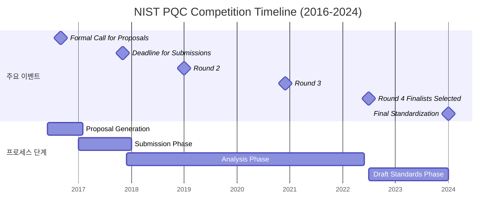

# Lesson 3: NIST 표준화

이 글은 양자 안전(Quantum Safe)에 대한 세 번째 강의로, NIST (National Institute of Standards and Technology, 미국 국립표준기술연구소)의 양자 안전 암호화 표준화 과정에 대해 소개합니다.

## 3.1 개요 및 현재 상태

2017년부터 2022년까지, NIST는 양자 안전 암호화(Key encapsulation mechanism, KEM) 및 디지털 서명 체계에 대한 표준을 생산하기 위해 3라운드의 선택 과정을 거쳤습니다. 보안과 성능을 기준으로 평가된 69개의 초기 제출이 있었습니다. 세 번째 라운드는 2022년 3월 말에 완료되었으며, NIST는 2022년 7월에 표준화를 권장할 새로운 알고리즘의 선택을 발표했습니다.

연구 팀은 수년 동안 양자 안전 암호화에 대해 작업해왔으며, 연구 기관이 학계 및 산업 파트너와 공동 개발한 일부 암호화 체계가 NIST에 의해 최종 후보로 인정된 것을 볼 수 있습니다.

아래 표는 표준화를 위해 선택된 알고리즘을 보여줍니다. CRYSTALS-Kyber, CRYSTALS-Dilithium, FALCON 알고리즘은 연구 기관의 리더십과 기여로 개발되었습니다. Falcon 디지털 서명 알고리즘은 Dilithium 사용이 공간상 제한적인 상황에서 사용할 표준으로 선택되었습니다.

### NIST PQC Competition 타임라인

다음은 NIST PQC Competition의 주요 이벤트와 프로세스 단계를 보여주는 타임라인입니다:

**주요 이벤트:**
- **2016년 9월**: Formal Call for Proposals (공식 제안 요청)
- **2017년 11월**: Deadline for Submissions (제출 마감)
- **2019년 초**: Round 2 (2라운드)
- **2020년 말**: Round 3 (3라운드)
- **2022년 7월**: Round 4 Finalists Selected (4라운드 최종 후보 선정 - 4개 중 3개가 연구 기관 기여)
- **2024년 초**: Final Standardization (최종 표준화)

**프로세스 단계:**
- **Proposal Generation (제안 생성)**: 2016년 중반 ~ 2017년 초
- **Submission Phase (제출 단계)**: 2017년 초 ~ 2017년 말/2018년 초
- **Analysis Phase (분석 단계)**: 2017년 말/2018년 초 ~ 2022년 중반
- **Draft Standards Phase (초안 표준 단계)**: 2022년 중반 ~ 2024년 초

### NIST PQC 표준화 상태 (2023년 7월 기준)

최종 표준은 2024년 초에 예상됩니다. 그 동안 두 가지 관련 활동이 진행 중입니다:

1. **추가 KEM에 대한 4라운드**: NIST 경쟁의 일부였던 알고리즘들이 표준화를 위해 추가로 분석되고 있습니다. 이러한 알고리즘은 CRYSTALS-Kyber와 다른 수학적 문제에 기반합니다.

2. **추가 서명 알고리즘에 대한 새로운 요청**: 동시에 추가 서명 알고리즘에 대한 새로운 요청이 발행되었습니다. [40개 제출의 초기 목록](https://csrc.nist.gov/Projects/pqc-dig-sig/round-1-additional-signatures)이 2023년 7월에 공개되었습니다. 이러한 알고리즘은 NIST와 더 넓은 암호화 커뮤니티에 의해 추가로 분석될 것이며, 이 과정은 몇 년 동안 지속될 것으로 예상됩니다.

이 새로운 요청에서 NIST는 주로 구조화된 격자에 기반하지 않은 추가 범용 서명 체계에 관심이 있습니다. 짧은 서명과 빠른 서명 생성 및 검증을 가진 서명 체계가 고려됩니다. 이는 일부 애플리케이션에 유리하기 때문입니다. 예를 들어, 서명 작업은 스마트카드와 같은 계산적으로 제한된 장치에서 수행될 수 있습니다. 또는 대량의 트래픽을 처리하는 서버가 클라이언트 서명을 검증하는 데 계산 리소스의 상당 부분을 소비해야 할 수 있습니다.

연구 기관은 새로운 디지털 서명 요청에 대해 3개의 제출을 공동 작성했습니다:
- 다변수 이차 방정식에 기반한 두 가지 체계: [UOV](https://www.uovsig.org/), [MAYO](https://pqmayo.org/)
- 초특이 동형(supersingular isogenies)에 기반한 한 가지 체계: [SQIsign](https://csrc.nist.gov/csrc/media/Projects/pqc-dig-sig/round-1/spec-files/sqisign-spec-web.pdf)

## 3.2 Kyber & Dilithium 기초

연구 기관이 공동 개발한 두 가지 알고리즘이 NIST 경쟁의 3라운드 말에 표준화를 위한 주요 알고리즘으로 선택되었습니다: CRYSTALS-Kyber key encapsulation mechanism (키 캡슐화 메커니즘)과 CRYSTALS-Dilithium digital signature algorithm (디지털 서명 알고리즘).

[CRYSTALS-Kyber](https://pq-crystals.org/kyber)와 [CRYSTALS-Dilithium](https://pq-crystals.org/dilithium)은 ARM Limited의 Roberto Avanzi, NXP Semiconductors의 Joppe Bos, CWI Amsterdam의 Léo Ducas, Ruhr University Bochum의 Eike Kiltz, SRI International의 Tancrède Lepoint, 연구 기관의 Vadim Lyubashevsky와 Gregor Seiler, University of Waterloo의 John M. Schanck, MPI-SP & Radboud University의 Peter Schwabe, ENS Lyon의 Damien Stehle에 의해 NIST에 제출되었습니다. (*제출 당시 소속 기관)

**CRYSTALS-Kyber:**
- Kyber는 "module lattices (모듈 격자)에 대한 LWE 문제를 해결하는 어려움에 기반한 보안을 가진 key encapsulation mechanism (키 캡슐화 메커니즘, KEM)"이며, "CRYSTALS (Cryptographic Suite for Algebraic Lattices, 대수 격자용 암호화 제품군)" 알고리즘 제품군의 일부입니다
- 온라인 통신에서 공통 대칭 키를 설정하는 데 사용할 수 있는 알고리즘입니다

**CRYSTALS-Dilithium:**
- Dilithium도 CRYSTALS 알고리즘으로, "보안이 module lattices (모듈 격자)에 대한 격자 문제의 어려움에 유사하게 기반한 디지털 서명 체계"입니다
- Dilithium은 키 및 서명 크기와 키 생성, 서명, 검증 알고리즘의 효율성 측면에서 균형 잡힌 성능을 가지며, 실제 애플리케이션에서도 잘 작동합니다

이 알고리즘에 대해 더 자세히 알고 싶다면 다음 비디오를 시청할 수 있습니다:

<VidStack
  src="youtube.com/UINdiUIp96Y"
  title="CRYSTALS-Kyber and CRYSTALS-Dilithium"
/>

## 3.3 양자 안전 암호화 및 오픈소스 소프트웨어의 채택

양자 안전 암호화를 대규모로 채택하는 것은 수십 년에 걸친 과정이 될 것이지만, 격자 기반 체계는 다양한 제품 및 서비스에 시장에 진입하고 있습니다. 산업 최초의 양자 안전 시스템으로, 주요 시스템은 격자 기반 암호화를 기반으로 합니다. 주요 시스템의 양자 안전 암호화를 통해 기업은 오늘날 애플리케이션과 데이터를 미래에 대비할 수 있습니다. 주요 시스템은 CRYSTALS-Kyber와 CRYSTALS-Dilithium을 키 캡슐화 및 디지털 서명 기능의 기반으로 사용하는 산업 최초의 양자 안전 시스템입니다.

주요 시스템만이 양자 안전 암호화의 사용자가 아닙니다. 양자 안전 암호화는 이미 클라우드에서 사용 가능합니다: 클라우드용 키 보호 서비스는 전송 중 데이터를 보호하기 위한 양자 안전 TLS 모드를 가지고 있습니다. CRYSTALS-Dilithium은 주요 암호화 카드에 통합된 첫 번째 알고리즘이었으며, 최신 버전은 CRYSTALS-Kyber도 지원합니다. 이러한 암호화 카드를 사용하는 제품(예: Hyper Protect Crypto Services (HPCS) 및 EKMF)은 이러한 양자 안전 알고리즘을 사용할 수 있습니다.

[Cloudflare](https://blog.cloudflare.com/securing-thepost-quantum-world/)는 Kyber를 다른 양자 안전 알고리즘과 함께 [CIRCL](https://github.com/cloudflare/circl) (Cloudflare Interoperable, Reusable Cryptographic Library)에 통합했습니다. Amazon은 [AWS Key Management Service](https://aws.amazon.com/blogs/security/round-2-post-quantum-tls-is-now-supported-in-aws-kms/)에서 Kyber를 포함한 하이브리드 모드를 지원합니다. 2019년에는 Kyber와 Dilithium을 사용하는 세계 최초의 양자 컴퓨팅 안전 테이프 드라이브가 도입되었습니다. Kyber는 또한 2020년부터 공개 클라우드 키 관리 서비스인 키 보호 서비스에서 하이브리드 모드로 사용되고 있습니다.

한편, Kyber와 Dilithium의 사전 표준화 버전은 다양한 다른 보안 솔루션에 통합되었으며, 많은 벤더가 고객에게 테스트 및 PoC를 위한 도구로 제공하고 있습니다. 최종화된 NIST 표준이 제공된 직후 제품에서 양자 안전 알고리즘의 광범위한 채택이 예상될 수 있습니다.

양자 안전 암호화의 채택을 가속화할 수 있는 중요한 측면은 오픈소스 암호화 라이브러리로의 통합입니다. 이를 통해 고객과 더 넓은 커뮤니티가 표준화가 완료되기 몇 년 전에 실제 애플리케이션에서 양자 안전 알고리즘 사용을 실험하고 경험을 얻을 수 있습니다.

가장 두드러진 양자 안전 오픈소스 프로젝트 중 하나는 University of Waterloo, 연구 기관, Microsoft Research 및 AWS의 핵심 기여자들이 있는 [Open Quantum Safe](https://openquantumsafe.org/) (OQS) 프로젝트입니다.

**Open Quantum Safe (OQS) 프로젝트 구조:**

OQS는 두 가지 주요 작업 라인으로 구성됩니다:
- **liboqs**: 양자 저항 암호화 알고리즘을 위한 오픈소스 C 라이브러리
- **프로토콜 및 애플리케이션으로의 프로토타입 통합**: 널리 사용되는 OpenSSL 라이브러리를 포함

OQS를 사용하면 다양한 프로토콜 및 데모 애플리케이션에서 양자 안전 암호화를 사용할 수 있습니다. 예를 들어, 양자 안전 웹서버 설정, 양자 안전 VPN 및 SSH 연결 설정, Chromium 브라우저를 사용하여 양자 안전 인증서가 있는 웹서버에 액세스하는 것이 가능합니다. 최근 출시된 Chrome 브라우저(v115부터)도 [Kyber 지원](https://blog.chromium.org/2023/08/protecting-chrome-traffic-with-hybrid.html)을 가지고 있습니다. 위 그림에서 볼 수 있듯이, OQS 스택은 OpenSSL 1.1.1 또는 OpenSSL 3을 사용하는 널리 사용되는 프로토콜 및 애플리케이션에서 양자 안전 알고리즘을 원활하게 통합할 수 있는 가능성을 제공합니다.

### 3.3.1 FALCON, SPHINCS+, XMSS, LMS

**FALCON:**
- Falcon은 또 다른 격자 기반 디지털 서명 알고리즘으로, NTRU 격자에서 짧은 벡터를 찾는 어려움에 기반합니다
- Dilithium과 Falcon은 모두 격자 기반 디지털 서명 알고리즘이지만, 적용 가능성 측면에서 상호 보완적입니다 — Falcon은 더 작은 키와 서명을 가지지만, Dilithium은 구현 및 배포가 더 간단합니다
- Falcon은 Rennes University의 Pierre-Alain Fouque, Brown University의 Jeffrey Hoffstein, École Normale Supérieure Paris 및 UC San Diego의 Paul Kirchner, 연구 기관의 Vadim Lyubashevsky와 Gregor Seiler, Cryptolog International의 Thomas Pornin, PQShield의 Thomas Prest, Thales's Cyber Defence Solutions의 Thomas Ricosset, Qualcomm의 William Whyte, Algorand의 Zhenfei Zhang에 의해 NIST에 제출되었습니다 (*제출 당시 소속 기관)

**SPHINCS+:**
- 세 번째로 선택된 알고리즘인 SPHINCS+는 다른 두 알고리즘보다 다소 크고 느리지만, 한 가지 주요 이유로 백업으로 가치가 있습니다: NIST의 다른 세 가지 선택과 다른 수학적 접근 방식에 기반합니다
- SPHINCS+의 보안은 hash functions (해시 함수)에 기반합니다
- Hash-based algorithms (해시 기반 알고리즘)는 수년 동안 연구되어 왔으며 안전한 것으로 간주되지만, 이 알고리즘은 선택된 두 가지 격자 기반 체계와 비교하여 성능 측면에서의 단점 때문에 범용 서명 알고리즘으로 선택되지 않았습니다
- 표준에 포함됨으로써, 양자 안전 디지털 서명을 위한 기본 수학적 문제의 폭을 달성하는 데 도움이 됩니다

**SPHINCS+의 전신:**
- SPHINCS+의 전신은 stateful hash-based signatures (상태 기반 해시 서명)입니다
- 이것들은 더 빠르고 더 작은 서명을 생성하지만, 사용자가 서명 간에 상태를 유지해야 하며, 상태가 잘못 관리되면 재앙적인 결과를 초래합니다
- 두 가지 [stateful hash-based signature algorithms (상태 기반 해시 서명 알고리즘)](https://csrc.nist.gov/publications/detail/sp/800-208/final), XMSS와 LMS는 NIST에 의해 제한적 사용을 위해 별도로 표준화되었습니다
- 그러나 이 두 알고리즘과 달리 SPHINCS+는 사용자가 서명 간에 어떤 상태도 추적할 필요가 없습니다

### 3.3.2 KEM에 대한 참고 사항

위에서 Kyber가 Key Encapsulation Mechanism (키 캡슐화 메커니즘) 또는 KEM이라는 것을 보았습니다. 이 개념은 종종 Public Key Encryption (공개 키 암호화, PKE) 알고리즘의 개념과 혼동되며, 둘 사이의 차이를 이해하는 것이 유용할 수 있습니다.

**Public Key Encryption (PKE, 공개 키 암호화):**
- PKE 체계는 공개 키와 개인 키 쌍을 가진 것으로, 메시지는 공개 키를 사용하여 암호화되고 개인 키를 사용하여 복호화될 수 있습니다
- PKE는 세 가지 작업으로 구성됩니다:
  1. **Key generation (키 생성)**: 키 쌍을 생성합니다
  2. **Encrypt (암호화)**: 메시지와 공개 키를 입력으로 받아 암호문을 출력합니다
  3. **Decrypt (복호화)**: 암호문과 개인 키를 입력으로 받아 메시지를 출력합니다
- 두 당사자 간의 메시지 암호화에 사용할 수 있습니다

**Key Encapsulation Mechanism (KEM, 키 캡슐화 메커니즘):**
- KEM은 다음 작업으로 구성됩니다:
  1. **Key generation (키 생성)**: 키 쌍을 생성합니다
  2. **Encapsulation (캡슐화)**: 공개 키를 입력으로 받아 대칭 키와 무작위로 선택된 대칭 키를 포함하는 암호문(캡슐화)을 생성합니다
  3. **Decapsulation (디캡슐화)**: 암호문과 개인 키를 입력으로 받아 대칭 키를 출력합니다
- 대칭 키를 캡슐화하는 데 사용할 수 있습니다

**하이브리드 공개 키 암호화:**
- KEM은 AES-GCM과 같은 대칭 암호화 체계와 함께 사용하여 "hybrid public key encryption (하이브리드 공개 키 암호화)" 체계를 생성할 수 있습니다

**Key Exchange (키 교환):**
- KEM은 Key Exchange scheme (KEX, 키 교환 체계)로 변환될 수도 있습니다 — 미래에 매우 두드러질 사용 사례입니다

## 3.4 'Ramp-on' 서명 알고리즘 요청 요약

NIST PQC 경쟁 동안 디지털 서명에 대한 많은 새로운 연구가 있었습니다. 여기에는 다음이 포함됩니다:
- 기존 체계의 개선
- 새로운 설계
- 새로운 공격

NIST의 [추가 디지털 서명](https://csrc.nist.gov/Projects/pqc-dig-sig/round-1-additional-signatures)에 대한 새로운 요청은 이 지식과 경험을 사용하여 더 나은 표준을 달성할 수 있게 해줍니다. 반면, 더 많은 표준화된 디지털 서명 알고리즘을 가지면 기본 하드 문제의 더 다양화된 세트를 가질 수 있습니다.

더욱이, Dilithium과 FALCON이 매우 효율적인 체계임에도 불구하고, 디지털 서명에 대한 양자 안전 암호화와 고전 암호화 사이에는 키 및 서명 크기에서 격차가 있습니다. 이 격차를 줄이면 일부 애플리케이션, 예를 들어 임베디드 시스템의 경우 양자 안전 암호화로의 전환이 더 쉬워질 수 있습니다.

그러나 [NIST](https://nvlpubs.nist.gov/nistpubs/ir/2022/NIST.IR.8413-upd1.pdf)에 따르면: *"새로운 표준화 과정은 사용자가 후양자 알고리즘을 채택하기를 기다려야 한다는 의미로 해석되어서는 안 됩니다."*

연구 기관은 이 새로운 요청에 대해 세 가지 서명 체계를 제출했습니다:

**다변수 이차 방정식에 기반한 두 가지 체계:**
- [UOV](https://www.uovsig.org/)
- [MAYO](https://pqmayo.org/)

**초특이 동형(supersingular isogenies)에 기반한 한 가지 체계:**
- [SQIsign](https://csrc.nist.gov/csrc/media/Projects/pqc-dig-sig/round-1/spec-files/sqisign-spec-web.pdf)

**다변수 방정식 기반 알고리즘:**
- 다변수 이차 방정식 시스템에 대한 해를 찾는 어려움에 기반합니다
- 예를 들어, 다음에서 x와 y를 해결하는 것:
  - $x + 5x^2 + 3xy = 4 \pmod{7}$
  - $x^2 + 5xy + 5y^2 = 1 \pmod{7}$
- 변수의 수가 커질수록 이 문제는 해결하기 매우 어려워집니다

**동형(Isogenies) 기반 알고리즘:**
- 동형은 한 타원 곡선에서 다른 타원 곡선으로의 함수이며, 암호화 체계를 구성하는 데 사용할 수 있습니다

**성능 비교:**
- 다변수 방정식에 기반한 두 가지 체계는 일반적으로 작은 서명을 가진 빠른 속도를 가지지만, 큰 키를 가집니다
- SQIsign은 작은 키(모든 제출 중 가장 작음)와 서명을 가지지만, 느립니다

## 핵심 요약

다음 핵심 사항들을 기억해 두세요:

- NIST는 2017년부터 2022년까지 3라운드의 선택 과정을 거쳐 양자 안전 암호화 표준을 생산했습니다
- CRYSTALS-Kyber, CRYSTALS-Dilithium, FALCON이 표준화를 위해 선택되었습니다
- CRYSTALS-Kyber는 Key Encapsulation Mechanism (KEM)이며, module lattices에 대한 LWE 문제에 기반합니다
- CRYSTALS-Dilithium은 디지털 서명 체계이며, module lattices에 대한 격자 문제에 기반합니다
- FALCON은 Dilithium이 공간상 제한적인 상황에서 사용할 수 있는 더 작은 키와 서명을 가진 디지털 서명 알고리즘입니다
- SPHINCS+는 hash functions에 기반한 백업 디지털 서명 알고리즘입니다
- KEM과 PKE는 다른 개념이며, KEM은 하이브리드 공개 키 암호화에 사용될 수 있습니다
- 양자 안전 암호화는 이미 다양한 제품 및 서비스에 통합되고 있습니다
- Open Quantum Safe (OQS) 프로젝트는 양자 안전 알고리즘의 오픈소스 구현을 제공합니다
- NIST는 추가 서명 알고리즘에 대한 새로운 요청을 발행했으며, 이 과정은 몇 년 동안 지속될 것으로 예상됩니다

