---

description: 이 글은 z/OS의 진화에 대한 내용으로, 매인프레임 컴퓨터의 역사와 발전 과정을 다룹니다.
tag: ["mainframe", "evolution", "history"]

---

# Lesson 1: z/OS의 진화 - 매인프레임 컴퓨터의 역사와 발전 과정

## 개요

이 모듈은 현대 매인프레임 시스템의 진화와, 해당 플랫폼에서 실행되는 운영 체제의 한계를 극복하기 위해 사용하는 개념 및 기능에 대해 논의합니다.

## 학습 목표

이 모듈을 완료한 후, 다음을 수행할 수 있습니다:

- Supervisor의 역할과 주요 기능을 이해하고 설명할 수 있습니다.

- I/O 작업의 구성 요소와 처리 과정을 파악할 수 있습니다.

- 멀티프로그래밍의 핵심 개념과 시스템 구성 요소를 이해할 수 있습니다.

- TSO, VTAM, ISPF의 기능 식별하기
  - TSO(Time Sharing Option), VTAM(Virtual Telecommunications Access Method), ISPF(Interactive System Productivity Facility)의 역할과 기능을 설명할 수 있습니다.

## 초기 컴퓨터 시스템

다음은 초기 컴퓨터 시스템의 표현입니다.


```mermaid
flowchart LR
    CardReadPunch["Card read-punch (카드 리더-펀치)"] -->|데이터 입력| CPU["CPU (중앙 처리 장치) - Central storage 0KB to 16KB"]
    CPU -->|데이터 출력| Printer["Printer (프린터)"]
    
    style CPU fill:#666,color:#fff
    style CardReadPunch fill:#666,color:#fff
    style Printer fill:#666,color:#fff
```

중앙에는 중앙 처리 장치(CPU)가 있습니다. CPU는 프로그램된 명령을 실행하고 산술 및 논리 연산을 수행할 수 있는 능력을 가지고 있습니다.

또한 메모리 또는 중앙 저장소(central storage)를 보유하고 있었습니다. 당시 메모리 비용이 매우 높았기 때문에, 이러한 시스템 중 대부분은 16KB(16,384 바이트) 이상을 보유하지 못했습니다.

- 주변 장치로는 입력을 위한 카드 리더기와 출력을 위한 카드 펀치 및 프린터가 포함되었습니다.

- 운영자는 버튼, 노브, 스위치로 구성된 패널을 사용하여 이 컴퓨터를 제어했다. 상태 정보는 일렬로 배열된 표시등에서 해석해야 했습니다.

- 프로그램을 실행하려면 먼저 펀치 카드에서 메모리로 로드해야 했습니다. 그런 다음 실행이 시작되고 입력 데이터가 추가 카드에서 읽혔습니다. 한 프로그램이 완료된 후에야 다른 프로그램을 로드하여 실행할 수 있었습니다.

## 주변 장치 확장 시스템

테이프 드라이브와 디스크 드라이브가 추가된 컴퓨터 시스템입니다.

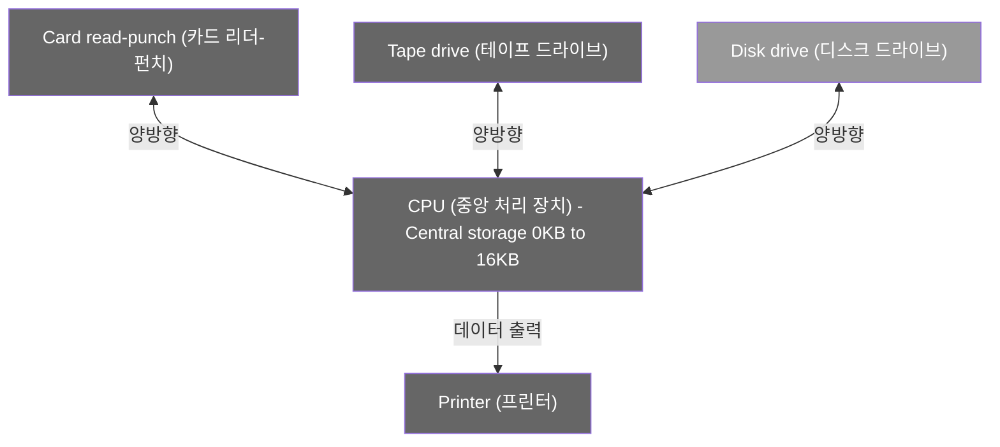
```mermaid
flowchart TB
    CardReadPunch["Card read-punch (카드 리더-펀치)"] <-->|양방향| CPU["CPU (중앙 처리 장치) - Central storage 0KB to 16KB"]
    CPU -->|데이터 출력| Printer["Printer (프린터)"]
    TapeDrive["Tape drive (테이프 드라이브)"] <-->|양방향| CPU
    DiskDrive["Disk drive (디스크 드라이브)"] <-->|양방향| CPU
    
    style CPU fill:#666,color:#fff
    style CardReadPunch fill:#666,color:#fff
    style Printer fill:#666,color:#fff
    style TapeDrive fill:#666,color:#fff
    style DiskDrive fill:#999,color:#fff
```

테이프 드라이브와 디스크 드라이브의 추가로 데이터를 훨씬 빠르게 읽고 쓸 수 있게 되었지만, 프로그램은 이러한 새로운 장치를 사용하기 위해 필요한 추가 로직을 포함해야 했습니다.

특정 유형의 하드웨어에 대한 의존성 때문에 프로그램은 일반적으로 한 컴퓨터에서 다른 컴퓨터로 이식할 수 없었습니다.

## The Supervisor

### IBM System/360 Family

1964년 IBM은 System/360 시리즈의 컴퓨터를 출시했습니다. 이들은 모두 동일한 아키텍처를 기반으로 하여, 한 모델에서 작성한 프로그램이 다른 모델에서도 작동할 수 있었습니다.

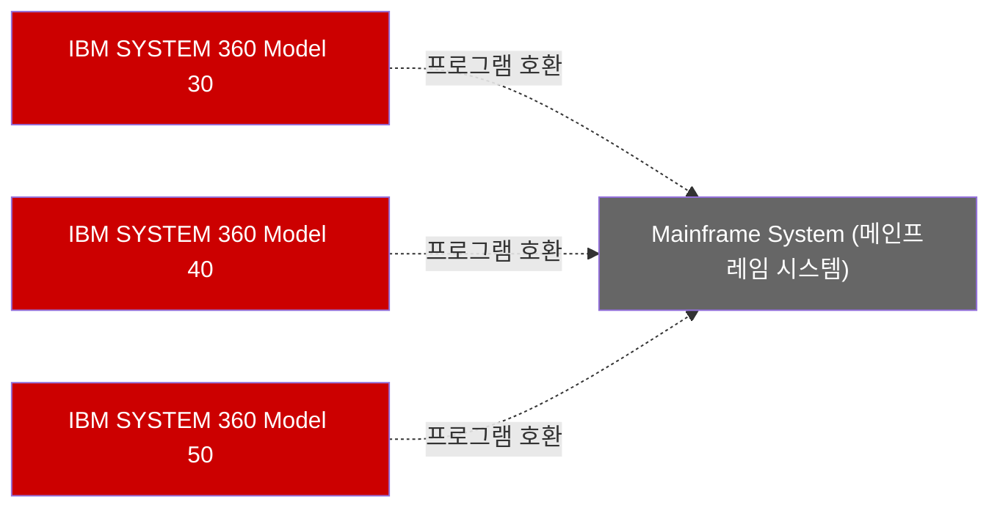
```mermaid
flowchart LR
    Model30["IBM SYSTEM 360 Model 30"]
    Model40["IBM SYSTEM 360 Model 40"]
    Model50["IBM SYSTEM 360 Model 50"]
    
    Mainframe["Mainframe System (메인프레임 시스템)"]
    
    Model30 -.->|프로그램 호환| Mainframe
    Model40 -.->|프로그램 호환| Mainframe
    Model50 -.->|프로그램 호환| Mainframe
    
    style Model30 fill:#c00,color:#fff
    style Model40 fill:#c00,color:#fff
    style Model50 fill:#c00,color:#fff
    style Mainframe fill:#666,color:#fff
```

S/360 아키텍처는 최대 16MB(16,777,216 바이트)의 메모리를 지원했지만, 많은 시스템은 32KB(32,768 바이트)만으로도 실행되었습니다.

### 운영 체제와 Supervisor

하드웨어와 함께 운영 체제가 제공되어 프로그램 실행을 관리하고 다양한 기능을 제공했습니다. 운영 체제의 핵심 구성 요소는 **Supervisor**였습니다.

Supervisor는 다음과 같은 역할을 수행합니다:

- 프로그램 실행 관리
- 시스템 리소스 할당 및 관리
- 입출력 작업 조정
- 멀티프로그래밍 지원

### Supervisor의 구조와 기능

Supervisor는 메모리의 일부 영역에 상주하며 시스템의 모든 하드웨어를 제어합니다.

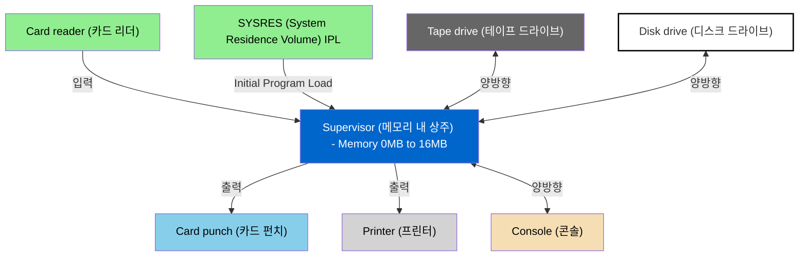
```mermaid
flowchart TB
    Supervisor["Supervisor (메모리 내 상주) - Memory 0MB to 16MB"]
    
    CardReader["Card reader (카드 리더)"] -->|입력| Supervisor
    Supervisor -->|출력| CardPunch["Card punch (카드 펀치)"]
    Supervisor -->|출력| Printer["Printer (프린터)"]
    Supervisor <-->|양방향| Console["Console (콘솔)"]
    
    SYSRES["SYSRES (System Residence Volume) IPL"]
    SYSRES -->|Initial Program Load| Supervisor
    
    TapeDrive["Tape drive (테이프 드라이브)"] <-->|양방향| Supervisor
    DiskDrive["Disk drive (디스크 드라이브)"] <-->|양방향| Supervisor

    style Supervisor fill:#0066cc,color:#fff
    style SYSRES fill:#90ee90,color:#000
    style CardReader fill:#90ee90,color:#000
    style CardPunch fill:#87ceeb,color:#000
    style Printer fill:#d3d3d3,color:#000
    style Console fill:#f5deb3,color:#000
    style TapeDrive fill:#666,color:#fff
    style DiskDrive fill:#fff,stroke:#000,stroke-width:2px
```

### Initial Program Load (IPL)

**Initial Program Load (IPL)** 작업을 통해 Supervisor가 시스템 상주 볼륨(System Residence Volume, SYSRES)에서 메모리로 로드됩니다. Supervisor는 시스템이 활성화되어 있는 동안 메모리의 일부 영역에 상주합니다.

::: tip IPL (Initial Program Load)

System/360 Supervisor를 시스템 상주 볼륨(SYSRES)에서 메모리로 로드하는 작업의 이름은 **IPL** 또는 **Initial Program Load**입니다.

:::

Supervisor는 시스템의 모든 하드웨어를 제어하며, 모든 장치 유형에 필요한 로직을 포함하고 있습니다. 이를 통해 프로그램은 각 장치의 세부 사항을 직접 처리할 필요 없이 Supervisor를 통해 하드웨어에 접근할 수 있습니다.

### Problem Program과 Supervisor Call (SVC)

Supervisor는 애플리케이션 로딩을 제어하며, 이러한 애플리케이션은 **Problem program**이라고 불렸습니다. Problem program은 메모리의 나머지 영역에 로드되고, Supervisor는 프로그램의 입출력에 사용될 **데이터셋(data sets)**을 할당합니다.

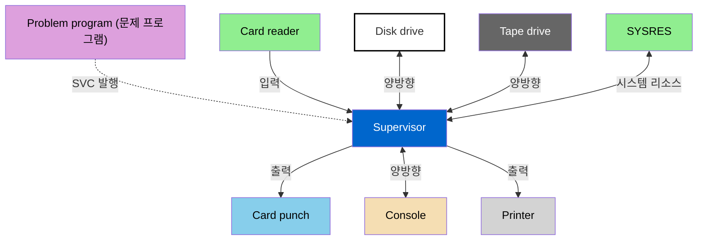
```mermaid
flowchart TB
    ProblemProgram["Problem program (문제 프로그램)"]
    Supervisor["Supervisor"]
    
    ProblemProgram -.->|SVC 발행| Supervisor
    
    CardReader["Card reader"] -->|입력| Supervisor
    DiskDrive["Disk drive"] <-->|양방향| Supervisor
    TapeDrive["Tape drive"] <-->|양방향| Supervisor
    
    Supervisor -->|출력| CardPunch["Card punch"]
    Supervisor <-->|양방향| Console["Console"]
    Supervisor -->|출력| Printer["Printer"]
    
    SYSRES["SYSRES"] <-->|시스템 리소스| Supervisor
    
    style ProblemProgram fill:#dda0dd,color:#000
    style Supervisor fill:#0066cc,color:#fff
    style SYSRES fill:#90ee90,color:#000
    style CardReader fill:#90ee90,color:#000
    style CardPunch fill:#87ceeb,color:#000
    style Printer fill:#d3d3d3,color:#000
    style Console fill:#f5deb3,color:#000
    style TapeDrive fill:#666,color:#fff
    style DiskDrive fill:#fff,stroke:#000,stroke-width:2px
```

#### Supervisor Call (SVC) 프로세스

Problem program이 레코드를 읽거나 쓸 필요가 있을 때, **Supervisor Call (SVC)**를 발행합니다. Supervisor는 필요한 작업을 수행한 후 제어를 Problem program에 반환합니다.

이 프로세스의 주요 특징:

- **표준화된 I/O 작업 요청**: 프로그램은 이제 I/O 작업을 요청하는 표준화된 방법을 갖게 되었습니다.
- **장치별 로직 제거**: 프로그램은 사용하는 모든 장치에 대한 자체 로직을 포함할 필요가 없어졌습니다.
- **프로그램 이식성**: 동일한 Supervisor가 S/360 시리즈의 모든 컴퓨터에서 사용될 수 있으므로, 한 S/360 컴퓨터에서 작성된 프로그램은 다른 S/360 컴퓨터에서도 실행할 수 있습니다.

### System Console

시스템 **Console**이 기존 제어 패널을 대체했습니다. Console은 원래 타자기와 유사한 장치였으며, 이후 시각 표시 장치(**VDU**, Visual Display Unit)와 키보드의 조합으로 발전했습니다.

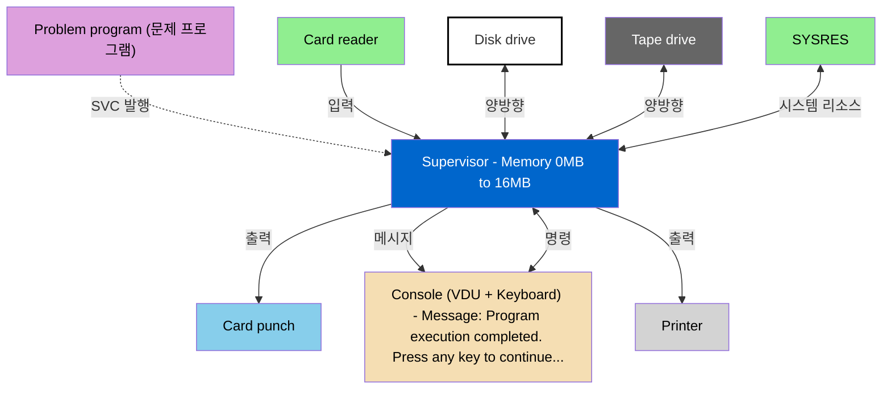
```mermaid
flowchart TB
    ProblemProgram["Problem program (문제 프로그램)"]
    Supervisor["Supervisor - Memory 0MB to 16MB"]
    
    ProblemProgram -.->|SVC 발행| Supervisor
    
    CardReader["Card reader"] -->|입력| Supervisor
    DiskDrive["Disk drive"] <-->|양방향| Supervisor
    TapeDrive["Tape drive"] <-->|양방향| Supervisor
    
    Supervisor -->|출력| CardPunch["Card punch"]
    Supervisor -->|메시지| Console["Console (VDU + Keyboard) - Message: Program execution completed. Press any key to continue..."]
    Supervisor <-->|명령| Console
    Supervisor -->|출력| Printer["Printer"]
    
    SYSRES["SYSRES"] <-->|시스템 리소스| Supervisor
    
    style ProblemProgram fill:#dda0dd,color:#000
    style Supervisor fill:#0066cc,color:#fff
    style SYSRES fill:#90ee90,color:#000
    style CardReader fill:#90ee90,color:#000
    style CardPunch fill:#87ceeb,color:#000
    style Printer fill:#d3d3d3,color:#000
    style Console fill:#f5deb3,color:#000
    style TapeDrive fill:#666,color:#fff
    style DiskDrive fill:#fff,stroke:#000,stroke-width:2px
```

시스템 Console은 Supervisor가 의미 있는 메시지를 표시할 수 있게 하고, 운영자가 Supervisor에 명령을 발행할 수 있게 합니다. 이제 시스템 상태를 표시등 행에서 해석할 필요가 없어졌습니다.

#### Console의 발전

- **초기**: 타자기와 유사한 장치
- **후기**: VDU(Visual Display Unit)와 키보드의 조합
- **기능**: Supervisor 메시지 표시 및 운영자 명령 입력

### Job Control Language (JCL)과 LOADLIB

**Job Control Language (JCL)**는 작업을 정의하고 실행하는 데 사용되는 언어입니다. JCL은 카드 리더에서 읽혀 Supervisor로 전달되며, 작업 이름을 설정하고 프로그램 실행을 지시합니다. JCL은 작업의 각 단계(STEP)에서 실행할 프로그램과 사용할 데이터셋을 지정합니다.

#### LOADLIB (Load Library)

**LOADLIB**는 실행 가능한 프로그램을 저장하고 이름으로 검색할 수 있는 특별한 종류의 디스크 파일입니다. LOADLIB는 종종 SYSRES에 위치하지만, 항상 그런 것은 아닙니다.

#### JCL 처리 과정

다음은 PRINTJOB 작업을 정의하는 JCL 예제입니다:

```jcl
//PRINTJOB JOB
//STEP1 EXEC PGM=PRINTPGM
//INPUT DD DSN=TAPEDS
//STEP2 EXEC PGM=PRINTPGM
//INPUT DD DSN=DISKDS
//OUTPUT DD UNIT=PRINTER
```

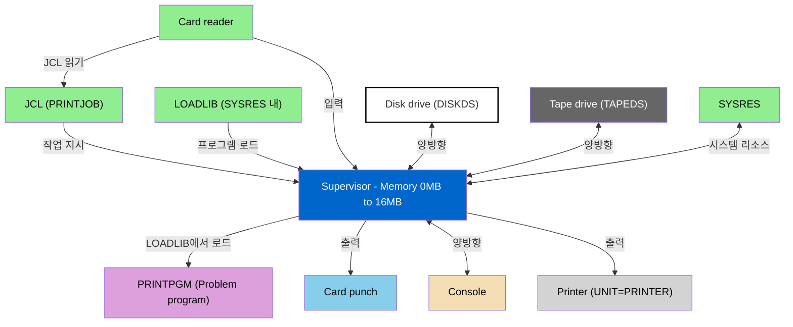
```mermaid
flowchart TB
    JCL["JCL (PRINTJOB)"]
    CardReader["Card reader"] -->|JCL 읽기| JCL
    
    ProblemProgram["PRINTPGM (Problem program)"]
    Supervisor["Supervisor - Memory 0MB to 16MB"]
    
    JCL -->|작업 지시| Supervisor
    Supervisor -->|LOADLIB에서 로드| ProblemProgram
    
    LOADLIB["LOADLIB (SYSRES 내)"]
    LOADLIB -->|프로그램 로드| Supervisor
    
    CardReader -->|입력| Supervisor
    DiskDrive["Disk drive (DISKDS)"] <-->|양방향| Supervisor
    TapeDrive["Tape drive (TAPEDS)"] <-->|양방향| Supervisor
    
    Supervisor -->|출력| CardPunch["Card punch"]
    Supervisor <-->|양방향| Console["Console"]
    Supervisor -->|출력| Printer["Printer (UNIT=PRINTER)"]
    
    SYSRES["SYSRES"] <-->|시스템 리소스| Supervisor
    
    style JCL fill:#90ee90,color:#000
    style ProblemProgram fill:#dda0dd,color:#000
    style Supervisor fill:#0066cc,color:#fff
    style SYSRES fill:#90ee90,color:#000
    style LOADLIB fill:#90ee90,color:#000
    style CardReader fill:#90ee90,color:#000
    style CardPunch fill:#87ceeb,color:#000
    style Printer fill:#d3d3d3,color:#000
    style Console fill:#f5deb3,color:#000
    style TapeDrive fill:#666,color:#fff
    style DiskDrive fill:#fff,stroke:#000,stroke-width:2px
```

#### JCL 처리 순서

1. **JCL 읽기**: 카드 리더에서 JCL이 읽혀 Supervisor로 전달됩니다.
2. **작업 이름 설정**: JCL의 `//PRINTJOB JOB` 문에 의해 작업 이름이 설정됩니다.
3. **프로그램 로드**: Supervisor가 LOADLIB에서 지정된 프로그램(예: `PRINTPGM`)을 로드합니다.
4. **데이터셋 할당**: JCL의 `//INPUT DD` 및 `//OUTPUT DD` 문에 의해 입력/출력 데이터셋이 할당됩니다.
5. **단계별 실행**: 
   - **STEP1**: `PRINTPGM`이 테이프 데이터셋(`TAPEDS`)에서 레코드를 읽어 처리합니다.
   - **STEP2**: `PRINTPGM`이 디스크 데이터셋(`DISKDS`)에서 레코드를 읽어 프린터(`UNIT=PRINTER`)로 출력합니다.

#### Supervisor의 혁신적 기여

Supervisor의 혁신으로 인해:

- **다단계 작업 실행**: 단일 작업 내에서 여러 프로그램을 순차적으로 실행할 수 있게 되었습니다.
- **프로그램 저장소**: 프로그램을 더 이상 카드에서 읽을 필요 없이 LOADLIB에 저장된 프로그램을 이름으로 로드할 수 있게 되었습니다.
- **데이터셋 관리**: JCL을 통해 입력/출력 데이터셋을 명시적으로 지정할 수 있게 되었습니다.

::: tip System/360 요약

System/360에서의 주요 개념:

- **프로그램 로드**: 프로그램은 디스크 파일(LOADLIB)에서 로드될 수 있었습니다.
- **Console**: 운영자는 Console을 사용하여 의미 있는 메시지를 읽고 명령을 발행했습니다.
- **Supervisor**: Supervisor는 시스템의 모든 하드웨어를 제어했습니다.
- **JCL**: JCL은 프로그램이 입력과 출력에 사용할 데이터셋을 지정했습니다.
- **SVC**: 프로그램이 레코드를 읽거나 쓸 필요가 있을 때, SVC(Supervisor Call)를 발행했습니다.

:::

## Input/Output Fundamentals

### Channel의 역할

S/360의 입출력 작업은 대부분 `Channel`에 의해 수행되었습니다. Channel은 CPU 중앙 저장소에 직접 접근할 수 있는 특수 프로세서로, I/O 작업을 CPU와 독립적으로 수행할 수 있습니다.

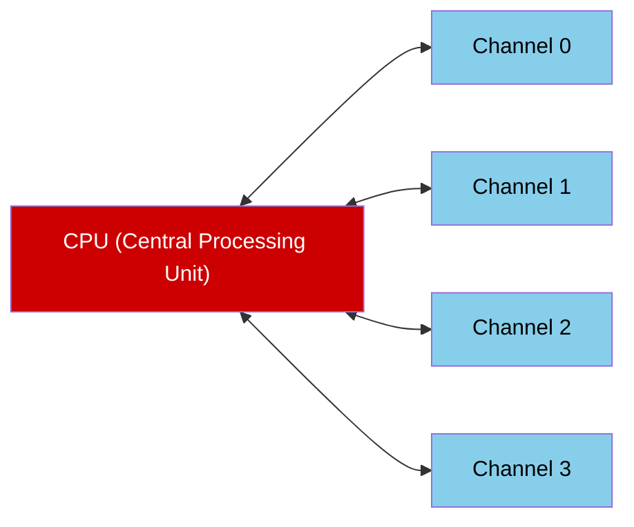
```mermaid
flowchart LR
    CPU["CPU (Central Processing Unit)"]
    
    Channel0["Channel 0"]
    Channel1["Channel 1"]
    Channel2["Channel 2"]
    Channel3["Channel 3"]
    
    CPU <--> Channel0
    CPU <--> Channel1
    CPU <--> Channel2
    CPU <--> Channel3
    
    style CPU fill:#c00,color:#fff
    style Channel0 fill:#87ceeb,color:#000
    style Channel1 fill:#87ceeb,color:#000
    style Channel2 fill:#87ceeb,color:#000
    style Channel3 fill:#87ceeb,color:#000
```

#### Channel 주소 체계

각 Channel은 주소를 가지며, 이 주소는 0부터 15까지의 값을 가집니다. 주소는 `16진수(hexadecimal)`로 표현되며, Channel 주소 범위는 0부터 F(15)까지입니다. 시스템에는 최대 16개의 Channel이 있을 수 있습니다.

### I/O 계층 구조

CPU는 Channel을 통해 주변 장치에 접근합니다. 이 구조는 다음과 같은 계층으로 구성됩니다:

- **CPU** → **Channel** → **Control Unit (CU)** → **Unit (장치)**

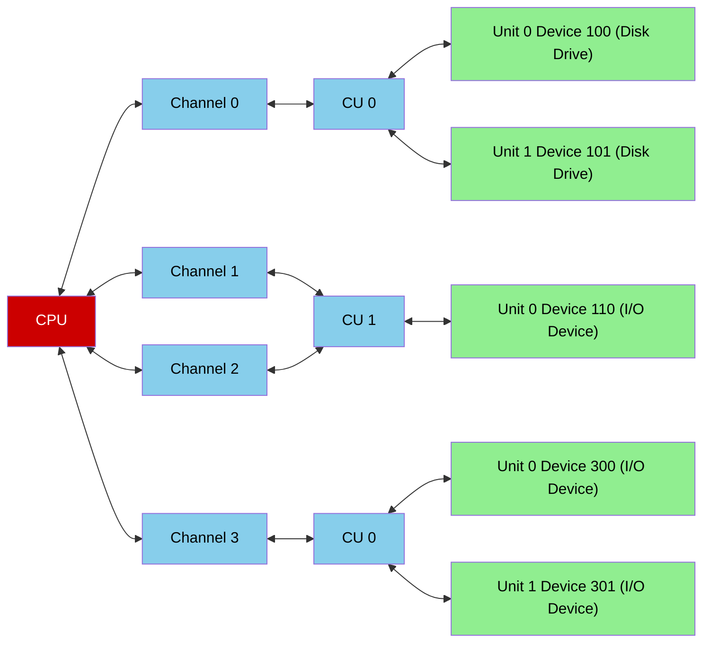
```mermaid
flowchart LR
    CPU["CPU"]
    
    Channel0["Channel 0"]
    Channel1["Channel 1"]
    Channel2["Channel 2"]
    Channel3["Channel 3"]
    
    CU0_Top["CU 0"]
    CU1["CU 1"]
    CU0_Bottom["CU 0"]
    
    Device100["Unit 0 Device 100 (Disk Drive)"]
    Device101["Unit 1 Device 101 (Disk Drive)"]
    Device110["Unit 0 Device 110 (I/O Device)"]
    Device300["Unit 0 Device 300 (I/O Device)"]
    Device301["Unit 1 Device 301 (I/O Device)"]
    
    CPU <--> Channel0
    CPU <--> Channel1
    CPU <--> Channel2
    CPU <--> Channel3
    
    Channel0 <--> CU0_Top
    Channel1 <--> CU1
    Channel2 <--> CU1
    Channel3 <--> CU0_Bottom
    
    CU0_Top <--> Device100
    CU0_Top <--> Device101
    CU1 <--> Device110
    CU0_Bottom <--> Device300
    CU0_Bottom <--> Device301
    
    style CPU fill:#c00,color:#fff
    style Channel0 fill:#87ceeb,color:#000
    style Channel1 fill:#87ceeb,color:#000
    style Channel2 fill:#87ceeb,color:#000
    style Channel3 fill:#87ceeb,color:#000
    style CU0_Top fill:#87ceeb,color:#000
    style CU1 fill:#87ceeb,color:#000
    style CU0_Bottom fill:#87ceeb,color:#000
    style Device100 fill:#90ee90,color:#000
    style Device101 fill:#90ee90,color:#000
    style Device110 fill:#90ee90,color:#000
    style Device300 fill:#90ee90,color:#000
    style Device301 fill:#90ee90,color:#000
```

::: tip I/O 구성 요소 요약

I/O 시스템의 주요 구성 요소와 역할:

| 구성 요소 | 설명 |
|---------|------|
| **Channel** | CPU 중앙 저장소에 접근할 수 있는 특수 프로세서 |
| **Control Unit** | 장치 유형(디스크, 테이프 등)에 따라 다른 종류가 있는 제어 장치 |
| **Unit** | 개별 입출력 장치 |
| **Status** | I/O 작업의 성공 또는 실패를 나타내는 지표 |

:::

### Control Unit과 장치

#### Control Unit (CU)

Channel은 `Control Unit (CU)`에 연결됩니다. Control Unit은 장치 유형(예: 디스크, 테이프)에 따라 다른 종류가 있습니다.

#### Unit (장치)

Control Unit은 개별 장치인 `Unit`에 연결됩니다. 각 Unit은 실제 입출력 장치(디스크 드라이브, 테이프 드라이브 등)를 나타냅니다.

### 장치 주소 체계

각 Channel, Control Unit, Unit은 각각 자신의 한 자리 16진수 주소를 가집니다. 특정 Unit의 완전한 `장치 주소(Device Address)`는 Channel 주소, CU 주소, Unit 주소를 조합하여 형성됩니다. 장치 주소는 3자리 16진수로 표현되며, 첫 번째 자리는 Channel, 두 번째 자리는 Control Unit, 세 번째 자리는 Unit을 나타냅니다.

예를 들어 (다이어그램 참조):
- **Device 100**: Channel 0, CU 0, Unit 0 (16진수 주소: 000)
- **Device 101**: Channel 0, CU 0, Unit 1 (16진수 주소: 001)
- **Device 110**: Channel 1, CU 1, Unit 0 (16진수 주소: 110)
- **Device 300**: Channel 3, CU 0, Unit 0 (16진수 주소: 300)
- **Device 301**: Channel 3, CU 0, Unit 1 (16진수 주소: 301)

참고: 실제 시스템에서는 장치 주소가 3자리 16진수로 표현되며, 위 예시는 다이어그램의 구조를 설명하기 위한 것입니다.

이 주소 체계를 통해 Supervisor는 시스템의 모든 입출력 장치를 고유하게 식별하고 제어할 수 있습니다.

### I/O 작업 프로세스

I/O 작업은 순차적인 단계를 통해 수행됩니다. Supervisor가 레코드를 읽거나 쓸 필요가 있을 때, 다음과 같은 프로세스가 진행됩니다:

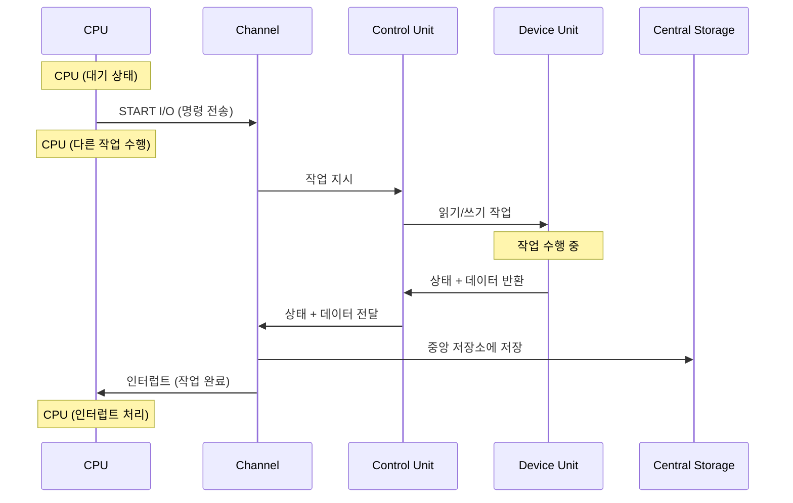
```mermaid
sequenceDiagram
    participant CPU
    participant Channel
    participant CU as Control Unit
    participant Device as Device Unit
    participant Storage as Central Storage
    
    Note over CPU: CPU (대기 상태)
    CPU->>Channel: START I/O (명령 전송)
    Note over CPU: CPU (다른 작업 수행)
    Channel->>CU: 작업 지시
    CU->>Device: 읽기/쓰기 작업
    Note over Device: 작업 수행 중
    Device->>CU: 상태 + 데이터 반환
    CU->>Channel: 상태 + 데이터 전달
    Channel->>Storage: 중앙 저장소에 저장
    Channel->>CPU: 인터럽트 (작업 완료)
    Note over CPU: CPU (인터럽트 처리)
```

#### I/O 작업 단계

1. **CPU (대기 상태)**: CPU는 I/O 작업 요청을 대기합니다.

2. **CPU (명령 전송)**: Supervisor가 레코드를 읽거나 쓸 필요가 있을 때, START I/O 명령을 통해 적절한 Channel에 일련의 명령을 전송합니다.

3. **CPU (다른 작업 수행)**: I/O 작업이 Channel, Control Unit, Device Unit을 통해 진행되는 동안, CPU는 다른 작업을 수행할 수 있습니다.

4. **I/O 작업 수행**: 
   - Channel은 Control Unit (CU)에 특정 장치에서 작업을 시작하도록 지시합니다.
   - Control Unit은 지정된 장치(Unit)에서 실제 읽기 또는 쓰기 작업을 수행합니다.

5. **상태 및 데이터 저장**: 작업이 완료되면, **상태(status)** (성공 또는 실패)와 함께 데이터가 Channel로 반환되고, Channel은 이를 중앙 저장소(central storage)에 저장합니다.

6. **CPU (인터럽트 처리)**: Channel은 **인터럽트(interrupt)**를 CPU에 발행하여 작업이 완료되었음을 알립니다. CPU는 인터럽트를 처리하여 I/O 작업 결과를 확인합니다.

::: tip 인터럽트의 역할

인터럽트(interruption)는 I/O 작업이 완료되었음을 Supervisor에 알리기 위해 발생합니다.

:::

#### I/O 프로세스의 특징

- **비동기 처리**: I/O 작업은 CPU가 다른 작업을 수행하는 동안 병렬로 진행됩니다.
- **인터럽트 기반**: 작업 완료는 인터럽트를 통해 비동기적으로 알려집니다.
- **상태 관리**: 각 I/O 작업의 성공 또는 실패 상태가 명확하게 관리됩니다.

I/O 서브시스템은 진화해왔지만, I/O 작업의 기본적인 동작 방식은 크게 유사하게 유지되고 있습니다.

## Multiprogramming

### Multiprogramming의 도입 배경

초기 시스템에서는 I/O 작업이 진행되는 동안 CPU가 유휴 상태로 남아있었습니다. I/O 작업이 완료될 때까지 기다리는 동안 CPU는 할 일이 없어, 전체 시간의 절반 이상을 유휴 상태로 보내는 경우가 많았습니다. 이는 비용이 높은 리소스의 낭비였습니다.

Multiprogramming은 CPU의 유휴 시간을 줄이고 효율성을 높여 비용 대비 효과를 개선하기 위해 도입되었습니다.

### PRINTPGM 작업 프로세스 예시

PRINTPGM 프로그램이 입력을 받아 프린터로 출력하기까지의 과정은 다음과 같습니다:

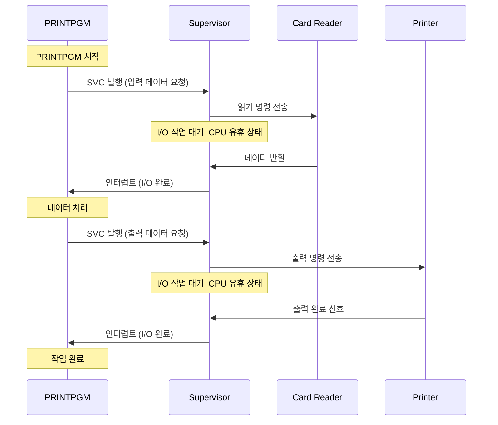
```mermaid
sequenceDiagram
    participant PRINTPGM
    participant Supervisor
    participant CardReader as Card Reader
    participant Printer
    
    Note over PRINTPGM: PRINTPGM 시작
    PRINTPGM->>Supervisor: SVC 발행 (입력 데이터 요청)
    Supervisor->>CardReader: 읽기 명령 전송
    Note over Supervisor: I/O 작업 대기, CPU 유휴 상태
    CardReader->>Supervisor: 데이터 반환
    Supervisor->>PRINTPGM: 인터럽트 (I/O 완료)
    Note over PRINTPGM: 데이터 처리
    PRINTPGM->>Supervisor: SVC 발행 (출력 데이터 요청)
    Supervisor->>Printer: 출력 명령 전송
    Note over Supervisor: I/O 작업 대기, CPU 유휴 상태
    Printer->>Supervisor: 출력 완료 신호
    Supervisor->>PRINTPGM: 인터럽트 (I/O 완료)
    Note over PRINTPGM: 작업 완료
```

#### 작업 단계

1. **PRINTPGM 시작**: 프로그램이 실행을 시작합니다.

2. **입력 요청 (SVC)**: PRINTPGM이 입력 데이터가 필요하여 Supervisor Call (SVC)을 발행합니다.

3. **Supervisor가 I/O 시작**: Supervisor가 Card Reader에서 데이터를 읽기 위한 I/O 작업을 시작합니다.

4. **I/O 작업 대기**: I/O 작업이 진행되는 동안 CPU는 유휴 상태가 됩니다. 단일 프로그램만 실행하는 경우, 이 시간 동안 CPU는 다른 작업을 수행할 수 없습니다.

5. **I/O 완료 및 인터럽트**: I/O 작업이 완료되면 인터럽트가 발생하여 CPU에 알립니다.

6. **데이터 처리**: PRINTPGM이 읽은 데이터를 처리합니다.

7. **출력 요청 (SVC)**: PRINTPGM이 처리된 데이터를 프린터로 출력하기 위해 SVC를 발행합니다.

8. **Supervisor가 출력 시작**: Supervisor가 Printer로 데이터를 출력하기 위한 I/O 작업을 시작합니다.

9. **I/O 작업 대기**: 출력 작업이 진행되는 동안 다시 CPU가 유휴 상태가 됩니다. (단일 프로그램 실행 시)

10. **I/O 완료 및 인터럽트**: 출력 작업이 완료되면 인터럽트가 발생합니다.

11. **작업 완료**: 모든 작업이 완료됩니다.

### Multiprogramming의 필요성

위 프로세스에서 볼 수 있듯이, 단일 프로그램만 실행하는 경우 I/O 작업이 진행되는 동안 CPU가 유휴 상태로 남아있게 됩니다. Multiprogramming은 여러 프로그램을 메모리에 동시에 로드하여, 한 프로그램이 I/O 작업을 대기하는 동안 다른 프로그램이 CPU를 사용할 수 있도록 합니다. 이를 통해 CPU의 활용률을 크게 향상시킬 수 있습니다.

### Region과 메모리 분할

Multiprogramming 환경을 만들기 위해, 사용 가능한 중앙 저장소(central storage)는 **Region**으로 나뉘어졌습니다. 각 Region은 하나의 Problem Program을 포함할 수 있습니다.

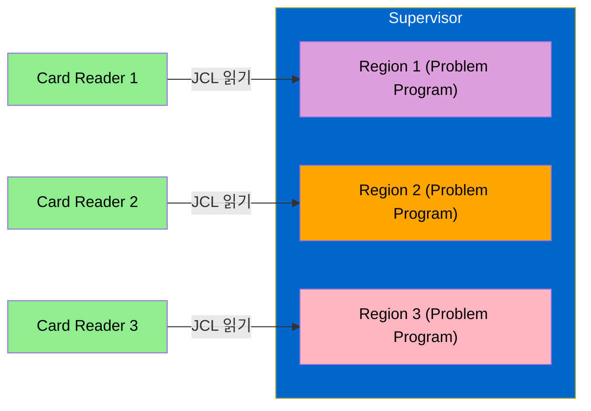
```mermaid
flowchart LR
    CardReader1["Card Reader 1"]
    CardReader2["Card Reader 2"]
    CardReader3["Card Reader 3"]
    
    subgraph Supervisor["Supervisor"]
        Region1["Region 1 (Problem Program)"]
        Region2["Region 2 (Problem Program)"]
        Region3["Region 3 (Problem Program)"]
    end
    
    CardReader1 -->|JCL 읽기| Region1
    CardReader2 -->|JCL 읽기| Region2
    CardReader3 -->|JCL 읽기| Region3
    
    style Supervisor fill:#0066cc,color:#fff
    style Region1 fill:#dda0dd,color:#000
    style Region2 fill:#ffa500,color:#000
    style Region3 fill:#ffb6c1,color:#000
    style CardReader1 fill:#90ee90,color:#000
    style CardReader2 fill:#90ee90,color:#000
    style CardReader3 fill:#90ee90,color:#000
```

각 Card Reader에서 읽은 JCL은 Supervisor에게 해당 Region에 LOADLIB에서 프로그램을 로드하도록 지시합니다.

### Region에서의 I/O 작업

Region에 로드된 프로그램은 I/O 작업을 수행할 수 있습니다. 예를 들어, Region 1의 프로그램이 Tape drive를 호출하는 경우:

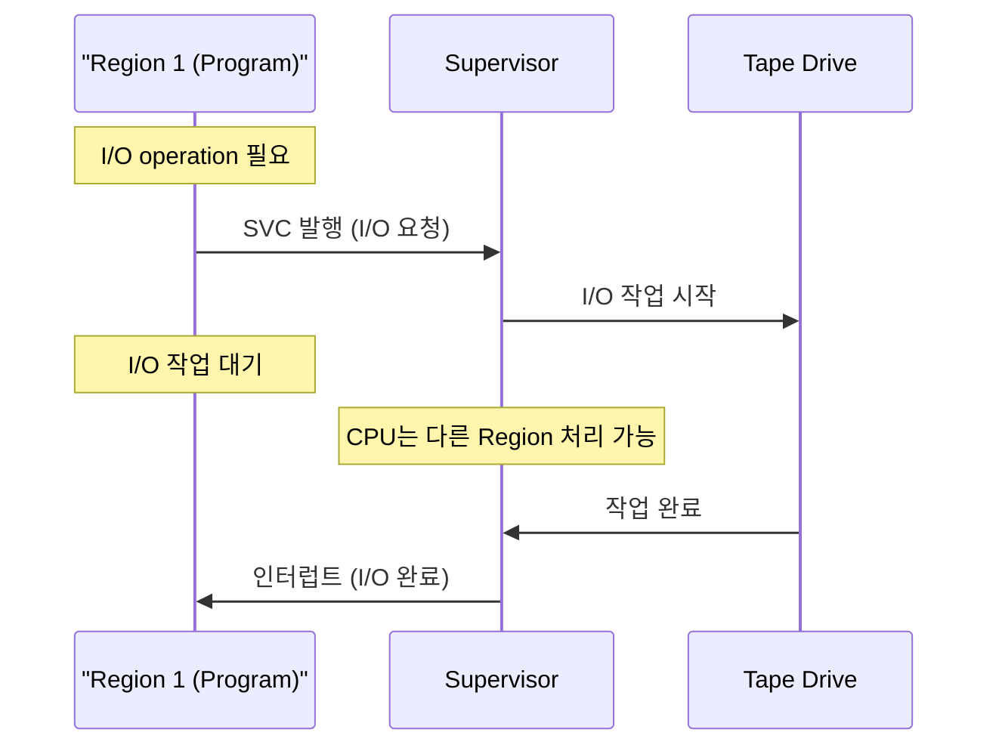
```mermaid
sequenceDiagram
    participant R1 as "Region 1 (Program)"
    participant Supervisor
    participant TapeDrive as Tape Drive
    
    Note over R1: I/O operation 필요
    R1->>Supervisor: SVC 발행 (I/O 요청)
    Supervisor->>TapeDrive: I/O 작업 시작
    Note over R1: I/O 작업 대기
    Note over Supervisor: CPU는 다른 Region 처리 가능
    TapeDrive->>Supervisor: 작업 완료
    Supervisor->>R1: 인터럽트 (I/O 완료)
```

### Multiprogramming의 핵심 개념

Multiprogramming의 핵심 개념은 **한 프로그램이 I/O 요청 완료를 기다리는 동안, CPU가 다른 프로그램의 명령을 처리할 수 있다**는 것입니다.

하나의 I/O 작업을 수행하는 시간 동안, CPU는 **수천 개의 기계 명령(machine instructions)**을 실행할 수 있습니다. 이는 CPU의 활용률을 극대화하는 핵심 메커니즘입니다.

::: tip Multiprogramming의 핵심 개념

Multiprogramming의 핵심 개념은 한 프로그램이 I/O 요청 완료를 기다리는 동안, CPU가 다른 프로그램의 명령을 처리할 수 있다는 것입니다.

:::

### I/O 장치 공유와 제약

#### 디스크 공유

디스크는 프로그램 간에 공유될 수 있습니다. 단, 동시에 같은 데이터셋에 쓰기를 시도하지 않는 한 여러 프로그램이 같은 디스크를 사용할 수 있습니다.

#### 순차 장치의 문제

테이프와 카드 펀치와 같은 순차 장치(sequential devices)는 일부 문제를 제시합니다:

- **테이프와 카드 펀치**: 사용 빈도가 낮은 경우 필요에 따라 하나의 Region 또는 다른 Region에 할당할 수 있습니다.

- **카드 리더**: 각 Region은 일반적으로 카드 리더와 같은 입력 장치가 필요합니다. JCL을 읽기 위해 각 Region에 카드 리더가 할당되어야 합니다.

- **프린터**: 거의 모든 프로그램이 프린터를 사용하므로, 여러 Region이 동시에 프린터에 접근해야 합니다.

#### 장치 비용의 제약

이러한 I/O 장치들의 비용은 Multiprogramming에 심각한 제약을 가합니다. 각 Region에 필요한 장치를 모두 제공하는 것은 비용이 매우 높기 때문에, 실제로 실행할 수 있는 Region의 수는 사용 가능한 I/O 장치의 수에 의해 제한됩니다.

## SPOOL (Simultaneous Peripheral Operations OnLine)

### SPOOL의 도입 배경

SPOOL(Simultaneous Peripheral Operations OnLine)의 도입은 시스템 하드웨어를 더 효율적이고 비용 효율적으로 사용할 수 있게 했습니다. SPOOL은 카드 리더와 프린터의 필요성으로 인한 Multiprogramming 제약을 완화하는 데 도움을 주었습니다.

### JES (Job Entry Subsystem)

`JES (Job Entry Subsystem)`는 작업 입력 및 출력을 관리하는 서브시스템입니다.

#### JES의 시작

JES는 `started task`로 시작됩니다. Started task는 일반 사용자 작업과 달리 시스템 초기화 시 자동으로 시작되거나, 운영자의 `START` 명령을 통해 콘솔에서 수동으로 시작됩니다.

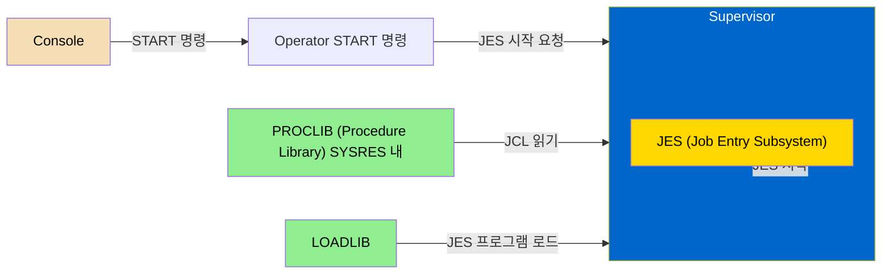
```mermaid
flowchart LR
    Console["Console"]
    Operator["Operator START 명령"]
    PROCLIB["PROCLIB (Procedure Library) SYSRES 내"]
    LOADLIB["LOADLIB"]
    
    subgraph Supervisor["Supervisor"]
        JES["JES (Job Entry Subsystem)"]
    end
    
    Console -->|START 명령| Operator
    Operator -->|JES 시작 요청| Supervisor
    PROCLIB -->|JCL 읽기| Supervisor
    LOADLIB -->|JES 프로그램 로드| Supervisor
    Supervisor -->|JES 시작| JES
    
    style Supervisor fill:#0066cc,color:#fff
    style JES fill:#ffd700,color:#000
    style Console fill:#f5deb3,color:#000
    style PROCLIB fill:#90ee90,color:#000
    style LOADLIB fill:#90ee90,color:#000
```

필요한 JCL은 특별한 프로시저 라이브러리(**PROCLIB**, Procedure Library)에서 읽히며, 이는 종종 SYSRES에 위치합니다. JES 프로그램 자체는 LOADLIB에서 읽혀집니다.

#### JES에 할당되는 장치

JES가 로드된 후, Supervisor는 다음을 JES에 할당합니다:

- 모든 카드 리더
- 모든 카드 펀치
- 모든 프린터
- 디스크의 SPOOL 데이터셋

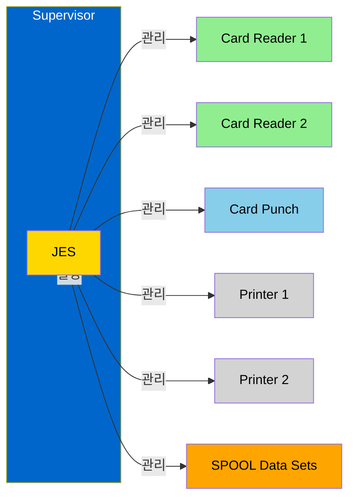
```mermaid
flowchart LR
    CardReader1["Card Reader 1"]
    CardReader2["Card Reader 2"]
    CardPunch["Card Punch"]
    subgraph Supervisor["Supervisor"]
        JES["JES"]
    end
    Printer1["Printer 1"]
    Printer2["Printer 2"]
    SPOOL["SPOOL Data Sets"]
    
    Supervisor -->|할당| JES
    JES -->|관리| CardReader1
    JES -->|관리| CardReader2
    JES -->|관리| CardPunch
    JES -->|관리| Printer1
    JES -->|관리| Printer2
    JES -->|관리| SPOOL
    
    style Supervisor fill:#0066cc,color:#fff
    style JES fill:#ffd700,color:#000
    style CardReader1 fill:#90ee90,color:#000
    style CardReader2 fill:#90ee90,color:#000
    style CardPunch fill:#87ceeb,color:#000
    style Printer1 fill:#d3d3d3,color:#000
    style Printer2 fill:#d3d3d3,color:#000
    style SPOOL fill:#ffa500,color:#000
```

### JCL 입력 및 스풀링

JCL이 카드 리더를 통해 입력되면, JES는 다음을 수행합니다:

1. JCL 명령문을 **SPOOL**에 복사합니다.
2. 각 작업에 JCL에서 가져온 이름과 고유 번호를 할당합니다.

예를 들어, JCL에 `//PRINTJOB JOB`가 있으면, 스풀에 할당된 이름은 "PRINTJOB"이 됩니다.

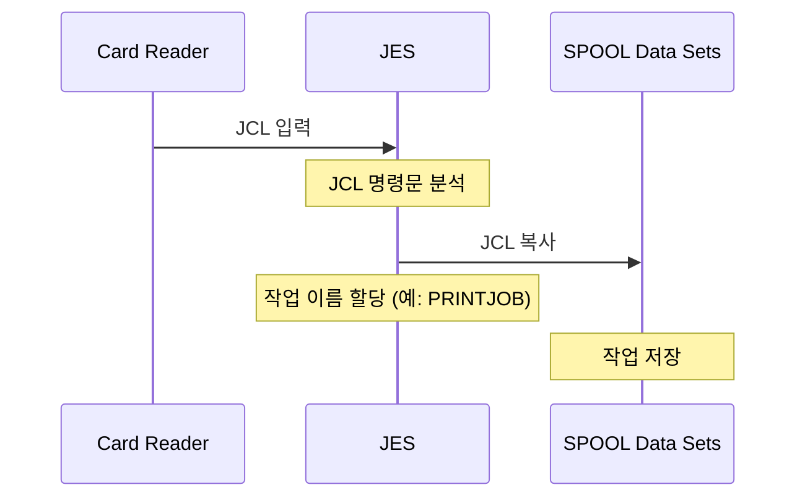
```mermaid
sequenceDiagram
    participant CardReader as Card Reader
    participant JES
    participant SPOOL as SPOOL Data Sets
    
    CardReader->>JES: JCL 입력
    Note over JES: JCL 명령문 분석
    JES->>SPOOL: JCL 복사
    Note over JES: 작업 이름 할당 (예: PRINTJOB)
    Note over SPOOL: 작업 저장
```

### Region에서 스풀 읽기

Supervisor가 사용 가능한 Region을 할당하면, JES는 스풀에서 대기 중인 작업의 JCL을 읽습니다. 이는 마치 카드 리더에서 읽는 것처럼 동작합니다. 그런 다음 Supervisor가 지정된 프로그램을 LOADLIB에서 로드하여 실행을 시작합니다.

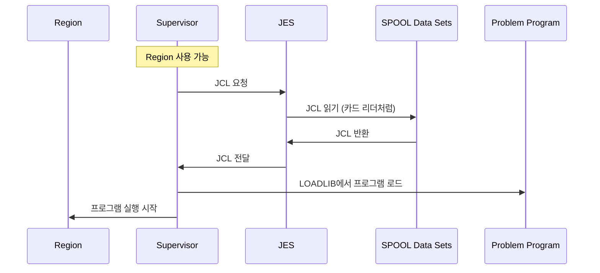
```mermaid
sequenceDiagram
    participant Region as Region
    participant Supervisor
    participant JES
    participant SPOOL as SPOOL Data Sets
    participant Program as Problem Program
    
    Note over Supervisor: Region 사용 가능
    Supervisor->>JES: JCL 요청
    JES->>SPOOL: JCL 읽기 (카드 리더처럼)
    SPOOL->>JES: JCL 반환
    JES->>Supervisor: JCL 전달
    Supervisor->>Program: LOADLIB에서 프로그램 로드
    Supervisor->>Region: 프로그램 실행 시작
```

### 출력 스풀링

프로그램이 프린터에 쓰기를 시도할 때, Supervisor는 이를 **spooled device**로 인식하고 요청을 JES에 전달합니다.

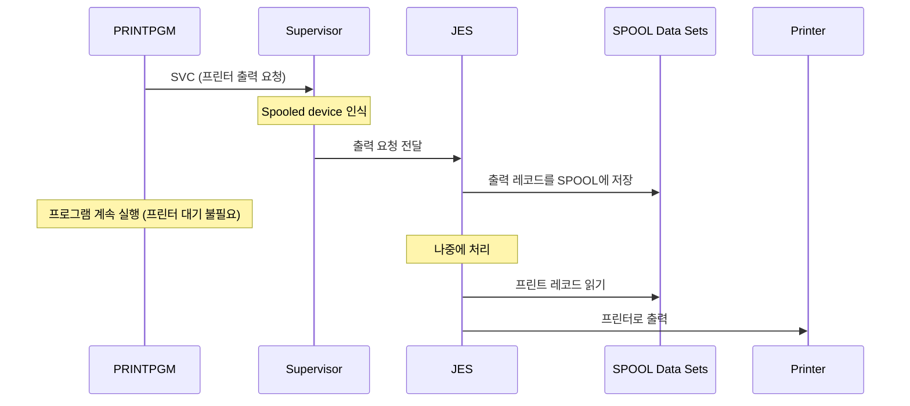
```mermaid
sequenceDiagram
    participant Program as PRINTPGM
    participant Supervisor
    participant JES
    participant SPOOL as SPOOL Data Sets
    participant Printer
    
    Program->>Supervisor: SVC (프린터 출력 요청)
    Note over Supervisor: Spooled device 인식
    Supervisor->>JES: 출력 요청 전달
    JES->>SPOOL: 출력 레코드를 SPOOL에 저장
    Note over Program: 프로그램 계속 실행 (프린터 대기 불필요)
    Note over JES: 나중에 처리
    JES->>SPOOL: 프린트 레코드 읽기
    JES->>Printer: 프린터로 출력
```

#### 상태 정보 처리

I/O 작업과 관련된 상태 정보는 먼저 JES로 전달됩니다. JES는 필요한 경우 이 상태 정보를 조정한 후 프로그램에 전달합니다.

#### 카드 I/O 스풀링

카드 리더에서 읽기나 카드 펀치에 쓰기와 같은 카드 I/O 작업에도 유사한 기술(스풀링)이 사용됩니다.

### JES의 출력 관리

프로그램 목록이 스풀에 기록된 후, JES는 이를 자동으로 프린터로 전달할 수 있습니다. 운영자는 JES에 명령을 발행하여 목록의 방향을 제어하고, 인쇄 프로세스가 원활하고 효율적으로 진행되도록 할 수 있습니다.

::: tip JES의 역할

JES는 SPOOL에서 프린트 레코드를 읽어 프린터에 씁니다.

:::

### SPOOL의 장점

SPOOL의 도입은 다음과 같은 많은 장점을 가져왔습니다:

1. **카드 이미지 재사용**: 카드 이미지를 이제 스풀에서 검색할 수 있게 되어 카드 펀치가 더 이상 필요하지 않게 되었습니다.

2. **카드 리더 감소**: 새로운 프로그램과 JCL은 여전히 카드 리더를 통해 입력되어야 하지만, SPOOL을 통해 여러 Region이 하나의 카드 리더를 공유할 수 있게 되었습니다.

3. **디스크 쓰기 속도**: 디스크에 쓰는 것이 프린터에 쓰는 것보다 훨씬 빠릅니다.

4. **작업 완료 시간 단축**: 목록을 생성하는 작업이 더 빨리 완료됩니다.

5. **프린터 공유**: 각 작업에 전용 프린터가 더 이상 필요하지 않습니다.

SPOOL을 통해 시스템은 I/O 장치의 제약을 극복하고 Multiprogramming의 효율성을 크게 향상시킬 수 있게 되었습니다.

## Virtual Storage

### Virtual Storage의 도입 배경

운영 체제에 더 많은 기능과 시설이 추가되고 프로그램이 계속 커지면서, 저장소 부족으로 인해 많은 프로그램을 동시에 실행하는 것이 어렵거나 불가능해졌습니다. 

이 문제에 대한 해결책은 1970년대 초 IBM이 System/370 아키텍처에 **Virtual Storage**라는 새로운 기능을 추가하면서 등장했습니다.

Virtual Storage는 많은 프로그램을 동시에 실행할 때 발생하는 저장소 부족을 극복하기 위해 도입되었습니다.

### Virtual Storage의 개념

**Virtual Storage**는 프로그램이 보는 메모리입니다. 이는 4KB 페이지 단위로 측정됩니다.

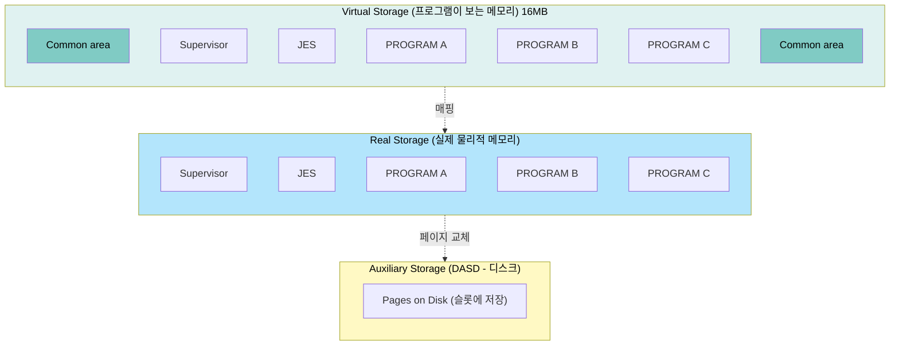
```mermaid
flowchart TB
    subgraph Virtual["Virtual Storage (프로그램이 보는 메모리) 16MB"]
        direction TB
        CommonTop["Common area"]
        Supervisor["Supervisor"]
        JES["JES"]
        ProgramA["PROGRAM A"]
        ProgramB["PROGRAM B"]
        ProgramC["PROGRAM C"]
        CommonBottom["Common area"]
    end
    
    subgraph Real["Real Storage (실제 물리적 메모리)"]
        direction TB
        RealSupervisor["Supervisor"]
        RealJES["JES"]
        RealProgramA["PROGRAM A"]
        RealProgramB["PROGRAM B"]
        RealProgramC["PROGRAM C"]
    end
    
    subgraph Auxiliary["Auxiliary Storage (DASD - 디스크)"]
        DiskPages["Pages on Disk (슬롯에 저장)"]
    end
    
    Virtual -.->|매핑| Real
    Real -.->|페이지 교체| Auxiliary
    
    style Virtual fill:#e0f2f1,color:#000
    style Real fill:#b3e5fc,color:#000
    style Auxiliary fill:#fff9c4,color:#000
    style CommonTop fill:#80cbc4,color:#000
    style CommonBottom fill:#80cbc4,color:#000
```

### 페이지(Page), 프레임(Frame), 슬롯(Slot)

프로그램이 사용하는 공간은 **4KB 단위**로 나뉘며, 이를 **페이지(Page)**라고 합니다.

- **페이지(Page)**: 프로그램 공간을 4KB 단위로 나눈 것
- **프레임(Frame)**: 메모리에 있는 페이지를 저장하는 공간
- **슬롯(Slot)**: 디스크에 있는 페이지를 저장하는 공간

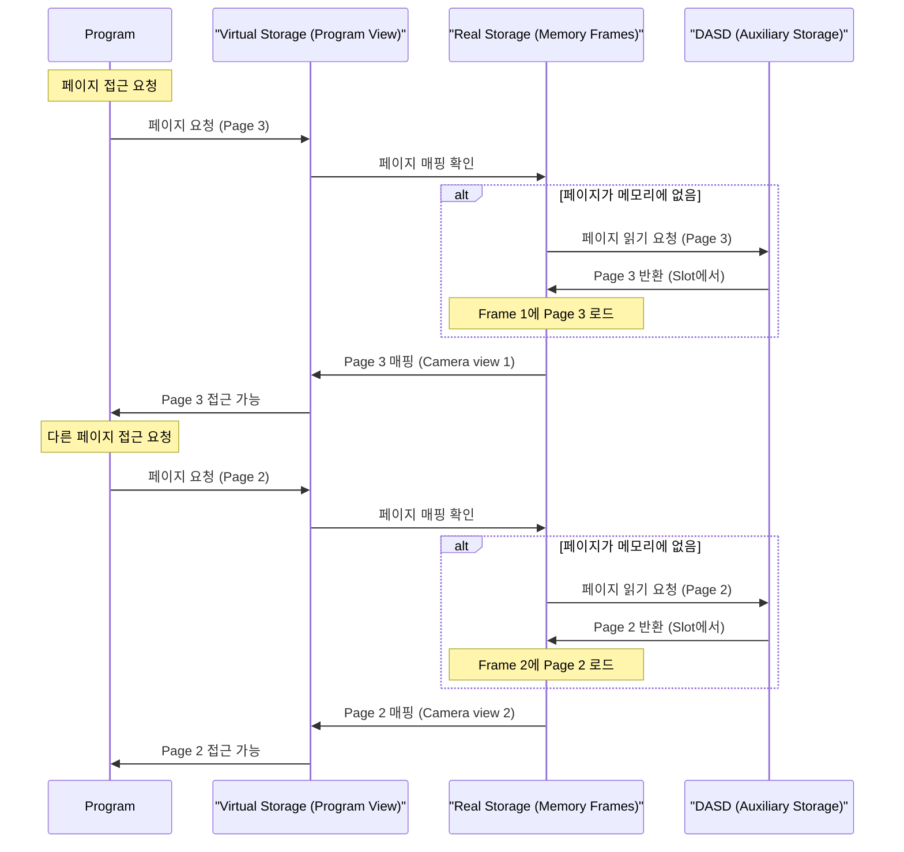
```mermaid
sequenceDiagram
    participant Program as Program
    participant Virtual as "Virtual Storage (Program View)"
    participant Real as "Real Storage (Memory Frames)"
    participant DASD as "DASD (Auxiliary Storage)"
    
    Note over Program: 페이지 접근 요청
    Program->>Virtual: 페이지 요청 (Page 3)
    Virtual->>Real: 페이지 매핑 확인
    alt 페이지가 메모리에 없음
        Real->>DASD: 페이지 읽기 요청 (Page 3)
        DASD->>Real: Page 3 반환 (Slot에서)
        Note over Real: Frame 1에 Page 3 로드
    end
    Real->>Virtual: Page 3 매핑 (Camera view 1)
    Virtual->>Program: Page 3 접근 가능
    
    Note over Program: 다른 페이지 접근 요청
    Program->>Virtual: 페이지 요청 (Page 2)
    Virtual->>Real: 페이지 매핑 확인
    alt 페이지가 메모리에 없음
        Real->>DASD: 페이지 읽기 요청 (Page 2)
        DASD->>Real: Page 2 반환 (Slot에서)
        Note over Real: Frame 2에 Page 2 로드
    end
    Real->>Virtual: Page 2 매핑 (Camera view 2)
    Virtual->>Program: Page 2 접근 가능
```

### 저장소 유형

#### Virtual Storage (가상 저장소)

프로그램에 연속적으로 보이는 페이지들이 `Virtual Storage`를 형성합니다. 프로그램은 Virtual Storage를 하나의 연속된 메모리 공간으로 인식합니다.

#### Real Storage (실제 저장소)

메모리 프레임을 `Real Storage`라고 합니다. 이는 실제 물리적 메모리(RAM)입니다.

#### Auxiliary Storage (보조 저장소)

디스크 슬롯을 `Auxiliary Storage`라고 합니다. 이는 DASD(Direct Access Storage Device)에 저장된 페이지들입니다.

### Address Space (주소 공간)

Virtual Storage의 전체 양과 이를 지원하는 메커니즘을 `Address Space`라고 합니다.

System/370 운영 체제인 MVS(Multiple Virtual Storage)는 Virtual Storage를 사용하여 많은 프로그램을 동시에 실행할 수 있게 했습니다. 각 프로그램은 최대 16MB의 Address Space 내에서 실행되며, 상대적으로 적은 양의 실제 물리적 메모리를 사용합니다.

```mermaid
flowchart TB
    subgraph AddressSpace["Address Space (16MB)"]
        CommonAreaTop["Common area (공유 영역)"]
        
        subgraph PrivateArea["Private area (프라이빗 영역)"]
            Supervisor["Supervisor"]
            JES["JES"]
            Program1["PROGRAM 1"]
            Program2["PROGRAM 2"]
            Program3["PROGRAM 3"]
        end
        
        CommonAreaBottom["Common area (공유 영역)"]
    end
    
    Note1["Common area는 모든 Address Space에서 공유되어 루틴을 쉽게 사용할 수 있고 프로그램 간 통신을 용이하게 합니다"]
    
    AddressSpace -.-> Note1
    
    style AddressSpace fill:#e0f2f1,color:#000
    style CommonAreaTop fill:#80cbc4,color:#000
    style CommonAreaBottom fill:#80cbc4,color:#000
    style PrivateArea fill:#dda0dd,color:#000
    style Supervisor fill:#0066cc,color:#fff
    style JES fill:#ffd700,color:#000
    style Program1 fill:#dda0dd,color:#000
    style Program2 fill:#ffa500,color:#000
    style Program3 fill:#ffb6c1,color:#000
```

### Common Area와 Private Area

#### Common Area (공통 영역)

**Common area**는 각 Address Space의 일부로, 시스템의 모든 Address Space 간에 공유됩니다. 이는 루틴을 쉽게 사용할 수 있게 하고, 프로그램 간 통신을 용이하게 합니다.

#### Private Area (프라이빗 영역)

**Private area**는 각 Address Space의 나머지 부분으로, Supervisor, JES, 그리고 사용자 프로그램(PROGRAM 1, PROGRAM 2, PROGRAM 3 등)이 포함됩니다.

### Virtual Storage의 비유

Virtual Storage의 개념을 이해하기 위해, 4페이지 문서를 텔레비전 화면에서 한 번에 한 페이지씩 읽는 것을 상상해보세요. 한 페이지에서 다음 페이지로 읽어갈 때, 모든 4페이지가 펼쳐져 있고 단일 카메라가 하나에서 다음으로 이동하는 것처럼 보입니다.

마찬가지로, Virtual Storage에서:
- **모든 페이지**: Auxiliary Storage(DASD)에 저장된 모든 페이지
- **카메라**: 프로그램 또는 프로세스
- **화면**: Real Storage(메모리)에 로드된 페이지
- **카메라 뷰**: 프로그램이 보는 Virtual Storage

### 동시 접근

충분한 슬롯과 프레임이 사용 가능하다면, 많은 사람들이 동시에 다른 문서를 읽을 수 있습니다. 프레임과 슬롯의 수가 증가함에 따라 동시에 볼 수 있는 문서의 수가 크게 증가합니다.

이것이 Multiprogramming 환경에서 Virtual Storage가 제공하는 핵심 이점입니다. 여러 프로그램이 각자의 Virtual Storage를 가지면서도, 실제 물리적 메모리는 효율적으로 공유됩니다.

## TSO, VTAM, ISPF

### 개요

TSO, VTAM, ISPF는 거의 모든 메인프레임 설치에서 사용됩니다. 이들은 사용자가 메인프레임 시스템과 대화형으로 상호작용할 수 있게 해주는 핵심 구성 요소입니다.

```mermaid
flowchart LR
    ISPF["ISPF (Interactive System Productivity Facility)"]
    TSO["TSO (Time Sharing Option)"]
    VTAM["VTAM (Virtual Telecommunications Access Method)"]
    Terminal["Terminal"]
    
    ISPF -->|사용| TSO
    TSO -->|통신| VTAM
    VTAM -->|연결| Terminal
    
    style ISPF fill:#ffcccc,color:#000
    style TSO fill:#ff6b6b,color:#fff
    style VTAM fill:#ffcccc,color:#000
    style Terminal fill:#333,color:#fff
```

### TSO (Time Sharing Option)

`TSO (Time Sharing Option)`는 파일을 할당하고 프로그램을 대화형으로 실행하는 데 사용되는 환경입니다.

TSO는 개발자에게 터미널을 통해 명령을 입력하여 파일을 할당하고 프로그램을 대화형으로 실행할 수 있는 환경을 제공합니다.

#### TSO의 주요 기능

- **대화형 환경**: 터미널을 통한 명령 입력 및 프로그램 실행
- **파일 할당 및 관리**: 데이터셋 할당 및 관리 작업
- **텍스트 에디터**: 간단한 텍스트 에디터를 제공하여 작업 스트림과 프로그램 소스를 터미널에서 직접 입력할 수 있습니다
- **카드 리더 대체**: 텍스트 에디터를 통해 카드 리더 없이 작업을 입력할 수 있어 카드 리더가 더 이상 필요하지 않게 되었습니다

#### TSO 세션과 Virtual Storage

Virtual Storage를 통해 많은 TSO 세션을 동시에 실행할 수 있습니다. 각 TSO 세션은 별도의 Address Space를 가지며, 각 Address Space의 Private area에 TSO 프로그램이 로드됩니다. 여러 사용자가 동시에 각자의 터미널을 통해 시스템에 접근할 수 있습니다.

```mermaid
flowchart TB
    subgraph AddressSpace["Address Space (16MB)"]
        CommonTop["Common area"]
        
        subgraph PrivateArea["Private area"]
            Supervisor["Supervisor"]
            JES["JES"]
            TSO1["TSO"]
            TSO2["TSO"]
            TSO3["TSO"]
        end
        
        CommonBottom["Common area"]
    end
    
    Terminal1["Terminal 1"]
    Terminal2["Terminal 2"]
    Terminal3["Terminal 3"]
    
    TSO1 -->|연결| Terminal1
    TSO2 -->|연결| Terminal2
    TSO3 -->|연결| Terminal3
    
    style AddressSpace fill:#e0f2f1,color:#000
    style CommonTop fill:#80cbc4,color:#000
    style CommonBottom fill:#80cbc4,color:#000
    style PrivateArea fill:#dda0dd,color:#000
    style Supervisor fill:#0066cc,color:#fff
    style JES fill:#ffd700,color:#000
    style TSO1 fill:#ff6b6b,color:#fff
    style TSO2 fill:#ff6b6b,color:#fff
    style TSO3 fill:#ff6b6b,color:#fff
    style Terminal1 fill:#333,color:#fff
    style Terminal2 fill:#333,color:#fff
    style Terminal3 fill:#333,color:#fff
```

### VTAM (Virtual Telecommunications Access Method)

`VTAM (Virtual Telecommunications Access Method)`는 프로그램과 터미널 간의 통신을 용이하게 합니다.

VTAM은 TSO와 같은 대화형 프로그램이 각 터미널 타입에 대한 특수 코드를 포함할 필요 없이 터미널과 통신할 수 있게 해줍니다.

#### VTAM의 주요 기능

- **터미널 추상화**: 각 터미널 타입에 대한 특수 코드 없이 통신 가능
- **네트워크 통신**: 로컬에 연결된 터미널 또는 네트워크에 연결된 터미널 처리
- **복구 메커니즘**: 내장된 복구 메커니즘을 통해 통신 오류 처리
- **진단 기능**: 통신 문제 진단을 위한 진단 기능 제공
- **세션 관리**: 터미널과의 세션 관리

#### VTAM과 TSO의 통신

VTAM과 TSO는 Common area를 통해 정보를 교환하여 통신합니다. VTAM은 터미널과의 물리적 통신을 담당하고, TSO는 애플리케이션 로직을 처리합니다. 이를 통해 TSO는 터미널 타입에 대한 세부 사항을 신경 쓰지 않고 VTAM을 통해 통신할 수 있습니다.

```mermaid
flowchart TB
    subgraph AddressSpace["Address Space (16MB)"]
        CommonTop["Common area (VTAM 양방향 TSO 통신)"]
        
        subgraph PrivateArea["Private area"]
            Supervisor["Supervisor"]
            JES["JES"]
            TSO1["TSO"]
            TSO2["TSO"]
            TSO3["TSO"]
            VTAM["VTAM"]
        end
        
        CommonBottom["Common area"]
    end
    
    Network["Network"]
    Terminal1["Terminal 1"]
    Terminal2["Terminal 2"]
    Terminal3["Terminal 3"]
    
    VTAM <-->|양방향 통신| Network
    Network -->|연결| Terminal1
    Network -->|연결| Terminal2
    Network -->|연결| Terminal3
    
    style AddressSpace fill:#e0f2f1,color:#000
    style CommonTop fill:#80cbc4,color:#000
    style CommonBottom fill:#80cbc4,color:#000
    style PrivateArea fill:#dda0dd,color:#000
    style Supervisor fill:#0066cc,color:#fff
    style JES fill:#ffd700,color:#000
    style TSO1 fill:#ff6b6b,color:#fff
    style TSO2 fill:#ff6b6b,color:#fff
    style TSO3 fill:#ff6b6b,color:#fff
    style VTAM fill:#87ceeb,color:#000
    style Network fill:#ffa500,color:#000
    style Terminal1 fill:#333,color:#fff
    style Terminal2 fill:#333,color:#fff
    style Terminal3 fill:#333,color:#fff
```

### ISPF (Interactive System Productivity Facility)

`ISPF (Interactive System Productivity Facility)`는 유틸리티와 애플리케이션에 대한 전체 화면, 메뉴 기반 인터페이스를 제공합니다.

ISPF는 시간이 지나면서 MVS 프로그래머와 운영자의 일반적인 작업 환경으로 발전했습니다. TSO의 확장으로, 강력한 텍스트 에디터를 포함하며 점점 더 많은 유틸리티와 애플리케이션에 대한 전체 화면, 메뉴 기반 인터페이스를 제공합니다.

#### ISPF의 주요 특징

- **전체 화면 인터페이스**: 명령줄 기반이 아닌 전체 화면 편집 및 작업 환경
- **메뉴 기반**: 사용자가 메뉴를 통해 다양한 기능에 접근
- **강력한 텍스트 에디터**: 소스 코드 및 데이터셋 편집을 위한 강력한 에디터
- **파일 편집**: 데이터셋 편집 및 관리
- **유틸리티 접근**: 다양한 시스템 유틸리티에 쉽게 접근

#### ISPF Primary Option Menu

ISPF는 Primary Option Menu를 통해 사용자에게 다양한 기능에 접근할 수 있는 메뉴를 제공합니다. 주요 옵션:

- **Settings**: 터미널 및 사용자 매개변수 설정
- **View**: 소스 데이터 또는 목록 표시
- **Edit**: 소스 데이터 생성 또는 변경
- **Utilities**: 유틸리티 기능 수행
- **Foreground**: 대화형 언어 처리
- **Batch**: 언어 처리를 위한 작업 제출
- **Command**: TSO 또는 Workstation 명령 입력

ISPF는 사용자가 메인프레임 시스템을 더 쉽고 효율적으로 사용할 수 있도록 도와주는 생산성 도구입니다.

### 상호작용 흐름

```mermaid
sequenceDiagram
    participant User as 사용자
    participant ISPF
    participant TSO
    participant VTAM
    participant Terminal as Terminal
    
    User->>Terminal: 명령 입력
    Terminal->>VTAM: 데이터 전송
    VTAM->>TSO: 통신 중개
    TSO->>ISPF: 작업 요청
    Note over ISPF: 전체 화면 메뉴 기반 인터페이스
    ISPF->>TSO: 파일 할당/프로그램 실행
    TSO->>VTAM: 결과 전송
    VTAM->>Terminal: 데이터 전송
    Terminal->>User: 결과 표시
```

### 통합 사용

일반적인 사용 시나리오:

1. **사용자 로그인**: 사용자가 터미널을 통해 메인프레임 시스템에 로그인합니다.
2. **TSO 세션 시작**: TSO가 대화형 세션을 시작합니다.
3. **ISPF 실행**: 사용자가 ISPF를 실행하여 전체 화면 인터페이스에 접근합니다.
4. **VTAM 통신**: VTAM이 터미널과 시스템 간의 모든 통신을 관리합니다.
5. **작업 수행**: 사용자는 ISPF의 메뉴를 통해 파일 편집, 프로그램 실행 등의 작업을 수행합니다.

이 세 가지 구성 요소는 함께 작동하여 메인프레임 시스템에 대한 사용자 친화적이고 효율적인 대화형 환경을 제공합니다.

::: tip TSO, VTAM, ISPF 요약

- **ISPF**: 유틸리티와 애플리케이션에 대한 전체 화면, 메뉴 기반 인터페이스를 제공합니다.
- **VTAM**: 프로그램과 터미널 간의 통신을 용이하게 합니다.
- **TSO**: 파일을 할당하고 프로그램을 대화형으로 실행하는 데 사용되는 환경의 이름입니다.

:::

## Summary: Mainframe Evolution

### 메인프레임 운영 체제와 하드웨어 아키텍처의 진화

IBM 메인프레임 운영 체제와 하드웨어 아키텍처는 1960년대 S/360 머신에서 OS/360 MVT(Multitasking with Variable number of Tasks)를 실행하는 것부터 현재 IBM Z 메인프레임(z17 포함)의 z/OS 최신 버전(z/OS 3.2)까지 진화해왔습니다.

### MVS 운영 체제의 변천사

Multiple Virtual Storage (MVS) 운영 체제는 OS/360 MVT의 후속으로 개발되었으며, 여러 변천을 거쳐왔습니다:

1. **MVS/370**: System/370 아키텍처용 MVS (1974년)
2. **MVS/XA (eXtended Architecture)**: 확장 아키텍처 (1983년)
3. **MVS/ESA (Enterprise Systems Architecture)**: 엔터프라이즈 시스템 아키텍처 (1988년)
4. **OS/390**: "Open Systems" 환경 (1995년)
5. **z/OS**: 현재의 운영 체제 (2000년)
   - z/OS 3.1: AI 기반 WLM 기능 도입
   - z/OS 3.2: z17 Telum II 프로세서 지원, AI 기능 강화 (2024년)

### OS/390와 z/OS

OS/390와 z/OS는 UNIX와 같은 미드레인지 시스템을 메인프레임 환경에서 실행할 수 있게 해주지만, 기본 운영 체제는 여전히 MVS의 진화된 버전입니다. 이러한 이유로 많은 사람들이 여전히 OS/390와 z/OS의 개념, 시설, 환경을 "MVS"라고 부릅니다.

### MVS와 z/OS의 관계

이후 과정과 모듈에서 MVS에 대한 언급은 z/OS 운영 체제와 교환 가능하게 사용될 수 있습니다. z/OS는 MVS의 현대적 구현이며, 핵심 개념과 기능은 계속해서 유지되고 있습니다.

```mermaid
flowchart LR
    OS360MVT["OS/360 MVT (1960년대) S/360"]
    MVS370["MVS/370 System/370"]
    MVSXA["MVS/XA (eXtended Architecture)"]
    MVSESA["MVS/ESA (Enterprise Systems Architecture)"]
    OS390["OS/390 (Open Systems)"]
    ZOS["z/OS (현재) IBM Z"]
    
    OS360MVT -.->|전신| MVS370
    MVS370 -->|진화| MVSXA
    MVSXA -->|진화| MVSESA
    MVSESA -->|진화| OS390
    OS390 -->|진화| ZOS
    
    style OS360MVT fill:#e0e0e0,color:#000
    style MVS370 fill:#b3e5fc,color:#000
    style MVSXA fill:#81d4fa,color:#000
    style MVSESA fill:#4fc3f7,color:#000
    style OS390 fill:#29b6f6,color:#000
    style ZOS fill:#0066cc,color:#fff
```

이 진화 과정을 통해 메인프레임 시스템은 더욱 강력하고 유연한 플랫폼으로 발전하여, 현대적인 애플리케이션과 레거시 시스템을 모두 지원할 수 있게 되었습니다.

