# Lesson 2: z/OS 시스템의 주요 구성 요소

## 개요

이 모듈은 운영 체제와 결합하여 완전한 컴퓨팅 환경을 위한 시설을 제공하는 많은 제품들을 탐구합니다.

## 학습 목표

이 모듈을 완료한 후, 다음을 수행할 수 있습니다:

- 가장 널리 사용되는 z/OS 시스템 구성 요소의 이름과 기능을 식별할 수 있습니다.

## Subsystems (서브시스템)

### Subsystem의 정의

z/OS가 최적의 효율성으로 작동하려면 많은 프로그램과 구성 요소가 필요합니다. 이러한 구성 요소 중 일부는 `subsystem(서브시스템)`이라고 불립니다.

`Subsystem`은 다른 구성 요소와 비동기적으로 작동하는 시스템 구성 요소입니다. 이 맥락에서, 일반적으로 사용자나 다른 프로그램의 요청에 대해 작동하는 프로그램을 의미합니다.

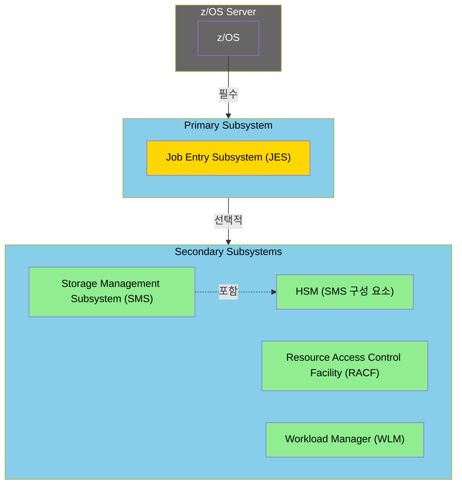
```mermaid
flowchart TB
    subgraph ZOS["z/OS Server"]
        ZOSImage["z/OS"]
    end
    
    subgraph Primary["Primary Subsystem"]
        JES["Job Entry Subsystem (JES)"]
    end
    
    subgraph Secondary["Secondary Subsystems"]
        SMS["Storage Management Subsystem (SMS)"]
        HSM["HSM (SMS 구성 요소)"]
        RACF["Resource Access Control Facility (RACF)"]
        WLM["Workload Manager (WLM)"]
    end
    
    SMS -.->|포함| HSM
    
    ZOSImage -->|필수| Primary
    Primary -->|선택적| Secondary
    
    style ZOS fill:#666,color:#fff
    style ZOSImage fill:#666,color:#fff
    style Primary fill:#87ceeb,color:#000
    style JES fill:#ffd700,color:#000
    style Secondary fill:#87ceeb,color:#000
    style HSM fill:#90ee90,color:#000
    style RACF fill:#90ee90,color:#000
    style SMS fill:#90ee90,color:#000
    style WLM fill:#90ee90,color:#000
```

### Primary Subsystem (주 서브시스템)

모든 z/OS 설치에는 `주 서브시스템(Primary Subsystem)`이 필요합니다. 이는 `Job Entry Subsystem (작업 입력 서브시스템)`으로, 일반적으로 `JES2` 또는 `JES3`입니다.

#### JES (Job Entry Subsystem)

JES는 작업 입력 및 출력을 관리하는 필수 서브시스템입니다. JES의 주요 기능은 다음과 같습니다:

- **작업 입력 관리**: JCL(Job Control Language)을 읽고 처리합니다.
- **SPOOL 관리**: 작업 입력과 출력을 SPOOL 데이터셋에 저장합니다.
- **작업 스케줄링**: 작업을 실행할 수 있도록 스케줄링합니다.
- **출력 관리**: 작업 출력을 프린터나 다른 출력 장치로 전달합니다.

::: tip Primary Subsystem

모든 z/OS 설치에는 주 서브시스템인 Job Entry Subsystem(예: JES2)이 필요합니다.

:::

### Secondary Subsystems (보조 서브시스템)

주 서브시스템 외에도, z/OS 시스템에는 다양한 `보조 서브시스템(Secondary Subsystems)`이 설치될 수 있습니다. 이들은 선택적이지만, 시스템의 기능과 효율성을 크게 향상시킵니다.

#### SMS (Storage Management Subsystem)

`SMS (저장소 관리 서브시스템)`는 데이터셋의 자동 관리와 저장소 할당을 제공합니다. SMS는 여러 구성 요소를 포함하며, 그 중 HSM(Hierarchical Storage Manager)이 계층적 저장소 관리를 담당합니다.

주요 기능:
- **자동 데이터셋 관리**: 데이터셋의 자동 생성 및 관리
- **저장소 클래스 관리**: 저장소 클래스에 따른 자동 할당
- **데이터셋 마이그레이션**: 데이터셋의 자동 마이그레이션 (HSM을 통해)
- **계층적 저장소 관리**: HSM을 통한 다단계 저장소 계층 관리

::: tip SMS와 HSM의 관계

SMS는 저장소 관리를 위한 통합 시스템이며, HSM은 SMS의 구성 요소 중 하나로 계층적 저장소 관리를 담당합니다. 자세한 내용은 아래 "SMS/HSM" 섹션을 참조하세요.

:::

#### RACF (Resource Access Control Facility)

`RACF (리소스 접근 제어 시설)`는 z/OS 시스템의 보안을 관리합니다.

주요 기능:
- **사용자 인증**: 사용자 식별 및 인증
- **권한 관리**: 리소스에 대한 접근 권한 관리
- **감사 추적**: 보안 이벤트 로깅 및 감사

#### WLM (Workload Manager)

`WLM (작업 부하 관리자)`는 시스템 리소스를 관리하고 작업 부하를 최적화합니다.

주요 기능:
- **작업 부하 관리**: 시스템 리소스의 효율적 분배
- **성능 목표 설정**: 서비스 클래스에 따른 성능 목표 관리
- **리소스 모니터링**: 시스템 리소스 사용량 모니터링

### Subsystem의 작동 방식

Subsystem은 다음과 같은 방식으로 작동합니다:

1. **비동기적 작동**: Subsystem은 다른 구성 요소와 독립적으로 비동기적으로 작동합니다.
2. **요청 처리**: 사용자나 다른 프로그램의 요청을 받아 처리합니다.
3. **리소스 관리**: 각 Subsystem은 특정 리소스나 기능을 관리합니다.

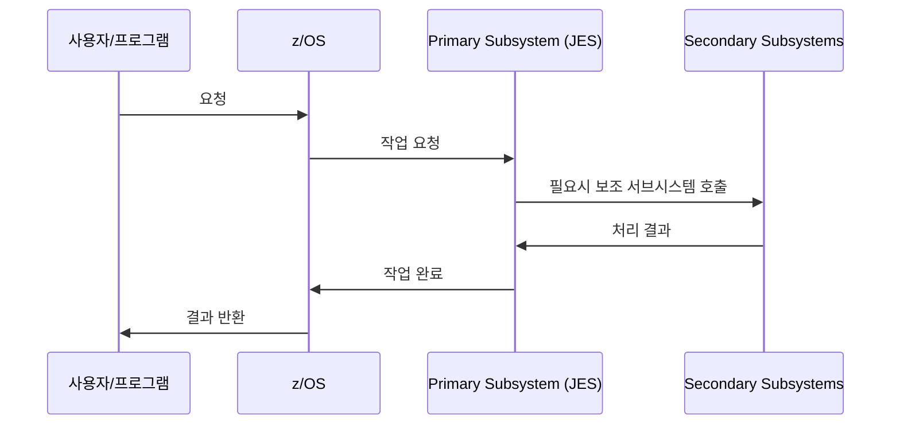
```mermaid
sequenceDiagram
    participant User as 사용자/프로그램
    participant ZOS as z/OS
    participant Primary as Primary Subsystem (JES)
    participant Secondary as Secondary Subsystems
    
    User->>ZOS: 요청
    ZOS->>Primary: 작업 요청
    Primary->>Secondary: 필요시 보조 서브시스템 호출
    Secondary->>Primary: 처리 결과
    Primary->>ZOS: 작업 완료
    ZOS->>User: 결과 반환
```

### Subsystem의 중요성

Subsystem은 z/OS 시스템의 핵심 구성 요소로서:

- **모듈화**: 시스템 기능을 모듈화하여 관리 용이성 향상
- **확장성**: 필요한 기능만 선택적으로 설치 가능
- **유지보수**: 각 Subsystem을 독립적으로 업데이트 및 유지보수 가능
- **효율성**: 특화된 기능을 제공하여 시스템 효율성 향상

::: tip Subsystem 요약

- **Subsystem**: 다른 구성 요소와 비동기적으로 작동하는 시스템 구성 요소
- **Primary Subsystem**: 모든 z/OS 설치에 필수 (JES2 또는 JES3)
- **Secondary Subsystems**: 선택적이지만 시스템 기능 향상을 위해 설치됨
  - SMS: 저장소 관리 (HSM 포함)
  - RACF: 보안 및 접근 제어
  - WLM: 작업 부하 관리

:::

## Job Control Language (JCL)

### JCL의 정의

`Job Control Language (JCL)`는 운영 체제의 일부로, 작업의 리소스 요구 사항을 정의하는 언어입니다. JCL은 z/OS 시스템의 핵심 언어입니다.

### JCL의 역할

JCL은 각 배치 작업(batch job), 시작된 작업(started task), 또는 TSO/E 사용자에 의해 요구되는 리소스를 정의합니다. JCL은 다음을 정의합니다:

- **프로그램(Programs)**: 실행할 프로그램
- **루틴(Routines)**: 실행할 CLISTs 또는 REXX 루틴
- **데이터 할당(Data allocation)**: 사용할 데이터셋
- **우선순위(Priorities)**: 실행 우선순위
- **출력(Printing)**: 출력 우선순위 및 출력 대상

### JCL의 중요성

z/OS 시스템에서 시작되는 모든 작업은 컴퓨터를 지시하기 위해 JCL이 필요합니다. JCL 없이는 작업이 실행되지 않습니다.

### JCL 예제

다음은 JCL의 예제입니다:

```jcl
//JIEBCPY1 JOB MSGCLASS=C,NOTIFY=JPDTS4
//STEP1 EXEC PGM=IEBCOPY
//SYSPRINT DD SYSOUT=*
//INDSET DD DSN=XPROD.JCL.MASTER,DISP=SHR
//OUTDSET DD DSN=JPDTS4.JCL.CNTL,DISP=(,CATLG),UNIT=SYSDA,
// SPACE=(TRK,(2,2,2))
//SYSIN DD *
COPY INDD=INDSET,OUTDD=OUTDSET
SELECT MEMBER=(AATEST)
/*
```

#### JCL 예제 설명

이 JCL 예제는 다음과 같은 작업을 수행합니다:

1. **JOB 문**: `//JIEBCPY1 JOB MSGCLASS=C,NOTIFY=JPDTS4`
   - 작업 이름: JIEBCPY1
   - 메시지 클래스: C
   - 완료 시 알림 대상: JPDTS4

2. **EXEC 문**: `//STEP1 EXEC PGM=IEBCOPY`
   - 단계 이름: STEP1
   - 실행할 프로그램: IEBCOPY (데이터셋 복사 유틸리티)

3. **DD 문들**:
   - `//SYSPRINT DD SYSOUT=*`: 출력을 시스템 출력으로 전송
   - `//INDSET DD DSN=XPROD.JCL.MASTER,DISP=SHR`: 입력 데이터셋 지정
   - `//OUTDSET DD DSN=JPDTS4.JCL.CNTL,DISP=(,CATLG),UNIT=SYSDA,SPACE=(TRK,(2,2,2))`: 출력 데이터셋 지정 및 할당
   - `//SYSIN DD *`: 제어 입력 스트림 시작

4. **제어 명령**: 
   - `COPY INDD=INDSET,OUTDD=OUTDSET`: 데이터셋 복사 명령
   - `SELECT MEMBER=(AATEST)`: 특정 멤버 선택
   - `/*`: 제어 입력 스트림 종료

### JCL이 지시하는 사항

JCL은 다음과 같은 사항들을 지시합니다:

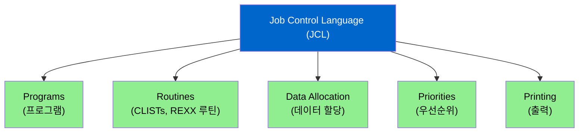
```mermaid
flowchart TB
    JCL["Job Control Language (JCL)"]
    
    Programs["Programs<br/>(프로그램)"]
    Routines["Routines<br/>(CLISTs, REXX 루틴)"]
    DataAlloc["Data Allocation<br/>(데이터 할당)"]
    Priorities["Priorities<br/>(우선순위)"]
    Printing["Printing<br/>(출력)"]
    
    JCL --> Programs
    JCL --> Routines
    JCL --> DataAlloc
    JCL --> Priorities
    JCL --> Printing
    
    style JCL fill:#0066cc,color:#fff
    style Programs fill:#90ee90,color:#000
    style Routines fill:#90ee90,color:#000
    style DataAlloc fill:#90ee90,color:#000
    style Priorities fill:#90ee90,color:#000
    style Printing fill:#90ee90,color:#000
```

### JCL의 주요 구성 요소

#### JOB 문

JOB 문은 작업을 정의하고 작업 레벨 파라미터를 지정합니다.

주요 파라미터:
- **MSGCLASS**: 메시지 출력 클래스
- **NOTIFY**: 작업 완료 시 알림을 받을 사용자 ID
- **CLASS**: 작업 클래스 (실행 우선순위 결정)

#### EXEC 문

EXEC 문은 작업 단계(step)를 정의하고 실행할 프로그램을 지정합니다.

주요 파라미터:
- **PGM**: 실행할 프로그램 이름
- **PROC**: 실행할 프로시저 이름

#### DD 문

DD(Data Definition) 문은 데이터셋을 정의하고 할당합니다.

주요 파라미터:
- **DSN**: 데이터셋 이름
- **DISP**: 데이터셋 처리 방법 (SHR, OLD, NEW, MOD 등)
- **UNIT**: 장치 유형
- **SPACE**: 저장소 할당량
- **SYSOUT**: 시스템 출력 클래스

### JCL 처리 과정

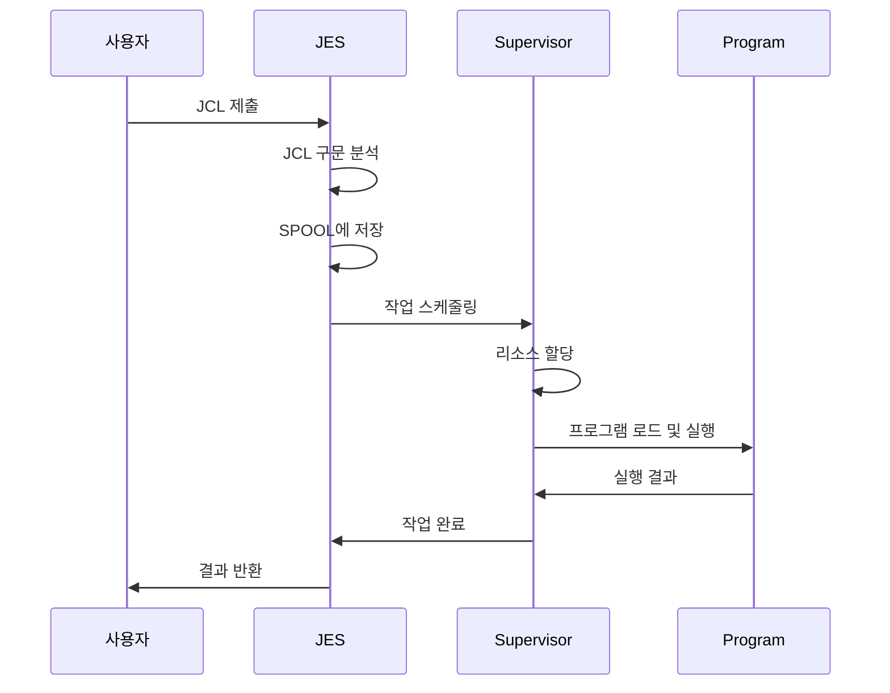
```mermaid
sequenceDiagram
    participant User as 사용자
    participant JES as JES
    participant Supervisor as Supervisor
    participant Program as Program
    
    User->>JES: JCL 제출
    JES->>JES: JCL 구문 분석
    JES->>JES: SPOOL에 저장
    JES->>Supervisor: 작업 스케줄링
    Supervisor->>Supervisor: 리소스 할당
    Supervisor->>Program: 프로그램 로드 및 실행
    Program->>Supervisor: 실행 결과
    Supervisor->>JES: 작업 완료
    JES->>User: 결과 반환
```

### JCL의 특징

1. **필수성**: z/OS 시스템에서 모든 작업은 JCL이 필요합니다.
2. **표준화**: 작업 실행을 위한 표준화된 방법을 제공합니다.
3. **리소스 정의**: 작업에 필요한 모든 리소스를 명시적으로 정의합니다.
4. **유연성**: 다양한 작업 유형과 요구 사항을 지원합니다.

::: tip JCL 요약

- **JCL (Job Control Language)**: 작업의 리소스 요구 사항을 정의하는 언어
- **필수 구성 요소**: JOB 문, EXEC 문, DD 문
- **주요 기능**:
  - 실행할 프로그램 및 루틴 지정
  - 데이터셋 할당 및 관리
  - 실행 우선순위 설정
  - 출력 관리
- **중요성**: JCL 없이는 z/OS 시스템에서 작업이 실행되지 않습니다.

:::

## TSO/E and ISPF

### TSO와 TSO/E의 관계

`TSO (Time Sharing Option)`는 `TSO/E (Time Sharing Option/Extensions)`의 전신(predecessor)입니다. TSO는 라인 에디터(line editor)와 멀티태스킹 및 유틸리티 기능을 사용했습니다.

### TSO/E (Time Sharing Option/Extensions)

`TSO/E`는 프로그래머나 운영자가 z/OS 프로그램과 대화형으로 작업할 수 있게 해주는 도구입니다.

#### TSO/E의 진화

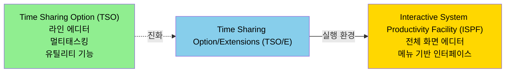
```mermaid
flowchart LR
    TSO["Time Sharing Option (TSO)<br/>라인 에디터<br/>멀티태스킹<br/>유틸리티 기능"]
    TSOE["Time Sharing Option/Extensions (TSO/E)"]
    ISPF["Interactive System Productivity Facility (ISPF)<br/>전체 화면 에디터<br/>메뉴 기반 인터페이스"]
    
    TSO -.->|진화| TSOE
    TSOE -->|실행 환경| ISPF
    
    style TSO fill:#90ee90,color:#000
    style TSOE fill:#87ceeb,color:#000
    style ISPF fill:#ffd700,color:#000
```

TSO는 초기에 라인 에디터와 멀티태스킹 및 유틸리티 기능을 사용했습니다. 이 라인 에디터는 `Interactive System Productivity Facility (ISPF)`에서 찾을 수 있는 더 정교한 전체 화면 에디터로 대체되었습니다.

### ISPF (Interactive System Productivity Facility)

`ISPF`는 TSO/E 하에서 실행되며 TSO/E 유틸리티를 실행하기 위한 메뉴 기반 인터페이스를 제공합니다.

::: tip ISPF runs under TSO/E

ISPF는 TSO/E 하에서 실행되며 메뉴 기반 인터페이스를 제공합니다.

:::

#### ISPF의 주요 기능

ISPF를 통해 다음을 수행할 수 있습니다:

- **데이터셋 생성**: 데이터셋을 생성하고 관리합니다
- **소스 코드 작성**: 소스 코드를 작성하고 편집합니다
- **JCL 작성**: Job Control Language를 작성하고 편집합니다
- **작업 제출**: z/OS 시스템에 작업을 제출합니다

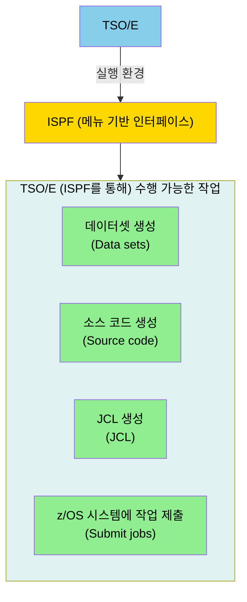
```mermaid
flowchart TB
    TSOE["TSO/E"]
    ISPF["ISPF (메뉴 기반 인터페이스)"]
    
    subgraph Functions["TSO/E (ISPF를 통해) 수행 가능한 작업"]
        CreateDS["데이터셋 생성<br/>(Data sets)"]
        CreateSource["소스 코드 생성<br/>(Source code)"]
        CreateJCL["JCL 생성<br/>(JCL)"]
        SubmitJob["z/OS 시스템에 작업 제출<br/>(Submit jobs)"]
    end
    
    TSOE -->|실행 환경| ISPF
    ISPF --> Functions
    
    style TSOE fill:#87ceeb,color:#000
    style ISPF fill:#ffd700,color:#000
    style Functions fill:#e0f2f1,color:#000
    style CreateDS fill:#90ee90,color:#000
    style CreateSource fill:#90ee90,color:#000
    style CreateJCL fill:#90ee90,color:#000
    style SubmitJob fill:#90ee90,color:#000
```

### TSO/E와 ISPF의 통합

TSO/E는 많은 유용한 유틸리티 기능을 제공하며, 이러한 기능들은 ISPF를 통해 쉽게 구성되고 간단하게 실행될 수 있습니다.

#### ISPF의 장점

1. **전체 화면 인터페이스**: 라인 에디터보다 사용하기 쉬운 전체 화면 편집 환경
2. **메뉴 기반**: 명령어를 외울 필요 없이 메뉴를 통해 기능에 접근
3. **통합 환경**: 데이터셋 편집, 소스 코드 작성, JCL 작성, 작업 제출을 하나의 환경에서 수행
4. **생산성 향상**: 프로그래머와 운영자의 작업 효율성을 크게 향상

### TSO/E와 ISPF의 작동 방식

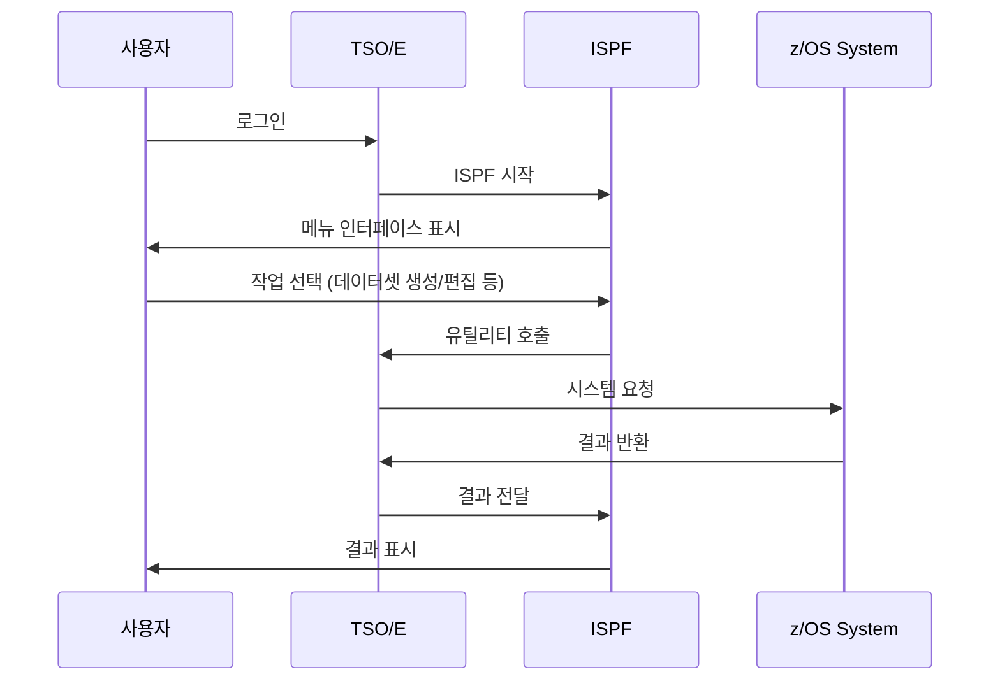
```mermaid
sequenceDiagram
    participant User as 사용자
    participant TSOE as TSO/E
    participant ISPF as ISPF
    participant ZOS as z/OS System
    
    User->>TSOE: 로그인
    TSOE->>ISPF: ISPF 시작
    ISPF->>User: 메뉴 인터페이스 표시
    User->>ISPF: 작업 선택 (데이터셋 생성/편집 등)
    ISPF->>TSOE: 유틸리티 호출
    TSOE->>ZOS: 시스템 요청
    ZOS->>TSOE: 결과 반환
    TSOE->>ISPF: 결과 전달
    ISPF->>User: 결과 표시
```

### ISPF의 중요성

대부분의 z/OS 설치에서 작업하는 사람들은 ISPF 사용 방법을 알아야 합니다. ISPF는 z/OS 환경에서 작업하는 데 필수적인 도구입니다.

#### ISPF를 통한 일반적인 작업

1. **데이터셋 관리**: 데이터셋 생성, 편집, 삭제, 복사
2. **소스 코드 개발**: 프로그램 소스 코드 작성 및 편집
3. **JCL 작성**: 작업 제출을 위한 JCL 작성 및 편집
4. **작업 제출 및 모니터링**: 배치 작업 제출 및 상태 확인
5. **시스템 유틸리티 실행**: 다양한 시스템 유틸리티에 접근

### TSO/E와 ISPF의 관계 요약

- **TSO**: TSO/E의 전신으로, 라인 에디터와 기본 유틸리티를 제공
- **TSO/E**: z/OS 프로그램과 대화형으로 작업할 수 있게 해주는 확장된 도구
- **ISPF**: TSO/E 하에서 실행되는 메뉴 기반 인터페이스로, 전체 화면 편집 및 다양한 유틸리티 접근 제공

::: tip TSO/E and ISPF 요약

- **TSO**: TSO/E의 전신, 라인 에디터 사용
- **TSO/E**: 프로그래머나 운영자가 z/OS 프로그램과 대화형으로 작업할 수 있게 해주는 도구
- **ISPF**: TSO/E 하에서 실행되는 메뉴 기반 인터페이스
- **주요 기능** (ISPF를 통해):
  - 데이터셋 생성
  - 소스 코드 생성
  - JCL 생성
  - z/OS 시스템에 작업 제출
- **중요성**: 대부분의 z/OS 설치에서 작업하는 사람들은 ISPF 사용 방법을 알아야 합니다.

:::

## VTAM and TCP/IP

### VTAM (Virtual Telecommunications Access Method)

`VTAM (Virtual Telecommunications Access Method)`는 "vee-tam"으로 발음되며, 채널과 LAN 연결 장치(터미널 등) 간의 데이터 전송을 관리하고 `System Network Architecture (SNA)` 라우팅 작업을 수행합니다.

#### VTAM의 역할

VTAM은 통신 프로그램과 터미널 또는 애플리케이션 프로그램 간의 통신을 중개합니다. CICS, TSO/E와 같은 통신 프로그램들은 적절한 터미널과 애플리케이션 프로그램으로 정보를 전달하기 위해 VTAM에 의존합니다.

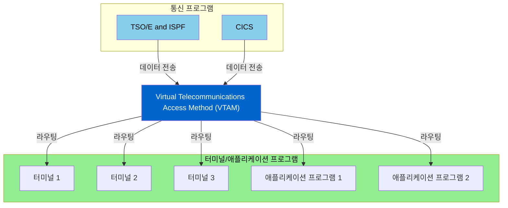
```mermaid
flowchart TB
    subgraph Telecom["통신 프로그램"]
        TSOE["TSO/E and ISPF"]
        CICS["CICS"]
    end
    
    VTAM["Virtual Telecommunications Access Method (VTAM)"]
    
    subgraph Terminals["터미널/애플리케이션 프로그램"]
        Terminal1["터미널 1"]
        Terminal2["터미널 2"]
        Terminal3["터미널 3"]
        App1["애플리케이션 프로그램 1"]
        App2["애플리케이션 프로그램 2"]
    end
    
    TSOE -->|데이터 전송| VTAM
    CICS -->|데이터 전송| VTAM
    
    VTAM -->|라우팅| Terminal1
    VTAM -->|라우팅| Terminal2
    VTAM -->|라우팅| Terminal3
    VTAM -->|라우팅| App1
    VTAM -->|라우팅| App2
    
    style VTAM fill:#0066cc,color:#fff
    style TSOE fill:#87ceeb,color:#000
    style CICS fill:#87ceeb,color:#000
    style Terminals fill:#90ee90,color:#000
```

#### VTAM의 데이터 흐름

데이터는 터미널에서 VTAM을 통해 메인프레임에서 실행 중인 애플리케이션으로 전송됩니다. 애플리케이션이 데이터를 처리한 후, 처리된 데이터는 다시 VTAM을 통해 해당 터미널에 적합한 형식으로 반환됩니다.

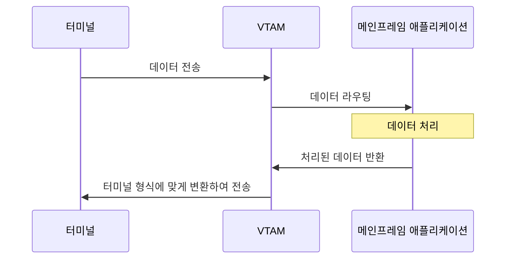
```mermaid
sequenceDiagram
    participant Terminal as 터미널
    participant VTAM
    participant App as 메인프레임 애플리케이션
    
    Terminal->>VTAM: 데이터 전송
    VTAM->>App: 데이터 라우팅
    Note over App: 데이터 처리
    App->>VTAM: 처리된 데이터 반환
    VTAM->>Terminal: 터미널 형식에 맞게 변환하여 전송
```

#### VTAM 시작

VTAM은 운영자가 시작하는 프로그램입니다. 운영자는 일반적으로 `S NET` 명령을 입력하여 VTAM을 시작합니다.

::: tip VTAM 시작 명령

IBM은 VTAM 프로그램의 프로시저 이름을 `NET`으로 지정했기 때문에, 운영자는 `S NET`을 입력하여 VTAM을 시작합니다. 일부 설치에서는 IBM 기본값을 사용하지 않고 다른 이름을 할당할 수 있습니다.

:::

::: tip VTAM 프로그램과 프로시저 이름

프로그램은 VTAM이라고 불리지만, IBM은 프로시저 이름을 `NET`으로 지정했습니다. 따라서 `S NET` 명령을 사용하여 VTAM 프로그램 세트를 시작합니다.

:::

### TCP/IP

`TCP/IP`는 네트워크 관리자로, VTAM과는 달리 IBM 전용이 아닙니다. 기본 기능은 VTAM과 동일합니다. 즉, 애플리케이션과 사용자 간에 데이터를 주고받는 것입니다.

#### TCP/IP의 특징

TCP/IP와 VTAM의 주요 차이점 중 하나는 TCP/IP가 비독점 표준이라는 것입니다. 이는 메인프레임 시스템 외에도 다른 시스템을 가진 설치에 매력적입니다.

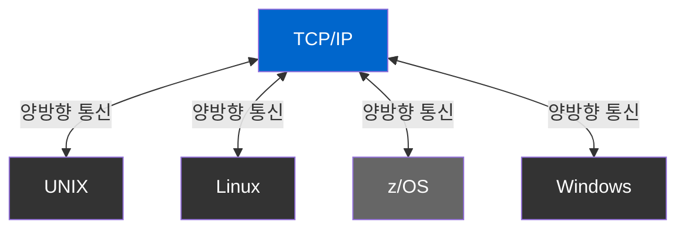
```mermaid
flowchart TB
    TCPIP["TCP/IP"]
    
    UNIX["UNIX"]
    Linux["Linux"]
    ZOS["z/OS"]
    Windows["Windows"]
    
    TCPIP <-->|양방향 통신| UNIX
    TCPIP <-->|양방향 통신| Linux
    TCPIP <-->|양방향 통신| ZOS
    TCPIP <-->|양방향 통신| Windows
    
    style TCPIP fill:#0066cc,color:#fff
    style UNIX fill:#333,color:#fff
    style Linux fill:#333,color:#fff
    style ZOS fill:#666,color:#fff
    style Windows fill:#333,color:#fff
```

#### TCP/IP의 역할

TCP/IP는 다양한 운영 체제 간의 통신을 가능하게 합니다:

- **UNIX 시스템**: TCP/IP를 통해 z/OS와 통신
- **Linux 시스템**: TCP/IP를 통해 z/OS와 통신
- **Windows 시스템**: TCP/IP를 통해 z/OS와 통신
- **z/OS**: 다른 시스템과 TCP/IP를 통해 통신

### VTAM과 TCP/IP의 통합

VTAM과 TCP/IP는 `z/OS Communications Server`라는 단일 제품으로 통합되었습니다.

#### z/OS Communications Server

z/OS Communications Server는 VTAM과 TCP/IP의 기능을 통합하여 제공합니다:

- **VTAM 기능**: SNA 네트워크를 통한 통신 지원
- **TCP/IP 기능**: 표준 TCP/IP 네트워크를 통한 통신 지원
- **통합 관리**: 단일 인터페이스를 통한 네트워크 관리

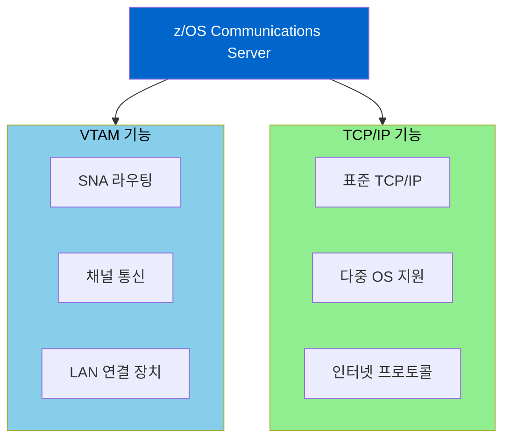
```mermaid
flowchart TB
    ZOSComm["z/OS Communications Server"]
    
    subgraph VTAMFeatures["VTAM 기능"]
        SNA["SNA 라우팅"]
        Channel["채널 통신"]
        LAN["LAN 연결 장치"]
    end
    
    subgraph TCPIPFeatures["TCP/IP 기능"]
        Standard["표준 TCP/IP"]
        MultiOS["다중 OS 지원"]
        Internet["인터넷 프로토콜"]
    end
    
    ZOSComm --> VTAMFeatures
    ZOSComm --> TCPIPFeatures
    
    style ZOSComm fill:#0066cc,color:#fff
    style VTAMFeatures fill:#87ceeb,color:#000
    style TCPIPFeatures fill:#90ee90,color:#000
```

### VTAM과 TCP/IP 비교

| 특징 | VTAM | TCP/IP |
|------|------|--------|
| **제조사** | IBM 전용 | 비독점 표준 |
| **주요 용도** | SNA 네트워크 통신 | 표준 네트워크 통신 |
| **지원 시스템** | 주로 IBM 메인프레임 | 다양한 운영 체제 |
| **라우팅** | SNA 라우팅 | IP 라우팅 |
| **통합 제품** | z/OS Communications Server | z/OS Communications Server |

### VTAM과 TCP/IP의 중요성

VTAM과 TCP/IP는 z/OS 시스템의 네트워크 통신을 위한 핵심 구성 요소입니다:

1. **통신 중개**: 애플리케이션과 터미널 간의 통신을 중개합니다
2. **데이터 라우팅**: 데이터를 적절한 대상으로 라우팅합니다
3. **프로토콜 지원**: 다양한 네트워크 프로토콜을 지원합니다
4. **시스템 통합**: 다양한 시스템 간의 통신을 가능하게 합니다

::: tip VTAM and TCP/IP 요약

- **VTAM (Virtual Telecommunications Access Method)**:
  - "vee-tam"으로 발음
  - 채널과 LAN 연결 장치 간의 데이터 전송 관리
  - SNA 라우팅 작업 수행
  - CICS, TSO/E 같은 통신 프로그램이 의존
  - 운영자가 `S NET` 명령으로 시작

- **TCP/IP**:
  - 비독점 표준 네트워크 프로토콜
  - 다양한 운영 체제 간 통신 지원
  - UNIX, Linux, Windows와 z/OS 간 통신 가능

- **z/OS Communications Server**:
  - VTAM과 TCP/IP를 통합한 단일 제품
  - SNA 및 표준 TCP/IP 네트워크 모두 지원

:::

## The System Log (SYSLOG)

### SYSLOG의 정의

시스템 로그 또는 `SYSLOG`는 프로그램, 운영자, 시스템 간의 통신을 기록하는 데 사용됩니다.

### SYSLOG의 내용

SYSLOG에는 다음과 같은 정보가 기록됩니다:

#### SYSLOG에 기록되는 정보 유형

1. **운영자 작업**: 마운트 요청과 같은 운영자 작업
2. **비정상적인 이벤트**: 시프트 중 발생한 비정상적인 이벤트에 대한 설명
3. **작업 시간**: 작업의 시작 및 완료 시간
4. **운영 데이터**: 문제 프로그램이 `Write-To-Log (WTL)` 매크로 명령을 사용하여 입력한 운영 데이터
5. **WTO 및 WTOR 메시지**: 
   - `Write-To-Operator (WTO)` 메시지
   - `Write-To-Operator-With-Reply (WTOR)` 메시지
6. **WTOR 응답**: 수락된 WTOR 메시지 응답
7. **운영자 응답**: 운영자가 제공한 응답
8. **작업 중단 메시지**: 작업 중단(abend) 메시지
9. **운영 체제 명령**: 콘솔과 입력 스트림을 통해 운영 체제가 발행한 명령

### SYSLOG 접근 방법

SYSLOG는 보통 `SDSF (System Display and Search Facility)`에서 `LOG`를 입력하여 접근할 수 있습니다.

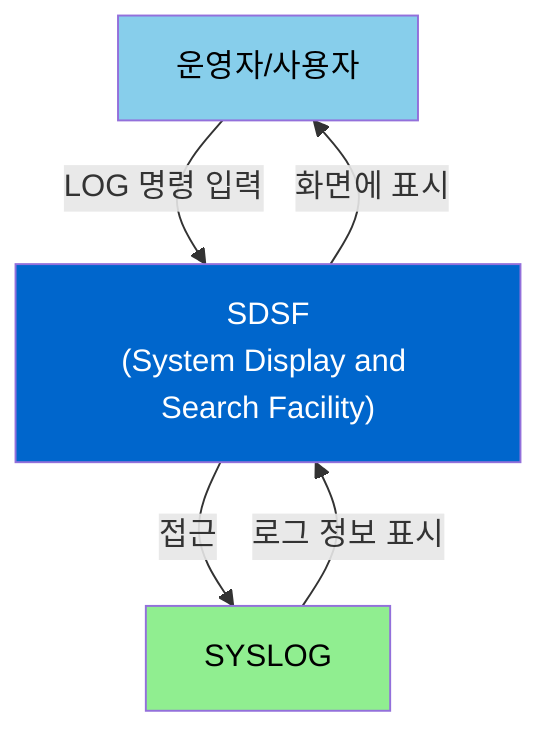
```mermaid
flowchart TB
    Operator["운영자/사용자"]
    SDSF["SDSF<br/>(System Display and Search Facility)"]
    SYSLOG["SYSLOG"]
    
    Operator -->|LOG 명령 입력| SDSF
    SDSF -->|접근| SYSLOG
    SYSLOG -->|로그 정보 표시| SDSF
    SDSF -->|화면에 표시| Operator
    
    style Operator fill:#87ceeb,color:#000
    style SDSF fill:#0066cc,color:#fff
    style SYSLOG fill:#90ee90,color:#000
```

### SYSLOG의 역할

SYSLOG는 z/OS 시스템 운영에서 중요한 역할을 합니다:

1. **통신 기록**: 프로그램, 운영자, 시스템 간의 모든 통신을 기록
2. **문제 진단**: 시스템 문제를 진단하고 해결하는 데 필요한 정보 제공
3. **감사 추적**: 운영자 작업 및 시스템 이벤트에 대한 감사 추적
4. **작업 모니터링**: 작업 실행 상태 및 완료 시간 추적
5. **이벤트 분석**: 비정상적인 이벤트 및 시스템 동작 분석

### SYSLOG의 중요성

SYSLOG는 z/OS 시스템의 운영 및 유지보수를 위한 필수 도구입니다:

- **시스템 상태 파악**: 현재 시스템 상태 및 이벤트 확인
- **문제 해결**: 시스템 문제 발생 시 원인 분석
- **성능 모니터링**: 시스템 성능 및 작업 실행 시간 모니터링
- **보안 감사**: 시스템 접근 및 작업에 대한 보안 감사

::: tip SYSLOG 요약

- **SYSLOG**: 시스템 로그로, 프로그램, 운영자, 시스템 간의 통신을 기록
- **주요 내용**:
  - 운영자 작업 및 응답
  - 작업 시작 및 완료 시간
  - WTO 및 WTOR 메시지
  - 작업 중단(abend) 메시지
  - 운영 체제 명령
  - 비정상적인 이벤트 설명
- **접근 방법**: SDSF에서 `LOG` 명령을 입력하여 접근
- **용도**: 시스템 문제 진단, 감사 추적, 작업 모니터링

:::

## System Automation (시스템 자동화)

### System Automation의 정의

많은 조직이 이제 다양한 시스템의 콘솔에서 나오는 메시지를 상관관계 분석하고, 메시지를 필터링하며, 일상적인 문제에 필요한 응답과 작업을 자동화하는 형태의 시스템 자동화에 의존하고 있습니다.

### System Automation의 작동 방식

System Automation은 여러 콘솔에서 메시지를 수집하고, 메시지를 필터링한 후, 필요한 작업을 자동으로 수행하거나 다른 콘솔로 메시지를 전송합니다.

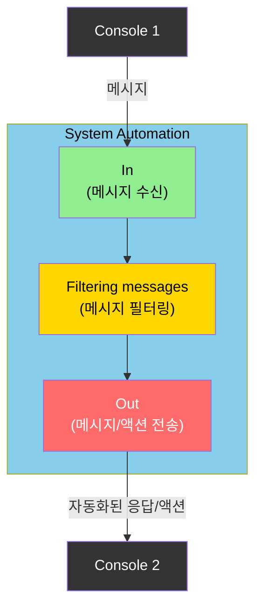
```mermaid
flowchart TB
    Console1["Console 1"]
    Console2["Console 2"]
    
    subgraph Automation["System Automation"]
        In["In<br/>(메시지 수신)"]
        Out["Out<br/>(메시지/액션 전송)"]
        Filter["Filtering messages<br/>(메시지 필터링)"]
    end
    
    Console1 -->|메시지| In
    
    In --> Filter
    Filter --> Out
    
    Out -->|자동화된 응답/액션| Console2
    
    style Automation fill:#87ceeb,color:#000
    style In fill:#90ee90,color:#000
    style Out fill:#ff6b6b,color:#fff
    style Filter fill:#ffd700,color:#000
    style Console1 fill:#333,color:#fff
    style Console2 fill:#333,color:#fff
```

#### System Automation의 처리 과정

1. **메시지 수신 (In)**: 여러 콘솔에서 메시지를 수신합니다
2. **메시지 필터링 (Filtering messages)**: 수신된 메시지를 분석하고 필터링합니다
3. **자동화 처리**: 필터링된 메시지에 따라 필요한 작업을 자동으로 수행합니다
4. **메시지/액션 전송 (Out)**: 처리 결과를 다른 콘솔로 전송하거나 필요한 액션을 실행합니다

### System Automation의 주요 기능

System Automation은 다음과 같은 기능을 제공합니다:

1. **메시지 상관관계 분석**: 다양한 시스템의 콘솔에서 나오는 메시지를 수집하고 상관관계를 분석합니다
2. **메시지 필터링**: 중요한 메시지와 일반적인 메시지를 구분하여 필터링합니다
3. **자동 응답**: 일상적인 문제에 대해 자동으로 응답합니다
4. **자동 작업 수행**: 정의된 규칙에 따라 작업을 자동으로 수행합니다
5. **콘솔 통합 관리**: 여러 콘솔의 메시지를 중앙에서 관리합니다

### System Automation 제품 예시

시장에는 여러 System Automation 제품이 있습니다:

- **IBM Z System Automation**: IBM의 시스템 자동화 제품
- **Broadcom's OPS/MVS Event Management & Automation**: Broadcom의 이벤트 관리 및 자동화 제품
- **BMC AMI Ops**: BMC의 운영 자동화 제품

### System Automation의 이점

System Automation을 사용하면 다음과 같은 이점을 얻을 수 있습니다:

1. **운영 효율성 향상**: 일상적인 작업을 자동화하여 운영 효율성을 향상시킵니다
2. **응답 시간 단축**: 자동화된 응답으로 문제 해결 시간을 단축합니다
3. **인적 오류 감소**: 자동화된 처리로 인적 오류를 감소시킵니다
4. **24/7 모니터링**: 시스템을 지속적으로 모니터링하고 자동으로 대응합니다
5. **리소스 최적화**: 운영자 리소스를 더 중요한 작업에 집중시킬 수 있습니다

### System Automation의 작동 흐름

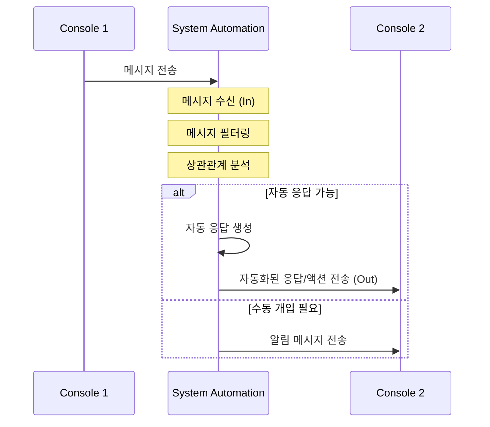
```mermaid
sequenceDiagram
    participant Console1 as Console 1
    participant Automation as System Automation
    participant Console2 as Console 2
    
    Console1->>Automation: 메시지 전송
    
    Note over Automation: 메시지 수신 (In)
    Note over Automation: 메시지 필터링
    Note over Automation: 상관관계 분석
    
    alt 자동 응답 가능
        Automation->>Automation: 자동 응답 생성
        Automation->>Console2: 자동화된 응답/액션 전송 (Out)
    else 수동 개입 필요
        Automation->>Console2: 알림 메시지 전송
    end
```

### System Automation의 중요성

현대의 z/OS 환경에서는 System Automation이 필수적인 구성 요소가 되었습니다:

- **복잡성 관리**: 여러 시스템과 콘솔의 복잡성을 관리합니다
- **일상 작업 자동화**: 반복적인 일상 작업을 자동화합니다
- **문제 예방**: 문제를 사전에 감지하고 자동으로 대응합니다
- **운영 비용 절감**: 운영 비용을 절감하고 효율성을 향상시킵니다

::: tip System Automation 요약

- **System Automation**: 여러 시스템의 콘솔 메시지를 상관관계 분석하고 필터링하며 자동화하는 시스템
- **작동 방식**:
  - 여러 콘솔에서 메시지 수신 (In)
  - 메시지 필터링 및 분석
  - 자동 응답 및 작업 수행
  - 다른 콘솔로 메시지/액션 전송 (Out)
- **주요 제품**:
  - IBM Z System Automation
  - Broadcom's OPS/MVS Event Management & Automation
  - BMC AMI Ops
- **이점**: 운영 효율성 향상, 응답 시간 단축, 인적 오류 감소, 24/7 모니터링

:::

## CICS (Customer Information Control System)

### CICS의 정의

`CICS (Customer Information Control System)`는 고속 트랜잭션 처리 시스템으로, 다양한 산업 분야에서 중요한 역할을 합니다.

### CICS의 기능

CICS는 VTAM 또는 TCP/IP와 함께 작동하여 터미널에서 입력된 트랜잭션을 애플리케이션 프로그램에 의해 동시에 처리할 수 있게 합니다.

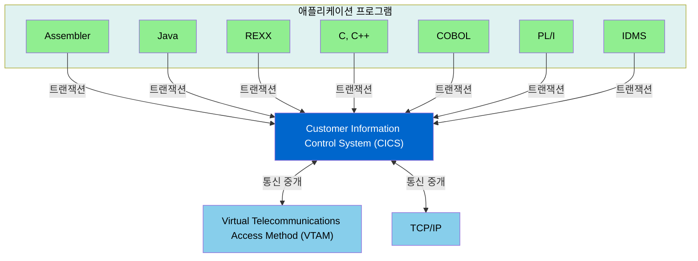
```mermaid
flowchart TB
    CICS["Customer Information Control System (CICS)"]
    VTAM["Virtual Telecommunications Access Method (VTAM)"]
    TCPIP["TCP/IP"]
    
    subgraph Applications["애플리케이션 프로그램"]
        Assembler["Assembler"]
        Java["Java"]
        REXX["REXX"]
        CCpp["C, C++"]
        COBOL["COBOL"]
        PLI["PL/I"]
        IDMS["IDMS"]
    end
    
    Assembler -->|트랜잭션| CICS
    Java -->|트랜잭션| CICS
    REXX -->|트랜잭션| CICS
    CCpp -->|트랜잭션| CICS
    COBOL -->|트랜잭션| CICS
    PLI -->|트랜잭션| CICS
    IDMS -->|트랜잭션| CICS
    
    CICS <-->|통신 중개| VTAM
    CICS <-->|통신 중개| TCPIP
    
    style CICS fill:#0066cc,color:#fff
    style VTAM fill:#87ceeb,color:#000
    style TCPIP fill:#87ceeb,color:#000
    style Applications fill:#e0f2f1,color:#000
    style Assembler fill:#90ee90,color:#000
    style Java fill:#90ee90,color:#000
    style REXX fill:#90ee90,color:#000
    style CCpp fill:#90ee90,color:#000
    style COBOL fill:#90ee90,color:#000
    style PLI fill:#90ee90,color:#000
    style IDMS fill:#90ee90,color:#000
```

### CICS의 성능

CICS는 초당 수천 개의 트랜잭션을 처리할 수 있어서, 고속의 안전한 데이터 접근이 필요한 환경에 이상적입니다.

### CICS의 주요 사용 사례

CICS는 다음과 같은 분야에서 널리 사용됩니다:

1. **은행**: 텔러 시스템에서 고객 거래 처리
2. **정부**: 고객 지원 시스템
3. **항공사**: 예약 시스템
4. **기타 조직**: 고속의 안전한 데이터 접근이 필요한 모든 조직

### CICS와 통신 방법

CICS는 다음과 같은 통신 방법을 사용합니다:

- **VTAM**: Virtual Telecommunications Access Method를 통한 통신
- **TCP/IP**: 표준 TCP/IP 프로토콜을 통한 통신

### CICS가 지원하는 프로그래밍 언어

CICS는 다양한 프로그래밍 언어로 작성된 애플리케이션 프로그램과 함께 작동할 수 있습니다:

- **Assembler**: 어셈블리 언어
- **Java**: 자바 언어
- **REXX**: REXX 스크립트 언어
- **C, C++**: C 및 C++ 언어
- **COBOL**: COBOL 언어
- **PL/I**: PL/I 언어
- **IDMS**: IDMS 데이터베이스 시스템

### CICS의 트랜잭션 처리 과정

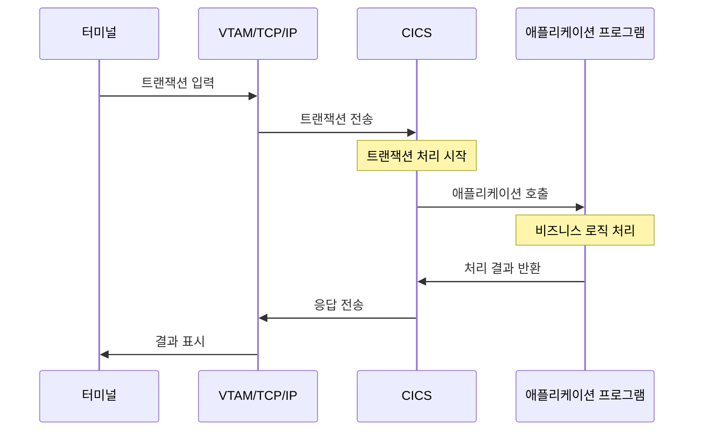
```mermaid
sequenceDiagram
    participant Terminal as 터미널
    participant VTAM as VTAM/TCP/IP
    participant CICS
    participant App as 애플리케이션 프로그램
    
    Terminal->>VTAM: 트랜잭션 입력
    VTAM->>CICS: 트랜잭션 전송
    Note over CICS: 트랜잭션 처리 시작
    CICS->>App: 애플리케이션 호출
    Note over App: 비즈니스 로직 처리
    App->>CICS: 처리 결과 반환
    CICS->>VTAM: 응답 전송
    VTAM->>Terminal: 결과 표시
```

### CICS의 특징

1. **고속 처리**: 초당 수천 개의 트랜잭션 처리 가능
2. **동시 처리**: 여러 트랜잭션을 동시에 처리
3. **다양한 언어 지원**: 여러 프로그래밍 언어로 작성된 애플리케이션 지원
4. **안전한 데이터 접근**: 안전한 데이터 접근 보장
5. **통신 유연성**: VTAM 또는 TCP/IP를 통한 통신 지원

### CICS의 중요성

CICS는 현대의 엔터프라이즈 환경에서 필수적인 트랜잭션 처리 시스템입니다:

- **실시간 처리**: 실시간으로 트랜잭션을 처리하여 즉각적인 응답 제공
- **고가용성**: 높은 가용성과 안정성 제공
- **확장성**: 대규모 트랜잭션 부하를 처리할 수 있는 확장성
- **보안**: 안전한 데이터 접근 및 트랜잭션 처리
- **통합**: 다양한 시스템과 통합 가능

::: tip CICS 요약

- **CICS (Customer Information Control System)**: 고속 트랜잭션 처리 시스템
- **주요 기능**:
  - VTAM 또는 TCP/IP와 함께 작동하여 터미널 트랜잭션 처리
  - 초당 수천 개의 트랜잭션 처리 가능
  - 다양한 프로그래밍 언어로 작성된 애플리케이션 지원
- **주요 사용 사례**:
  - 은행 텔러 시스템
  - 정부 고객 지원
  - 항공사 예약 시스템
  - 고속의 안전한 데이터 접근이 필요한 조직
- **지원 언어**: Assembler, Java, REXX, C/C++, COBOL, PL/I, IDMS
- **통신 방법**: VTAM 또는 TCP/IP

:::

## IMS (Information Management System)

### IMS의 정의

`IMS (Information Management System)`는 IBM의 온라인 애플리케이션 및 데이터베이스 관리 시스템입니다. IMS는 CICS의 트랜잭션 처리 기능과 IBM Db2의 데이터베이스 관리 기능을 함께 제공합니다.

### IMS의 아키텍처

IMS는 VTAM/TCP/IP와 함께 작동하며, 여러 데이터베이스와 양방향으로 통신합니다.

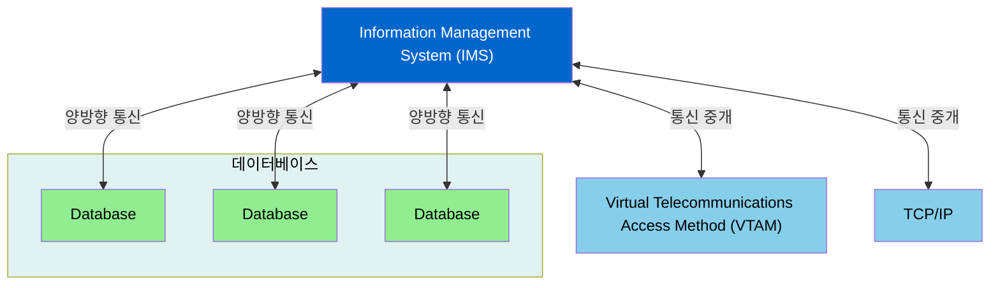
```mermaid
flowchart TB
    IMS["Information Management System (IMS)"]
    VTAM["Virtual Telecommunications Access Method (VTAM)"]
    TCPIP["TCP/IP"]
    
    subgraph Databases["데이터베이스"]
        DB1["Database"]
        DB2["Database"]
        DB3["Database"]
    end
    
    IMS <-->|양방향 통신| DB1
    IMS <-->|양방향 통신| DB2
    IMS <-->|양방향 통신| DB3
    
    IMS <-->|통신 중개| VTAM
    IMS <-->|통신 중개| TCPIP
    
    style IMS fill:#0066cc,color:#fff
    style VTAM fill:#87ceeb,color:#000
    style TCPIP fill:#87ceeb,color:#000
    style Databases fill:#e0f2f1,color:#000
    style DB1 fill:#90ee90,color:#000
    style DB2 fill:#90ee90,color:#000
    style DB3 fill:#90ee90,color:#000
```

### IMS의 주요 기능

IMS는 다음과 같은 기능을 제공합니다:

1. **트랜잭션 처리**: CICS와 유사한 트랜잭션 처리 기능
2. **데이터베이스 관리**: Db2와 유사한 데이터베이스 관리 기능
3. **온라인 애플리케이션 지원**: 온라인 애플리케이션 실행 환경 제공
4. **다중 데이터베이스 지원**: 여러 데이터베이스와 동시에 통신 가능
5. **통신 지원**: VTAM/TCP/IP를 통한 통신 지원

### IMS의 특징

- **통합 솔루션**: 트랜잭션 처리와 데이터베이스 관리를 하나의 시스템으로 통합
- **고성능**: 대규모 트랜잭션 처리 및 데이터베이스 작업 지원
- **안정성**: 엔터프라이즈급 안정성과 가용성 제공
- **확장성**: 대규모 데이터베이스 환경 지원

### IMS와 CICS, Db2의 비교

| 기능 | IMS | CICS | Db2 |
|------|-----|------|-----|
| **트랜잭션 처리** | ✓ | ✓ | - |
| **데이터베이스 관리** | ✓ | - | ✓ |
| **온라인 애플리케이션** | ✓ | ✓ | - |
| **통합 솔루션** | ✓ | - | - |

::: tip IMS 요약

- **IMS (Information Management System)**: 온라인 애플리케이션 및 데이터베이스 관리 시스템
- **주요 기능**:
  - CICS의 트랜잭션 처리 기능 제공
  - IBM Db2의 데이터베이스 관리 기능 제공
  - VTAM/TCP/IP를 통한 통신 지원
  - 여러 데이터베이스와 양방향 통신
- **특징**: 트랜잭션 처리와 데이터베이스 관리를 통합한 솔루션

:::

## Db2

### Db2의 정의

`Db2`는 `Structured Query Language (SQL)` 구문으로 구동되는 관계형 데이터베이스 관리 시스템입니다.

### Db2의 진화

Db2는 원래 단순한 구조화된 데이터를 처리하기 위해 개발되었지만, 오늘날의 증가하는 정보 및 데이터 요구 사항으로 인해 크로스 플랫폼에서 실행되고 이미지, 텍스트, 비디오, 대용량 객체, XML과 같은 다양한 데이터 타입을 처리할 수 있는 제품군으로 발전했습니다.

### Db2 데이터베이스 구성 요소

Db2 데이터베이스는 다음과 같은 구성 요소를 포함합니다:

1. **Tables (테이블)**: 데이터를 저장하는 기본 구조
2. **Tables spaces (테이블스페이스)**: 테이블이 저장되는 논리적 저장소 영역
3. **Storage groups (스토리지 그룹)**: 물리적 저장소 장치를 그룹화한 것
4. **Views (뷰)**: 하나 이상의 테이블에서 데이터를 추출한 논리적 표현
5. **Indexes (인덱스)**: 데이터 검색 성능을 향상시키는 구조

### Db2의 주요 특징

1. **관계형 데이터베이스**: SQL을 사용한 관계형 데이터베이스 관리
2. **크로스 플랫폼**: 다양한 플랫폼에서 실행 가능
3. **다양한 데이터 타입 지원**:
   - 구조화된 데이터
   - 이미지
   - 텍스트
   - 비디오
   - 대용량 객체 (Large Objects)
   - XML
4. **고성능**: 대규모 데이터 처리 및 고성능 쿼리 처리
5. **확장성**: 엔터프라이즈급 확장성 제공

### Db2의 사용 사례

Db2는 다음과 같은 환경에서 사용됩니다:

- **엔터프라이즈 데이터베이스**: 대규모 기업의 핵심 데이터베이스
- **데이터 웨어하우스**: 대용량 데이터 분석 및 저장
- **온라인 트랜잭션 처리 (OLTP)**: 실시간 트랜잭션 처리
- **비즈니스 인텔리전스**: 비즈니스 분석 및 리포팅
- **하이브리드 데이터**: 구조화된 데이터와 비구조화된 데이터의 통합 관리

### Db2의 중요성

Db2는 현대의 데이터 중심 환경에서 필수적인 데이터베이스 관리 시스템입니다:

- **데이터 통합**: 다양한 형태의 데이터를 통합 관리
- **성능 최적화**: 고성능 데이터 처리 및 쿼리 최적화
- **안정성**: 엔터프라이즈급 안정성과 가용성
- **보안**: 강력한 데이터 보안 및 접근 제어
- **유연성**: 다양한 데이터 타입과 플랫폼 지원

::: tip Db2 요약

- **Db2**: SQL로 구동되는 관계형 데이터베이스 관리 시스템
- **주요 구성 요소**:
  - Tables (테이블)
  - Tables spaces (테이블스페이스)
  - Storage groups (스토리지 그룹)
  - Views (뷰)
  - Indexes (인덱스)
- **지원 데이터 타입**: 구조화된 데이터, 이미지, 텍스트, 비디오, 대용량 객체, XML
- **특징**: 크로스 플랫폼 지원, 고성능, 확장성, 다양한 데이터 타입 처리

:::

## IBM MQ

### IBM MQ의 정의

`IBM MQ`는 `MQSeries`라는 MVS 제품에서 시작되었으며, 종종 단순히 `MQ`라고 불립니다. MQ는 `Message Queuing (메시지 큐잉)`을 의미합니다.

### IBM MQ의 목적

IBM MQ의 목적은 프로그램이 z/OS, Windows, UNIX 또는 기타 여러 플랫폼에서 실행되는 다른 시스템의 다른 프로그램과 메시지를 주고받을 수 있게 하는 것입니다.

### IBM MQ 네트워크 아키텍처

IBM MQ는 다양한 플랫폼 간의 메시지 통신을 지원합니다.

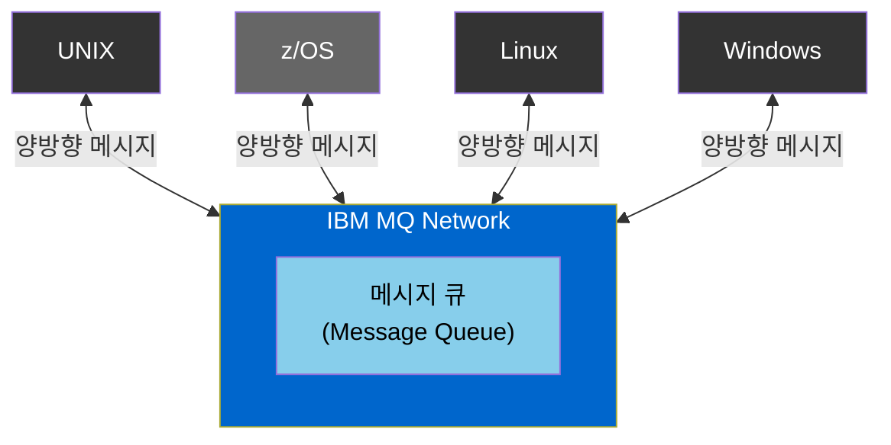
```mermaid
flowchart TB
    subgraph MQNetwork["IBM MQ Network"]
        Queue["메시지 큐<br/>(Message Queue)"]
    end
    
    UNIX["UNIX"]
    ZOS["z/OS"]
    Linux["Linux"]
    Windows["Windows"]
    
    UNIX <-->|양방향 메시지| MQNetwork
    ZOS <-->|양방향 메시지| MQNetwork
    Linux <-->|양방향 메시지| MQNetwork
    Windows <-->|양방향 메시지| MQNetwork
    
    style MQNetwork fill:#0066cc,color:#fff
    style Queue fill:#87ceeb,color:#000
    style UNIX fill:#333,color:#fff
    style ZOS fill:#666,color:#fff
    style Linux fill:#333,color:#fff
    style Windows fill:#333,color:#fff
```

### IBM MQ의 작동 방식

IBM MQ는 메시지 큐잉을 통해 비동기 메시지 통신을 제공합니다:

1. **메시지 전송**: 한 시스템의 프로그램이 메시지를 큐에 전송
2. **메시지 큐잉**: 메시지가 큐에 저장됨
3. **메시지 수신**: 다른 시스템의 프로그램이 큐에서 메시지를 수신

### IBM MQ의 특징

1. **플랫폼 독립성**: 다양한 운영 체제와 플랫폼 간 통신 지원
2. **비동기 통신**: 프로그램이 직접 연결되지 않아도 메시지 교환 가능
3. **신뢰성**: 메시지 전달 보장 및 오류 처리
4. **확장성**: 대규모 메시지 처리 지원
5. **유연성**: 다양한 애플리케이션 통합 지원

### IBM MQ의 사용 사례

IBM MQ는 다음과 같은 환경에서 사용됩니다:

- **엔터프라이즈 통합**: 다양한 시스템 간의 메시지 통신
- **비동기 처리**: 비동기 작업 처리 및 이벤트 기반 아키텍처
- **시스템 간 통신**: 서로 다른 플랫폼의 시스템 간 통신
- **메시지 브로커**: 메시지 라우팅 및 변환

::: tip IBM MQ 요약

- **IBM MQ**: Message Queuing을 의미하며, MQSeries에서 시작
- **목적**: 다양한 플랫폼(z/OS, Windows, UNIX, Linux 등)에서 실행되는 프로그램 간 메시지 통신
- **주요 특징**:
  - 플랫폼 독립성
  - 비동기 통신
  - 신뢰성 있는 메시지 전달
  - 확장성 및 유연성
- **사용 사례**: 엔터프라이즈 통합, 비동기 처리, 시스템 간 통신

:::

## Security (보안)

### z/OS 보안의 특징

z/OS 자체는 사용자 ID 및 비밀번호 관리나 데이터셋 보안과 같은 보안 기능을 제공하지 않습니다. 이러한 기능은 별도의 보안 제품에 의해 수행됩니다.

### 보안 제품

z/OS 환경에서 보안을 제공하는 주요 제품들은 다음과 같습니다:

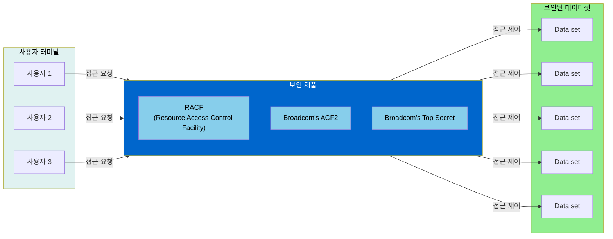
```mermaid
flowchart LR
    subgraph Users["사용자 터미널"]
        User1["사용자 1"]
        User2["사용자 2"]
        User3["사용자 3"]
    end
    
    subgraph Security["보안 제품"]
        direction TB
        RACF["RACF<br/>(Resource Access Control Facility)"]
        ACF2["Broadcom's ACF2"]
        TopSecret["Broadcom's Top Secret"]
    end
    
    subgraph Datasets["보안된 데이터셋"]
        DS1["Data set"]
        DS2["Data set"]
        DS3["Data set"]
        DS4["Data set"]
        DS5["Data set"]
    end
    
    User1 -->|접근 요청| Security
    User2 -->|접근 요청| Security
    User3 -->|접근 요청| Security
    
    Security -->|접근 제어| DS1
    Security -->|접근 제어| DS2
    Security -->|접근 제어| DS3
    Security -->|접근 제어| DS4
    Security -->|접근 제어| DS5
    
    style Security fill:#0066cc,color:#fff
    style RACF fill:#87ceeb,color:#000
    style ACF2 fill:#87ceeb,color:#000
    style TopSecret fill:#87ceeb,color:#000
    style Users fill:#e0f2f1,color:#000
    style Datasets fill:#90ee90,color:#000
```

### IBM Security Server (RACF)

IBM은 `IBM Security Server` 제품을 제공하며, 이는 종종 주요 구성 요소 중 하나인 `Resource Access Control Facility (RACF)`로 불립니다.

#### RACF의 주요 기능

- **사용자 인증**: 사용자 ID 및 비밀번호 관리
- **리소스 접근 제어**: 데이터셋 및 기타 리소스에 대한 접근 제어
- **권한 관리**: 사용자 및 그룹 권한 관리
- **감사 추적**: 보안 이벤트 로깅 및 감사

### Broadcom 보안 제품

Broadcom은 두 가지 보안 제품을 제공합니다:

1. **ACF2**: Broadcom의 보안 제품
2. **Top Secret**: Broadcom의 보안 제품

### 보안 제품의 역할

보안 제품은 다음과 같은 역할을 수행합니다:

1. **사용자 인증**: 사용자 ID 및 비밀번호 관리
2. **접근 제어**: 데이터셋 및 시스템 리소스에 대한 접근 제어
3. **권한 관리**: 사용자 권한 및 그룹 권한 관리
4. **보안 정책 적용**: 조직의 보안 정책 적용 및 강제
5. **감사 및 로깅**: 보안 이벤트 감사 및 로깅

### 보안 제품의 작동 방식

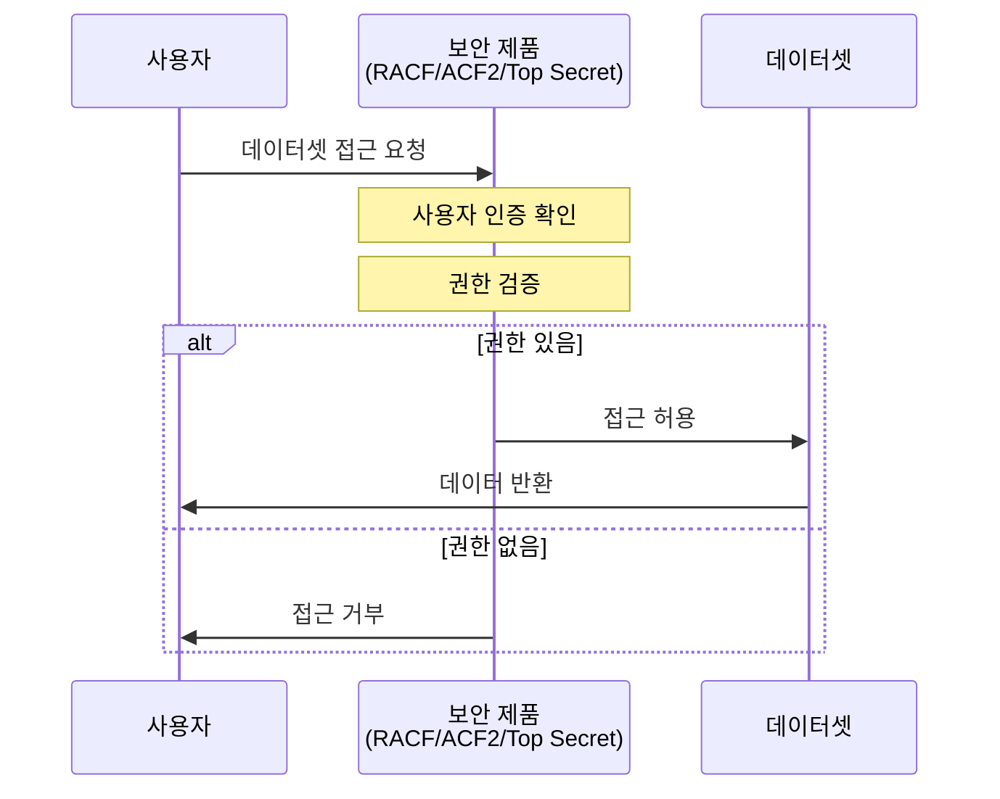
```mermaid
sequenceDiagram
    participant User as 사용자
    participant Security as 보안 제품<br/>(RACF/ACF2/Top Secret)
    participant Dataset as 데이터셋
    
    User->>Security: 데이터셋 접근 요청
    Note over Security: 사용자 인증 확인
    Note over Security: 권한 검증
    alt 권한 있음
        Security->>Dataset: 접근 허용
        Dataset->>User: 데이터 반환
    else 권한 없음
        Security->>User: 접근 거부
    end
```

### 보안 제품의 중요성

보안 제품은 z/OS 환경에서 필수적인 구성 요소입니다:

- **데이터 보호**: 중요한 데이터를 무단 접근으로부터 보호
- **규정 준수**: 보안 규정 및 정책 준수
- **감사 추적**: 보안 이벤트 추적 및 감사
- **접근 제어**: 세밀한 접근 제어 및 권한 관리
- **사용자 관리**: 사용자 계정 및 인증 관리

### 보안 제품 비교

| 제품 | 제공업체 | 주요 특징 |
|------|----------|----------|
| **RACF** | IBM | IBM Security Server의 주요 구성 요소 |
| **ACF2** | Broadcom | Broadcom의 보안 제품 |
| **Top Secret** | Broadcom | Broadcom의 보안 제품 |

::: tip Security 요약

- **z/OS 보안**: z/OS 자체는 보안 기능을 제공하지 않음
- **보안 제품 필요**: 별도의 보안 제품이 필요함
- **주요 보안 제품**:
  - **IBM Security Server (RACF)**: IBM의 보안 제품
  - **Broadcom's ACF2**: Broadcom의 보안 제품
  - **Broadcom's Top Secret**: Broadcom의 보안 제품
- **주요 기능**:
  - 사용자 ID 및 비밀번호 관리
  - 데이터셋 보안 및 접근 제어
  - 권한 관리 및 감사 추적

:::

## SMS/HSM (Storage Management Subsystem / Hierarchical Storage Manager)

### SMS (Storage Management Subsystem)의 정의

`SMS (Storage Management Subsystem)`는 다양한 기존 IBM 제품을 통합하여 자동 공간 관리를 제공하는 시스템입니다. SMS는 데이터셋의 자동 관리, 저장소 할당, 그리고 계층적 저장소 관리를 포함합니다.

### HSM (Hierarchical Storage Manager)

`HSM (Hierarchical Storage Manager)`는 SMS의 구성 요소 중 하나로, `DFSMShsm`으로도 알려져 있습니다. SMS의 구성 요소 중 운영자에게 가장 잘 보이는 부분이며, 계층적 저장소 관리를 담당합니다.

HSM은 선택적인 z/OS 기능으로, 자주 접근되지 않는 데이터를 더 느리고 저렴한 저장소 미디어(테이프 포함)로 이동시켜 DASD의 공간을 자동으로 제어합니다. 이를 통해 더 빠르고 비용이 많이 드는 장치의 공간을 확보하여 더 자주 사용되는 데이터에 빠른 접근을 제공할 수 있습니다.

### HSM의 작동 방식

HSM은 공간 사용률 또는 데이터 연령을 기반으로 한 사전 정의된 임계값을 사용하여 참조되지 않은 데이터를 PRIMARY(일반) DASD에서 HSM Level 1 DASD의 압축 형식으로 이동시킵니다.

### 계층적 저장소 구조

HSM은 3단계 계층적 저장소 구조를 사용합니다:

```mermaid
flowchart LR
    subgraph SMS["Storage Management Subsystem (SMS)"]
        HSM["Hierarchical Storage Manager (HSM)"]
    end
    
    Primary["Primary volumes<br/>(주 저장소)"]
    Level1["Level 1 volumes<br/>(1차 보조 저장소)"]
    Level2["Level 2 volumes<br/>(2차 보조 저장소<br/>카트리지 테이프)"]
    
    Primary -->|데이터 마이그레이션| Level1
    Level1 -->|데이터 마이그레이션| Level2
    
    Level2 -.->|데이터 참조 시 복원| Primary
    Level1 -.->|데이터 참조 시 복원| Primary
    
    SMS -->|관리| Primary
    SMS -->|관리| Level1
    SMS -->|관리| Level2
    
    style SMS fill:#87ceeb,color:#000
    style HSM fill:#0066cc,color:#fff
    style Primary fill:#90ee90,color:#000
    style Level1 fill:#ffa500,color:#000
    style Level2 fill:#666,color:#fff
```

#### 저장소 계층 설명

1. **Primary volumes (주 저장소)**:
   - 가장 빠르고 비용이 많이 드는 저장소
   - 자주 사용되는 데이터 저장
   - 빠른 접근 제공

2. **Level 1 volumes (1차 보조 저장소)**:
   - 중간 속도 및 비용의 저장소
   - 압축 형식으로 데이터 저장
   - 자주 사용되지 않는 데이터 저장

3. **Level 2 volumes (2차 보조 저장소)**:
   - 가장 느리고 저렴한 저장소
   - 카트리지 기반 테이프 저장소
   - 거의 사용되지 않는 데이터 저장

### 데이터 마이그레이션 및 복원 규칙

#### 데이터 마이그레이션

1. **Primary → Level 1**: 
   - 공간 사용률 또는 데이터 연령을 기반으로 한 임계값에 도달하면
   - 참조되지 않은 데이터가 Primary volumes에서 Level 1 volumes로 이동

2. **Level 1 → Level 2**:
   - Level 1 DASD에서 사전 설정된 기간 동안 사용되지 않은 데이터는
   - 카트리지 기반 저장소(Level 2 volumes)로 이동

#### 데이터 복원

어느 단계에서든 데이터가 참조되면, 해당 데이터는 원래 위치(Primary volumes)로 자동 복원됩니다.

```mermaid
sequenceDiagram
    participant App as 애플리케이션
    participant Primary as Primary volumes
    participant Level1 as Level 1 volumes
    participant Level2 as Level 2 volumes
    participant HSM
    
    Note over HSM: 데이터 사용 빈도 모니터링
    HSM->>Primary: 자주 사용되는 데이터 유지
    HSM->>Level1: 사용 빈도 낮은 데이터 마이그레이션
    HSM->>Level2: 오래 사용되지 않은 데이터 마이그레이션
    
    App->>HSM: Level 2의 데이터 요청
    HSM->>Level2: 데이터 읽기
    HSM->>Primary: 원래 위치로 복원
    HSM->>App: 데이터 제공
    Note over App: 데이터 접근 완료
```

### HSM의 주요 기능

1. **자동 공간 관리**: DASD 공간을 자동으로 관리
2. **데이터 마이그레이션**: 사용 빈도에 따라 데이터를 적절한 저장소 계층으로 이동
3. **비용 최적화**: 비용이 많이 드는 저장소 공간을 효율적으로 사용
4. **자동 복원**: 참조된 데이터를 자동으로 원래 위치로 복원
5. **압축**: Level 1 저장소에서 데이터 압축으로 공간 절약

### HSM의 이점

HSM을 사용하면 다음과 같은 이점을 얻을 수 있습니다:

1. **비용 절감**: 자주 사용되지 않는 데이터를 저렴한 저장소로 이동하여 비용 절감
2. **성능 향상**: 자주 사용되는 데이터를 빠른 저장소에 유지하여 성능 향상
3. **자동화**: 수동 개입 없이 자동으로 데이터 관리
4. **공간 최적화**: 저장소 공간을 효율적으로 활용
5. **투명성**: 애플리케이션은 데이터 위치를 신경 쓸 필요 없음

### HSM의 작동 원리

HSM은 다음과 같은 기준으로 데이터를 관리합니다:

- **공간 사용률**: 저장소 공간 사용률이 임계값을 초과하면 데이터 마이그레이션
- **데이터 연령**: 일정 기간 동안 사용되지 않은 데이터를 자동으로 마이그레이션
- **접근 빈도**: 데이터 접근 빈도를 모니터링하여 적절한 저장소 계층으로 이동

### HSM의 중요성

HSM은 대규모 z/OS 환경에서 필수적인 구성 요소입니다:

- **저장소 비용 관리**: 저장소 비용을 효율적으로 관리
- **성능 최적화**: 자주 사용되는 데이터에 빠른 접근 제공
- **자동화**: 수동 관리 작업 감소
- **확장성**: 대규모 데이터 환경 지원

::: tip SMS/HSM 요약

- **SMS (Storage Management Subsystem)**: 다양한 IBM 제품을 통합하여 자동 공간 관리를 제공
- **HSM (Hierarchical Storage Manager)**: SMS의 구성 요소로, DFSMShsm으로도 알려짐
- **계층적 저장소 구조**:
  - Primary volumes: 빠르고 비용이 많이 드는 저장소
  - Level 1 volumes: 중간 속도 및 비용의 압축 저장소
  - Level 2 volumes: 느리고 저렴한 카트리지 테이프 저장소
- **작동 방식**:
  - 공간 사용률 또는 데이터 연령을 기반으로 데이터 마이그레이션
  - 데이터 참조 시 자동으로 원래 위치로 복원
- **주요 기능**: 자동 공간 관리, 데이터 마이그레이션, 비용 최적화, 자동 복원

:::

## Summary (요약)

### 모듈 개요

이 모듈에서는 운영 체제와 결합하여 완전한 컴퓨팅 환경에 필요한 시설을 제공하는 많은 제품들을 탐구했습니다.

### 주요 학습 내용

#### 1. Subsystems (서브시스템)

- **Primary Subsystem**: 모든 z/OS 설치에 필수인 Job Entry Subsystem (JES)
- **Secondary Subsystems**: SMS(HSM 포함), RACF, WLM 등 선택적 서브시스템
- 서브시스템은 다른 구성 요소와 비동기적으로 작동하는 시스템 구성 요소

#### 2. Job Control Language (JCL)

- z/OS 시스템의 핵심 언어
- 작업의 리소스 요구 사항을 정의
- JOB 문, EXEC 문, DD 문으로 구성
- 모든 작업 실행에 필수

#### 3. TSO/E and ISPF

- **TSO/E**: 프로그래머나 운영자가 z/OS 프로그램과 대화형으로 작업할 수 있게 해주는 도구
- **ISPF**: TSO/E 하에서 실행되는 메뉴 기반 인터페이스
- 데이터셋 생성, 소스 코드 작성, JCL 작성, 작업 제출 기능 제공

#### 4. VTAM and TCP/IP

- **VTAM**: 채널과 LAN 연결 장치 간의 데이터 전송 관리 및 SNA 라우팅
- **TCP/IP**: 비독점 표준 네트워크 프로토콜
- **z/OS Communications Server**: VTAM과 TCP/IP를 통합한 단일 제품

#### 5. System Log (SYSLOG)

- 프로그램, 운영자, 시스템 간의 통신 기록
- SDSF에서 `LOG` 명령으로 접근
- 운영자 작업, 작업 시간, WTO/WTOR 메시지 등 기록

#### 6. System Automation

- 여러 시스템의 콘솔 메시지를 상관관계 분석하고 필터링
- 일상적인 문제에 대한 자동 응답 및 작업 수행
- IBM Z System Automation, Broadcom's OPS/MVS, BMC AMI Ops 등

#### 7. CICS (Customer Information Control System)

- 고속 트랜잭션 처리 시스템
- VTAM 또는 TCP/IP와 함께 작동
- 초당 수천 개의 트랜잭션 처리 가능
- 다양한 프로그래밍 언어 지원

#### 8. IMS (Information Management System)

- 온라인 애플리케이션 및 데이터베이스 관리 시스템
- CICS의 트랜잭션 처리 기능과 Db2의 데이터베이스 관리 기능 제공
- 여러 데이터베이스와 양방향 통신

#### 9. Db2

- SQL로 구동되는 관계형 데이터베이스 관리 시스템
- 크로스 플랫폼 지원
- 다양한 데이터 타입 지원 (구조화된 데이터, 이미지, 텍스트, 비디오, XML 등)
- Tables, Tables spaces, Storage groups, Views, Indexes 구성

#### 10. IBM MQ

- Message Queuing을 의미하며, MQSeries에서 시작
- 다양한 플랫폼 간 메시지 통신 지원
- 비동기 통신 및 신뢰성 있는 메시지 전달

#### 11. Security (보안)

- z/OS 자체는 보안 기능을 제공하지 않음
- 별도의 보안 제품 필요:
  - IBM Security Server (RACF)
  - Broadcom's ACF2
  - Broadcom's Top Secret
- 사용자 인증, 데이터셋 보안, 접근 제어 기능 제공

#### 12. SMS/HSM

- **SMS**: 자동 공간 관리를 제공하는 시스템
- **HSM**: 계층적 저장소 관리자
- 3단계 저장소 구조: Primary volumes → Level 1 volumes → Level 2 volumes
- 자동 데이터 마이그레이션 및 복원

### 학습 목표 달성

이 모듈을 완료한 후, 다음을 수행할 수 있습니다:

- **가장 널리 사용되는 z/OS 시스템 구성 요소의 이름과 기능을 식별할 수 있습니다**

### 주요 구성 요소 요약표

| 구성 요소 | 주요 기능 |
|----------|----------|
| **JES** | 작업 입력 및 출력 관리 |
| **JCL** | 작업의 리소스 요구 사항 정의 |
| **TSO/E** | 대화형 작업 환경 제공 |
| **ISPF** | 메뉴 기반 인터페이스 제공 |
| **VTAM** | 통신 중개 및 SNA 라우팅 |
| **TCP/IP** | 표준 네트워크 통신 |
| **CICS** | 고속 트랜잭션 처리 |
| **IMS** | 트랜잭션 처리 및 데이터베이스 관리 |
| **Db2** | 관계형 데이터베이스 관리 |
| **IBM MQ** | 메시지 큐잉 및 통신 |
| **RACF/ACF2/Top Secret** | 보안 및 접근 제어 |
| **SMS/HSM** | 자동 저장소 관리 |

### 결론

z/OS 시스템은 운영 체제와 함께 작동하는 다양한 제품들로 구성된 완전한 컴퓨팅 환경을 제공합니다. 이러한 구성 요소들은 각각 고유한 기능을 제공하며, 함께 작동하여 엔터프라이즈급 컴퓨팅 환경을 구축합니다.

