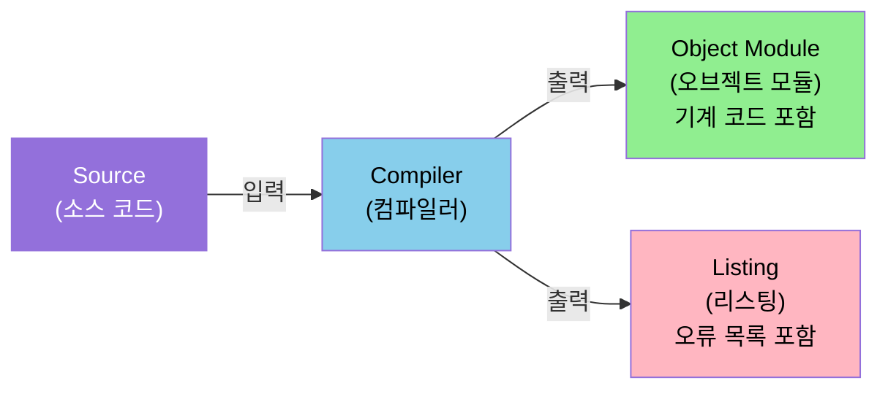
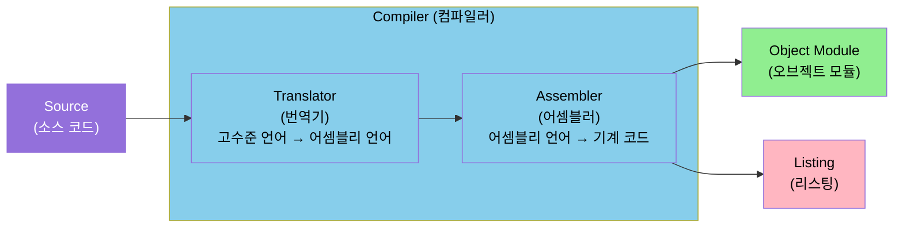
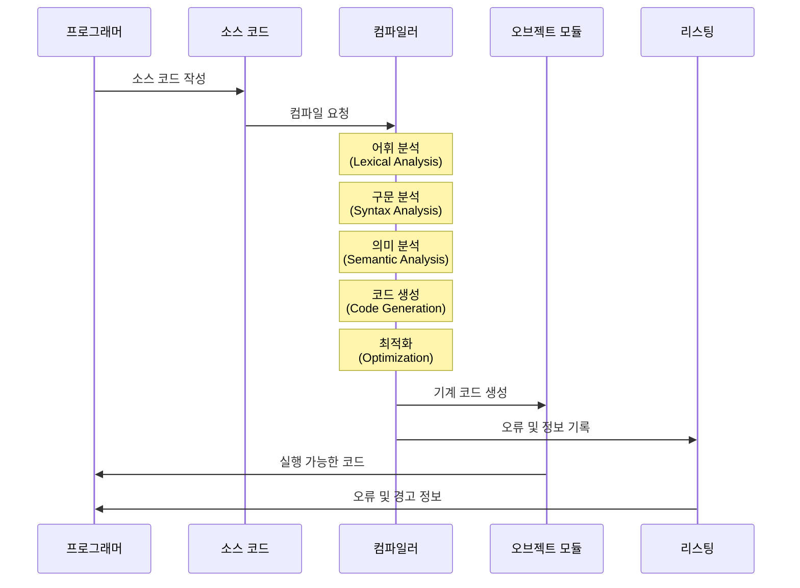
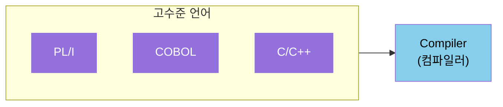
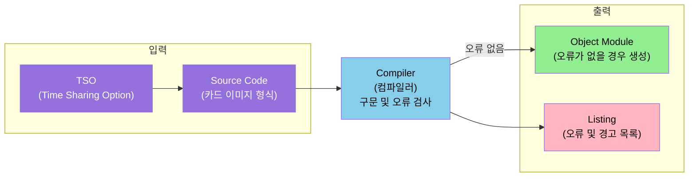
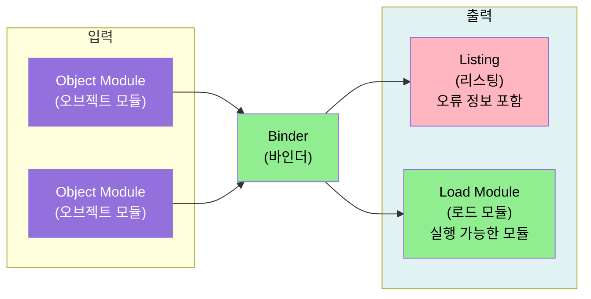
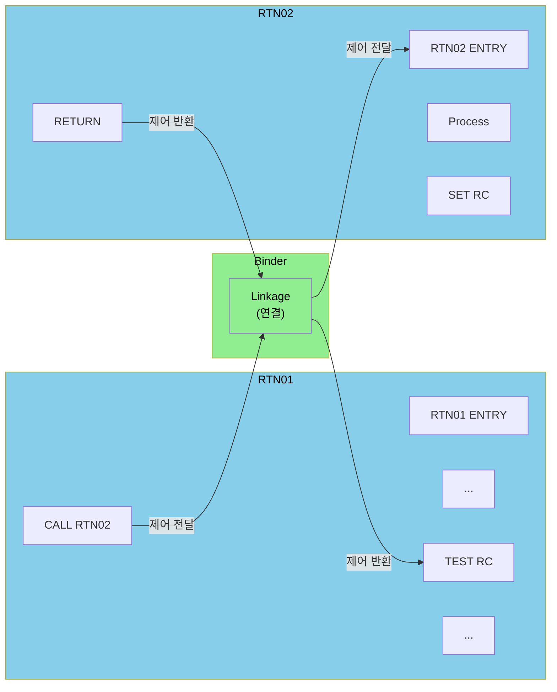
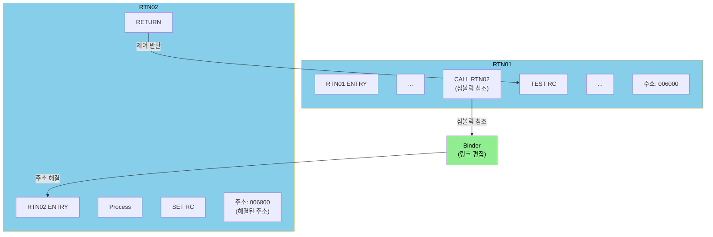
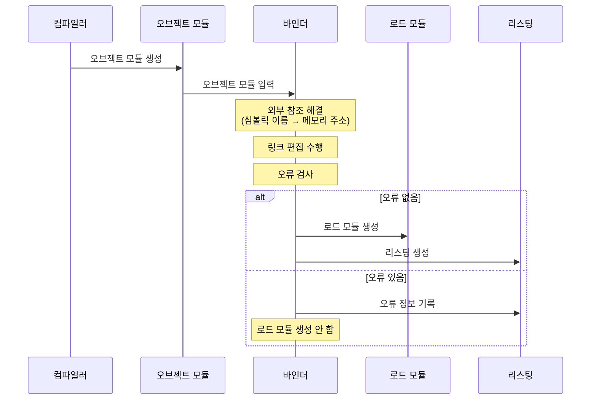

# Lesson 3: Compilers, Binders, Utilities

## 개요

이 모듈은 z/OS 시스템에서 프로그램 개발과 관리에 필수적인 컴파일러, 바인더, 그리고 유틸리티의 목적과 기능을 탐구합니다.

## 학습 목표

이 모듈을 완료한 후, 다음을 수행할 수 있습니다:

- 컴파일러의 기능을 정의할 수 있습니다.
- 바인더의 목적을 식별할 수 있습니다.
- 널리 사용되는 유틸리티의 기능을 식별하고 호출 방법을 지정할 수 있습니다.

## Compilers (컴파일러)

### 컴파일러의 정의

`컴파일러(Compiler)`는 프로그래머가 작성한 소스 코드를 컴퓨터가 이해할 수 있는 기계 코드로 변환하는 프로그램입니다.

프로그래밍 언어로 작성된 프로그램은 프로세서가 직접 이해할 수 있는 명령어와는 상당히 다릅니다. 컴파일러의 역할은 프로그래머가 작성한 소스 코드를 프로세서가 수행해야 할 지시 사항을 알 수 있는 기계 코드로 변환하는 것입니다.

### 컴파일 프로세스

컴파일러는 소스 코드를 입력으로 받아 두 가지 주요 출력을 생성합니다:

1. **Object Module (오브젝트 모듈)**: 생성된 기계 코드를 포함합니다.
2. **Listing (리스팅)**: 프로그래머를 돕기 위한 오류 목록을 포함합니다.



### 컴파일러의 두 단계 구조

컴파일러는 실제로 두 단계로 구성된 프로그램입니다:

1. **첫 번째 단계: Translator (번역기)**
   - 고수준 언어를 어셈블리 언어로 변환합니다.

2. **두 번째 단계: Assembler (어셈블러)**
   - 어셈블리 언어를 기계 코드로 변환합니다.

::: tip Translator와 Assembler의 역할

- **Translator (번역기)**: 고수준 언어를 어셈블리 언어로 변환합니다.
- **Assembler (어셈블러)**: 어셈블리 언어를 기계 코드로 변환합니다.

:::



#### 코드 변환 과정 예시

컴파일 과정에서 코드는 다음과 같이 변환됩니다:

1. **고수준 언어 (High-level language)**
   ```
   MOVE CUSTOMER_NAME TO OUTPUT_RECORD_NAME_FIELD
   ```

2. **어셈블리 언어 (Assembler language)**
   ```
   MVC 24(30,11), 28(9)
   ```

3. **기계 코드 (Machine code)**
   ```
   D21E B018 901C
   ```

이러한 변환 과정을 통해 사람이 읽을 수 있는 고수준 언어 코드가 프로세서가 실행할 수 있는 기계 코드로 변환됩니다.

### 컴파일러의 입력과 출력

#### 입력: Source Code (소스 코드)

소스 코드는 프로그래머가 고수준 언어나 어셈블리 언어로 작성한 프로그램입니다.

예시:
```
MOVE CUSTOMER_NAME TO OUTPUT_RECORD_NAME_FIELD
```

이러한 소스 코드는 사람이 읽고 이해하기 쉬운 형태로 작성됩니다.

#### 출력 1: Object Module (오브젝트 모듈)

오브젝트 모듈은 컴파일러가 생성한 기계 코드를 포함합니다. 이 기계 코드는 프로세서가 직접 실행할 수 있는 형태입니다.

예시:
```
D21E BØ18 901C
```

오브젝트 모듈은 바이너리 형식으로 저장되며, 프로세서가 직접 이해하고 실행할 수 있는 명령어로 구성됩니다.

#### 출력 2: Listing (리스팅)

리스팅은 컴파일 과정에서 발견된 오류, 경고, 그리고 기타 정보를 포함하는 텍스트 파일입니다. 이는 프로그래머가 소스 코드의 문제를 식별하고 수정하는 데 도움을 줍니다.

리스팅에는 다음과 같은 정보가 포함될 수 있습니다:
- **컴파일 오류**: 구문 오류, 타입 오류 등
- **경고 메시지**: 잠재적인 문제에 대한 경고
- **컴파일 통계**: 소스 코드 라인 수, 생성된 기계 코드 크기 등
- **심볼 테이블**: 변수 및 함수 이름과 주소 정보

### 컴파일 프로세스의 상세 흐름



### 컴파일러의 주요 기능

컴파일러는 다음과 같은 주요 기능을 수행합니다:

1. **어휘 분석 (Lexical Analysis)**
   - 소스 코드를 토큰(token)으로 분해합니다.
   - 키워드, 식별자, 연산자, 리터럴 등을 식별합니다.

2. **구문 분석 (Syntax Analysis)**
   - 토큰의 구조를 분석하여 문법적으로 올바른지 확인합니다.
   - 파싱 트리(parse tree)를 생성합니다.

3. **의미 분석 (Semantic Analysis)**
   - 소스 코드의 의미를 분석합니다.
   - 타입 검사, 변수 선언 확인, 스코프 분석 등을 수행합니다.

4. **코드 생성 (Code Generation)**
   - 분석된 소스 코드를 기계 코드로 변환합니다.
   - 오브젝트 모듈을 생성합니다.

5. **최적화 (Optimization)**
   - 생성된 기계 코드를 최적화하여 실행 효율을 향상시킵니다.
   - 불필요한 코드 제거, 루프 최적화, 레지스터 할당 최적화 등을 수행합니다.

6. **오류 보고 (Error Reporting)**
   - 발견된 오류와 경고를 리스팅 파일에 기록합니다.
   - 프로그래머가 문제를 쉽게 식별하고 수정할 수 있도록 도와줍니다.

### z/OS에서 사용되는 주요 컴파일러

z/OS 시스템에서는 다양한 프로그래밍 언어를 위한 컴파일러가 제공됩니다:



#### 고수준 언어 컴파일러

z/OS에서는 많은 고수준 언어에 대한 컴파일러가 제공됩니다. 일반적으로 사용되는 컴파일러는 다음과 같습니다:

- **PL/I 컴파일러**: PL/I 프로그램을 컴파일합니다.
- **COBOL 컴파일러**: COBOL 프로그램을 컴파일합니다.
- **C/C++ 컴파일러**: C 및 C++ 프로그램을 컴파일합니다.
- **Java 컴파일러**: Java 프로그램을 컴파일합니다.
- **FORTRAN 컴파일러**: FORTRAN 프로그램을 컴파일합니다.

#### 어셈블리 언어와 어셈블러

어셈블리 언어로 작성된 프로그램은 컴파일러가 아닌 `어셈블러(Assembler)`에 의해 처리됩니다. 어셈블러는 번역 단계(Translator stage)가 없다는 점을 제외하고는 컴파일러와 매우 유사한 프로세스를 따릅니다.

- **Assembler**: 어셈블리 언어 프로그램을 직접 기계 코드로 변환합니다.
  - Translator 단계 없이 어셈블리 언어를 기계 코드로 직접 변환합니다.
  - 컴파일러와 마찬가지로 Object Module과 Listing을 생성합니다.

### 컴파일러의 중요성

컴파일러는 프로그램 개발 과정에서 필수적인 도구입니다:

- **번역 기능**: 사람이 읽을 수 있는 소스 코드를 기계가 실행할 수 있는 코드로 변환합니다.
- **오류 검출**: 컴파일 과정에서 오류를 조기에 발견할 수 있게 합니다.
- **코드 최적화**: 효율적인 기계 코드를 생성하여 프로그램 성능을 향상시킵니다.
- **플랫폼 독립성**: 고수준 언어로 작성된 프로그램을 특정 플랫폼의 기계 코드로 변환합니다.

### 컴파일러의 작동 방식

컴파일러는 일반적으로 TSO(Time Sharing Option)에서 제출된 카드 이미지(card images) 형식의 소스 코드를 읽습니다. 컴파일러는 다음과 같은 과정을 수행합니다:

1. **소스 코드 읽기**: TSO에서 제출된 소스 코드를 읽습니다.
2. **구문 및 오류 검사**: 구문 오류 및 기타 오류를 확인합니다.
3. **리스팅 생성**: 발견된 오류와 경고를 리스팅에 기록하여 프로그래머가 오류를 수정할 수 있도록 도와줍니다.
4. **오브젝트 모듈 생성**: 치명적인 오류가 없는 경우, 생성된 기계 코드를 포함하는 디스크 파일인 오브젝트 모듈을 작성합니다.



### 컴파일러 사용 예시

z/OS에서 컴파일러를 사용하는 일반적인 방법은 JCL을 통해 컴파일 작업을 제출하는 것입니다:

```jcl
//COMPILE  JOB MSGCLASS=C,NOTIFY=USER01
//STEP1    EXEC PGM=IGYCRCTL
//SYSLIB   DD DSN=SYS1.COBOL.SYSIN,DISP=SHR
//SYSLIN   DD DSN=&&OBJ,DISP=(,PASS),UNIT=SYSDA,
//            SPACE=(TRK,(5,5))
//SYSPRINT DD SYSOUT=*
//SYSIN    DD DSN=USER01.SOURCE.COBOL(PROG01),DISP=SHR
```

이 JCL 예제는:
- `IGYCRCTL`: COBOL 컴파일러 프로그램
- `SYSLIN`: 생성된 오브젝트 모듈이 저장될 데이터셋
- `SYSPRINT`: 컴파일 리스팅이 출력될 위치
- `SYSIN`: 컴파일할 소스 코드

::: tip 컴파일러 요약

- **컴파일러**: 소스 코드를 기계 코드로 변환하는 프로그램
- **두 단계 구조**:
  - **Translator**: 고수준 언어를 어셈블리 언어로 변환
  - **Assembler**: 어셈블리 언어를 기계 코드로 변환
- **입력**: TSO에서 제출된 카드 이미지 형식의 소스 코드
- **출력**:
  - **Object Module**: 치명적인 오류가 없을 경우 생성되는 기계 코드를 포함하는 오브젝트 모듈
  - **Listing**: 구문 오류 및 기타 오류, 경고를 포함하는 리스팅 파일
- **주요 기능**:
  - 어휘 분석, 구문 분석, 의미 분석
  - 코드 생성 및 최적화
  - 오류 검사 및 보고
- **z/OS 컴파일러**: PL/I, COBOL, C/C++, Java, FORTRAN 등 다양한 고수준 언어 지원
- **어셈블러**: 어셈블리 언어 프로그램은 어셈블러로 처리되며, 번역 단계 없이 직접 기계 코드로 변환
- **중요성**: 프로그램 개발 과정에서 필수적인 번역 도구

:::

## The Binder (바인더)

### 바인더의 정의

`바인더(Binder)`는 오브젝트 모듈을 읽어서 로드 모듈과 리스팅을 작성하는 프로그램입니다. 바인더는 프로그램과 루틴 간의 연결(linkage)이 실행 시간에 제대로 작동하도록 보장합니다.

### 바인더의 기본 기능

바인더는 다음과 같은 기본 기능을 수행합니다:

- **오브젝트 모듈 읽기**: 컴파일러가 생성한 오브젝트 모듈을 읽습니다.
- **로드 모듈 작성**: 실행 가능한 로드 모듈을 생성합니다.
- **리스팅 작성**: 오류 및 경고 정보를 포함하는 리스팅을 생성합니다.



::: tip 바인더의 기본 기능

바인더는 오브젝트 모듈을 읽고 로드 모듈과 리스팅을 작성합니다.

:::

### Linkage (연결)

대부분의 프로그램은 메모리 획득, I/O 수행 및 기타 많은 목적을 위해 로컬에서 작성된 루틴이나 운영 체제에서 제공하는 루틴을 호출합니다.

`Linkage (연결)`는 한 프로그램이나 루틴에서 다른 프로그램이나 루틴으로 제어를 전달하고 반환하는 데 사용되는 규약입니다. 바인더는 프로그램과 루틴 간의 연결이 실행 시간에 제대로 작동하도록 보장합니다.

#### Linkage의 작동 방식



위 다이어그램은 다음과 같은 과정을 보여줍니다:

1. **RTN01에서 RTN02로의 호출**:
   - RTN01이 `CALL RTN02` 명령을 실행합니다.
   - Linkage를 통해 제어가 RTN02의 ENTRY 지점으로 전달됩니다.

2. **RTN02의 실행**:
   - RTN02가 처리(Process)를 수행합니다.
   - 반환 코드(RC)를 설정합니다.

3. **RTN02에서 RTN01로의 반환**:
   - RTN02가 `RETURN` 명령을 실행합니다.
   - Linkage를 통해 제어가 RTN01의 `TEST RC` 지점으로 반환됩니다.

### Link-editing (링크 편집)

바인더는 오브젝트 모듈을 처리하는 과정에서 심볼릭 이름을 실제 메모리 주소로 변환하여 외부 참조를 해결합니다. 이 과정을 `link-editing (링크 편집)`이라고 합니다.

#### 심볼릭 참조 해결

링크 편집 과정에서 바인더는 심볼릭 이름(예: `RTN02`)을 실제 메모리 주소(예: `006800`)로 변환합니다.



#### Link-editing의 과정

1. **심볼릭 참조**: RTN01이 `CALL RTN02`를 실행할 때, `RTN02`는 아직 심볼릭 이름입니다.

2. **주소 해결**: 바인더가 링크 편집 과정에서 `RTN02`라는 심볼릭 이름을 실제 메모리 주소 `006800`으로 변환합니다.

3. **실행 준비**: 링크 편집이 완료되면 프로그램은 실행할 준비가 됩니다.

### 바인더의 역사적 배경

- **MVS 시대**: 링크 편집은 `Linkage Editor (링크 에디터)`에 의해 수행되었습니다.
- **z/OS 시대**: 현재는 `z/OS Binder`가 링크 편집을 수행합니다.

### 바인더의 입력과 출력

#### 입력: Object Module (오브젝트 모듈)

바인더는 하나 이상의 오브젝트 모듈을 입력으로 받습니다. 이 오브젝트 모듈들은 컴파일러에 의해 생성된 기계 코드를 포함합니다.

#### 출력 1: Load Module (로드 모듈)

로드 모듈은 실행 가능한 모듈입니다. 바인더는 모든 오류가 제거된 후에만 로드 모듈을 생성합니다.

로드 모듈의 특징:
- 실행 가능한 형태로 변환된 프로그램
- 모든 외부 참조가 해결됨
- 메모리 주소가 할당됨
- 실행 시간에 로드되어 실행될 수 있음

#### 출력 2: Listing (리스팅)

리스팅은 바인더 처리 과정에서 발견된 오류, 경고, 그리고 기타 정보를 포함합니다.

리스팅에는 다음과 같은 정보가 포함될 수 있습니다:
- **링크 편집 오류**: 해결되지 않은 외부 참조, 중복된 심볼 등
- **경고 메시지**: 잠재적인 문제에 대한 경고
- **심볼 테이블**: 해결된 심볼과 주소 정보
- **모듈 정보**: 포함된 모듈 목록 및 크기 정보

### 바인더 처리 과정



### 바인더의 주요 기능

바인더는 다음과 같은 주요 기능을 수행합니다:

1. **외부 참조 해결 (External Reference Resolution)**
   - 심볼릭 이름을 실제 메모리 주소로 변환합니다.
   - 여러 오브젝트 모듈 간의 참조를 해결합니다.

2. **링크 편집 (Link-editing)**
   - 여러 오브젝트 모듈을 하나의 로드 모듈로 결합합니다.
   - 필요한 라이브러리 루틴을 포함시킵니다.

3. **주소 할당 (Address Assignment)**
   - 각 모듈과 루틴에 메모리 주소를 할당합니다.
   - 재배치 가능한 코드를 절대 주소로 변환합니다.

4. **오류 검사 (Error Checking)**
   - 해결되지 않은 외부 참조를 검사합니다.
   - 중복된 심볼이나 충돌을 확인합니다.

5. **리스팅 생성 (Listing Generation)**
   - 처리 결과를 리스팅 파일에 기록합니다.
   - 오류 및 경고 정보를 제공합니다.

### 바인더 사용 예시

z/OS에서 바인더를 사용하는 일반적인 방법은 JCL을 통해 링크 편집 작업을 제출하는 것입니다:

```jcl
//LINKEDIT  JOB MSGCLASS=C,NOTIFY=USER01
//STEP1     EXEC PGM=IEWL,PARM='MAP,LIST'
//SYSLMOD   DD DSN=USER01.LOADLIB(PROG01),DISP=SHR
//SYSPRINT  DD SYSOUT=*
//SYSUT1    DD UNIT=SYSDA,SPACE=(1024,(50,20))
//SYSLIN    DD DSN=&&OBJ,DISP=(OLD,DELETE)
//          DD DSN=SYS1.COBLIB,DISP=SHR
```

이 JCL 예제는:
- `IEWL`: z/OS Binder 프로그램
- `SYSLMOD`: 생성된 로드 모듈이 저장될 데이터셋
- `SYSPRINT`: 바인더 리스팅이 출력될 위치
- `SYSLIN`: 링크 편집할 오브젝트 모듈 및 라이브러리

### 바인더의 중요성

바인더는 프로그램 개발 과정에서 필수적인 도구입니다:

- **모듈 통합**: 여러 오브젝트 모듈을 하나의 실행 가능한 프로그램으로 통합합니다.
- **참조 해결**: 프로그램 간의 심볼릭 참조를 실제 주소로 해결합니다.
- **실행 준비**: 프로그램을 실행할 수 있는 형태로 준비시킵니다.
- **라이브러리 연결**: 시스템 라이브러리와 사용자 라이브러리의 루틴을 연결합니다.

::: tip 바인더 요약

- **바인더**: 오브젝트 모듈을 읽어서 로드 모듈과 리스팅을 작성하는 프로그램
- **Linkage (연결)**: 한 프로그램이나 루틴에서 다른 프로그램이나 루틴으로 제어를 전달하고 반환하는 규약
- **Link-editing (링크 편집)**: 심볼릭 이름을 실제 메모리 주소로 변환하여 외부 참조를 해결하는 과정
- **입력**: 하나 이상의 오브젝트 모듈
- **출력**:
  - **Load Module**: 모든 오류가 제거된 후 생성되는 실행 가능한 모듈
  - **Listing**: 오류 및 경고 정보를 포함하는 리스팅 파일
- **주요 기능**:
  - 외부 참조 해결
  - 링크 편집
  - 주소 할당
  - 오류 검사
- **역사**: MVS의 Linkage Editor에서 z/OS Binder로 발전
- **중요성**: 프로그램을 실행 가능한 형태로 준비시키는 필수 도구

:::

## Utility Programs (유틸리티 프로그램)

### 유틸리티 프로그램의 정의

`유틸리티 프로그램(Utility Programs)`은 거의 모든 조직에서 필요한 작업을 수행하는 데 사용되는 프로그램입니다. 비즈니스에서 사용하는 애플리케이션과 관계없이, 유틸리티 프로그램은 모든 z/OS 환경에 공통적인 요소를 다루기 때문에 필요합니다.

### 유틸리티 프로그램의 분류

유틸리티 프로그램은 두 가지 카테고리로 나눌 수 있습니다:

1. **Standalone Utility (독립 실행 유틸리티)**
   - 운영 체제 없이 실행되는 유틸리티

2. **OS-controlled Utility (운영 체제 제어 유틸리티)**
   - 운영 체제 제어 하에 실행되는 유틸리티

## Standalone Utility (독립 실행 유틸리티)

### Standalone Utility의 정의

`Standalone Utility (독립 실행 유틸리티)`는 z/OS 운영 체제가 로드되지 않았거나 사용할 수 없을 때 사용되는 프로그램입니다.

### Standalone Utility의 사용 시기

이러한 프로그램은 일반적으로 다음 상황에서만 사용됩니다:

- **시스템 복구**: 심각한 실패 후 시스템을 복구할 때
- **새 시스템 설치**: 새로운 시스템을 설치할 때

::: tip Standalone Utility 실행 환경

ICKDSF와 DFSMSdss는 z/OS 제어 하에서도 실행할 수 있습니다.

:::

### 주요 Standalone Utility

주요 독립 실행 유틸리티는 다음과 같습니다:

- **ICKDSF**: 사용 전에 DASD를 초기화합니다.
- **ADRDSSU (DFSMSdss)**: 전체 DASD 볼륨을 복사합니다.
- **Standalone Dump (SADMP)**: 시스템 실패 후 메인 스토리지와 페이징된 가상 스토리지의 일부를 포맷되지 않은 덤프로 생성하는 데 사용할 수 있습니다.

### Standalone Utility 호출 방법

독립 실행 유틸리티는 유틸리티가 저장된 장치에서 IPL(Initial Program Load)을 수행하여 호출됩니다. 이는 다음 중 하나일 수 있습니다:

- **디스크 볼륨**: 독립 실행 유틸리티의 위치를 가리키도록 초기화된 디스크 볼륨
- **테이프 볼륨**: 로드된 테이프 볼륨

각 경우에, 독립 실행 유틸리티가 있는 장치(디스크 또는 테이프)의 주소를 지정하여 IPL을 수행합니다.

## OS-controlled Utility (운영 체제 제어 유틸리티)

### OS-controlled Utility의 정의

다른 유틸리티 프로그램들은 운영 체제 제어 하에 실행됩니다. 일부는 볼륨 레벨에서 작동하지만, 대부분은 데이터셋 및 레코드 레벨에서 데이터를 복사, 수정, 재구성 또는 비교하는 데 사용됩니다.

이러한 프로그램은 애플리케이션 프로그래머가 프로그램을 개발하고 테스트하는 데 유용합니다.

### 일반적으로 사용되는 데이터셋 유틸리티

일반적으로 사용되는 데이터셋 유틸리티는 다음과 같습니다:

- **IEBCOPY**: 데이터셋 복사 및 관리
- **IEBGENER 또는 ICEGENER**: 순차 데이터셋의 복사, 프린트, 변환
- **DFSORT**: 데이터 정렬 및 병합
- **IDCAMS**: VSAM 데이터셋 관리
- **ADRDSSU (DFSMSdss)**: 데이터셋 백업 및 복원

### OS-controlled Utility 호출 방법

운영 체제 제어 하에 실행되는 유틸리티 프로그램을 호출하려면 Job Control Language (JCL) 문이 필요합니다.

#### IEBGENER 사용 예시

다음 JCL 예제는 IEBGENER 유틸리티를 호출하여 데이터셋 `OP100.JCL.CNTL`을 프린트합니다:

```jcl
//PRTSTEP EXEC PGM=IEBGENER
//SYSUT1 DD DSN=OP100.JCL.CNTL,DISP=SHR
//SYSUT2 DD SYSOUT=A,DEST=RMT100
//SYSPRINT DD SYSOUT=*
//SYSIN DD DUMMY
/*
```

이 JCL 예제는:
- `IEBGENER`: 순차 데이터셋의 복사, 프린트, 변환 유틸리티
- `SYSUT1`: 입력 데이터셋
- `SYSUT2`: 출력 대상 (프린터 또는 데이터셋)
- `SYSPRINT`: 유틸리티 출력 메시지

### IDCAMS 유틸리티

#### IDCAMS의 역할

데이터 센터에서 사용될 가능성이 있는 세 가지 데이터 관리 환경이 있습니다:

1. **VSAM**: Virtual Storage Access Method
2. **non-VSAM**: VSAM이 아닌 전통적인 데이터셋
3. **z/OS UNIX**: UNIX 파일 시스템

이 섹션에서 논의된 대부분의 유틸리티는 non-VSAM 데이터셋을 다루지만, VSAM 데이터셋을 생성하고 조작할 수 있는 IDCAMS 유틸리티의 능력을 언급할 가치가 있습니다.

#### IDCAMS의 주요 기능

IDCAMS는 다음과 같은 기능을 수행할 수 있습니다:

- **VSAM 데이터셋 또는 카탈로그 정의**: VSAM 데이터셋과 카탈로그를 생성합니다.
- **VSAM 카탈로그 항목 또는 데이터셋 레코드 나열**: VSAM 카탈로그의 내용을 조회합니다.
- **재구성을 위한 데이터셋 복사**: 데이터셋을 재구성하기 위해 복사합니다.
- **데이터셋의 백업 복사본 생성**: 데이터셋의 백업을 생성합니다.
- **카탈로그 이름의 별칭 정의 및 삭제**: 카탈로그 이름에 대한 별칭을 관리합니다.
- **Generation Data Groups (GDGs) 지원**: 세대 데이터 그룹을 지원합니다.

#### IDCAMS 호출 방법

IDCAMS는 다음 방법으로 호출할 수 있습니다:

- **JCL**: Job Control Language를 통해 호출
- **TSO 터미널**: TSO 명령을 통해 호출
- **사용자 애플리케이션 프로그램**: 프로그램 내에서 호출

#### IDCAMS가 지원하는 VSAM 데이터셋 유형

IDCAMS는 다음 네 가지 유형의 VSAM 데이터셋과 상호 작용할 수 있습니다:

1. **Key Sequenced Data Sets (KSDS)**: 키 순서 데이터셋
2. **Relative Record Data Sets (RRDS)**: 상대 레코드 데이터셋
3. **Entry Sequenced Data Sets (ESDS)**: 항목 순서 데이터셋
4. **Linear Data Sets**: 선형 데이터셋

### 유틸리티 프로그램의 중요성

유틸리티 프로그램은 z/OS 환경에서 필수적인 도구입니다:

- **데이터 관리**: 데이터셋 생성, 복사, 수정, 삭제
- **시스템 관리**: 시스템 복구 및 유지보수
- **개발 지원**: 프로그램 개발 및 테스트 과정 지원
- **백업 및 복원**: 데이터 백업 및 복원 작업
- **데이터 처리**: 데이터 정렬, 병합, 변환

::: tip 유틸리티 프로그램 요약

- **유틸리티 프로그램**: 거의 모든 조직에서 필요한 작업을 수행하는 프로그램
- **두 가지 카테고리**:
  - **Standalone Utility**: 운영 체제 없이 실행 (시스템 복구, 설치 시 사용)
  - **OS-controlled Utility**: 운영 체제 제어 하에 실행 (일반적인 데이터 관리 작업)
- **주요 Standalone Utility**:
  - ICKDSF: DASD 초기화
  - ADRDSSU (DFSMSdss): DASD 볼륨 복사
  - Standalone Dump (SADMP): 시스템 덤프 생성
- **일반적으로 사용되는 OS-controlled Utility**:
  - IEBCOPY: 데이터셋 복사 및 관리
  - IEBGENER/ICEGENER: 순차 데이터셋의 복사, 프린트, 변환
  - DFSORT: 데이터 정렬 및 병합
  - IDCAMS: VSAM 데이터셋 관리
  - ADRDSSU (DFSMSdss): 데이터셋 백업 및 복원
- **호출 방법**:
  - Standalone Utility: IPL을 통해 호출
  - OS-controlled Utility: JCL을 통해 호출
- **IDCAMS 기능**: VSAM 데이터셋 생성, 조작, 카탈로그 관리, GDG 지원
- **중요성**: 데이터 관리, 시스템 관리, 개발 지원에 필수적인 도구

:::

## Summary (요약)

### 모듈 개요

이 모듈에서는 컴파일러, 바인더, 그리고 가장 널리 사용되는 유틸리티들을 살펴보았습니다. 또한 두 가지 유형의 유틸리티 프로그램을 검토했습니다.

### 주요 학습 내용

#### 1. Compilers (컴파일러)

- **정의**: 소스 코드를 기계 코드로 변환하는 프로그램
- **두 단계 구조**:
  - **Translator**: 고수준 언어를 어셈블리 언어로 변환
  - **Assembler**: 어셈블리 언어를 기계 코드로 변환
- **입력**: TSO에서 제출된 카드 이미지 형식의 소스 코드
- **출력**:
  - **Object Module**: 생성된 기계 코드를 포함하는 오브젝트 모듈
  - **Listing**: 구문 오류 및 기타 오류, 경고를 포함하는 리스팅 파일
- **주요 기능**: 어휘 분석, 구문 분석, 의미 분석, 코드 생성, 최적화, 오류 검사 및 보고
- **z/OS 컴파일러**: PL/I, COBOL, C/C++, Java, FORTRAN 등 다양한 고수준 언어 지원
- **어셈블러**: 어셈블리 언어 프로그램은 어셈블러로 처리되며, 번역 단계 없이 직접 기계 코드로 변환

#### 2. The Binder (바인더)

- **정의**: 오브젝트 모듈을 읽어서 로드 모듈과 리스팅을 작성하는 프로그램
- **Linkage (연결)**: 한 프로그램이나 루틴에서 다른 프로그램이나 루틴으로 제어를 전달하고 반환하는 규약
- **Link-editing (링크 편집)**: 심볼릭 이름을 실제 메모리 주소로 변환하여 외부 참조를 해결하는 과정
- **입력**: 하나 이상의 오브젝트 모듈
- **출력**:
  - **Load Module**: 모든 오류가 제거된 후 생성되는 실행 가능한 모듈
  - **Listing**: 오류 및 경고 정보를 포함하는 리스팅 파일
- **주요 기능**: 외부 참조 해결, 링크 편집, 주소 할당, 오류 검사
- **역사**: MVS의 Linkage Editor에서 z/OS Binder로 발전
- **중요성**: 프로그램을 실행 가능한 형태로 준비시키는 필수 도구

#### 3. Utility Programs (유틸리티 프로그램)

- **정의**: 거의 모든 조직에서 필요한 작업을 수행하는 프로그램
- **두 가지 카테고리**:
  - **Standalone Utility**: 운영 체제 없이 실행되는 유틸리티
    - 사용 시기: 시스템 복구, 새 시스템 설치, z/OS가 로드되지 않았거나 사용할 수 없을 때
    - 주요 유틸리티: ICKDSF (DASD 초기화), ADRDSSU (DFSMSdss, DASD 볼륨 복사), Standalone Dump (SADMP)
    - 호출 방법: IPL을 통해 호출
  - **OS-controlled Utility**: 운영 체제 제어 하에 실행되는 유틸리티
    - 일반적으로 사용되는 데이터셋 유틸리티:
      - **IEBCOPY**: 데이터셋 복사 및 관리 (파티션된 데이터셋 포함)
      - **IEBGENER/ICEGENER**: 순차 데이터셋의 복사, 프린트, 변환
      - **DFSORT**: 데이터 정렬 및 병합
      - **IDCAMS**: VSAM 데이터셋 관리 (non-VSAM 데이터셋도 조작 가능)
      - **ADRDSSU (DFSMSdss)**: 데이터셋 백업 및 복원
    - 호출 방법: JCL을 통해 호출 (IDCAMS는 JCL, TSO 터미널, 또는 애플리케이션 프로그램에서도 호출 가능)
- **중요성**: 데이터 관리, 시스템 관리, 개발 지원에 필수적인 도구

### 학습 목표 달성

이 모듈을 완료한 후, 다음을 수행할 수 있습니다:

- **컴파일러의 기능을 정의할 수 있습니다**
  - 컴파일러는 소스 코드를 기계 코드로 변환하는 두 단계 프로그램입니다.
  - Translator는 고수준 언어를 어셈블리 언어로 변환하고, Assembler는 어셈블리 언어를 기계 코드로 변환합니다.
  - 컴파일러는 Object Module과 Listing을 생성합니다.

- **바인더의 목적을 식별할 수 있습니다**
  - 바인더는 오브젝트 모듈을 읽어서 로드 모듈과 리스팅을 작성합니다.
  - 바인더는 링크 편집을 통해 심볼릭 참조를 실제 메모리 주소로 해결합니다.
  - 바인더는 프로그램과 루틴 간의 연결(linkage)이 실행 시간에 제대로 작동하도록 보장합니다.

- **널리 사용되는 유틸리티의 기능을 식별하고 호출 방법을 지정할 수 있습니다**
  - Standalone Utility는 IPL을 통해 호출되며, 시스템 복구나 설치 시 사용됩니다.
  - OS-controlled Utility는 JCL을 통해 호출되며, 데이터셋 관리 작업에 사용됩니다.
  - 주요 유틸리티의 기능:
    - IEBCOPY: 파티션된 데이터셋 복사 및 관리
    - IEBGENER: 순차 데이터셋 프린트 및 복사
    - DFSORT: 데이터셋 내용 정렬
    - IDCAMS: VSAM 및 non-VSAM 데이터셋 조작
    - ADRDSSU: 데이터셋 백업 및 복원

### 주요 구성 요소 요약표

| 구성 요소 | 주요 기능 | 입력 | 출력 |
|----------|----------|------|------|
| **Compiler** | 소스 코드를 기계 코드로 변환 | 소스 코드 | Object Module, Listing |
| **Binder** | 오브젝트 모듈을 로드 모듈로 변환 | Object Module | Load Module, Listing |
| **Standalone Utility** | 시스템 복구 및 설치 작업 | - | - |
| **OS-controlled Utility** | 데이터셋 관리 작업 | 데이터셋 | 처리된 데이터셋 |

### 결론

컴파일러, 바인더, 그리고 유틸리티 프로그램은 z/OS 환경에서 프로그램 개발과 시스템 관리에 필수적인 도구입니다. 컴파일러는 소스 코드를 실행 가능한 형태로 변환하고, 바인더는 여러 모듈을 하나의 실행 가능한 프로그램으로 통합합니다. 유틸리티 프로그램은 데이터 관리, 시스템 복구, 그리고 개발 작업을 지원하여 z/OS 환경의 효율적인 운영을 가능하게 합니다.
