# How z/OS Processes I/O

## 개요

모든 컴퓨팅 시스템의 필수 기능 중 하나는 I/O입니다: 디스크, 테이프, 프린터, 네트워크와 같은 외부 장치에 대한 읽기와 쓰기입니다. 이 모듈에서는 z/OS에서 I/O가 어떻게 작동하는지 살펴봅니다.

## 학습 목표

이 모듈을 완료한 후, 다음을 수행할 수 있습니다:

- Channel Subsystem의 기능과 작동 방식을 설명할 수 있습니다.
- OSA Communications와 Channel Subsystem의 차이점을 설명할 수 있습니다.
- SMC와 RoCE가 무엇이고 시스템 간 통신에 어떻게 사용되는지 설명할 수 있습니다.

## Input/Output (I/O) and Channels

`Input/Output (I/O)`는 컴퓨터와 외부 장치 간의 모든 통신을 의미합니다. 이러한 외부 장치는 무엇이든 될 수 있습니다. 예를 들어, 디스크, 테이프 드라이브, 네트워크 연결, 또는 프린터가 있습니다.

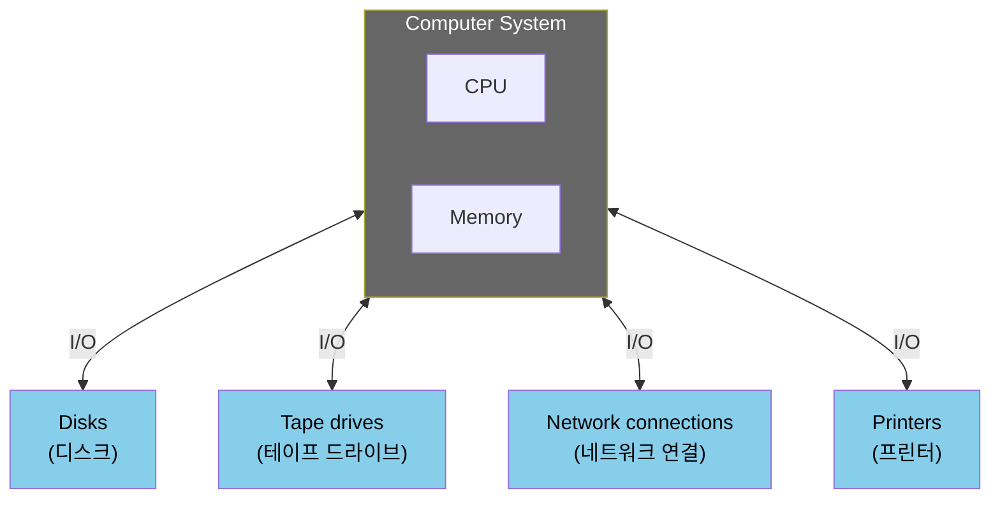
```mermaid
flowchart TB
    subgraph Computer["Computer System"]
        CPU["CPU"]
        Memory["Memory"]
    end
    
    Disks["Disks<br/>(디스크)"]
    TapeDrives["Tape drives<br/>(테이프 드라이브)"]
    Network["Network connections<br/>(네트워크 연결)"]
    Printers["Printers<br/>(프린터)"]
    
    Computer <-->|I/O| Disks
    Computer <-->|I/O| TapeDrives
    Computer <-->|I/O| Network
    Computer <-->|I/O| Printers
    
    style Computer fill:#666,color:#fff
    style Disks fill:#87ceeb,color:#000
    style TapeDrives fill:#87ceeb,color:#000
    style Network fill:#87ceeb,color:#000
    style Printers fill:#87ceeb,color:#000
```

I/O는 z/OS 시스템의 핵심 기능으로, 시스템이 데이터를 읽고 쓰고 외부 장치와 통신할 수 있게 해줍니다.

### 과거: 외부 컨트롤러를 통한 I/O 오프로딩

과거에는 메인프레임이 가능한 한 많은 I/O 관련 처리를 외부 장치로 오프로드했습니다. 이를 통해 메인프레임의 CPU 용량을 최대화하고, 비필수적인 처리를 다른 장치로 이동시켰습니다.

외부 컨트롤러 또는 제어 장치(Control Unit)가 I/O 처리 작업의 일부를 수행했습니다. 예를 들어:

- **네트워크 컨트롤러**: 3725와 같은 Front-End Processor가 SNA 네트워크를 관리했습니다.
- **DASD 컨트롤러**: IBM 3880과 같은 DASD 컨트롤러가 디스크 장치를 관리했습니다.
- **테이프 컨트롤러**: 3480 컨트롤러와 테이프 서브시스템이 테이프 드라이브를 관리했습니다.

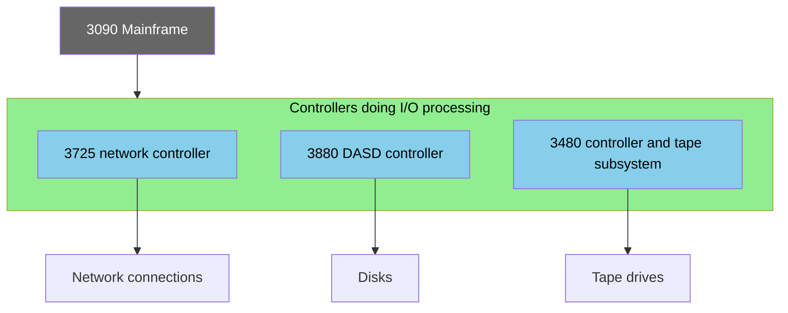
```mermaid
flowchart TB
    Mainframe["3090 Mainframe"]
    
    subgraph Controllers["Controllers doing I/O processing"]
        NetworkCtrl["3725 network controller"]
        DASDCtrl["3880 DASD controller"]
        TapeCtrl["3480 controller and tape subsystem"]
    end
    
    Network["Network connections"]
    Disks["Disks"]
    TapeDrives["Tape drives"]
    
    Mainframe --> Controllers
    NetworkCtrl --> Network
    DASDCtrl --> Disks
    TapeCtrl --> TapeDrives
    
    style Mainframe fill:#666,color:#fff
    style Controllers fill:#90ee90,color:#000
    style NetworkCtrl fill:#87ceeb,color:#000
    style DASDCtrl fill:#87ceeb,color:#000
    style TapeCtrl fill:#87ceeb,color:#000
```

### 현대: 통합된 I/O 서브시스템

현재의 장비도 여전히 많은 I/O 처리를 메인프레임 외부에서 수행합니다. 현대의 I/O 서브시스템은 모든 컨트롤러 또는 제어 장치를 포함하며, 이들은 더 이상 별도의 장비가 아닙니다. 예를 들어, 현대의 디스크 서브시스템과 가상 테이프 서브시스템은 이러한 제어 장치가 수행했던 모든 처리를 수행합니다.

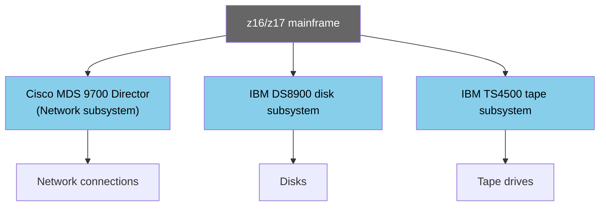
```mermaid
flowchart TB
    Mainframe["z16/z17 mainframe"]
    
    NetworkSub["Cisco MDS 9700 Director<br/>(Network subsystem)"]
    DiskSub["IBM DS8900 disk subsystem"]
    TapeSub["IBM TS4500 tape subsystem"]
    
    Network["Network connections"]
    Disks["Disks"]
    TapeDrives["Tape drives"]
    
    Mainframe --> NetworkSub
    Mainframe --> DiskSub
    Mainframe --> TapeSub
    
    NetworkSub --> Network
    DiskSub --> Disks
    TapeSub --> TapeDrives
    
    style Mainframe fill:#666,color:#fff
    style NetworkSub fill:#87ceeb,color:#000
    style DiskSub fill:#87ceeb,color:#000
    style TapeSub fill:#87ceeb,color:#000
```

### Channel Subsystem

#### Channel Subsystem의 역할

많은 I/O 처리가 메인프레임 외부로 오프로드되지만, 상당 부분의 I/O 처리는 여전히 메인프레임 내에서 직접 수행되어야 합니다. **Channel Subsystem (CSS)**는 이러한 처리를 담당하는 메인프레임 내의 특정 서브시스템입니다.

Channel Subsystem은 z/OS, Linux on IBM Z, z/VSE를 포함한 모든 메인프레임 기반 운영 체제에서 사용됩니다.

#### Channel Subsystem의 특징

Channel Subsystem은 일반적인 메인프레임 처리와는 구별됩니다:

- **전용 프로세서**: 자체 전용 프로세서인 **System Assistance Processors (SAP)**를 보유합니다.
- **자체 메모리**: 자체 메모리를 보유합니다.
- **투명성**: 표준 z/OS 프로그램에는 보이지 않으며, I/O 작업 전용으로만 사용됩니다.

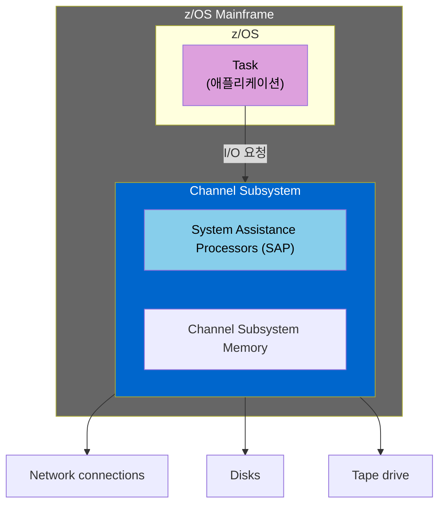
```mermaid
flowchart TB
    subgraph ZOS["z/OS Mainframe"]
        subgraph ZOSArea["z/OS"]
            Task["Task<br/>(애플리케이션)"]
        end
        
        subgraph CSS["Channel Subsystem"]
            SAP["System Assistance Processors (SAP)"]
            CSSMemory["Channel Subsystem Memory"]
        end
    end
    
    Network["Network connections"]
    Disks["Disks"]
    TapeDrive["Tape drive"]
    
    Task -->|I/O 요청| CSS
    CSS --> Network
    CSS --> Disks
    CSS --> TapeDrive
    
    style ZOS fill:#666,color:#fff
    style Task fill:#dda0dd,color:#000
    style CSS fill:#0066cc,color:#fff
    style SAP fill:#87ceeb,color:#000
```

#### Channel Subsystem의 작동 방식

##### 1. I/O 요청 전달

z/OS 태스크나 프로세스가 I/O를 수행해야 할 때, 요청을 Channel Subsystem에 전달합니다.

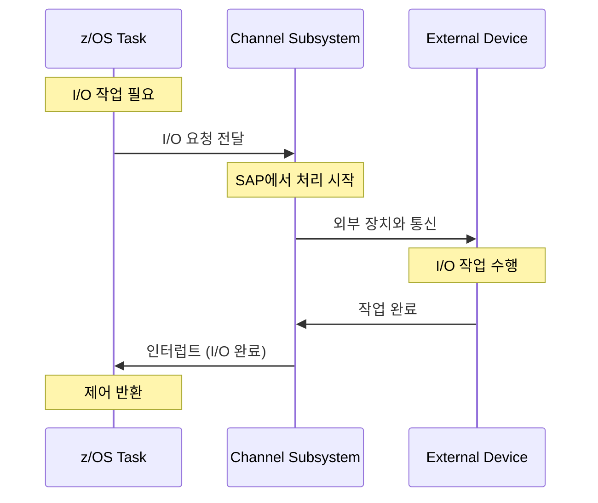
```mermaid
sequenceDiagram
    participant Task as z/OS Task
    participant CSS as Channel Subsystem
    participant Device as External Device
    
    Note over Task: I/O 작업 필요
    Task->>CSS: I/O 요청 전달
    Note over CSS: SAP에서 처리 시작
    CSS->>Device: 외부 장치와 통신
    Note over Device: I/O 작업 수행
    Device->>CSS: 작업 완료
    CSS->>Task: 인터럽트 (I/O 완료)
    Note over Task: 제어 반환
```

##### 2. 외부 장치와의 통신

Channel Subsystem은 외부 장치와 통신하는 작업을 수행합니다. 네트워크 연결, 디스크, 테이프 드라이브와 같은 다양한 외부 장치와 통신할 수 있습니다.

##### 3. 독립적인 처리

Channel Subsystem은 **System Assistance Processors (SAP)**에서 처리를 수행합니다. 일반 프로세서나 메모리를 사용하지 않습니다.

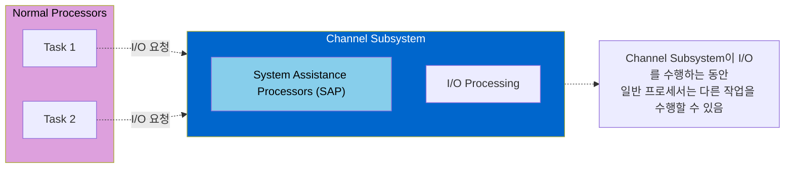
```mermaid
flowchart LR
    subgraph Normal["Normal Processors"]
        Task1["Task 1"]
        Task2["Task 2"]
    end
    
    subgraph CSS["Channel Subsystem"]
        SAP["System Assistance Processors (SAP)"]
        IOTask["I/O Processing"]
    end
    
    Task1 -.->|I/O 요청| CSS
    Task2 -.->|I/O 요청| CSS
    
    Note1["Channel Subsystem이 I/O를 수행하는 동안<br/>일반 프로세서는 다른 작업을 수행할 수 있음"]
    
    CSS -.-> Note1
    
    style Normal fill:#dda0dd,color:#000
    style CSS fill:#0066cc,color:#fff
    style SAP fill:#87ceeb,color:#000
```

##### 4. 비동기 처리의 이점

Channel Subsystem이 I/O를 수행하는 동안, 일반 프로세서는 다른 태스크의 처리를 수행할 수 있습니다. 이를 통해 CPU 활용률을 극대화하고 시스템 효율성을 향상시킵니다.

##### 5. I/O 완료 및 제어 반환

I/O가 완료되면, Channel Subsystem은 일반 처리를 인터럽트하고, I/O를 요청한 프로세스로 제어를 반환합니다.

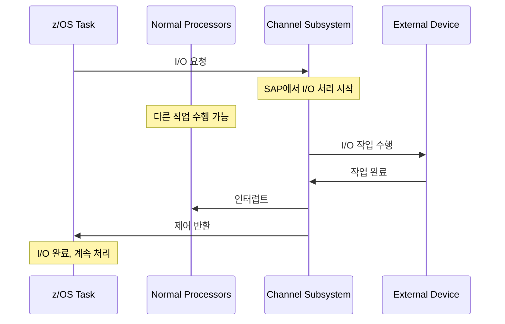
```mermaid
sequenceDiagram
    participant Task as z/OS Task
    participant NormalCPU as Normal Processors
    participant CSS as Channel Subsystem
    participant Device as External Device
    
    Task->>CSS: I/O 요청
    Note over CSS: SAP에서 I/O 처리 시작
    Note over NormalCPU: 다른 작업 수행 가능
    CSS->>Device: I/O 작업 수행
    Device->>CSS: 작업 완료
    CSS->>NormalCPU: 인터럽트
    CSS->>Task: 제어 반환
    Note over Task: I/O 완료, 계속 처리
```

#### Channel Subsystem의 주요 기능 요약

::: tip Channel Subsystem 요약

- **역할**: 메인프레임 내에서 I/O 처리를 담당하는 서브시스템
- **프로세서**: System Assistance Processors (SAP) 사용
- **메모리**: 자체 전용 메모리 보유
- **투명성**: 일반 z/OS 프로그램에는 보이지 않음
- **처리 방식**: 
  - z/OS 태스크가 I/O 요청을 Channel Subsystem에 전달
  - Channel Subsystem이 외부 장치와 통신하여 I/O 수행
  - I/O 수행 중 일반 프로세서는 다른 작업 수행 가능
  - I/O 완료 시 인터럽트를 통해 원래 프로세스로 제어 반환
- **지원 장치**: 네트워크 연결, 디스크, 테이프 드라이브 등

:::

### Channels Hardware

#### 개요

Channel Subsystem은 채널 케이블을 사용하여 외부 시스템에 연결됩니다. 현대 메인프레임은 **FICON**과 **IBM zHyperLink Express**를 사용하여 이러한 연결을 수행합니다.

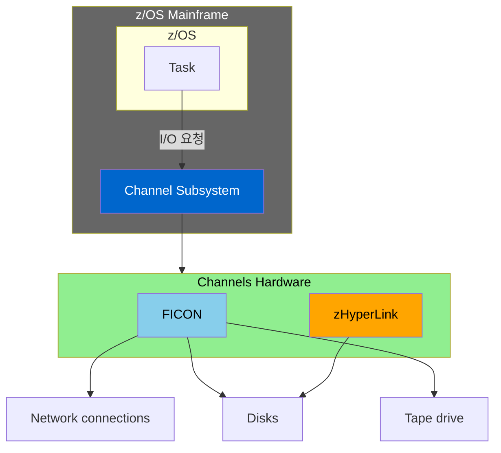
```mermaid
flowchart TB
    subgraph ZOS["z/OS Mainframe"]
        subgraph ZOSArea["z/OS"]
            Task["Task"]
        end
        
        CSS["Channel Subsystem"]
    end
    
    subgraph Channels["Channels Hardware"]
        FICON["FICON"]
        zHyperLink["zHyperLink"]
    end
    
    Network["Network connections"]
    Disks["Disks"]
    TapeDrive["Tape drive"]
    
    Task -->|I/O 요청| CSS
    CSS --> Channels
    FICON --> Network
    FICON --> Disks
    FICON --> TapeDrive
    zHyperLink --> Disks
    
    style ZOS fill:#666,color:#fff
    style CSS fill:#0066cc,color:#fff
    style Channels fill:#90ee90,color:#000
    style FICON fill:#87ceeb,color:#000
    style zHyperLink fill:#ffa500,color:#000
```

#### FICON (Fiber Connection)

**FICON**은 광섬유 케이블을 사용하는 채널 기술로, 1998년에 도입되었습니다.

##### FICON의 주요 특징

- **케이블 타입**: 광섬유 케이블 사용
- **장치 지원**: 채널당 16,000개 이상의 장치 지원
- **전송 속도**: 최대 전송 속도가 초당 8GB를 초과
- **최대 거리**: 최대 60마일 (100km)

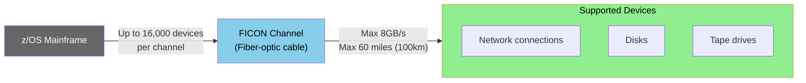
```mermaid
flowchart LR
    Mainframe["z/OS Mainframe"]
    FICON["FICON Channel<br/>(Fiber-optic cable)"]
    
    subgraph Devices["Supported Devices"]
        Network["Network connections"]
        Disks["Disks"]
        Tape["Tape drives"]
    end
    
    Mainframe -->|"Up to 16,000 devices<br/>per channel"| FICON
    FICON -->|"Max 8GB/s<br/>Max 60 miles (100km)"| Devices
    
    style Mainframe fill:#666,color:#fff
    style FICON fill:#87ceeb,color:#000
    style Devices fill:#90ee90,color:#000
```

FICON은 광범위한 거리와 높은 대역폭이 필요한 다양한 I/O 장치 연결에 적합합니다.

#### IBM zHyperLink Express

**IBM zHyperLink Express**는 z14 메인프레임과 함께 도입된 고성능 채널 기술입니다.

##### IBM zHyperLink Express의 주요 특징

- **도입 시기**: z14 메인프레임과 함께 도입
- **연결 거리**: 최대 492피트 (150미터)의 짧은 거리 직접 연결
- **대상 장치**: 메인프레임과 DS8800 (또는 그 이상) 디스크 저장소 간 연결
- **링크 데이터 속도**: 초당 8GB
- **설계 목적**: I/O 지연 시간 감소 및 I/O 처리량 향상

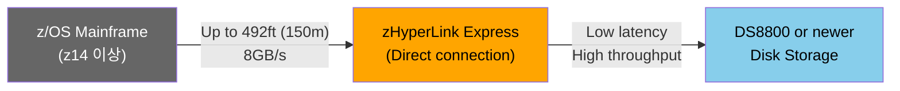
```mermaid
flowchart LR
    Mainframe["z/OS Mainframe<br/>(z14 이상)"]
    zHyperLink["zHyperLink Express<br/>(Direct connection)"]
    DiskSub["DS8800 or newer<br/>Disk Storage"]
    
    Mainframe -->|"Up to 492ft (150m)<br/>8GB/s"| zHyperLink
    zHyperLink -->|"Low latency<br/>High throughput"| DiskSub
    
    style Mainframe fill:#666,color:#fff
    style zHyperLink fill:#ffa500,color:#000
    style DiskSub fill:#87ceeb,color:#000
```

zHyperLink는 짧은 거리에서 최소 지연 시간과 최대 처리량이 필요한 고성능 디스크 저장소 연결에 최적화되어 있습니다.

#### FICON vs zHyperLink 비교

| 특징 | FICON | zHyperLink Express |
|------|-------|-------------------|
| **도입 시기** | 1998년 | z14 메인프레임과 함께 (z15, z16, z17에서도 지원) |
| **케이블 타입** | 광섬유 케이블 | 직접 연결 |
| **최대 거리** | 60마일 (100km) | 492피트 (150미터) |
| **전송 속도** | 8GB/초 초과 | 8GB/초 |
| **장치 지원** | 채널당 16,000개 이상 | 디스크 저장소 전용 |
| **주요 용도** | 다양한 I/O 장치 (네트워크, 디스크, 테이프) | 고성능 디스크 저장소 (DS8800 이상) |
| **설계 목적** | 광범위한 연결 및 높은 대역폭 | 낮은 지연 시간 및 높은 처리량 |

#### Channels Hardware 요약

::: tip Channels Hardware 요약

- **Channel Subsystem 연결**: 채널 케이블을 사용하여 외부 시스템에 연결
- **FICON**:
  - 1998년 도입, 광섬유 케이블 사용
  - 채널당 16,000개 이상의 장치 지원
  - 최대 전송 속도 8GB/초 초과
  - 최대 거리 60마일 (100km)
  - 다양한 I/O 장치 연결에 적합
- **IBM zHyperLink Express**:
  - z14 메인프레임과 함께 도입 (z15, z16, z17에서도 지원)
  - 최대 492피트 (150미터) 직접 연결
  - DS8800 이상 디스크 저장소 전용
  - 링크 데이터 속도 8GB/초
  - I/O 지연 시간 감소 및 처리량 향상 목적

:::

### Channels are More Than Cables

#### Channel의 정의

이전 페이지에서 두 가지 다른 유형의 채널 케이블을 살펴봤습니다. 실제로 **Channel**은 단순히 케이블 이상의 것입니다. Channel은 통신을 담당하는 Channel Subsystem과 이 통신을 지원하는 프로토콜, 기술 및 기타 소프트웨어를 포함하는 통합 시스템입니다.

#### Channel의 구성 요소

Channel은 다음과 같은 구성 요소로 이루어져 있습니다:

- **Channel cable** (채널 케이블)
- **Communication protocol** (통신 프로토콜)
- **Data handling routines** (데이터 처리 루틴)
- **Channel subsystem** (채널 서브시스템)
- **Control unit** (제어 장치)

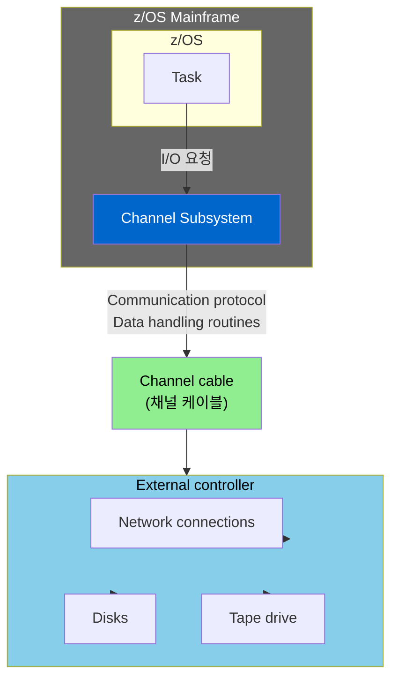
```mermaid
flowchart TB
    subgraph ZOS["z/OS Mainframe"]
        subgraph ZOSArea["z/OS"]
            Task["Task"]
        end
        
        CSS["Channel Subsystem"]
    end
    
    ChannelCable["Channel cable<br/>(채널 케이블)"]
    
    subgraph ExternalCtrl["External controller"]
        Network["Network connections"]
        Disks["Disks"]
        TapeDrive["Tape drive"]
    end
    
    Task -->|I/O 요청| CSS
    CSS -->|"Communication protocol<br/>Data handling routines"| ChannelCable
    ChannelCable --> ExternalCtrl
    ExternalCtrl --> Network
    ExternalCtrl --> Disks
    ExternalCtrl --> TapeDrive
    
    style ZOS fill:#666,color:#fff
    style CSS fill:#0066cc,color:#fff
    style ChannelCable fill:#90ee90,color:#000
    style ExternalCtrl fill:#87ceeb,color:#000
```

#### Channel의 통합 시스템 특성

Channel Subsystem과 External Controller는 서로 다른 프로토콜과 기술을 사용하여 채널 통신을 수행합니다. Channel은 하드웨어(케이블, 제어 장치, 채널 서브시스템)와 소프트웨어(통신 프로토콜, 데이터 처리 루틴)를 통합한 시스템으로, 메인프레임과 외부 장치 간의 I/O 작업을 용이하게 합니다.

### CCW and Coupling Channels

#### FICON Channel의 두 가지 유형

FICON Channel은 용도에 따라 두 가지 유형으로 구분됩니다:

1. **CCW Channels** (Channel Command Word Channels)
2. **Coupling Channels** (결합 채널)

#### CCW Channels

**CCW Channels**는 메인프레임이 아닌 외부 장치와 연결하는 데 사용됩니다.

##### CCW Channels가 연결하는 장치

- 디스크 서브시스템
- 테이프 서브시스템
- 네트워크 스위치
- 프린터

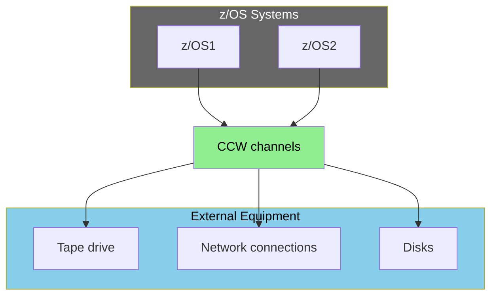
```mermaid
flowchart TB
    subgraph ZOS["z/OS Systems"]
        ZOS1["z/OS1"]
        ZOS2["z/OS2"]
    end
    
    CCWChannels["CCW channels"]
    
    subgraph External["External Equipment"]
        TapeDrive["Tape drive"]
        Network["Network connections"]
        Disks["Disks"]
    end
    
    ZOS1 --> CCWChannels
    ZOS2 --> CCWChannels
    CCWChannels --> TapeDrive
    CCWChannels --> Network
    CCWChannels --> Disks
    
    style ZOS fill:#666,color:#fff
    style CCWChannels fill:#90ee90,color:#000
    style External fill:#87ceeb,color:#000
```

#### Coupling Channels의 용도

**Coupling Channels**는 z/OS 시스템들을 서로 연결하거나, z/OS를 Coupling Facility와 연결하는 데 사용됩니다.

- 여러 z/OS 시스템 간의 고속 통신
- z/OS 시스템과 Coupling Facility 간의 데이터 공유
- 시스템 간 데이터 동기화 및 캐싱

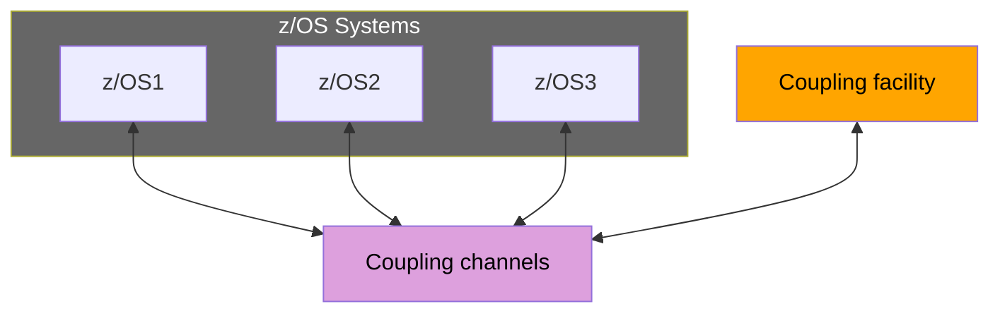
```mermaid
flowchart TB
    subgraph ZOS["z/OS Systems"]
        ZOS1["z/OS1"]
        ZOS2["z/OS2"]
        ZOS3["z/OS3"]
    end
    
    CouplingChannels["Coupling channels"]
    CouplingFacility["Coupling facility"]
    
    ZOS1 <--> CouplingChannels
    ZOS2 <--> CouplingChannels
    ZOS3 <--> CouplingChannels
    CouplingFacility <--> CouplingChannels
    
    style ZOS fill:#666,color:#fff
    style CouplingChannels fill:#dda0dd,color:#000
    style CouplingFacility fill:#ffa500,color:#000
```

#### CCW Channels vs Coupling Channels 비교

| 특징 | CCW Channels | Coupling Channels |
|------|-------------|------------------|
| **주요 용도** | 외부 I/O 장치 연결 | z/OS 시스템 간 또는 Coupling Facility 연결 |
| **연결 대상** | 디스크, 테이프, 네트워크, 프린터 | z/OS 시스템, Coupling Facility |
| **데이터 흐름** | 메인프레임 ↔ 외부 장치 | z/OS 시스템 ↔ z/OS 시스템 또는 Coupling Facility |
| **통신 목적** | I/O 작업 수행 | 고속 통신 및 데이터 공유 |

::: tip CCW Channels와 Coupling Channels 요약

**CCW Channels**는 디스크 및 테이프 서브시스템과 같은 외부 장치에 연결하는 데 사용되는 전통적인 채널입니다.

**Coupling Channels**는 z/OS와 같은 운영 체제를 서로 연결하거나 Coupling Facility에 연결합니다. Coupling Channels는 다음과 같이 구분됩니다:
- **External (외부)**: 외부 케이블을 통해 작동
- **Internal (내부)**: 운영 체제나 Coupling Facility가 같은 CPC에 있는 경우

:::

### Internal Channels

#### Internal Coupling Channels의 개념

하나의 메인프레임 CPC(Central Processor Complex)는 여러 z/OS 시스템과 Coupling Facility를 포함할 수 있습니다. 이들 모두는 통신을 위해 Coupling Channels를 사용합니다.

CPC 내부에서 이러한 채널은 **Internal**일 수 있으며, 광섬유 케이블이 필요하지 않습니다. 이러한 **Internal Coupling (IC) Channels**는 외부 광섬유 연결을 사용하는 채널보다 빠릅니다.

#### Internal vs External Coupling Channels

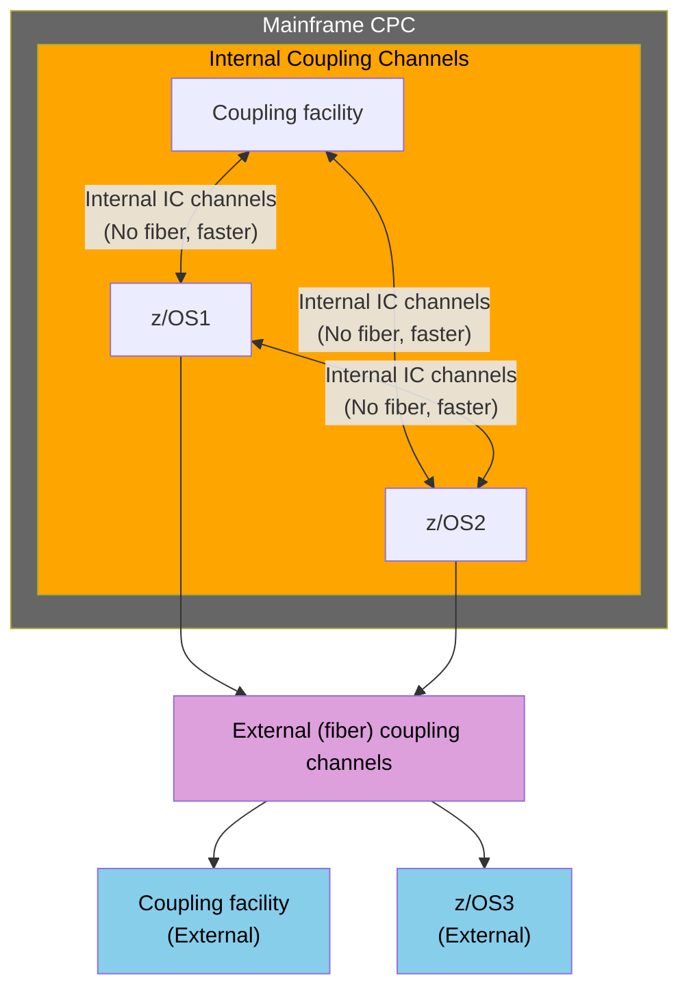
```mermaid
flowchart TB
    subgraph CPC["Mainframe CPC"]
        subgraph Internal["Internal Coupling Channels"]
            CF1["Coupling facility"]
            ZOS1["z/OS1"]
            ZOS2["z/OS2"]
        end
    end
    
    ExternalChannels["External (fiber) coupling channels"]
    
    CF2["Coupling facility<br/>(External)"]
    ZOS3["z/OS3<br/>(External)"]
    
    CF1 <-->|"Internal IC channels<br/>(No fiber, faster)"| ZOS1
    CF1 <-->|"Internal IC channels<br/>(No fiber, faster)"| ZOS2
    ZOS1 <-->|"Internal IC channels<br/>(No fiber, faster)"| ZOS2
    
    ZOS1 --> ExternalChannels
    ZOS2 --> ExternalChannels
    ExternalChannels --> CF2
    ExternalChannels --> ZOS3
    
    style CPC fill:#666,color:#fff
    style Internal fill:#ffa500,color:#000
    style ExternalChannels fill:#dda0dd,color:#000
    style CF2 fill:#87ceeb,color:#000
    style ZOS3 fill:#87ceeb,color:#000
```

### Internal Coupling Channels의 특징

- **위치**: 하나의 CPC 내부
- **케이블**: 광섬유 케이블 불필요
- **속도**: 외부 광섬유 연결보다 빠름
- **용도**: CPC 내부의 z/OS 시스템 및 Coupling Facility 간 통신

### External Coupling Channels의 특징

- **위치**: CPC 간 또는 외부 Facility와의 통신
- **케이블**: 광섬유 케이블 사용
- **용도**: 서로 다른 CPC에 있는 z/OS 시스템 간 통신 또는 외부 Coupling Facility 연결

::: tip Internal Channels 요약

- **CPC 내부**: 하나의 CPC에 여러 z/OS 시스템과 Coupling Facility 포함 가능
- **Internal Coupling (IC) Channels**: 
  - CPC 내부에서 사용
  - 광섬유 케이블 불필요
  - 외부 광섬유 연결보다 빠름
- **External Coupling Channels**: 
  - CPC 간 또는 외부 Facility와의 통신
  - 광섬유 케이블 사용

:::

### I/O Definitions

#### I/O 정의의 필요성

외부 장치를 사용하기 전에, 해당 장치는 **Channel Subsystem**과 **z/OS** 모두에 정의되어야 합니다.

#### Hardware Configuration Dialog (HCD)

z/OS 시스템 프로그래머는 **Hardware Configuration Dialog (HCD)**라는 z/OS 도구를 사용하여 이러한 정의를 수행합니다. HCD는 ISPF 애플리케이션입니다.

#### HCD의 주요 기능

HCD를 통해 다음 작업을 수행할 수 있습니다:

1. **구성 데이터 정의, 수정 또는 조회**
2. **구성 데이터 활성화 또는 처리**
3. **구성 데이터 인쇄 또는 비교**
4. **그래픽 구성 보고서 생성 또는 조회**
5. **구성 데이터 마이그레이션**
6. **I/O 정의 파일 유지보수**
7. **지원 하드웨어 및 설치된 UIMS 조회**

#### I/O Definition File (IODF)

HCD는 **I/O Definition File (IODF)**을 사용하여 하드웨어 구성을 저장하고 관리합니다. 일반적으로 `SYS1.IODF00.HCD.WORK`와 같은 이름으로 저장됩니다.

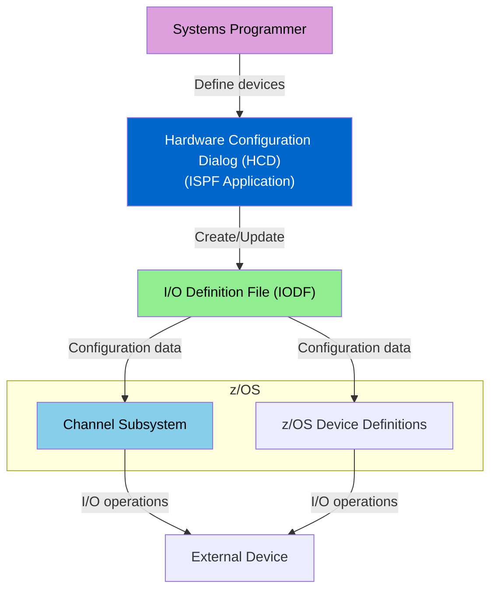
```mermaid
flowchart TB
    SysProg["Systems Programmer"]
    HCD["Hardware Configuration Dialog (HCD)<br/>(ISPF Application)"]
    IODF["I/O Definition File (IODF)"]
    
    subgraph ZOS["z/OS"]
        CSS["Channel Subsystem"]
        ZOSDef["z/OS Device Definitions"]
    end
    
    ExternalDevice["External Device"]
    
    SysProg -->|"Define devices"| HCD
    HCD -->|"Create/Update"| IODF
    IODF -->|"Configuration data"| CSS
    IODF -->|"Configuration data"| ZOSDef
    CSS -->|"I/O operations"| ExternalDevice
    ZOSDef -->|"I/O operations"| ExternalDevice
    
    style SysProg fill:#dda0dd,color:#000
    style HCD fill:#0066cc,color:#fff
    style IODF fill:#90ee90,color:#000
    style CSS fill:#87ceeb,color:#000
```

#### I/O 정의 프로세스

1. **장치 식별**: 사용할 외부 장치를 식별합니다.
2. **HCD를 통한 정의**: HCD를 사용하여 장치를 Channel Subsystem과 z/OS에 정의합니다.
3. **IODF 저장**: 정의된 구성이 IODF에 저장됩니다.
4. **활성화**: 구성 데이터를 활성화하여 시스템에서 사용 가능하게 합니다.

::: tip I/O Definitions 요약

- **필수 사항**: 외부 장치 사용 전 Channel Subsystem과 z/OS에 정의 필요
- **도구**: Hardware Configuration Dialog (HCD) - ISPF 애플리케이션
- **구성 파일**: I/O Definition File (IODF)
- **주요 작업**: 장치 정의, 구성 데이터 관리, 활성화

:::

### Summary

#### I/O 처리의 핵심 개념

z/OS에서 I/O 처리는 대부분 일반 메인프레임 프로세서에서 수행되지 않습니다. 대신 다음과 같이 처리됩니다:

1. **Channel Subsystem**: 
   - 일반 프로세서와 메모리와는 별도의 프로세서(SAP)와 메모리를 사용하는 Channel Subsystem에서 처리됩니다.
   - Channel Subsystem은 z/OS 태스크의 I/O 요청을 받아 외부 장치와 통신합니다.

2. **External Controllers**: 
   - 메인프레임에 연결되는 장비 내의 외부 컨트롤러 또는 제어 장치에서도 I/O 처리가 수행됩니다.

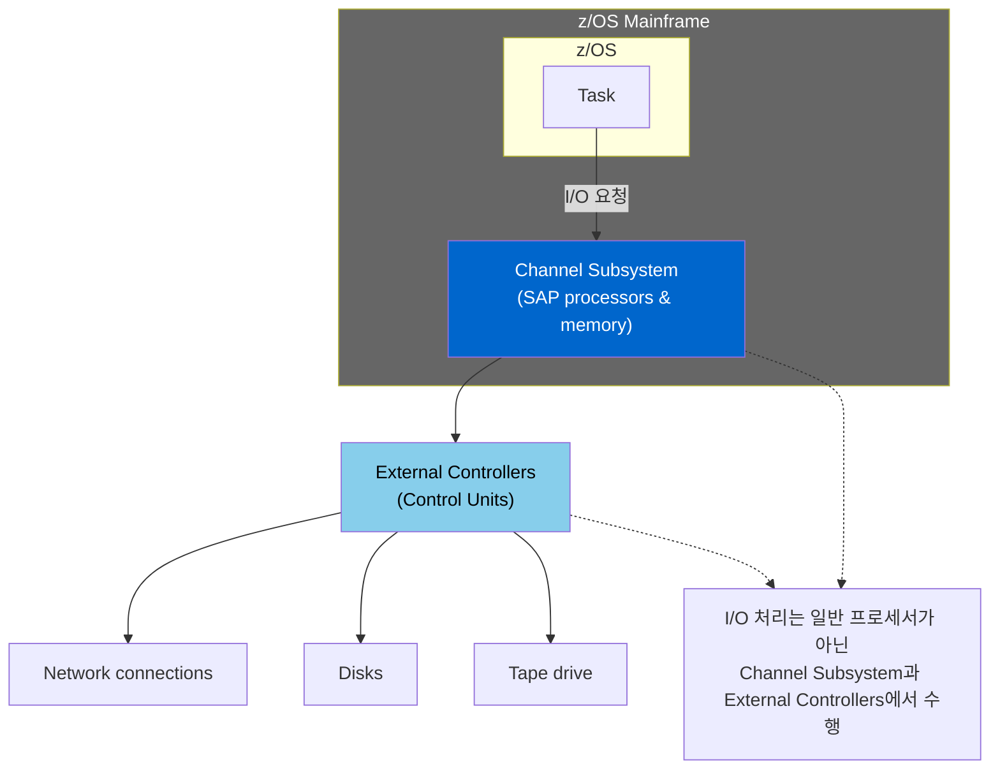
```mermaid
flowchart TB
    subgraph ZOS["z/OS Mainframe"]
        subgraph ZOSArea["z/OS"]
            Task["Task"]
        end
        
        CSS["Channel Subsystem<br/>(SAP processors & memory)"]
    end
    
    ExternalCtrl["External Controllers<br/>(Control Units)"]
    
    Network["Network connections"]
    Disks["Disks"]
    TapeDrive["Tape drive"]
    
    Task -->|I/O 요청| CSS
    CSS --> ExternalCtrl
    ExternalCtrl --> Network
    ExternalCtrl --> Disks
    ExternalCtrl --> TapeDrive
    
    Note1["I/O 처리는 일반 프로세서가 아닌<br/>Channel Subsystem과 External Controllers에서 수행"]
    
    CSS -.-> Note1
    ExternalCtrl -.-> Note1
    
    style ZOS fill:#666,color:#fff
    style CSS fill:#0066cc,color:#fff
    style ExternalCtrl fill:#87ceeb,color:#000
```

### 주요 학습 내용 요약

#### 1. Channel Subsystem
- 메인프레임 내에서 I/O 처리를 담당하는 서브시스템
- System Assistance Processors (SAP)와 자체 메모리 사용
- 일반 프로세서와 독립적으로 작동하여 CPU 활용률 향상

#### 2. Channels Hardware
- **FICON**: 광섬유 케이블 기반, 광범위한 연결 지원
- **zHyperLink Express**: 짧은 거리 고성능 디스크 저장소 연결

#### 3. Channel 유형
- **CCW Channels**: 외부 I/O 장치 연결
- **Coupling Channels**: z/OS 시스템 간 또는 Coupling Facility 연결
- **Internal Coupling Channels**: CPC 내부 통신 (더 빠름)

#### 4. I/O Definitions
- 외부 장치 사용 전 Channel Subsystem과 z/OS에 정의 필요
- HCD (Hardware Configuration Dialog)를 통한 정의 및 관리

#### 5. OSA Communications
- **OSA (Open Systems Adapter)**: 메인프레임에 플러그인되는 하드웨어 카드, 표준 Ethernet 네트워크 인프라 연결
- **First OSA**: Channel Subsystem과 내부 연결, Ethernet/FDDI/Token Ring 지원
- **OSA Express**: Channel Subsystem 우회, 더 빠름, Ethernet만 지원
- **OSA-ICC**: HMC를 통해 구성, z/OS 콘솔 제공
- **Channel Subsystem과의 차이점**:
  - Channel Subsystem: SAP 사용, 모든 I/O 장치 지원
  - OSA: 일반 프로세서 사용 가능, 네트워크 전용, 표준 네트워크 프로토콜

#### 6. Shared Memory Communication (SMC)
- **SMC-D**: 같은 CPC 내 시스템 간 통신, ISM 사용, 추가 하드웨어 불필요
- **SMC-R**: 서로 다른 CPC 간 통신, RoCE 사용, RNIC 필요
- 처리량 향상 및 지연 시간 감소

#### 7. HiperSockets
- 같은 CPC 내 시스템 간 TCP/IP 통신
- OSA 프로토콜 사용하지만 OSA 하드웨어 불필요
- OSA보다 빠른 성능

### I/O 처리 아키텍처의 이점

- **CPU 효율성**: 일반 프로세서는 I/O 대기 없이 다른 작업 수행 가능
- **확장성**: 다양한 외부 장치와의 효율적인 연결
- **성능**: 전용 프로세서와 컨트롤러를 통한 최적화된 I/O 처리
- **유연성**: 다양한 채널 유형과 하드웨어 옵션 제공

::: tip 전체 요약

z/OS의 I/O 처리는 일반 메인프레임 프로세서가 아닌 **Channel Subsystem**과 **External Controllers**에서 수행됩니다. 네트워크 통신의 경우, **OSA (Open Systems Adapter)**가 Channel Subsystem과는 다른 방식으로 표준 네트워크 프로토콜을 지원합니다. 

시스템 간 통신을 위해 **SMC (Shared Memory Communication)**와 **RoCE (RDMA over Converged Ethernet)**가 사용됩니다:
- **SMC-D**: 같은 CPC 내 시스템 간 고속 통신 (ISM 사용)
- **SMC-R**: 서로 다른 CPC 간 고속 통신 (RoCE 사용)
- **HiperSockets**: 같은 CPC 내 시스템 간 TCP/IP 통신 (OSA 하드웨어 불필요)

이를 통해 CPU 효율성을 극대화하고 다양한 외부 장치와의 효율적인 통신을 가능하게 합니다.

:::

## Open Systems Adapter

### 개요

**OSA (Open Systems Adapter)**는 z/OS 시스템이 네트워크와 통신하는 또 다른 방법을 제공합니다. Channel Subsystem과는 다른 방식으로 작동하며, 네트워크 연결을 위한 특화된 어댑터입니다.

### 과거: Channel Subsystem을 통한 네트워크 연결

과거에는 네트워크 연결이 일반 Channel Subsystem과 외부 네트워크 컨트롤러를 함께 사용했습니다.

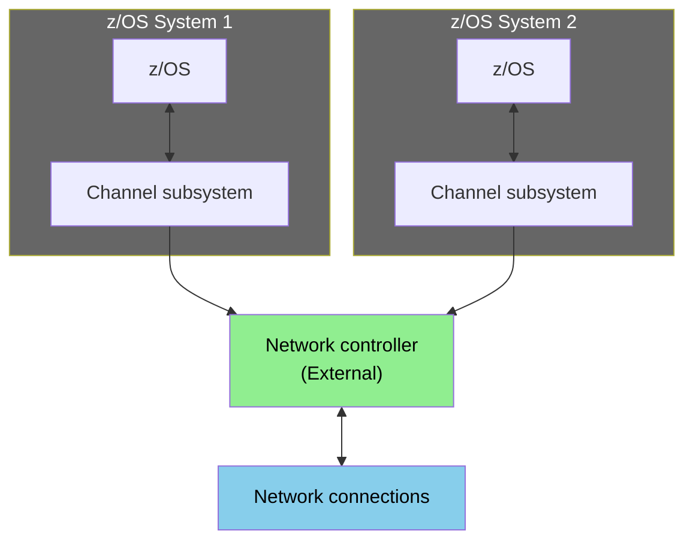
```mermaid
flowchart TB
    subgraph ZOS1["z/OS System 1"]
        ZOS1_OS["z/OS"]
        ZOS1_CSS["Channel subsystem"]
    end
    
    subgraph ZOS2["z/OS System 2"]
        ZOS2_OS["z/OS"]
        ZOS2_CSS["Channel subsystem"]
    end
    
    NetworkCtrl["Network controller<br/>(External)"]
    Network["Network connections"]
    
    ZOS1_OS <--> ZOS1_CSS
    ZOS2_OS <--> ZOS2_CSS
    
    ZOS1_CSS --> NetworkCtrl
    ZOS2_CSS --> NetworkCtrl
    NetworkCtrl <--> Network
    
    style ZOS1 fill:#666,color:#fff
    style ZOS2 fill:#666,color:#fff
    style NetworkCtrl fill:#90ee90,color:#000
    style Network fill:#87ceeb,color:#000
```

### 현재: Channel Subsystem과 OSA

현재도 Channel Subsystem은 여전히 VTAM과 TCP/IP 네트워크 연결에 사용될 수 있습니다:
- FICON CCW 채널을 사용하여 네트워크 장치를 메인프레임에 연결
- Coupling Channels를 사용하여 메인프레임 운영 체제 간 직접 연결

그러나 **OSA (Open Systems Adapter)**는 Channel Subsystem과는 다른 방식으로 네트워크 통신을 제공합니다.

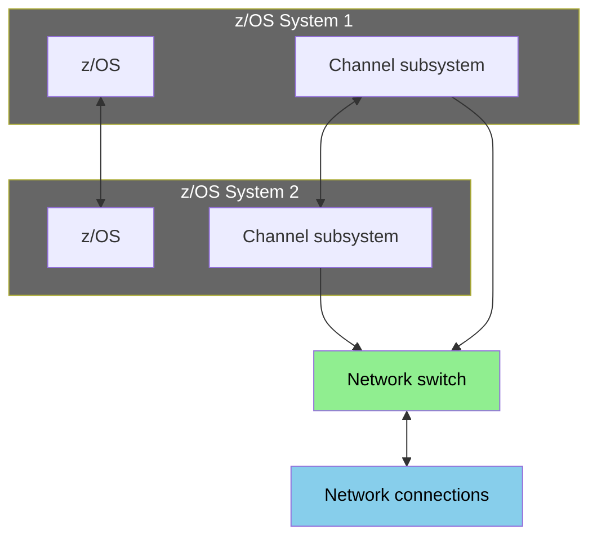
```mermaid
flowchart TB
    subgraph ZOS1["z/OS System 1"]
        ZOS1_OS["z/OS"]
        ZOS1_CSS["Channel subsystem"]
    end
    
    subgraph ZOS2["z/OS System 2"]
        ZOS2_OS["z/OS"]
        ZOS2_CSS["Channel subsystem"]
    end
    
    NetworkSwitch["Network switch"]
    Network["Network connections"]
    
    ZOS1_OS <--> ZOS2_OS
    ZOS1_CSS <--> ZOS2_CSS
    ZOS1_CSS --> NetworkSwitch
    ZOS2_CSS --> NetworkSwitch
    NetworkSwitch <--> Network
    
    style ZOS1 fill:#666,color:#fff
    style ZOS2 fill:#666,color:#fff
    style NetworkSwitch fill:#90ee90,color:#000
    style Network fill:#87ceeb,color:#000
```

### OSA와 Channel Subsystem의 차이점

| 특징 | Channel Subsystem | OSA (Open Systems Adapter) |
|------|------------------|---------------------------|
| **처리 위치** | 메인프레임 내부 (SAP 사용) | 메인프레임 내부 (일반 프로세서 사용 가능) |
| **프로세서** | System Assistance Processors (SAP) | 일반 프로세서 또는 전용 프로세서 |
| **메모리** | 자체 전용 메모리 | 일반 메모리 또는 공유 메모리 |
| **주요 용도** | 모든 I/O 장치 (디스크, 테이프, 네트워크 등) | 네트워크 통신 전용 |
| **통신 방식** | Channel 프로토콜 | 표준 네트워크 프로토콜 (Ethernet, TCP/IP) |
| **투명성** | z/OS 프로그램에 투명 | 애플리케이션에서 직접 접근 가능 |
| **성능** | SAP를 통한 전용 처리 | 일반 프로세서 활용 또는 최적화된 처리 |

### OSA의 주요 특징

1. **네트워크 전용**: OSA는 네트워크 통신에 특화된 어댑터입니다.
2. **표준 프로토콜 지원**: Ethernet, TCP/IP 등 표준 네트워크 프로토콜을 지원합니다.
3. **직접 접근**: 애플리케이션이 OSA를 통해 직접 네트워크에 접근할 수 있습니다.
4. **성능 최적화**: 네트워크 통신에 최적화된 하드웨어 및 소프트웨어를 제공합니다.

### OSA의 구조

**Open Systems Adapter (OSA)**는 메인프레임에 플러그인되는 하드웨어 카드입니다. 이를 통해 메인프레임이 표준 Ethernet 네트워크 인프라에 연결되어 TCP/IP 네트워크 연결을 수행할 수 있습니다.

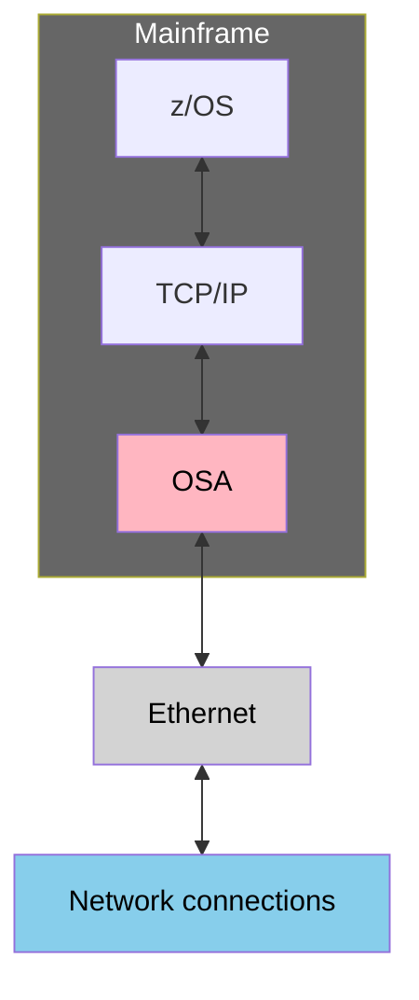
```mermaid
flowchart TB
    subgraph Mainframe["Mainframe"]
        ZOS["z/OS"]
        TCPIP["TCP/IP"]
        OSA["OSA"]
    end
    
    Ethernet["Ethernet"]
    Network["Network connections"]
    
    ZOS <--> TCPIP
    TCPIP <--> OSA
    OSA <--> Ethernet
    Ethernet <--> Network
    
    style Mainframe fill:#666,color:#fff
    style OSA fill:#ffb6c1,color:#000
    style Ethernet fill:#d3d3d3,color:#000
    style Network fill:#87ceeb,color:#000
```

### First OSA

첫 번째 OSA 어댑터는 효과적으로 네트워크 컨트롤러로 작동했습니다. 일반 Channel Subsystem과의 내부 연결을 사용하여 메인프레임과 통신했습니다.

**First OSA의 특징:**
- Channel Subsystem과 내부 연결 사용
- 표준 네트워크 구성 지원:
  - **Ethernet**
  - **FDDI** (Fiber Distributed Data Interface)
  - **Token Ring**

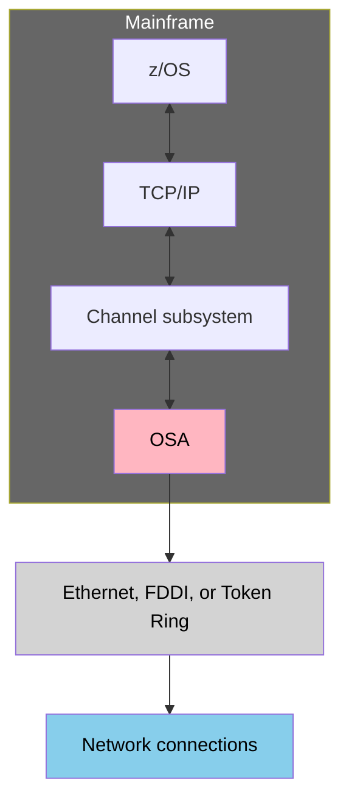
```mermaid
flowchart TB
    subgraph Mainframe["Mainframe"]
        ZOS["z/OS"]
        TCPIP["TCP/IP"]
        CSS["Channel subsystem"]
        OSA["OSA"]
    end
    
    Protocols["Ethernet, FDDI, or Token Ring"]
    Network["Network connections"]
    
    ZOS <--> TCPIP
    TCPIP <--> CSS
    CSS <--> OSA
    OSA --> Protocols
    Protocols --> Network
    
    style Mainframe fill:#666,color:#fff
    style OSA fill:#ffb6c1,color:#000
    style Protocols fill:#d3d3d3,color:#000
    style Network fill:#87ceeb,color:#000
```

### OSA Express

현재의 새로운 OSA 카드인 **OSA Express**는 더 빠르고 Channel Subsystem을 우회합니다.

**OSA Express의 특징:**
- Channel Subsystem 우회로 성능 향상
- **Ethernet만 지원**:
  - Gigabit Ethernet
  - 1000Base-T

```mermaid
flowchart TB
    subgraph Mainframe["Mainframe"]
        ZOS["z/OS"]
        TCPIP["TCP/IP"]
        OSA["OSA Express"]
    end
    
    Ethernet["Ethernet<br/>(Gigabit Ethernet, 1000Base-T)"]
    Network["Network connections"]
    
    ZOS <--> TCPIP
    TCPIP <--> OSA
    OSA --> Ethernet
    Ethernet --> Network
    
    style Mainframe fill:#666,color:#fff
    style OSA fill:#ffb6c1,color:#000
    style Ethernet fill:#d3d3d3,color:#000
    style Network fill:#87ceeb,color:#000
```

### Consoles and HMC

**Hardware Management Console (HMC)**는 **Open Systems Adapter - Integrated Console Controller (OSA-ICC)**의 구성 소스 파일을 생성하고 관리하는 데 사용할 수 있습니다. OSA-ICC는 운영 체제에 z/OS 콘솔을 제공하는 데 사용됩니다.

```mermaid
flowchart TB
    HMC["Hardware Management Console (HMC)"]
    
    subgraph Mainframe["Mainframe"]
        ZOS["z/OS"]
        TCPIP["TCP/IP"]
        OSA["OSA-ICC<br/>(Integrated Console Controller)"]
    end
    
    Console["z/OS console"]
    
    HMC <--> OSA
    ZOS <--> TCPIP
    TCPIP <--> OSA
    OSA <--> Console
    
    style Mainframe fill:#666,color:#fff
    style OSA fill:#ffb6c1,color:#000
    style HMC fill:#90ee90,color:#000
    style Console fill:#87ceeb,color:#000
```

### Shared Memory Communication (SMC)

### SMC의 개념

**Shared Memory Communication (SMC)**는 처리량을 향상시키고 지연 시간을 줄이는 프로토콜입니다. 두 피어가 각 피어가 파트너가 사용할 수 있도록 할당한 시스템 메모리 버퍼를 사용하여 데이터를 전송할 수 있게 합니다.

### SMC의 두 가지 방법

시스템 간 통신은 다음 두 가지 방법 중 하나를 사용하여 수행할 수 있습니다:

1. **SMC-Direct Memory Access (SMC-D)**
2. **SMC-Remote Directory Access (SMC-R)**

### SMC-D (Internal Shared Memory)

**SMC-D**를 사용하면 같은 CPC 내의 시스템 간에 데이터가 전송됩니다. **Internal Shared Memory (ISM)** 기술을 사용하여 가상 어댑터를 제공하여 같은 시스템 내의 각 TCP 소켓 엔드포인트 간의 시스템 내 통신을 허용합니다. 이는 추가 하드웨어가 필요하지 않음을 의미합니다.

```mermaid
flowchart TB
    subgraph CPC["Same CPC"]
        subgraph ZOS1["z/OS 1"]
            SM1["Shared memory"]
            SMC1["SMC"]
        end
        
        subgraph ZOS2["z/OS 2"]
            SM2["Shared memory"]
            SMC2["SMC"]
        end
        
        ISM["SMC-D using ISM<br/>(Internal Shared Memory)"]
    end
    
    SMC1 <--> ISM
    SMC2 <--> ISM
    
    style CPC fill:#666,color:#fff
    style SMC1 fill:#dda0dd,color:#000
    style SMC2 fill:#dda0dd,color:#000
    style ISM fill:#ffa500,color:#000
```

**SMC-D의 특징:**
- 같은 CPC 내의 시스템 간 통신
- ISM (Internal Shared Memory) 기술 사용
- 추가 하드웨어 불필요
- 낮은 지연 시간 및 높은 처리량

### Remote Direct Memory Access (RDMA) over Converged Ethernet (RoCE)

### SMC-R과 RoCE

**SMC-R**은 서로 다른 CPC에 있는 두 개의 별도 시스템 간에 데이터를 전송할 수 있게 합니다. **Remote Direct Memory Access (RDMA) over Converged Ethernet (RoCE)** 기술을 사용합니다.

이를 위해서는 **RDMA-enabled Network Interface Cards (RNIC)**가 필요합니다:
- 25 GbE RoCE Express2.1
- 10 GbE RoCE Express 2.1

```mermaid
flowchart TB
    subgraph System1["z/OS 1 (Different CPC)"]
        SM1["Shared memory"]
        SMC1["SMC"]
        RoCE1["RoCE"]
    end
    
    subgraph System2["z/OS 2 (Different CPC)"]
        SM2["Shared memory"]
        SMC2["SMC"]
        RoCE2["RoCE"]
    end
    
    SMC_R["SMC-R using RoCE"]
    
    SMC1 --> RoCE1
    SMC2 --> RoCE2
    RoCE1 <--> SMC_R
    RoCE2 <--> SMC_R
    
    style System1 fill:#666,color:#fff
    style System2 fill:#666,color:#fff
    style SMC1 fill:#dda0dd,color:#000
    style SMC2 fill:#dda0dd,color:#000
    style RoCE1 fill:#ffb6c1,color:#000
    style RoCE2 fill:#ffb6c1,color:#000
    style SMC_R fill:#ffa500,color:#000
```

**SMC-R의 특징:**
- 서로 다른 CPC 간의 시스템 통신
- RoCE (RDMA over Converged Ethernet) 기술 사용
- RDMA-enabled Network Interface Cards (RNIC) 필요
- 고속 데이터 전송

### SMC-D vs SMC-R 비교

| 특징 | SMC-D | SMC-R |
|------|-------|-------|
| **통신 범위** | 같은 CPC 내 | 서로 다른 CPC 간 |
| **기술** | ISM (Internal Shared Memory) | RoCE (RDMA over Converged Ethernet) |
| **하드웨어 요구사항** | 추가 하드웨어 불필요 | RNIC (RDMA-enabled NIC) 필요 |
| **성능** | 매우 낮은 지연 시간 | 높은 처리량 |

### HiperSockets

### HiperSockets의 개념

같은 CPC에서 운영되는 z/OS 및 기타 시스템은 TCP/IP 통신을 위해 OSA 어댑터를 사용할 필요가 없습니다.

**HiperSockets**는 OSA 프로토콜을 사용하지만 OSA 하드웨어가 필요하지 않은 메인프레임 기능입니다. HiperSockets는 OSA를 사용하는 것보다 빠릅니다.

```mermaid
flowchart TB
    subgraph CPC["Same CPC"]
        subgraph ZOS1["z/OS 1"]
            TCPIP1["TCP/IP"]
        end
        
        subgraph ZOS2["z/OS 2"]
            TCPIP2["TCP/IP"]
        end
        
        subgraph ZVM["z/VM 1"]
            TCPIP3["TCP/IP"]
        end
        
        HiperSockets["HiperSockets"]
    end
    
    TCPIP1 --> HiperSockets
    TCPIP2 --> HiperSockets
    TCPIP3 --> HiperSockets
    
    style CPC fill:#666,color:#fff
    style HiperSockets fill:#ffd700,color:#000
```

**HiperSockets의 특징:**
- 같은 CPC 내의 시스템 간 통신
- OSA 프로토콜 사용하지만 OSA 하드웨어 불필요
- OSA보다 빠른 성능
- 추가 하드웨어 불필요

### OSA와 Channel Subsystem의 공존

OSA와 Channel Subsystem은 서로 다른 목적을 가지고 있으며, z/OS 시스템에서 함께 사용될 수 있습니다:

- **Channel Subsystem**: 전통적인 I/O 장치(디스크, 테이프) 및 일부 네트워크 연결에 사용
- **OSA**: 표준 네트워크 프로토콜을 통한 네트워크 통신에 사용
- **SMC-D**: 같은 CPC 내의 시스템 간 고속 통신
- **SMC-R**: 서로 다른 CPC 간의 고속 통신
- **HiperSockets**: 같은 CPC 내의 시스템 간 TCP/IP 통신 (OSA 하드웨어 불필요)

::: tip OSA Communications 요약

- **OSA (Open Systems Adapter)**: 메인프레임에 플러그인되는 하드웨어 카드로, 표준 Ethernet 네트워크 인프라에 연결
- **First OSA**: Channel Subsystem과 내부 연결, Ethernet/FDDI/Token Ring 지원
- **OSA Express**: Channel Subsystem 우회, 더 빠름, Ethernet만 지원 (Gigabit Ethernet, 1000Base-T)
- **OSA-ICC**: HMC를 통해 구성, z/OS 콘솔 제공
- **SMC-D**: 같은 CPC 내 시스템 간 통신, ISM 사용, 추가 하드웨어 불필요
- **SMC-R**: 서로 다른 CPC 간 통신, RoCE 사용, RNIC 필요
- **HiperSockets**: 같은 CPC 내 시스템 간 TCP/IP 통신, OSA 하드웨어 불필요, OSA보다 빠름

:::

## Open Systems Adapter Summary

### OSA의 역할

**Open Systems Adapter (OSA)**는 메인프레임이 TCP/IP 연결을 위한 외부 네트워크에 연결하는 메커니즘입니다. 또한 z/OS 콘솔 및 Hardware Management Console (HMC)에 연결됩니다.

### 내부 통신 방법

같은 Central Processor Complex (CPC) 내의 시스템 간 통신:
- **SMC-D**: Internal Shared Memory (ISM)를 사용한 직접 메모리 접근
- **HiperSockets**: OSA 하드웨어 없이 OSA 프로토콜 사용, OSA보다 빠름

### 시스템 간 통신

서로 다른 시스템의 Logical Partitions (LPAR) 간 통신:
- **SMC-R**: Remote Direct Memory Access (RDMA) over Converged Ethernet (RoCE) 사용

### 통합 아키텍처

```mermaid
flowchart TB
    subgraph Mainframe["Mainframe"]
        subgraph ZOS1["z/OS 1"]
            TCPIP1["TCP/IP"]
        end
        
        subgraph ZOS2["z/OS 2"]
            TCPIP2["TCP/IP"]
        end
        
        OSA["OSA"]
        HiperSockets["HiperSockets"]
    end
    
    Network["Network connections"]
    HMC["HMC"]
    Console["z/OS console"]
    
    TCPIP1 <--> OSA
    TCPIP2 <--> OSA
    TCPIP1 <--> HiperSockets
    TCPIP2 <--> HiperSockets
    
    OSA <--> Network
    OSA <--> HMC
    OSA <--> Console
    
    style Mainframe fill:#666,color:#fff
    style OSA fill:#ffb6c1,color:#000
    style HiperSockets fill:#ffd700,color:#000
    style Network fill:#87ceeb,color:#000
    style HMC fill:#90ee90,color:#000
    style Console fill:#87ceeb,color:#000
```

### 주요 통신 방법 요약

| 통신 방법 | 사용 범위 | 기술 | 하드웨어 요구사항 |
|----------|---------|------|-----------------|
| **OSA** | 외부 네트워크 | Ethernet, TCP/IP | OSA 하드웨어 카드 |
| **SMC-D** | 같은 CPC 내 | ISM | 추가 하드웨어 불필요 |
| **SMC-R** | 서로 다른 CPC 간 | RoCE | RNIC 필요 |
| **HiperSockets** | 같은 CPC 내 | OSA 프로토콜 (하드웨어 없음) | 추가 하드웨어 불필요 |

## Summary

### How z/OS Processes I/O

모든 컴퓨팅 시스템의 필수 기능 중 하나는 I/O입니다: 디스크, 테이프, 프린터, 네트워크와 같은 외부 장치에 대한 읽기와 쓰기입니다. 이 모듈에서는 z/OS에서 I/O가 어떻게 작동하는지 살펴봤습니다.

### 학습 목표 달성

이 모듈을 완료한 후, 다음을 수행할 수 있습니다:

#### 1. Channel Subsystem의 기능과 작동 방식 설명

- **Channel Subsystem (CSS)**는 메인프레임 내에서 I/O 처리를 담당하는 서브시스템입니다.
- **System Assistance Processors (SAP)**와 자체 메모리를 사용하여 일반 프로세서와 독립적으로 작동합니다.
- z/OS 태스크가 I/O 요청을 Channel Subsystem에 전달하면, Channel Subsystem이 외부 장치와 통신하여 I/O를 수행합니다.
- I/O 수행 중 일반 프로세서는 다른 작업을 수행할 수 있어 CPU 활용률을 극대화합니다.
- I/O 완료 시 인터럽트를 통해 원래 프로세스로 제어를 반환합니다.

#### 2. OSA Communications와 Channel Subsystem의 차이점 설명

**OSA (Open Systems Adapter)**는 네트워크 통신을 위한 특화된 어댑터로, Channel Subsystem과는 다른 방식으로 작동합니다:

| 특징 | Channel Subsystem | OSA |
|------|------------------|-----|
| **프로세서** | System Assistance Processors (SAP) | 일반 프로세서 또는 전용 프로세서 |
| **주요 용도** | 모든 I/O 장치 (디스크, 테이프, 네트워크 등) | 네트워크 통신 전용 |
| **통신 방식** | Channel 프로토콜 | 표준 네트워크 프로토콜 (Ethernet, TCP/IP) |
| **현재 연결 방식** | Channel Subsystem 사용 | OSA Express는 Channel Subsystem 우회 |

**OSA의 주요 구성 요소:**
- **First OSA**: Channel Subsystem과 내부 연결, Ethernet/FDDI/Token Ring 지원
- **OSA Express**: Channel Subsystem 우회, Ethernet만 지원, 더 빠름
- **OSA-ICC**: HMC를 통해 구성, z/OS 콘솔 제공

#### 3. SMC와 RoCE가 무엇이고 시스템 간 통신에 어떻게 사용되는지 설명

**Shared Memory Communication (SMC)**는 처리량을 향상시키고 지연 시간을 줄이는 프로토콜입니다:

- **SMC-D (Direct Memory Access)**:
  - 같은 CPC 내의 시스템 간 통신에 사용
  - ISM (Internal Shared Memory) 기술 사용
  - 추가 하드웨어 불필요
  - 매우 낮은 지연 시간

- **SMC-R (Remote Directory Access)**:
  - 서로 다른 CPC 간의 시스템 통신에 사용
  - **RoCE (RDMA over Converged Ethernet)** 기술 사용
  - RDMA-enabled Network Interface Cards (RNIC) 필요
  - 높은 처리량

**HiperSockets**:
- 같은 CPC 내의 시스템 간 TCP/IP 통신에 사용
- OSA 프로토콜 사용하지만 OSA 하드웨어 불필요
- OSA보다 빠른 성능

### I/O 처리 아키텍처의 핵심

z/OS의 I/O 처리는 일반 메인프레임 프로세서가 아닌 **Channel Subsystem**과 **External Controllers**에서 수행됩니다. 네트워크 통신의 경우, **OSA (Open Systems Adapter)**가 Channel Subsystem과는 다른 방식으로 표준 네트워크 프로토콜을 지원합니다. 시스템 간 통신을 위해 **SMC (Shared Memory Communication)**와 **RoCE (RDMA over Converged Ethernet)**가 사용되어 CPU 효율성을 극대화하고 다양한 외부 장치와의 효율적인 통신을 가능하게 합니다.
