# Mainframe Resource Sharing

## 개요

IBM Z 메인프레임은 동시에 여러 시스템을 실행할 수 있습니다. 단일 CPC(Central Processor Complex)는 세 개의 z/OS 시스템을 실행할 수 있습니다.

여러 z/OS 시스템을 실행할 때, 이러한 시스템들은 데이터셋, 데이터베이스, 보안 정보 등과 같은 리소스를 공유하는 경우가 많습니다.

이 모듈에서는 단일 CPC에서 여러 운영 체제가 어떻게 실행되는지 탐구하고, 여러 z/OS 시스템이 리소스를 공유하는 방법을 소개합니다.

## 학습 목표

이 모듈을 완료한 후, 다음을 수행할 수 있습니다:

- IBM Z 메인프레임이 여러 시스템을 지원하는 방법을 설명할 수 있습니다.
- z/OS 시스템이 리소스를 공유하는 방법을 설명할 수 있습니다.

## One CPC, Multiple Systems

### Introduction

현재 거의 모든 IBM Z 메인프레임 사이트는 단일 운영 체제 사본만 실행하지 않습니다. 프로덕션과 개발을 위한 별도의 이미지를 가질 수 있고, 다른 비즈니스 단위를 위한 다른 시스템을 가질 수 있으며, 복원력을 위해 여러 시스템을 원할 수도 있습니다.

따라서 하나의 메인프레임 CPC는 일반적으로 여러 운영 체제 이미지를 실행합니다. 이러한 이미지는 z/OS, z/VM, z/TPF와 같은 전통적인 운영 체제이거나, Linux on IBM Z, KVM 하이퍼바이저, Secure Service Container (SSC)와 같은 최신 기술일 수 있습니다. 또한 하나 이상의 Coupling Facility를 호스팅할 수도 있습니다.

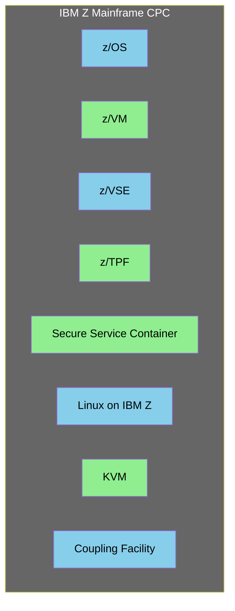

### Sharing Resources

각 운영 체제 이미지는 CPU, 메모리, I/O 연결과 같은 메인프레임 리소스가 필요합니다. 이들은 모두 CPC의 리소스를 공유해야 합니다.

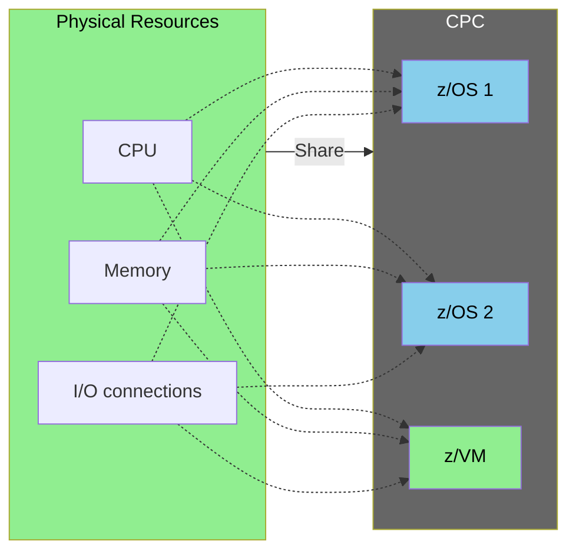

### Introducing PR/SM

IBM Z 메인프레임은 이러한 여러 운영 체제가 CPC 리소스를 공유할 수 있도록 하는 **Processor Resource / System Manager (PR/SM)**라는 기능을 사용합니다. 다른 관점에서 보면 PR/SM은 VMWare와 Microsoft Hyper-V와 같은 하이퍼바이저입니다. PR/SM은 IBM 메인프레임에 사전 설치되어 있습니다.

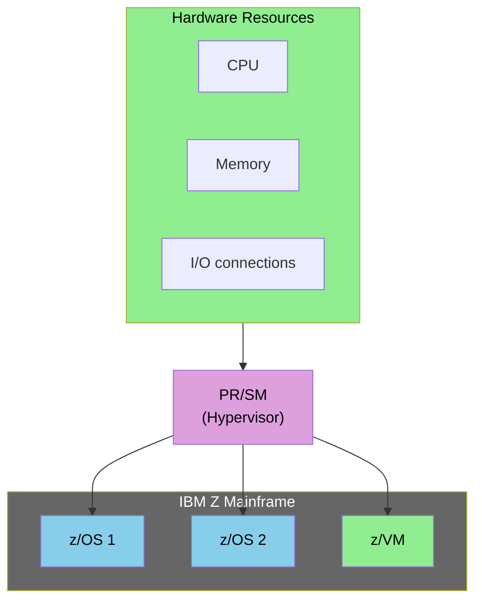

PR/SM은 하이퍼바이저로 작동하여 물리적 하드웨어 리소스를 여러 운영 체제 이미지에 가상화하고 할당합니다.

### Sharing Resources with PR/SM

PR/SM은 CPC를 논리적 파티션(Logical Partitions, LPARs)으로 나눕니다. 각 운영 체제당 하나의 LPAR입니다. z16 및 z17 메인프레임은 최대 85개의 LPAR를 가질 수 있습니다.

각 LPAR는 CPC 메모리와 CPU 리소스의 하위 집합이 할당됩니다. 예를 들어, CPC에 14개의 CPU와 500GB의 메모리가 있는 경우, 이를 세 개의 z/OS LPAR로 나눌 수 있습니다.

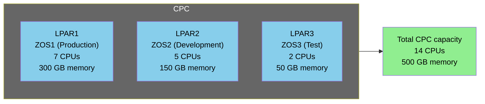

위 예시에서:
- CPU: 7 (LPAR1) + 5 (LPAR2) + 2 (LPAR3) = 14 CPUs
- Memory: 300 GB (LPAR1) + 150 GB (LPAR2) + 50 GB (LPAR3) = 500 GB memory

### PR/SM Physical CPU Sharing

메모리와 유사한 방식으로, PR/SM은 물리적 중앙 프로세서(CPU 또는 CP)를 LPAR에 할당할 수 있습니다.

이 방식의 문제점은 하나의 LPAR가 CPU를 모두 사용할 필요가 없을 때, 다른 LPAR에서 사용할 수 없다는 것입니다. PR/SM은 이를 해결하도록 구성할 수 있습니다.

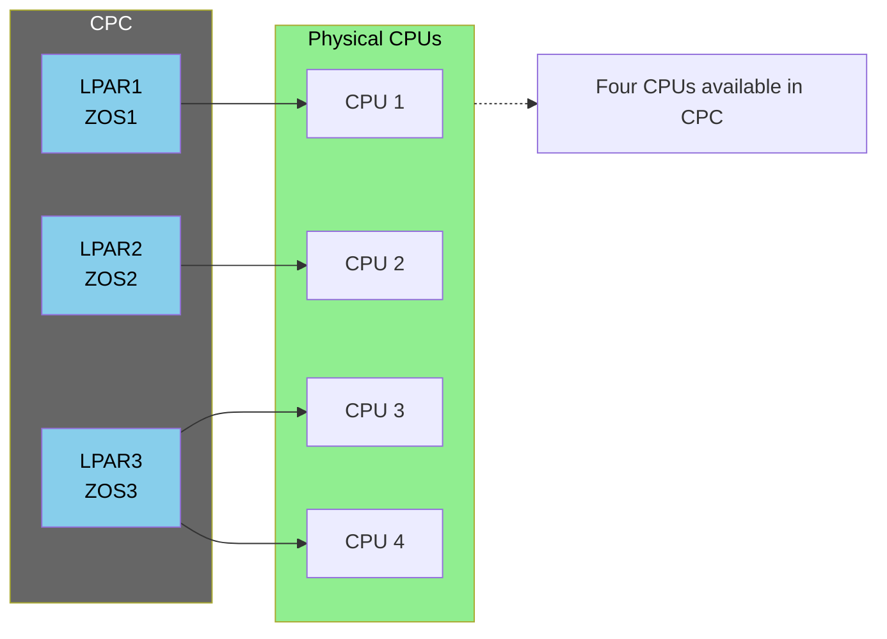

물리적 CPU 할당 방식에서는 각 LPAR가 전용 CPU를 가지지만, CPU가 유휴 상태일 때 다른 LPAR에서 사용할 수 없어 리소스 낭비가 발생할 수 있습니다.

### PR/SM Logical CPU Sharing

PR/SM은 메모리를 LPAR 간에 나눕니다. 각 LPAR는 자체 메모리 영역을 가집니다.

PR/SM은 CPU를 더 정교한 방식으로 공유합니다. 각 물리적 프로세서를 LPAR에 할당하는 대신, PR/SM은 CPU를 공유하여 하나의 LPAR가 필요하지 않으면 다른 LPAR가 사용할 수 있도록 합니다. 일부 LPAR가 다른 LPAR보다 더 많은 CPU를 받도록 설정할 수도 있습니다.

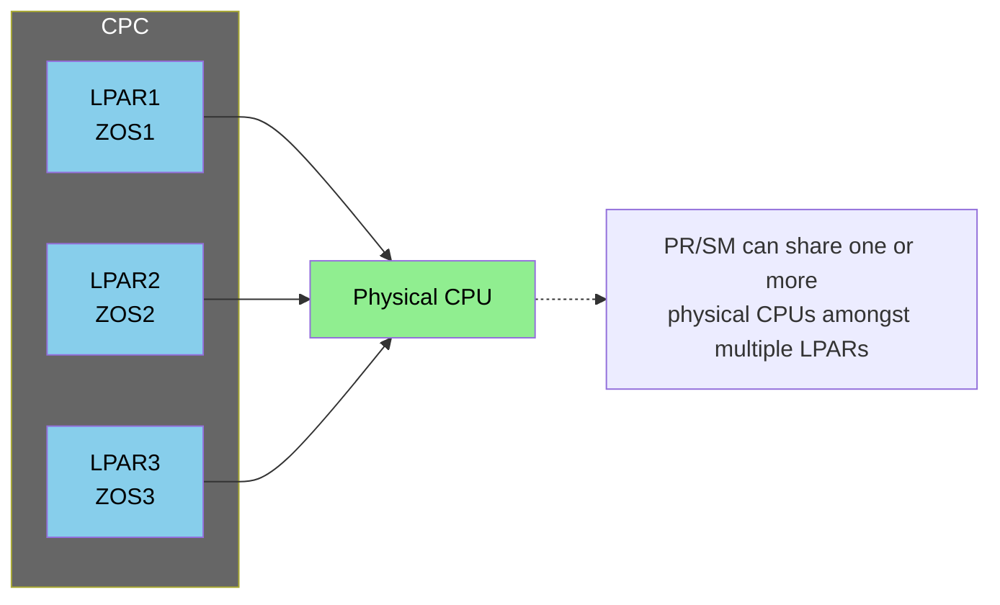

#### 논리적 CPU 공유의 작동 방식

이 예시에서 각 LPAR는 하나의 논리적 CPU를 가지며, CPC에는 세 개의 논리적 CPU가 있습니다. 각 LPAR는 하나의 CPU에 대한 독점적 액세스를 가지고 있다고 믿습니다.

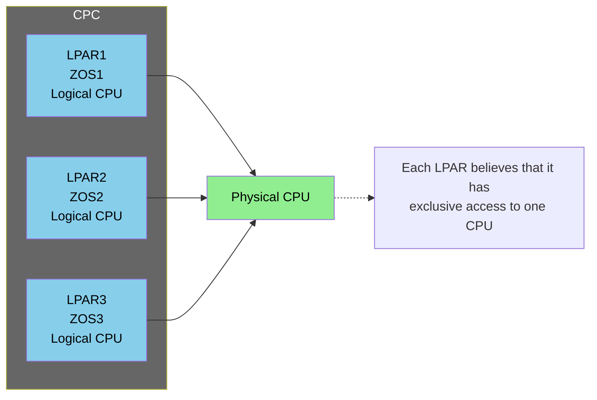

#### CPU 공유 시나리오

하나의 LPAR가 CPU를 사용할 필요가 없으면 다른 LPAR에서 사용할 수 있습니다.

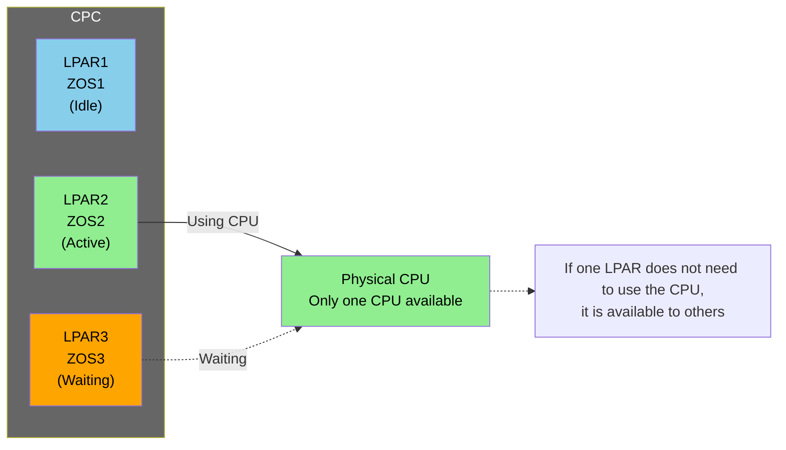

#### 대기 시나리오

LPAR3이 CPU를 사용해야 하지만 LPAR2가 사용 중인 경우, LPAR3은 LPAR2가 CPU 사용을 마치거나 PR/SM이 LPAR3의 차례로 판단할 때까지 대기합니다.

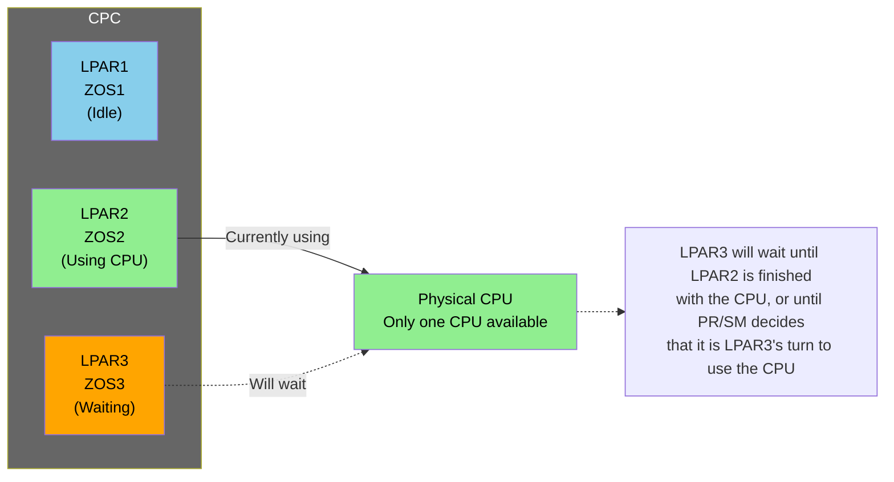

#### 바쁜 시스템에서의 CPU 공유

바쁜 시스템에서는 모든 LPAR가 CPU 차례를 기다려야 합니다. PR/SM은 LPAR 간에 CPU를 최대한 균등하게 공유하려고 합니다.

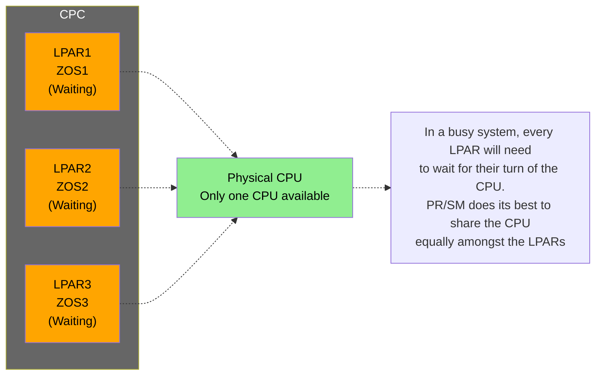

#### 가중치를 사용한 CPU 공유

PR/SM을 사용하면 각 LPAR에 가중치를 할당할 수 있습니다. 가중치가 높은 LPAR는 가중치가 낮은 LPAR보다 대기 시간이 짧습니다.

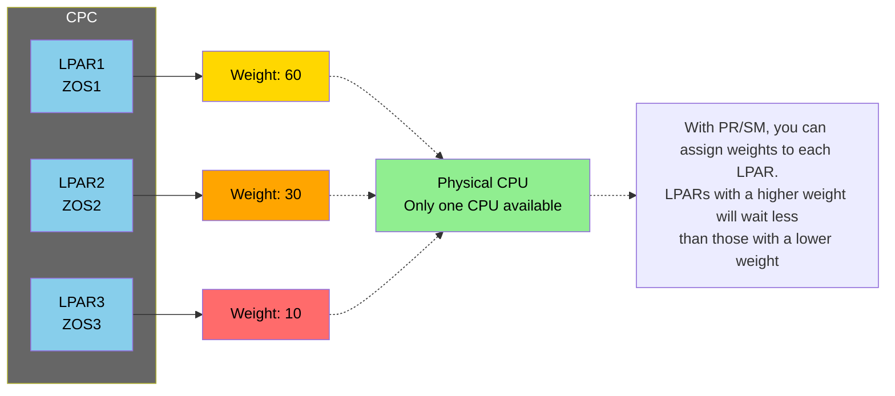

#### 가중치와 워크로드

LPAR가 공유 프로세서를 기다리는 것은 다른 LPAR가 사용 중일 때만입니다. 다른 LPAR가 CPU를 사용하지 않으면, 가중치가 낮은 LPAR도 전혀 기다릴 필요가 없습니다.

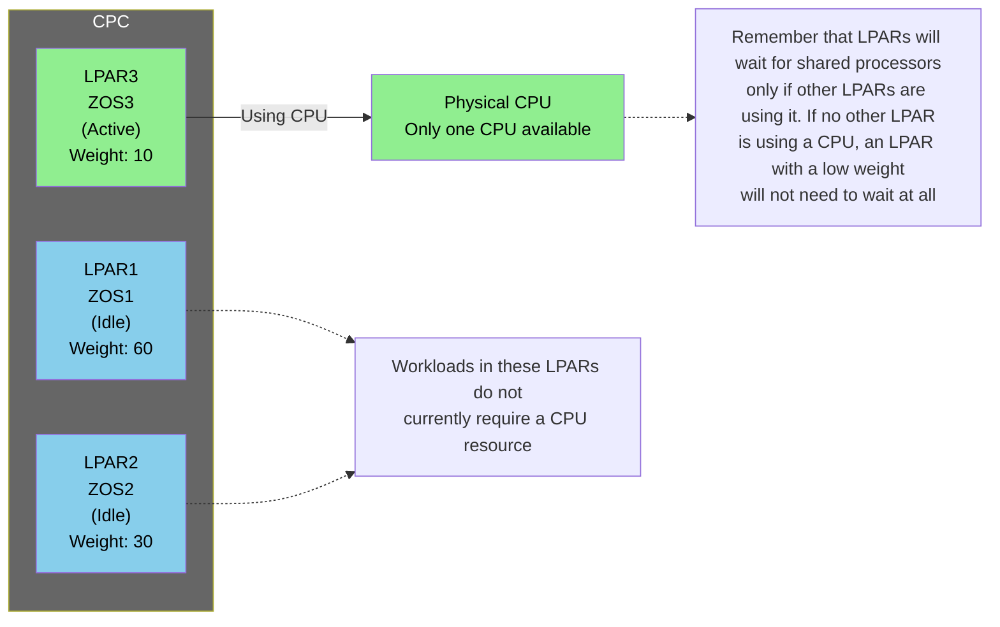

### PR/SM and CPU Types

PR/SM 프로세서 공유는 메인프레임의 다양한 유형의 프로세서에 대해 작동합니다. 여기에는 다음 유형의 CPU가 포함됩니다:

- **General purpose (GP) processors** (일반 목적 프로세서), 때로는 중앙 프로세서 또는 CP라고도 함
- **zIIP** - GP에서 작업 오프로딩
- **IFL** - Linux on IBM Z
- **ICF** - Coupling Facility용

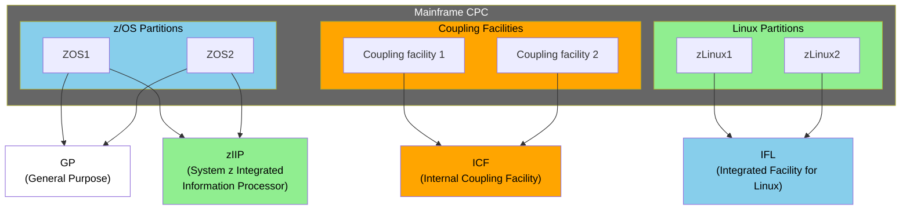

#### CPU 유형별 용도

- **GP (General Purpose)**: z/OS 시스템의 일반적인 처리 작업
- **zIIP**: z/OS에서 특정 작업(예: DB2, XML 처리)을 GP에서 오프로딩
- **IFL**: Linux on IBM Z 전용 프로세서
- **ICF**: Coupling Facility 전용 프로세서

### System Recovery Boost

z15 메인프레임 출시 이후, **System Recovery Boost** 기능이 선택적 기능으로 추가되어 셧다운 기간 동안 또는 시스템이 IPL되는 동안 임시 zIIP 용량을 활용하여 복구 시간을 단축하고 다운타임을 최소화할 수 있습니다. 이 기능은 z16 및 z17 메인프레임에서도 계속 지원됩니다.

이 추가 zIIP 용량은 PR/SM 관리 제어에 따라 LPAR 간에 공유됩니다. 운영 체제가 부스트 기간 동안 이를 사용하려면 LPAR가 PR/SM 이미지 프로필에 미리 정의된 예약된 논리적 zIIP 용량으로 구성되어 있어야 합니다.

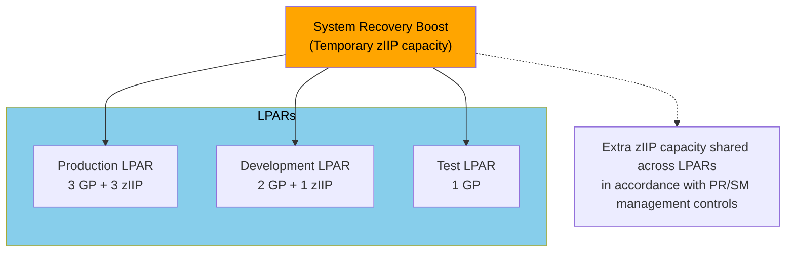

#### System Recovery Boost의 특징

- **목적**: 복구 시간 단축 및 다운타임 최소화
- **활성화 시기**: 셧다운 기간 또는 시스템 IPL 중
- **리소스**: 임시 zIIP 용량
- **요구사항**: LPAR에 예약된 논리적 zIIP 용량이 PR/SM 이미지 프로필에 정의되어 있어야 함

### Channel Sharing

PR/SM LPAR는 **Multiple Image Facility (MIF)**를 사용하여 채널을 공유할 수 있습니다. 이는 외부 장치에 연결된 물리적 채널 수를 줄입니다.

각 LPAR는 각 채널에 대한 독점적 액세스를 가지고 있는 것처럼 작동합니다. 그러나 PR/SM은 이러한 시스템이 각 채널을 공유하도록 처리합니다.

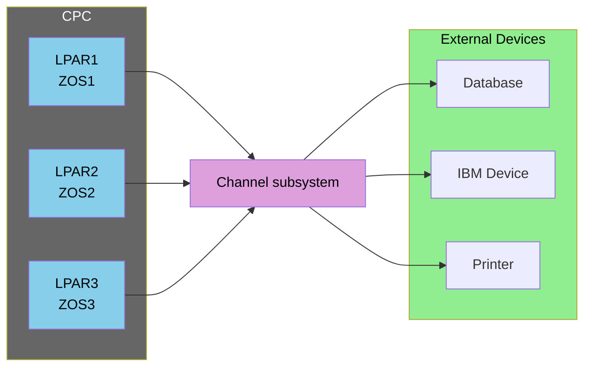

#### Channel Sharing의 이점

- **물리적 채널 수 감소**: 여러 LPAR가 동일한 물리적 채널을 공유
- **비용 절감**: 필요한 물리적 채널 하드웨어 감소
- **투명성**: 각 LPAR는 독점적 액세스를 가지고 있다고 인식

### Open System Adapter Sharing

채널과 마찬가지로, **Open System Adapters (OSAs)**는 LPAR 간에 공유될 수 있습니다. 다시 말해, 각 LPAR는 OSA에 대한 독점적 액세스를 가지고 있다고 믿습니다.

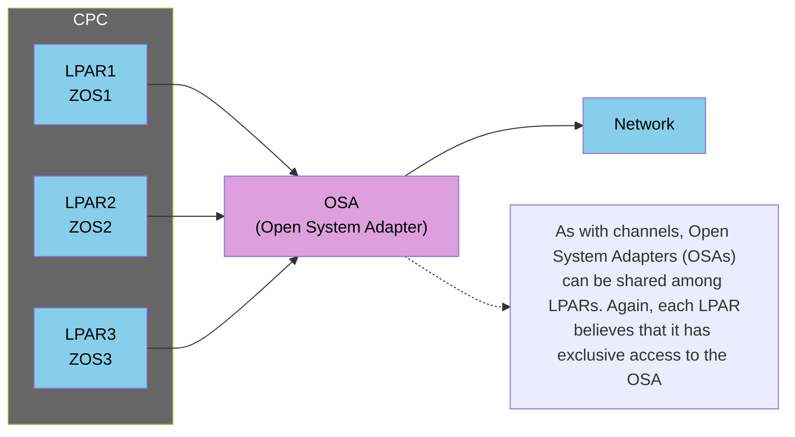

#### OSA Sharing의 특징

- **네트워크 연결 공유**: 여러 LPAR가 동일한 OSA를 통해 네트워크에 접근
- **투명성**: 각 LPAR는 OSA에 대한 독점적 액세스를 가지고 있다고 인식
- **효율성**: 물리적 OSA 하드웨어 수 감소

### Introducing z/VM

**z/VM**은 하이퍼바이저로 사용할 수 있는 IBM 운영 체제입니다. 다른 운영 체제와 마찬가지로 PR/SM 아래의 LPAR에서 작동합니다. 그러나 z/VM은 게스트 또는 다른 운영 체제를 호스팅할 수 있습니다.

많은 사용자가 z/VM을 사용하여 Linux on IBM Z 파티션을 호스팅합니다.

z/VM은 게스트 간에 CPU, 메모리, 채널, OSA 공유를 포함하여 PR/SM과 동일한 많은 기능을 제공합니다.

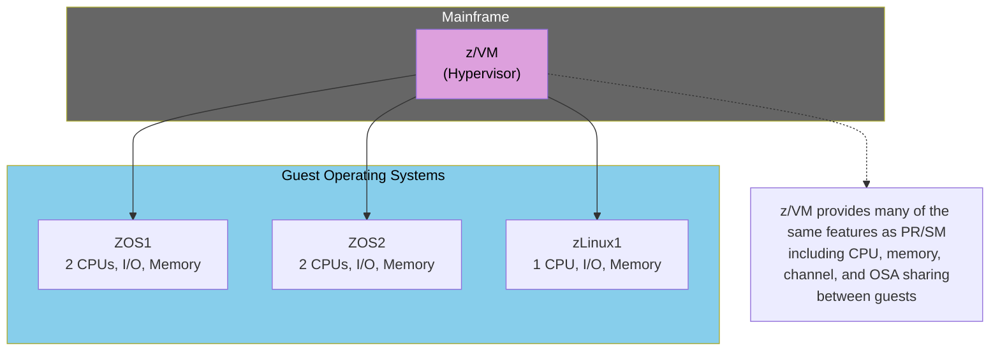

#### z/VM의 특징

- **하이퍼바이저 기능**: PR/SM 아래의 LPAR에서 실행되면서 다른 운영 체제를 호스팅
- **게스트 운영 체제 지원**: z/OS, Linux on IBM Z 등
- **리소스 공유**: CPU, 메모리, 채널, OSA를 게스트 간에 공유
- **주요 용도**: Linux on IBM Z 파티션 호스팅

#### PR/SM vs z/VM

| 특징 | PR/SM | z/VM |
|------|-------|------|
| **위치** | 펌웨어/하이퍼바이저 | 운영 체제 |
| **설치** | 메인프레임에 사전 설치 | LPAR에 설치 |
| **용도** | LPAR 관리 및 리소스 공유 | 게스트 운영 체제 호스팅 |
| **게스트 지원** | 없음 (LPAR 수준) | 있음 (게스트 운영 체제) |

### Summary

이 섹션에서는 하나의 CPC가 동시에 여러 운영 체제 이미지를 실행할 수 있음을 확인했습니다. 메인프레임 기능인 PR/SM은 각 LPAR가 CPU, 메모리, 채널, OSA 연결을 포함한 리소스를 공유할 수 있도록 합니다.

#### 주요 학습 내용

1. **하나의 CPC, 여러 시스템**
   - 하나의 CPC에서 여러 운영 체제 이미지 실행 가능
   - z/OS, z/VM, z/TPF, Linux on IBM Z, KVM, Secure Service Container 등 지원

2. **PR/SM (Processor Resource / System Manager)**
   - IBM Z 메인프레임에 사전 설치된 하이퍼바이저
   - CPC를 논리적 파티션(LPAR)으로 분할
   - z16 및 z17 메인프레임은 최대 85개의 LPAR 지원
   - z17은 Telum II 프로세서와 IBM Z 통합 AI 가속기를 지원

3. **리소스 공유**
   - **메모리**: LPAR 간에 분할, 각 LPAR는 자체 메모리 영역 보유
   - **CPU**: 물리적 또는 논리적 CPU 공유
     - 물리적 CPU 공유: 각 LPAR에 전용 CPU 할당
     - 논리적 CPU 공유: 여러 LPAR가 물리적 CPU를 공유, 가중치 기반 할당 가능
   - **채널**: Multiple Image Facility (MIF)를 통한 채널 공유
   - **OSA**: Open System Adapter 공유

4. **CPU 유형**
   - GP (General Purpose): 일반 목적 프로세서
   - zIIP: 작업 오프로딩용
   - IFL: Linux on IBM Z용
   - ICF: Coupling Facility용

5. **System Recovery Boost**
   - z15 이후 추가된 기능
   - 복구 시간 단축을 위한 임시 zIIP 용량 제공

6. **z/VM**
   - 하이퍼바이저로 사용 가능한 운영 체제
   - PR/SM 아래의 LPAR에서 실행되면서 게스트 운영 체제 호스팅
   - 주로 Linux on IBM Z 파티션 호스팅에 사용

::: tip One CPC, Multiple Systems 요약

하나의 CPC는 여러 운영 체제 이미지를 동시에 실행할 수 있습니다. PR/SM은 이러한 시스템이 CPU, 메모리, 채널, OSA 연결과 같은 리소스를 공유할 수 있도록 합니다. z16 및 z17 메인프레임은 최대 85개의 LPAR를 지원하며, z17은 Telum II 프로세서와 IBM Z 통합 AI 가속기를 통해 향상된 AI 기능을 제공합니다. 다음 섹션에서는 다른 리소스 공유가 가능한 방법을 탐구합니다.

:::

## Resource Sharing Between z/OS

### Introduction

많은 메인프레임 사용자는 하나 이상의 z/OS 시스템을 실행합니다. 이러한 시스템들은 같은 CPC에 있을 수도 있고, 서로 다른 CPC에 있을 수도 있습니다. 이를 통해 사용 가능한 처리 능력을 증가시키고, 한 시스템이 실패할 경우 복원력을 제공할 수 있습니다.

종종 이러한 z/OS 시스템들은 CPC 메모리, 채널, CPU 이외의 다른 리소스를 공유해야 합니다.

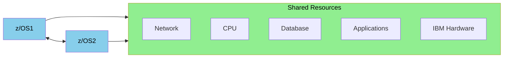

### Sysplex

리소스를 공유해야 하는 여러 z/OS 시스템은 **IBM sysplex 기술**을 사용합니다. 이 클러스터링 기술은 채널을 사용하여 최대 32개의 z/OS 이미지를 연결하며, 일반적으로 통신을 위해 coupling facility를 사용합니다.

일부 사이트는 여러 sysplex를 가질 수 있습니다. 예를 들어, 프로덕션용 sysplex 하나와 개발용 sysplex 하나를 가질 수 있습니다.

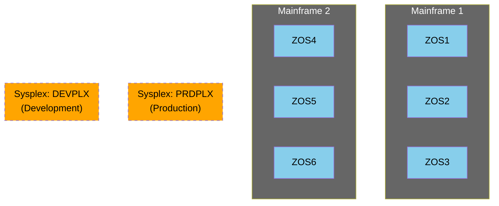

#### Sysplex의 특징

- **최대 32개 z/OS 이미지 연결**: 채널을 사용하여 연결
- **Coupling Facility 사용**: 일반적으로 통신을 위해 coupling facility 사용
- **여러 Sysplex 구성 가능**: 프로덕션, 개발 등 목적에 따라 분리 가능
- **서로 다른 CPC에 위치 가능**: 같은 CPC 또는 다른 CPC에 있을 수 있음

### XCF

**XCF (Cross-System Coupling Facility)**는 sysplex 내의 태스크 간 통신을 제공합니다.

XCF는 z/OS 시스템의 태스크가 다른 태스크와 통신할 수 있도록 서비스를 제공합니다. 이 통신은 같은 z/OS 시스템 내에서 발생할 수도 있고, 같은 sysplex 내의 다른 z/OS 시스템에서 발생할 수도 있습니다.

많은 시스템이 이 통신에 의존하여 공유 및 기타 sysplex 서비스를 제공합니다.

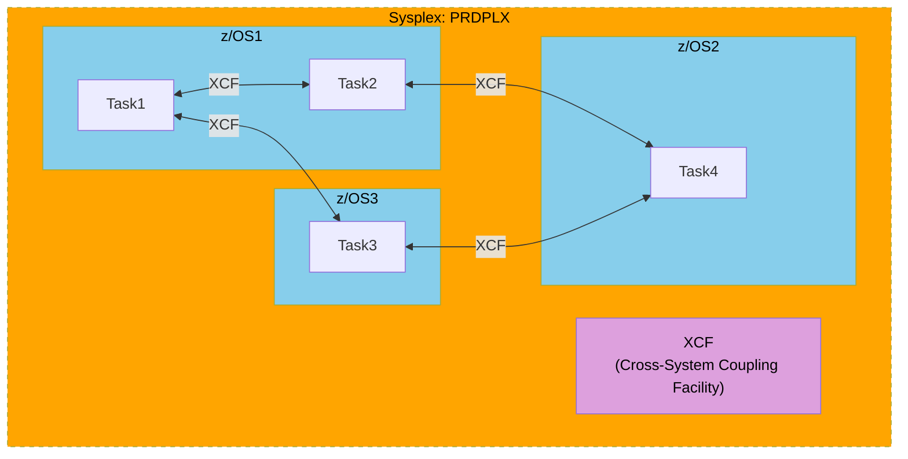

#### XCF의 기능

- **태스크 간 통신**: 같은 z/OS 시스템 내 또는 다른 z/OS 시스템 간
- **Sysplex 서비스 지원**: 공유 및 기타 sysplex 서비스 제공
- **투명한 통신**: 태스크는 통신이 같은 시스템 내에서 발생하는지 다른 시스템에서 발생하는지 알 필요 없음

### Time

Sysplex에서는 각 z/OS 시스템이 동일한 시간을 가져야 합니다. ZOS1이 12:00라고 생각하고, ZOS2가 12:02라고 생각하고, ZOS3이 11:58이라고 생각하면, 리소스 공유, 공통 로그 표시 및 기타 내부 기능에 문제가 발생할 수 있습니다.

이를 해결하기 위해 IBM Z 메인프레임은 채널 링크를 통해 통신하고 올바른 시간에 동의합니다. 이것은 **Server Time Protocol (STP)**라는 프로토콜을 사용하여 수행됩니다.

STP는 IBM Z 메인프레임의 하드웨어 클록을 동기화합니다. 또한 외부 클록과도 동기화할 수 있어 메인프레임이 비메인프레임 서버와 시간을 조정할 수 있습니다.

```mermaid
flowchart TB
    ExternalTime["External time server"]
    
    subgraph Mainframe1["Mainframe 1"]
        PRSM1["PR/SM"]
        ZOS1["z/OS1"]
        ZOS3["z/OS3"]
    end
    
    subgraph Mainframe2["Mainframe 2"]
        PRSM2["PR/SM"]
        ZOS2["z/OS2"]
    end
    
    ExternalTime -->|STP| PRSM1
    ExternalTime -->|STP| PRSM2
    PRSM1 <-->|STP| PRSM2
    
    PRSM1 --> ZOS1
    PRSM1 --> ZOS3
    PRSM2 --> ZOS2
    
    style ExternalTime fill:#ff6b6b,color:#000
    style Mainframe1 fill:#666,color:#fff
    style Mainframe2 fill:#666,color:#fff
    style PRSM1 fill:#dda0dd,color:#000
    style PRSM2 fill:#dda0dd,color:#000
    style ZOS1 fill:#87ceeb,color:#000
    style ZOS2 fill:#87ceeb,color:#000
    style ZOS3 fill:#87ceeb,color:#000
```

#### STP (Server Time Protocol)의 특징

- **하드웨어 클록 동기화**: IBM Z 메인프레임의 하드웨어 클록을 동기화
- **외부 클록 지원**: 외부 시간 서버와 동기화 가능
- **채널 링크 사용**: 채널 링크를 통해 통신
- **비메인프레임 서버와 조정**: 비메인프레임 서버와도 시간 조정 가능

### Coupling Facility

**기본 Sysplex (Basic Sysplex)**는 여러 z/OS 시스템이 채널만 사용하여 통신하는 경우입니다.

대부분의 sysplex는 하나 이상의 **Coupling Facility**를 가지며, z/OS 및 관련 서브시스템이 리소스 공유를 위한 공통 메모리로 사용합니다. 이러한 sysplex를 **Parallel Sysplex**라고 합니다.

이러한 coupling facility는 다양한 서브시스템에서 다양한 방식으로 사용되어 리소스 공유를 지원할 수 있습니다.

```mermaid
flowchart LR
    subgraph ZOS1["z/OS1"]
        Task1["Task1"]
        Task2["Task2"]
    end
    
    subgraph ZOS2["z/OS2"]
        Task3["Task3"]
    end
    
    subgraph ZOS3["z/OS3"]
        Task4["Task4"]
    end
    
    CF["Coupling Facility<br/>(Common Memory)"]
    
    ZOS1 -->|Coupling Channels| CF
    ZOS2 -->|Coupling Channels| CF
    ZOS3 -->|Coupling Channels| CF
    
    CF --> ZOS1
    CF --> ZOS2
    CF --> ZOS3
    
    style ZOS1 fill:#87ceeb,color:#000
    style ZOS2 fill:#87ceeb,color:#000
    style ZOS3 fill:#87ceeb,color:#000
    style CF fill:#ffa500,color:#000
```

#### Basic Sysplex vs Parallel Sysplex

| 특징 | Basic Sysplex | Parallel Sysplex |
|------|--------------|------------------|
| **통신 방법** | 채널만 사용 | 채널 + Coupling Facility |
| **Coupling Facility** | 없음 | 하나 이상 사용 |
| **공유 메모리** | 없음 | Coupling Facility를 통한 공유 메모리 |
| **리소스 공유** | 제한적 | 향상된 리소스 공유 |

#### Coupling Facility의 용도

- **공통 메모리**: z/OS 및 관련 서브시스템이 리소스 공유를 위한 공통 메모리로 사용
- **다양한 서브시스템 지원**: 다양한 서브시스템에서 다양한 방식으로 사용
- **리소스 공유 지원**: 리소스 공유를 지원하는 핵심 구성 요소

### Serialization

XCF, STP, coupling facility를 통해 z/OS는 리소스를 공유하거나 sysplex 주변에서 통신해야 하는 태스크를 위한 추가 서비스를 제공할 수 있습니다.

가장 자주 사용되는 것 중 하나는 **enqueue (ENQ)**입니다. 태스크가 리소스를 직렬화하는 데 사용됩니다. Sysplex에서 enqueue는 모든 z/OS 시스템에서 볼 수 있습니다.

#### Enqueue (ENQ)의 개념

태스크는 enqueue를 요청할 수 있습니다. 이 enqueue는 두 개의 이름을 가집니다:
- **QName (Queue Name)**: 주요 이름 (Major name)
- **RName (Resource Name)**: 부 이름 (Minor name)

```mermaid
flowchart LR
    subgraph ZOS1["z/OS1"]
        Task1["Task1"]
    end
    
    ENQ["ENQ<br/>QNAME: RES1<br/>RNAME: AAAA"]
    
    Task1 -->|"Request ENQ"| ENQ
    
    Note1["A task can request an enqueue.<br/>This enqueue has two names,<br/>a major name (QName) and<br/>a minor name (RName)"]
    
    ENQ -.-> Note1
    
    style ZOS1 fill:#87ceeb,color:#000
    style ENQ fill:#90ee90,color:#000
```

#### Enqueue의 작동 방식

Enqueue는 실제 리소스와의 연결이 없습니다. z/OS에게는 단순히 QName과 RName이며, 한 번에 하나의 태스크만 보유할 수 있습니다.

##### 1. Enqueue 획득

다른 태스크(Task2)가 이미 enqueue를 획득한 경우, enqueue 요청이 실패합니다. 태스크(Task1)는 대기하거나 다른 처리를 수행할 수 있습니다.

```mermaid
flowchart LR
    subgraph ZOS1["z/OS1"]
        Task1["Task1<br/>(Failed)"]
        Task2["Task2<br/>(Holding ENQ)"]
    end
    
    ENQ["ENQ<br/>QNAME: RES1<br/>RNAME: AAAA"]
    
    Task2 -->|"Holding"| ENQ
    Task1 -.->|"Failed"| ENQ
    
    Note1["If another task (Task2) has already<br/>obtained the enqueue, the enqueue fails.<br/>The task (Task1) can choose to wait,<br/>or do other processing"]
    
    ENQ -.-> Note1
    
    style ZOS1 fill:#87ceeb,color:#000
    style Task1 fill:#ff6b6b,color:#000
    style Task2 fill:#90ee90,color:#000
    style ENQ fill:#90ee90,color:#000
```

##### 2. Enqueue 해제

태스크가 더 이상 enqueue가 필요하지 않으면 해제합니다. 다른 태스크가 이제 enqueue를 획득할 수 있습니다.

```mermaid
flowchart LR
    subgraph ZOS1["z/OS1"]
        Task1["Task1<br/>(Holding ENQ)"]
        Task2["Task2<br/>(Ready)"]
    end
    
    ENQ["ENQ<br/>QNAME: RES1<br/>RNAME: AAAA"]
    
    Task1 -->|"Holding"| ENQ
    Task2 -.->|"Waiting"| ENQ
    
    Note1["When the task no longer needs<br/>the enqueue, it releases it.<br/>Other tasks can now obtain the enqueue"]
    
    ENQ -.-> Note1
    
    style ZOS1 fill:#87ceeb,color:#000
    style Task1 fill:#90ee90,color:#000
    style Task2 fill:#ffa500,color:#000
    style ENQ fill:#90ee90,color:#000
```

#### Enqueue 사용 예시

##### 단일 z/OS 시스템 내에서

Enqueue는 하나의 z/OS 시스템 내에서 리소스를 직렬화하는 데 사용될 수 있습니다.

```mermaid
flowchart LR
    subgraph ZOS1["z/OS1"]
        Task1["Task1"]
        Task2["Task2"]
    end
    
    ENQ["ENQ<br/>QNAME: RES1<br/>RNAME: AAAA"]
    
    Task1 --> ENQ
    
    Note1["Enqueues can be used to serialize<br/>resources in one z/OS system"]
    
    ENQ -.-> Note1
    
    style ZOS1 fill:#87ceeb,color:#000
    style ENQ fill:#90ee90,color:#000
```

##### 여러 z/OS 시스템 간에서

Enqueue는 sysplex 내의 여러 z/OS 시스템 간에 리소스를 직렬화하는 데도 사용될 수 있으며, 서로 다른 CPC에 있어도 가능합니다.

```mermaid
flowchart LR
    subgraph Sysplex["Sysplex: PRDPLX"]
        subgraph ZOS1["z/OS1"]
            Task1["Task1"]
        end
        
        subgraph ZOS2["z/OS2"]
            Task2["Task2"]
        end
        
        ENQ["ENQ<br/>QNAME: RES1<br/>RNAME: AAAA"]
    end
    
    Task1 --> ENQ
    Task2 -.-> ENQ
    
    Note1["Enqueues can also be used to serialize<br/>resources in multiple z/OS systems in a sysplex,<br/>even if they are on different CPCs"]
    
    ENQ -.-> Note1
    
    style Sysplex fill:#ffa500,color:#000,stroke-dasharray: 5 5
    style ZOS1 fill:#87ceeb,color:#000
    style ZOS2 fill:#87ceeb,color:#000
    style ENQ fill:#90ee90,color:#000
```

#### z/OS의 Enqueue 사용

z/OS 자체도 enqueue를 사용합니다. 예를 들어, QName **SYSDSN**은 데이터셋에 대한 액세스를 직렬화하는 데 사용됩니다. RName은 데이터셋 이름입니다.

```mermaid
flowchart LR
    subgraph ZOS1["z/OS1"]
        Task4["Task4"]
        Task5["Task5"]
    end
    
    ENQ["ENQ<br/>QNAME: SYSDSN<br/>RNAME: MY.DSNAME"]
    
    Task4 --> ENQ
    
    Note1["z/OS itself uses enqueues.<br/>For example, the QName SYSDSN is used<br/>to serialize access to data sets.<br/>The RName is the data set name"]
    
    ENQ -.-> Note1
    
    style ZOS1 fill:#87ceeb,color:#000
    style ENQ fill:#90ee90,color:#000
```

### z/OS Sharing Facilities

z/OS 구성 요소는 STP, coupling facility, XCF, ENQ를 기반으로 더 많은 공유 옵션과 기능을 제공합니다. 여기서는 그 중 일부를 나열합니다.

#### Data Sets

데이터셋은 서로 다른 z/OS 시스템의 태스크 간에 공유될 수 있습니다. z/OS는 이러한 데이터셋에 대한 액세스를 직렬화하기 위해 enqueue를 사용합니다.

데이터셋은 한 번에 하나의 태스크만 액세스할 수 있도록 정의되거나, 동시에 여러 태스크가 액세스할 수 있도록 정의될 수 있습니다. 예를 들어, 데이터셋은 한 번에 하나의 태스크만 업데이트할 수 있지만, 동시에 여러 태스크가 읽을 수 있도록 정의될 수 있습니다.

```mermaid
flowchart LR
    subgraph ZOS1["z/OS1"]
        Task1["Task1"]
    end
    
    subgraph ZOS2["z/OS2"]
        Task2["Task2"]
    end
    
    DataSets["Data Sets<br/>(Shared)"]
    
    Task1 --> DataSets
    Task2 --> DataSets
    
    Note1["Data sets can be shared between tasks<br/>in different z/OS systems. z/OS uses enqueues<br/>to serialize access to these data sets"]
    
    DataSets -.-> Note1
    
    style ZOS1 fill:#87ceeb,color:#000
    style ZOS2 fill:#87ceeb,color:#000
    style DataSets fill:#90ee90,color:#000
```

#### JES (Job Entry Subsystem)

JES 서브시스템은 여러 z/OS 시스템에 의해 공유될 수 있습니다. JES spool은 서로 다른 서브시스템의 태스크에 의해 읽고 쓸 수 있습니다. 한 z/OS 시스템에서 제출된 배치 작업이 다른 시스템에서 자동으로 실행될 수 있습니다.

```mermaid
flowchart LR
    subgraph ZOS1["z/OS1"]
        Task1["Task1"]
    end
    
    subgraph ZOS2["z/OS2"]
        Task2["Task2"]
    end
    
    JES["JES<br/>(Job Entry Subsystem)"]
    
    Task1 --> JES
    Task2 --> JES
    
    Note1["A JES subsystem can be shared by<br/>multiple z/OS systems. JES spool can be<br/>read and written by tasks on different subsystems"]
    
    JES -.-> Note1
    
    style ZOS1 fill:#87ceeb,color:#000
    style ZOS2 fill:#87ceeb,color:#000
    style JES fill:#90ee90,color:#000
```

#### VSAM Records

데이터셋은 공유될 수 있지만, 일반적으로 한 번에 하나의 태스크만 데이터셋을 업데이트할 수 있습니다. 그러나 **VSAM Record-Level Sharing (RLS)**을 사용하면 여러 태스크가 동시에 VSAM 데이터셋을 업데이트할 수 있습니다.

RLS는 데이터셋 레벨이 아닌 레코드 레벨에서 직렬화를 수행합니다. 따라서 한 태스크가 하나의 레코드를 업데이트하는 동안 두 번째 태스크가 다른 레코드를 동시에 업데이트할 수 있습니다.

```mermaid
flowchart LR
    subgraph ZOS1["z/OS1"]
        Task1["Task1"]
    end
    
    subgraph ZOS2["z/OS2"]
        Task2["Task2"]
    end
    
    VSAM["VSAM Records<br/>(Record-Level Sharing)"]
    
    Task1 --> VSAM
    Task2 --> VSAM
    
    Note1["VSAM record-level sharing (RLS) allows<br/>multiple tasks to update a VSAM data set at a time.<br/>RLS performs serialization at the record level"]
    
    VSAM -.-> Note1
    
    style ZOS1 fill:#87ceeb,color:#000
    style ZOS2 fill:#87ceeb,color:#000
    style VSAM fill:#90ee90,color:#000
```

#### Security

RACF 및 Broadcom의 ACF2와 같은 z/OS 보안 소프트웨어는 z/OS 시스템 간에 공유될 수 있습니다. Sysplex의 모든 시스템이 하나의 보안 데이터베이스를 공유하므로 동일한 보안 규칙을 가집니다.

한 z/OS 시스템에서 규칙이 변경되거나 새 사용자가 추가되면, 해당 변경 사항은 다른 모든 z/OS 시스템에서도 볼 수 있습니다.

```mermaid
flowchart LR
    subgraph ZOS1["z/OS1"]
        Task1["Task1"]
    end
    
    subgraph ZOS2["z/OS2"]
        Task2["Task2"]
    end
    
    Security["Security<br/>(RACF, ACF2)"]
    
    Task1 --> Security
    Task2 --> Security
    
    Note1["z/OS security software such as RACF and<br/>Broadcom's ACF2 can be shared amongst z/OS systems.<br/>All systems in a sysplex can share the one security database"]
    
    Security -.-> Note1
    
    style ZOS1 fill:#87ceeb,color:#000
    style ZOS2 fill:#87ceeb,color:#000
    style Security fill:#90ee90,color:#000
```

#### Logs

많은 시스템 로그 활동이 시작될 수 있습니다. 예를 들어, z/OS는 Operlog에 오류 메시지 및 기타 작업을 기록합니다. 마찬가지로 WebSphere Application Server는 로그에 오류 메시지를 기록합니다.

z/OS는 이러한 로그에 대한 logstream을 제공하며, 이는 서로 다른 z/OS 시스템의 여러 태스크에 의해 공유될 수 있습니다. 따라서 두 개의 WebSphere Application Server 태스크가 서로 다른 z/OS 시스템에 있어도 동일한 logstream에 쓸 수 있습니다. 이는 문제 해결을 더 쉽게 만들 수 있습니다.

```mermaid
flowchart LR
    subgraph ZOS1["z/OS1"]
        Task1["Task1<br/>(WebSphere)"]
    end
    
    subgraph ZOS2["z/OS2"]
        Task2["Task2<br/>(WebSphere)"]
    end
    
    Logs["Logs<br/>(Logstreams)"]
    
    Task1 --> Logs
    Task2 --> Logs
    
    Note1["z/OS provides logstreams for these logs,<br/>that can be shared by multiple tasks in different z/OS systems.<br/>So, two WebSphere Application Server tasks could<br/>both write to the same logstream"]
    
    Logs -.-> Note1
    
    style ZOS1 fill:#87ceeb,color:#000
    style ZOS2 fill:#87ceeb,color:#000
    style Logs fill:#90ee90,color:#000
```

#### Tape Drive

테이프 드라이브는 여러 z/OS 태스크에 의해 공유될 수 있습니다. 태스크가 테이프 드라이브가 필요할 때, 작업이 완료될 때까지 드라이브에 대한 독점적 액세스가 제공됩니다. 그런 다음 테이프 드라이브는 다른 태스크가 사용할 수 있게 됩니다.

```mermaid
flowchart LR
    subgraph ZOS1["z/OS1"]
        Task1["Task1"]
    end
    
    subgraph ZOS2["z/OS2"]
        Task2["Task2"]
    end
    
    TapeDrive["Tape Drive"]
    
    Task1 --> TapeDrive
    Task2 --> TapeDrive
    
    Note1["Tape drives can be shared by multiple z/OS tasks.<br/>When a task requires a tape drive, it is given<br/>exclusive access to the drive until the operation is completed"]
    
    TapeDrive -.-> Note1
    
    style ZOS1 fill:#87ceeb,color:#000
    style ZOS2 fill:#87ceeb,color:#000
    style TapeDrive fill:#90ee90,color:#000
```

### Other Sharing Facilities

z/OS만이 공유를 위해 sysplex 기능을 사용하는 것은 아닙니다. 데이터베이스 서버, 트랜잭션 관리자, 메시징 시스템을 포함한 다른 시스템도 sysplex 기능을 사용합니다.

#### CICS

CICS 영역은 리소스를 공유할 수 있습니다. 이미 VSAM RLS를 사용하여 서로 다른 태스크가 VSAM 데이터셋을 공유하는 방법을 살펴봤습니다. CICS는 또한 임시 저장소 큐, coupling facility 데이터셋이라고 하는 데이터 공간, named counter라고 하는 카운터를 공유하는 기능을 제공합니다.

CICSPlex에서 CICS 영역은 들어오는 워크로드를 공유할 수도 있으며, 들어오는 작업을 그들 사이에서 나눕니다.

```mermaid
flowchart LR
    subgraph ZOS1["z/OS1"]
        Task1["Task1<br/>(CICS)"]
    end
    
    subgraph ZOS2["z/OS2"]
        Task2["Task2<br/>(CICS)"]
    end
    
    CICS["CICS<br/>(CICSPlex)"]
    
    Task1 --> CICS
    Task2 --> CICS
    
    Note1["CICS regions can share resources.<br/>CICS also provides features to share temporary storage queues,<br/>data spaces that are called coupling facility data sets,<br/>and counters that are called named counters"]
    
    CICS -.-> Note1
    
    style ZOS1 fill:#87ceeb,color:#000
    style ZOS2 fill:#87ceeb,color:#000
    style CICS fill:#90ee90,color:#000
```

#### Db2

Db2 리소스는 여러 Db2 서브시스템에 의해 공유될 수 있습니다. 이를 통해 sysplex의 서로 다른 z/OS 시스템에 있는 태스크가 Db2 데이터를 공유할 수 있습니다. 이것은 **Db2 data sharing group**을 사용하여 수행됩니다.

```mermaid
flowchart LR
    subgraph ZOS1["z/OS1"]
        Task1["Task1"]
    end
    
    subgraph ZOS2["z/OS2"]
        Task2["Task2"]
    end
    
    DB2["Db2<br/>(Data Sharing Group)"]
    
    Task1 --> DB2
    Task2 --> DB2
    
    Note1["Db2 resources can be shared by multiple Db2 subsystems.<br/>This allows tasks on different z/OS systems in a sysplex<br/>to share Db2 data. This is done using a Db2 data sharing group"]
    
    DB2 -.-> Note1
    
    style ZOS1 fill:#87ceeb,color:#000
    style ZOS2 fill:#87ceeb,color:#000
    style DB2 fill:#90ee90,color:#000
```

#### IMS TM (Transaction Manager)

IMS Transaction Manager (IMS TM) 큐는 서로 다른 IMS 서브시스템 간에 공유될 수 있습니다. 이를 통해 여러 IMS 서브시스템이 워크로드를 공유할 수 있습니다.

```mermaid
flowchart LR
    subgraph ZOS1["z/OS1"]
        Task1["Task1"]
    end
    
    subgraph ZOS2["z/OS2"]
        Task2["Task2"]
    end
    
    IMSTM["IMS TM<br/>(Transaction Manager)"]
    
    Task1 --> IMSTM
    Task2 --> IMSTM
    
    Note1["IMS Transaction Manager (IMS TM) queues can be shared<br/>between different IMS subsystems. This allows multiple<br/>IMS subsystems to share workloads"]
    
    IMSTM -.-> Note1
    
    style ZOS1 fill:#87ceeb,color:#000
    style ZOS2 fill:#87ceeb,color:#000
    style IMSTM fill:#90ee90,color:#000
```

#### IMS DB (Database)

IMS 데이터베이스는 같은 또는 서로 다른 z/OS 시스템의 IMS 서브시스템 간에 공유될 수 있습니다.

```mermaid
flowchart LR
    subgraph ZOS1["z/OS1"]
        Task1["Task1"]
    end
    
    subgraph ZOS2["z/OS2"]
        Task2["Task2"]
    end
    
    IMSDB["IMS DB<br/>(Database)"]
    
    Task1 --> IMSDB
    Task2 --> IMSDB
    
    Note1["IMS databases can be shared between IMS subsystems<br/>in the same or different z/OS systems"]
    
    IMSDB -.-> Note1
    
    style ZOS1 fill:#87ceeb,color:#000
    style ZOS2 fill:#87ceeb,color:#000
    style IMSDB fill:#90ee90,color:#000
```

#### IBM MQ

IBM MQ 큐는 같은 또는 서로 다른 z/OS 시스템의 MQ 큐 관리자 간에 공유될 수 있습니다. 이를 통해 여러 태스크가 동시에 같은 큐에서 가져오거나 같은 큐에 넣을 수 있습니다.

```mermaid
flowchart LR
    subgraph ZOS1["z/OS1"]
        Task1["Task1"]
    end
    
    subgraph ZOS2["z/OS2"]
        Task2["Task2"]
    end
    
    IBM_MQ["IBM MQ<br/>(Message Queuing)"]
    
    Task1 --> IBM_MQ
    Task2 --> IBM_MQ
    
    Note1["IBM MQ queues can be shared between MQ queue managers<br/>in the same or different z/OS systems. This allows multiple tasks<br/>to get from the same queue at the same time,<br/>or put onto the same queue"]
    
    IBM_MQ -.-> Note1
    
    style ZOS1 fill:#87ceeb,color:#000
    style ZOS2 fill:#87ceeb,color:#000
    style IBM_MQ fill:#90ee90,color:#000
```

### VTAM Logical Unit Sharing

z/OS 태스크는 네트워크 리소스도 공유할 수 있습니다. 예를 들어, **VTAM Logical Units (LUs)**를 공유할 수 있습니다.

#### VTAM LU의 개념

3270 사용자가 CICS 또는 TSO와 같은 애플리케이션에 로그온할 때, 애플리케이션의 VTAM logical unit (LU)에 로그온합니다. 이것은 때때로 **Application ID** 또는 줄여서 **APPLID**라고 불립니다.

```mermaid
flowchart TB
    User["3270 user"]
    Terminal["3270 Terminal"]
    
    Logon["Logon APPLID(APPL1)"]
    
    subgraph ZOS1["z/OS1"]
        App1["Application 1"]
    end
    
    User --> Terminal
    Terminal --> Logon
    Logon --> App1
    
    Note1["When a 3270 user logs onto an application like CICS or TSO,<br/>they logon to the application's VTAM logical unit (LU).<br/>This is sometimes called an application ID, or APPLID for short"]
    
    Logon -.-> Note1
    
    style User fill:#dda0dd,color:#000
    style Terminal fill:#d3d3d3,color:#000
    style Logon fill:#90ee90,color:#000
    style ZOS1 fill:#87ceeb,color:#000
    style App1 fill:#87ceeb,color:#000
```

#### VTAM Generic Resource

두 애플리케이션이 APPLID를 공유할 수 있습니다. 이것을 **VTAM generic resource**라고 합니다.

```mermaid
flowchart TB
    User["3270 user"]
    Terminal["3270 Terminal"]
    
    Logon["Logon APPLID(APPL1)"]
    
    subgraph ZOS1["z/OS1"]
        App1["Application 1"]
    end
    
    subgraph ZOS2["z/OS2"]
        App2["Application 2"]
    end
    
    User --> Terminal
    Terminal --> Logon
    Logon --> App1
    Logon --> App2
    
    Note1["Two applications can share an APPLID.<br/>This is called a VTAM generic resource"]
    
    Logon -.-> Note1
    
    style User fill:#dda0dd,color:#000
    style Terminal fill:#d3d3d3,color:#000
    style Logon fill:#90ee90,color:#000
    style ZOS1 fill:#87ceeb,color:#000
    style ZOS2 fill:#87ceeb,color:#000
    style App1 fill:#87ceeb,color:#000
    style App2 fill:#87ceeb,color:#000
```

#### 자동 라우팅

사용자는 어떤 애플리케이션에 로그온하는지 알 필요가 없습니다. 이것은 VTAM에 의해 결정됩니다.

```mermaid
flowchart TB
    User["3270 user"]
    Terminal["3270 Terminal"]
    
    Logon["Logon APPLID(APPL1)"]
    
    subgraph ZOS1["z/OS1"]
        App1["Application 1<br/>(Available)"]
    end
    
    subgraph ZOS2["z/OS2"]
        App2["Application 2<br/>(Unavailable)"]
    end
    
    User --> Terminal
    Terminal --> Logon
    Logon -->|"VTAM decides"| App1
    
    Note1["The user does not need to know which application<br/>they are logging onto. This is determined by VTAM"]
    
    Logon -.-> Note1
    
    style User fill:#dda0dd,color:#000
    style Terminal fill:#d3d3d3,color:#000
    style Logon fill:#90ee90,color:#000
    style ZOS1 fill:#87ceeb,color:#000
    style ZOS2 fill:#ff6b6b,color:#000
    style App1 fill:#90ee90,color:#000
    style App2 fill:#ff6b6b,color:#000
```

#### 고가용성

한 애플리케이션이 사용할 수 없으면, 사용자는 자동으로 작동 중인 애플리케이션으로 라우팅됩니다.

```mermaid
flowchart TB
    User["3270 user"]
    Terminal["3270 Terminal"]
    
    Logon["Logon APPLID(APPL1)"]
    
    subgraph ZOS1["z/OS1"]
        App1["Application 1<br/>(Available)"]
    end
    
    subgraph ZOS2["z/OS2"]
        App2["Application 2<br/>(Unavailable)"]
    end
    
    User --> Terminal
    Terminal --> Logon
    Logon -->|"Automatic routing"| App1
    
    Note1["If one application is unavailable,<br/>the user is automatically directed<br/>to the operational application"]
    
    Logon -.-> Note1
    
    style User fill:#dda0dd,color:#000
    style Terminal fill:#d3d3d3,color:#000
    style Logon fill:#90ee90,color:#000
    style ZOS1 fill:#87ceeb,color:#000
    style ZOS2 fill:#ff6b6b,color:#000
    style App1 fill:#90ee90,color:#000
    style App2 fill:#ff6b6b,color:#000
```

### Share TCP/IP

z/OS 애플리케이션은 VTAM generic resource와 유사한 방식으로 TCP/IP 포트를 공유할 수 있습니다.

#### TCP/IP 포트 리스닝

들어오는 TCP/IP 메시지를 서비스하는 태스크나 애플리케이션은 포트에서 리스닝합니다.

```mermaid
flowchart LR
    subgraph ZOS1["z/OS1"]
        App1["Application 1"]
    end
    
    Port["Port: 1556"]
    
    App1 -->|"Listening"| Port
    
    Note1["Tasks or applications that service incoming<br/>TCP/IP messages will listen on a port"]
    
    Port -.-> Note1
    
    style ZOS1 fill:#87ceeb,color:#000
    style App1 fill:#87ceeb,color:#000
    style Port fill:#ffb6c1,color:#000
```

#### 외부 태스크 연결

애플리케이션에 메시지를 보내는 외부 태스크는 서버의 TCP/IP 주소와 포트 번호를 지정합니다.

```mermaid
flowchart LR
    ExternalTask["External task"]
    
    Connection["IP address:<br/>FE80:0000:0000:0000:0100:B3FF:FE1E:8143<br/>Port: 1556"]
    
    subgraph ZOS1["z/OS1"]
        App1["Application 1"]
    end
    
    ExternalTask --> Connection
    Connection --> App1
    
    Note1["External tasks sending messages to an application<br/>specify the TCP/IP address of the server,<br/>and the port number"]
    
    Connection -.-> Note1
    
    style ExternalTask fill:#dda0dd,color:#000
    style Connection fill:#90ee90,color:#000
    style ZOS1 fill:#87ceeb,color:#000
    style App1 fill:#87ceeb,color:#000
```

z/OS의 TCP/IP는 들어오는 트래픽을 해당 포트에서 리스닝하는 애플리케이션으로 전송합니다.

#### 애플리케이션 간 포트 공유

z/OS 시스템에서 동일한 TCP/IP 서비스를 사용하는 두 개의 서로 다른 애플리케이션이 포트를 공유할 수 있습니다. 이를 통해 여러 애플리케이션이 들어오는 워크로드를 공유할 수 있습니다.

```mermaid
flowchart LR
    ExternalTask["External task"]
    
    Connection["IP address:<br/>FE80:0000:0000:0000:0100:B3FF:FE1E:8143<br/>Port: 1556"]
    
    subgraph ZOS1["z/OS1"]
        App1["Application 1"]
        App2["Application 2"]
    end
    
    ExternalTask --> Connection
    Connection --> App1
    Connection --> App2
    
    Note1["Two different applications using the same TCP/IP service<br/>on a z/OS system can share a port.<br/>This allows multiple applications to share incoming workloads"]
    
    Connection -.-> Note1
    
    style ExternalTask fill:#dda0dd,color:#000
    style Connection fill:#90ee90,color:#000
    style ZOS1 fill:#87ceeb,color:#000
    style App1 fill:#87ceeb,color:#000
    style App2 fill:#87ceeb,color:#000
```

#### 여러 z/OS 시스템 간 주소 공유

여러 z/OS 시스템이 동일한 TCP/IP 주소를 공유할 수 있습니다. 외부 태스크가 이 특수 TCP/IP 주소를 지정하면, 두 z/OS 시스템 중 하나로 라우팅될 수 있습니다.

```mermaid
flowchart TB
    ExternalTask["External task"]
    
    Connection["IP address:<br/>FE80:0000:0000:0000:0100:B3FF:FE1E:8143<br/>Port: 1556"]
    
    subgraph ZOS1["z/OS1"]
        App1["Application 1"]
    end
    
    subgraph ZOS2["z/OS2"]
        App2["Application 2"]
    end
    
    ExternalTask --> Connection
    Connection --> App1
    Connection --> App2
    
    Note1["Multiple z/OS systems can share the same TCP/IP address.<br/>When an external task specifies this special TCP/IP address,<br/>it may be directed to either z/OS system"]
    
    Connection -.-> Note1
    
    style ExternalTask fill:#dda0dd,color:#000
    style Connection fill:#90ee90,color:#000
    style ZOS1 fill:#87ceeb,color:#000
    style ZOS2 fill:#87ceeb,color:#000
    style App1 fill:#87ceeb,color:#000
    style App2 fill:#87ceeb,color:#000
```

#### 고가용성

한 z/OS 시스템이 사용할 수 없으면, 외부 태스크는 다른 시스템에 연결됩니다.

```mermaid
flowchart TB
    ExternalTask["External task"]
    
    Connection["IP address:<br/>FE80:0000:0000:0000:0100:B3FF:FE1E:8143<br/>Port: 1556"]
    
    subgraph ZOS1["z/OS1"]
        App1["Application 1<br/>(Available)"]
    end
    
    subgraph ZOS2["z/OS2"]
        App2["Application 2<br/>(Unavailable)"]
    end
    
    ExternalTask --> Connection
    Connection -->|"Automatic routing"| App1
    
    Note1["If one z/OS system is unavailable,<br/>the external task will connect to the other one"]
    
    Connection -.-> Note1
    
    style ExternalTask fill:#dda0dd,color:#000
    style Connection fill:#90ee90,color:#000
    style ZOS1 fill:#87ceeb,color:#000
    style ZOS2 fill:#ff6b6b,color:#000
    style App1 fill:#90ee90,color:#000
    style App2 fill:#ff6b6b,color:#000
```

#### TCP/IP 공유의 특징

- **VTAM Generic Resource와 유사**: TCP/IP 포트 공유는 VTAM generic resource와 유사한 방식으로 작동
- **고가용성**: 한 시스템이 실패해도 다른 시스템이 네트워크 서비스를 계속 제공
- **로드 밸런싱**: 네트워크 트래픽을 여러 시스템 또는 애플리케이션에 분산
- **자동 라우팅**: 사용 가능한 시스템으로 자동 라우팅

### Sharing Across Sysplexes

지금까지 다룬 대부분의 도구와 기능은 z/OS 시스템의 태스크가 리소스를 공유할 수 있게 해주지만, 같은 sysplex 내에 있는 경우에만 가능합니다. 이러한 기능 중 어느 것도 서로 다른 sysplex 간에는 작동하지 않습니다.

서로 다른 sysplex 간에 통신하려면 일반적으로 네트워크 통신이 사용됩니다.

#### Sysplex 내에서만 공유 가능한 리소스

다음 리소스들은 같은 sysplex 내에서만 공유할 수 있습니다:

- VTAM generic resource
- TCP/IP port and address sharing
- IMS queue sharing
- IMS database sharing
- VSAM RLS
- IBM MQ queue sharing
- Db2 data sharing
- Shared logstreams
- Shared RACF databases
- Shared enqueues
- CICS sharing
- XCF
- Data set sharing
- Tape drive sharing

```mermaid
flowchart LR
    subgraph Sysplex1["Sysplex1"]
        ZOS1["z/OS1"]
        ZOS2["z/OS2"]
        
        Resources1["• VTAM generic resource<br/>• TCP/IP port sharing<br/>• IMS queue sharing<br/>• IMS database sharing<br/>• VSAM RLS<br/>• IBM MQ queue sharing<br/>• Db2 data sharing<br/>• Shared logstreams<br/>• Shared RACF databases<br/>• Shared enqueues<br/>• CICS sharing<br/>• XCF<br/>• Data set sharing<br/>• Tape drive sharing"]
    end
    
    subgraph Sysplex2["Sysplex2"]
        ZOS3["z/OS3"]
        ZOS4["z/OS4"]
        
        Resources2["• VTAM generic resource<br/>• TCP/IP port sharing<br/>• IMS queue sharing<br/>• IMS database sharing<br/>• VSAM RLS<br/>• IBM MQ queue sharing<br/>• Db2 data sharing<br/>• Shared logstreams<br/>• Shared RACF databases<br/>• Shared enqueues<br/>• CICS sharing<br/>• XCF<br/>• Data set sharing<br/>• Tape drive sharing"]
    end
    
    Network["Network"]
    
    Sysplex1 <-->|"Network communication"| Network
    Network <-->|"Network communication"| Sysplex2
    
    Note1["Most tools and facilities allow tasks in z/OS systems<br/>to share a resource, but only if they are in the same sysplex.<br/>None of these facilities work across different sysplexes.<br/>To communicate across sysplexes, network communications are normally used"]
    
    Network -.-> Note1
    
    style Sysplex1 fill:#87ceeb,color:#000,stroke-dasharray: 5 5
    style Sysplex2 fill:#90ee90,color:#000,stroke-dasharray: 5 5
    style Network fill:#dda0dd,color:#000
    style Resources1 fill:#fff,color:#000
    style Resources2 fill:#fff,color:#000
```

#### Sysplex 간 통신

서로 다른 sysplex 간에 통신하려면 네트워크 통신을 사용해야 합니다. 이는 표준 TCP/IP 네트워크 프로토콜을 통해 이루어집니다.

- **네트워크 통신**: 서로 다른 sysplex 간 통신은 네트워크를 통해 수행
- **격리**: 각 sysplex는 독립적으로 운영되며, sysplex 내 리소스는 같은 sysplex 내에서만 공유
- **필요 시 통신**: 서로 다른 sysplex 간에 데이터를 공유하거나 통신해야 할 경우 네트워크 통신 사용

### Summary

이 섹션에서는 z/OS 서비스와 sysplex가 서로 다른 z/OS 시스템의 태스크가 리소스를 공유하고 복원력을 향상시키는 방법을 살펴봤습니다.

```mermaid
flowchart TB
    User["3270 user"]
    Logon["Logon APPLID(APPL1)"]
    
    ExternalTask["External task"]
    Connection["IP address:<br/>FE80:0000:0000:0000:0100:B3FF:FE1E:8143<br/>Port: 1556"]
    
    subgraph ZOS1["z/OS1"]
        Task1["Task1"]
    end
    
    subgraph ZOS2["z/OS2"]
        Task2["Task2"]
    end
    
    subgraph SharedResources["Shared Resources"]
        Logs["Logs"]
        VSAM["VSAM records"]
        DataSets["Data sets"]
        IMSTM["IMS TM"]
        DB2["Db2"]
        Security["Security"]
        JES["JES"]
        TapeDrive["Tape drive"]
        IMSDB["IMS DB"]
        CICS["CICS"]
        IBM_MQ["IBM MQ"]
    end
    
    User --> Logon
    Logon --> ZOS1
    Logon --> ZOS2
    
    ExternalTask --> Connection
    Connection --> ZOS1
    Connection --> ZOS2
    
    Task1 --> SharedResources
    Task2 --> SharedResources
    
    style User fill:#dda0dd,color:#000
    style Logon fill:#90ee90,color:#000
    style ExternalTask fill:#dda0dd,color:#000
    style Connection fill:#90ee90,color:#000
    style ZOS1 fill:#87ceeb,color:#000
    style ZOS2 fill:#87ceeb,color:#000
    style SharedResources fill:#dda0dd,color:#000
```

#### 주요 학습 내용

1. **Sysplex**
   - 최대 32개 z/OS 이미지를 연결하는 클러스터링 기술
   - 채널과 coupling facility를 사용한 통신
   - 여러 sysplex 구성 가능 (프로덕션, 개발 등)
   - z16 및 z17 메인프레임에서 지원

2. **XCF (Cross-System Coupling Facility)**
   - 태스크 간 통신 제공
   - 같은 z/OS 시스템 내 또는 다른 z/OS 시스템 간 통신

3. **Time Synchronization (STP)**
   - Server Time Protocol을 통한 시간 동기화
   - Sysplex 내 모든 시스템이 동일한 시간 유지

4. **Coupling Facility**
   - Parallel Sysplex의 공유 메모리
   - 리소스 공유를 위한 핵심 구성 요소

5. **Serialization (ENQ)**
   - Enqueue를 통한 리소스 직렬화
   - QName과 RName을 사용한 리소스 제어
   - 단일 시스템 또는 여러 시스템 간 공유

6. **z/OS Sharing Facilities**
   - Data sets, JES, VSAM records, Security, Logs, Tape drive 공유

7. **Other Sharing Facilities**
   - CICS, Db2, IMS TM, IMS DB, IBM MQ 등 미들웨어 리소스 공유

8. **VTAM Logical Unit Sharing**
   - VTAM generic resource를 통한 APPLID 공유
   - 자동 라우팅 및 고가용성 제공
   - 3270 사용자가 여러 애플리케이션에 접근

9. **TCP/IP Sharing**
   - TCP/IP 포트 및 주소 공유
   - 여러 애플리케이션이 같은 포트 공유
   - 여러 z/OS 시스템이 같은 TCP/IP 주소 공유
   - 고가용성 및 자동 라우팅
   - 외부 태스크가 IP 주소와 포트를 지정하여 연결

10. **Sharing Across Sysplexes**
    - 대부분의 공유 기능은 같은 sysplex 내에서만 작동
    - 서로 다른 sysplex 간 통신은 네트워크 통신 사용
    - 각 sysplex는 독립적으로 운영되며 격리 유지

::: tip Resource Sharing Between z/OS 요약

이 섹션에서는 z/OS 서비스와 sysplex가 서로 다른 z/OS 시스템의 태스크가 리소스를 공유하고 복원력을 향상시키는 방법을 확인했습니다. 

- **3270 사용자**: VTAM generic resource를 통해 여러 애플리케이션에 접근
- **외부 태스크**: TCP/IP 주소와 포트를 지정하여 z/OS 애플리케이션에 연결
- **공유 리소스**: Logs, VSAM records, Data sets, IMS TM, Db2, Security, JES, Tape drive, IMS DB, CICS, IBM MQ 등

XCF, STP, coupling facility, ENQ를 기반으로 z/OS는 다양한 공유 옵션과 기능을 제공합니다. 데이터셋, 보안, 로그, 미들웨어 등 다양한 리소스가 sysplex 내에서 공유될 수 있으며, 이를 통해 고가용성, 확장성, 효율성을 달성할 수 있습니다.

:::

