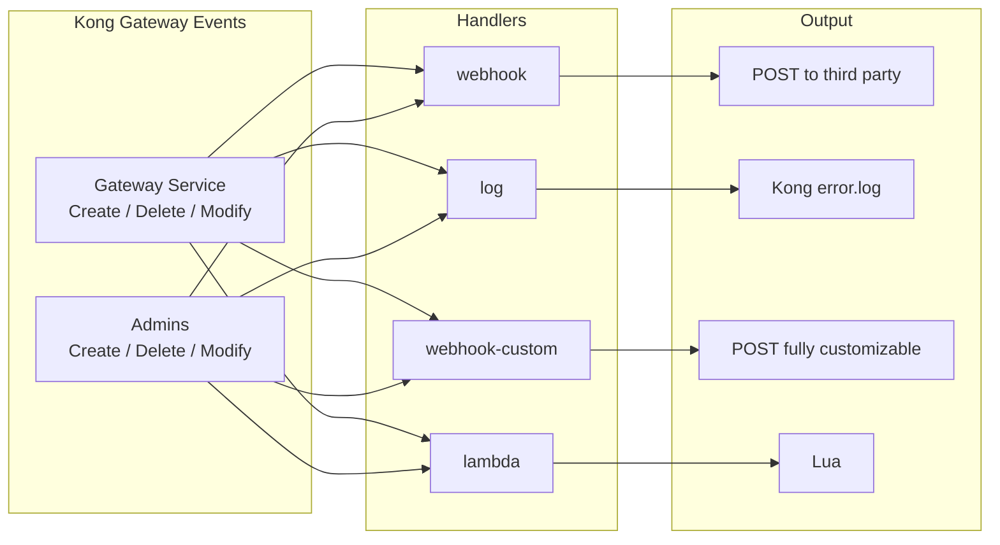
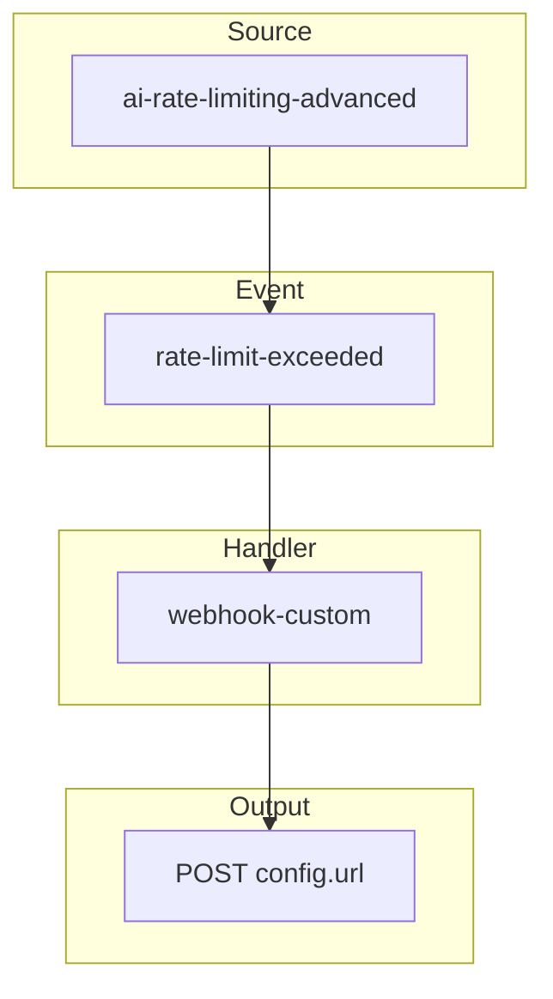
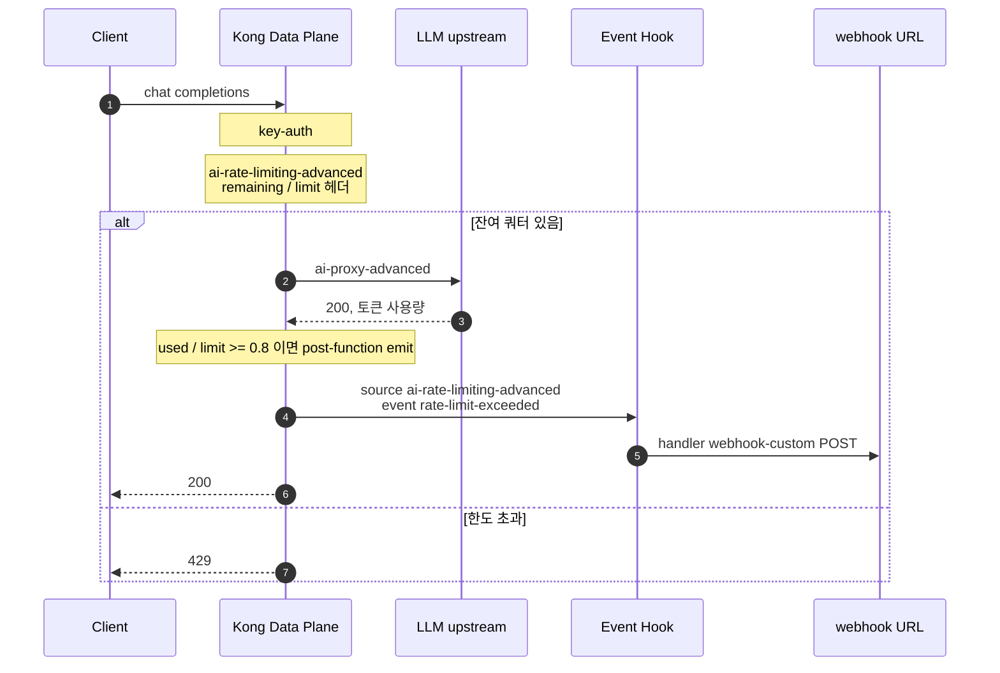
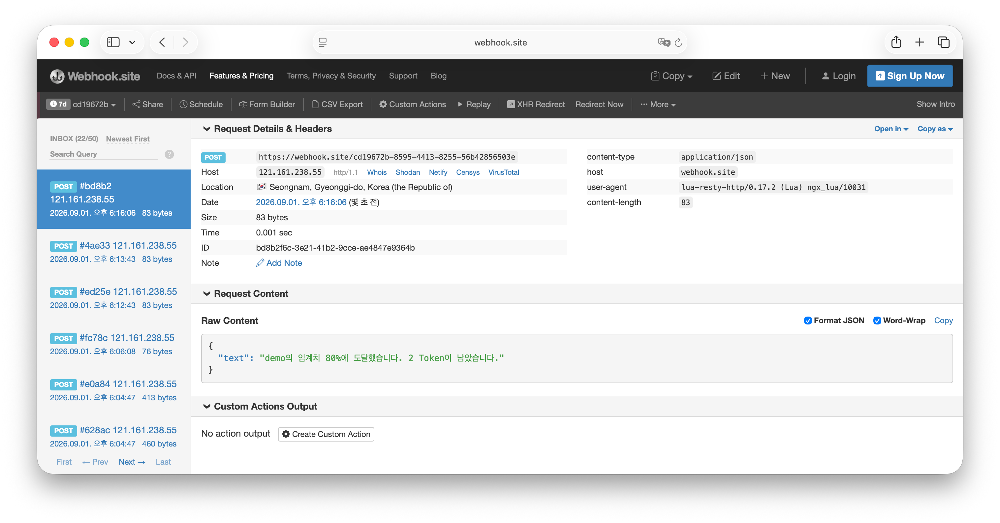

# AI Rate Limit + Event Hook

REST API의 Rate Limit은 보통 한도를 넘긴 뒤 클라이언트에 429를 돌려주는 방식으로 동작합니다.

LLM 트래픽은 Rate Limit 단위가 API 요청 수가 아니라 `Token`이고, 한 번의 채팅이 수십에서 수천 토큰을 사용하기도 합니다. 따라서 사용자는 제한 량을 예측하기 어렵습니다. 제한된 오류를 맞이하는 시점은 이미 토큰 제한/예산은 소진된 상태입니다.

운영·비용 담당이 원하는 신호는 `지금 부터 사용하지 못함`인 상태가 보다는 `곧 제한치에 도달 합니다` 입니다. Slack, PagerDuty, Webhook, 티켓 시스템으로 사전에 먼저 받고, 한도가 차기 전에 쿼터를 늘리거나 트래픽을 조정하기를 원합니다.

Kong Gateway는 토큰 사용량을 알고 있으므로, 앱마다 헤더를 폴링하지 않고, 게이트웨이에서 그 이벤드를 전송할 수 있는 [Event Hooks](https://developer.konghq.com/gateway/entities/event-hook/)을 활용할 수 있습니다.

## Event Hook 기능

[Event Hooks](https://developer.konghq.com/gateway/entities/event-hook/)는 Kong Gateway에서 제공하는 엔티티입니다. Gateway에서 일어난 일을 로그, 웹훅, 서드파티로 알립니다. 구독은 **source**, **event**, **handler** 세 항목으로 지정 가능합니다.

| 항목 | 의미 |
|------|------|
| source | Event Hook을 발생시키는 동작입니다. |
| event | 그 source 안에서 감시할 Kong 엔티티 또는 세부 이벤트입니다. |
| handler | 이벤트가 났을 때 할 일입니다. 웹훅, 로그, 커스텀 요청, Lua입니다. |



버전에 따라 목록이 달라지므로, 실제 값은 Admin API로 확인합니다.

```bash
curl -sS "$ADMIN/event-hooks/sources"
curl -sS "$ADMIN/event-hooks/sources/ai-rate-limiting-advanced"
```

구성 요소는 다음과 같습니다.

1. **source**: 이벤트 동작의 원본 소스를 지정합니다.
2. **event**: 그 source의 세부 이벤트를 선택합니다. `GET /event-hooks/sources/{source}`는 `balancer: health`처럼 `source: event` 형식으로 돌려줍니다.
3. **fields**: `webhook-custom` payload 템플릿에 넣을 수 있는 필드입니다.

공식 문서의 예시는 `balancer` / `health`이고, 템플릿 필드는 `upstream_id`, `ip`, `port`, `hostname`, `health`입니다.

::: details Event Hooks 요소 (상세)

### 사용 가능한 source

[공식 목록](https://developer.konghq.com/gateway/entities/event-hook/#available-sources)입니다. event는 source마다 `GET /event-hooks/sources/{source}`로 확인합니다.

| source | 언제 발생합니다 |
|--------|------------------|
| `crud` | Consumer 같은 Gateway 엔티티의 생성·조회·수정입니다. 예: `event` = `consumers`, `admins`. |
| `dao:crud` | 클러스터 `dao:crud` 이벤트입니다. |
| `balancer` | 로드 밸런서 상태입니다. 예: `event` = `health`. |
| `ai-rate-limiting-advanced` | AI Rate Limiting 한도를 **초과했을 때**입니다. |
| `rate-limiting-advanced` | Rate Limiting Advanced 한도를 초과했을 때입니다. |
| `service-protection` | Service Protection 한도를 초과했을 때입니다. |
| `oas-validation` | [OAS Validation](https://developer.konghq.com/plugins/oas-validation/) 플러그인이 실패했을 때입니다. |

이 글은 `ai-rate-limiting-advanced`를 씁니다. 등록된 event는 `rate-limit-exceeded`이고, `fields`는 `consumer`, `ip`, `service`, `rate`, `limit`, `window`입니다.

### handler

handler는 네 가지입니다.

| handler | 동작 |
|---------|------|
| `webhook` | 이벤트 데이터를 JSON body로 `config.url`에 **POST**합니다. |
| `log` | 이벤트와 payload를 Kong 로그(`error.log`)에 남깁니다. `config`는 비어 있습니다. |
| `webhook-custom` | method, header, body, payload를 직접 정합니다. Resty 템플릿을 씁니다. Slack Incoming Webhook처럼 본문 형식이 고정된 경우에 맞습니다. |
| `lambda` | 이벤트 후 Lua를 실행합니다. 기본은 sandbox입니다. `kong.configuration.pg_password`나 `os.execute` 같은 호출은 막히고, `local foo = 1 + 1` 수준의 코드는 됩니다. sandbox를 끄려면 `kong.conf`의 [`untrusted_lua`](https://developer.konghq.com/gateway/configuration/#untrusted-lua)를 바꿉니다. |

### 엔티티 필드

`POST /event-hooks`로 만듭니다. [공식 예시](https://developer.konghq.com/gateway/entities/event-hook/#set-up-an-event-hook)는 `crud` / `consumers` / `webhook`입니다.

| 필드 | 값 | 설명 |
|------|-----|------|
| `source` | 위 source 표 | 필수입니다. |
| `event` | source별 event | 비우면 해당 source의 모든 event입니다. |
| `handler` | `webhook`, `log`, `webhook-custom`, `lambda` | 필수입니다. |
| `on_change` | `true` / `false` | payload가 이전과 같을 때는 다시 보내지 않습니다. |
| `snooze` | 초(integer) | 같은 Hook을 N초 동안 다시 보내지 않습니다. |
| `config` | handler별 | 아래 표입니다. |

`webhook`의 `config`:

| 필드 | 값 | 설명 |
|------|-----|------|
| `url` | URL | 필수입니다. POST 목적지입니다. |
| `headers` | 문자열 맵 | 추가 헤더입니다. Kong이 `content-type: application/json`을 붙입니다. |
| `secret` | 문자열 | 있으면 body를 서명합니다. |
| `ssl_verify` | `true` / `false` | TLS 인증서 검증입니다. 기본값은 `true`입니다. |

`webhook-custom`의 `config`:

| 필드 | 값 | 설명 |
|------|-----|------|
| `url` | URL | 필수입니다. |
| `method` | HTTP method | 필수입니다. 보통 `POST`입니다. |
| `payload` | 문자열 맵 | form payload입니다. `payload_format`이 `true`(기본)이면 값에 Resty 템플릿을 적용합니다. |
| `body` | 문자열 | raw body입니다. `body_format`이 `true`(기본)이면 템플릿입니다. |
| `headers` | 문자열 맵 | `headers_format`이 `true`이면 헤더 값도 템플릿입니다. 기본은 `false`입니다. |
| `secret` | 문자열 | body 서명입니다. |
| `ssl_verify` | `true` / `false` | 기본값은 `true`입니다. |

`lambda`의 `config`는 `functions` 배열입니다. 각 원소는 `return function (data, event, source, pid) ... end` 형태의 Lua 문자열입니다.

생성 후 `GET /event-hooks/{id}/ping`은 `webhook` 목적지로 ping POST를 보냅니다.

:::

### 이 글에서 쓰는 값

AI Rate Limiting 플러그인은 남은 쿼터를 응답 헤더에 넣습니다. 클라이언트나 사이드카가 그 헤더를 읽어 알람을 보낼 수도 있습니다. 그 방식은 호출자가 헤더를 반드시 보고, 소비자마다 같은 로직을 복제해야 합니다.

Event Hook은 워크스페이스에 단일로 구성하면 됩니다.

| 항목 | 값 |
|------|------|
| source | `ai-rate-limiting-advanced` |
| event | `rate-limit-exceeded` |
| handler | `webhook-custom` (`config.body`에 한글 문장) |

## Event Hook 한계점

Event Hook의 source는 rate limit이 **초과된 때** 이벤트를 발생합니다. Event Hook 스키마에는 80% 같은 임계값 필드가 없으므로, `post-function`에서 요청하는 방식으로 구성했습니다.

1. **Event Hook**은 source / event를 듣고 `webhook-custom`으로 전달만 합니다.
2. Service의 `post-function`이 remaining / limit 헤더로 80%를 계산하고, Hook이 이미 구독 중인 source / event를 emit합니다.

`post-function`이 웹훅 URL로 POST하지 않습니다. emit만 합니다. Event Hook이 없으면 목적지가 없고, `post-function`이 없으면 80%에서 이벤트가 없습니다.

::: tip

Event Hook은 [decK가 관리하지 않습니다](https://developer.konghq.com/deck/reference/entities/). Admin API로 생성합니다.

:::



## 적용 방식

Service 플러그인이 트래픽과 80% 판정을 담당하고, 워크스페이스 Event Hook이 웹훅 URL을 소유합니다.

### Service 플러그인

| 플러그인 | 역할 |
|----------|------|
| `key-auth` | Consumer를 식별합니다. AI Rate Limiting은 `identifier: consumer`를 사용합니다. |
| [`ai-rate-limiting-advanced`](https://developer.konghq.com/plugins/ai-rate-limiting-advanced/) | `total_tokens`를 집계합니다. `X-AI-RateLimit-Remaining-minute-openai`와 `X-AI-RateLimit-Limit-minute-openai`를 씁니다. 쿼터가 소진되면 429를 반환합니다. |
| `post-function` | `header_filter`에서 위 헤더를 읽습니다. 사용량 / 한도가 0.8 이상이면 `ai-rate-limiting-advanced` / `rate-limit-exceeded`를 emit합니다. |
| [`ai-proxy-advanced`](https://developer.konghq.com/plugins/ai-proxy-advanced/) | 채팅 요청을 LLM 업스트림으로 프록시합니다. |

::: warning 주의사항
AI Rate Limiting의 `hide_client_headers`는 `false`여야 `post-function`이 remaining과 limit를 읽을 수 있습니다. `post-function`은 `kong.enterprise_edition.event_hooks`를 호출하므로 Data Plane은 `untrusted_lua = on`이 필요합니다.
:::

### Event Hook

`webhook`은 이벤트 JSON을 그대로 POST합니다. 한글 문장을 넣으려면 [`webhook-custom`](https://developer.konghq.com/how-to/create-a-custom-webhook-slack-with-kong-gateway/)과 Resty 템플릿을 씁니다. `{{ username }}`, `{{ threshold }}`, `{{ remaining }}`은 `post-function`이 emit한 필드입니다.

```bash
curl -sS -X POST "$ADMIN/$WORKSPACE/event-hooks" \
  -H "Kong-Admin-Token: $TOKEN" \
  -H "Content-Type: application/json" \
  --data-binary @- <<EOF
{
  "source": "ai-rate-limiting-advanced",
  "event": "rate-limit-exceeded",
  "handler": "webhook-custom",
  "snooze": 60,
  "config": {
    "method": "POST",
    "url": "$WEBHOOK_URL",
    "ssl_verify": true,
    "headers": { "content-type": "application/json" },
    "body": "{\"text\":\"{{ username }}의 임계치 {{ threshold }}%에 도달했습니다. {{ remaining }} Token이 남았습니다.\"}",
    "body_format": true
  }
}
EOF
```

`body_format: true`이면 `config.body`의 `{{ }}`가 이벤트 값으로 바뀝니다. 8번째 채팅에서 본문은 예를 들어 `demo의 임계치 80%에 도달했습니다. 2 Token이 남았습니다.`입니다. `snooze`는 같은 Hook의 전송 최소 간격(초)입니다.

## 로직

요청 한 건의 경로입니다. 웹훅은 프록시 응답과 별도로 나갑니다.



`header_filter`의 80% 판정입니다.

```lua
local rem = tonumber(kong.response.get_header("X-AI-RateLimit-Remaining-minute-openai"))
local lim = tonumber(kong.response.get_header("X-AI-RateLimit-Limit-minute-openai"))
local threshold = 80
if (lim - rem) / lim * 100 < threshold then
  return
end
local consumer = kong.client.get_consumer() or {}
require("kong.enterprise_edition.event_hooks").emit(
  "ai-rate-limiting-advanced",
  "rate-limit-exceeded",
  {
    consumer = consumer,
    username = consumer.username or "",
    ip = kong.client.get_forwarded_ip(),
    service = kong.router.get_service() or {},
    rate = lim - rem,
    limit = lim,
    remaining = rem,
    threshold = threshold,
    window = "minute",
  }
)
```

`webhook-custom` 본문의 `{{ username }}`, `{{ threshold }}`, `{{ remaining }}`이 이 테이블에서 채워집니다.

## 출력 예시

10 tokens / 60s 윈도우에서 채팅당 1토큰이면 8번째 성공 응답에서 80%를 넘습니다. 한도 10까지는 200이고, 그 다음은 429입니다.

요청을 제한 수치에 도달하도록 반복적으로 요청합니다.

```bash
# Token request test
curl -sS -D - http://127.0.0.1:8000/event-hook/v1/chat/completions \
  -H "Content-Type: application/json" \
  -H "apikey: event-hook-demo" \
  -d '{"model":"gpt-4o-mini","messages":[{"role":"user","content":"hello"}]}'
```

`X-AI-RateLimit-Remaining-*` 응답 출력이 원하는 수치에 도달하는지 확인합니다.

```log
HTTP/1.1 200 OK
Content-Type: application/json
Connection: keep-alive
X-AI-RateLimit-Remaining-minute-openai: 1
X-AI-RateLimit-Limit-minute-openai: 10
Date: Tue, 01 Sep 2026 08:41:36 GMT
Server: BaseHTTP/0.6 Python/3.12.13
Content-Length: 276
X-Kong-Upstream-Status: 200
X-Kong-LLM-Model: openai/gpt-4o-mini
X-Kong-Upstream-Latency: 1
X-Kong-Proxy-Latency: 1
Via: 1.1 kong/3.15.0.5-enterprise-edition

{"id": "chatcmpl-event-hook", "object": "chat.completion", "model": "gpt-4o-mini", "choices": [{"index": 0, "message": {"role": "assistant", "content": "[gpt-4o-mini] hello"}, "finish_reason": "stop"}], "usage": {"prompt_tokens": 1, "completion_tokens": 0, "total_tokens": 1}}
```

<https://webhook.site> 는 Webhook을 테스트해볼 수 있는 환경입니다.

::: warning 주의사항
민감한 정보가 전달되지 않도록 주의합니다.
:::



## 옵션

| 이름 | 의미 |
|------|------|
| `source` | Event Hook source. `ai-rate-limiting-advanced`. |
| `event` | Event Hook event. `rate-limit-exceeded`. |
| `handler` | `webhook-custom`은 `config.body` 템플릿을 `config.url`로 POST합니다. |
| `config.url` | 웹훅 목적지입니다. |
| `snooze` | 웹훅 전송 최소 간격(초)입니다. |
| `llm_providers[].limit` | 윈도우당 토큰 한도입니다. |
| `llm_providers[].window_size` | 윈도우 길이(초)입니다. |
| 80% | `post-function`의 `(limit - remaining) / limit >= 0.8`. |

::: tip 참고

- [Event Hooks](https://developer.konghq.com/gateway/entities/event-hook/)
- [AI Rate Limiting Advanced](https://developer.konghq.com/plugins/ai-rate-limiting-advanced/)
- [decK가 관리하는 엔티티](https://developer.konghq.com/deck/reference/entities/) (Event hooks: Not Supported)

:::

::: details decK 샘플

```yaml
_format_version: "3.0"
_workspace: event-hook-webhook

consumers:
  - username: demo
    custom_id: event-hook-webhook/demo
    tags: [event-hook-202608]
    keyauth_credentials:
      - key: event-hook-demo
        tags: [event-hook-202608]

services:
  - name: event-hook-llm
    url: http://event-hook-mock:8080
    tags: [event-hook-202608]
    plugins:
      - name: key-auth
        tags: [event-hook-202608]
        config:
          key_names: [apikey, x-api-key]
          key_in_header: true
          key_in_query: false
          hide_credentials: true
      - name: ai-rate-limiting-advanced
        instance_name: event-hook-ai-rla
        tags: [event-hook-202608]
        config:
          identifier: consumer
          strategy: local
          window_type: fixed
          namespace: event-hook-202608
          tokens_count_strategy: total_tokens
          hide_client_headers: false
          llm_providers:
            - name: openai
              limit: [10]
              window_size: [60]
      - name: post-function
        instance_name: event-hook-ai-rla-80pct
        tags: [event-hook-202608]
        config:
          header_filter:
            - |
              local rem = tonumber(kong.response.get_header("X-AI-RateLimit-Remaining-minute-openai"))
              local lim = tonumber(kong.response.get_header("X-AI-RateLimit-Limit-minute-openai"))
              if not rem or not lim or lim <= 0 then
                return
              end
              if (lim - rem) / lim < 0.8 then
                return
              end
              -- ponytail: plugin emits rate-limit-exceeded-provider-* which _check rejects
              local ok, event_hooks = pcall(require, "kong.enterprise_edition.event_hooks")
              if not ok then
                return
              end
              event_hooks.emit("ai-rate-limiting-advanced", "rate-limit-exceeded", {
                consumer = kong.client.get_consumer() or {},
                ip = kong.client.get_forwarded_ip(),
                service = kong.router.get_service() or {},
                rate = lim - rem,
                limit = lim,
                window = "minute",
              })
      - name: ai-proxy-advanced
        instance_name: event-hook-ai-proxy
        tags: [event-hook-202608]
        config:
          targets:
            - route_type: llm/v1/chat
              model:
                provider: openai
                name: gpt-4o-mini
                options:
                  upstream_url: http://event-hook-mock:8080/v1/chat/completions
              auth:
                header_name: Authorization
                header_value: Bearer demo
              logging:
                log_statistics: true
                log_payloads: true
    routes:
      - name: event-hook-chat
        tags: [event-hook-202608]
        paths: [/event-hook/v1/chat/completions]
        strip_path: true
        methods: [POST]
        protocols: [http, https]
```

:::