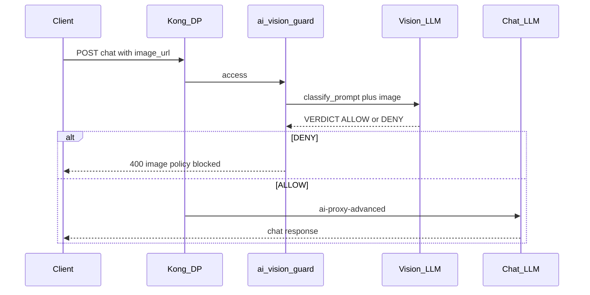

# ai-vision-guard 커스텀 플러그인

Kong의 공식 [AI Prompt Guard](https://developer.konghq.com/plugins/ai-prompt-guard/)는 텍스트를 정규식으로 검사하는 구조 입니다. 이미지 같은 사용자 환경의 특화된 데이터에 대해 검사를 진행하기 위해서는 커스텀 개발이 필요합니다.

Kong 커스텀 플러그인 `ai-vision-guard`는 OpenAI 호환 **VL(Vision-Language) 모델**로 `image_url`을 분류하고, 정책에 맞지 않으면 **채팅 LLM에 도달하기 전** 요청을 차단합니다. [AI Proxy](https://developer.konghq.com/plugins/ai-proxy/) / [AI Proxy Advanced](https://developer.konghq.com/plugins/ai-proxy-advanced/)와 같은 Route에 붙입니다.

::: tip 소스 코드

- **플러그인 예제 (0.2.0):** [Great-Stone/kong-ai-vision-guard](https://github.com/Great-Stone/kong-ai-vision-guard)
- **커스텀 플러그인 가이드:** [developer.konghq.com/custom-plugins](https://developer.konghq.com/custom-plugins/)

:::

## Demo

<iframe width="560" height="315" src="https://www.youtube.com/embed/P4uJ-8_Bazo?si=nV_RXko0copbk0C5" title="YouTube video player" frameborder="0" allow="accelerometer; autoplay; clipboard-write; encrypted-media; gyroscope; picture-in-picture; web-share" referrerpolicy="strict-origin-when-cross-origin" allowfullscreen></iframe>

## VL 모델

기존 `AI Prompt Guard`는 텍스트 유사성을 판단하기 위해 `Text Embedding` 모델을 필요로 했습니다. 이미지 분석을 위해서는 이미지를 판독할 수 있는 모델이 필요합니다.

**VL 모델**(Vision-Language Model, VLM)은 이미지와 텍스트를 함께 받아 처리할 수 있습니다. 예를 들어, 채팅 API에서는 `messages`의 `image_url`과 지시문을 한 번에 보냅니다.

OCR만 돌리면 글자를 뽑을 수는 있습니다. VL은 그에 더해 `맥락`을 판정합니다.

- 빈 신청서 vs 성명·연락처가 기입된 신청서
- 반도체 마케팅 그래픽 vs CAD/EDA 도면 화면

VL을 사용하는 커스텀 플러그인 구성에 고려한 사항은 다음과 같습니다.

- 엔드포인트는 OpenAI 호환 `POST /v1/chat/completions`을 사용
- 로컬(LM Studio 등의 Qwen-VL)이나 클라우드의 비전 모델을 사용
- 플러그인은 `vision_url`과 `vision_model`를 구성
- 파일명 대신 픽셀을 보려면 `data:image/...;base64,...` URL을 권장

## 커스텀 플러그인으로 구성한 계기

채팅 앱마다 이미지 가드를 넣지 않고, Gateway에서 단일화된 검수 포인트를 만들 수 있습니다.

- 같은 Route에서 **텍스트는 Prompt Guard, 이미지는 Vision Guard**, 응답은 AI Proxy
- 판정용 VL과 **대화용 LLM을 분리** — 분류 모델이 사용자에게 답할 필요는 없음
- 차단 시 민감 이미지가 채팅 upstream으로 넘어가지 않음

[Priority](https://developer.konghq.com/gateway/entities/plugin/#plugin-priority)는 `775` 지정하여, AI Prompt Guard(`771`)와 AI Proxy보다 먼저 실행됩니다.

## 구성 예시

| 구분 | 내용 |
|------|------|
| 플러그인 | `ai-vision-guard` (Lua, priority 775) |
| 판정 | OpenAI 호환 VL (`vision_url` / `vision_model`) |
| 채팅 | `ai-proxy-advanced` → 별도 텍스트/멀티모달 LLM |
| 클라이언트 | OpenAI 채팅 형식 (`messages` + `image_url`) |
| 이미지가 없을 때 | `skip_if_no_image: true`이면 통과 |



판정 VL과 응답 LLM을 나누면, 가드 프롬프트는 짧게 유지하고 대화 품질은 채팅 모델에 맡길 수 있습니다.

## 동작 방식

요청마다 플러그인은 다음을 수행합니다.

1. JSON body의 `messages`에서 `image_url`을 수집합니다.
2. 이미지가 없고 `skip_if_no_image`가 `true`이면 그대로 통과합니다.
3. 각 이미지(최대 `max_images`)를 `classify_prompt`의 `deny_prompts` / `allow_prompts`와 함께 `vision_url`로 보냅니다. preamble·intro·`VERDICT:` suffix는 플러그인이 붙입니다.
4. 응답에서 `VERDICT: ALLOW` / `VERDICT: DENY`를 파싱합니다. **마지막 매칭**이 이깁니다.

하나라도 DENY이면 호출자는 `deny_status`(기본 `400`)를 받고 upstream으로 가지 않습니다. 모두 ALLOW이면 AI Proxy로 이어집니다. VL 호출이 실패하고 `fail_open`이 `false`(기본)이면 `500`입니다.

판정이 있을 때 응답 헤더:

| 헤더 | 값 |
|------|-----|
| `X-Vision-Guard-Decision` | `ALLOW`, `DENY`, 또는 `ERROR` |
| `X-Vision-Guard-Model` | 비전 모델 id |
| `X-Vision-Guard-Reason` | 한 줄로 자른 사유 |

채팅 UI가 이전 첨부까지 히스토리에 다시 넣는 경우가 많습니다. 기본값 `only_last_user_images: true`는 **마지막 user 메시지**의 이미지만 판정합니다. 하지만 이 경우 클라이언트 환경에 따라 이전 이미지를 다시 보내는 경우가 있으므로 주의해야 합니다.

## 활용 방식

[AI Semantic Prompt Guard](https://developer.konghq.com/plugins/ai-semantic-prompt-guard/)처럼 `deny_prompts` / `allow_prompts`를 설정합니다.

### 예시 1. 서류 이미지의 개인정보

텍스트 PII 가드와 역할을 나눕니다. 프롬프트의 주민번호·전화번호는 Prompt Guard / Sanitizer가 보고, **스캔본·사진 속 기입란**은 Vision Guard가 봅니다.

| 이미지 | 기대 |
|--------|------|
| 빈 신청서·계약 양식 (성명·연락처·주소 공란) | ALLOW |
| 조회 화면에서 성명·연락처 등이 회색 박스로 마스킹된 포털 | ALLOW |
| 성명·010 번호·주민번호·주소가 **기입된** 신청서/계약서 | DENY |

채팅 LLM은 빈 양식 질문에만 답하고, 기입된 개인정보 사진은 Gateway에서 끊깁니다. `classify_prompt` 예시는 다음과 같습니다.

```yaml
classify_prompt:
  deny_prompts:
    - a person name filled in name or contract fields
    - a customer mobile number starting with 010-
    - resident-registration-number digits (including partially masked)
    - a full street address in address fields
  allow_prompts:
    - name, phone, and RRN cells are blank (empty application forms)
    - status or inquiry portals where customer name, phone, or numbers are gray-box masked
    - only product titles, tables, logos, or counts with no filled identity section
```

### 예시 2. 설계 IP / 도면

플러그인 기본값이 이 축입니다. 칩 floorplan, GDS 스타일 레이어, EDA 도구 화면은 DENY이고, 풍경·일반 사진·반도체 마케팅 그래픽은 ALLOW입니다.

```yaml
classify_prompt:
  deny_prompts:
    - chip / SoC / IC floorplan or layout (CAD geometry on dark background)
    - VLSI / GDS-style metal layers, blocks, interconnects
    - EDA / floorplanner UI screenshots that display SoC blocks and wiring
    - hardware schematic of chip IP meant for engineering export
  allow_prompts:
    - landscape, wallpaper, nature, ordinary photos
    - marketing banners, infographics, icons, slides about semiconductors
    - factory illustrations that are NOT chip CAD layouts or EDA floorplan screens
```

## 설치

플러그인을 로드할 모든 Kong 노드(하이브리드면 CP와 DP)에 Lua 경로로 배포합니다.

```bash
git clone https://github.com/Great-Stone/kong-ai-vision-guard.git
cd kong-ai-vision-guard
luarocks make ai-vision-guard-0.1.0-1.rockspec
```

또는 `kong/plugins/ai-vision-guard/`를 Kong Lua 패키지 경로에 마운트합니다.

```text
KONG_PLUGINS=bundled,ai-vision-guard
```

Service 또는 Route에 `ai-vision-guard`와 AI Proxy를 함께 붙입니다. 최소한 `vision_url`과 `vision_model`이 필요합니다.

### decK 예시

아래 값은 이해를 돕기 위한 **샘플**입니다. VL·채팅 URL과 키는 환경에 맞게 바꿉니다.

```yaml
_format_version: "3.0"
services:
  - name: vision-guarded-llm
    url: https://llm.example.com
    plugins:
      - name: ai-vision-guard
        config:
          vision_url: https://vision.example.com/v1/chat/completions
          vision_model: qwen3-vl-instruct
          vision_auth_header_name: Authorization
          vision_auth_header_value: Bearer ${{ env "VISION_API_KEY" }}
          skip_if_no_image: true
          fail_open: false
          deny_status: 400
          only_last_user_images: true
          image_detail: high
          classify_prompt:
            deny_prompts:
              - a person name filled in name or contract fields
              - a customer mobile number starting with 010-
            allow_prompts:
              - name and phone cells are blank (empty application forms)
              - inquiry portals where customer fields are gray-box masked
      - name: ai-proxy-advanced
        config:
          targets:
            - route_type: llm/v1/chat
              model:
                provider: openai
                name: gpt-4o-mini
                options:
                  upstream_url: https://llm.example.com/v1/chat/completions
              auth:
                header_name: Authorization
                header_value: Bearer ${{ env "LLM_API_KEY" }}
    routes:
      - name: vision-guarded-chat
        paths: [/v1/chat/completions]
        strip_path: false
        methods: [POST]
```

텍스트 allow/deny가 필요하면 같은 Route에 AI Prompt Guard를 추가로 붙입니다.

## 플러그인 옵션

| 필드 | 설명 |
|------|------|
| `vision_url` / `vision_model` | 판정용 VL chat completions |
| `vision_auth_header_value` | 예: `Bearer <token>` (Vault reference 가능) |
| `classify_prompt` | `deny_prompts`, `allow_prompts`만 설정. preamble·intro·`VERDICT:` suffix는 플러그인이 고정 |
| `max_images` | 분류할 `image_url` 최대 개수 (하나라도 DENY면 차단) |
| `only_last_user_images` | 마지막 user 이미지만 판정 (기본 `true`) |
| `skip_if_no_image` | 이미지 없으면 통과 (기본 `true`) |
| `fail_open` | VL 호출 실패 시 통과 (기본 `false`) |
| `deny_status` | DENY 시 HTTP 상태 (기본 `400`) |

## curl 호출 예시

`$PROXY`는 Kong Proxy 주소입니다 (예: `http://127.0.0.1:8000`).

```bash
# 텍스트만 → 이미지 없음, skip 후 채팅 LLM
curl -sS -D - -o /tmp/vg-body.json -X POST "$PROXY/v1/chat/completions" \
  -H "Content-Type: application/json" \
  -d '{"model":"gpt-4o-mini","messages":[{"role":"user","content":"hello"}]}'

# 이미지 첨부 (data URI). DENY면 400, ALLOW면 채팅 응답
curl -sS -D - -o /tmp/vg-body.json -X POST "$PROXY/v1/chat/completions" \
  -H "Content-Type: application/json" \
  -d @./chat-with-image.json
```

## 동작 기대값

| 시나리오 | 기대 |
|----------|------|
| 텍스트만 (`skip_if_no_image`) | HTTP **200**, 채팅 LLM 응답 |
| 정책 위반 이미지 | HTTP **400**, `"image policy blocked by vision LLM"`, `X-Vision-Guard-Decision: DENY` |
| 허용 이미지 | HTTP **200**, 채팅 LLM 응답, `X-Vision-Guard-Decision: ALLOW` |
| VL 오류 + `fail_open: false` | HTTP **500**, `ERROR` |

## 플러그인 제약

- 파일명·확장자가 아니라 **픽셀**을 검사합니다. 데모·PoC는 base64 data URI가 안전합니다.
