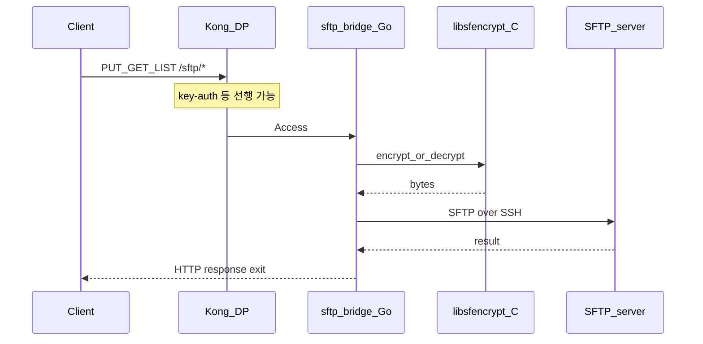
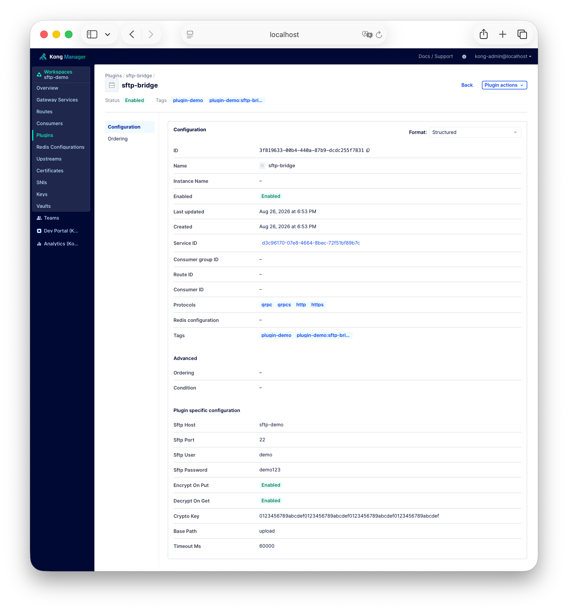

# HTTP로 SFTP 다루기 — sftp-bridge 커스텀 플러그인

S3 같은 기술이 API 기반 원격 파일 저장 및 읽기를 가능하게 하지만 일부 시스템의 파일 관리 구조에서 여전히 **SFTP 파일 송수신**이 사용됩니다.

Kong Gateway는 기본적으로 HTTP(S)·gRPC·TCP 프록시에 최적화되어 있고, **HTTP → SFTP 프로토콜 변환은 내장 기능이 아닙니다.** API Gateway 정책(인증·인가·제한·로깅 등)을 유지한 채 SFTP를 다루려면 커스텀 플러그인으로 그 자리를 메울 수 있습니다. 이 글에서는 Go + C로 만든 `sftp-bridge` 플러그인과 데모 구성 예시를 정리합니다.

::: tip 소스 코드

- **플러그인 예제:** [Great-Stone/kong-sftp-bridge-plugin](https://github.com/Great-Stone/kong-sftp-bridge-plugin)
- **커스텀 플러그인 가이드:** [developer.konghq.com/custom-plugins](https://developer.konghq.com/custom-plugins/)

:::

## 커스텀 플러그인으로 구성한 계기

SFTP는 별도 어댑터 서비스를 두고 Kong은 그 어댑터로만 라우팅하는 방식으로도 가능합니다. 다음 조건에서는 Gateway 플러그인을 고려할 수 있습니다.

- 같은 Route에서 **key-auth, ACL, rate-limiting, 로깅**을 그대로 조합
- SFTP 자격 증명·암복호 옵션을 **플러그인 config**로 관리
- 요청을 upstream으로 넘기지 않고 Gateway에서 **종단 처리**

이 커스텀 플러그인은 HTTP를 SFTP로 처리하는 어댑터 없이, **플러그인 프로세스가 SFTP 클라이언트**가 되도록 구성합니다.

## 구성 예시

| 구분 | 내용 |
|------|------|
| 플러그인 | `sftp-bridge` (Go, go-pdk, priority 800) |
| 암복호 | C 공유 라이브러리 `libsfencrypt.so` (AES-256-GCM) → Go에서 cgo 호출 |
| SFTP 서버 | 예시로 Docker `atmoz/sftp` (`hostname: sftp-demo`) |
| Kong | Control Plane + Data Plane (하이브리드) |
| Workspace | `sftp-demo` (예시) |
| 인증 | Consumer + `key-auth` (헤더 `apikey`) |



## HTTP API

| Method / Path | 동작 |
|---------------|------|
| `PUT /sftp/files?path=` | body 업로드 (`encrypt_on_put` 시 C로 암호화 후 put) |
| `GET /sftp/files?path=` | 다운로드 (`decrypt_on_get` 시 C로 복호화) |
| `GET /sftp/list?path=` | 디렉터리 목록 JSON |

업로드 시 서버에 남는 바이트는 암호화된 형태이고, HTTP GET으로 받을 때만 복호화된 원문이 돌아옵니다.

## Go + C로 나눈 이유

- **Go**: `pkg/sftp` / `golang.org/x/crypto/ssh`로 SFTP 클라이언트를 구현하고, Kong에는 embedded pluginserver로 바이너리를 붙입니다.
- **C**: 기존 암복호 모듈이 C/공유 라이브러리인 경우가 많습니다. 데모는 AES-256-GCM을 `libsfencrypt.so`로 두고, **동일 C API**를 다른 `.so`로 교체할 수 있게 했습니다.

C API 요지 (`sfencrypt.h`):

- `sf_encrypt` / `sf_decrypt`
- 와이어 포맷: `iv(12) || tag(16) || ciphertext`

## 플러그인 빌드

```bash
git clone https://github.com/Great-Stone/kong-sftp-bridge-plugin.git
cd kong-sftp-bridge-plugin
make build
# dist/sftp-bridge
# dist/libsfencrypt.so
```

::: warning 주의

macOS에서는 Makefile이 Linux용으로 Docker 빌드를 돌립니다. Kong Data Plane 아키텍처(예: amd64 / arm64)와 맞춰야 합니다.

:::

빌드 산출물을 Data Plane에 마운트하고, pluginserver 환경 변수를 설정합니다.

```text
KONG_PLUGINS=bundled,sftp-bridge
KONG_PLUGINSERVER_NAMES=sftp-bridge
KONG_PLUGINSERVER_SFTP_BRIDGE_START_CMD=/usr/local/bin/sftp-bridge
KONG_PLUGINSERVER_SFTP_BRIDGE_QUERY_CMD=/usr/local/bin/sftp-bridge -dump
LD_LIBRARY_PATH=/usr/local/lib
```

## 데모 구성 예시

아래 값은 이해를 돕기 위한 **샘플**입니다. Proxy URL·키·SFTP 호스트는 환경에 맞게 바꿉니다.

| 항목 | 예시 값 |
|------|---------|
| Route | `/sftp` (`key-auth` + `sftp-bridge`) |
| Consumer | `sftp-client` |
| API key 헤더 | `apikey: <your-api-key>` |
| SFTP host | Data Plane이 도달 가능한 호스트명 (예: `sftp-demo`) |
| SFTP 계정 | `demo` / `demo123` |
| SFTP 디렉터리 | `upload` (`base_path`) |
| `encrypt_on_put` / `decrypt_on_get` | `true` |
| `crypto_key` | 32바이트 키 (hex 64자) |

`base_path`는 SFTP 계정 홈 기준 하위 경로를 가리킵니다.



pluginserver 환경 변수 예:

```text
KONG_PLUGINS=bundled,ai-vision-guard,sftp-bridge
KONG_PLUGINSERVER_NAMES=sftp-bridge
KONG_PLUGINSERVER_SFTP_BRIDGE_START_CMD=/usr/local/bin/sftp-bridge
KONG_PLUGINSERVER_SFTP_BRIDGE_QUERY_CMD=/usr/local/bin/sftp-bridge -dump
LD_LIBRARY_PATH=/usr/local/lib
```

### 호출 예시

`$PROXY`는 Kong Proxy 주소입니다 (예: `http://127.0.0.1:8000`).

```bash
printf 'hello\n' > ./demo.txt

# 키 없음 → 401
curl -X PUT -T ./demo.txt \
  "$PROXY/sftp/files?path=demo.txt"

# 업로드 (로컬 파일 지정)
curl -X PUT -H "apikey: $APIKEY" -T ./demo.txt \
  "$PROXY/sftp/files?path=demo.txt"

# 목록
curl -H "apikey: $APIKEY" \
  "$PROXY/sftp/list?path="

# 다운로드 (복호화된 본문)
curl -H "apikey: $APIKEY" \
  "$PROXY/sftp/files?path=demo.txt"
```

## 동작 기대값

| 시나리오 | 기대 |
|----------|------|
| `PUT` without `apikey` | HTTP **401** (`No API key found in request`) |
| `PUT` with apikey + file body | HTTP **200**, JSON `"ok": true`, `"encrypted": true` |
| `GET /sftp/list?path=` | HTTP **200**, `files[]`에 업로드한 파일명 포함 |
| `GET /sftp/files?path=` | HTTP **200**, body = **원문 plaintext** |
| SFTP 서버 `upload/` | 파일 존재, 내용은 **암호문(바이너리)** 일 수 있음 |

### 파일 위치 및 내용 확인

SFTP 서버에서 업로드 디렉터리를 보면 파일이 있고, 내용은 암호문일 수 있습니다.

```bash
> ls -la /home/demo/upload
total 32
drwxr-xr-x    1 demo     users          316 Aug 26 08:47 .
drwxr-xr-x    1 root     root            12 Aug 26 08:17 ..
-rw-r--r--    1 demo     group_1001       175 Aug 26 08:17 demo.txt
```

```text
> cat /home/demo/upload/demo.txt
��1����(0�7��l}g-������&�Ā���=H�T�5��1����m��%
(binary ciphertext — not readable as plaintext)
```

## 플러그인 옵션

| 필드 | 설명 |
|------|------|
| `sftp_host` / `sftp_port` | SFTP 서버 |
| `sftp_user` / `sftp_password` | 계정 (운영에서는 Vault 등 권장) |
| `base_path` | 원격 디렉터리 prefix (예: `upload`) |
| `timeout_ms` | 연결·I/O 타임아웃 |
| `encrypt_on_put` / `decrypt_on_get` | C 암복호 사용 여부 |
| `crypto_key` | 32바이트 키 (hex 64자) |

## 운영 시 알아둘 점

- SFTP 전송이 끝날 때까지 **해당 요청이 Gateway 워커를 점유**합니다. 동시·대용량이 크면 Data Plane을 키우거나, 어댑터로 분리하는 편이 안전합니다.
- 데모 C 암복호는 **AES-256-GCM 샘플**입니다. 자체 모듈은 `sf_encrypt` / `sf_decrypt` 시그니처에 맞춰 `.so`만 교체하면 됩니다.
- gzip 압축·상용 암복호 SDK 연동은 이 데모 범위 밖입니다.
- TCP만으로 SFTP 세션을 중계할 때는 Kong **stream proxy**로 충분하고, 그때는 HTTP API·파일 암복호 제어는 하지 않습니다.

## 정리

Kong만으로 “HTTP → SFTP 변환기”가 되는 것은 아니지만, **커스텀 플러그인 + (필요 시) C 암복호 라이브러리**로 그 요구를 Gateway 정책 평면 안에 넣을 수 있습니다. `sftp-bridge`는 put/get/list와 선택적 암호화를 한 플러그인에서 처리하고, `key-auth` 같은 기존 플러그인과 같이 쓰는 패턴을 보여 줍니다.