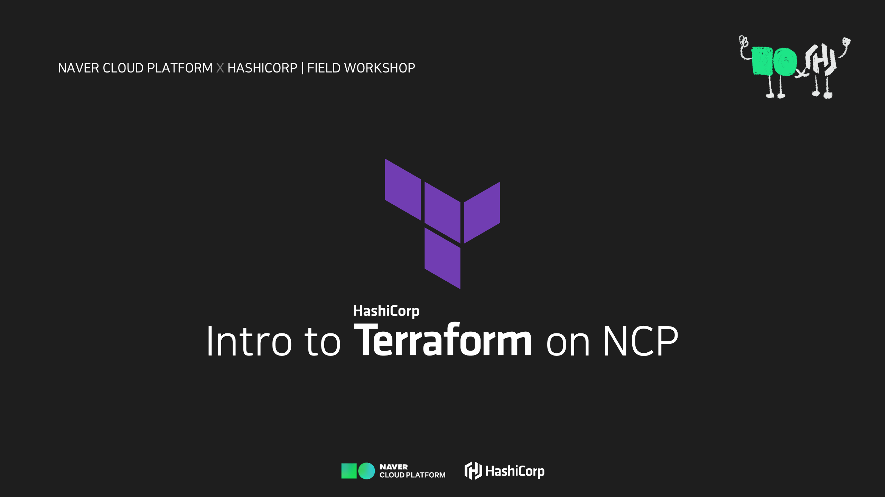

---
meta:
  - name: description
    content: Naver Cloud Platform에서의 Terraform 실습
tags: ["ncloud", "ncp", "terraform", "workshop"]
---

# Workshop 안내

----

## 과정 안내

- 이 과정은 IaC 도구인 Terraform을 사용하여 클라우드 리소스를 생성하는 실습(Hands-on)과정입니다.
- 사전 준비 사항
  - 인터넷 연결이 가능한 사용자 별 랩탑 또는 데스크탑 환경이 필요합니다.
  - 실습을 위한 샘플 코드활용을 위해 [github](https://github.com/)에 접속 가능해야 합니다.
  - [Naver Cloud Platform(NCP)](https://www.ncloud.com/)에 회원 가입이 필요합니다.
  - 과정을 실행하기 위해서는 NCP 리소스 사용을 위한 <u>**크래딧**</u> 또는 <u>**결재수단**</u> 이 필요합니다. 과정 진행을 위해 강사가 크래딧을 제공할 수 있습니다.
  
- 컨텐츠
  1. [Terraform 소개](./01-terraform-intro)
  2. [Terraform 기본](./02-terraform-basic)
      - :computer: Lab - Setup and Basic Usage
  3. Terraform In Action : `plan` `apply` `destroy`
  4. Terraform 코드 구성
      - :computer: Lab - Terraform in Action
  5. NCP 인스턴스 프로비저닝과 설정
      - :computer: Lab - Terraform으로 프로비저닝 하기
  6. 인프라 상태를 변경하고 관리하기
  7. Terraform Cloud (Option)
      - :computer: Lab - Terraform Remote State

## 참여자 소개

- 이름
- 담당 업무와 기술적 백그라운드
- 자동화 경험 (Terraform, Ansible, Bash Script, Powershell 등)
- 주로 사용하는 편집기(editor)

## 참고 링크

- Hashicorp Terraform 적용 단계 영상(자막)

  <iframe width="560" height="315" src="https://www.youtube.com/embed/BlFKzTyjaTI" title="YouTube video player" frameborder="0" allow="accelerometer; autoplay; clipboard-write; encrypted-media; gyroscope; picture-in-picture" allowfullscreen></iframe>
  
- [Terraform Home Page](https://www.terraform.io/)
- [Terraform Registry](https://registry.terraform.io/)
- [nCloud provider](https://registry.terraform.io/providers/NaverCloudPlatform/ncloud/latest)