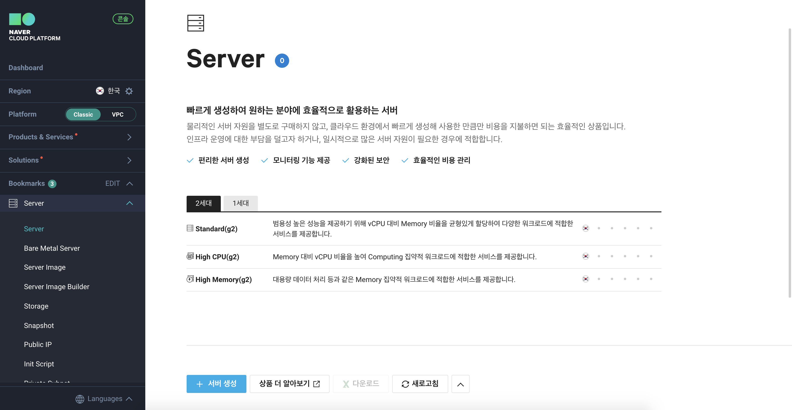
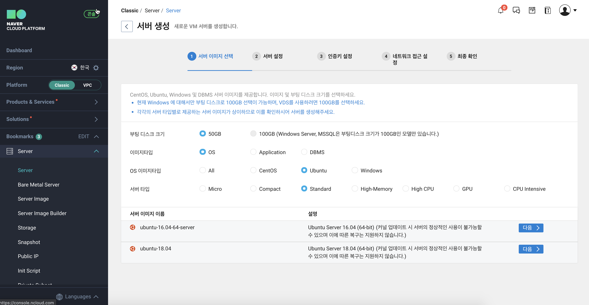
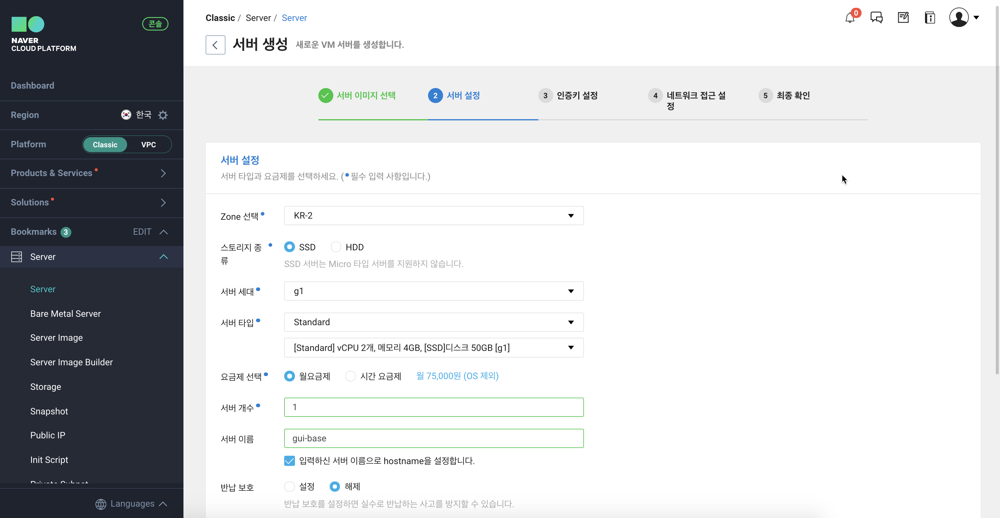
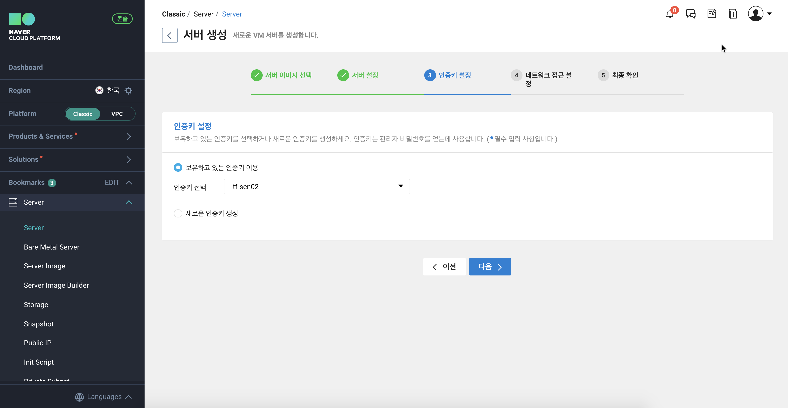
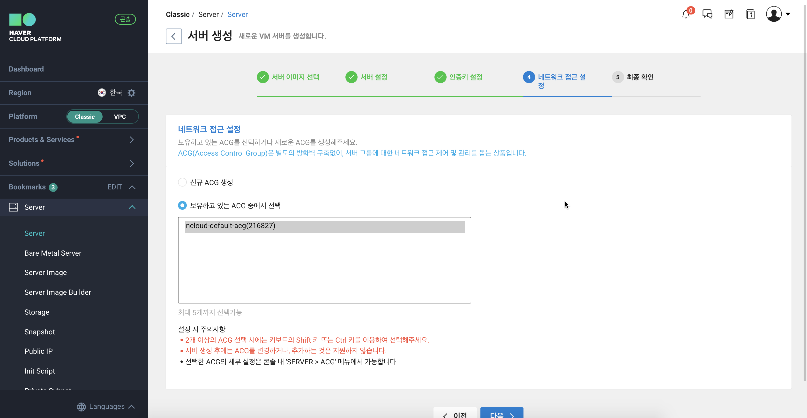
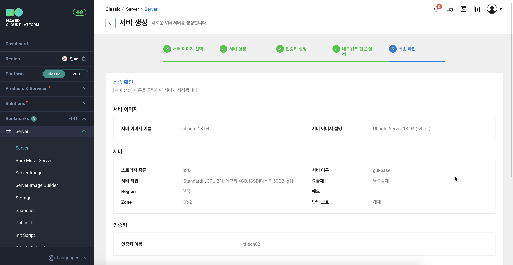
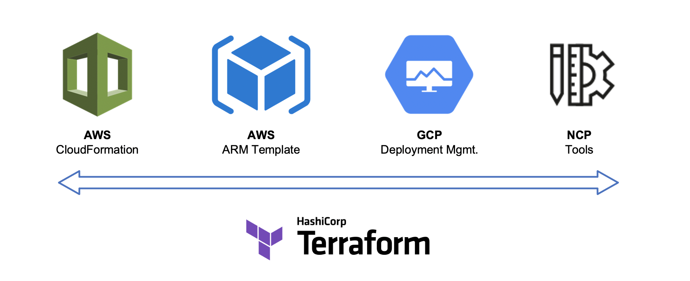

---
meta:
  - name: description
    content: Naver Cloud Platform에서의 Terraform 실습
tags: ["ncloud", "ncp", "terraform", "workshop"]
title : 01. 테라폼 소개

---

# 01. 테라폼 소개

## NCP 서버를 어떻게 프로비저닝 하죠?

새로운 NCP의 인스턴스를 프로비저닝 할 수있는 몇 가지 다른 방법을 살펴 보겠습니다. 시작하기 전에 다음을 포함한 몇 가지 기본 정보를 수집해야합니다 (더 많은 옵션이 있습니다).

- 서버 이름
- 운영 체제 (Image)
- VM 크기
- 지리적 위치 (Region)
- 보안 그룹

## 서버 만들기 Method 1:  nCloud Console (GUI)
:::: tabs
::: tab Start

:::
::: tab 서버 이미지 선택

:::
::: tab 서버 설정

:::
::: tab 인증키 설정

:::
::: tab 네트워크 접근 설정

:::
::: tab 최종 확인

:::
::::

---

## 서버 만들기 Method 2:  nCloud CLI

> 서버 생성을 위한 CLI 가이드 : <https://cli.ncloud-docs.com/docs/cli-server-createserverinstances>
```bash
ncloud server createServerInstances \
  --serverImageProductCode SPSW0LINUX000046 \
  --serverProductCode SPSVRSTAND000003 \
  --serverName ncloud-mktest
```

::: details CLI Options
| 파라미터 명                              | 필수 여부   | 타입    | 제약사항                                                     |
| ---------------------------------------- | ----------- | ------- | ------------------------------------------------------------ |
| serverImageProductCode                   | Conditional | String  | Min:1, Max:20                                                |
| serverProductCode                        | No          | String  | Min:1, Max:20                                                |
| memberServerImageNo                      | Conditional | String  |                                                              |
| serverName                               | No          | String  | Min:3, Max:30                                                |
| serverDescription                        | No          | String  | Min:1, Max:1000                                              |
| loginKeyName                             | No          | String  | Min:3, Max:30                                                |
| isProtectServerTermination               | No          | Boolean |                                                              |
| serverCreateCount                        | No          | Integer | Min:1, Max:20                                                |
| serverCreateStartNo                      | No          | Integer |                                                              |
| internetLineTypeCode                     | No          | String  | Min:1, Max:5                                                 |
| feeSystemTypeCode                        | No          | String  | Min:1, Max:5                                                 |
| zoneNo                                   | No          | String  |                                                              |
| accessControlGroupConfigurationNoList    | No          | List    | Min:0, Max:5                                                 |
| raidTypeName                             | Conditional | String  |                                                              |
| userData                                 | No          | String  | Min:1, Max:21847                                             |
| initScriptNo                             | No          | String  |                                                              |
| instanceTagList.tagKey                   | No          | String  |                                                              |
| instanceTagList.tagValue                 | No          | String  |                                                              |
| isVaccineInstall                         | No          | Boolean |                                                              |
| blockDevicePartitionList.N.mountPoint    | No          | String  | "/" (root) 경로로 시작하는 마운트 포인트를 입력합니다. 첫 번째 마운트 포인트는 반드시 "/" (root) 파티션이어야 합니다. "/" (root) 하위 명칭은 소문자와 숫자만 허용되며, 소문자로 시작해야합니다. OS 종류에 따라서 /root, /bin, /dev 등의 특정 키워드는 사용 불가능 할 수 있습니다. |
| blockDevicePartitionList.N.partitionSize | No          | String  | Min : 50 GiB                                                 |
:::

---

**nCloud CLI는 자동화할 수 있는 스크립트 방식을 제공합니다. 하지만 이 작업을 실행하기 전에 예측할 수 있나요?**


## 서버 만들기 Method 3: Provision with Terraform
> nCloud 서버를 생성하는 Terraform 예제 코드 : <https://registry.terraform.io/providers/NaverCloudPlatform/ncloud/latest/docs/resources/server>
```hcl
resource "ncloud_server" "server" {
  name = "tf-test-vm1"
  server_image_product_code = "SPSW0LINUX000032"
  server_product_code = "SPSVRSTAND000004"

  tag_list {
    tag_key = "samplekey1"
    tag_value = "samplevalue1"
  }

  tag_list {
    tag_key = "samplekey2"
    tag_value = "samplevalue2"
  }
}
```

## Terraform 이란?

```hcl
resource "ncloud_server" "server" {
  name = "tf-test-vm1"
  server_image_product_code = "SPSW0LINUX000032"
  server_product_code = "SPSVRSTAND000004"
}
```

- 실행 가능한 문서
- 인간과 기계 모두 해독 가능
- 배우기 쉬움
- 테스트, 공유, 재사용, 자동화
- 모든 주요 클라우드 제공 업체에서 작동 가능

## Infrastructure as Code (IaC)

IaC (Infrastructure as Code)는 컴퓨터에서 읽을 수있는 정의 파일을 사용하여 클라우드 인프라를 관리하고 프로비저닝하는 프로세스입니다.

**실행 가능한 '문서'라고 생각하시면 됩니다.**

## Infrastructure as Code는 다음과 같은 특징이 있습니다.

- 인프라 프로비저닝을 위한 체계화된 워크 플로우 제공
- 기존 인프라 변경 및 업데이트
- terraform plan 을 사용하여 변경 사항을 안전하게 테스트 및 확인
- 애플리케이션 코드 워크플로우 도구 (Git, CI/CD)와 통합
- 간편한 공유 및 공동 작업을 위해 재사용 가능한 모듈 제공
- 보안 정책(취약점 검사) 및 조직 표준 시행
- 서로 다른 팀 간의 협업 활성화

## 다른 운영 도구들


- 이러한 도구는 OS나 애플리케이션 구성에 적합합니다.
- 하지만 클라우드 인프라 및 플랫폼 서비스를 프로비저닝하기 위해 특별히 제작 된 것은 아닙니다.

## Native-Cloud 프로비저닝 도구들



- 각 클라우드에는 자체 YAML 또는 JSON 기반 프로비저닝 도구가 있습니다.
- Terraform은 모든 주요 클라우드 제공 업체 및 VM 하이퍼 바이저에서 공통으로 사용할 수 있습니다.

## Terraform vs. JSON

JSON:
```json
"name": "{ "Fn::Join" : [ "-", [ PilotServerName, vm ] ] }",
```

Terraform:
```hcl
name = "${var.PilotServerName}-vm"
```

**Terraform 코드 (HCL)는 배우기 쉽고 읽기 쉽습니다. 또한 동등한 JSON 구성보다 50-70 % 더 간결합니다.**

## NCP를 위해 Terraform을 쓰는 이유

- 다중 클라우드 및 하이브리드 인프라 지원
- 다른 클라우드 제공 업체로부터 마이그레이션
- 프로비저닝 속도 향상
- 효율성 향상
- 위험 최소화
