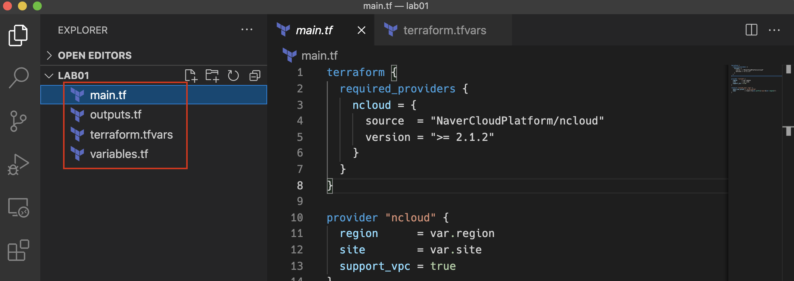

---
meta:
  - name: description
    content: Naver Cloud Platform에서의 Terraform 실습
tags: ["ncloud", "ncp", "terraform", "workshop"]

---

# :computer: Lab - Setup and Basic Usage

---

## 🏡 Moving in - Explore Your Workspace

@slidestart blood

### Terraform 명령줄 도구는 MacOS, FreeBSD, OpenBSD, Windows, Solaris 및 Linux에서 사용할 수 있습니다.

---

### Terraform 언어는 사람과 기계가 읽을 수 있도록 설계되었습니다.

---

### 대부분의 최신 코드 편집기는 Terraform 구문 강조 표시를 지원합니다.

@slideend

### 테라폼 설치 및 구성

1. 테라폼 다운로드 사이트 <https://www.terraform.io/downloads.html> 로 접속하여, 자신의 환경에 맞는 Terraform을 다운로드 받습니다.

2. 압축을 해제하여 terraform 바이너리 파일을 확인합니다.
  - Linux/Mac : `terraform`
  - Windows : `terraform.exe`

3. 파일을 적절한 위치에 넣고 PATH로 지정합니다.

:::: tabs
::: tab Linux/Mac
<code-group>
<code-block title="bash">
```bash
mkdir ~/hashicorp/bin
mv terraform ~/hashicorp/bin
cd ~/hashicorp/bin
echo $(pwd) >> ~/.bash_profile
source ~/.bash_profile
```
</code-block>
<code-block title="zsh">
```bash
mkdir ~/hashicorp/bin
mv terraform ~/hashicorp/bin
cd ~/hashicorp/bin
echo $(pwd) >> ~/.zshrc
source ~/.zshrc
```
</code-block>
</code-group>

:::
::: tab Windows
- `C:\app\terraform` 디렉토리를 생성하고 `terraform.exe`를 해당 디렉토리에 옮깁니다.
- 실행 창을 열고( <kbd></kbd> + R) `sysdm.cpl ,3`을 입력하여 확인
- 고급 탭의 `환경변수(N)...` 클릭
- USER에 대한 사용자 변수(U) 항목에서 `Path`를 선택하고 `편집(E)...` 버튼 클릭
- 앞서 생성한 경로를 한줄 추가합니다.

:::
::::

### 편집기 구성

VSCode 편집기를 사용할 준비가 되었다면, 코드의 시인성을 위해 extension을 설치 합니다.

:::: tabs
::: tab 1. Extention 설치
- 좌측 사이드 메뉴에서 Extentions 를 클릭하여 `Terraform`을 검색합니다.
- `HashiCorp Terraform`을 설치합니다.

:::
::: tab 2. 적용된 Extention 확인
- 설치가 완료되면 코드의 시인성이 향상됨을 확이할 수 있습니다.
- 이 외에도 수많은 확장 모듈로 생산성을 향상시킬 수 있습니다.

:::
::::

### 실습을 위한 코드 받기

이 실습에서는 Terraform을 실행하기 위한 IDE 설정과 Terraform CLI를 사용하고, NCP를 위한 기본 구성을 수행합니다.

실습에서 사용할 코드는 github에서 받습니다.

링크 : <https://github.com/ncp-hc/workshop-oss>


- git 이 설치되어있는 경우 `git clone`을 통해 코드를 받습니다.
  `$ git clone https://github.com/ncp-hc/workshop-oss.git`

- Download만을 원하는 경우 아래 `Download ZIP`을 선택합니다.

### 편집기에서 열기


- VSCode를 실행하고 File(파일) 메뉴에서 `Open Folder...` 를 클릭합니다.
- 앞서 받은 디렉토리내의 `lab01`을 열어줍니다.

---

## 👋 Getting to Know Terraform

@slidestart blood

### Terraform 오픈 소스는 랩톱 또는 가상 워크스테이션에서 다운로드하여 실행할 수 있는 명령줄 응용 프로그램입니다.

---

### Go로 작성되었으며 macOS, Linux 또는 Windows에서 실행됩니다.

---

### <https://www.terraform.io/downloads.html> 에서 항상 최신 버전의 Terraform을 다운로드할 수 있습니다.

---

### 노트북이나 워크스테이션에 Terraform을 설치하는 것은 쉽습니다. zip 파일을 다운로드하고 압축을 풀고 PATH의 어딘가에 배치하기만 하면 됩니다.

---

### 단계별 지침은 이 튜토리얼을 확인하세요. <https://learn.hashicorp.com/terraform/getting-started/install.html>

@slideend

편집기가 준비가 되었으면 터미널을 열고 몇가지 기본적인 Terraform 명령을 수행합니다.

- Linux/Mac의 경우 `터미널`에서 수행하거나 Windows의 경우 `명령 프롬프트`에서 실행하게 됩니다.

- VSCode 편집기를 사용하게 되면, 편집기의 터미널(Terminal) 기능으로 함께 사용할 수 있습니다.
  

#### :computer: 컴퓨터에서 Terraform의 버전을 확인 하세요.
```bash
terraform version
```

#### :computer: 명령 구문이 궁금하면 언제든지 도움을 받을 수 있습니다.
```bash
terraform help
```

---

## 🔐 Terraform을 NCP에 연결하기

@slidestart blood

### HCL이
### "HashiCorp Configuration Language"
### 의 약자라는 것을 알고 계신가요?

@slideend

### NCP 자격증명 받기

NCP에 인증하고 리소스를 빌드하기 위해 Terraform은 적절한 자격 증명 세트를 제공하도록 요구합니다.

#### :computer: Terraform에서 사용할 NCP의 자격증명을 얻기위해 다음 단계를 수행합니다.
:::: tabs
::: tab 1. 인증키 관리
- <https://www.ncloud.com/>에 로그인하여 마이페이지 메뉴에서 `인증키 관리`를 선택합니다.
- 경우에 따라 사용자 패스워드를 요구할 수 있습니다.

:::
::: tab 2. 신규 API 인증키 생성
- Terraform은 NCP에 API 인증키를 통해 자격증명을 취득합니다. `신규 API 인증키 생성` 버튼을 클릭합니다.
- `API 인증키가 생성 되었습니다.` 라는 메시지를 확인합니다.

:::
::: tab 3. API 인증키 쌍 확인
- 생성된 API인증키의 `Secret Key`항목의 `보기`버튼을 클릭하여 `Secret Key`를 확인합니다.
- Terraform을 위한 환경변수 설정을 위해 `Access Key ID`, `Secret Key`를 사용하게 됩니다.

:::
::::

### NCP 자격증명 환경변수로 저장하기

이 교육 환경을 위해 NCP의 자격 증명을 준비하여 환경 변수로 저장합니다. Terraform은 쉘 환경에 구성된 환경 변수를 자동으로 읽고 사용합니다.

#### :computer: 터미널에서 다음 명령을 실행합니다.

- `NCLOUD_ACCESS_KEY` `NCLOUD_SECRET_KEY` `NCLOUD_REGION` 를 환경변수로 등록합니다.

<code-group>
<code-block title="Linux/Mac">
```bash
export NCLOUD_ACCESS_KEY="XXXXXXXXXXXXX"
export NCLOUD_SECRET_KEY="79DXXXXXXXXXXXXXXXXXqp"
```
</code-block>
<code-block title="CMD(Win)">
```shell
set NCLOUD_ACCESS_KEY=XXXXXXXXXXXXX
set NCLOUD_SECRET_KEY=79DXXXXXXXXXXXXXXXXXqp
```
</code-block>
<code-block title="Powershell(Win)">
```powershell
$env:NCLOUD_ACCESS_KEY=XXXXXXXXXXXXX
$env:NCLOUD_SECRET_KEY=79DXXXXXXXXXXXXXXXXXqp
```
</code-block>
</code-group>

::: danger
API 자격증명정보는 실수로 공개된 저장소에 노출되거나 복사되면 위헐합니다.  
자격증명(API 인증키)를 코드에 저장하지 않는 것을 권장합니다.
:::

---

## 👨‍💻 Terraform 코드는 어떻게 생겼나요?

@slidestart blood

### Terraform은 현재 디렉토리에서 `*.tf` 또는 `*.tfvars` 로 끝나는 모든 것을 읽습니다.

---

### 일반적으로 Terraform Workspace는 `main.tf`, `variables.tf`, `outputs.tf` 파일로 구성됩니다.

---

### Terraform 코드를 목적에 따라 파일로 그룹화할 수도 있습니다.
예를 들어 모든 로드 밸런서 구성 코드를 `load_balancer.tf` 에 구성하기

@slideend

코드 편집기의 파일 목록이 보이십니까?


Terraform 코드는 항상 `.tf` 확장자로 끝납니다. 원하는 만큼 Terraform 파일을 가질 수 있지만 일반적으로 다음 세 가지를 구성합니다.

- `main.tf` - 대부분의 Terraform 코드가 저장되는 위치입니다. 이것은 자원을 구축하는 부분입니다.
- `variables.tf` - 이 파일을 사용하여 사용자가 사용할 수 있는 변수를 정의합니다.
- `output.tf` - 이 파일에는 성공적인 Terraform 실행이 끝날 때 표시될 출력이 포함되어 있습니다.

Terraform에서 `*.tf`와 `*.tfvars`로 끝나지 않는 파일은 무시됩니다.

---

## 🏡 Terraform Init - Provider 설치

@slidestart blood

### Terraform Core 프로그램은 그 자체로는 그다지 유용하지 않습니다.

---

### Terraform은 클라우드 API와 통신할 수 있도록 Provider(공급자) 의 도움이 필요합니다.

---

### Terraform에는 수백 개의 다양한 Provider가 있습니다. 여기에서 Provider 목록을 찾아볼 수 있습니다.
<https://registry.terraform.io/browse/providers>

---

### 오늘 우리는 몇 가지 다른 Provider를 사용할 것이지만 주요 Provider는 `ncloud` provider 입니다.

@slideend

우리는 이 실습에서 사용할 Terraform 코드를 다운로드 했습니다. 나머지 실습에서 이 소스코드를 사용할 것입니다.

Terraform으로 무엇이든 하기 전에 Workspace를 초기화 해야 합니다.

#### :computer: 터미널에서 `init` 명령을 수행합니다.
```bash
terraform init

...
Terraform has been successfully initialized!
```

`terraform init 명령은 Terraform 코드를 스캔하고 필요한 Provider를 식별하고 다운로드합니다.

#### :computer: ncloud provider가 `.terraform` 디렉토리에 설치되었는지 확인합니다.

:::: tabs
::: tab 터미널
<code-group>
<code-block title="Linux/Mac">
```bash
ls .terraform/providers/registry.terraform.io/navercloudplatform
```
</code-block>
<code-block title="Windows">
```powershell
dir .terraform/providers/registry.terraform.io/navercloudplatform
```
</code-block>
</code-group>
:::
::: tab 코드 편집기

- 코드편집기에서 `.`으로 시작하는 디렉토리는 숨김처리되어 보이지 않을 수 있습니다.
:::
::::

이 숨겨진 디렉토리는 모든 모듈과 플러그인이 저장되는 곳입니다.

## :scream: Quiz Time 1. Provider와 Module

Q. Terraform은 모듈과 공급자를 어디에 저장합니까?

- [ ] /tmp 디렉토리에
- [ ] 사용자의 홈 디렉토리에
- [ ] .terraform 디렉토리에
- [ ] 모두 아님

::: details 답
- [x] .terraform 디렉토리에
:::

---

## 👩‍⚖️ Terraform Validate - 코드 테스트

@slidestart blood

### Terraform에는 구문 검사기가 내장되어 있습니다.

---

### `terraform validate` 명령으로 실행할 수 있습니다.

@slideend

Terraform에는 `validate` 라는 하위 명령이 내장되어 있습니다. 이것은 코드가 올바르게 구문 분석되는지 확인하기 위해 코드의 빠른 구문 검사를 수행하려는 경우에 유용합니다.

#### :computer: main.tf 파일을 편집합니다.
`main.tf` 16번째 행의 사이에 큰 따옴표를 제거 `ncloud_vpc`와 `hashicat` 사이의 큰 따옴표를 제거하고 저장합니다.

```hcl {16}
terraform {
  required_providers {
    ncloud = {
      source  = "NaverCloudPlatform/ncloud"
      version = ">= 2.1.2"
    }
  }
}

provider "ncloud" {
  region      = var.region
  site        = var.site
  support_vpc = true
}

resource "ncloud_vpc" "hashicat" { → resource "ncloud_vpc" hashicat" {
  ipv4_cidr_block = "10.0.0.0/16"
  name            = lower("${var.prefix}-vpc-${var.region}")
}

...생략...
```

`terraform validate` 명령을 터미널에서 실행합니다.

```bash
terraform validate
```

다시 따옴표 표기를 넣고 저장한 다음 `terraform validate` 명령을 실행합니다. 이번에는 검증을 통과해야 합니다.

`terraform validate` 명령은 자동화된 CI/CD 테스트 파이프라인에서 가장 자주 사용됩니다. 다른 단계를 수행하기 전에 코드에서 오류를 빠르게 포착할 수 있습니다.

---

## 🤔 Terraform Plan - Dry run mode

@slidestart blood

### `terraform plan`을 통해 환경에 대한 변경 사항을 안전한 방법으로 미리 볼 수 있습니다.

---

### 이렇게 하면 이미 빌드된 후가 아니라 배포하기 전에 예기치 않은 변경 사항을 식별하는 데 도움이 될 수 있습니다.

@slideend

#### :computer: `terraform plan`명령을 실행합니다.

```bash {1}
$ terraform plan
var.prefix
  This prefix will be included in the name of most resources.

  Enter a value:
```

이 명령을 실행하면 Terraform에서 `prefix`변수 를 입력하라는 메시지를 표시 합니다.

소문자 또는 숫자의 짧은 문자열을 입력합니다. 영문 이니셜 소문자를 사용하는 것이 좋습니다.

`prefix`는 현재 Terraform 코드 구성에서 VPC, 서브넷, 서버 등의 리소스 이름의 일부가 됩니다.


## 🎛️ Terraform 변수로 작업하기

@slidestart blood

### `terraform.tfvars` 파일은 사용자가 변수를 구성할 수 있는 편리한 위치입니다.

@slideend

Terraform에서 모든 변수는 사용하기 전에 선언되어야 합니다. 변수는 다른 `*.tf` 파일에서도 선언될 수 있지만 일반적으로 `variables.tf` 파일에서 선언됩니다. (default)

```hcl {3}
variable "address_space" {
  description = "The address space that is used by the virtual network. You can supply more than one address space. Changing this forces a new resource to be created."
  default     = "10.0.0.0/8"
}
```

해당 값은 `terraform.tfvars` 파일 및 나중에 다른 방법으로 설정할 수 있습니다.

#### :computer: `terraform.tfvars` 파일을 수정합니다.

`terraform.tfvars` 파일을 열고 `prefix`의 줄 시작 부분에 주석 기호 `#` 를 제거합니다.

`yourname`을 원하는 소문자 또는 숫자의 짧은 문자열을 입력합니다.
```hcl
# terraform.tfvars
prefix = "yourname"
```

이제 `terraform plan`을 다시 실행 합니다. 이번에는 `prefix`를 수동으로 입력할 필요가 없습니다.

## 🗼 cidr_block 변경

@slidestart blood

### 개개인은 `terraform.tfvars` 파일에 설정하여 `variables.tf` 파일에 정의된 모든 변수를 재정의할 수 있습니다.

---

### 이번 실습에서는 ncloud 리소스를 배포하는 위치를 지정합니다.

@slideend

이전 실습에서 `prefix`를 `terraform.tfvars` 파일에서 변수를 설정했습니다. ncloud 인프라가 배포될 vpc의 cidr를 결정할 또 다른 변수를 설정해 보겠습니다.

먼저 다른 계획을 실행하여 위치를 변경한 후 어떻게 되는지 비교할 수 있습니다.

```bash
terraform plan
```

#### :computer: 기본 `address_space` 정보를 수정합니다.

default로 선언되어있는 값 외에 사용자 지정 변수로 변경해봅니다. `terraform.tfvars`파일을 열어 `address_space`을 추가하고 다시 `terraform plan`을 실행해 봅니다. 이번엔 무엇이 다른가요?

```hcl
# terraform.tfvars
prefix        = "yourname"
address_space = "10.0.0.0/16"
```

`terraform.tfvars` 파일은 `variables.tf` 파일에 선언된 모든 변수에 대한 값을 설정할 수 있음을 기억하십시오.

---

## :scream: Quiz Time 2. Variables

Q. Terraform 변수는 일반적으로 어디에 선언 됩니까?

- [ ] 명령줄에서
- [ ] 환경 변수로
- [ ] variable.tf 파일에서
- [ ] terraform.tfvars 파일에서

::: details 답
- [x] variable.tf 파일에서
:::

---

이 장에서 우리는 :
- terraform init 명령을 확인했습니다.
- terraform plan 명령을 확인했습니다.
- 변수에 대해 배웠습니다.
- prefix(접두사) 설정을 했습니다.