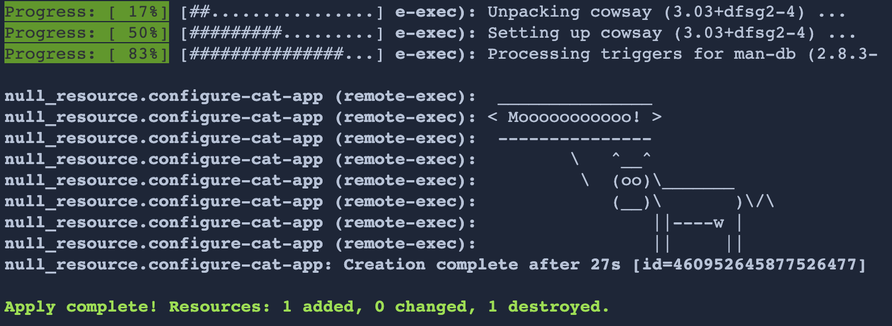

---
meta:
  - name: description
    content: Naver Cloud Platform에서의 Terraform 실습
tags: ["ncloud", "ncp", "terraform", "workshop"]

---

# :computer: Lab - Provisioners, Variables, Outputs

### 편집기에서 열기


- VSCode를 실행하고 File(파일) 메뉴에서 `Open Folder...` 를 클릭합니다.
- 앞서 실습을 진행한 `lab02`을 열어줍니다.

## 🛠️ Use a Provisioner

@slidestart blood

### Terraform 프로비저닝 도구는 생성 시 한 번 실행됩니다.

---

### 특별한 상황을 제외하고는 후속 적용에서 실행되지 않습니다. (이 실습실처럼...)

---

### `terraform apply` 를 입력할 때마다 프로비저닝 도구가 강제로 실행되도록 몇 가지 특별한 조정을 했습니다.

이는 변경할 때마다 가상 머신을 파괴하고 다시 생성하지 않고 프로비저닝 도구를 사용하여 연습할 수 있도록 하기 위한 것입니다.

```hcl
triggers = {
    build_number = timestamp()
}
```

---

```bash
______________________
< Cows love Terraform! >
 ----------------------
         \   ^__^
          \  (oo)\_______
             (__)\       )\/\
                 ||----w |
                 ||     ||
=============================
```

@slideend

#### :computer: Provisioner를 수정합니다.

`main.tf` 파일을 열어 `remote-exec` 항목이 있는 곳으로 이동합니다.

`inline` 항목에 다음을 두줄 추가합니다.
```bash
"sudo apt -y install cowsay",
"cowsay Mooooooooooo!",
```

::: tip
`terraform fmt`명령을 사용하여 코드를 멋지게 정렬 할 수 있는 좋은 시간 입니다.
:::

이제 변경 사항을 적용하십시오.

```bash
terraform apply -auto-approve
```

로그 출력을 뒤로 스크롤합니다. "Moooooooo!"라고 말하는 ASCII 아트 암소가 보일 것입니다.

::: details Result example

:::

## 🖨️ Add an Output

@slidestart blood

### 출력에서 Terraform 데이터와 함께 일반 텍스트를 혼합할 수 있습니다.
출력은 실행이 끝날 때 사용자에게 유용한 정보를 전달하는 데 사용할 수 있습니다.

---

### `terraform refresh` 명령은 상태 파일을 인프라에 있는 파일과 동기화합니다.
이 명령은 인프라를 변경하지 않습니다.

---

### Terraform 출력을 다시 보고 싶을 때 언제든지 `terraform output` 명령을 실행할 수 있습니다.
단일 출력을 보려면 `terraform output <output_name>`을 실행합니다.

@slideend

#### :computer: Output을 수정합니다.

`output.tf` 파일을 열어 아래 항목을 추가합니다.

```hcl
output "ssh_info" {
  value = nonsensitive("sshpass -p '${data.ncloud_root_password.hashicat.root_password}' ssh root@${ncloud_public_ip.hashicat.public_ip} -oStrictHostKeyChecking=no")
}
```

해당 output의 이름은 `ssh_info` 입니다.

어떤 유형의 출력이 유효한지 보려면 문서 페이지를 참조하세요.
- ncloud_root_password : <https://registry.terraform.io/providers/NaverCloudPlatform/ncloud/latest/docs/data-sources/root_password#argument-reference>
- ncloud_public_ip :<https://registry.terraform.io/providers/NaverCloudPlatform/ncloud/latest/docs/resources/public_ip#attributes-reference>

`output.tf`에 새로운 내용을 저장하고 `terraform refresh` 명령을 실행하여 새로운 출력을 확인합니다.

```bash
terraform refresh
```

`terraform output` 명령을 실행하여 모든 출력을 볼 수도 있습니다.

```bash
terraform output
```

## 🐶 Fun With Variables

@slidestart blood

### Terraform 변수에는 5가지 수준의 우선 순위가 있습니다. 1=최고 5=최저:
1. 명령줄 플래그 - 명령줄 스위치로 실행
2. 구성 파일 - terraform.tfvars 파일에 설정
3. 환경 변수 - 쉘 환경의 일부
4. 기본 구성 - variables.tf의 기본값
5. 사용자 수동 입력 - 지정하지 않은 경우 사용자에게 입력을 요청합니다.

---

### 다음은 `placeholder` 변수로 시도할 수 있는 다른 재미있는 사이트입니다.
- placedog.net
- placebear.com
- www.fillmurray.com
- www.placecage.com
- placebeard.it
- loremflickr.com
- baconmockup.com
- placeimg.com

@slideend

#### :computer: 변수를 조정합니다.

Terraform 변수를 구성하는 방법에는 여러 가지가 있습니다. 지금까지 `terraform.tfvars` 파일을 사용하여 변수를 설정했습니다.

명령줄에서 기본값과 다른 `height`, `width` 변수를 사용 하여 애플리케이션을 다시 배포해 보십시오.

변경 사항을 관찰하기 위해 적용할 때마다 웹 앱을 다시 로드합니다.

```bash
terraform apply -auto-approve -var height=600 -var width=800
```

다음으로 Terraform이 읽을 수 있는 환경 변수를 설정해 보십시오. 다음 명령을 실행하여 `placeholder` 변수를 설정합니다.

```bash
export TF_VAR_placeholder=placedog.net
```

환경 변수 적용 후 `terraform apply -auto-approve`를 실행하여 다시 적용해 봅니다.

```bash
terraform apply -auto-approve
```

이제 명령줄에서 동일한 변수를 다르게 설정하여 다시 시도하십시오.

```bash
terraform apply -auto-approve -var placeholder=placebear.com
```

어떤 변수가 우선시 되었습니까? 잘 이해 되셨나요?

다음 [공식문서](https://www.terraform.io/docs/language/values/variables.html#variable-definition-precedence)를 참고할 수 있습니다.

## :scream: Quiz Time 4. Terraform Variables

Q. `*.tfvars` 파일과 환경 변수에 동일한 변수가 설정되어 있습니다. 어느 것이 우선합니까?

- [ ] 환경변수로 구성된 변수
- [ ] tfvars 파일의 변수

::: details 답
- [x] tfvars 파일의 변수
:::

---

이 장에서 우리는 :
- Terraform Provisioners에 대해 배웠습니다.
- `file` 과 `remote-exec` 프로비저닝 도구에 대해 알아보았습니다.
- 새로운 프로비저닝 단계로 웹서버 재구성 해보았습니다.