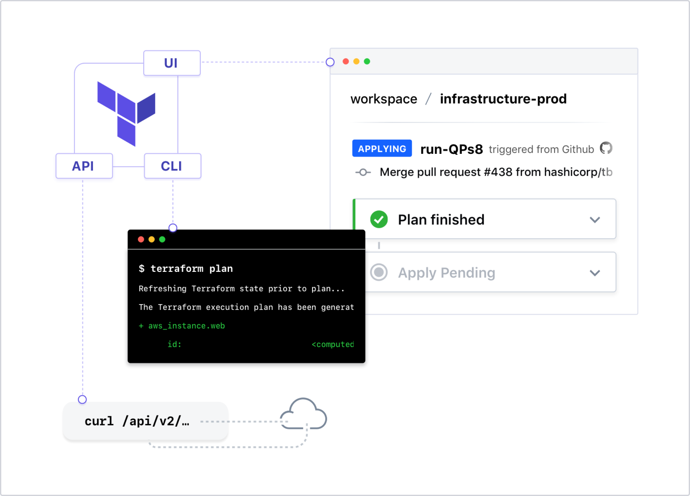

---
meta:
  - name: description
    content: Naver Cloud Platform에서의 Terraform 실습
tags: ["ncloud", "ncp", "terraform", "workshop"]

---

# 06. Terraform Cloud

## Terraform Cloud

Terraform Cloud는 Terraform을 사용하여 코드로 인프라를 작성하고 구축하기위한 최고의 워크 플로를 제공하는 ==무료== 로 시작하는 SaaS 애플리케이션입니다.

- State 저장 및 관리
- Terraform 실행을보고 승인하기위한 웹 UI
- 개인 모듈 레지스트리
- VCS (Version Control System) 통합
- CLI, API 또는 GUI 기반 작업
- 실행 이벤트 알림
- 자동화를위한 전체 HTTP API

---
## 
Terraform Cloud는 Remote State 관리, API 기반 실행, 정책 관리 등과 같은 기능을 제공하는 호스팅 된 애플리케이션입니다. 많은 사용자가 클라우드 기반 SaaS 솔루션을 선호하는 이유 중 한가지는 인프라를 유지하여 실행하는 것이 부담될 때 입니다.

Terraform Enterprise는 동일한 애플리케이션이지만 클라우드 환경이나 데이터 센터에서 실행됩니다. 일부 사용자는 Terraform Enterprise 애플리케이션에 대한 더 많은 제어가 필요하거나 회사 방화벽 뒤의 제한된 네트워크에서 실행하려고합니다.

이 두 제품의 기능 목록은 거의 동일합니다. 다음 실습에서는 Terraform Cloud 계정을 사용할 것입니다.

## Terraform Remote State

기본적으로 Terraform은 랩톱 또는 워크스테이션의 Workspace 디렉토리에 State 파일을 저장합니다. 이것은 개발 및 테스트에는 괜찮지만 프로덕션 환경에서는 상태 파일을 안전하게 보호하고 저장해야합니다.

Terraform에는 상태 파일을 원격으로 저장하고 보호하는 옵션이 있습니다. Terraform Cloud 계정은 이제 오픈 소스 사용자에게도 무제한 상태 파일 스토리지를 제공합니다.

모든 상태 파일은 암호화되어 (HashiCorp Vault 사용) Terraform Cloud 계정에 안전하게 저장됩니다. 상태 파일을 다시 잃어 버리거나 삭제하는 것에 대해 걱정할 필요가 없습니다.

## Terraform Cloud Execution Modes

- Local Run - Terraform 명령은 랩톱 또는 워크 스테이션에서 실행되며 모든 변수는 로컬로 구성됩니다. 테라 폼 상태 만 원격으로 저장됩니다.

- Remote Run - Terraform 명령은 Terraform Cloud 컨테이너 환경에서 실행됩니다. 모든 변수는 원격 작업 공간에 저장됩니다. 코드는 Version Control System 저장소에 저장할 수 있습니다. 프리 티어 사용자의 경우 동시 실행이 1 회로 제한됩니다.

- Agent Run - Terraform Cloud에서 내부네트워크에 있는 환경(VM, ldap 등)을 프로비저닝 하고자 할 때 내부에 실행을 위한 에이전트를 구성할 수 있습니다. Terraform Enterprise에서는 프로비저닝을 위한 프로세스를 여러 서버로 분산시킵니다.

---

실습을 위해 다음장으로 이동하세요.

[:computer: Lab - Terraform Cloud 연결](./06-z-lab_terraform_cloud.html)