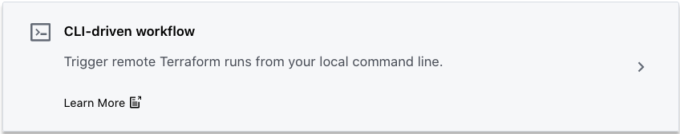
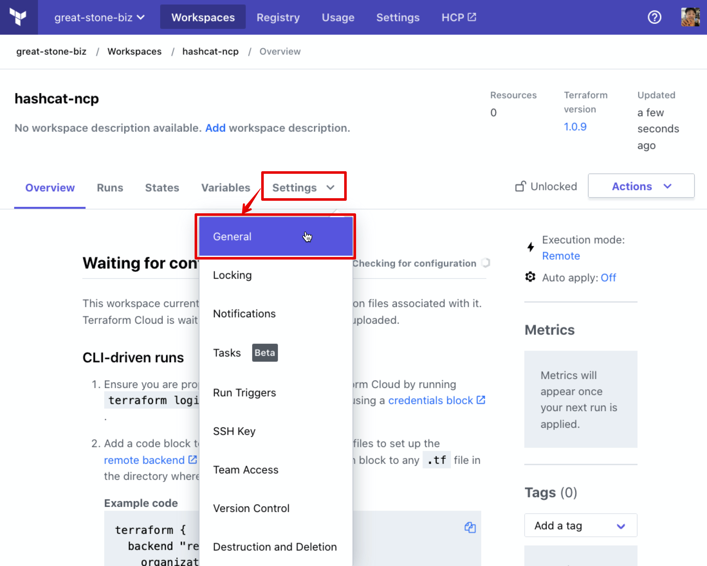
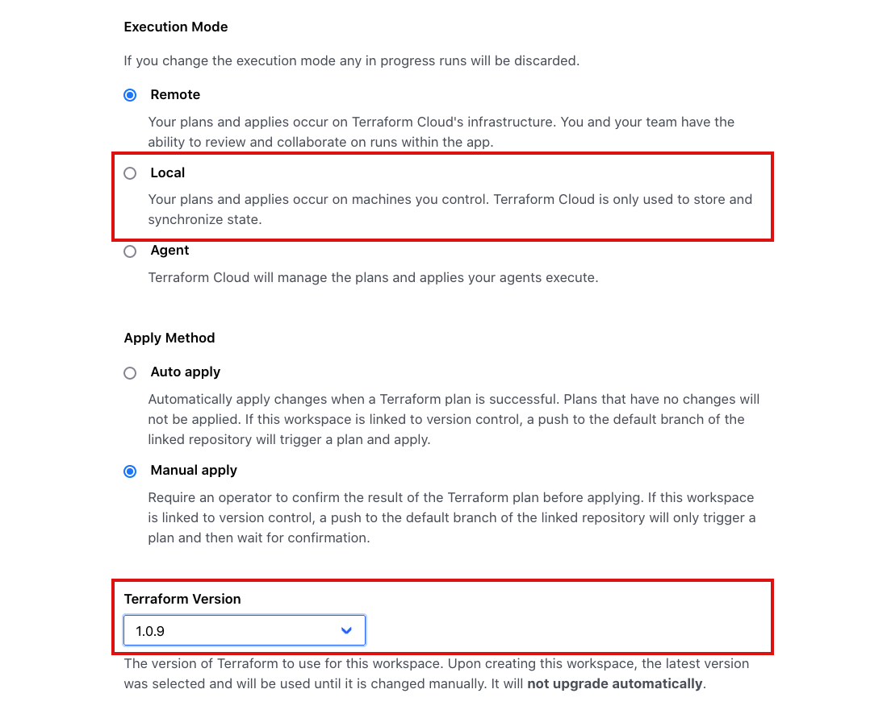
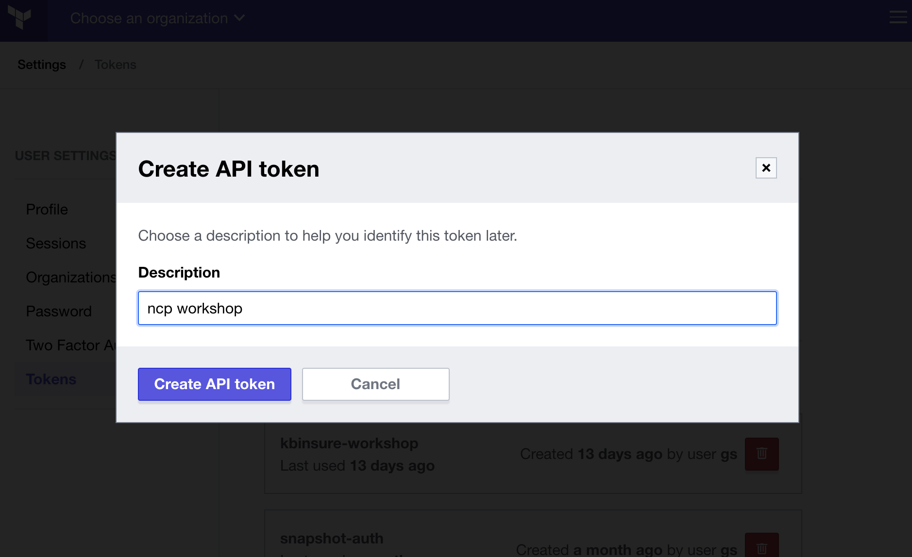
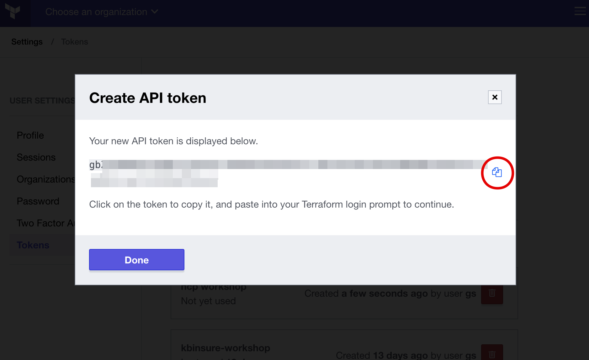
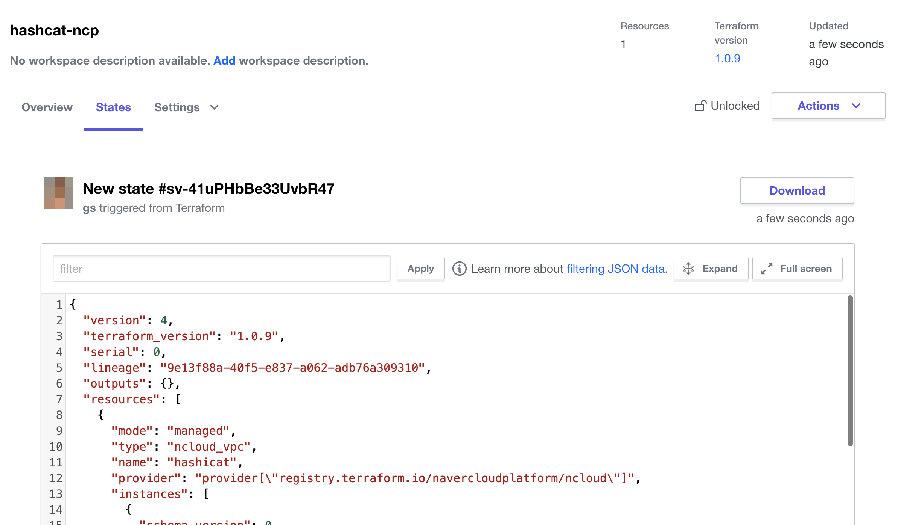
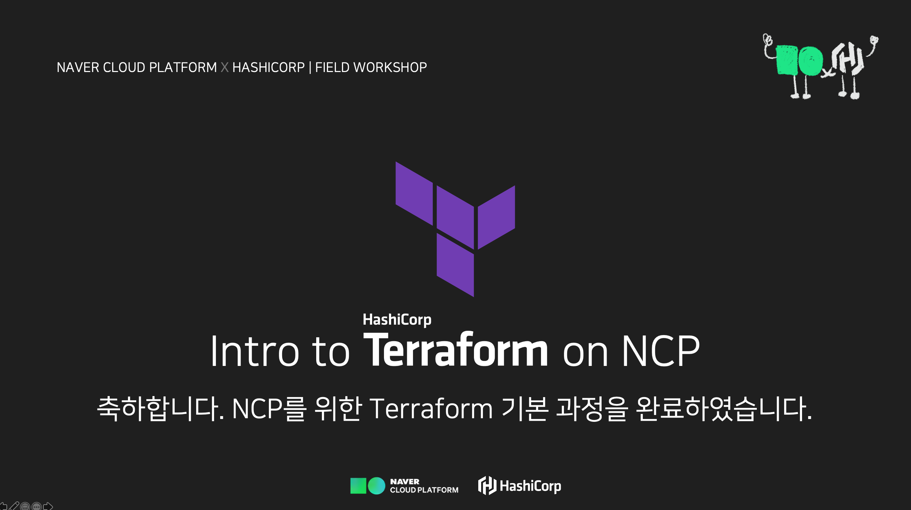

---
meta:
  - name: description
    content: Naver Cloud Platform에서의 Terraform 실습
tags: ["ncloud", "ncp", "terraform", "workshop"]

---

# :computer: Lab - Terraform Cloud 연결

### 편집기에서 열기


- VSCode를 실행하고 File(파일) 메뉴에서 `Open Folder...` 를 클릭합니다.
- 앞서 실습을 진행한 `lab02`을 열어줍니다.

---
## ☁️ Terraform Configuration

@slidestart blood

### Terraform Cloud
### Remote State 저장소는 모든 사용자에게 무료입니다.

@slideend

### Terraform Cloud 계정

Terraform Cloud는 다른 SaaS 서비스와 같이 개인을 위한 무료 플랜이 준비되어있습니다.

아직 계정이 없는 경우 계성을 생성하고 다음 실습을 진행합니다.

1. 계정 생성을 위해 <https://app.terraform.io/signup/account>로 접속합니다.
2. 필요한 정보를 입력하고 확인하여 신규 계정을 생성합니다. <button style='border-color: #3322de; background-color: #5c4ee5; color: #fff; font-size: 1rem;'>Cretea account</button>
3. 가입한 이메일로 계정 생성 확인 메시지가 도착합니다. 링크를 확인하면 Terraform Cloud를 사용할 준비가 끝났습니다.

#### :computer: Terraform Cloud를 설정합니다.

1. Terraform Cloud에 로그인하면 `YOURNAME-training` 이라는 새 조직을 만듭니다. `YOURNAME`을 자신의 이름이나 다른 텍스트로 바꾸십시오.

2. 다음으로 Workspace를 생성하라는 메시지가 표시됩니다. `CLI 기반 워크플로` 패널을 클릭하여 VCS 통합 단계를 건너뛸 수 있습니다.


3. 작업 공간의 이름을 `hashicat-ncp` 로 지정 하고 `Create workspace`를 클릭하여 새로운 Workspace를 생성합니다.

4. 터미널에서 `terraform version` 을 실행하여 버전을 확인합니다.

5. Terraform Cloud 상에 생성한 `hashicat-ncp` 의 `Settings > General` 로 이동하여 `Terraform Version`을 동일한 버전으로 구성합니다. 그리고 Execution Mode를 `Local`로 설정합니다.

:::: tabs
::: tab Setting 위치

:::
::: tab Version과 Execution Mode

:::
::::

6. `Settings` 페이지 하단에 <button style='border-color: #3322de; background-color: #5c4ee5; color: #fff; font-size: 1rem;'>Save settings</button> 버튼을 클릭하여 저장합니다.

---
## 🎛️ Configure Remote State

@slidestart blood

### "Local" 실행 모드는 Terraform의 구성과 변수는 모두 워크스테이션에 남아있습니다.

---

### "Remote" 실행 모드로 전환하게 되면 Terraform Cloud 환경의 컨테이너 환경에서 실행됩니다.

---

### "Remote" 실행 모드로 전환 시, 변수구성은 Terraform Cloud 환경에 설정해야 합니다.

@slideend

이번 실습에서는 Terraform Cloud를 Remote State Backend로 구성하여 기존 State 파일을 Terraform Cloud 환경으로 마이그레이션 합니다.

#### :computer: Remote Backend 구성하기

Workspace 디렉토리에 (`main.tf`와 같은 위치) 아래와 같은 내용으로 `remote_backend.tf` 파일을 생성합니다.

```hcl
# remote_backend.tf
terraform {
  backend "remote" {
    hostname = "app.terraform.io"
    organization = "YOURORGANIZATION"
    workspaces {
      name = "hashicat-ncp"
    }
  }
}
```

`YOURORGANIZATION`을 생성한 Organization 이름으로 수정합니다.

이후 터미널에서 `terraform login` 을 입력합니다. 로컬 환경에 Terraform Cloud와 API 인증을 위한 Token을 생성하는 과정입니다. `yes`를 입력하면 Terraform Cloud의 토큰 생성화면이 열립니다.

```bash {1}
$ terraform login
Terraform will request an API token for app.terraform.io using your browser.
...
Do you want to proceed?
  Only 'yes' will be accepted to confirm.

  Enter a value: 
```

`Create API token` 화면이 나오면 Description에 적절한 값(예: ncp workshop)을 입력한 후 <button style='border-color: #3322de; background-color: #5c4ee5; color: #fff; font-size: 1rem;'>Create API token</button> 버튼을 클릭하여 새로운 Token을 생성합니다.

:::: tabs
::: tab Token 생성하기

:::
::: tab Token 생성 후 복사

:::
::::

생성된 Token을 복사하여 앞서 터미널에 새로운 입력란인 `Enter a value: ` 에 붙여넣고 <kbd>⏎</kbd>(엔터)를 입력합니다. (입력된 값은 보이지 않습니다.)

```bash
...
Generate a token using your browser, and copy-paste it into this prompt.

Terraform will store the token in plain text in the following file
for use by subsequent commands:
    /Users/yourname/.terraform.d/credentials.tfrc.json

Token for app.terraform.io:
  Enter a value: ****************************************** 
```

해당 토큰은 터미널에 표기된 `credentials.tfrc.json` 파일에 저장됩니다.

터미널에서 `terraform init`을 실행합니다. 

State를 Terraform Cloud로 마이그레이션하라는 메시지가 표시되면 "yes"를 입력합니다.

backend가 remote로 구성됨이 성공함을 확인합니다.

```bash {1}
$ terraform init
...
Initializing the backend...

Successfully configured the backend "remote"! Terraform will automatically
use this backend unless the backend configuration changes.
...
```

이제 상태가 Terraform Cloud에 안전하게 저장됩니다. TFC UI에서 작업 영역의 "State" 탭에서 이를 확인할 수 있습니다.

변수들을 변경하면서 `terraform apply -auto-approve`를 실행하고, 상태 파일이 리소스가 변경될 때마다 변경되는 것을 지켜보십시오. Terraform Cloud UI를 사용하여 이전 상태 파일을 탐색할 수 있습니다.



---
## 🔥 Terraform Destroy

@slidestart blood

### Terraform은 인프라를 구축하는 것만큼 쉽게 인프라를 파괴할 수 있습니다.

---

### "terraform destroy"는 주의하여 사용하세요.

@slideend

#### :computer: 리소스 삭제하기

다음 명령을 실행하여 인프라를 삭제하세요.

```bash
terraform destroy
```

인프라를 삭제한다는 메시지가 표시되면 "yes"를 입력해야 합니다. 중요한 리소스가 실수로 삭제되는 것을 방지하기 위한 안전 기능입니다.

확인 버튼을 클릭하기 전에 리소스 삭제 작업이 완전히 끝날 때까지 기다리십시오.

---


