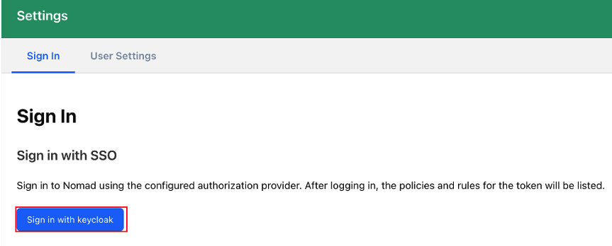
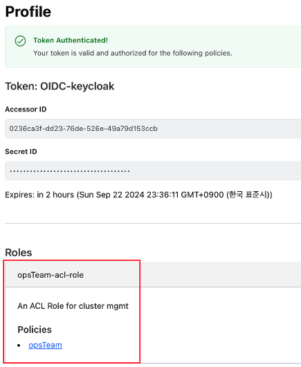
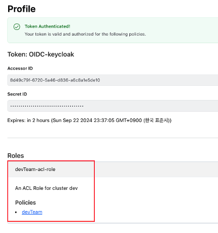
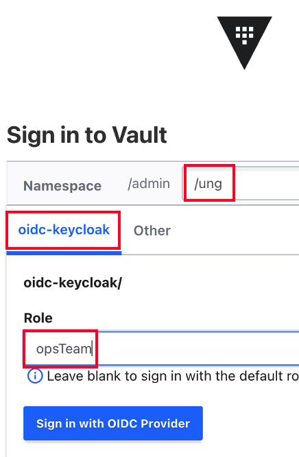
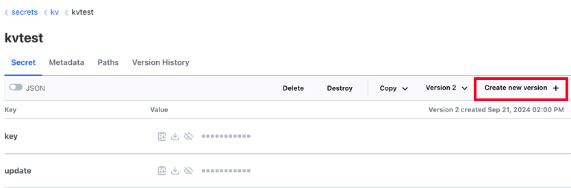
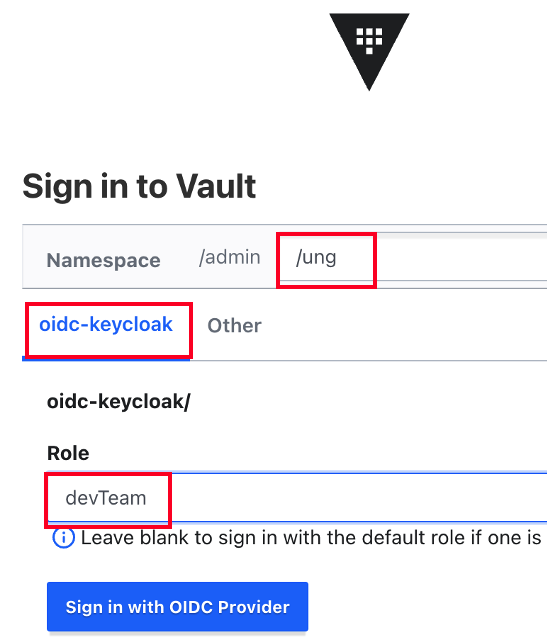
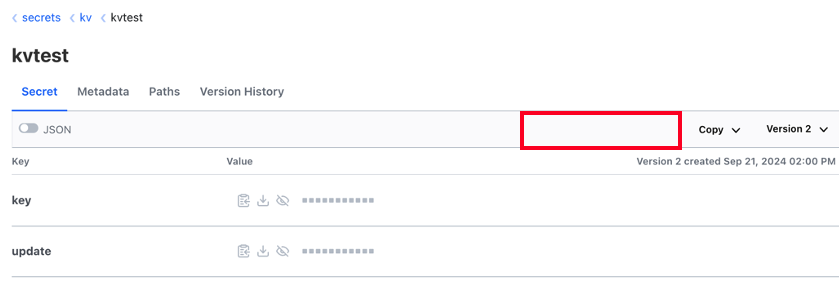

---
head:
  - - meta
    - name: Nomad, Vault를 keycloak oidc로 관리하기 with terraform
      content: 다양한 Soulution을 keycloak을 통해 oidc를 적용하고 관리
author : "unghee"
tag: ["vault", "nomad", "keycloak", "oidc", "terraform"]

---

# Nomad, Vault를 keycloak oidc로 관리하기 with terraform

요즘같이 사내에 많은 Open Source, Enterprise Soulition이 사용되는 시기에 각 Solution별로 **ID/Password를 관리하는 것**은 쉽지 않습니다.
거기다 만약 Dev, Stage, Production등의 환경별로 구축이 되어 있다면 이미 ID/Password를 저장하고 관리하는 것만 으로도 **굉장히 반복적이고 귀찮은 작업**이 될 것 입니다.

우리는 이러한 상황을 해결하기 위해 IDP(Identity Provider) Solution을 사용합니다.
다양한 IDP가 있겠으나 제가 속한 회사에서는 **Keycloak**을 사용하고 있고 그 Keycloak을 통해 
gitlab, grafana, nomad, vault의 사용자 인증 및 권한관리를 하고 있습니다. 
이 중 **Terraform code**로 구현이 완벽히 된 **Nomad와 Vault**의 Code에 대해 설명드리겠습니다.

## Keycloak 공통영역
- Realm, Users, Groups등을 미리 설정합니다.
  - Groups은 아래와 같습니다.
    - opsTeam: Write권한이 있는 사용자 그룹
    - devTeam: Read권한만 있는 사용자 그룹

### Terraform으로 Keycloak의 사전 정보를 구현
- 계정 정보는 Yaml로 관리하며, Group은 아직 두개 뿐이라 Variables로 관리합니다.
- reader, mgmt의 role 또한 여기서 생성됩니다.

```bash
#main.tf 
resource "keycloak_realm" "realm" {
  realm   = var.keycloak_realm
  enabled = true
}

resource "keycloak_user" "user_reader" {
  for_each = { for user in local.keycloak_reader["users"] : user["username"] => user }
  realm_id = keycloak_realm.realm.id
  username = each.value["username"]
  enabled  = true

  email      = each.value["email"]
  first_name = each.value["first_name"]
  last_name  = each.value["last_name"]

  initial_password {
    value     = each.value["pwd"]
    temporary = false
  }
}

resource "keycloak_user" "user_management" {
  for_each = { for user in local.keycloak_mgmt["users"] : user["username"] => user }
  realm_id = keycloak_realm.realm.id
  username = each.value["username"]
  enabled  = true

  email      = each.value["email"]
  first_name = each.value["first_name"]
  last_name  = each.value["last_name"]

  initial_password {
    value     = each.value["pwd"]
    temporary = false
  }
}

resource "keycloak_role" "realm_role" {
  realm_id    = keycloak_realm.realm.id
  name        = "nomadoidc"
  description = "My Realm Role"
}

resource "keycloak_role" "mgmt_realm_role" {
  realm_id    = keycloak_realm.realm.id
  name        = var.keycloak_mgmt
  description = "My mgmt Role"
}

resource "keycloak_role" "redaer_realm_role" {
  realm_id    = keycloak_realm.realm.id
  name        = "reader"
  description = "My redaer Role"
}


resource "keycloak_group" "reader_group" {
  realm_id = keycloak_realm.realm.id
  name     = var.keycloak_reader_group
}

resource "keycloak_group" "management_group" {
  realm_id = keycloak_realm.realm.id
  name     = var.keycloak_mgmt_group
}

locals {
  reader_usernames = [
    for user in local.keycloak_reader["users"] : user["username"]
  ]
  mgmt_usernames = [
    for user in local.keycloak_mgmt["users"] : user["username"]
  ]  
}

resource "keycloak_group_memberships" "reader_group_members" {
  realm_id = keycloak_realm.realm.id
  group_id = keycloak_group.reader_group.id

  members  = local.reader_usernames
  
}

resource "keycloak_group_memberships" "management_group_members" {
  realm_id = keycloak_realm.realm.id
  group_id = keycloak_group.management_group.id

  members  = local.mgmt_usernames
  
}

resource "keycloak_group_roles" "reader_group_roles" {
  realm_id = keycloak_realm.realm.id
  group_id = keycloak_group.reader_group.id

  role_ids   = [keycloak_role.redaer_realm_role.id]
}

resource "keycloak_group_roles" "mgmt_group_roles" {
  realm_id = keycloak_realm.realm.id
  group_id = keycloak_group.management_group.id

  role_ids   = [keycloak_role.mgmt_realm_role.id]
}


resource "keycloak_openid_client_scope" "groups" {
  realm_id = keycloak_realm.realm.id
  name     = "groups"
}

resource "keycloak_openid_user_realm_role_protocol_mapper" "user_realm_role_mapper" {
  realm_id        = keycloak_realm.realm.id
  client_scope_id = keycloak_openid_client_scope.groups.id
  name            = "groups"

  claim_name = "groups"
}

#var.tf
variable "nomad_addr" {}

variable "keycloak_addr" {}

variable "keycloak_admin_user" {}

variable "keycloak_admin_password" {}

variable "keycloak_scheme" {
  default = "https"
}

variable "keycloak_realm" {
  default = "HashiCorp"
}

variable "reader_yaml" {
  default = "reader.yaml"
}

variable "mgmt_yaml" {
  default = "mgmt.yaml"
}

locals {
  keycloak_reader = yamldecode(file(var.reader_yaml))
  keycloak_mgmt   = yamldecode(file(var.mgmt_yaml))
}

variable "keycloak_mgmt" {
  default = "mgmt"
}

variable "keycloak_reader_group" {
  default = "devTeam"
}

variable "keycloak_mgmt_group" {
  default = "opsTeam"
}
#mgmt.yaml
users:
...
users:
  - username: ung
    email: ung@mz.co.kr
    first_name: ung
    last_name: hee
    pwd: ungungung
...
#reader.yaml
users:
...
users:
  - username: gslee
    email: gs@hashicorp.com
    first_name: gs
    last_name: lee
    pwd: gsgsgsgs
...
```

## Nomad OIDC Terraform Code

### Terraform으로 Keycloak과 Nomad OIDC 설정
- Keycloak oidc client를 생성합니다.
  - valid_redirect_uri에 nomad oidc uri인 /oidc/callback, /ui/settings/tokens를 추가해줍니다.
  - Nomad Role = Keycloak Groups을 맵핑 시켜서 권한을 동기화 시킵니다.
- Nomad는 Token Base로 인증인가를 합니다.
  - Token의 각 read, write role을 만듭니다.
  - 그 role기반으로 Keycloak group과 맵핑합니다.

```bash
#keycloak.tf
resource "keycloak_openid_client" "openid_client" {
  realm_id  = var.relam_id
  client_id = "nomadoidc"

  name                  = "nomadoidc"
  enabled               = true
  standard_flow_enabled = true

  access_type = "CONFIDENTIAL"
  valid_redirect_uris = [
    "${var.nomad_scheme}://${var.nomad_addr}/oidc/callback",
    "${var.nomad_scheme}://${var.nomad_addr}/ui/settings/tokens",
    "http://localhost:4649/oidc/callback",
  ]

  login_theme = "keycloak"
}

resource "keycloak_openid_client_default_scopes" "client_default_scopes" {
  realm_id  = var.relam_id
  client_id = keycloak_openid_client.openid_client.id

  default_scopes = [
    "profile",
    "email",
    "roles",
    "groups",
    keycloak_openid_client_scope.openid_client_scope.name
  ]
}
resource "keycloak_role" "management_role" {
  realm_id    = var.relam_id
  client_id   = keycloak_openid_client.openid_client.id
  name        = "mgmt"
  description = "Management role"
}

resource "keycloak_role" "reader_role" {
  realm_id    = var.relam_id
  client_id   = keycloak_openid_client.openid_client.id
  name        = "reader"
  description = "Reader role"
}

resource "keycloak_openid_client_scope" "openid_client_scope" {
  realm_id               = var.relam_id
  name                   = keycloak_openid_client.openid_client.name
  description            = "When requested, this scope will map a user's group memberships to a claim"
  include_in_token_scope = true
}

#nomad.tf
resource "nomad_acl_auth_method" "keycloak" {
  name           = "keycloak"
  type           = "OIDC"
  token_locality = "global"
  max_token_ttl  = "150m0s"
  default        = true

  config {
    oidc_discovery_url = format("${var.keycloak_scheme}://${var.keycloak_addr}/realms/%s", var.keycloak_realm)
    oidc_client_id     = var.client_id
    oidc_client_secret = keycloak_openid_client.openid_client.client_secret
    bound_audiences = [
      var.client_id
    ]
    oidc_scopes = [
      "groups"
    ]
    allowed_redirect_uris = [
      "${var.nomad_scheme}://${var.nomad_addr}/oidc/callback",
      "${var.nomad_scheme}://${var.nomad_addr}/ui/settings/tokens",
      "http://localhost:4649/oidc/callback", // CLI로 호출하는 경우를 위해 필요
    ]
    list_claim_mappings = {
      groups = "roles"
    }
  }
}

resource "nomad_acl_binding_rule" "reader" {
  description = "reader rule"
  auth_method = nomad_acl_auth_method.keycloak.name
  selector    = "reader in list.roles"
  bind_type   = "role"
  bind_name   = nomad_acl_role.dev.name
}

resource "nomad_acl_binding_rule" "mgmt" {
  description = "management rule"
  auth_method = nomad_acl_auth_method.keycloak.name
  selector    = "mgmt in list.roles"
  bind_type   = "role"
  bind_name   = nomad_acl_role.mgmt.name
}

resource "nomad_acl_policy" "dev" {
  name = var.nomad_reader

  rules_hcl = <<EOT
namespace "*" {
  policy = "read"
  capabilities = [
    "list-jobs",
    "parse-job",
    "read-job",
    "csi-list-volume",
    "csi-read-volume",
    "list-scaling-policies",
    "read-scaling-policy"
  ]
}

EOT
}

resource "nomad_acl_role" "dev" {
  name        = "${var.nomad_reader}-acl-role"
  description = "An ACL Role for cluster dev"

  policy {
    name = nomad_acl_policy.dev.name
  }
}

resource "nomad_acl_policy" "mgmt" {
  name = var.nomad_mgmt

  rules_hcl = <<EOT
namespace "*" {
  policy = "write"
    capabilities = [
      "list-jobs",
      "parse-job",
      "read-job",
      "submit-job",
      "dispatch-job",
      "read-logs",
      "read-fs",
      "alloc-exec",
      "alloc-lifecycle",
      "csi-write-volume",
      "csi-mount-volume",
      "list-scaling-policies",
      "read-scaling-policy",
      "read-job-scaling",
      "scale-job"
  ]
}
EOT
}

resource "nomad_acl_role" "mgmt" {
  name        = "${var.nomad_mgmt}-acl-role"
  description = "An ACL Role for cluster mgmt"

  policy {
    name = nomad_acl_policy.mgmt.name
  }
}
# var.tf
variable "nomad_addr" {}

variable "keycloak_addr" {}


variable "keycloak_admin_user" {}

variable "keycloak_admin_password" {}

variable "nomad_scheme" {
  default = "https"
}

variable "nomad_region" {
  default = "global"
}

variable "keycloak_scheme" {
  default = "https"
}

variable "keycloak_realm" {
  default = "HashiCorp"
}

variable "nomad_reader" {
  default = "devTeam"
}

variable "nomad_mgmt" {
  default = "opsTeam"
}

variable "client_id" {
  default = "nomadoidc"
}
```

### 결과화면 추가

- Nomad UI에서 SSO 연동 버튼이 활성화됩니다.



- Mgmt group인 ung 계정으로 로그인 하면 opsTeam의 write권한을 할당받습니다.



- Reader group인 gslee 계정으로 로그인 하면 devTeam의 read권한을 할당받습니다.



## Vault OIDC Terraform Code

### Terraform으로 Keycloak과 Vault OIDC 설정
- Keycloak oidc client를 생성합니다.
- Vault는 entity group의 alias name과 Keycloak group name을 맵핑합니다.
  - Vault group 생성 시에는 external로 생성이 필요합니다.
  - opsTeam에는 전체 Write권한을, devTeam에는 전체 Read권한을 적용합니다.


```bash
#keycloak.tf

resource "keycloak_openid_client" "openid_client" {
  realm_id  = var.relam_id
  client_id = "vault-oidc-ung"

  name                  = "vault-oidc-ung"
  enabled               = true
  standard_flow_enabled = true

  access_type = "CONFIDENTIAL"
  valid_redirect_uris = [
    "${var.vault_url}/*"
   ]
  login_theme = "keycloak"
}

resource "keycloak_openid_user_client_role_protocol_mapper" "user_client_role_mapper" {
  realm_id  = var.relam_id
  client_id = keycloak_openid_client.openid_client.id
  name      = "ung-user-client-role-mapper"
  claim_name = format("resource_access.%s.roles",
  keycloak_openid_client.openid_client.client_id)
  multivalued = true
}

#vault.tf
resource "vault_identity_oidc_key" "keycloak_provider_key" {
  name      = "keycloak"
  algorithm = "RS256"
}

resource "vault_jwt_auth_backend" "keycloak" {
  path               = "oidc-keycloak"
  type               = "oidc"
  default_role       = "default"
  oidc_discovery_url = format("${var.keycloak_url}/realms/HashiCorp")
  oidc_client_id     = keycloak_openid_client.openid_client.client_id
  oidc_client_secret = keycloak_openid_client.openid_client.client_secret
  
  tune {
    audit_non_hmac_request_keys  = []
    audit_non_hmac_response_keys = []
    default_lease_ttl            = "1h"
    listing_visibility           = "unauth"
    max_lease_ttl                = "1h"
    passthrough_request_headers  = []
    token_type                   = "default-service"
  }
}

resource "vault_jwt_auth_backend_role" "devteam" {
  backend       = vault_jwt_auth_backend.keycloak.path
  role_name     = "devTeam"
  token_ttl     = 3600
  token_max_ttl = 3600
  token_policies = concat(["devTeam"])
  bound_audiences = [keycloak_openid_client.openid_client.client_id]
  user_claim      = "sub"
  claim_mappings = {
    preferred_username = "username"
    email              = "email"
  }
  role_type             = "oidc"
  allowed_redirect_uris = ["${var.vault_url}/ui/vault/auth/oidc-keycloak/oidc/callback", 
                            "${var.vault_url}/oidc/callback"]
  #groups_claim          = format("/resource_access/%s/roles", keycloak_openid_client.openid_client.client_id)
}

resource "vault_identity_oidc_key" "keycloak_provider_key" {
  name      = "keycloak"
  algorithm = "RS256"
}

resource "vault_jwt_auth_backend" "keycloak" {
  path               = "oidc-keycloak"
  type               = "oidc"
  default_role       = "default"
  oidc_discovery_url = format("${var.keycloak_url}/realms/HashiCorp")
  oidc_client_id     = keycloak_openid_client.openid_client.client_id
  oidc_client_secret = keycloak_openid_client.openid_client.client_secret
  
  tune {
    audit_non_hmac_request_keys  = []
    audit_non_hmac_response_keys = []
    default_lease_ttl            = "1h"
    listing_visibility           = "unauth"
    max_lease_ttl                = "1h"
    passthrough_request_headers  = []
    token_type                   = "default-service"
  }
}

resource "vault_jwt_auth_backend_role" "devteam" {
  backend       = vault_jwt_auth_backend.keycloak.path
  role_name     = "devTeam"
  token_ttl     = 3600
  token_max_ttl = 3600
  token_policies = concat(["devTeam"])
  bound_audiences = [keycloak_openid_client.openid_client.client_id]
  user_claim      = "sub"
  claim_mappings = {
    preferred_username = "username"
    email              = "email"
  }
  role_type             = "oidc"
  allowed_redirect_uris = ["${var.vault_url}/ui/vault/auth/oidc-keycloak/oidc/callback", 
                            "${var.vault_url}/oidc/callback"]
  #groups_claim          = format("/resource_access/%s/roles", keycloak_openid_client.openid_client.client_id)
}


resource "vault_jwt_auth_backend_role" "opsteam" {
  backend       = vault_jwt_auth_backend.keycloak.path
  role_name     = "opsTeam"
  token_ttl     = 3600
  token_max_ttl = 3600
  token_policies = concat(["opsTeam"])
  bound_audiences = [keycloak_openid_client.openid_client.client_id]
  user_claim      = "sub"
  claim_mappings = {
    preferred_username = "username"
    email              = "email"
  }
  role_type             = "oidc"
  allowed_redirect_uris = ["${var.vault_url}/ui/vault/auth/oidc-keycloak/oidc/callback", 
                            "${var.vault_url}/oidc/callback"]
  #groups_claim          = format("/resource_access/%s/roles", keycloak_openid_client.openid_client.client_id)
}

#------------------------------------------------------------------------------#
# Reader Vault policy
#------------------------------------------------------------------------------#

data "vault_policy_document" "devTeam_policy" {
  rule {
    path         = "*"
    capabilities = ["read", "list"]
  }
}

resource "vault_policy" "devTeam_policy" {
  name   = "devTeam"
  policy = data.vault_policy_document.devTeam_policy.hcl
}

resource "vault_identity_oidc_role" "devTeam_role" {
  name = "devTeam"
  key  = vault_identity_oidc_key.keycloak_provider_key.name
}

resource "vault_identity_group" "devTeam_group" {
  name     = "devTeam"
  type     = "external"
  policies = [
    vault_policy.devTeam_policy.name
  ]
}

resource "vault_identity_group_alias" "reader_group_alias" {
  name           = "devTeam"
  mount_accessor = vault_jwt_auth_backend.keycloak.accessor
  canonical_id   = vault_identity_group.devTeam_group.id
}

#------------------------------------------------------------------------------#
# Mgmt Vault policy
#------------------------------------------------------------------------------#


data "vault_policy_document" "opsTeam_policy" {
  rule {
    path         = "*"
    capabilities = ["create", "update", "delete", "read", "list"]
  }
}

resource "vault_policy" "opsTeam_policy" {
  name   = "opsTeam"
  policy = data.vault_policy_document.opsTeam_policy.hcl
}

resource "vault_identity_oidc_role" "opsTeam_role" {
  name = "opsTeam"
  key  = vault_identity_oidc_key.keycloak_provider_key.name
}

resource "vault_identity_group" "opsTeam_group" {
  name     = "opsTeam"
  type     = "external"
  policies = [
    vault_policy.opsTeam_policy.name
  ]
}

resource "vault_identity_group_alias" "mgmt_group_alias" {
  name           = "opsTeam"
  mount_accessor = vault_jwt_auth_backend.keycloak.accessor
  canonical_id   = vault_identity_group.opsTeam_group.id
}

```

### 결과화면

- Vault UI에서 SSO 연동 버튼이 활성화됩니다.
  - namespace는 ung, Role은 opsTeam으로 로그인합니다.



- opsTeam으로 로그인하면 Write권한이 있습니다.



- 로그아웃 후 이번에는 devTeam으로 로그인합니다.



- opsTeam과 다르게 Secret update, delete 권한이 없습니다.



### 마치며
- Terraform Provider만 있다면 즉, API만 제공된다면 위와 같이 code로 oidc 연동부터 계정 관리 및 권한 체계까지 관리할 수 있게 됩니다. 이러한 상황에 이점은 code화 된 권한 쳬게와 계정관리로 인한 휴먼 에러나 추가 생성 및 변경에 대해 이력관리 및 확장성에 이점이 있다고 보면 될 것 같습니다.