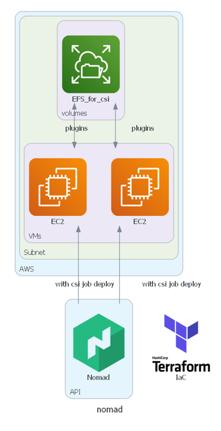

---
meta:
  - name: description
    content: Nomad CSI Sample
tags: ["Nomad", "terrafom", "CSI"]
---

# Nomad CSI Sample

- AWS에 EFS를 Nomad CSI로 활용
- full code는 아래 github를 참고
  - 참고 github: <https://github.com/Great-Stone/nomad-demo-with-ecs>
    - branches: ung



## ec2(nomad client node)에 efs의 volume관련 권한이 필요합니다.
- ec2와 efs는 같은 subnet이여야 합니다.
- vpc에는 dns관련 권한설정이 필요합니다.

<details>
<summary>ec2 iam policy</summary>
<div markdown="1">

```ruby

resource "aws_vpc" "nomad_demo" {
  cidr_block = var.vpc_cidr_block
  #dns 권한설정이 필요함
  enable_dns_support   = true
  enable_dns_hostnames = true
  tags = {
    env = "nomad"
  }
}

resource "aws_subnet" "nomad_demo" {
  cidr_block = var.vpc_cidr_block
  vpc_id     = aws_vpc.nomad_demo.id
  #efs와 az가 같아야함
  availability_zone = "ap-northeast-2a"
}

############
# Policy

data "aws_iam_policy_document" "instance_role" {
  statement {
    effect = "Allow"
    actions = [
      "sts:AssumeRole",
    ]

    principals {
      type        = "Service"
      identifiers = ["ec2.amazonaws.com"]
    }
  }
}

resource "aws_iam_role" "instance_role" {
  name_prefix        = "${var.prefix}-nomad"
  assume_role_policy = data.aws_iam_policy_document.instance_role.json
}

resource "aws_iam_role" "instance_role" {
  name_prefix        = "${var.prefix}-nomad"
  assume_role_policy = data.aws_iam_policy_document.instance_role.json
}

resource "aws_iam_instance_profile" "test_profile" {
  name = "test_profile"
  role = aws_iam_role.instance_role.name
}

resource "aws_iam_role_policy" "cluster_discovery" {
  name   = "${var.prefix}-nomad-cluster_discovery"
  role   = aws_iam_role.instance_role.id
  policy = data.aws_iam_policy_document.cluster_discovery.json
}

data "aws_iam_policy_document" "cluster_discovery" {
  # allow role with this policy to do the following: list instances, list tags, autoscale
  statement {
    effect = "Allow"
    actions = [
      "ec2:DescribeInstances",
      "autoscaling:CompleteLifecycleAction",
      "ec2:DescribeTags",
      "ecs:ListClusters",
      "ecs:DescribeClusters",
      "ecs:DeregisterContainerInstance",
      "ecs:ListContainerInstances",
      "ecs:RegisterContainerInstance",
      "ecs:SubmitContainerStateChange",
      "ecs:SubmitTaskStateChange",
      "ecs:DescribeContainerInstances",
      "ecs:DescribeTasks",
      "ecs:ListTasks",
      "ecs:UpdateContainerAgent",
      "ecs:StartTask",
      "ecs:StopTask",
      "ecs:RunTask",
      "elasticfilesystem:ClientMount",
      "elasticfilesystem:ClientWrite",
      "elasticfilesystem:ClientRootAccess"
    ]
    resources = ["*"]
  }
}
```
</div>
</details>

<details>
<summary>efs volume and iam policy</summary>
<div markdown="1">

```ruby

############
#EFS

resource "aws_iam_role_policy" "mount_efs_volumes" {
  name   = "mount-efs-volumes"
  role   = aws_iam_role.instance_role.id
  policy = data.aws_iam_policy_document.mount_efs_volumes.json
}

data "aws_iam_policy_document" "mount_efs_volumes" {
  statement {
    effect = "Allow"

    actions = [
      "ec2:DescribeInstances",
      "ec2:DescribeTags",
      "ec2:DescribeVolumes",
      "ec2:AttachVolume",
      "ec2:DetachVolume",
    ]
    resources = ["*"]
  }
}

# csi efs volume
resource "aws_efs_file_system" "nomad_csi" {
  creation_token = "nomad-csi"
  performance_mode = "generalPurpose"
  throughput_mode  = "bursting"

  tags = {
    Name = "nomad-csi"
  }
  #az가 ec2와 동일해야함
  availability_zone_name = "ap-northeast-2a"
}

#ec2와 subnet이 같아야함
resource "aws_efs_mount_target" "nomad_efs" {
  file_system_id = aws_efs_file_system.nomad_csi.id
  subnet_id      = aws_subnet.nomad_demo.id
  security_groups = [ aws_security_group.efs.id ] 
}

resource "aws_security_group" "efs" {
  name        = "allow_efs"
  description = "Allow EFS inbound traffic"
  vpc_id      = aws_vpc.nomad_demo.id

  ingress {
    description = "TLS from VPC"
    from_port   = 443
    to_port     = 443
    protocol    = "tcp"
    cidr_blocks = [ "0.0.0.0/0" ]
  }

  egress {
    from_port   = 0
    to_port     = 0
    protocol    = "-1"
    cidr_blocks = ["0.0.0.0/0"]
  }

  tags = {
    Name = "allow_tls"
  }
}
```

</div>
</details>

## nomad csi create
- nomad csi job을 배포합니다.
- plugins을 생성합니다.

<details>
<summary>nomad csi create</summary>
<div markdown="1">

```ruby
#efs csi job을 생성
resource "nomad_job" "nomad_csi_node_job" {
  jobspec = file("./job_file/csi-node.tpl")
}

resource "time_sleep" "wait_30_seconds" {
  depends_on = [nomad_job.nomad_csi_node_job]
  create_duration = "30s"
}

#생성된 plugin을 기다림
data "nomad_plugin" "efs" {
  depends_on = [time_sleep.wait_30_seconds]
  plugin_id        = "aws-efs0"
  wait_for_registration = true
}

#efs volume을 nomad에서 사용할 수 있게 plugins을 생성
resource "nomad_volume" "efs_csi_volume" {
  depends_on  = [data.nomad_plugin.efs]
  type        = "csi"
  plugin_id   = "aws-efs0"
  volume_id   = "efs_csi_volume"
  name        = "efs_csi_volume"
  external_id = data.terraform_remote_state.net.outputs.nomad_efs_name.id

  capability {
    access_mode     = "single-node-writer"
    attachment_mode = "file-system"
  }

  mount_options {
    fs_type = "ext4"
  }
}
```

</div>
</details>


