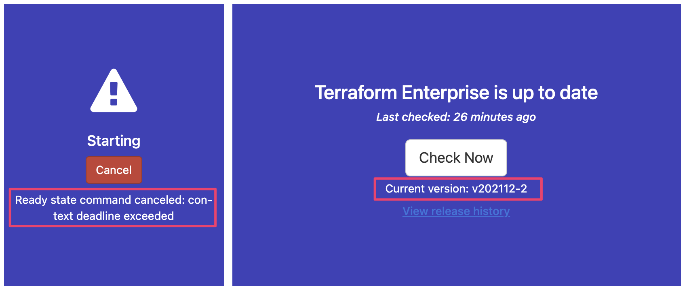

# TFE Release v202111-1 (582) Issue
> v202111-1 (582) 버전 이상으로 설치, 또는 업그레이드 시 발생하는 이슈

## 현상

|Nginx access Log|
|-|
|2021/12/17 02:58:31 [error] 10#10: *913 connect(0mfailed (111: Connection refused) while connecting to upstream, client: 10.10.10.100, server:tfe.mydomain.com, reguest: "GET / HTTP/1.1", upstream: "http://172.11.0.1:9292/", host: "tfe.mydomain.com"|

|Ptfe_atlas Log|
|-|
|ExecJS::RuntimeUnavailable: Could not find a JavaScript runtime. see https://github.com/rails/execjs for a list fo available runtimes.|

## v202111-1 (582) Release

v202111-1 (582) Release를 기점으로 TFE 내 포함된 container 들에 대한 update 가 있었으며, 해당 update 는 Alpine 3.14 를 사용하게 되는데 이는 특정 버전 이상의 'docker' 와 'libsecomp' 를 요구합니다. (docker - 20.10.0 이상 / libsecomp - 2.4.4 이상)

- TFE Release v202111-1 (582) : <https://www.terraform.io/enterprise/release/v202111-1>
- Release Notes for Alpine 3.14.0 : <https://wiki.alpinelinux.org/wiki/Release_Notes_for_Alpine_3.14.0#faccessat2>