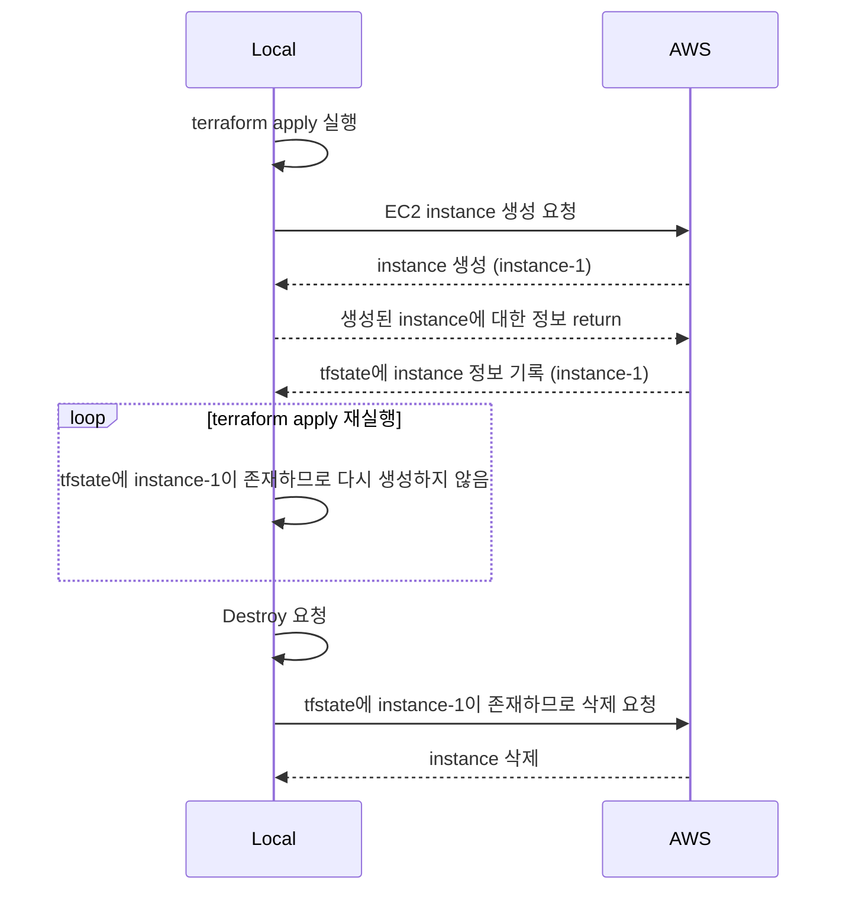
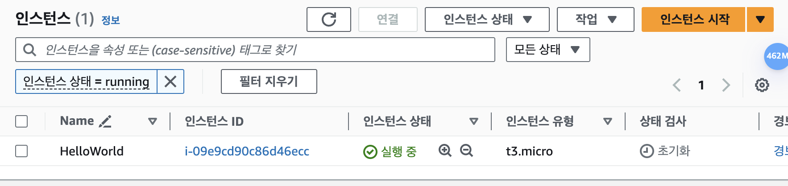

# Terraform Apply Aborted - Tainted

## 정상 동작의 예



## Terraform Apply 도중 네트워크가 끊긴다면?

클라우드들의 API의 경우 대부분 Sync로 동작하므로, Terraform이 생성 요청을 하면 그에 대한 응답을 받습니다. AWS의 경우 네트워크가 단절 되더라도, 이미 요청한 API 대한 응답을 AWS에서 반환하므로 timeout으로 인한 에러가발생 한 이후 응답을 기준으로 State가 작성됩니다. 다만 정상적인 완료 응답을 받지 못했으므로 Terraform State에는 해당 리소스는 `tainted`(불확실한) 상태로 기록됩니다.

Apply 후 Creating되는 도중 네트워크 절체하면 발생하는 에러 메시지는 다음과 같습니다.

```bash:no-line-numbers
Plan: 1 to add, 0 to change, 0 to destroy.
aws_instance.web: Creating...
aws_instance.web: Still creating... [10s elapsed]
aws_instance.web: Still creating... [20s elapsed]
aws_instance.web: Still creating... [30s elapsed]
aws_instance.web: Still creating... [40s elapsed]
aws_instance.web: Still creating... [50s elapsed]
╷
│ Error: getting attribute (userData): RequestError: send request failed
│ caused by: Post "https://ec2.ap-northeast-2.amazonaws.com/": dial tcp: lookup ec2.ap-northeast-2.amazonaws.com: no such host
│ 
│   with aws_instance.web,
│   on main.tf line 21, in resource "aws_instance" "web":
│   21: resource "aws_instance" "web" {
```

오류 이후 작성되는 State 및 `tainted`상태의 리소스(aws_instance) 정보는 다음과 같습니다.

```json:no-line-numbers {15}
{
  "version": 4,
  "terraform_version": "1.8.0",
  "serial": 6,
  "lineage": "2c770c35-18c5-035d-b7f2-b569d6b326d6",
  "outputs": {},
  "resources": [
    {
      "mode": "managed",
      "type": "aws_instance",
      "name": "web",
      "provider": "provider[\"registry.terraform.io/hashicorp/aws\"]",
      "instances": [
        {
          "status": "tainted",
          "schema_version": 1,
          "attributes": {
            "ami": "ami-01ed8ade75d4eee2f",
            "arn": "arn:aws:ec2:ap-northeast-2:467567795630:instance/i-09e9cd90c86d46ecc",
            "associate_public_ip_address": true,
            "availability_zone": "ap-northeast-2a",
       ...
            "id": "i-09e9cd90c86d46ecc",
       ...
      ]
    }
  ],
  "check_results": null
}
```

이미 AWS에 EC2 인스턴스 생성을 요청한 상태에서 네트워크 단절이 발생하였기 때문에 AWS상에는 EC2의 생성이 진행됩니다.



## 복구 방안

> untaint : <https://developer.hashicorp.com/terraform/cli/commands/untaint>
> import : <https://developer.hashicorp.com/terraform/cli/commands/import>

정상적으로 동기화되지 않은 경우(tainted)라 `terraform plan` 실행 시 replace가 발생합니다.

```bash:no-line-numbers
$ terraform plan
aws_instance.web: Refreshing state... [id=i-09e9cd90c86d46ecc]

Terraform used the selected providers to generate the following execution plan.
Resource actions are indicated with the following symbols:
-/+ destroy and then create replacement

Terraform will perform the following actions:

  # aws_instance.web is tainted, so must be replaced
-/+ resource "aws_instance" "web" {
      ~ arn                                  = "arn:aws:ec2:ap-northeast-2:467567795630:instance/i-09e9cd90c86d46ecc" -> (known after apply)
      ~ associate_public_ip_address          = true -> (known after apply)
      ~ availability_zone                    = "ap-northeast-2a" -> (known after apply)
      ~ cpu_core_count                       = 1 -> (known after apply)
      ~ cpu_threads_per_core                 = 2 -> (known after apply)
      ~ disable_api_stop                     = false -> (known after apply)
      ~ disable_api_termination              = false -> (known after apply)
      ~ ebs_optimized                        = false -> (known after apply)
      - hibernation                          = false -> null
      ...
```

리소스가 의도한 경우로 생성된 경우 tainted된 리소스를 `untaint` 하여 State 기준으로 `tainted` 상태를 복구하거나 `terraform import`를 사용하여 State를 생성된 형상 기준으로 맞춰주는 작업이 필요합니다.