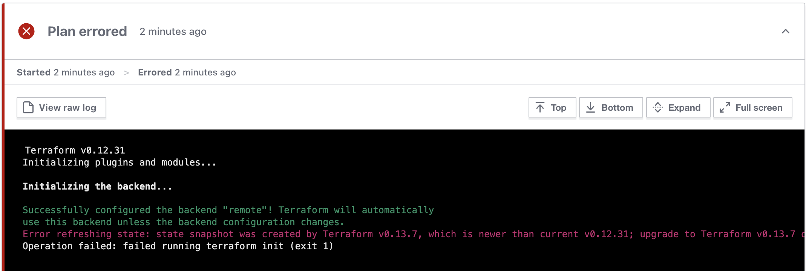
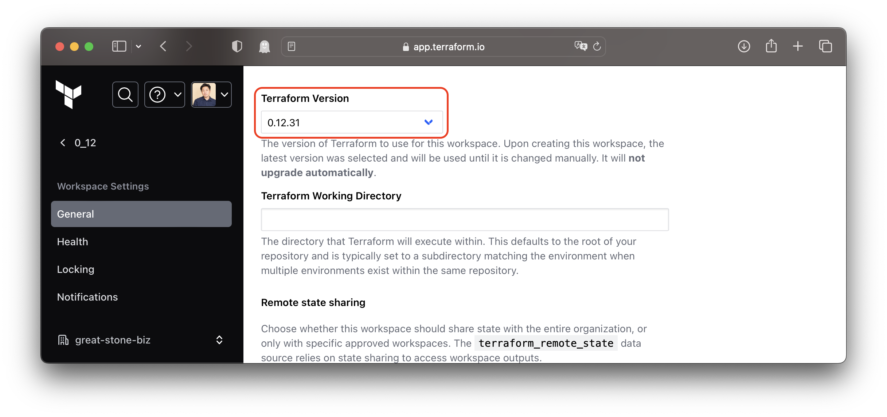

# Error: state snapshot was created by Terraform vX.Y.Z

|Log|
|-|
|Error: state snapshot was created by Terraform v0.13.2, which is newer than current v0.12.26; upgrade to Terraform v0.13.2 or greater to work with this state|

- 버전관련 에러 메시지에 대해 몇가지 테스트 해본 결과, 상위버전으로 Terraform State가 생성 된 이후 하위 버전으로  Refresh/Plan/Apply 를 수행하는 경우에 발생하는 것으로 확인
- `terraform_remote_state` 는 버전에 관계 없이 워크스페이스 간에 output을 읽어올 수 있음을 확인

## Example

- 0.12.x 로 생성된 state에서 0.13.x로 Refresh/Plan/Apply 수행 시 state의 버전이 업그레이드 됨
- 0.13.x 로 생성된 state에서 0.12.x로 Refresh/Plan/Apply 수행 시 동일한 에러 발생
  
- 0.13.x로 생성된 state를 "terraform_remote_state"로 다른 0.12.x인 워크스페이스에서 읽어오는 경우 정상적으로 동작

따라서, 관련 에러가 발생한 워크스페이스의 설정에서 최종적으로 생서된 state의 버전과 동일한 실행 버전인지 확인이 필요하다. (아래 캡쳐와 같이 State 버전이 설정의 Terraform Version 보다 높은 경우 에러 발생)

```json {2}
{
  "version": 4,
  "terraform_version": "0.13.7",
  "serial": 3,
  "lineage": "83b1b4d5-826a-ecc9-ce4a-ea41f06f93af",
  "outputs": {
    "uuid_from_0_13": {
      "value": "34ee63e3-860b-1a1b-c0fa-1546f922be5a-0.12",
      "type": "string"
    }
  },
  "resources": [
    {
      "mode": "data",
      "type": "terraform_remote_state",
      "name": "v0_13",
      "provider": "provider[\"terraform.io/builtin/terraform\"]",
      "instances": [
        
      ]
    }
  ]
}
```

::: code-tabs#shell

@tab CLI

```bash
$ terraform version
Terraform v0.12.31
```

@tab TFC/TFE



:::