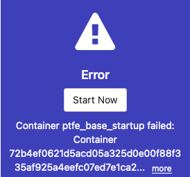

# TFE 재설치 주의사항

> 관련 Knowledge Base Article : <https://support.hashicorp.com/hc/en-us/articles/4409044739859-Container-ptfe-base-startup-failed>

기존에 설치되어 있는 TFE를 백업받고, 업그레이드 작업을 하는 경우 반드시 enc_password를 저장 후 작업하시기 바랍니다.  그렇지 않은 경우, 아래와 같이 ptfe_base_startup failed 때문에 구성이 불가할 수 있습니다. 

보통 Automated Install (silent install)을 하는 경우 Application Settings에 지정 후 설치하게 되어 해당 파일에 enc_password 값이 저장됩니다. (<https://www.terraform.io/enterprise/install/automated/automating-the-installer#application-settings>)

설치 시 사용한 TF 코드나 수작업을 생성한 settings.json 파일을 잘 보관하셔서 upgrade나 복구 시 이용할 수 있도록 준비하시는 게 나을 듯 합니다.

