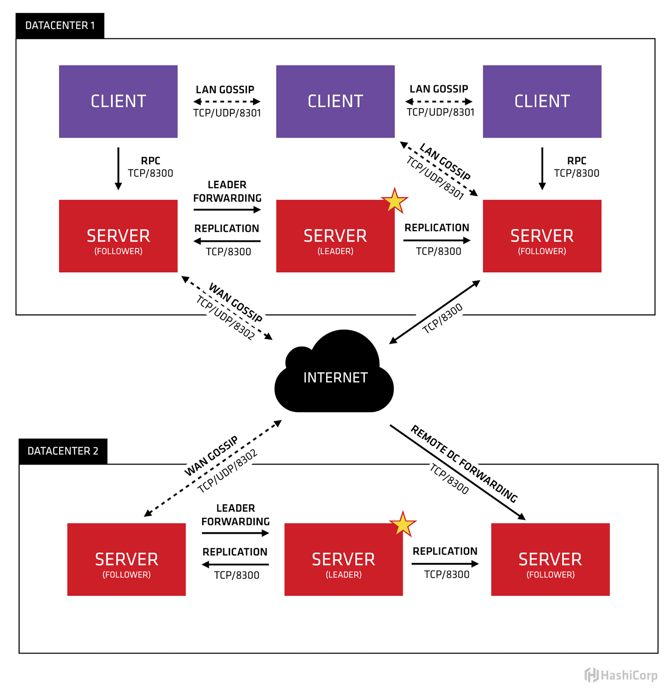

---
meta:
  - name: description
    content: Consul 구성 포트 정보
tags: ["consul", "port", "requirement"]
---

# Consul Port
> <https://www.consul.io/docs/install/ports>

## Consul 포트

### Port Table

| Use                                                          | Default Ports    |
| :----------------------------------------------------------- | :--------------- |
| DNS (TCP and UDP)                            | 8600             |
| HTTP (TCP Only)                                | 8500             |
| HTTPS (TCP Only)                                         | disabled (8501)* |
| gRPC (TCP Only)                                           | disabled (8502)* |
| LAN Serf (TCP and UDP)                    | 8301             |
| Wan Serf (TCP and UDP)                    | 8302             |
| server (TCP Only)                        | 8300             |
| Sidecar Proxy Min: 자동으로 할당된 사이드카 서비스 등록에 사용할 포함 최소 포트 번호 | 21000            |
| Sidecar Proxy Max: 자동으로 할당된 사이드카 서비스 등록에 사용할 포괄적인 최대 포트 번호 | 21255            |

### Port 정보

- DNS : DNS 쿼리 포트
- HTTP API : API 요청 포트
- HTTPS API (옵션) : API 요청 포트로 TLS 적용시 활성화
- gRPC API (옵션) : xDS API를 Envoy 프록시에서 연결하는데 사용되며, 서비스메시 구성시 필수
- Serf LAN : Gossip 프로토콜을 위한 포트로 LAN 구성에서 사용
- Serf WAN : Gossip 프로토콜을 위한 포트로 WAN 구성(Federation)에서 사용
- Server RPC : Consul Client가 Server에 연결하기위한 포트