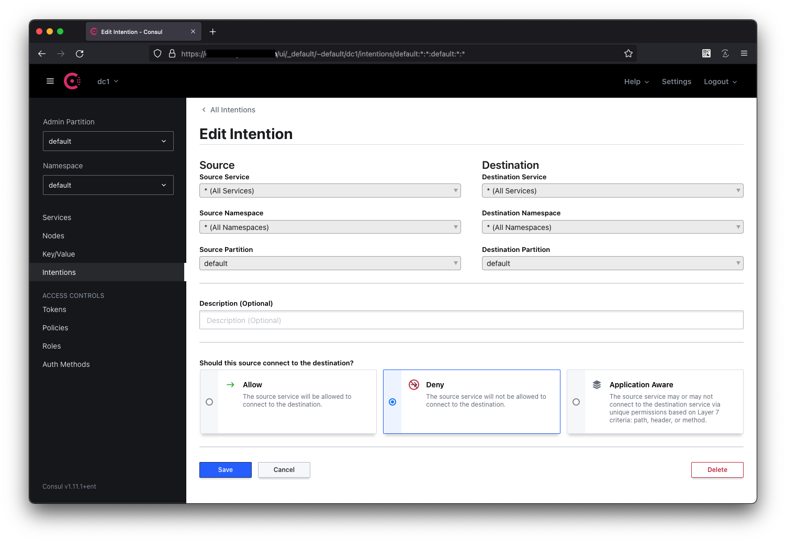
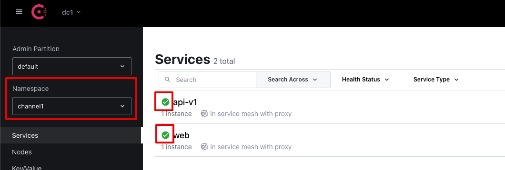
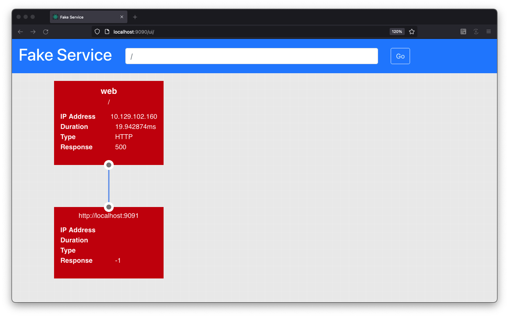
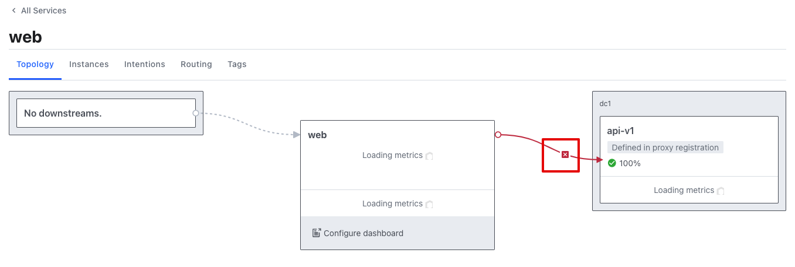
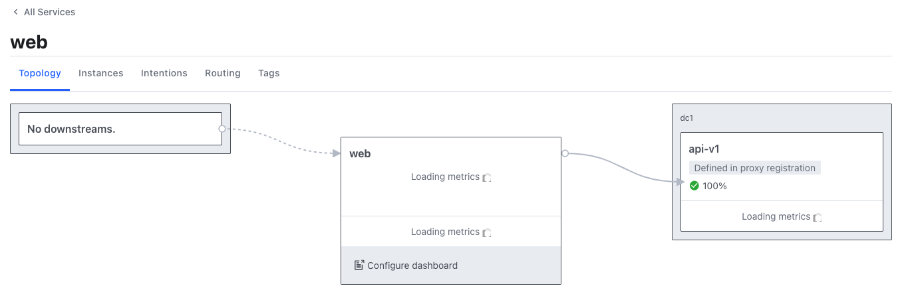
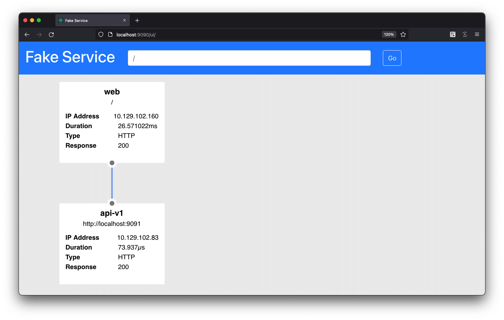

# 02. SideCar

:::tip
실습을 위한 조건은 다음과 같습니다.

- Consul 이 구성된 Kubernetes 환경
- 설치 구성 시 `connectInject` 이 활성화 되어있어야 합니다.
:::

> 참고 : <https://learn.hashicorp.com/tutorials/consul/service-mesh-application-secure-networking?in=consul/kubernetes>

Consul 서비스 메시를 사용하면 애플리케이션을 제로 트러스트 네트워크에 배포할 수 있습니다. 제로 트러스트 네트워크는 아무 것도 자동으로 신뢰되지 않는 네트워크입니다. 모든 연결은 인증과 승인을 모두 받아야 합니다. 이 패러다임은 동일한 네트워크에서 다수의 서비스가 실행될 수 있는 마이크로서비스 및 멀티 클라우드 환경에서 중요합니다. Consul 서비스 메시를 사용하면 mTLS를 사용하여 서비스 ID를 인증하고 의도를 사용하여 서비스 작업을 승인하거나 차단할 수 있습니다.

이 튜토리얼에서는 두 개의 서비스 `web`및 `api`를 Kubernetes 클러스터에서 실행되는 Consul의 서비스 메시에 배포합니다. 두 서비스는 Consul을 사용하여 서로를 검색하고 사이드카 프록시를 사용하여 mTLS를 통해 통신합니다. 두 서비스는 웹UI와 백엔드 서비스로 구성된 간단한 2-tier 애플리케이션으로 HTTP를 통해 서비스와 통신합니다.


## Sidecar Proxy

Sidecar Proxy는 애플리케이션 컨테이너와 함께 동일 Pod상에 배포됨으로 localhost 로 통신할 수 있습니다. 사용자가 다른서비스에 대한 요청을 Sidecar Proxy에 지정하면 해당 요청을 맵핑된 다른 서비스로 전달합니다. 이 방식은 기존 개발자가 로컬에서 개발하는 환경과 동일하게 동작합니다. UI웹을 로컬 9090포트로 실행하고 백엔드 앱을 8080 포트로 실행한경우 UI웹은 백엔드 앱을 `localhost:8080` 으로 호출합니다. Consul Sidecar Proxy는 localhost 로 요청되는 포트를 지정한 `Upstream` 서비스로 전달하는 규칙을 처리하며, 여기에는 mTLS가 자동으로 구성됩니다.

## Intention 규칙 추가

Sidecar Proxy의 서비스 접근 제어를 위해 모든 서비스에 대한 Deny 구성을 수행합니다. UI의 좌측 메뉴의 `Intention`을 클릭하고 우측의 `Create` 버튼을 클릭하여 모든 서비스 (엔터프라이즈의 경우 모든 Namespace 포함) 간에 Deny 규칙을 생성합니다.



## Service 구성

테스트 구성을 저장하기 위한 디렉토리를 생성합니다.

```bash
mkdir ./k8s_config
```

### 백엔드 서비스

```bash
cat > ./k8s_config/api.yaml <<EOF
apiVersion: v1
kind: ServiceAccount
metadata:
  name: api-v1
---
apiVersion: v1
kind: Service
metadata:
  name: api-v1
spec:
  selector:
    app: api-v1
  ports:
    - port: 9091
      targetPort: 9091
---
apiVersion: apps/v1
kind: Deployment
metadata:
  name: api-v1
  labels:
    app: api-v1
spec:
  replicas: 1
  selector:
    matchLabels:
      app: api-v1
  template:
    metadata:
      labels:
        app: api-v1
      annotations:
        consul.hashicorp.com/connect-inject: 'true'
    spec:
      serviceAccountName: api-v1
      containers:
        - name: api
          image: nicholasjackson/fake-service:v0.7.8
          ports:
            - containerPort: 9091
          env:
            - name: 'LISTEN_ADDR'
              value: '127.0.0.1:9091'
            - name: 'NAME'
              value: 'api-v1'
            - name: 'MESSAGE'
              value: 'Response from API v1'
EOF
```

### 프론트엔드 서비스

```bash
cat > ./k8s_config/web.yaml <<EOF
apiVersion: v1
kind: ServiceAccount
metadata:
  name: web
---
apiVersion: v1
kind: Service
metadata:
  name: web
spec:
  selector:
    app: web
  ports:
    - port: 9090
      targetPort: 9090
---
apiVersion: apps/v1
kind: Deployment
metadata:
  name: web-deployment
  labels:
    app: web
spec:
  replicas: 1
  selector:
    matchLabels:
      app: web
  template:
    metadata:
      labels:
        app: web
      annotations:
        consul.hashicorp.com/connect-inject: 'true'
        consul.hashicorp.com/connect-service-upstreams: 'api-v1:9091'
    spec:
      serviceAccountName: web
      containers:
        - name: web
          image: nicholasjackson/fake-service:v0.7.8
          ports:
            - containerPort: 9090
          env:
            - name: 'LISTEN_ADDR'
              value: '0.0.0.0:9090'
            - name: 'UPSTREAM_URIS'
              value: 'http://localhost:9091'
            - name: 'NAME'
              value: 'web'
            - name: 'MESSAGE'
              value: 'Hello World'
EOF
```

프론트엔드 서비스에 `Deployment` 구성 내용의 `annotation` 을 확인하세요. 이 형식은 9091로 요청된 localhost로의 요청을 sidecar가 `api-v1`서비스로 전달하는 것을 의미합니다.

- `consul.hashicorp.com/connect-service-upstreams: 'api-v1:9091'`

## 서비스 배포 및 등록 확인

`kubectl apply` 명령을 통해 배포를 확인하고 Consul UI에서 확인합니다.

```bash
kubectl apply -f ./k8s_config/api.yaml
```
```bash
# 출력
serviceaccount/api-v1 created
service/api-v1 created
deployment.apps/api-v1 created
```
```bash
kubectl apply -f ./k8s_config/web.yaml
```
```bash
# 출력
serviceaccount/web created
service/web created
deployment.apps/web-deployment created
```

UI에 접속하고 좌측 Namespace에서 사용중인 Namespace를 확인합니다. 서비스 목록에 `api-v1`, `web` 이 등록되고 상태가 정상임을 확인합니다.



`port-forward`를 통해 로컬에서 web 앱을 확인합니다.

```bash
kubectl port-forward service/web 9090:9090 --address 0.0.0.0
```
```bash
# 출력
Forwarding from 0.0.0.0:9090 -> 9090
```


http://localhost:9090/ui 에 브라우저로 접속하여 상태를 확인합니다.



500 에러가 발생하였습니다. Consul Service Mesh는 서비스간 의도적으로 접속 가능여부를 동적으로 통제합니다. 이 기능을 `Intention` 이라고 부릅니다.    Consul UI에 접속하여 `web` 서비스 이름을 클릭하면 다음과 같이 요청이 거부되어 있는것을 확인할 수 있습니다.

Intention 수정을 위해서는 권한이 필요합니다. 현재 환경에서는 전달받은 token (3108cbb3-005c-a3e4-9a42-6f13d1f5e4e6) 을 우측 상단 로그인에서 입력합니다.



`x` 표시를 클릭하여 `Create` 버튼을 클릭하여 Intention 규칙을 생성합니다. 이후에 연결이 허용된것을 확인할 수 있습니다.



다시 http://localhost:9090/ui 에 브라우저로 접속하여 상태를 확인합니다.



다음 과정을 진행하기 위해 기존 적용된 구성을 삭제합니다.

```bash
kubectl delete -f ./k8s_config
```
```bash
# 출력
serviceaccount "api-v1" deleted
service "api-v1" deleted
deployment.apps "api-v1" deleted
serviceaccount "web" deleted
service "web" deleted
deployment.apps "web-deployment" deleted
```

## With Namespace (Ent)

백엔드 서비스를 다른 Namespace에 배포하고, 프론트엔드가 해당 백엔드에 접근할 수 있도록 수정합니다.

### 프론트엔드 서비스

```bash
cat > ./k8s_config/web.yaml <<EOF
apiVersion: v1
kind: ServiceAccount
metadata:
  name: web
---
apiVersion: v1
kind: Service
metadata:
  name: web
spec:
  selector:
    app: web
  ports:
    - port: 9090
      targetPort: 9090
---
apiVersion: apps/v1
kind: Deployment
metadata:
  name: web-deployment
  labels:
    app: web
spec:
  replicas: 1
  selector:
    matchLabels:
      app: web
  template:
    metadata:
      labels:
        app: web
      annotations:
        consul.hashicorp.com/connect-inject: 'true'
        consul.hashicorp.com/connect-service-upstreams: 'api-v1.<namespace>:9091'
    spec:
      serviceAccountName: web
      containers:
        - name: web
          image: nicholasjackson/fake-service:v0.7.8
          ports:
            - containerPort: 9090
          env:
            - name: 'LISTEN_ADDR'
              value: '0.0.0.0:9090'
            - name: 'UPSTREAM_URIS'
              value: 'http://localhost:9091'
            - name: 'NAME'
              value: 'web'
            - name: 'MESSAGE'
              value: 'Hello World'
EOF
```

프론트엔드 서비스에 `Deployment` 구성 내용의 `annotation` 을 확인하세요. 이 형식은 9091로 요청된 localhost로의 요청을 sidecar가 `<namespace>` Namespace의 `api-v1`서비스로 전달하는 것을 의미합니다.

- `consul.hashicorp.com/connect-service-upstreams: 'api-v1.<namespace>:9091'`

또한 Namespace 간 Intention을 작성하여 적용해야합니다.

## 정리

- 이 단계에서는 두개의 앱을 이용하여 Service Mesh를 구성하기위한 Sidecar Proxy를 통해 통신하는 방식을 확인하였습니다.
- Sidecar Proxy에는 Consul이 정책을 주입할 수 있으므로, 기존 Firewall 방식이 아닌 서비스간 의도적인 연결의 정의를 통해 허용/비허용 됨을 확인하였습니다.


:::tip 참고 - Intention 순위

범위가 좁을수록 우선순위가 높습니다.

| Source Namespace | Source Name | Destination Namespace | Destination Name | 높을수록 서열 높음 |
| ---------------- | ----------- | --------------------- | ---------------- | ------------- |
| Exact            | Exact       | Exact                 | Exact            | 9             |
| Exact            | `*`         | Exact                 | Exact            | 8             |
| `*`              | `*`         | Exact                 | Exact            | 7             |
| Exact            | Exact       | Exact                 | `*`              | 6             |
| Exact            | `*`         | Exact                 | `*`              | 5             |
| `*`              | `*`         | Exact                 | `*`              | 4             |
| Exact            | Exact       | `*`                   | `*`              | 3             |
| Exact            | `*`         | `*`                   | `*`              | 2             |
| `*`              | `*`         | `*`                   | `*`              | 1             |
:::