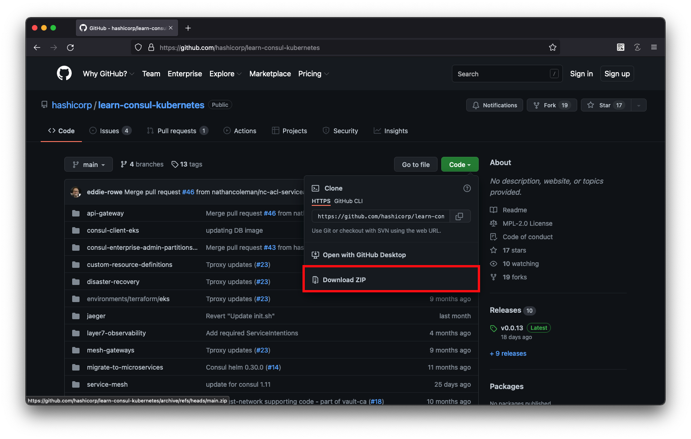
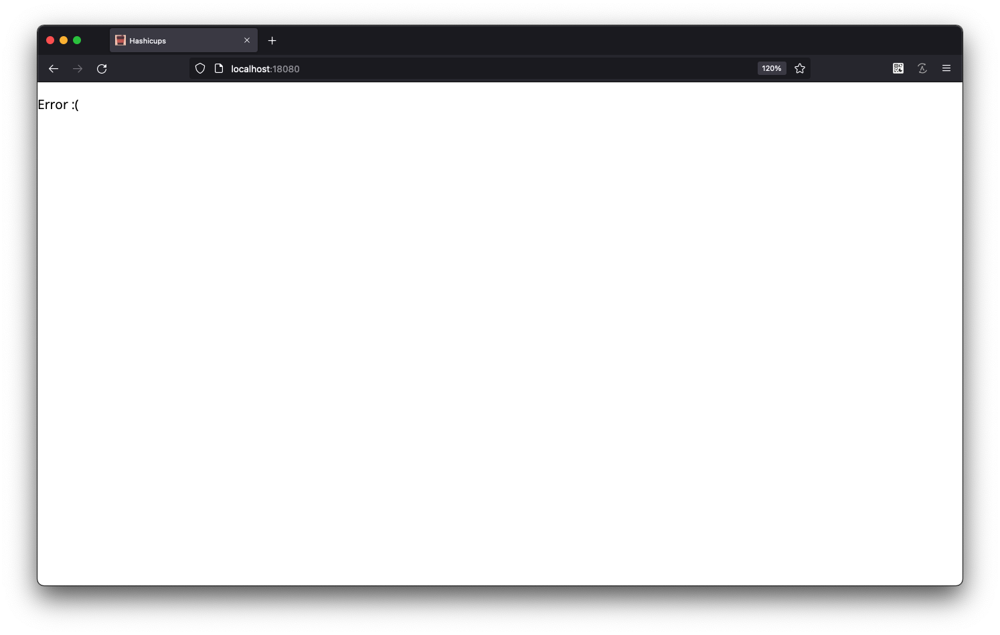
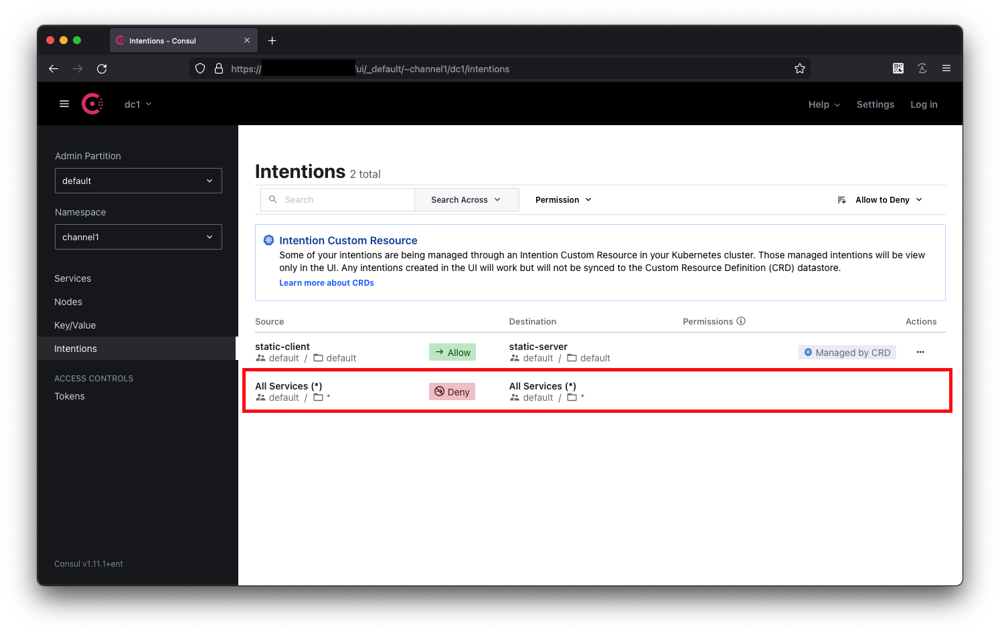
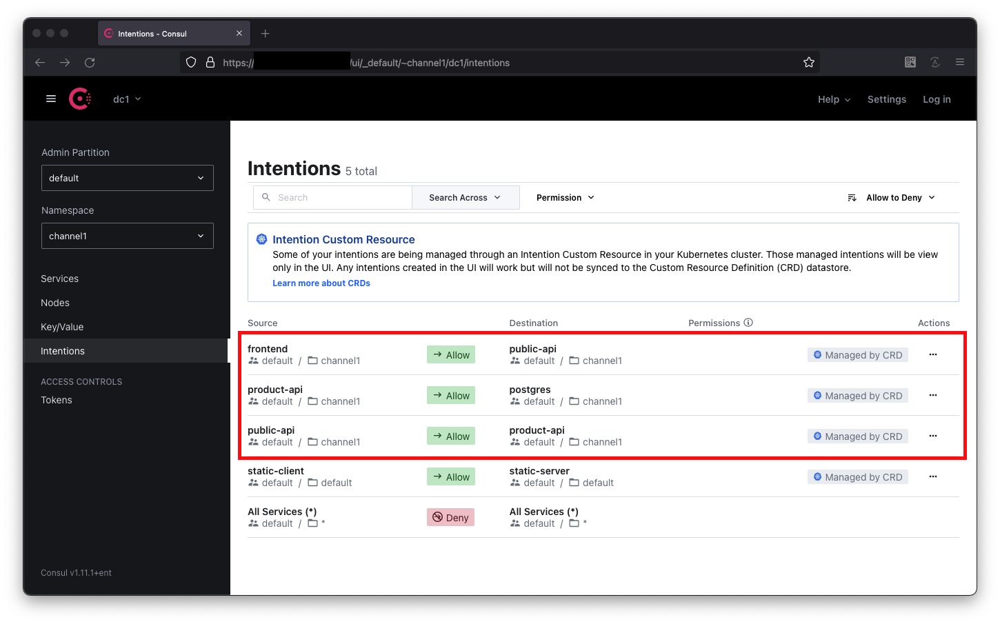
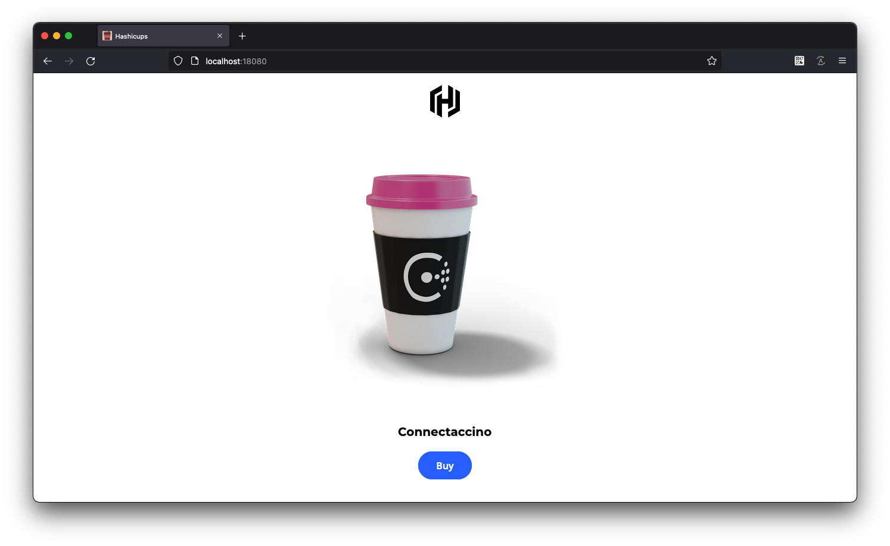

---
meta:
  - name: description
    content: Consul Service Mesh on Kubernetes (Ent)
tags: ["Consul", "ServiceMesh", "K8s", "Kubernetes"]
---

# 03. CRD로 Consul Serive Mesh 관리

> 참고 : <https://learn.hashicorp.com/tutorials/consul/kubernetes-custom-resource-definitions?in=consul/kubernetes>
>
> 참고 : <https://learn.hashicorp.com/tutorials/consul/service-mesh-zero-trust-network?in=consul/gs-consul-service-mesh>

Consul 1.9 이전에는 Kubernetes에서 Consul과 함께 구성 항목을 사용할 때 운영자가 실행 중인 컨테이너에 들어가거나 로컬 Consul 바이너리를 사용하여 구성해야 했습니다. 1.9 이전 버전에서는 구성 항목을 Consul CLI, HTTP API로 관리하거나 시작하는 동안 구성 파일로 에이전트에 제공해야 합니다.

Consul 1.9부터 대부분의 구성 항목은 Kubernetes 사용자 지정 리소스 정의(CRD)로 관리할 수 있습니다. 이제 대부분의 구성 항목을 YAML로 정의하고 익숙한 `kubectl apply`명령을 사용하여 Consul에 등록할 수 있습니다.

현재 Kubernetes에서 Consul의 CRD로 사용할 수 있는 구성 항목은 다음과 같습니다.

- [`proxy-defaults`](https://learn.hashicorp.com/tutorials/consul/kubernetes-custom-resource-definitions?in=consul/kubernetes#proxy-defaults)- 프록시 구성 제어
- [`service-defaults`](https://learn.hashicorp.com/tutorials/consul/kubernetes-custom-resource-definitions?in=consul/kubernetes#service-defaults)- 주어진 서비스의 모든 인스턴스에 대한 기본값을 구성합니다.
- [`service-resolver`](https://learn.hashicorp.com/tutorials/consul/kubernetes-custom-resource-definitions?in=consul/kubernetes#service-resolver)- 서비스 인스턴스를 특정 Connect 업스트림 검색 요청과 일치시킵니다.
- [`service-router`](https://learn.hashicorp.com/tutorials/consul/kubernetes-custom-resource-definitions?in=consul/kubernetes#service-router)- HTTP 경로를 기반으로 레이어 7 트래픽을 보낼 위치를 정의합니다.
- [`service-splitter`](https://learn.hashicorp.com/tutorials/consul/kubernetes-custom-resource-definitions?in=consul/kubernetes#service-splitter)- 백분율에 따라 단일 HTTP 경로에 대한 요청을 나누는 방법을 정의합니다.
- [`service-intentions`](https://learn.hashicorp.com/tutorials/consul/kubernetes-custom-resource-definitions?in=consul/kubernetes#service-intentions)- 특정 서비스 대 서비스 상호 작용에 대한 제한을 정의합니다.

## 샘플 애플리케이션 준비

필요한 애플리케이션을 다운로드 받습니다. git clone 또는 <https://github.com/hashicorp/learn-consul-kubernetes> 로 접속하여 Code를 다운로드 받습니다.

- git clone

  ```bash
  git clone https://github.com/hashicorp/learn-consul-kubernetes.git
  ```

- Code download

  

다운로드 후 `learn-consul-kubernetes/service-mesh/deploy` 경로로 이동하고 샘플 구성을 반영합니다.

```bash
cd learn-consul-kubernetes/service-mesh/deploy
kubectl apply -f hashicups/
```
```bash
# 출력
service/frontend created
serviceaccount/frontend created
servicedefaults.consul.hashicorp.com/frontend created
configmap/nginx-configmap created
deployment.apps/frontend created
service/postgres created
serviceaccount/postgres created
servicedefaults.consul.hashicorp.com/postgres created
deployment.apps/postgres created
service/product-api created
serviceaccount/product-api created
servicedefaults.consul.hashicorp.com/product-api created
configmap/db-configmap created
deployment.apps/product-api created
service/public-api created
serviceaccount/public-api created
servicedefaults.consul.hashicorp.com/public-api created
deployment.apps/public-api created
```

서비스는 Consul이 각 서비스에 대한 프록시를 자동으로 삽입할 수 있도록 하는 `annotation` 을 사용합니다. 프록시 는 Consul의 구성을 기반으로 서비스 간의 요청을 처리하기 위해 **데이터 플레인을 생성합니다.** Consul이 주입되는 label을 선택하여 프록시가 있는 응용 프로그램을 확인할 수 있습니다.

```bash
kubectl get pods --selector consul.hashicorp.com/connect-inject-status=injected
```
```bash
# 출력
NAME                           READY   STATUS    RESTARTS   AGE
frontend-98cb6859b-6ndvk       2/2     Running   0          3m10s
postgres-6ccb6d9968-hkbgz      2/2     Running   0          3m9s
product-api-6798bc4b4d-9ddv4   2/2     Running   2          3m9s
public-api-5bdf986897-tlxj2    2/2     Running   0          3m9s
```


배포된 앱에 접근하기 위해 `port-forward`를 구성합니다.

```bash
kubectl port-forward service/frontend 18080:80 --address 0.0.0.0
```
```bash
# 출력
Forwarding from 0.0.0.0:18080 -> 80
```


브라우저에서 <http://localhost:18080> 로 접근합니다.



현재 `Intention` 규칙이 모두 `deny`로 구성되어있다면 에러 화면을 확인하게 됩니다. 




## CRD 적용해보기

UI에서가 아닌 CRD를 통해 `Intention` 을 정의하기위해 아래와 같이 구성합니다.

```bash
cat > ./service-to-service.yaml <<EOF
apiVersion: consul.hashicorp.com/v1alpha1
kind: ServiceIntentions
metadata:
  name: frontend-to-public-api
spec:
  destination:
    name: public-api
  sources:
    - name: frontend
      action: allow
---
apiVersion: consul.hashicorp.com/v1alpha1
kind: ServiceIntentions
metadata:
  name: public-api-to-product-api
spec:
  destination:
    name: product-api
  sources:
    - name: public-api
      action: allow
---
apiVersion: consul.hashicorp.com/v1alpha1
kind: ServiceIntentions
metadata:
  name: product-api-to-postgres
spec:
  destination:
    name: postgres
  sources:
    - name: product-api
      action: allow
EOF
```

규칙의 내용은 다음과 같습니다.

- frontend -> public-api
- public-api -> product-api
- product-api -> postgres

규칙을 적용합니다.

```bash
kubectl apply -f service-to-service.yaml
```
```bash
# 출력
serviceintentions.consul.hashicorp.com/frontend-to-public-api created
serviceintentions.consul.hashicorp.com/public-api-to-product-api created
serviceintentions.consul.hashicorp.com/product-api-to-postgres created
```

Consul UI에서 확인해보면 해당 Intention 규칙은 CRD로 적용되었기 때문에 `Managed by CRD` 표시가 붙는것을 확인할 수 있습니다.



배포된 앱에 접근하기 위해 `port-forward`를 구성합니다.

```bash
kubectl port-forward service/frontend 18080:80 --address 0.0.0.0
```
```bash
# 출력
Forwarding from 0.0.0.0:18080 -> 80
```


브라우저에서 <http://localhost:18080> 로 접근합니다.



서비스 간 연결이 허용되었으므로 페이지가 잘 표시됩니다.

다음 과정을 위해 배포된 리소스를 정리합니다.

```bash
kubectl delete -f service-to-service.yaml
```
```bash
# 출력
serviceintentions.consul.hashicorp.com "frontend-to-public-api" deleted
serviceintentions.consul.hashicorp.com "public-api-to-product-api" deleted
serviceintentions.consul.hashicorp.com "product-api-to-postgres" deleted
```

```bash
kubectl delete -f hashicups/
```
```bash
# 출력
service "frontend" deleted
serviceaccount "frontend" deleted
servicedefaults.consul.hashicorp.com "frontend" deleted
configmap "nginx-configmap" deleted
deployment.apps "frontend" deleted
service "postgres" deleted
serviceaccount "postgres" deleted
servicedefaults.consul.hashicorp.com "postgres" deleted
deployment.apps "postgres" deleted
service "product-api" deleted
serviceaccount "product-api" deleted
servicedefaults.consul.hashicorp.com "product-api" deleted
configmap "db-configmap" deleted
deployment.apps "product-api" deleted
service "public-api" deleted
serviceaccount "public-api" deleted
servicedefaults.consul.hashicorp.com "public-api" deleted
deployment.apps "public-api" deleted
```

