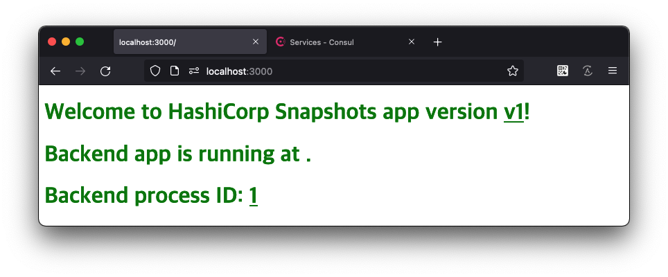
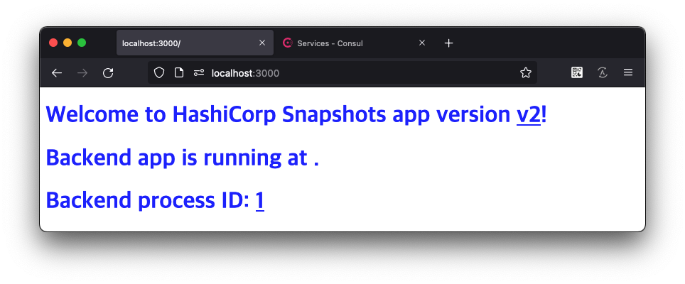
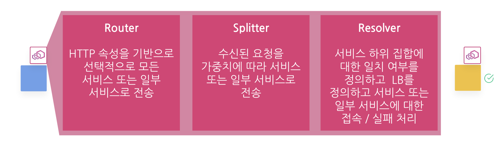
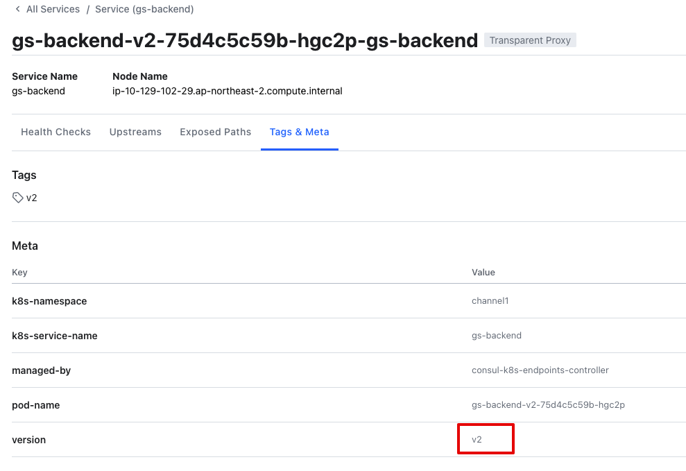
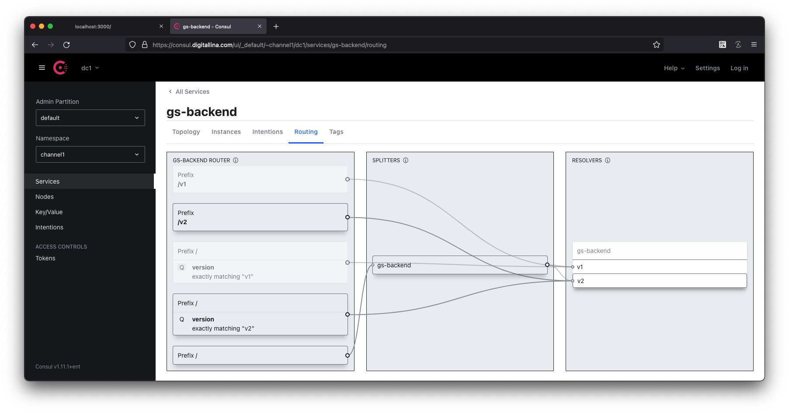

---
meta:
  - name: description
    content: Consul Service Mesh on Kubernetes (Ent)
tags: ["Consul", "ServiceMesh", "K8s", "Kubernetes"]
---

# 04. 트래픽 관리

실습을 진행하기 위한 디렉토리를 생성합니다.

```bash
mkdir ./traffic
```

Service Mesh는 HTTP 프로토콜 상에서 L7으로 동작하게 됩니다. 따라서 기본 프로토콜을 http로 변경합니다.

```bash
cat > ./traffic/service-to-service.yaml <<EOF
apiVersion: consul.hashicorp.com/v1alpha1
kind: ProxyDefaults
metadata:
  name: global
spec:
  config:
    protocol: http
EOF
```
```bash
kubectl apply -f ./traffic/service-to-service.yaml
```
```bash
# 출력
proxydefaults.consul.hashicorp.com/global created
```


## 샘플 앱 준비

### 프론트엔드 서비스

```bash
cat > ./traffic/gs-frontend.yaml <<EOF
---
apiVersion: v1
kind: Service
metadata:
  name: gs-frontend
spec:
  selector:
    app: gs-frontend
  ports:
    - protocol: TCP
      port: 3000
      targetPort: 3000
---
apiVersion: v1
kind: ServiceAccount
metadata:
  name: gs-frontend
---
apiVersion: apps/v1
kind: Deployment
metadata:
  name: gs-frontend
spec:
  replicas: 1
  selector:
    matchLabels:
      app: gs-frontend
  template:
    metadata:
      labels:
        app: gs-frontend
      annotations:
        prometheus.io/scrape: "true"
        prometheus.io/port: "9901"
        consul.hashicorp.com/connect-inject: "true"
        consul.hashicorp.com/transparent-proxy: true
        consul.hashicorp.com/connect-service-upstreams: "gs-backend:8080"
    spec:
      serviceAccountName: gs-frontend
      containers:
        - name: gs-frontend
          image: hahohh/consul-frontend-nodejs:v1.5
          env:
            - name: PORT
              value: "3000"
            - name: UPSTREAM_URL
              value: "http://localhost:8080
          ports:
            - containerPort: 3000
EOF
```

적용하기
```bash
kubectl apply -f ./traffic/gs-frontend.yaml
```

### 백엔드 서비스

```bash
cat > ./traffic/gs-backend.yaml <<EOF
---
apiVersion: v1
kind: Service
metadata:
  name: gs-backend
spec:
  selector:
    app: gs-backend
  ports:
    - protocol: TCP
      port: 8080
      targetPort: 8080
---
apiVersion: v1
kind: ServiceAccount
metadata:
  name: gs-backend
---
apiVersion: apps/v1
kind: Deployment
metadata:
  name: gs-backend-v1
spec:
  replicas: 1
  selector:
    matchLabels:
      app: gs-backend
      version: v1
  template:
    metadata:
      labels:
        app: gs-backend
        version: v1
      annotations:
        consul.hashicorp.com/connect-inject: "true"
        consul.hashicorp.com/service-meta-version: v1
        consul.hashicorp.com/service-tags: v1
    spec:
      serviceAccountName: gs-backend
      containers:
        - name: gs-backend
          image: hahohh/consul-backend-go:v1.2
          env:
            - name: PORT
              value: "8080"
            - name: COLOR
              value: "green"
            - name: VERSION
              value: "v1"
          ports:
            - containerPort: 8080
---
apiVersion: apps/v1
kind: Deployment
metadata:
  name: gs-backend-v2
spec:
  replicas: 1
  selector:
    matchLabels:
      app: gs-backend
      version: v2
  template:
    metadata:
      labels:
        app: gs-backend
        version: v2
      annotations:
        consul.hashicorp.com/connect-inject: "true"
        consul.hashicorp.com/service-meta-version: v2
        consul.hashicorp.com/service-tags: v2
    spec:
      serviceAccountName: gs-backend
      containers:
        - name: gs-backend
          image: hahohh/consul-backend-go:v1.2
          env:
            - name: PORT
              value: "8080"
            - name: COLOR
              value: "blue"
            - name: VERSION
              value: "v2"
            # - name: ISFAIL
            #   value: "yyyy"
          ports:
            - containerPort: 8080
EOF
```

적용하기
```bash
kubectl apply -f ./traffic/gs-backend.yaml
```

### 서비스 Intention

```bash
cat > ./traffic/service-to-service.yaml <<EOF
apiVersion: consul.hashicorp.com/v1alpha1
kind: ServiceIntentions
metadata:
  name: gs-backend
spec:
  destination:
    name: gs-backend
  sources:
    - name: gs-frontend
      action: allow
EOF
```

적용하기
```bash
kubectl apply -f ./traffic/service-to-service.yaml
```

`port-forward`를 통해 로컬에서 web 앱을 확인합니다.

```bash
kubect l port-forward service/gs-frontend 3000:3000 --address 0.0.0.0
```
```bash
# 출력
Forwarding from 0.0.0.0:3000 -> 3000
```

<http://localhost:3000> 에 브라우저로 접속하여 상태를 확인합니다.

두개의 버전의 백엔드가 서로다른 갑을 리턴하여 때에 따라 v1, v2가 번갈아 나타납니다.





## 트래픽 제어 요소



- Resolver : 동일한 서비스 이름이 있더라도 조건에 따라 각 서비스를 독립적으로 정의합니다. (e.g. v1, v2, canary)
- Splitter : 정의된 서비스로 가중치에 따라 트래픽을 분산합니다. 10000분율이 적용됩니다.
- Router : HTTP, gRPC 속성 기반으로 정의된 서비르소 트래픽을 분산합니다.
  - pathPrefix / PathExact / PathRegex
  - Header
  - QueryParam

### Resolve

```bash
cat > ./traffic/service-resolver.yaml <<EOF
apiVersion: consul.hashicorp.com/v1alpha1
kind: ServiceResolver
metadata:
  name: gs-backend
spec:
  defaultSubset: v1
  subsets:
    v1:
      filter: "Service.Meta.version == v1"
    v2:
      filter: "Service.Meta.version == v2"
EOF
```

적용하기
```bash
kubectl apply -f ./traffic/service-resolver.yaml
```

앞서 배포된 `gs-backend` 의 `Deployment` 에 선언된 `annotation` 내용을 확인하면 `consul.hashicorp.com/service-meta-version: v2` 을 확인할 수 있습니다. Consul UI에서도 해당 Meta 정보를 확인할 수 있습니다. 선언된 정보를 기반으로 서비스의 `subset` 을 정의합니다.




### Splitter

```bash
cat > ./traffic/service-splitter.yaml <<EOF
apiVersion: consul.hashicorp.com/v1alpha1
kind: ServiceSplitter
metadata:
  name: gs-backend
spec:
  splits:
    - weight: 50
      serviceSubset: v1
    - weight: 50
      serviceSubset: v2
EOF
```

적용하기
```bash
kubectl apply -f ./traffic/service-splitter.yaml
```

`weight`에 지정된 비율로 Resolve된 서비스 대상 `subset` 에 트래픽을 분산합니다. `weight`값을 0:100, 100:0 등으로 변경하여 요청의 결과가 어떻게 변화하는지 확인해 봅니다.

- http://localhost:3000


### Router

```bash
cat > ./traffic/service-router.yaml <<EOF
apiVersion: consul.hashicorp.com/v1alpha1
kind: ServiceRouter
metadata:
  name: gs-backend
spec:
  routes:
    - match:
        http:
          pathPrefix: '/v1'
      destination:
        service: gs-backend
        serviceSubset: v1
    - match:
        http:
          pathPrefix: '/v2'
      destination:
        service: gs-backend
        serviceSubset: v2
    - match:
        http:
          queryParam:
            - name: version
              exact: 'v1'
      destination:
        service: gs-backend
        serviceSubset: v1
    - match:
        http:
          queryParam:
            - name: version
              exact: 'v2'
      destination:
        service: gs-backend
        serviceSubset: v2
EOF
```

적용하기
```bash
kubectl apply -f ./traffic/service-router.yaml
```

예제에서는 url의 path, queryParam을 예로 트래픽을 컨트롤 합니다. 다음과같이 요청하여 트래픽이 조정되는 것을 확인합니다.

- http://localhost:3000/v1
- http://localhost:3000/v2
- http://localhost:3000/?version=v1
- http://localhost:3000/?version=v2


### 서비스 Intention (L7)

service-to-service 허용 방식에도 Meshod, Path 등을 지정할 수 있습니다. 다음과 같이 변경하고 POST만 넣은 상태에서는 어떻게 동작하는지 확인합니다.

```bash
cat > ./traffic/service-to-service.yaml <<EOF
apiVersion: consul.hashicorp.com/v1alpha1
kind: ServiceIntentions
metadata:
  name: gs-backend
spec:
  destination:
    name: gs-backend
  sources:
    - name: gs-frontend
      permissions:
        - action: allow
          http:
            pathPrefix: /
            # methods: ['GET', 'PUT', 'POST', 'DELETE', 'HEAD']
            methods: ['POST']
```

적용하기
```bash
kubectl apply -f ./traffic/service-to-service.yaml
```

다시 앱간의 요청인  `GET`으로 변경하고 트래픽 허용여부를 확인해봅니다.

```bash
cat > ./traffic/service-to-service.yaml <<EOF
apiVersion: consul.hashicorp.com/v1alpha1
kind: ServiceIntentions
metadata:
  name: gs-backend
spec:
  destination:
    name: gs-backend
  sources:
    - name: gs-frontend
      permissions:
        - action: allow
          http:
            pathPrefix: /
            # methods: ['GET', 'PUT', 'POST', 'DELETE', 'HEAD']
            methods: ['GET']
```

적용하기
```bash
kubectl apply -f ./traffic/service-to-service.yaml
```

## Consul UI Routing table

Consul UI에 접속하여 `gs-backend`의 `Routing` 탭을 클릭, 구성된 Resolver, Splitter, Router가 어떻게 구성되었는지, 각 서비스에는 어떤 조건으로 요청할 수 있는지 확인합니다.


