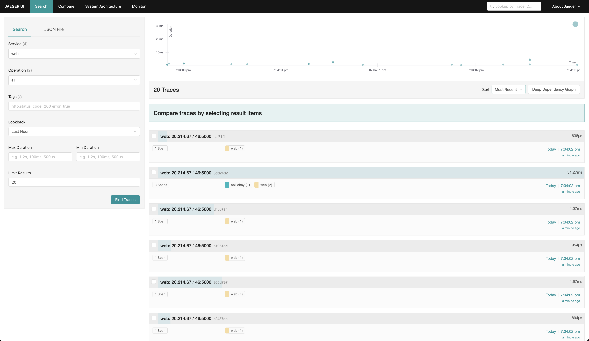

---
meta:
  - name: description
    content: K8S 환경에서 Jaeger를 통한 Consul Service Mesh Tracing
author: "유형욱"
tags: ["Consul", "Jaeger", "Tracing", "OpenTelemetry", "Istio", "IngressGateway", "Kubetenetes", "K8s"]

---

# Jaeger를 활용한 Consul Service Mesh Tracing


## 0. 사전 요구사항

### 1) Consul Install

Jaeger 연동을 위해 Consul on K8s 환경을 구성합니다. 해당 가이드의 경우에는 [여기]()를 참고하세요.

#### (1) 시크릿 생성 - 라이센스

- 라이센스 파일 생성 및 시크릿 생성

```bash
# license파일 생성
vi consul.lic

# 생성한 license파일로 secret 생성
kubectl create secret generic license --from-file='key=./consul.lic'
```

#### (2)  시크릿 생성 - Gossip Key

- consul-gossip-encryption-key 시크릿 생성

```bash
GOSSIP_KEY="VeQ8CHV3sDY/bHCseXC7PGXNTSXtWWvOzQKAaFFo9oE="
kubectl patch secret consul-gossip-encryption-key -n consul --patch='{"stringData":{"key": "$GOSSIP_KEY"}}'
```

#### (3) Consul Helm 배포
`values.yaml` 파일 수정 및 배포합니다.

- `values.yaml` 파일 예시 

```yaml
global:
  name: consul
  datacenter: dc1
  logLevel: "debug"
  logJSON: false
  image: hashicorp/consul-enterprise:1.12.3-ent
  gossipEncryption:
    autoGenerate: true
  tls:
    enabled: false
    enableAutoEncrypt: false
    verify: false
    httpsOnly: false
  imageEnvoy: envoyproxy/envoy:v1.22-latest
  enterpriseLicense:
    secretName: license
    secretKey: key
server:
  replicas: 3
client:
  enabled: true
  exposeGossipPorts: true
  extraConfig: |
    {
      "log_level": "debug"
    }
  grpc: true
ui:
  enabled: true
  service:
    type: LoadBalancer
connectInject:
  enabled: true
controller:
  enabled: true
  #terminatingGateways:
  #enabled: true
  #apiGateway:
  #enabled: true
  #image: "hashicorp/consul-api-gateway:latest"
ingressGateways:
  enabled: true
  gateways:
  - name: ingress-gateway
    service:
      type: LoadBalancer
      ports:
      - port: 5000
```

## [1. Cert-Manager 설치](https://cert-manager.io/docs/installation/)

Jaeger를 설치할 때 cert-manager 설치가 필수적으로 요구됩니다.
> Since version 1.31 the Jaeger Operator uses webhooks to validate Jaeger custom resources (CRs). This requires an installed version of the cert-manager.

- [Yaml 배포](https://cert-manager.io/docs/installation/#default-static-install)

```bash
kubectl apply -f https://github.com/cert-manager/cert-manager/releases/download/v1.9.1/cert-manager.yaml
```

- cert-manager 파드 배포확인

```bash
kubectl get pods -n cert-manager
NAME                                       READY   STATUS    RESTARTS   AGE
cert-manager-6544c44c6b-z76nd              1/1     Running   0          25s
cert-manager-cainjector-5687864d5f-pdzbn   1/1     Running   0          25s
cert-manager-webhook-785bb86798-v6phx      1/1     Running   0          25s
```


## [2. Jaeger 설치](https://www.jaegertracing.io/docs/1.37/operator/)

Tracing을 위해 Jaeger 공식 문서를 참고하여 K8s 환경에 Jaeger Operator를 설치합니다.

### (1) Role Binding 배포(선택)

> 💡참고 : 동일 네임스페이스 배포할 경우 해당 과정은 생략!

- YAML 생성 : `consul-jaeger` RoleBinding 생성

```yaml
# role-binding.yaml
kind: RoleBinding
apiVersion: rbac.authorization.k8s.io/v1
metadata:
  name: jaeger-operator-in-myproject
  namespace: consul-jaeger
subjects:
- kind: ServiceAccount
  name: jaeger-operator
  namespace: observability
roleRef:
  kind: Role
  name: jaeger-operator
  apiGroup: rbac.authorization.k8s.io
```

- YAML 배포

```bash
kubectl apply -f role-binding.yaml
```

### (2) Jaeger Operator 배포(CRD 설치)

Jaeger Operator를 배포하기 위한 `observbility` 네임스페이스를 생성합니다. 이때, 별도의 네임스페이스에 배포할 경우에는 다운받은 `.yaml`에 설저된 네임스페이스명을 변경하셔야 합니다. [참고](https://www.jaegertracing.io/docs/1.39/operator/#installing-the-operator-on-kubernetes)

- 네임스페이스 생성 및 각종 리소스 배포

```bash
kubectl create namespace observability
kubectl create -f https://github.com/jaegertracing/jaeger-operator/releases/download/v1.37.0/jaeger-operator.yaml -n observability
```


- 배포된 `jaeger-operator` 확인

```bash
kubectl get deployment jaeger-operator -n observability 
NAME              READY   UP-TO-DATE   AVAILABLE   AGE
jaeger-operator   1/1     1            1           2m30s
```

### (3) Jaeger CR 배포 - AllInOne 

실제 K8s 환경에서 `Jaeger`리소스 생성을 위해 다음 `.yaml` 파일을 배포합니다. 본 문서에서는 편의상 `AllInOne` 이미지를 사용하여 배포합니다. 

`AllInOne` 이미지는 프로덕션 환경에서 사용하기에는 적합하지 않으며, Dev 또는 Test 목적으로 사용해야 합니다. [(배포전략 참고)](https://www.jaegertracing.io/docs/1.37/operator/#allinone-default-strategy)

> The simplest possible way to create a Jaeger instance is by creating a YAML file like the following example. This will install the default AllInOne strategy, which deploys the “all-in-one” image (agent, collector, query, ingester, Jaeger UI) in a single pod, using in-memory storage by default.

- YAML 생성

```yaml
# simplest.yaml
apiVersion: jaegertracing.io/v1
kind: Jaeger
metadata:
  name: simplest
  namespace: observability
```

- (참고) [Log Level 조정](https://www.jaegertracing.io/docs/1.39/operator/#examples)

```yaml
# simplest-debug.yaml
apiVersion: jaegertracing.io/v1
kind: Jaeger
metadata:
  name: simplest
  namespace: observability
spec:
  strategy: allInOne
  allInOne:
    image: jaegertracing/all-in-one:latest
    options:
      log-level: debug
```

- YAML 배포

```
kubectl apply -f simplest.yaml
```

- 배포 로그 확인
  - `{"level":"info","ts":1661997111.1498919,"caller":"healthcheck/handler.go:129","msg":"Health Check state change","status":"ready"}` 로그를 통해서 정상적인 상태 확인됨

```bash
kubectl logs -l app.kubernetes.io/instance=simplest -n consul-jaeger
{"level":"info","ts":1661997111.149404,"caller":"channelz/funcs.go:340","msg":"[core][Channel #10] Channel Connectivity change to TRANSIENT_FAILURE","system":"grpc","grpc_log":true}
{"level":"info","ts":1661997111.1495373,"caller":"app/static_handler.go:181","msg":"UI config path not provided, config file will not be watched"}
{"level":"info","ts":1661997111.149864,"caller":"app/server.go:217","msg":"Query server started","http_addr":"[::]:16686","grpc_addr":"[::]:16685"}
{"level":"info","ts":1661997111.1498919,"caller":"healthcheck/handler.go:129","msg":"Health Check state change","status":"ready"}
{"level":"info","ts":1661997111.149912,"caller":"app/server.go:300","msg":"Starting GRPC server","port":16685,"addr":":16685"}
{"level":"info","ts":1661997111.1499252,"caller":"channelz/funcs.go:340","msg":"[core][Server #9 ListenSocket #12] ListenSocket created","system":"grpc","grpc_log":true}
{"level":"info","ts":1661997111.1499453,"caller":"app/server.go:281","msg":"Starting HTTP server","port":16686,"addr":":16686"}
{"level":"info","ts":1661997112.150468,"caller":"channelz/funcs.go:340","msg":"[core][Channel #10 SubChannel #11] Subchannel Connectivity change to IDLE","system":"grpc","grpc_log":true}
{"level":"info","ts":1661997112.1505697,"caller":"grpclog/component.go:71","msg":"[core]pickfirstBalancer: UpdateSubConnState: 0xc00082a700, {IDLE connection error: desc = \"transport: Error while dialing dial tcp :16685: connect: connection refused\"}","system":"grpc","grpc_log":true}
{"level":"info","ts":1661997112.1505857,"caller":"channelz/funcs.go:340","msg":"[core][Channel #10] Channel Connectivity change to IDLE","system":"grpc","grpc_log":true}
```

### (4) (선택) Jaeger Sidecar 배포 방식

Jaeger Auto Injection 및 Manaul Injection 활용방안을 가이드합니다. (3)에서 `Jaeger`리소스를 직접 배포했다면 생략하셔도 됩니다.

#### 방안1. CRD 배포

해당 방안은 3)-(3)에서  작성한 방식으로, 관리되는 네임스페이스에 있는 애플리케이션의 tracing을 수행합니다.

#### 방안2. Auto Injection - annotation 활용

해당 방안은 annotation 절에   `"sidecar.jaegertracing.io/inject": "true"` 를 기입하여 tracing 하고자 하는 애플리케이션에 sidecar auto-injection을 수행합니다.

- tracing 할 애플리케이션 deployment yaml의 annotation 위치

```yaml
metadata:
  name: web-deployment
  labels:
    app: web
  namespace: observability
  annotations:
    "sidecar.jaegertracing.io/inject": 'true'
```

#### 방안3. Manual Injectio

tracing 하고자 하는 애플리케이션에 직접 sidecar를 붙혀 tracing 합니다.

```yaml
      - name: jaeger-agent
        image: jaegertracing/jaeger-agent:latest
        imagePullPolicy: IfNotPresent
        ports:
          - containerPort: 5775
            name: zk-compact-trft
            protocol: UDP
          - containerPort: 5778
            name: config-rest
            protocol: TCP
          - containerPort: 6831
            name: jg-compact-trft
            protocol: UDP
          - containerPort: 6832
            name: jg-binary-trft
            protocol: UDP
          - containerPort: 14271
            name: admin-http
            protocol: TCP
        args:
          - --reporter.grpc.host-port=dns:///simplest-collector-headless.observability:14250
          - --reporter.type=grpc
```


### (5) Jaeger UI 접속

기본적을 Jaeger UI는 `ClusterIP`로 배포됩니다. 외부에서 접속하기 위해 다음 몇 가지 방안을 제시합니다. 

> 참고 : 본 문서에서는 편의상 LoadBalancer 타입으로 변경하는 샘플을 제공합니다. 

- Ingress
- **LoadBalancer**
- Port-Forwarding

기본적으로 Jaeager UI는 16686 Port를 사용합니다. 필자는 편읜상 `simplest-query` 서비스를 `LoadBalancer`타입으로 변경하여 조회합니다. 

```yaml
spec:
(중략)
  ports:
  - name: http-query
    nodePort: 32731
    port: 16686
    protocol: TCP
    targetPort: 16686
  - name: grpc-query
    nodePort: 31322
    port: 16685
    protocol: TCP
    targetPort: 16685
  selector:
    app: jaeger
    app.kubernetes.io/component: all-in-one
    app.kubernetes.io/instance: simplest
    app.kubernetes.io/managed-by: jaeger-operator
    app.kubernetes.io/name: simplest
    app.kubernetes.io/part-of: jaeger
  sessionAffinity: None
  type: LoadBalancer
```


- Jaeger UI 예제
  


### (참고) Jaeger와 다른 네임스페이스에 애플리케이션 사용할 경우


## [3. Consul Config 설정](https://developer.hashicorp.com/consul/docs/connect/distributed-tracing)

### (1)  Ingress Gateway

```yaml
apiVersion: consul.hashicorp.com/v1alpha1
kind: IngressGateway
metadata:
  name: ingress-gateway
  namespace: consul
spec:
  listeners:
    - port: 5000
      protocol: http
      services:
        - name: web
          hosts: ['*']
```


### (2) Service Defaults

```yaml
apiVersion: consul.hashicorp.com/v1alpha1
kind: ServiceDefaults
metadata:
  name: web
spec:
  protocol: "http"
```


### (3) Proxy Defaults

`ProxyDefaults` 설정을 통해 Collector 서버에 대한 주소 및 Clustesr Name에 대해 선언합니다. 

```yaml
apiVersion: consul.hashicorp.com/v1alpha1
kind: ProxyDefaults
metadata:
  name: global
  namespace: consul
spec:
  config:
    protocol: http
    envoy_tracing_json: |
      {
        "http":{
          "name":"envoy.tracers.zipkin",
          "typedConfig":{
            "@type":"type.googleapis.com/envoy.config.trace.v3.ZipkinConfig",
            "collector_cluster":"simplest-collector",
            "collector_endpoint_version":"HTTP_JSON",
            "collector_endpoint":"/api/v2/spans",
            "shared_span_context":false
          }
        }
      }
    envoy_extra_static_clusters_json: |
      {
        "connect_timeout":"3.000s",
        "dns_lookup_family":"V4_ONLY",
        "lb_policy":"ROUND_ROBIN",
        "load_assignment":{
          "cluster_name":"simplest-collector",
          "endpoints":[
            {
              "lb_endpoints":[
                {
                  "endpoint":{
                    "address":{
                      "socket_address":{
                        "address":"simplest-collector",
                        "port_value":9411,
                        "protocol":"TCP"
                      }
                    }
                  }
                }
              ]
            }
          ]
        },
        "name":"simplest-collector",
        "type":"STRICT_DNS"
      }
```

### 99) 참고문서

- ingress gateway + tracing 고려사항 : https://developer.hashicorp.com/consul/docs/connect/distributed-tracing#considerations

- https://github.com/jaegertracing/jaeger-operator.git

- jaeger 배포 helm chart : https://git.app.uib.no/caleno/helm-charts/-/tree/597accc8e61dfb3a78f2e4f1b9622c8d3f32b4f2/stable/jaeger-operator/templates

  

