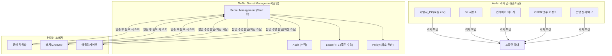
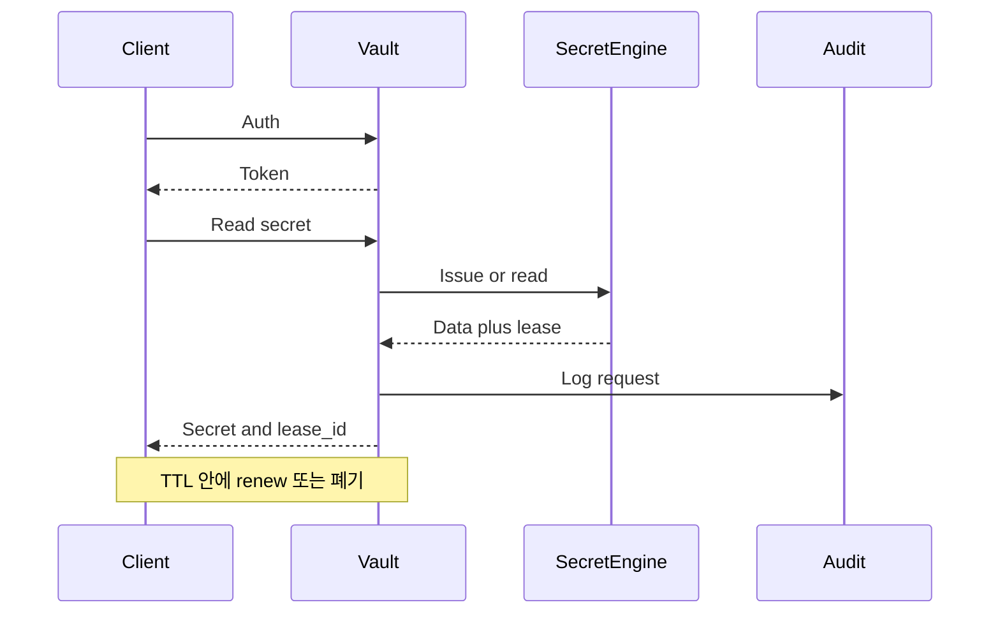

# Secret Management가 필요한 이유와 Vault

> 본 문서는 **시크릿을 어디에 두고 어떻게 생명주기를 관리할지**에 대한 개념과 설계 관점을 다룹니다. Vault 버전별 설치·튜닝·API 세부는 [HashiCorp Vault 공식 문서](https://developer.hashicorp.com/vault/docs)를 우선합니다.

현대 애플리케이션은 API 키, 데이터베이스 비밀번호, TLS 인증서, 클라우드 자격 증명 등 상호 연결을 위해서 **비밀 값(secret)** 에 의존합니다. 이를 개발 단계에서 애플리케이션 코드나 빌드되는 이미지에 하드코딩 방식은 배포가 빠르지만, 유출 시 피해가 크고 회전(rotation)·감사(audit)가 어렵습니다. **Secret Management**는 이런 비밀을 **중앙에서 안전하게 저장하고, 접근을 통제하며, 필요할 때만 짧게 나눠 주는** 행위를 가리킵니다.

---

## 1. 배경: 아키텍처 진화와 Stateful 분리

### 1.1 2-tier·3-tier에서 분산·클라우드 네이티브로

초기 **2-tier** 구조에서는 클라이언트와 데이터 저장소 사이의 경계가 비교적 단순했습니다. **3-tier**로 프레젠테이션·애플리케이션·데이터가 나뉘면서, 애플리케이션 서버가 DB에 접속하기 위한 **연결 문자열·계정**이 설정·배포 파이프라인 곳곳에 등장하기 시작했습니다.

이후 **마이크로서비스**, **컨테이너**, **클라우드 네이티브** 환경으로 갈수록 다음이 동시에 늘어납니다.

- **신뢰 경계(trust boundary)** 의 개수: 서비스 간, 클러스터 간, 클라우드 계정 간
- **자격 증명 교환 빈도**: 동적 스케일링, 배포 단위 축소, 외부 API 연동 증가

같은 이유로 **데이터베이스**는 애플리케이션 프로세스와 분리해 **공통 Stateful 계층**으로 두는 것이 일반적이 되었습니다. **시크릿**도 마찬가지로, 앱 코드·컨테이너 이미지·Git 저장소와 **분리된 전용 계층**으로 두면 회전·최소 권한·감사를 한곳에서 일관되게 적용할 수 있습니다.

### 1.2 흩어진 시크릿과 중앙 관리

### 1.3 Root of Trust

**Root of Trust**는 “신뢰의 기준”에 해당하는 **신뢰의 기준점(Trust Anchor)** 입니다. 예를 들어 조직의 IdP(인증), PKI의 루트/중간 CA(통신 신원), HSM/클라우드 KMS(키 보관), TPM/보안 부팅(호스트 무결성) 같은 것들이 Root of Trust의 후보가 됩니다.

이 개념이 중요한 이유는, 시스템이 커질수록 보안은 “각 요소가 안전하다”보다 **어디까지를 어떻게 믿을지(신뢰 경계)** 를 먼저 정의해야 하기 때문입니다. Root of Trust가 불명확하면 다음 문제가 반복됩니다.

- **누가 누구인지 증명할 수 없음**: 서비스 간 통신을 mTLS로 해도, “인증서를 누가 발급했는가”가 를 보장해야 합니다. 이는 사람의 경우 신분증 발급 기관을 신뢰할 수 있는지와 같습니다.
- **키·시크릿의 출처가 흔들림**: 시크릿이 Git/CI/호스트에 퍼져 있으면 “원본”이 무엇인지, 폐기·회전 시점이 어디인지 불명확합니다.
- **사고 대응이 느려짐**: 신뢰 기준점이 분산되면 회전·폐기·추적이 여러 시스템에서 동시에 필요해집니다.

Vault는 **Root of Trust**를 애플리케이션 시크릿 관점에서 다음과 같은 **신뢰의 중추(central trust point)** 역할을 제공합니다.

- **중앙 정책(Policy)과 인증(Auth method)**: “누가(사람/워크로드) 무엇을(경로/엔진) 할 수 있는가”를 한곳에서 통제
- **짧은 수명(Lease/TTL)·회전 모델**: 장기 비밀의 의존도를 낮추고, 노출 창을 제한
- **감사(Audit)**: 어떤 신원으로 어떤 시크릿/자격이 발급·조회됐는지 추적성을 제공
- **PKI/SSH 등 엔진**: mTLS 인증서·단기 SSH 자격처럼 “통신/접근의 신원”을 일관되게 발급하는 축 제공

::: tip
Vault의 Root of Trust는 결국 **Vault의 seal(루트 키 보호)** 과, Vault가 신뢰하는 **IdP/워크로드 신원 체계(Kubernetes, OIDC/JWT, SPIFFE 등)** 에 의해 강화됩니다. 즉, Vault를 중심으로 두되 **HSM/KMS·IdP·네트워크/호스트 보안**과 함께 “신뢰 사슬”을 설계하는 것이 안전합니다.
:::

---

## 2. Vault를 대표 구현체로 보는 이유

[HashiCorp Vault](https://developer.hashicorp.com/vault/docs)는 시크릿 저장·동적 자격 증명·PKI·SSH 등 **시크릿 엔진**과, **정책(Policy)**·**감사(Audit)**·**임대(Lease)**·**인증 방법(Auth method)** 을 한 플랫폼에서 다루도록 설계된 제품입니다. **유일한 정답**은 아닐 수 있지만, 아래와 같은 **업계 권고**와 방향이 많이 겹칩니다.

### 2.1 OWASP Secret Management Cheat Sheet와의 대응

[OWASP Secrets Management Cheat Sheet](https://cheatsheetseries.owasp.org/cheatsheets/Secrets_Management_Cheat_Sheet.html)의 권고를 Vault 기능과 대략적으로 연결하면 다음과 같습니다.

| OWASP 권고 방향 | Vault에서의 대응 예 |
|----------------|---------------------|
| 시크릿을 코드·이미지에 넣지 않기 | KV 등 **시크릿 엔진**에 저장, 런타임 조회 |
| 최소 권한·역할 분리 | **Policy**로 경로·작업 제한 |
| 주기적 회전·짧은 수명 | **Lease/TTL**, 동적 DB 자격 증명 등 |
| 접근 감사 | **Audit device**로 요청 기록(민감 값 해시 등 설정 가능) |
| 런타임 주입 | Vault Agent, Kubernetes 연동, 애플리케이션 SDK |

::: tip
OWASP 문서는 제품 중립적으로 작성되어 있습니다. Vault가 모든 항목을 “그대로 구현”한다기보다, **같은 통제 목표**를 달성하는 수단으로 자주 선택된다고 이해할 수 있습니다.
:::

### 2.2 클라우드 보안 모범 사례와의 정렬

클라우드에서도 “비밀을 중앙에서 관리하고, 접근을 제한하며, 가능하면 자동 회전한다”는 요구는 동일합니다. 예를 들어 [AWS Well-Architected Security Pillar](https://docs.aws.amazon.com/wellarchitected/latest/security-pillar/welcome.html), [AWS Secrets Manager 모범 사례](https://docs.aws.amazon.com/secretsmanager/latest/userguide/best-practice.html) 등은 **자격 증명 수명·권한·감사**를 강조합니다. Vault는 AWS Secrets Manager·Parameter Store 등과 **경쟁 관계이기도 하지만**, 조직이 추구하는 **통제 목표**—중앙 관리, 짧은 수명, 추적 가능성—는 같은 축에 놓고 비교할 수 있습니다. (하이브리드·멀티클라우드에서는 Vault 같은 중립적 층을 두는 선택도 흔합니다.)

### 2.3 Telco 5G 보안 모범 사례와의 정렬

통신(텔코) 환경에서는 “시크릿을 잘 숨긴다” 수준을 넘어, **대규모 분산 구성요소 간 신원 확인, 통신 보호, 키 수명 관리, 감사·추적**이 핵심 요구가 됩니다. 5G 코어(SBA), RAN(Open RAN) 같은 영역에서는 표준에서 **보안 아키텍처와 절차**를 정의하고, 구현은 사업자 환경(온프렘·클라우드·엣지)에 맞춰 조합합니다.

#### 3GPP(5G System) 요구와 Secret Management의 접점

3GPP의 5G 보안 아키텍처·절차는 대표적으로 **TS 33.501**에 정리되어 있습니다. 3GPP 다이나리포트: [Specification # 33.501](https://www.3gpp.org/dynareport/33501.htm), ETSI 공개본 예시: [TS 133 501 PDF](https://www.etsi.org/deliver/etsi_ts/133500_133599/133501/16.03.00_60/ts_133501v160300p.pdf)  
여기서 Vault 같은 Secret Management가 “표준을 직접 구현한다”기보다, 표준이 요구하는 통제(Identity, TLS, 키 수명, 감사)를 **운영 가능한 형태로 제공**하는 역할을 합니다.

- **통신 보호(TLS/mTLS)**: SBA를 포함한 구성요소 간 통신은 종종 **상호 인증(mTLS)** 과 인증서 수명 관리가 요구됩니다. Vault의 [PKI secrets engine](https://developer.hashicorp.com/vault/docs/secrets/pki)은 인증서 발급·만료·회전 설계에 유용합니다.
- **짧은 수명(Short-lived credentials)**: 장기 공유 비밀을 줄이고 수명을 관리하는 방향은 텔코 보안 요구와 자연스럽게 맞물립니다. Vault는 **Lease/TTL** 모델과 갱신·폐기 패턴(예: `vault lease renew`)을 통해 운영에서 이를 강제하기 쉽습니다.
- **강한 감사/추적**: 텔코는 규제·내부 통제로 인해 “누가 무엇을 했는가”를 강하게 요구합니다. Vault는 [Audit logging](https://developer.hashicorp.com/vault/docs/audit)으로 호출·변경 이력을 남기는 축을 제공합니다. 단, 로그 역시 민감 데이터가 될 수 있으므로 접근 통제·보존 정책이 필요합니다.
- **키 보호(루트 키/엔트로피/규정)**: 규정이나 위협 모델에 따라 HSM/KMS 연계가 요구될 수 있습니다. Vault의 seal 구성은 이런 보호 계층을 설계할 수 있게 합니다(개념은 `Seal/Unseal` 문서와 연결).

#### O-RAN(Open RAN) 요구와 Secret Management의 접점

O-RAN Alliance는 보안 요구사항·프로토콜·테스트 등을 포함한 문서를 공개 포털에서 제공합니다. 시작점으로는 [O-RAN Specifications](https://www.o-ran.org/specifications)와 보안 동향을 설명하는 업데이트(예: [O-RAN ALLIANCE Security Update 2026](https://www.o-ran.org/blog/o-ran-alliance-security-update-2026))를 참고할 수 있습니다.

Open RAN은 인터페이스·구성요소가 늘어나는 만큼, 다음이 운영 난이도와 직접 연결됩니다.

- **인터페이스별 인증서·키 수명 관리**: 컴포넌트 간 TLS 설정이 늘어날수록 인증서 발급·회전·폐기 자동화가 중요합니다. Vault PKI로 “인증서 발급 파이프라인”을 중앙화할 수 있습니다.
- **공급망/운영 자동화 경로의 최소 권한**: RAN/엣지 환경에서는 자동화(배포·프로비저닝) 경로가 복잡해져 “어디에 비밀이 남는가”가 커집니다. Vault의 Policy·TTL·Audit 조합은 **자동화 주체의 권한을 최소화**하고 사후 추적성을 높이는 데 도움이 됩니다.

::: tip
3GPP·O-RAN은 구현체를 강제하기보다 요구사항·절차를 정의합니다. 따라서 “Vault를 쓰면 표준을 준수한다”가 아니라, 표준이 요구하는 **mTLS, 키 수명, 감사, 최소 권한** 같은 통제를 **일관된 운영 레이어**로 구현하는 선택지로 Vault를 설명하는 편이 정확합니다.
:::

### 2.4 ISA/IEC 62443(OT/IACS) 요구사항과 Vault의 역할

**ISA/IEC 62443**(국제전기기술위원회 IEC의 산업제어 보안 표준 시리즈) 표준은 **산업 자동화 및 제어 시스템(IACS)**, 즉 OT(운영기술) 영역(제조, 에너지, 석유·가스, 빌딩 자동화 등)의 사이버 보안을 다룹니다. 표준 소개는 [ISA의 62443 시리즈 안내](https://www.isa.org/standards-and-publications/isa-standards/isa-iec-62443-series-of-standards) 같은 공개 요약 자료에서 확인할 수 있습니다.

#### IEC 62443의 관점

IEC 62443는 전형적으로 **심층 방어(defense in depth)** 와 **Zones & Conduits(구역·통로)** 모델을 강조하고, 시스템 요구사항을 여러 “기초 요구사항(Foundational Requirements)” 범주로 묶어 설명합니다. 공개 요약(예: [Fortinet의 IEC 62443 개요](https://www.fortinet.com/resources/cyberglossary/iec-62443))에서도 반복적으로 언급되는 주제는 다음과 같습니다.

- **식별·인증(Identification & Authentication)**
- **권한/사용 제어(Use Control, 최소 권한)**
- **데이터 기밀성(Confidentiality)**
- **이벤트 대응과 추적성(Logging/Audit, Timely Response)**
- **구역 간 데이터 흐름 제한(Restricted Data Flow)**

#### Vault가 기여하는 부분

Vault는 `IEC 62443` 요구사항 중 **자격 증명/키/인증서의 생명주기**와 **접근 통제·감사** 축을 운영 가능하게 만드는 구성요소로 설명 됩니다.

- **식별·인증(IAC)**: Vault는 다양한 인증 방법(OIDC/JWT, Kubernetes, AppRole, TLS 인증서 등)을 제공하여 사람/워크로드의 **인증 지점**을 중앙화할 수 있습니다.
- **사용 제어(UC, 최소 권한)**: Vault의 **Policy**로 시크릿 “경로 단위”의 읽기/쓰기/발급 권한을 분리해, OT 환경에서 요구되는 **역할 분리·최소 권한**을 적용하기 쉽습니다.
- **데이터 기밀성(DC)**: 시크릿을 코드·파일로 저장하거나 하드코딩하지 않고 중앙에 두고, 가능한 한 **짧은 수명(Lease/TTL)** 로 발급해 노출 창을 줄이는 데 기여합니다.
- **이벤트 대응/감사(TRE)**: Vault의 [Audit logging](https://developer.hashicorp.com/vault/docs/audit)은 누가 어떤 API를 호출했는지 추적성을 제공해 사고 분석·감사 대응에 도움이 됩니다.
- **PKI/mTLS**: OT/엣지에서도 구성요소 간 통신 보호가 중요해지는 흐름이 있습니다. Vault [PKI secrets engine](https://developer.hashicorp.com/vault/docs/secrets/pki)은 인증서 발급·회전 운영을 단순화할 수 있습니다.

::: warning
IEC 62443의 “Restricted Data Flow(구역 간 흐름 제한)”, “Resource Availability(가용성)”, “System Integrity(무결성)” 같은 항목은 Vault만으로 충족되지 않습니다. 네트워크 분할, 방화벽/허용 정책, 엔드포인트 하드닝, 패치/취약점 관리, 모니터링·대응 체계 같은 **OT 보안 통제**가 함께 필요합니다.
:::

---

## 3. As-Is와 To-Be

::: tabs

@tab As-Is

- 환경 변수·로컬 설정 파일·문서에 시크릿이 장기 체류
- Git·이미지 레지스트리에 실수 커밋·레이어 잔존 위험
- 공유 계정·장기 정적 토큰
- 누가 언제 어떤 비밀을 읽었는지 추적이 어려움
- 수동 회전이 번거로워 실제로는 거의 고정

@tab To-Be

- 시크릿은 **중앙 저장소**에만 존재하고, 사용 주체는 **API로 짧게** 받음
- **TTL·Lease**와 동적 자격 증명으로 유효 기간을 제한
- **Policy**로 경로·작업 최소화
- **Audit**으로 접근 이력을 남김(운영 정책에 맞게 필드 조정)
- 자동화된 **회전·폐기**에 가깝게 운영

:::

### 3.1 시크릿 수명 주기(개념도)

Vault의 모든 시크릿에는 **Lease** 개념이 연결되는 경우가 많으며, 필요 시 `vault lease renew` 등으로 연장할 수 있습니다. 갱신은 **내용을 바꾸지 않고** 사용 가능 시간만 늘립니다.

---

## 4. FAQ: 역할별로 읽기

- [애플리케이션 개발자](#faq-developers)
- [서버·클라우드 운영자](#faq-operations)
- [보안·거버넌스 담당자](#faq-security)

### 애플리케이션 개발자 {#faq-developers}

#### Q. 시크릿이 자주 바뀌면 부담이 큰데, 왜 짧은 수명·회전을 받아들여야 하나요?

정적 비밀 하나가 유출되면, 그 비밀이 바뀌기 전까지 **피해가 지속**됩니다. 반대로 TTL·회전이 짧을수록 유출이 있어도 **유효 기간**이 줄어들고, 동일 사고라도 **영향 반경**이 작아집니다. 보안 목표는 “유출 시 며칠간 무제한 접속”을 없애는 데 있습니다. (본문 뒤의 “난연” 비유와 같이 읽을 수 있습니다.)
개발자 입장에서 지속적으로 변경되는 시크릿은 부담일 수 있습니다. 이전에는 항상 고정된 값이였기 때문에 자격증명에 필요한 텍스트 및 키가 변경된다는 것은 고려되지 않았습니다. 따라서 개발 부담을 줄이기 위해 인증 및 갱신을 도와줄 Vault Agent 또는 Kubernetes 같은 오케스트레이션 환경으로 시작하여, 실제 개발 코드상에서 API·Library·SDK 등을 활용하는 방식으로 진행됩니다.

#### Q. Vault Agent나 Kubernetes(VSO·Injector 등)로 파일 렌더링까지 해 주는데, 앱은 어떻게 설계하는 게 좋나요?

**단계적으로** 보는 것이 좋습니다.

1. **도입·레거시**: Vault Agent, Init 컨테이너, 템플릿 주입으로 **인증·갱신·파일 생성**을 자동화해 부담을 낮춥니다. [Kubernetes Injector 예시(AppRole)](https://developer.hashicorp.com/vault/docs/deploy/kubernetes/injector/examples)처럼 운영 표준화가 가능합니다.
2. **성숙 단계**: 가능하면 애플리케이션이 **Vault API/SDK로 직접** 로그인·토큰 갱신·시크릿 읽기·오류 처리·메트릭을 갖추는 편이, 장기적으로 **운영·디버깅·보안 일관성**에 유리합니다.

::: warning
파일로 내려받는 방식은 디스크 권한·잔존 데이터·컨테이너 재시작 타이밍 등 **추가 위험**을 동반합니다. 획득한 시크릿에 대한 **권한·수명·폐기**까지 설계해야 합니다.
:::

AppRole·갱신·다양한 언어 샘플을 모아 둔 [vault-client-app-development-guide](https://github.com/Great-Stone/vault-client-app-development-guide)는 학습용으로 참고할 수 있습니다. **규범·권고사항은 항상 [HashiCorp 공식 문서](https://developer.hashicorp.com/vault/docs)를 우선**합니다.

#### Q. Jenkins 등 CI/CD가 Vault에서 애플리케이션 시크릿까지 직접 가져오게 하면 어떤가요? 어떻게 고치나요?

**흔한 As-Is**는 파이프라인이 DB 비밀번호·API 키 등 **런타임 시크릿**까지 조회해 로그·아티팩트·플러그인 설정에 **오래 남기거나**, 파이프라인에 부여된 Vault 권한이 **과도하게 넓은** 경우입니다.

**권장 방향**은 다음과 같습니다.

- CI/CD는 **애플리케이션이 Vault에 스스로 인증하는 데 필요한 것만** 발급·전달하도록 역할을 줄입니다. 예: AppRole **Secret ID**, [Response wrapping](https://developer.hashicorp.com/vault/docs/concepts/response-wrapping)으로 전달되는 짧은 토큰, 배포 시 한시적으로 쓰는 **TLS 클라이언트 인증서** 등(구체 설정은 조직 정책·공식 문서 기준).
- **CIDR 제한**, **Role/TTL**, **Policy로 허용 경로 최소화**를 함께 둡니다.
- **실행 중인 애플리케이션**이 배포 후 Vault에 **직접 인증**하고 시크릿을 가져가면, 갱신·폐기·변경이 **런타임 lease**와 맞물리고, CI/CD가 비밀의 **장기 보관소**가 되는 상황을 줄일 수 있습니다.

Jenkins·GitHub Actions 등은 **예시**일 뿐이며, 도구보다 **신뢰 경계 설계**가 핵심입니다.

CI/CD 연동 예시는 아래 문서를 참고할 수 있습니다.

- [GitLab CI에서 Vault 연동 예시](../04-UseCase/gitlabci-with-vault.md)
- [Jenkins에서 Vault 연동 예시](../04-UseCase/jenkins-with-vault.md)

#### Q. CronJob·배치·쉘 스크립트는 프로세스가 짧아 Vault에서 발급받은 토큰 갱신이 어렵습니다. 적절한 인증 방식은 무엇입니까?

| 방식 | 특징 |
|------|------|
| **AppRole + Secret ID** | 배치마다 짧게 Secret ID를 받거나, 래핑 토큰으로 전달. 장기 정적 Secret ID 저장은 지양 |
| **JWT/OIDC** | CI·클라우드 IdP가 발급하는 JWT로 로그인 ([JWT auth](https://developer.hashicorp.com/vault/docs/auth/jwt) 등) |
| **Kubernetes** | Kubernetes 클러스터 내 Job이면 Service Account JWT 사용 [Kubernetes auth](https://developer.hashicorp.com/vault/docs/auth/kubernetes) |
| **TLS 인증서(워크로드 신원)** | Vault 자체 CERT Auth를 사용하거나 SPIFFE 등으로 발급한 **X.509 SVID**를 [Cert auth](https://developer.hashicorp.com/vault/docs/auth/cert) 등과 맞추는 패턴으로, 플랫폼이 신원을 보장하고 Vault는 그 증명을 검증 |
| **Vault Proxy** | 스크립트가 장기 토큰을 들기 어려울 때 로컬 프록시로 단순화(대신 호스트 보안 필요) |

::: tip SPIFFE
SPIFFE는 “워크로드가 누구인지”를 **플랫폼이 증명**하고, Vault는 그 증명을 **신뢰하는 쪽**에 가깝게 배치할 수 있습니다.
:::

#### Q. 클라이언트 자격 증명이 탈취되면 Vault가 막아 주나요?

탈취된 토큰·Secret ID가 유효한 동안에는 **해당 Policy 범위**에서 요청이 가능합니다. 완화는 **TTL 최소화**, **Policy 권한 최소화**, **감사로 사후 추적**, 호스트·런타임 보안 강화입니다. 호스트 **OS root**까지 뚫린 상태는 Vault만으로 복구할 수 없습니다.

---

### 서버·클라우드 운영자 {#faq-operations}

#### Q. 운영 환경을 위한 모범 사례는 무엇이며 무엇부터 적용하나요?

[Production hardening](https://developer.hashicorp.com/vault/docs/concepts/production-hardening)은 Vault **보안 모델**과 **방어 심층(defense in depth)** 에 맞춰 프로덕션에서 권장하는 설정을 정리한 문서입니다. **Baseline**(예: root로 실행 금지, **엔드투엔드 TLS**, swap·core dump 제한, **감사 디바이스**, 짧은 TTL, 최소 권한 Policy, seal 자격 증명 평문 금지·클라우드 Instance Profile 등)을 우선하고, **Extended**(SSH/RDP 직접 접근 최소화, systemd·SELinux/AppArmor 등)는 부담과 위협 모델에 맞춰 선택합니다. 세부 항목은 **공식 문서 원문**을 따릅니다.

#### Q. HA·스토리지·백업·업그레이드·시간 동기화는 왜 중요한가요?

Vault는 TTL·인증서 만료·리더 선출 등에 **시간**에 의존합니다. [Production hardening](https://developer.hashicorp.com/vault/docs/concepts/production-hardening)에서도 **NTP로 시간 동기화**, **로그 로테이션·중앙 수집**, **꾸준한 업그레이드**를 권장합니다. 스토리지 접근 제한·백업·복구는 데이터 가용성과 직결됩니다.

#### Q. SSH·방화벽·네트워크는 Vault와 어떻게 같이 봐야 하나요?

Vault가 시크릿을 “잘 나눠 줘도”, **전달 경로**(TLS 미사용·과도한 SSH 접근·평문 내부망)가 약하면 중간에서 훔칠 수 있습니다. [Vault SSH secrets engine](https://developer.hashicorp.com/vault/docs/secrets/ssh), [PKI](https://developer.hashicorp.com/vault/docs/secrets/pki)로 **단발성·단기 자격**을 주는 방식과, 방화벽·서비스 메시 **mTLS** 등을 함께 검토하고 플랫폼 전반에 적용하는 것이 필요합니다.

관련 예시를 더 보려면 아래 문서를 참고할 수 있습니다.

- [Vault PKI - mTLS demo](../04-UseCase/mtls.md)
- [mTLS로 Web Service 보호하기](../04-UseCase/mtls-authentication-to-secure-web-services.md)
- [SSH Secret Engine 지원 환경/방식(OTP vs Signed Certificate)](./support-env.md)
- [SSH OTP - Debian 계열](../02-Secret_Engine/ssh-otp-debian.md)
- [SSH OTP - RedHat 계열](../02-Secret_Engine/ssh-otp-redhat.md)
- [SSH Signed Certificates](../02-Secret_Engine/ssh-signed-certificates.md)
- (읽을거리) [SSH 인증서: 더 나은 SSH 경험](https://news.hada.io/topic?id=28198)

#### Q. “서버 root”와 “Vault root”는 다른가요?

- **Linux/OS root**: 호스트 관리자 권한. 이 계정이 탈취되면 그 위에서 Vault 프로세스·파일·메모리 공격이 가능해질 수 있습니다.
- **Vault 초기 root 토큰**: Vault **관리 평면**의 최고 권한에 가깝습니다. [Production hardening](https://developer.hashicorp.com/vault/docs/concepts/production-hardening)에서는 초기 설정 후 **root 토큰 남용을 피하고 폐기**하는 것을 권장합니다.

혼동하지 않도록 문서·런북에서 용어를 구분해 쓰는 것이 좋습니다.

---

### 보안·거버넌스 담당자 {#faq-security}

#### Q. Vault만 도입하면 모든 보안 문제가 해결되나요?

**아닙니다.** Vault는 시크릿 **생명주기**, **접근 통제**, **감사 가능성**에 강한 **한 층**입니다. 네트워크·엔드포인트·IdP·애플리케이션 취약점·인적 프로세스는 별도 통제가 필요합니다.
Vault의 도입은 화재 예방을 위한 **난연 재료**를 사용하는 것과 같습니다. 완전히 불가능해지는 것이 아니라, **같은 점화 사건**이 있어도 연료·연소 확산을 줄여 **피해 규모**를 낮추는 이미지입니다. Vault는 시크릿 유출 시 **유효 기간·권한 범위·추적**을 줄이는 데 최소한의 방어 장치이나, “화재 자체를 없애는(보안 침해 자체를 없애는)” 단일 장치는 아닙니다.

#### Q. 모의 침투에서 SSH·호스트가 뚫리고, Vault에서 받은 시크릿이 호스트나 Kubernetes Secret에 남아 있었다면?

그 시점의 문제는 **SSH·호스트 보안**, **시크릿의 로컬 저장 방식**, **K8s Secret 접근 통제** 등입니다. Vault에 더해 **SSH 엔진**, **PKI/mTLS**, **짧은 TTL**, **워크로드 신원**으로 “가져온 뒤 어디에 얼마나 오래 남는지”를 줄이는 설계가 필요합니다.

#### Q. HSM·KMS와 seal은 왜 언급되나요?

Vault의 저장 데이터는 봉인(seal)과 저장소 보호로 다루어집니다. 규정·위협 모델에 따라 **HSM·클라우드 KMS**로 루트 키 보호를 강화합니다. 개념 연결은 [Seal/Unseal 개념 설명](./vault-seal-unseal.md)을 참고합니다.

#### Q. IdP·MFA·감사는 어디에 두나요?

사람·관리자는 **IdP(OIDC/SAML 등)·MFA**로, Vault에서는 **Auth method·Policy·Audit**으로 맞춥니다. [Production hardening](https://developer.hashicorp.com/vault/docs/concepts/production-hardening)도 **감사 디바이스**, **사용자 잠금(user lockout)** 등을 Baseline에 포함합니다.

#### Q. Vault의 root key가 탈취될 수 있나요? (그리고 왜 “seal/HSM”이 중요한가요?)

결론부터 말하면, Vault는 “루트 키(root key)가 평문으로 어딘가에 저장돼 있다가 훔쳐지는” 구조를 피하도록 설계되어 있습니다. Vault는 **seal/unseal(봉인/해제)** 메커니즘으로 루트 키를 보호하며, 운영에서 어떤 seal을 쓰느냐가 Root of Trust 품질을 크게 좌우합니다. (키 계층 개념은 [Seal/Unseal 개념 설명](./vault-seal-unseal.md) 참고)

Vault가 제공하는 핵심 메커니즘은 다음과 같습니다.

- **Sealed 상태에서는 데이터 복호화 불가**: 물리 스토리지에 접근이 가능해도, 봉인된 상태에서는 데이터를 복호화할 수 없습니다.
- **Unseal key 분할(Shamir)로 단일 관리자 리스크 축소**: unseal key를 여러 share로 나누고 threshold를 두어, 한 명이 키를 단독 보유하기 어렵게 설계할 수 있습니다.
- **Auto-unseal(HSM/KMS)로 “키를 사람에게서 떼어내기”**: 클라우드 KMS 또는 HSM을 사용하면, 운영자가 키를 들고 다니지 않고도 Vault가 안전한 경로로 seal을 해제하도록 구성할 수 있습니다.

::: tip
“Vault root 토큰 유출”과 “Vault root key 탈취”는 성격이 다릅니다.
\n\n- **root 토큰 유출**: Vault **관리 평면 권한**이 탈취된 것으로, 정책·마운트·데이터 평면까지 **광범위한 악용**이 가능합니다. 완화는 root 사용 최소화·폐기, **감사**, **정책·namespace**, **브레이크글라스 절차** 등입니다.\n- **root key/언실 관련 위협**: Vault 암호화 계층(봉인/해제)을 겨냥한 것으로, **seal 설계(HSM/KMS, 키 보관·권한, 운영 절차)**가 핵심입니다.
:::

더 안전하게 운영하려면 다음을 함께 고려합니다.

- **HSM 연계**: 루트 키 보호를 HSM으로 위임해 키 추출 가능성을 줄이고, 규정 요구(키 관리 통제, 엔트로피, 키 보관) 충족에 유리합니다.
- **seal 자격 증명 평문 금지**: [Production hardening](https://developer.hashicorp.com/vault/docs/concepts/production-hardening)에서도 seal 설정에 필요한 클라우드 자격 증명이나 PIN을 **평문으로 두지 말 것**을 강하게 권고합니다(가능하면 플랫폼 신원(예: PKCS#11,Instance Profile) 활용).
- **호스트/런타임 보안 병행**: OS root가 침해된 상태에서는 메모리·프로세스·파일 단에서 공격 가능성이 커집니다. Vault만으로는 이를 대체할 수 없으므로, 호스트 하드닝·접근 통제·모니터링이 필수입니다.

#### Q. Vault의 “책임 범위”는 어디까지인가요?

| Vault가 주로 담당 | Vault 밖에서 함께 필요한 것 |
|-------------------|---------------------------|
| 시크릿 저장·발급, Policy·Lease, 동적 자격 증명 패턴 | 네트워크 분할, 방화벽, OS·컨테이너 하드닝 |
| 인증 방법 연동, 감사 로그 생성 | IdP·MFA, SIEM/SOAR, 로그 보존·알림 |
| (설정에 따라) PKI·SSH 등 | 코드 보안·비밀 스캔·침해 대응 절차 |

#### Q. Vault만으로 부족할 때 어떤 “종류”의 도구·통제가 더 필요한가요?

**범주**로 보면: **IdP/MFA**, **네트워크·mTLS·서비스 메시**, **호스트·Kubernetes 보안**, **비밀 스캔·SAST/DAST**, **SIEM·EDR**, **백업·재해 복구**, **HSM/KMS(규정 대응)** 등입니다. Vault는 그중 **시크릿 생명주기와 발급 경로**에 해당하는 축에 집중합니다.

#### Q. 자동화해도 내부자가 있으면?

Vault는 **악의적 내부자·정상 권한 남용**을 제품 하나로 제거하지 않습니다. **최소 권한**, **감사**, **승인·브레이크글라스**, **오프보딩 시 lease·entity 정리** 등 운영 통제가 필요합니다. [Production hardening](https://developer.hashicorp.com/vault/docs/concepts/production-hardening)의 오프보딩 항목과도 연결됩니다.

::: details 추가로 읽을 공식 문서
- [Policies](https://developer.hashicorp.com/vault/docs/concepts/policies)
- [Lease, renew, revoke](https://developer.hashicorp.com/vault/docs/concepts/lease)
- [Authentication](https://developer.hashicorp.com/vault/docs/concepts/auth)
- [Audit devices](https://developer.hashicorp.com/vault/docs/audit)
:::