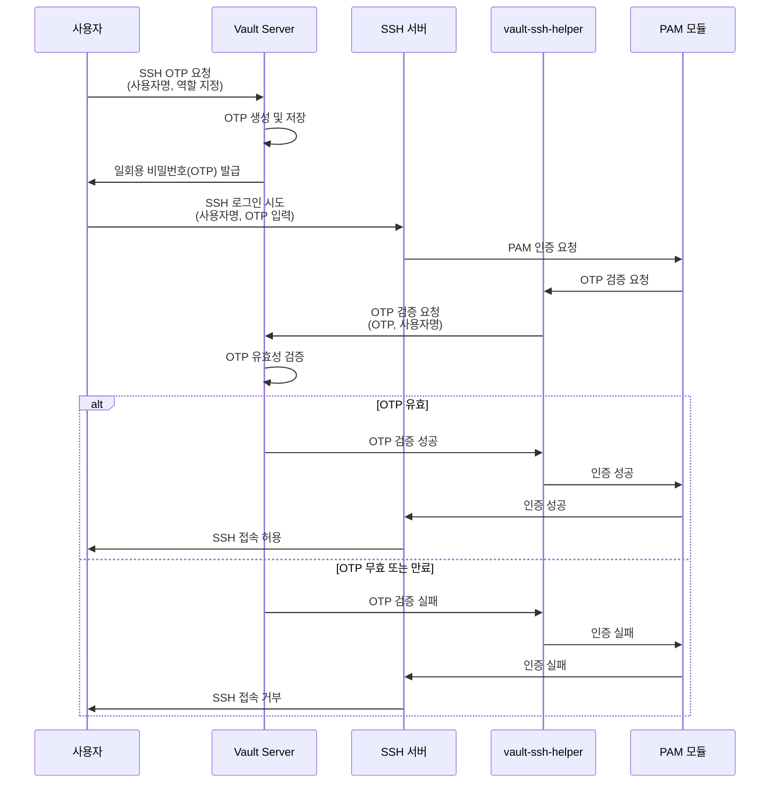
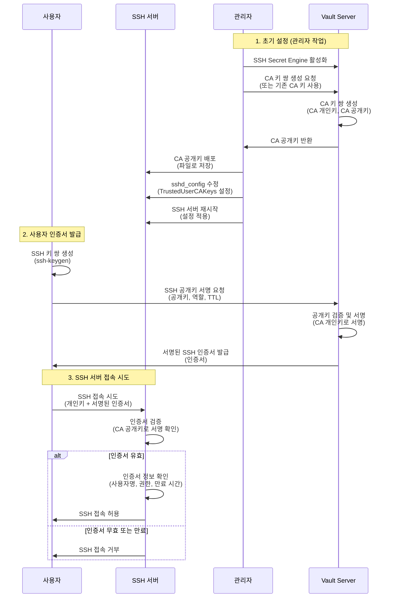

# Vault Support Environment

이 문서는 HashiCorp Vault의 각 컴포넌트와 Secret Engine의 역할 및 지원 환경(OS)을 정리합니다.

## Vault Server

Vault Server는 중앙 집중식 비밀 관리 시스템으로, 비밀번호, API 키, 인증서 등 민감한 데이터를 안전하게 저장하고 접근을 제어합니다. 정책 기반의 접근 제어를 통해 비밀에 대한 접근을 관리하며, 다양한 인증 방법과 시크릿 엔진을 통해 다양한 환경과 통합됩니다.

| 지원 환경(OS) | CPU 아키텍처 | 비고 |
|---------------|--------------|------|
| Linux (Ubuntu, CentOS, RHEL, Debian, Amazon Linux 등) | 386, amd64, arm, arm64, s390x | 다양한 배포판에서 지원됩니다. |
| Windows (Windows Server 및 데스크톱 버전) | 386, amd64 | Windows 플랫폼에서도 설치 및 실행이 가능합니다. |
| macOS (Intel 및 Apple Silicon) | amd64, arm64 | 개발 및 테스트 목적으로 실행할 수 있습니다. |
| FreeBSD | 386, amd64, arm | - |
| NetBSD | 386, amd64, arm | - |
| OpenBSD | 386, amd64, arm | - |
| Solaris | amd64 | - |

## Vault Agent

Vault Agent는 클라이언트 측에서 Vault와의 상호작용을 단순화하고 자동화하는 경량 프로세스입니다. 자동 인증, 토큰 갱신, 비밀 캐싱, 템플릿 렌더링 등의 기능을 제공하여 애플리케이션이 Vault와 원활하게 통합되도록 지원합니다.

| 지원 환경(OS) | CPU 아키텍처 | 비고 |
|---------------|--------------|------|
| Linux (Ubuntu, CentOS, RHEL 등) | 386, amd64, arm, arm64, s390x | Vault Server와 동일한 운영 체제에서 실행 가능합니다. |
| Windows | 386, amd64 | Windows 서비스로 등록하여 실행할 수 있습니다. |
| macOS | amd64, arm64 | 개발 및 테스트 목적으로 실행할 수 있습니다. |
| FreeBSD | 386, amd64, arm | - |
| NetBSD | 386, amd64, arm | - |
| OpenBSD | 386, amd64, arm | - |
| Solaris | amd64 | - |

## SSH Secret Engine 개요

HashiCorp Vault의 SSH Secret Engine은 SSH 접속을 안전하게 관리하기 위해 두 가지 방식을 제공합니다:

1. **OTP (One-Time Password) 방식**: 일회용 비밀번호를 생성하여 SSH 접속 시 인증에 사용
2. **Signed Certificate 방식**: SSH 인증서를 생성하고 서명하여 SSH 접속 시 인증에 사용

### SSH Secret Engine 방식 비교

| 비교 항목 | OTP 방식 | Signed Certificate 방식 |
|-----------|----------|------------------------|
| **지원 운영 체제** | Linux 배포판만 지원 | OpenSSH를 지원하는 모든 OS (Linux, Unix, Windows 등) |
| **Unix 시스템 지원** | ❌ 지원 안 함 (AIX, Solaris, HP-UX 등) | ✅ 지원 (OpenSSH 설치 필요) |
| **추가 소프트웨어** | `vault-ssh-helper` 필수 설치 | 추가 소프트웨어 불필요 |
| **PAM 요구사항** | PAM 지원 필수 | PAM 불필요 |
| **인증서 재사용** | ❌ 일회용 (사용 후 무효화) | ✅ TTL 동안 재사용 가능 |
| **설정 복잡도** | 중간 (PAM 구성 필요) | 낮음 (OpenSSH 기본 기능만 사용) |
| **네트워크 장비 지원** | ❌ 지원 안 함 | ✅ 지원 (OpenSSH CA 또는 X.509 for SSH 지원 필요) |
| **보안성** | 높음 (일회용) | 높음 (인증서 기반) |
| **관리 편의성** | 중간 (매번 OTP 발급 필요) | 높음 (인증서 TTL 동안 유효) |

**선택 가이드:**
- **Linux 환경만 사용**: 두 방식 모두 사용 가능하나, Signed Certificate 방식이 설정이 간단하고 관리가 용이합니다.
- **Unix 시스템 포함 (AIX, Solaris, HP-UX 등)**: **Signed Certificate 방식만 사용 가능**합니다.
- **네트워크 장비**: Signed Certificate 방식만 사용 가능하며, OpenSSH CA 인증 또는 X.509 for SSH (RFC 6187) 지원 여부를 확인해야 합니다.

## SSH Secret Engine - OTP

SSH Secret Engine의 OTP(One-Time Password) 방식은 일회용 비밀번호를 생성하여 SSH 접속 시 인증에 사용합니다. 각 SSH 접속마다 고유한 OTP를 생성하여 보안성을 높이며, 사용자는 Vault에서 발급한 일회용 비밀번호로 SSH 서버에 접속할 수 있습니다.

**참고**: SSH Secret Engine - OTP를 사용하려면 SSH 서버에 `vault-ssh-helper`가 반드시 설치되어 있어야 합니다. `vault-ssh-helper`는 PAM(Pluggable Authentication Module)과 통합되어 OTP 인증을 수행합니다.

**중요 제약사항**: OTP 방식은 **Linux 배포판에서만 사용 가능**합니다. `vault-ssh-helper`가 PAM을 통해서만 작동하므로, AIX, Solaris, HP-UX 등의 Unix 시스템에서는 사용할 수 없습니다. Unix 시스템에서는 Signed Certificate 방식을 사용해야 합니다.

### OTP 적용을 위한 OS 제약사항

`vault-ssh-helper`는 PAM(Pluggable Authentication Module)을 지원하는 Linux 배포판에서만 사용 가능합니다. `vault-ssh-helper`는 PAM 모듈(`pam_exec.so`)을 통해 작동하므로, PAM을 지원하지 않는 시스템에서는 사용할 수 없습니다.

또한, SSH 서버 설정에서 다음 옵션들이 활성화되어 있어야 합니다:
- `ChallengeResponseAuthentication yes`: 키보드 인터랙티브 인증 활성화
- `UsePAM yes`: PAM 인증 모듈 사용 활성화

각 Linux 배포판마다 PAM 설정 파일 위치와 구성 방법이 다를 수 있으므로, 배포판별 문서를 참고하여 설정해야 합니다.

| 지원 환경 | CPU 아키텍처 | 비고 |
|-----------|--------------|------|
| Vault Server: Vault가 지원하는 모든 OS | Vault Server 지원 아키텍처 | - |
| vault-ssh-helper: Linux | 386, amd64, arm | 원격 호스트에 `vault-ssh-helper`를 설치하고 PAM(Pluggable Authentication Module) 구성을 변경해야 합니다. [vault-ssh-helper 릴리스 페이지](https://releases.hashicorp.com/vault-ssh-helper/0.2.1/)에서 다운로드 가능합니다. |
| SSH 클라이언트: SSH 프로토콜을 지원하는 모든 OS | - | - |

### vault-ssh-helper 지원 Linux 배포판

다음은 `vault-ssh-helper`가 적용 가능한 알려진 Linux 배포판 목록입니다. `vault-ssh-helper`는 PAM을 지원하는 Linux 배포판에서 작동하며, 각 배포판의 PAM 설정 파일 위치와 구성 방법이 다를 수 있습니다.

| Linux 배포판 | 최소 버전 | PAM 설정 파일 위치 | 비고 |
|--------------|-----------|---------------------|------|
| Ubuntu | 14.04 이상 | `/etc/pam.d/sshd` | 설정 예시: [SSH OTP - Debian 계열](../02-Secret_Engine/ssh-otp-debian.html) |
| Debian | 7.0 (Wheezy) 이상 | `/etc/pam.d/sshd` | 설정 예시: [SSH OTP - Debian 계열](../02-Secret_Engine/ssh-otp-debian.html) |
| CentOS | 7.0 이상 | `/etc/pam.d/sshd` | 설정 예시: [SSH OTP - RedHat 계열](../02-Secret_Engine/ssh-otp-redhat.html) |
| RHEL (Red Hat Enterprise Linux) | 7.0 이상 | `/etc/pam.d/sshd` | 설정 예시: [SSH OTP - RedHat 계열](../02-Secret_Engine/ssh-otp-redhat.html) |
| Amazon Linux | 1.0 이상 | `/etc/pam.d/sshd` | RedHat 계열과 유사한 설정 방법 적용 가능 |
| Arch Linux | - | `/etc/pam.d/sshd` | AUR 패키지로 설치 가능 |
| SUSE Linux Enterprise Server (SLES) | 12 이상 | `/etc/pam.d/sshd` | - |
| openSUSE | 13.2 이상 | `/etc/pam.d/sshd` | - |
| Fedora | 20 이상 | `/etc/pam.d/sshd` | 설정 예시: [SSH OTP - RedHat 계열](../02-Secret_Engine/ssh-otp-redhat.md) |

**참고사항:**
- `vault-ssh-helper`는 Go 언어로 작성되어 있어, Go 런타임이 지원하는 대부분의 Linux 환경에서 실행 가능합니다. 커널 버전은 직접적인 요구사항이 아닙니다.
- PAM(Pluggable Authentication Module)은 사용자 공간 라이브러리이므로, 커널 버전과 직접적인 관련이 없습니다. 대부분의 Linux 배포판에서 PAM이 기본 제공됩니다.
- 각 배포판의 PAM 설정 방법이 다를 수 있으므로, 배포판별 공식 문서를 참고하여 설정해야 합니다.
- 실제 환경에서의 호환성을 보장하기 위해서는 해당 시스템에서 직접 테스트를 권장합니다.

### SSH Secret Engine - OTP 워크플로우

SSH Secret Engine - OTP 방식의 인증 프로세스는 다음과 같습니다:



**워크플로우 설명:**
1. 사용자가 Vault에 SSH OTP를 요청합니다. 이때 사용자명과 역할(role)을 지정합니다.
2. Vault는 일회용 비밀번호(OTP)를 생성하고 내부에 저장합니다.
3. Vault는 생성한 OTP를 사용자에게 반환합니다.
4. 사용자는 SSH 서버에 로그인을 시도하며, 비밀번호 입력 시 Vault에서 받은 OTP를 입력합니다.
5. SSH 서버는 PAM(Pluggable Authentication Module)을 통해 인증을 처리합니다.
6. PAM은 `vault-ssh-helper`를 호출하여 OTP를 검증합니다.
7. `vault-ssh-helper`는 Vault에 OTP 검증을 요청합니다.
8. Vault는 OTP의 유효성을 검증하고 결과를 반환합니다.
9. 검증 결과에 따라 SSH 접속이 허용되거나 거부됩니다.

**중요 제약사항:**
- OTP 방식은 **Linux 배포판에서만 사용 가능**합니다. `vault-ssh-helper`가 PAM을 통해서만 작동하므로, PAM을 지원하지 않는 Unix 시스템(AIX, Solaris, HP-UX 등)에서는 사용할 수 없습니다.
- SSH 서버에 `vault-ssh-helper` 설치 및 PAM 구성이 필수입니다.
- OTP는 일회용이며, 사용 후 즉시 무효화됩니다.

## SSH Secret Engine - Signed Certificate

SSH Secret Engine의 Signed Certificate 방식은 SSH 인증서를 생성하고 서명하여 SSH 접속 시 인증에 사용합니다. 중앙 집중식으로 SSH 인증서를 관리하여 보안성과 관리 효율성을 높이며, Vault가 SSH 클라이언트 또는 서버 인증을 위한 서명된 SSH 인증서를 발급합니다.

**중요 특징**: Signed Certificate 방식은 **OpenSSH를 지원하는 모든 운영 체제에서 사용 가능**합니다. Linux뿐만 아니라 AIX, Solaris, HP-UX 등의 Unix 시스템에서도 사용할 수 있으며, SSH 서버에 추가 소프트웨어 설치가 필요 없습니다.

### Signed Certificate 적용을 위한 OS 제약사항

SSH Secret Engine - Signed Certificate를 사용하려면 SSH 서버와 클라이언트 모두 OpenSSH의 CA(Certificate Authority) 기능을 지원해야 합니다. OpenSSH 5.4 이상 버전에서 CA 인증 기능이 지원되며, `TrustedUserCAKeys` 또는 `TrustedUserCAKeysFile` 옵션을 `sshd_config` 파일에 구성할 수 있어야 합니다.

**중요 참고사항:**
- OpenSSH 8.2 이상 버전에서는 RSA/SHA1 CA 서명 알고리즘이 기본적으로 신뢰되지 않습니다. Vault가 RSA 키를 사용하는 경우 `sshd_config` 파일에 `CASignatureAlgorithms ^ssh-rsa` 설정을 추가해야 할 수 있습니다.
- SSH 서버는 `TrustedUserCAKeys` 또는 `TrustedUserCAKeysFile` 옵션을 지원해야 합니다.
- 네트워크 장비의 경우, OpenSSH CA 인증 또는 X.509 for SSH (RFC 6187) 지원 여부에 따라 사용 가능 여부가 결정됩니다.

| 지원 환경 | CPU 아키텍처 | 비고 |
|-----------|--------------|------|
| Vault Server: Vault가 지원하는 모든 OS | Vault Server 지원 아키텍처 | - |
| SSH 서버: OpenSSH를 지원하는 모든 OS | OpenSSH 지원 아키텍처 | OpenSSH 5.4 이상 버전이 필요합니다. `TrustedUserCAKeys` 또는 `TrustedUserCAKeysFile` 옵션을 구성할 수 있는 환경에서 사용 가능합니다. |
| SSH 클라이언트: OpenSSH를 지원하는 모든 OS | OpenSSH 지원 아키텍처 | - |

### SSH Secret Engine - Signed Certificate 지원 운영 체제

다음은 SSH Secret Engine - Signed Certificate 방식이 적용 가능한 알려진 운영 체제 목록입니다. OpenSSH를 지원하는 모든 Unix 계열 운영 체제에서 사용 가능하며, 각 OS별로 OpenSSH 설치 및 구성 방법이 다를 수 있습니다.

| 운영 체제 | 최소 버전 | OpenSSH 최소 버전 | CPU 아키텍처 | 비고 |
|-----------|-----------|------------------|--------------|------|
| **Linux 배포판** | | | | |
| Ubuntu | 12.04 이상 | OpenSSH 5.9 이상 | amd64, arm64, arm | OpenSSH가 기본 설치되어 있습니다. |
| Debian | 7.0 (Wheezy) 이상 | OpenSSH 6.0 이상 | amd64, arm64, arm | - |
| CentOS | 6.0 이상 | OpenSSH 5.3 이상 | amd64, arm64 | - |
| RHEL (Red Hat Enterprise Linux) | 6.0 이상 | OpenSSH 5.3 이상 | amd64, arm64, s390x | - |
| Amazon Linux | 1.0 이상 | OpenSSH 5.3 이상 | amd64 | - |
| SUSE Linux Enterprise Server (SLES) | 11 SP3 이상 | OpenSSH 6.2 이상 | amd64, s390x | - |
| openSUSE | 12.3 이상 | OpenSSH 6.2 이상 | amd64 | - |
| Fedora | 17 이상 | OpenSSH 6.1 이상 | amd64, arm64 | - |
| Arch Linux | - | OpenSSH 6.0 이상 | amd64, arm64 | - |
| **Unix 계열** | | | | |
| AIX | 7.1 이상 | OpenSSH 6.0 이상 (별도 설치 필요) | Power (64-bit) | OpenSSH는 기본 제공되지 않으므로 별도 설치가 필요합니다. |
| Oracle Solaris | 11.0 이상 | OpenSSH 6.0 이상 | SPARC, x86-64 | OpenSSH는 기본 제공되거나 별도 설치 가능합니다. |
| HP-UX | 11i v3 이상 | OpenSSH 6.0 이상 (별도 설치 필요) | Itanium (IA-64) | OpenSSH는 기본 제공되지 않으므로 별도 설치가 필요합니다. |
| FreeBSD | 9.0 이상 | OpenSSH 6.0 이상 | amd64, arm64 | OpenSSH가 기본 설치되어 있습니다. |
| NetBSD | 6.0 이상 | OpenSSH 6.0 이상 | amd64, arm | OpenSSH가 기본 설치되어 있습니다. |
| OpenBSD | 5.3 이상 | OpenSSH 6.0 이상 | amd64, arm64 | OpenSSH가 기본 설치되어 있습니다. |
| **기타** | | | | |
| macOS | 10.12 (Sierra) 이상 | OpenSSH 7.2 이상 | amd64, arm64 | OpenSSH가 기본 설치되어 있습니다. |
| Windows | Windows 10 1809 이상 / Windows Server 2019 이상 | OpenSSH 7.7 이상 (별도 설치 또는 Windows 기본 제공) | amd64 | Windows 10 1809 이상에서 OpenSSH 클라이언트가 기본 제공되며, Windows Server 2019 이상에서 OpenSSH 서버 설치 가능합니다. |

**참고사항:**
- 위 표의 OpenSSH 최소 버전은 CA 인증 기능을 사용하기 위한 최소 요구사항입니다. 최신 버전 사용을 권장합니다.
- OpenSSH 8.2 이상 버전에서는 RSA/SHA1 서명 알고리즘이 기본적으로 비활성화되어 있으므로, Vault가 RSA 키를 사용하는 경우 `CASignatureAlgorithms` 설정이 필요할 수 있습니다.
- AIX, HP-UX 등 일부 Unix 시스템에서는 OpenSSH가 기본 제공되지 않으므로 별도 설치가 필요합니다.
- 각 운영 체제의 OpenSSH 버전 확인 방법: `ssh -V` 또는 `sshd -V` 명령어 사용
- 네트워크 장비의 경우, 아래 네트워크 장비 지원 현황 표를 참고하시기 바랍니다.

### SSH Secret Engine - Signed Certificate 워크플로우

SSH Secret Engine - Signed Certificate 방식의 인증 프로세스는 다음과 같습니다:



**워크플로우 설명:**

#### 1. 초기 설정 (관리자 작업)

1. **SSH Secret Engine 활성화**: 관리자는 Vault에서 SSH Secret Engine을 활성화합니다.
2. **CA 키 쌍 생성**: 관리자는 Vault에 CA 키 쌍 생성을 요청하거나, 기존 CA 키를 사용하도록 구성합니다. Vault는 CA 개인키와 CA 공개키를 생성합니다.
3. **CA 공개키 배포**: 관리자는 Vault에서 반환받은 CA 공개키를 SSH 서버에 배포합니다. 일반적으로 `/etc/ssh/ca.pub` 같은 경로에 저장합니다.
4. **SSH 서버 설정 변경**: 관리자는 SSH 서버의 설정 파일(`/etc/ssh/sshd_config`)을 수정하여 CA 공개키를 신뢰하도록 설정합니다:
   ```
   TrustedUserCAKeys /etc/ssh/ca.pub
   ```
   또는 여러 CA를 지원하려면:
   ```
   TrustedUserCAKeysFile /etc/ssh/ca_keys
   ```
5. **SSH 서버 재시작**: 설정 변경 사항을 적용하기 위해 SSH 서버를 재시작합니다.

#### 2. 사용자 인증서 발급

6. **SSH 키 쌍 생성**: 사용자는 먼저 SSH 키 쌍(개인키와 공개키)을 생성합니다.
7. **Vault에 공개키 서명 요청**: 사용자는 Vault에 공개키를 제출하고 서명을 요청합니다. 이때 역할(role)과 TTL(Time To Live)을 지정할 수 있습니다.
8. **Vault가 인증서 발급**: Vault는 CA 개인키를 사용하여 공개키에 서명하고, 서명된 SSH 인증서를 발급합니다.

#### 3. SSH 서버 접속

9. **SSH 서버 접속 시도**: 사용자는 개인키와 서명된 인증서를 사용하여 SSH 서버에 접속을 시도합니다.
10. **SSH 서버가 인증서 검증**: SSH 서버는 미리 구성된 CA 공개키를 사용하여 인증서의 서명을 검증합니다.
11. **접속 허용 또는 거부**: 인증서가 유효하고 만료되지 않았다면 접속이 허용되고, 그렇지 않으면 거부됩니다.

**중요 특징:**
- Signed Certificate 방식은 **OpenSSH를 지원하는 모든 운영 체제에서 사용 가능**합니다. Linux뿐만 아니라 AIX, Solaris, HP-UX 등의 Unix 시스템에서도 사용할 수 있습니다.
- SSH 서버에 추가 소프트웨어 설치가 필요 없습니다. OpenSSH의 기본 기능만으로 동작합니다.
- 인증서는 지정된 TTL 동안 유효하며, 만료 전까지 재사용 가능합니다.
- 네트워크 장비에서도 OpenSSH CA 인증 또는 X.509 for SSH (RFC 6187)를 지원하는 경우 사용 가능합니다.

### SSH Secret Engine - Signed Certificate 네트워크 장비 지원 현황

| 제조사 | OS 종류 | OpenSSH CA 인증 | X.509 for SSH (RFC 6187) | 비고 |
|--------|---------|-----------------|--------------------------|------|
| Cisco | IOS | 미지원 | 15.5(2)T 이상 | - |
| | IOS-XE | 미지원 | 15.5(2)S 이상 | Cisco Catalyst 4500, 6500, 7600계열 미지원 |
| | IOS-XR | 7.5.3 이상 | 7.3.1 이상 | - |
| | NX-OS | 미지원 | 7.0(3)I5(1) 이상 | - |
| Juniper | JunOS | 모든 MX 22.4 이상 | 미지원 | - |
| Extreme | XOS | XOS32 이상 | 미지원 | - |
| Arista | EOS | 4.22.1F 이상 | 4.32.2F 이상 | 4.25F, 4.28.3M, 4.30.3M 버전 확인 필요 |

## Database Secret Engine

Database Secret Engine은 데이터베이스의 동적 자격 증명을 생성하고 관리합니다. 애플리케이션은 필요할 때마다 일회용 자격 증명을 받아 데이터베이스에 접속할 수 있으며, 보안성과 관리 효율성을 높입니다. 자격 증명의 수명을 관리하고 자동으로 회전시킵니다.

**참고**: 각 데이터베이스별로 플러그인이 제공되며, Vault Server가 데이터베이스 서버와 네트워크 통신이 가능해야 합니다. 자세한 내용은 [HashiCorp Vault Database Secrets Engine 문서](https://developer.hashicorp.com/vault/docs/secrets/databases#database-capabilities)를 참고하시기 바랍니다.

### Database Secret Engine 지원 데이터베이스

| 데이터베이스 | 동적 역할 | 정적 역할 | Root 자격 증명 회전 | 사용자명 커스터마이징 | 자격 증명 타입 | 비고 |
|-------------|---------|---------|-------------------|------------------|--------------|------|
| **관계형 데이터베이스** | | | | | | |
| MySQL/MariaDB | ✅ | ✅ | ✅ | ✅ | password | - |
| PostgreSQL | ✅ | ✅ | ✅ | ✅ | password | - |
| Oracle | ✅ | ✅ | ✅ | ✅ | password | - |
| Microsoft SQL Server (MSSQL) | ✅ | ✅ | ✅ | ✅ | password | - |
| IBM Db2 | ✅ | ✅ | ✅ | ✅ | password | - |
| SAP HANA (HanaDB) | ✅ | ✅ | ✅ | ✅ | password | - |
| Amazon Redshift | ✅ | ✅ | ✅ | ✅ | password | Vault 1.8+ |
| Snowflake | ✅ | ✅ | ✅ | ✅ | password (deprecated), rsa_private_key | Vault 1.8+ |
| **NoSQL 데이터베이스** | | | | | | |
| MongoDB | ✅ | ✅ | ✅ | ✅ | password | - |
| MongoDB Atlas | ✅ | ❌ | ❌ | ✅ | password | - |
| Cassandra | ✅ | ✅ | ✅ | ✅ | password | - |
| Couchbase | ✅ | ✅ | ✅ | ✅ | password | - |
| **시계열 데이터베이스** | | | | | | |
| InfluxDB | ✅ | ❌ | ❌ | ✅ | password | - |
| **검색 엔진** | | | | | | |
| Elasticsearch | ✅ | ❌ | ❌ | ✅ | password | - |
| **캐시/인메모리 데이터베이스** | | | | | | |
| Redis | ✅ | ❌ | ❌ | ✅ | password | - |
| Redis ElastiCache | ❌ | ❌ | ❌ | ✅ | password | - |
| **기타** | | | | | | |
| Custom Database Plugin | - | - | - | - | - | 사용자 정의 데이터베이스 플러그인을 통해 확장 가능 |

**기능 설명:**
- **동적 역할 (Dynamic Roles)**: 요청 시마다 새로운 데이터베이스 사용자를 생성하고 자격 증명을 발급합니다. 임대 기간이 만료되면 자동으로 사용자와 자격 증명이 삭제됩니다.
- **정적 역할 (Static Roles)**: 기존 데이터베이스 사용자와 1:1 매핑되며, Vault가 주기적으로 비밀번호를 자동 회전시킵니다.
- **Root 자격 증명 회전**: Vault가 데이터베이스에 접속하는 데 사용하는 root 자격 증명을 자동으로 회전시킵니다.
- **사용자명 커스터마이징**: 동적 역할에서 생성되는 사용자명을 커스터마이징할 수 있습니다.
- **자격 증명 타입**: 대부분의 데이터베이스는 password를 사용하며, Snowflake는 rsa_private_key도 지원합니다.

**지원 환경:**
- Vault Server: Vault가 지원하는 모든 OS
- 데이터베이스 서버: 각 데이터베이스별로 지원하는 운영 체제 및 버전
- 네트워크: Vault Server가 데이터베이스 서버와 네트워크 통신이 가능해야 합니다.

## Public Cloud Secret Engines

### AWS Secret Engine

AWS Secret Engine은 AWS IAM 사용자 및 임시 자격 증명을 동적으로 생성하고 관리합니다. AWS 리소스에 대한 접근을 안전하게 제어할 수 있으며, 필요 시마다 새로운 자격 증명을 발급하여 보안을 강화합니다.

| 지원 환경 | 비고 |
|-----------|------|
| Vault Server: Vault가 지원하는 모든 OS | - |
| AWS API와 통신 가능한 네트워크 환경 | AWS API 엔드포인트와 통신이 가능해야 하며, AWS 자격 증명(Access Key, Secret Key) 또는 IAM Role이 필요합니다. |

### Azure Secret Engine

Azure Secret Engine은 Azure의 서비스 주체(Service Principal) 및 자격 증명을 동적으로 생성하고 관리합니다. Azure 리소스에 대한 접근을 안전하게 제어할 수 있으며, 필요 시마다 새로운 자격 증명을 발급하여 보안을 강화합니다.

| 지원 환경 | 비고 |
|-----------|------|
| Vault Server: Vault가 지원하는 모든 OS | - |
| Azure API와 통신 가능한 네트워크 환경 | Azure API와 통신이 가능해야 하며, Azure 자격 증명(Client ID, Client Secret) 또는 Managed Identity가 필요합니다. |

### GCP Secret Engine

GCP Secret Engine은 Google Cloud Platform(GCP)의 서비스 계정 및 자격 증명을 동적으로 생성하고 관리합니다. GCP 리소스에 대한 접근을 안전하게 제어할 수 있으며, 필요 시마다 새로운 자격 증명을 발급하여 보안을 강화합니다.

| 지원 환경 | 비고 |
|-----------|------|
| Vault Server: Vault가 지원하는 모든 OS | - |
| GCP API와 통신 가능한 네트워크 환경 | GCP API와 통신이 가능해야 하며, GCP 서비스 계정 키 또는 Workload Identity가 필요합니다. |

### Alibaba Cloud Secret Engine

Alibaba Cloud Secret Engine은 Alibaba Cloud의 자격 증명을 동적으로 생성하고 관리합니다. Alibaba Cloud 리소스에 대한 접근을 안전하게 제어할 수 있습니다.

| 지원 환경 | 비고 |
|-----------|------|
| Vault Server: Vault가 지원하는 모든 OS | - |
| Alibaba Cloud API와 통신 가능한 네트워크 환경 | Alibaba Cloud API와 통신이 가능해야 하며, Alibaba Cloud 자격 증명(Access Key ID, Access Key Secret)이 필요합니다. |

### Tencent Cloud Secret Engine

Tencent Cloud Secret Engine은 Tencent Cloud의 자격 증명을 동적으로 생성하고 관리합니다. Tencent Cloud 리소스에 대한 접근을 안전하게 제어할 수 있습니다.

| 지원 환경 | 비고 |
|-----------|------|
| Vault Server: Vault가 지원하는 모든 OS | - |
| Tencent Cloud API와 통신 가능한 네트워크 환경 | Tencent Cloud API와 통신이 가능해야 하며, Tencent Cloud 자격 증명(SecretId, SecretKey)이 필요합니다. |

## AD Secret Engine

AD Secret Engine은 Active Directory의 동적 자격 증명을 생성하고 관리합니다. Windows 환경에서 서비스 계정이나 사용자 계정의 자격 증명을 동적으로 생성하여 보안을 강화합니다.

| 지원 환경 | 비고 |
|-----------|------|
| Vault Server: Vault가 지원하는 모든 OS | - |
| Windows Server (Active Directory 도메인 환경) | Active Directory 도메인 컨트롤러와 통신이 가능해야 하며, Vault가 AD에 서비스 계정을 생성/삭제할 수 있는 권한이 필요합니다. |
| Active Directory와 네트워크 통신 가능 | - |

## LDAP Secret Engine

LDAP Secret Engine은 LDAP(Lightweight Directory Access Protocol) 디렉터리 서비스를 통한 자격 증명 관리를 제공합니다. LDAP 디렉터리 내의 사용자 및 그룹 정보를 활용하여 인증 및 권한 관리를 수행하며, 조직의 기존 인증 인프라와 Vault를 통합할 수 있습니다.

| 지원 환경 | 비고 |
|-----------|------|
| Vault Server: Vault가 지원하는 모든 OS | - |
| OpenLDAP | LDAP 프로토콜을 지원하는 모든 디렉터리 서비스와 통합 가능합니다. Vault가 LDAP 서버와 통신할 수 있어야 하며, 적절한 바인드 자격 증명이 필요합니다. |
| Active Directory (LDAP 프로토콜 사용) | - |
| 389 Directory Server | - |
| 기타 LDAP 호환 디렉터리 서비스 | - |
| LDAP 서버와 네트워크 통신 가능 | - |

## Transit Secret Engine

Transit Secret Engine은 데이터의 암호화 및 복호화를 수행하는 서비스를 제공합니다. 애플리케이션은 Vault API를 통해 데이터를 암호화하거나 복호화할 수 있으며, 암호화 키 관리는 Vault가 중앙에서 수행합니다. 이를 통해 애플리케이션은 민감한 데이터를 Vault를 통해 안전하게 암호화하고, 필요 시 복호화할 수 있습니다.

| 지원 환경 | 비고 |
|-----------|------|
| Vault Server: Vault가 지원하는 모든 OS | - |
| 클라이언트: HTTP API를 지원하는 모든 환경 | 운영 체제에 종속되지 않으며, Vault API를 통해 접근 가능한 모든 환경에서 사용할 수 있습니다. |

### Transit Secret Engine 지원 암호화 키 종류

| 키 종류 | 키 크기/타입 | 지원 알고리즘 | 비고 |
|---------|-------------|--------------|------|
| AES | 128-bit, 256-bit | - AES-GCM-128<br/>- AES-GCM-256<br/>- AES-CBC-128<br/>- AES-CBC-256 | 대칭키 암호화 알고리즘 |
| RSA | 2048-bit, 3072-bit, 4096-bit | - RSA-OAEP<br/>- RSA-PSS<br/>- RSA-PKCS1v15 | 공개키 암호화 알고리즘 |
| ECDSA | P-256, P-384, P-521 | - ECDSA-P256<br/>- ECDSA-P384<br/>- ECDSA-P521 | 타원곡선 디지털 서명 알고리즘 |
| ED25519 | 256-bit | - ED25519 | 타원곡선 기반 디지털 서명 알고리즘 |
| ChaCha20-Poly1305 | 256-bit | - ChaCha20-Poly1305 | 스트림 암호화 알고리즘 |

## 참고 사항

- 모든 Secret Engine은 Vault Server가 지원하는 운영 체제에서 사용 가능합니다.
- 각 Secret Engine의 구체적인 지원 환경 및 요구사항은 HashiCorp Vault 공식 문서를 참고하시기 바랍니다.
- 네트워크 장비의 SSH 인증서 지원 여부는 제조사 및 OS 버전에 따라 다를 수 있으므로, 실제 환경에서 테스트를 권장합니다.
