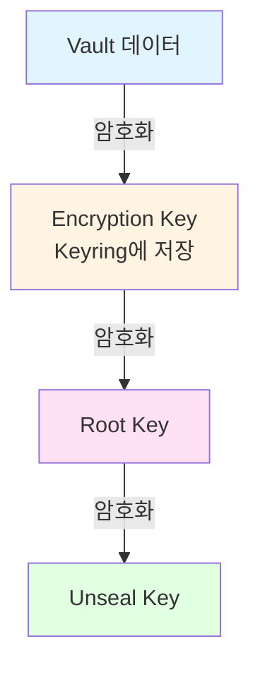
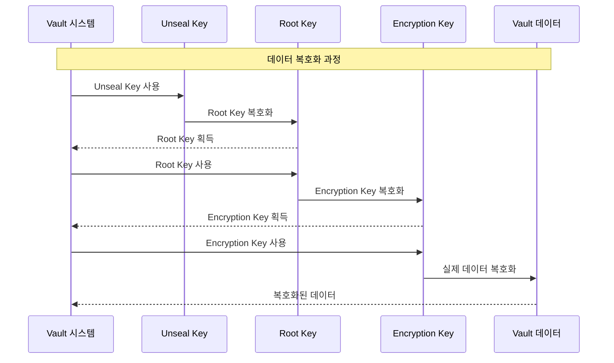
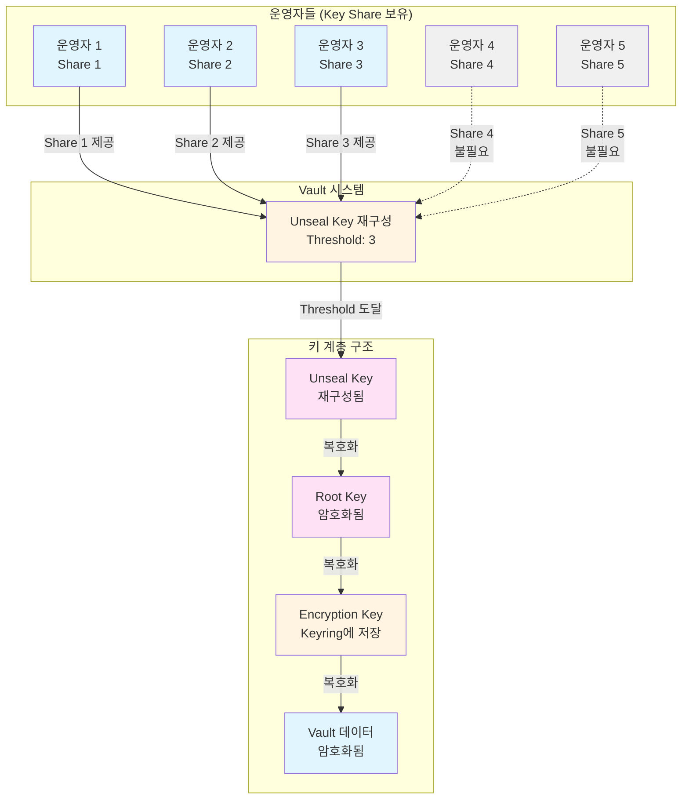

# Seal/Unseal 개념 설명

## 1. 개요

HashiCorp Vault는 시작 시 **sealed(봉인된)** 상태로 시작합니다. 이 상태에서는 물리적 스토리지에 접근할 수 있지만, 저장된 데이터를 복호화할 수 없습니다. **Unsealing(봉인 해제)**은 Vault가 데이터를 복호화하기 위해 필요한 root key에 접근하는 과정입니다.

## 2. 암호화 계층 구조

Vault는 **3단계 암호화 계층 구조**를 사용하여 데이터를 보호합니다:



### 2.1 각 키의 역할

1. **Encryption Key (암호화 키)**
   - Vault에 저장된 대부분의 데이터를 암호화하는 데 사용
   - Keyring에 저장되며, 실제 비밀 데이터를 암호화/복호화

2. **Root Key (루트 키)**
   - Encryption Key를 보호하기 위해 사용
   - Root Key가 있어야 Encryption Key를 복호화할 수 있음
   - Vault의 모든 데이터와 함께 저장되지만, Unseal Key로 암호화되어 있음

3. **Unseal Key (봉인 해제 키)**
   - Root Key를 암호화하는 최종 키
   - Shamir's Secret Sharing 알고리즘을 통해 여러 share로 분할됨
   - 특정 threshold(임계값) 이상의 share가 모여야 Unseal Key를 재구성할 수 있음

### 2.2 동작 원리



#### 코드에서의 구현

Vault의 암호화 계층 구조는 다음과 같이 구현되어 있습니다:

1. **Unseal Key로 Root Key 복호화**: `UnsealWrapStoredBarrierKeys()` 함수가 Unseal Key를 사용하여 저장된 Root Key를 복호화합니다.

2. **Root Key로 Encryption Key 복호화**: Root Key가 메모리에 로드되면, Vault의 barrier(암호화 레이어)가 이를 사용하여 Encryption Key를 복호화합니다.

3. **Encryption Key로 데이터 복호화**: 복호화된 Encryption Key를 사용하여 실제 Vault 데이터를 암호화/복호화합니다.

**저장 경로 (코드 상수):**
```go:vault/seal.go
const (
	barrierSealConfigPath = "core/seal-config"
	recoverySealConfigPath = "core/recovery-seal-config"
	recoverySealConfigPlaintextPath = "core/recovery-config"
	recoveryKeyPath = "core/recovery-key"
	StoredBarrierKeysPath = "core/hsm/barrier-unseal-keys"
	hsmStoredIVPath = "core/hsm/iv"
	SealGenInfoPath = "core/seal-gen-info"
	SealInitializationFlagPath = "core/seal-initialization-flag"
)
```

**주요 저장 경로 설명:**
- **Root Key (Barrier Keys)**: `StoredBarrierKeysPath = "core/hsm/barrier-unseal-keys"` - HSM 사용 시 암호화된 Root Key 저장
- **Recovery Key**: `recoveryKeyPath = "core/recovery-key"` - Recovery Key 저장 (암호화됨)
- **Seal Config**: `barrierSealConfigPath = "core/seal-config"` - **평문 저장** (Vault가 sealed 상태에서도 읽을 수 있어야 하므로)
- **Recovery Config**: `recoverySealConfigPlaintextPath = "core/recovery-config"` - Recovery seal 설정 (평문 저장, auto-unseal 수행을 위해)

## 3. Seal/Unseal 동작 원리

### 3.1 Vault 시작 시 (Sealed 상태)

Vault 서버가 시작되면:
- 물리적 스토리지에 접근 가능
- 하지만 **Root Key가 메모리에 없음**
- 따라서 Encryption Key를 복호화할 수 없어 데이터 접근 불가
- 이 상태를 **Sealed(봉인된)** 상태라고 함

### 3.2 Unsealing 과정

Unsealing은 다음 단계로 진행됩니다:

1. **Unseal Key Share 제공**
   - 운영자가 `vault operator unseal` 명령 또는 API를 통해 unseal key share를 제공
   - Shamir's Secret Sharing을 사용하는 경우, threshold 이상의 share가 필요

2. **Unseal Key 재구성**
   - 충분한 share가 모이면 Vault가 Unseal Key를 재구성

3. **Root Key 복호화**
   - 재구성된 Unseal Key로 Root Key를 복호화
   - Root Key가 메모리에 로드됨

4. **Encryption Key 복호화**
   - Root Key로 Encryption Key를 복호화
   - 이제 Vault가 데이터에 접근할 수 있음

#### 3.2.1 Shamir's Secret Sharing 동작 원리

Shamir Seal을 사용할 때, Unseal Key는 여러 share로 분할되어 여러 운영자에게 분산 보관됩니다. Threshold 이상의 share가 모여야 Unseal Key를 재구성할 수 있습니다.



**Shamir Seal의 특징:**
- **분산 보관**: Unseal Key를 여러 share로 분할하여 단일 실패점 제거
- **Threshold 메커니즘**: 예를 들어 5개 share 중 3개만 모이면 Unseal Key 재구성 가능
- **순서 무관**: Share는 어떤 순서로 제공해도 상관없음
- **상태 유지**: Unseal 과정은 상태를 유지하므로 여러 클라이언트에서 순차적으로 share 제공 가능

#### 코드 구현 예제

Vault 소스코드에서 Root Key(Barrier Key)의 암호화/복호화는 다음과 같이 구현되어 있습니다:

**Root Key 암호화 (저장 시):**
```go:vault/seal_util.go
func SealWrapStoredBarrierKeys(ctx context.Context, access seal.Access, keys [][]byte) (*physical.Entry, error) {
	buf, err := json.Marshal(keys)
	if err != nil {
		return nil, fmt.Errorf("failed to encode keys for storage: %w", err)
	}

	wrappedEntryValue, err := SealWrapValue(ctx, access, true, buf, DisallowPartialSealWrap)
	if err != nil {
		return nil, &ErrEncrypt{Err: fmt.Errorf("failed to encrypt keys for storage: %w", err)}
	}

	for _, blobInfo := range wrappedEntryValue.GetSlots() {
		blobInfo.Wrapped = false
	}

	wrappedValue, err := MarshalSealWrappedValue(wrappedEntryValue)
	if err != nil {
		return nil, fmt.Errorf("failed to marshal value for storage: %w", err)
	}
	return &physical.Entry{
		Key:   StoredBarrierKeysPath,
		Value: wrappedValue,
	}, nil
}
```

**Root Key 복호화 (Unseal 시):**
```go:vault/seal_util.go
func UnsealWrapStoredBarrierKeys(ctx context.Context, access seal.Access, pe *physical.Entry) ([][]byte, error) {
	wrappedEntryValue, err := UnmarshalSealWrappedValue(pe.Value)
	if err != nil {
		return nil, fmt.Errorf("failed to proto decode stored keys: %w", err)
	}

	return decodeBarrierKeys(ctx, access, &wrappedEntryValue.value)
}

func decodeBarrierKeys(ctx context.Context, access seal.Access, multiWrapValue *seal.MultiWrapValue) ([][]byte, error) {
	pt, _, err := access.Decrypt(ctx, multiWrapValue, nil)
	if err != nil {
		if strings.Contains(err.Error(), "message authentication failed") {
			return nil, &ErrInvalidKey{Reason: fmt.Sprintf("failed to decrypt keys from storage: %v", err)}
		}
		return nil, &ErrDecrypt{Err: fmt.Errorf("failed to decrypt keys from storage: %w", err)}
	}

	var keys [][]byte
	if err := json.Unmarshal(pt, &keys); err != nil {
		return nil, fmt.Errorf("failed to decode stored keys: %v", err)
	}
	return keys, nil
}
```

**일반적인 Seal Wrapping/Unwrapping:**
```go:vault/seal_util.go
func UnsealWrapValue(ctx context.Context, access seal.Access, entryKey string, wrappedEntryValue *SealWrappedValue) (entryValue []byte, uptodate bool, err error) {
	multiWrapValue := &seal.MultiWrapValue{
		Generation: wrappedEntryValue.GetGeneration(),
	}
	for _, blobInfo := range wrappedEntryValue.GetSlots() {
		blobInfoWithValuePath := &wrapping.BlobInfo{
			ValuePath:  entryKey,
			Ciphertext: blobInfo.Ciphertext,
			Iv:         blobInfo.Iv,
			Hmac:       blobInfo.Hmac,
			KeyInfo:    blobInfo.KeyInfo,
		}
		multiWrapValue.Slots = append(multiWrapValue.Slots, blobInfoWithValuePath)
	}

	entryValue, uptodate, err = access.Decrypt(ctx, multiWrapValue, nil)
	if err != nil {
		if isSealOldKeyError(err) {
			uptodate = false
		} else {
			return nil, false, err
		}
	}

	return entryValue, uptodate, nil
}
```

**코드 동작 설명:**
1. `SealWrapStoredBarrierKeys`: Root Key를 JSON으로 마샬링한 후, `SealWrapValue`를 통해 Unseal Key로 암호화하여 저장합니다.
2. `UnsealWrapStoredBarrierKeys`: 저장된 암호화된 Root Key를 읽어와 `decodeBarrierKeys`를 통해 복호화합니다.
3. `decodeBarrierKeys`: `access.Decrypt()`를 호출하여 Unseal Key로 Root Key를 복호화합니다. 이 과정에서 Unseal Key가 필요하며, Shamir Seal의 경우 충분한 share가 모여야 합니다.
4. `UnsealWrapValue`: 일반적인 seal wrapping된 값을 복호화하는 함수로, Encryption Key 복호화 등에도 사용됩니다.

### 3.3 Sealing 과정

Vault는 다음 상황에서 Sealed 상태가 됩니다:

1. **수동 Seal**
   - 관리자가 `vault operator seal` API를 호출
   - Root Key가 메모리에서 삭제됨
   - 단일 운영자만 필요 (root 권한)

2. **서버 재시작**
   - Vault 서버가 재시작되면 메모리의 Root Key가 사라짐
   - 자동으로 Sealed 상태로 돌아감

3. **스토리지 레이어 오류**
   - 복구 불가능한 스토리지 오류 발생 시
   - 보안을 위해 자동으로 Seal됨

#### Seal 상태 관리

Vault의 Seal 상태는 Core 구조체에서 관리됩니다:

- **Sealed 상태**: `Core.sealed` 필드가 `true`일 때, Root Key가 메모리에 없어 barrier(암호화 레이어)에 접근할 수 없습니다.
- **Unsealed 상태**: `Core.sealed` 필드가 `false`일 때, Root Key가 메모리에 로드되어 데이터에 접근할 수 있습니다.

**Seal 시 동작:**
1. Core의 `Seal()` 메서드가 호출됩니다.
2. 메모리에 있는 Root Key가 삭제됩니다.
3. `Core.sealed`가 `true`로 설정됩니다.
4. 이후 모든 데이터 접근 요청이 차단됩니다.

::: tip 중요
Seal은 Root Key를 **메모리에서만** 삭제합니다.

- 암호화된 Root Key는 여전히 스토리지에 저장되어 있습니다 (`StoredBarrierKeysPath`).
- Unseal 시 저장된 암호화된 Root Key를 읽어와 Unseal Key로 복호화하여 메모리에 로드합니다.
:::

### 3.4 보안상의 이점

::: tip 보안 모범 사례
- **침입 탐지 시**: 빠르게 Seal하여 데이터 접근 차단 가능
- **재시작 시**: 자동으로 Seal되어 무단 접근 방지
- **분산 보관**: Unseal Key share를 여러 운영자에게 분산하여 단일 실패점 제거
:::

## 4. Recovery Key의 역할과 동작

### 4.1 Recovery Key란?

**Recovery Key**는 Auto Unseal(자동 봉인 해제) 또는 HSM을 사용할 때 생성되는 별도의 키 세트입니다.

### 4.2 Recovery Key vs Unseal Key

| 구분 | Unseal Key (Shamir Seal) | Recovery Key (Auto Unseal/HSM) |
|------|-------------------------|-------------------------------|
| 용도 | Vault 봉인 해제 | 복구 작업 인증 |
| 생성 시점 | 초기화 시 | Auto Unseal/HSM 초기화 시 |
| 사용 시나리오 | 수동 unsealing | Root token 생성, rekeying 등 |
| 분할 방식 | Shamir's Secret Sharing | Shamir's Secret Sharing |

### 4.3 Recovery Key의 역할

Recovery Key는 다음 작업을 인증하는 데 사용됩니다:

1. **Root Token 생성** (`generate-root` 기능)
2. **Unseal Key Rekeying** (Auto Unseal 사용 시)
3. **Recovery Key Rekeying**
4. 기타 고위험 복구 작업

#### 코드 구현 예제

Recovery Key도 Root Key와 유사하게 Seal Wrapping을 통해 저장됩니다:

**Recovery Key 암호화 (저장 시):**
```go:vault/seal_util.go
func SealWrapRecoveryKey(ctx context.Context, access seal.Access, key []byte) (*physical.Entry, error) {
	wrappedEntryValue, err := SealWrapValue(ctx, access, true, key, DisallowPartialSealWrap)
	if err != nil {
		return nil, &ErrEncrypt{Err: fmt.Errorf("failed to encrypt recovery key for storage: %w", err)}
	}

	wrappedValue, err := MarshalSealWrappedValue(wrappedEntryValue)
	if err != nil {
		return nil, fmt.Errorf("failed to marshal value for storage: %w", err)
	}
	return &physical.Entry{
		Key:   recoveryKeyPath,
		Value: wrappedValue,
	}, nil
}
```

**Recovery Key 복호화:**
```go:vault/seal_util.go
func UnsealWrapRecoveryKey(ctx context.Context, access seal.Access, pe *physical.Entry) ([]byte, error) {
	wrappedEntryValue, err := UnmarshalSealWrappedValue(pe.Value)
	if err != nil {
		return nil, fmt.Errorf("failed to proto decode recevory key: %w", err)
	}

	pt, _, err := UnsealWrapValue(ctx, access, pe.Key, wrappedEntryValue)
	return pt, err
}
```

**중요한 차이점:**
- Recovery Key는 `recoveryKeyPath` (`"core/recovery-key"`)에 저장됩니다.
- Recovery Key는 Root Key를 복호화할 수 없으며, 복구 작업 인증에만 사용됩니다.
- Auto Unseal 환경에서 Recovery Key는 HSM/KMS를 통해 자동으로 관리되지만, 복구 작업 시에는 수동으로 제공해야 합니다.

### 4.4 중요한 제약사항

::: danger Recovery Key 제약사항
**Recovery Key는 Root Key를 직접 복호화할 수 없습니다**

- Recovery Key는 **Root Key를 복호화할 수 없음**
- Auto Unseal 메커니즘이 작동하지 않으면 Recovery Key만으로는 Vault를 unseal할 수 없음
- Auto Unseal을 사용하면 Vault의 생명주기가 seal 메커니즘에 **엄격하게 의존**하게 됨

**위험 시나리오:**
- Cloud KMS 키가 삭제되거나 사용 불가능해지면
- Seal 메커니즘을 마이그레이션하기 전에 키가 영구 삭제되면
- **백업이 있어도 Vault 클러스터를 복구할 수 없음**
:::

## 5. HSM 연계 시 Recovery Key 권장 이유

### 5.1 HSM 사용 시 키 분리

HSM(Hardware Security Module)을 사용할 때:

1. **Unseal Key의 역할 변화**
   - HSM이 자동으로 barrier를 unseal함
   - Unseal Key는 HSM 내부에서 관리됨
   - 운영자가 수동으로 unseal할 필요 없음

2. **Recovery Key의 필요성**
   - HSM이 자동으로 unseal하지만, **복구 작업은 여전히 인간의 감독이 필요**
   - Recovery Key는 복구 작업에 대한 추가 보안 계층 제공
   - Unseal과 복구 작업을 분리하여 보안 강화

### 5.2 HSM에서 Recovery Key를 권장하는 이유

#### 1. **운영 분리 (Operational Separation)**
```text
일반적인 작업 (Unseal): HSM이 자동 처리
복구 작업 (Recovery): Recovery Key로 수동 인증 필요
```

#### 2. **보안 강화**
- Unseal은 자동화되지만, 복구 작업은 여러 운영자의 승인 필요
- Recovery Key를 분리하여 권한 분리 원칙 적용

#### 3. **감사 및 추적**
- Recovery Key 사용은 중요한 작업임을 명확히 함
- 모든 복구 작업이 Recovery Key로 인증되어 감사 추적 용이

#### 4. **재해 복구**
- HSM 장애 시 Recovery Key를 사용한 복구 절차 준비
- Recovery Key를 안전하게 백업하여 재해 복구 계획 수립

### 5.3 HSM 사용 시 주의사항

::: warning HSM 사용 시 필수 사항
1. **Seal 메커니즘 의존성**
   - Vault가 HSM에 완전히 의존
   - HSM 키가 삭제되면 복구 불가능

2. **Recovery Key 백업 필수**
   - Recovery Key를 안전하게 백업해야 함
   - 여러 위치에 분산 보관 권장

3. **Seal 메커니즘 관리**
   - AWS Service Control Policies 등으로 Seal 메커니즘 보호
   - 키 삭제 방지 정책 수립
:::

## 6. 실무 시나리오

### 시나리오 1: 일반적인 시작 및 Seal

```text
1. Vault 서버 시작 → Sealed 상태
2. 운영자들이 Unseal Key share 제공
3. Threshold 도달 → Root Key 복호화 → Unsealed
4. 정상 운영
5. 침입 탐지 → 관리자가 Seal API 호출 → Sealed
6. 재확인 후 다시 Unseal
```

### 시나리오 2: HSM 사용 환경

```text
1. Vault 서버 시작 → HSM이 자동으로 Unseal
2. 정상 운영 (운영자 개입 불필요)
3. Root Token 생성 필요 → Recovery Key share 필요
4. 여러 운영자가 Recovery Key 제공
5. Threshold 도달 → Root Token 생성
```

### 시나리오 3: 재시작 시나리오

```text
1. Vault 서버 재시작
2. 메모리의 Root Key 사라짐 → 자동 Seal
3. (Shamir Seal) 운영자들이 Unseal Key share 제공
   또는
   (Auto Unseal) HSM이 자동으로 Unseal
4. 정상 운영 재개
```

## 7. 요약

### 핵심 개념

1. **3단계 암호화**: 데이터 → Encryption Key → Root Key → Unseal Key
2. **Sealed 상태**: Root Key가 메모리에 없어 데이터 접근 불가
3. **Unsealing**: Unseal Key로 Root Key를 복호화하여 데이터 접근 가능
4. **Recovery Key**: Auto Unseal/HSM 환경에서 복구 작업 인증용

### 보안 모범 사례

::: tip 보안 모범 사례
- Unseal Key share를 여러 운영자에게 분산 보관
- Recovery Key를 안전하게 백업 (HSM 사용 시 필수)
- Seal 메커니즘(특히 Cloud KMS) 보호 정책 수립
- Recovery Key와 Unseal Key의 역할 분리 이해
:::

### 참고 자료

- [HashiCorp Vault Seal/Unseal 공식 문서](https://developer.hashicorp.com/vault/docs/concepts/seal)
- [Vault HSM 동작 방식](https://developer.hashicorp.com/vault/docs/enterprise/hsm/behavior)
- [Seal 모범 사례](https://developer.hashicorp.com/vault/docs/configuration/seal/seal-best-practices)
