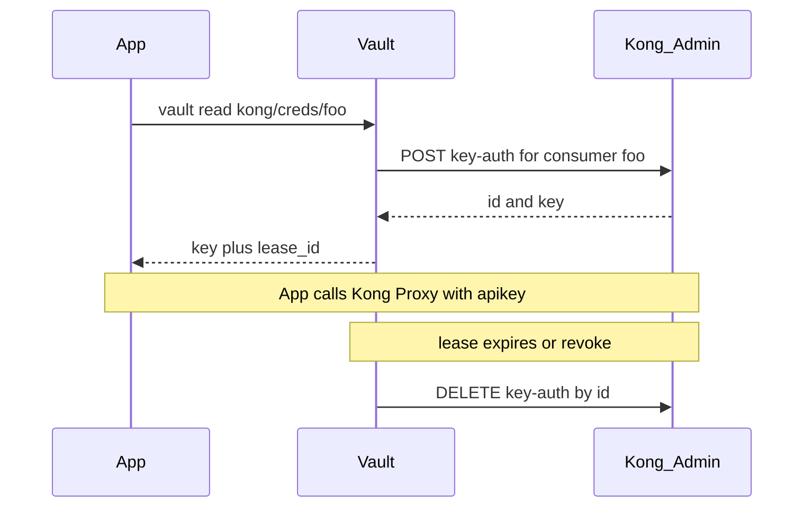

# Kong key-auth

Kong [Key Authentication](https://developer.konghq.com/plugins/key-auth/)은 Consumer마다 API 키를 두고 Gateway가 요청을 식별합니다. 키 발급은 Kong Audit, Log로 확인 가능하지만, 키를 앱 설정 파일이나 위키에 두면 회수가 어렵고, 이후 둘 간에 맵핑이 어려워지고, 추적이 어렵습니다.

[vault-kong-secrets](https://github.com/Kong/vault-kong-secrets)는 HashiCorp Vault(또는 [OpenBao](https://openbao.org/)) **secrets engine**입니다. Vault가 Kong Admin API로 key-auth 키를 만들고 호출자에게만 돌려줍니다. (키는 Vault 안에 저장하지 않습니다.) 리스가 끝나면 Kong에서 해당 자격 증명을 삭제합니다.

::: tip 소스 코드

- **공식 저장소:** [Kong/vault-kong-secrets](https://github.com/Kong/vault-kong-secrets)
- **Kong key-auth:** [developer.konghq.com/plugins/key-auth](https://developer.konghq.com/plugins/key-auth/)

:::

## Vault secrets engine 형식으로 고려한 이유

정적 키를 Kong Manager에서 한 번 만들고 나눠 주는 방식과 역할이 다릅니다.

- 발급은 Vault 정책·AppRole 등 **인가 경로**를 따릅니다
- TTL은 Vault **리스**로 관리한다. Kong key-auth 자체에는 TTL 필드가 없다
- 시크릿은 Kong에만 존재하고, Vault는 발급·회수 오케스트레이션만 한다

Consumer는 **Kong에 이미 있어야** 합니다. 플러그인은 Consumer를 만들지 않고, 그 Consumer의 key-auth credential만 발급합니다. Route에는 기존처럼 `key-auth` 플러그인을 붙입니다.



## 테스트 환경

| 구분 | 버전 |
|------|------|
| Kong Gateway OSS | 3.9 |
| Kong Gateway Enterprise | 3.15 |
| HashiCorp Vault | 1.19 / 1.20 / 1.21 / 2.0 |
| OpenBao | 2.4 / 2.5 / 2.6 |

플러그인 `RunningVersion`은 `v0.2.0`입니다. 기본 빌드는 Vault, `go build -tags openbao`는 OpenBao입니다.

## 플러그인 설치

Vault(또는 OpenBao)가 기동·unseal되어 있고, 플러그인을 등록할 권한이 있어야 합니다. Go 1.25.7+로 빌드하거나 [GitHub Releases](https://github.com/Kong/vault-kong-secrets/releases) 바이너리를 씁니다.

```bash
git clone https://github.com/Kong/vault-kong-secrets.git
cd vault-kong-secrets
go build -o vault-kong-secrets .
# OpenBao: go build -tags openbao -o openbao-kong-secrets .
```

바이너리를 호스트 `plugin_directory`로 옮긴 뒤 SHA256으로 카탈로그에 등록합니다. `-command`는 파일 이름과 같게 둡니다.

```bash
export SHA256=$(shasum -a 256 "/etc/vault/plugins/vault-kong-secrets" | cut -d' ' -f1)

vault plugin register \
  -sha256="${SHA256}" \
  -command="vault-kong-secrets" \
  -version=v0.2.0 \
  secret kong-secrets

vault secrets enable -path="kong" kong-secrets
```

## Kong 접속 설정

Admin API 주소를 플러그인에 알려 줍니다.

| 필드 | 설명 |
|------|------|
| `baseurl` | Kong Admin API URL |
| `admin_token` | Enterprise RBAC `Kong-Admin-Token`. RBAC가 꺼져 있으면 생략 |
| `workspace` | Enterprise workspace 이름. OSS는 workspace가 없으므로 생략. Enterprise에서 생략하면 default |

OSS:

```bash
vault write kong/config/access baseurl=http://127.0.0.1:8001
```

Enterprise:

```bash
vault write kong/config/access \
  baseurl=http://127.0.0.1:8001 \
  admin_token=<kong-admin-token> \
  workspace=<workspace>
```

## Consumer와 리스 TTL

발급 대상 Consumer와 리스 수명을 등록합니다. `ttl` / `max_ttl`은 Vault 리스입니다. 리스가 끝나면 플러그인이 Kong key-auth를 삭제합니다.

```bash
# Kong에 Consumer foo 가 있어야 한다
vault write kong/consumers/foo ttl=5m max_ttl=10m
```

## 키 발급

```bash
vault read kong/creds/foo
```

```
Result:

Key                Value
---                -----
lease_id           kong/creds/foo/<lease-id>
lease_duration     5m
lease_renewable    false
id                 <credential-id>
key                <key>
```

| 필드 | 의미 |
|------|------|
| `key` | Kong key-auth 키. Proxy 요청에 사용 |
| `id` | Kong credential id. 회수 시 삭제 대상 |
| `lease_id` | Vault 리스. 만료·revoke 시 Kong에서 키 삭제 |
| `lease_renewable` | `false` |

호출 예 (`$PROXY`는 Kong Proxy, 예: `http://127.0.0.1:8000`):

```bash
curl -H "apikey: $KEY" "$PROXY/my-route"
```

리스를 수동으로 끊을 때:

```bash
vault lease revoke "$LEASE_ID"
```

## 정리

Kong key-auth 키를 사람이 나눠 주지 않고, Vault 인가와 리스로 발급·회수할 수 있습니다. `vault-kong-secrets`는 키를 Vault에 넣지 않고 Kong Admin으로 만들고, 리스가 끝나면 Kong에서 지웁니다. Consumer와 `key-auth` 플러그인은 기존 Kong 구성 그대로 두고, 자격 증명 생명주기만 Vault에 맡기는 패턴입니다.
