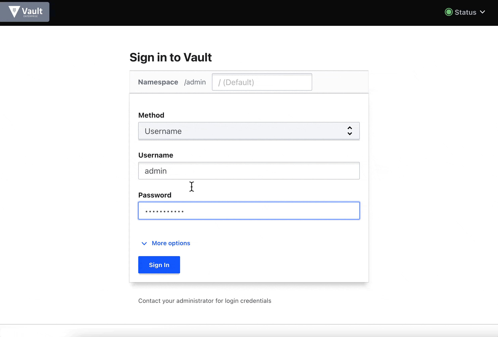

---
meta:
  - name: description
    content: Vault Login에 Vault TOTP 기반 MFA 추가
tags: ["vault auth", "MFA"]
---

# MFA Login with Vault TOTP

> HashiCorp Learn - Login MFA : <https://learn.hashicorp.com/tutorials/vault/multi-factor-authentication>  
> Configure TOTP MFA Method : <https://www.vaultproject.io/api-docs/secret/identity/mfa/totp>
> Vault Login MFA Overview : <https://www.vaultproject.io/docs/auth/login-mfa>  
> 1.10.3+ recommend : <https://discuss.hashicorp.com/t/vault-1-10-3-released/39394>

## ENV Setup

```bash
$ ROOT_TOKEN=hvs...
$ VAULT_ADDR=https://<your-vault-addr>:8200
$ MY_PASSWORD=password

# If you have NAMESPACE with Enterprise
$ export VAULT_NAMESPACE=admin
```

## Enable username and password auth method

```bash
$ VAULT_TOKEN=$ROOT_TOKEN vault auth enable userpass

$ USERPASS_ACCESSOR=$(VAULT_TOKEN=$ROOT_TOKEN vault auth list | grep userpass | awk '{print $3}')

$ VAULT_TOKEN=$ROOT_TOKEN vault write auth/userpass/users/admin password=$MY_PASSWORD
```

## Create an entity and alias

```bash
$ ENTITY_ID=$(VAULT_TOKEN=$ROOT_TOKEN vault write -field=id identity/entity name="admin")

echo $ENTITY_ID

$ VAULT_TOKEN=$ROOT_TOKEN vault write identity/entity-alias \
    name="admin" \
    canonical_id="$ENTITY_ID" \
    mount_accessor="$USERPASS_ACCESSOR"
```

## Enable MFA method (TOTP)

> https://www.vaultproject.io/api-docs/secret/identity/mfa/totp#parameters

- identity/mfa/method/totp/generate : for current entity
- identity/mfa/method/totp/admin-generate : manage to other entity

``` bash
$ METHOD_ID=$(vault write -field=method_id identity/mfa/method/totp issuer=HCP-Vault period=30 key_size=30 qr_size=200 algorithm=SHA256 digits=6 name=admin)

$ echo $METHOD_ID

$ vault read identity/mfa/method/totp/$METHOD_ID

# vault write identity/mfa/method/totp/generate method_id=$METHOD_ID
$ vault write identity/mfa/method/totp/admin-generate method_id=$METHOD_ID entity_id=$ENTITY_ID

Key        Value
---        -----
barcode    iVBORw0KGgoAAAANSUhEUgAAAM...
url        otpauth://totp/Vault:307d6c16-6f5c...
```

## Create login enforcement

```bash
$ VAULT_TOKEN=$ROOT_TOKEN vault write identity/mfa/login-enforcement/mylogin \
   mfa_method_ids="$METHOD_ID" \
   auth_method_accessors="$USERPASS_ACCESSOR"
```

## Vault OTP Test (Option)

> That's able to use online QR generator

```bash
$ vault secrets enable totp

$ vault write totp/keys/hcp-vault url="otpauth://totp/HCP-Vault:0d0cf6f5-62e6-6914-5070-47e997e2aa..."

$ vault read totp/code/hcp-vault
Key     Value
---     -----
code    714908
```

## Vault Login Userpass + totp

### CLI

```bash
$ vault login -method userpass username=admin password=$MY_PASSWORD

Enter the passphrase for methodID "0b9d2229-5d64-dc5d-87cc-0fd22775b918" of
type "totp": <enter_totp>
```

### UI




