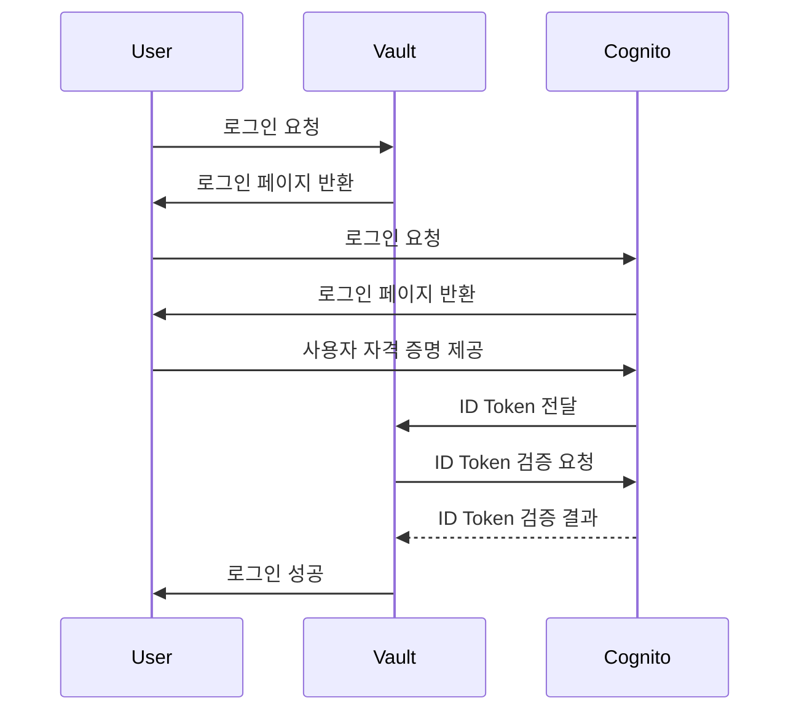
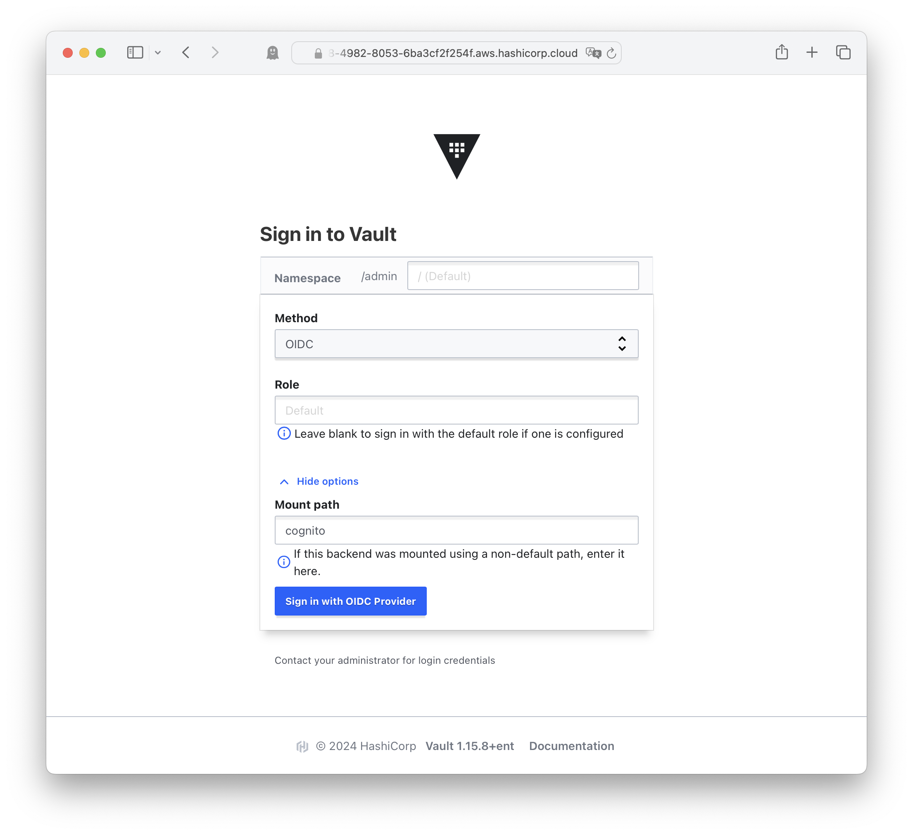
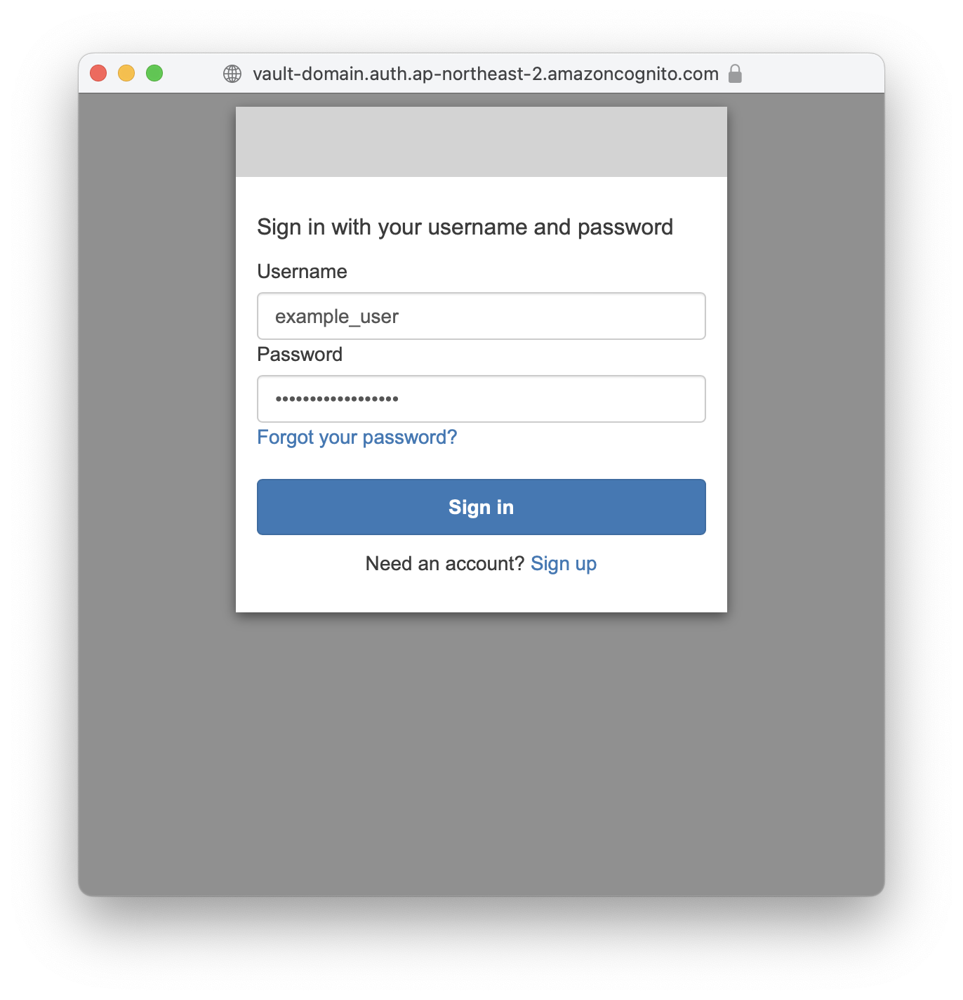
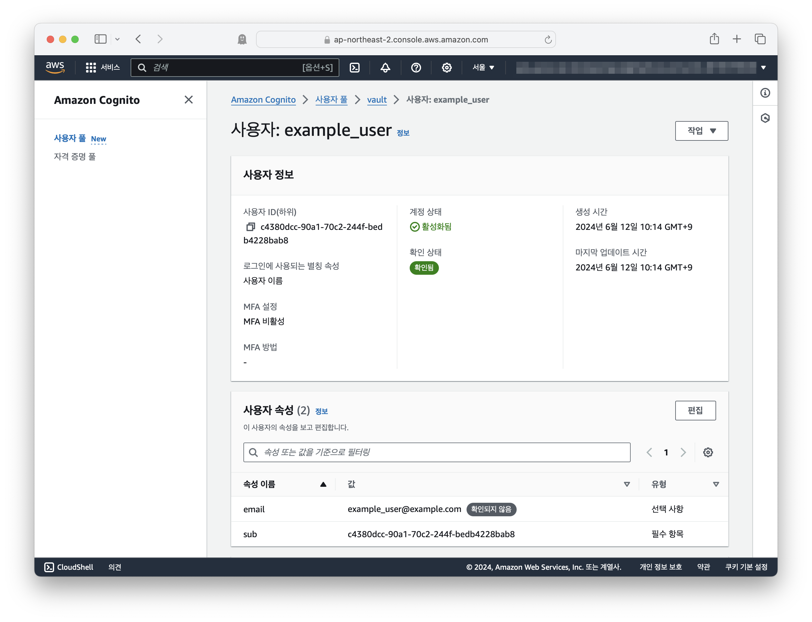
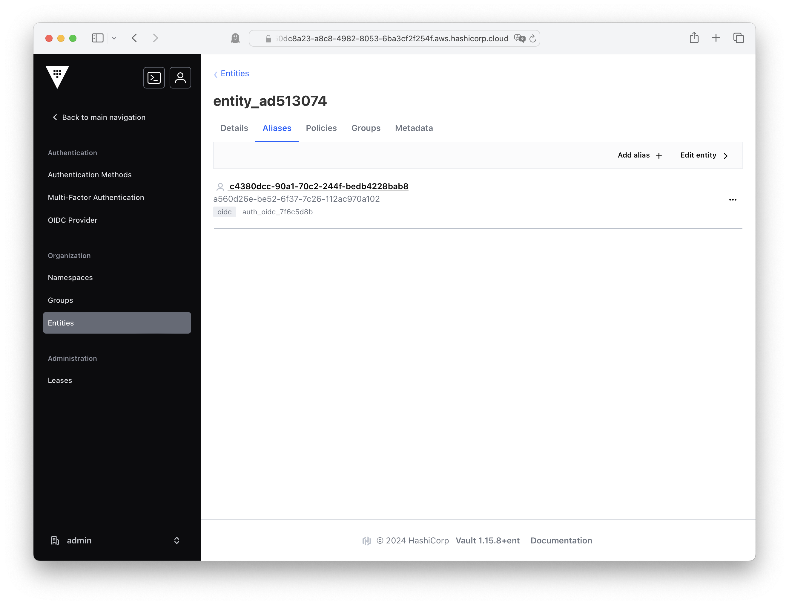

# AWS Cognito를 사용하여 Vault의 OIDC 인증 설정하기

## 소개

이 Terraform 코드는 AWS Cognito를 사용하여 Vault의 OIDC(Authentication Method)를 설정하는 방법을 안내합니다. AWS의 인프라 및 보안 서비스와 함께 사용하는 사람들을 위해 만들어졌으며, AWS Cognito를 Identity Provider(IDP)로 사용하여 Vault에 대한 강력한 인증을 설정하는 것을 목표로 합니다.

## AWS Cognito 및 Vault 설정

아래의 Terraform 코드는 AWS Cognito 및 Vault에서 필요한 설정을 포함하고 있습니다. 코드를 사용하기 전에 아래의 요구사항을 충족해야 합니다.

### 요구사항

- AWS 계정 및 액세스 권한
- AWS CLI 및 Terraform 설치
- Vault 서버 액세스 및 관리 권한

### 설정 방법

1. `env.sh` 파일을 생성하여 Vault 서버의 주소, 네임스페이스 및 토큰을 설정합니다.
  - VAULT_ADDR
  - VAULT_NAMESPACE (엔터프라이즈/HCP 인 경우)
  - VAULT_TOKEN
2. 아래의 Terraform 코드를 사용하여 AWS Cognito 및 Vault를 설정합니다.
3. Terraform을 사용하여 코드를 적용하여 설정을 배포합니다.

### Terraform 코드

<https://github.com/Great-Stone/terraform-vault-oidc-aws-cognito>

### 코드 설명

- `aws_cognito_user_pool`: Vault 인증에 사용될 AWS Cognito 사용자 풀을 생성합니다.
- `aws_cognito_user_pool_client`: Vault에 대한 클라이언트를 생성하고 필요한 OAuth 플로우, 스코프 및 콜백 URL을 설정합니다.
- `aws_cognito_user_pool_domain`: 사용자 풀에 대한 도메인을 생성합니다.
- `aws_cognito_user`: AWS Cognito에 사용자를 추가합니다.
- `vault_jwt_auth_backend`: Vault에서 OIDC(Authentication Method) 백엔드를 설정하여 AWS Cognito를 IDP로 사용합니다.
- `vault_policy`: Vault에서 사용될 정책을 설정합니다.
- `vault_jwt_auth_backend_role`: Vault에서 OIDC(Authentication Method) 역할을 설정하여 AWS Cognito를 사용하여 인증을 관리합니다.

### 참고사항

- 코드를 적용하기 전에 Terraform 초기화 및 계획 단계를 수행합니다.
- 코드를 적용하기 전에 `env.sh` 파일을 수정하여 Vault 서버의 주소, 네임스페이스 및 토큰을 설정합니다.
- 코드를 적용하기 전에 AWS Cognito 사용자 풀 및 클라이언트 설정을 확인합니다.
- 코드를 적용한 후에는 Vault 및 AWS Cognito에서 설정을 확인하고 테스트합니다.

## AWS Cognito를 사용하는 경우의 장점

- **통합된 보안**: AWS Cognito를 사용하여 Vault에 대한 강력한 인증을 설정하면 AWS 계정의 사용자 및 그룹 관리 시스템과 연동되므로 보안을 강화할 수 있습니다.
- **사용자 관리 간소화**: AWS Cognito의 사용자 관리 및 인증 시스템을 통해 사용자 관리를 간소화하고 사용자 경험을 향상시킬 수 있습니다.
- **관리 용이성**: AWS에서 호스팅되는 Cognito 서비스를 사용하여 관리 및 운영을 간소화하고 AWS의 다양한 보안 기능을 활용할 수 있습니다.

## Vault 인증 스크린샷

- Type: OIDC
- Path: cognito

- Check the `sub` ID

- Vault entity alias ID mapped to OIDC sub ID