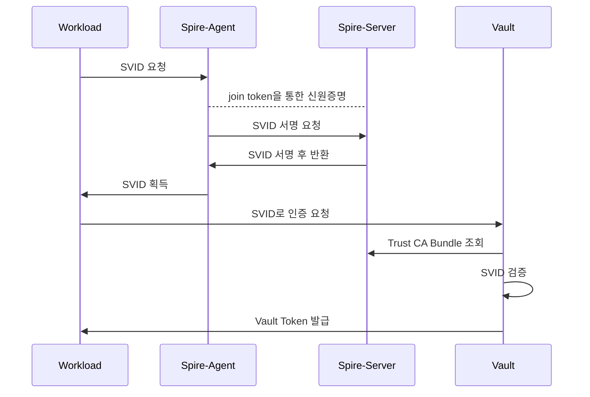

# SPIFFE - Vault auth example

## 1. 개요

Spiffe는 워크로드(서비스)간 신뢰 기반 인증을 표준화하는 오픈소스로 Spire는 Spiffe의 표준을 구현한 시스템입니다.

Spiffe는 SVID 기반으로 신원을 인증합니다. SVID에는 각 서비스의 고유 ID인 Spiffe ID가 포함됩니다.

* SVID(Spiffee Verfiable Identity Document) : Spiffe ID가 포함된 Spiffe 인증정보 


워크로드의 신원을 만드는 주체는 Vault가 아니라 Spire로, Vault Enterprise에서는 Spire가 발급한 SVID를 통해 Vault에 인증할 수 있습니다.


##### 기존방식 - Spiffe 비교

| 기존                                     | Spiffe                                 |
| ---------------------------------------- | -------------------------------------- |
| IP 기반 인증 서비스                      | 워크로드(서비스)간 고유 Spiffe ID 부여 |
| 수동 인증서 관리 필요                    | Spire Agent로 인증서 자동 갱신         |
| 워크로드(서비스)간 신뢰 관계 관리 어려움 | 워크로드(서비스)간 mTLS 기반 신뢰 통신 |


##### SVID 종류

* X.509 인증서
* JWT 토큰

##### SVID 종류별 구조

* X.509 인증서

  * SAN에 Spiffe ID 존재

  ```
  spiffe://trust-domain/service-a
  ```

* JWT 토큰 

  * sub에 Spiffe ID 존재
  * audience


## 2. Spiffe Auth Method 

> https://developer.hashicorp.com/vault/api-docs/auth/spiffe#spiffe-auth-method-api

Vault Spiffe Auth method에서 지원하는 Spiffe Profile 종류는 4가지를 지원합니다.

> Profile 이란? Spire Server의 CA Trust Bundle 인증서를 가져올 때의 인증서 유형과 메커니즘 설정 


* https_spiffe_bundle 

  * spiffe 엔드포인트 `spiffe://`
  * JWKS 포맷 인증서
  * Vault는 Spire Server Federation API로 접근하여 Spire Server CA Bundle을 갱신함
  * Vault는 갱신되는 CA Bundle을 갖고 SVID 검증  

* static

  * Vault Spiffe Auth Method Config에 저장된 고정된 Bundle 인증서로 검증 (CA만료시 수동 업데이트 필요)

* https_web_bundle

  * HTTPS 엔드포인트 `https://`
  * JWKS 포맷 인증서

* https_web_pem

  * HTTPS 엔드포인트 `https://`

  * X.509 인증서

    

#### https_spiffe_bundle 구성 및 인증 흐름 

* 구성

```
#Spire Server 
Federation API 서버 설정 
Spire Agent 용 Join Token 생성 
Worload Entry 등록 

#Spire Agent 
Join Token을 사용해 Agent 실행 

#Vault 
Spire Server CA Bundle + Spire Server Federation API 주소 등록
```

* 인증

```
인증 흐름
워크로드측 SVID 발급 -> X.509 / JWT Vault에 제시 -> Vault 가 항상 최신 Spire CA Bundle로 검증
```





## 0. Spire 서버 설치

* https://spiffe.io/docs/latest/deploying/install-server/

```
curl -O https://github.com/spiffe/spire/releases/download/v1.14.4/spire-1.14.4-linux-amd64-musl.tar.gz
tar zvxf spire-1.14.4-linux-amd64-musl.tar.gz
sudo cp -r spire-1.14.4/. /opt/spire/
sudo ln -s /opt/spire/bin/spire-server /usr/bin/spire-server
sudo ln -s /opt/spire/bin/spire-agent /usr/bin/spire-agent
```


## 1-1. SPIRE Server 실행

##### /opt/spire/conf/server/server.conf

Profile: https_spiffe_bundle

```
server {
    bind_address = "0.0.0.0"      # Spire Server API Address
    bind_port = "8081"              # Spire Server API 포트 
    trust_domain = "example.org"    # Trust Domain (Spiffe ID의 기반)
    data_dir = "./data/server"      # DB, 키 저장경로 
    log_level = "DEBUG"
    ca_ttl = "168h"                 # CA 유효기간 
    default_x509_svid_ttl = "24h"   # SVID X.509 인증서 유효기간 
    socket_path = "/tmp/spire-server/private/api.sock" # Socket Path

    federation {                    # vault config profile:https_spiffe_bundle  
        bundle_endpoint {           
            address = "0.0.0.0"     
            port = 8443               # Vault가 CA Bundle Fetch 하는 포트 
            refresh_hint = "5m"       # Vault가 CA Bundle을 갱신하는 주기 
            profile "https_spiffe" {} # https_spiffe profile
        }
    }
}

plugins {
    DataStore "sql" {
        plugin_data {
            database_type = "sqlite3"
            connection_string = "./data/server/datastore.sqlite3"
        }
    }
    KeyManager "disk" {
        plugin_data {
            keys_path = "./data/server/keys.json"
        }
    }
    NodeAttestor "join_token" {
        plugin_data {}
    }
}
```


> Profile : static 
>
> * Static 방식은 CA bundle을 수동으로 Vault Spiffe Auth method Config에 업데이트 해야함 
>
> ```
> #/opt/spire/conf/server/server.conf
> server {
>     bind_address = "127.0.0.1"
>     bind_port = "8081"
>     trust_domain = "example.org"
>     data_dir = "./data/server"
>     log_level = "DEBUG"
>     ca_ttl = "168h"
>     default_x509_svid_ttl = "48h"
> }
> 
> plugins {
>     DataStore "sql" {
>         plugin_data {
>             database_type = "sqlite3"
>             connection_string = "./data/server/datastore.sqlite3"
>         }
>     }
> 
>     KeyManager "disk" {
>         plugin_data {
>             keys_path = "./data/server/keys.json"
>         }
>     }
> 
>     NodeAttestor "join_token" {
>         plugin_data {}
>     }
> }
> ```
>
> 


```bash
cd /opt/spire
sudo spire-server run -config /opt/spire/conf/server/server.conf &
```

 **→ Spire Server  실행**

- 워크로드들에게 SVID(신분증)를 발급해주는 중앙 서버
- trust_domain `example.org` 기준으로 모든 신원 관리


> 서버 헬스체크 
>
> ```
> sudo spire-server healthcheck -socketPath /tmp/spire-server/private/api.sock
> 
> Server is healthy.
> ```


## 1-2. Spire Agent의 신원 인증을 위한 Join Token 발급

```bash
sudo spire-server token generate \
  -spiffeID spiffe://example.org/myagent \
  -socketPath /tmp/spire-server/private/api.sock

Token: 2c6f9672-6e1d-4f73-9fc2-6dccb8241b14
```

**→ Join token: Spire Agent가 Server에 처음 등록할 때 쓰는 일회용 비밀번호**


> entry 등록확인
>
> ```
> sudo spire-server entry show \
>   -socketPath /tmp/spire-server/private/api.sock
>   
> Found 1 entry
> Entry ID         : ef251ced-3651-409b-8d58-9ea00918d974
> SPIFFE ID        : spiffe://example.org/myagent
> Parent ID        : spiffe://example.org/spire/agent/join_token/2c6f9672-6e1d-4f73-9fc2-6dccb8241b14
> Revision         : 0
> X509-SVID TTL    : default
> JWT-SVID TTL     : default
> Selector         : spiffe_id:spiffe://example.org/spire/agent/join_token/2c6f9672-6e1d-4f73-9fc2-6dccb8241b14
> ```


## 1-3. 워크로드 Entry 등록

```bash
sudo spire-server entry create \
  -spiffeID spiffe://example.org/workload/x509 \
  -parentID spiffe://example.org/spire/agent/join_token/<join token> \
  -selector unix:uid:1000 \
  -socketPath /tmp/spire-server/private/api.sock
    
Entry ID         : a6337d22-5ac7-44a5-83e9-d4ba635712e2
SPIFFE ID        : spiffe://example.org/workload/x509
Parent ID        : spiffe://example.org/spire/agent/join_token/2c6f9672-6e1d-4f73-9fc2-6dccb8241b14
Revision         : 0
X509-SVID TTL    : default
JWT-SVID TTL     : default
Selector         : unix:uid:1000
```

**→ uid:1000인 프로세스는 `workload/x509` SVID를 받을 자격이 있다" 고 등록**

**→ 해당 Spire Agent 통해서는 `uid:1000` 사용자만  `spiffe://example.org/workload/x509` 의 Spiffe ID를 가진 SVID만 발급 가능**

| 옵션                      | 의미                                                |
| ------------------------- | --------------------------------------------------- |
| `-spiffeID`               | 이 워크로드에게 발급할 신분증 ID -> Vault Role 매핑 |
| `-parentID`               | 어느 Agent를 통해서만 발급 가능한지                 |
| `-selector unix:uid:1000` | uid가 1000인 프로세스만 해당 SVID 요청 발급 가능    |


## 2-1. SPIRE Agent 실행

**/opt/spire/conf/agent/agent.conf**

```
agent {
    data_dir = "/opt/spire/data/agent"
    log_level = "DEBUG"
    trust_domain = "example.org"                  # Trust Domain 
    server_address = "77.88.130.1"                # Spire Server 주소 
    server_port = 8081                            # Spire Server Port
    insecure_bootstrap = true
    socket_path = "/tmp/spire-agent/public/api.sock"
}

plugins {
    KeyManager "disk" {
        plugin_data {
            directory = "/opt/spire/data/agent"
        }
    }
    NodeAttestor "join_token" {
        plugin_data {}
    }
    WorkloadAttestor "unix" {
        plugin_data {}
    }
}
```


```bash
sudo spire-agent run -config /opt/spire/conf/agent/agent.conf -joinToken <token> &
```

- Spire Agent가 중간에서 SVID를 워크로드(서비스) 전달

  

> Spire Server에서 agent list 확인
>
> ```
> sudo spire-server agent list 
> 
>   
> SPIFFE ID         : spiffe://example.org/spire/agent/join_token/2c6f9672-6e1d-4f73-9fc2-6dccb8241b14
> Attestation type  : join_token
> Expiration time   : 2026-04-14 05:10:15 +0000 UTC
> Serial number     : 319807142421144943662157130721222690678
> Can re-attest     : false
> Agent version     : 1.14.4
> ```


## 2-2.  SVID 발급

* uid: 1000 사용자로 실행

```bash
spire-agent api fetch x509 \
  -socketPath /tmp/spire-agent/public/api.sock \
  -write /opt/spiffe-certs/
  
...
SPIFFE ID:		spiffe://example.org/workload/x509
SVID Valid After:	2026-04-07 05:25:56 +0000 UTC
SVID Valid Until:	2026-04-08 05:26:06 +0000 UTC
CA #1 Valid After:	2026-04-07 02:13:09 +0000 UTC
CA #1 Valid Until:	2026-04-14 02:13:19 +0000 UTC

Writing SVID #0 to file /opt/spiffe-certs/svid.0.pem.
Writing key #0 to file /opt/spiffe-certs/svid.0.key.
Writing bundle #0 to file /opt/spiffe-certs/bundle.0.pem.
```

* workload id 확인 

```
openssl x509 -text -in /opt/spiffe-certs/svid.0.pem  | grep -A 2 "Subject Alternative"

            X509v3 Subject Alternative Name:
                URI:spiffe://example.org/workload/x509
```

* Expiration 확인

```
openssl x509 -text -in /opt/spiffe-certs/svid.0.pem | grep -A 2 "Validity"
        Validity
            Not Before: Apr 13 05:10:13 2026 GMT
            Not After : Apr 14 05:10:23 2026 GMT
```


> ```
> # 다른 UID의 사용자가 요청하면 실패
> sudo -u test-user spire-agent api fetch x509 \
>   -socketPath /tmp/spire-agent/public/api.sock
> 
> DEBU[0118] PID attested to have selectors                pid=2234578 selectors="[type:\"unix\" value:\"uid:1001\" type:\"unix\" value:\"user:test-user\" type:\"unix\" value:\"gid:1001\" type:\"unix\" value:\"group:test-user\" type:\"unix\" value:\"supplementary_gid:27\" type:\"unix\" value:\"supplementary_group:sudo\" type:\"unix\" value:\"supplementary_gid:1001\" type:\"unix\" value:\"supplementary_group:test-user\"]" subsystem_name=workload_attestor
> 
> ERRO[0118] No identity issued                            method=FetchX509SVID pid=2234578 registered=false service=WorkloadAPI subsystem_name=endpoints
> rpc error: code = PermissionDenied desc = no identity issued
> ```


## 3-1.Spiffe Auth method 활성화


```
export VAULT_NAMESPACE=dev-1
vault auth enable -passthrough-request-headers="Authorization" spiffe
```


### 3-2.  Config 작성 

```
# Spire Server Federation Bundle Endpoint 주소로 Bundle 조회
# Spire Federation API가 mTLS로 되어있어서 인증서 제출 필요 
BUNDLE=$(sudo spire-server bundle show -format spiffe)
```

```
echo $BUNDLE
{ "keys": [ { "use": "x509-svid", "kty": "EC", "crv": "P-256", "x": "18fJ6zCmp5YMtgXHAsF-_7dZ8757vZoI9EwzZ90-fUk", "y": "zqO3rPmUJ3r8b9NJZ1-4lcGskCbp0EaM5MCUev3jkSM", "x5c": [ ....
```

```
# Endpoint_URL : Spire 서버 Federation 엔드포인트 
vault write auth/spiffe/config \
  trust_domain="example.org" \
  profile="https_spiffe_bundle" \
  audience="vault" \
  endpoint_url="https://77.88.130.1:8443" \
  endpoint_spiffe_id="spiffe://example.org/spire/server" \
  bundle="$BUNDLE"

Key                              Value
---                              -----
audience                         [vault]
bundle                           {
    "keys": [
        {
            "use": "x509-svid",
            "kty": "EC",
            "crv": "P-256",
            "x": "6601LWdzz-zq-3hq5GmtqsOZNbQc6BBGaTGu29gOZXA",
            "y": "s6s3WCE_7Y6eSn1Iq3z5JrfKDK_3T8mFAjDghauPPyE",
            "x5c": [
                "MIICAjCCAaegAwIBAgIQZX+DMDisLeBW49dmZ5RRTzAKBggqhkjOPQQDAjBQMQswCQYDVQQGEwJVUzEPMA0GA1UEChMGU1BJRkZFMTAwLgYDVQQFEycxMzQ5MTQxMTAwOTE0NTk2MTc3NjE0MTQxNTQxNTU1NjQ3NDkxMzUwHhcNMjYwNDA3MDY1NjEzWhcNMjYwNDE0MDY1NjIzWjBQMQswCQYDVQQGEwJVUzEPMA0GA1UEChMGU1BJRkZFMTAwLgYDVQQFEycxMzQ5MTQxMTAwOTE0NTk2MTc3NjE0MTQxNTQxNTU1NjQ3NDkxMzUwWTATBgcqhkjOPQIBBggqhkjOPQMBBwNCAATrrTUtZ3PP7Or7eGrkaa2qw5k1tBzoEEZpMa7b2A5lcLOrN1ghP+2Onkp9SKt8+Sa3ygyv90/JhQIw4IWrjz8ho2MwYTAOBgNVHQ8BAf8EBAMCAQYwDwYDVR0TAQH/BAUwAwEB/zAdBgNVHQ4EFgQUc/ihqV0iAGZbwgPOYZY9nstlbYIwHwYDVR0RBBgwFoYUc3BpZmZlOi8vZXhhbXBsZS5vcmcwCgYIKoZIzj0EAwIDSQAwRgIhAMLePMGHLP86/m28HX7Fwt1a6qBAVM0wBntIXH/TNrjwAiEAxrkMQ8s+ZoHAEA6KwZ8Cv6jh2Q4ugR1qtcMAClmVaNM="
            ]
        },
        {
            "use": "jwt-svid",
            "kty": "EC",
            "kid": "vMIoVrly12WdPdV5YUwLad3TNDXhbckb",
            "crv": "P-256",
            "x": "nuAuoC7Sm_NodYBuxDcZhKa1nYYcPC7qLvSf3uFamKg",
            "y": "vP3meBfN973whG_dII0vKRz2-F3IRh_aAiLYvUMqJGI"
        }
    ],
    "spiffe_sequence": 1,
    "spiffe_refresh_hint": 300
}
cached_bundle_config_version     1
cached_bundle_fetched_at         2026-04-09T05:34:10.872649738Z
cached_bundle_refresh_hint       5m0s                        # 5분마다 Spire CA Bundle Refresh
cached_bundle_sequence_number    1
endpoint_spiffe_id               spiffe://example.org/spire/server
endpoint_url                     https://77.88.130.1:8443
profile                          https_spiffe_bundle
trust_domain                     example.org
version                          1
```

* trust_domain : Vault가 신뢰할 Spiffe Trust Domian. 해당 도메인에서 발급된 SVID만 인증허용 (spiffe://example.org/...)
* profile: Vault가 spire trust bundled을 어떻게 가져올지 설정.  Spife Federation API에서 Spifee mTLS를 자동으로 Fetch 
* audience : JWT SVID 방식에서 검증 
* endpoint_url: Spire Federation API Endpoint
* endpoint_spiffe_id: Spire Federation API 서버의 Spiffe ID. SPIRE Server는`spiffe://<trust_domain>/spire/server` 형태가 기본 값 
* bundle: Vault가 처음 Spire Federation API에 접속할떄 서버 인증서 검증용. 이후는 자동 교체 

* cached_bundle_refresh_hint: CA Bundle Refresh 주기 


### 3-3. Role 생성

```
vault write auth/spiffe/role/x509-role \
  workload_id_patterns="workload/x509" \
  token_policies="test"
  
Key                        Value
---                        -----
alias_metadata             map[]
display_name               x509-role
name                       x509-role
token_bound_cidrs          []
token_explicit_max_ttl     0s
token_max_ttl              0s
token_no_default_policy    false
token_num_uses             0
token_period               0s
token_policies             [test]
token_ttl                  0s
token_type                 default
workload_id_patterns       [workload/x509]
```


---

### X.509 방식

#### 로그인

* CLI

```
export VAULT_CLIENT_CERT=/opt/spiffe-certs/svid.0.pem
export VAULT_CLIENT_KEY=/opt/spiffe-certs/svid.0.key

vault write \
  auth/spiffe/login \
  role=x509-role \
  type=cert
```

* API

```
 curl   --cert /opt/spiffe-certs/svid.0.pem  --key /opt/spiffe-certs/svid.0.key   --request POST  --header "X-Vault-Namespace: dev-1"   --header "Content-Type: application/json"   --data '{"role": "x509-role", "type": "cert"}'   https://vault.gweowe.com:8200/v1/auth/spiffe/login
```


---

### JWT 방식

#### JWT SVID 발급

```
spire-agent api fetch jwt -audience vault 

...

	eyJhbGciOiJFUzI1NiIsImtpZCI6Ik94ckVZdDIyclFxU0tNdDIwMEZjNGloS2I3VHlPdUdXIiwidHlwI.....
bundle(spiffe://example.org):
	{
    "keys": [
        {
            "kty": "EC",
            "kid": "OxrEYt22rQqSKMt200Fc4ihKb7TyOuGW",
            "crv": "P-256",
            "x": "lWLTzQyXAB9Y5AM0ECmUD8OxbxB6VsqUo79I048M42k",
            "y": "ckGmHoR4rlU8_sbFfdQ9CAEVfKq9SVxc-N7koAUFAIE"
        }
    ]
}
```

```
JWT=eyJhbGciOiJFUzI1NiIsImtpZCI6InZNSW9Wcmx5MTJXZFBkVjVZVXdMYWQzVE5EWGhiY2tiIiwidHl....
```


#### 로그인 

* CLI

```
vault write -header="Authorization=Bearer $JWT" auth/spiffe/login role=x509-role type=jwt

```

* API 

```
curl -k \
  --request POST \
  --header "Content-Type: application/json" \
  --header "X-Vault-Namespace: dev-1" \
  --header "Authorization: Bearer $JWT" \
  --data '{"role": "x509-role", "type": "jwt"}' \
  https://vault.gweowe.com:8200/v1/auth/spiffe/login
```

