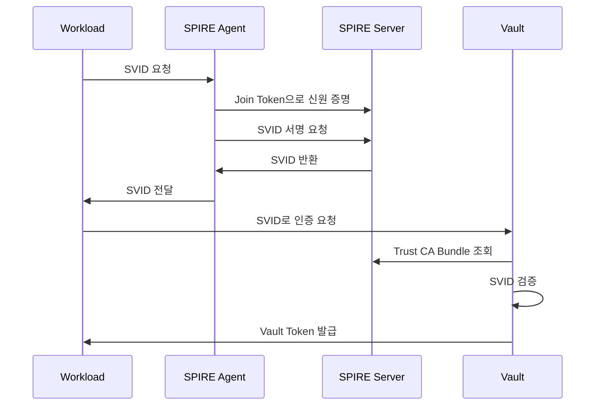

# SPIFFE — Vault auth 구성 예시

개념·API 요약은 [SPIFFE 인증 방법 (Enterprise)](spiffe-auth.md)을 참고하세요. 이 글은 **SPIRE + Vault Enterprise**로 `https_spiffe_bundle` 프로필을 구성하는 실습 예시입니다.

## 1. 개요

**SPIFFE**는 워크로드 신원(identity)을 표준화하는 스펙이고, **SPIRE**는 그 스펙을 구현한 시스템입니다.

SPIFFE는 **SVID**(SPIFFE Verifiable Identity Document)로 신원을 증명합니다. SVID에는 워크로드 고유 ID인 SPIFFE ID가 들어 있습니다.

워크로드 신원을 **발급**하는 주체는 Vault가 아니라 SPIRE입니다. Vault Enterprise의 `spiffe` auth method는 SPIRE가 발급한 SVID를 **검증**한 뒤 Vault 토큰을 발급합니다.

### 기존 방식과 SPIFFE 비교

| 기존 | SPIFFE |
|------|--------|
| IP 기반 인증 | 워크로드마다 고유 SPIFFE ID |
| 수동 인증서 관리 | SPIRE Agent로 인증서 자동 갱신 |
| 워크로드 간 신뢰 관계 관리가 어려움 | mTLS 기반 신뢰 통신 |

### SVID 종류

| 종류 | SPIFFE ID 위치 |
|------|----------------|
| X.509 인증서 | SAN (예: `spiffe://trust-domain/service-a`) |
| JWT 토큰 | `sub` (및 `audience`) |

## 2. SPIFFE auth method 프로필

공식 API: [SPIFFE auth method API](https://developer.hashicorp.com/vault/api-docs/auth/spiffe#spiffe-auth-method-api)

Vault가 SPIRE trust bundle을 가져오는 **profile**은 다음 네 가지입니다.

| profile | 설명 |
|---------|------|
| `https_spiffe_bundle` | `spiffe://` 엔드포인트, JWKS. Federation API로 CA bundle을 주기적으로 갱신 |
| `static` | config에 고정 bundle 저장 (CA 만료 시 수동 갱신) |
| `https_web_bundle` | `https://` 엔드포인트, JWKS |
| `https_web_pem` | `https://` 엔드포인트, X.509 PEM |

### `https_spiffe_bundle` 구성·인증 흐름

**구성**

1. SPIRE Server: Federation API, Agent용 Join Token, Workload Entry
2. SPIRE Agent: Join Token으로 Agent 실행
3. Vault: 초기 CA bundle + Federation API 주소 등록

**인증**

워크로드가 SVID를 받아 Vault에 제시하면, Vault는 최신 SPIRE CA bundle로 검증합니다.


```mermaid
sequenceDiagram
  participant Workload
  participant SpireAgent as SPIRE Agent
  participant SpireServer as SPIRE Server
  participant Vault
  Workload->>SpireAgent: SVID 요청
  SpireAgent->>SpireServer: Join Token으로 신원 증명
  SpireAgent->>SpireServer: SVID 서명 요청
  SpireServer->>SpireAgent: SVID 반환
  SpireAgent->>Workload: SVID 전달
  Workload->>Vault: SVID로 인증 요청
  Vault->>SpireServer: Trust CA Bundle 조회
  Vault->>Vault: SVID 검증
  Vault->>Workload: Vault Token 발급
```

아래 예시는 trust domain `example.org`, SPIRE/Vault 호스트는 플레이스홀더입니다. 환경에 맞게 바꿉니다.

- `SPIRE_SERVER_HOST` — SPIRE Server 주소 (예: `spire.example.org`)
- `VAULT_ADDR` — Vault 주소 (예: `https://vault.example.org:8200`)

## 3. SPIRE Server 설치

참고: [SPIRE — Install the server](https://spiffe.io/docs/latest/deploying/install-server/)

```bash
curl -LO https://github.com/spiffe/spire/releases/download/v1.14.4/spire-1.14.4-linux-amd64-musl.tar.gz
tar zvxf spire-1.14.4-linux-amd64-musl.tar.gz
sudo cp -r spire-1.14.4/. /opt/spire/
sudo ln -s /opt/spire/bin/spire-server /usr/bin/spire-server
sudo ln -s /opt/spire/bin/spire-agent /usr/bin/spire-agent
```

## 4. SPIRE Server 실행

### `/opt/spire/conf/server/server.conf` (`https_spiffe_bundle`용)

```hcl
server {
    bind_address = "0.0.0.0"
    bind_port = "8081"
    trust_domain = "example.org"
    data_dir = "./data/server"
    log_level = "DEBUG"
    ca_ttl = "168h"
    default_x509_svid_ttl = "24h"
    socket_path = "/tmp/spire-server/private/api.sock"

    federation {
        bundle_endpoint {
            address = "0.0.0.0"
            port = 8443
            refresh_hint = "5m"
            profile "https_spiffe" {}
        }
    }
}

plugins {
    DataStore "sql" {
        plugin_data {
            database_type = "sqlite3"
            connection_string = "./data/server/datastore.sqlite3"
        }
    }
    KeyManager "disk" {
        plugin_data {
            keys_path = "./data/server/keys.json"
        }
    }
    NodeAttestor "join_token" {
        plugin_data {}
    }
}
```

`static` 프로필만 쓸 때는 `federation` 블록 없이 Server를 띄우고, Vault config의 `bundle`을 수동으로 갱신합니다.

```bash
cd /opt/spire
sudo spire-server run -config /opt/spire/conf/server/server.conf &
```

헬스체크:

```bash
sudo spire-server healthcheck -socketPath /tmp/spire-server/private/api.sock
# Server is healthy.
```

## 5. Agent용 Join Token 발급

```bash
sudo spire-server token generate \
  -spiffeID spiffe://example.org/myagent \
  -socketPath /tmp/spire-server/private/api.sock

# Token: <join-token>
```

Join Token은 SPIRE Agent가 Server에 처음 등록할 때 쓰는 일회용 토큰입니다. 출력된 값은 이후 단계에서 `<join-token>`으로 치환합니다.

Entry 확인:

```bash
sudo spire-server entry show \
  -socketPath /tmp/spire-server/private/api.sock
```

## 6. 워크로드 Entry 등록

```bash
sudo spire-server entry create \
  -spiffeID spiffe://example.org/workload/x509 \
  -parentID spiffe://example.org/spire/agent/join_token/<join-token> \
  -selector unix:uid:1000 \
  -socketPath /tmp/spire-server/private/api.sock
```

`uid:1000` 프로세스가 이 Agent를 통해 `spiffe://example.org/workload/x509` SVID를 받을 수 있게 등록합니다.

| 옵션 | 의미 |
|------|------|
| `-spiffeID` | 발급할 SPIFFE ID (Vault role의 `workload_id_patterns`와 매핑) |
| `-parentID` | 어느 Agent 경로로만 발급할지 |
| `-selector unix:uid:1000` | uid 1000 프로세스만 해당 SVID 요청 가능 |

## 7. SPIRE Agent 실행

### `/opt/spire/conf/agent/agent.conf`

```hcl
agent {
    data_dir = "/opt/spire/data/agent"
    log_level = "DEBUG"
    trust_domain = "example.org"
    server_address = "<SPIRE_SERVER_HOST>"
    server_port = 8081
    insecure_bootstrap = true
    socket_path = "/tmp/spire-agent/public/api.sock"
}

plugins {
    KeyManager "disk" {
        plugin_data {
            directory = "/opt/spire/data/agent"
        }
    }
    NodeAttestor "join_token" {
        plugin_data {}
    }
    WorkloadAttestor "unix" {
        plugin_data {}
    }
}
```

```bash
sudo spire-agent run -config /opt/spire/conf/agent/agent.conf -joinToken <join-token> &
```

Agent 목록 확인:

```bash
sudo spire-server agent list
```

## 8. SVID 발급

`uid:1000` 사용자로 실행합니다.

```bash
spire-agent api fetch x509 \
  -socketPath /tmp/spire-agent/public/api.sock \
  -write /opt/spiffe-certs/
```

SPIFFE ID 확인:

```bash
openssl x509 -text -in /opt/spiffe-certs/svid.0.pem | grep -A 2 "Subject Alternative"
# URI:spiffe://example.org/workload/x509
```

유효기간 확인:

```bash
openssl x509 -text -in /opt/spiffe-certs/svid.0.pem | grep -A 2 "Validity"
```

다른 UID로 요청하면 `no identity issued`로 실패합니다.

```bash
sudo -u other-user spire-agent api fetch x509 \
  -socketPath /tmp/spire-agent/public/api.sock
```

## 9. Vault SPIFFE auth 설정

### 9.1 활성화

```bash
export VAULT_NAMESPACE=<namespace>
vault auth enable -passthrough-request-headers="Authorization" spiffe
```

### 9.2 Config

```bash
BUNDLE=$(sudo spire-server bundle show -format spiffe)

vault write auth/spiffe/config \
  trust_domain="example.org" \
  profile="https_spiffe_bundle" \
  audience="vault" \
  endpoint_url="https://<SPIRE_SERVER_HOST>:8443" \
  endpoint_spiffe_id="spiffe://example.org/spire/server" \
  bundle="$BUNDLE"
```

| 필드 | 설명 |
|------|------|
| `trust_domain` | 허용할 SPIFFE trust domain (`spiffe://example.org/...`) |
| `profile` | trust bundle 가져오기 방식 |
| `audience` | JWT SVID audience 검증 |
| `endpoint_url` | SPIRE Federation API |
| `endpoint_spiffe_id` | Federation 서버 SPIFFE ID (기본 `spiffe://<trust_domain>/spire/server`) |
| `bundle` | 최초 Federation 접속 시 서버 검증용. 이후 자동 갱신 |
| `cached_bundle_refresh_hint` | CA bundle 갱신 주기 (응답에 표시) |

### 9.3 Role

```bash
vault write auth/spiffe/role/x509-role \
  workload_id_patterns="workload/x509" \
  token_policies="test"
```

## 10. 로그인

### X.509

**CLI**

```bash
export VAULT_CLIENT_CERT=/opt/spiffe-certs/svid.0.pem
export VAULT_CLIENT_KEY=/opt/spiffe-certs/svid.0.key

vault write \
  auth/spiffe/login \
  role=x509-role \
  type=cert
```

**API**

```bash
curl --cert /opt/spiffe-certs/svid.0.pem \
  --key /opt/spiffe-certs/svid.0.key \
  --request POST \
  --header "X-Vault-Namespace: <namespace>" \
  --header "Content-Type: application/json" \
  --data '{"role": "x509-role", "type": "cert"}' \
  "$VAULT_ADDR/v1/auth/spiffe/login"
```

### JWT

**JWT SVID 발급**

```bash
spire-agent api fetch jwt -audience vault
# JWT=<svid-jwt>
```

**CLI**

```bash
vault write -header="Authorization=Bearer $JWT" \
  auth/spiffe/login role=x509-role type=jwt
```

**API**

```bash
curl -k \
  --request POST \
  --header "Content-Type: application/json" \
  --header "X-Vault-Namespace: <namespace>" \
  --header "Authorization: Bearer $JWT" \
  --data '{"role": "x509-role", "type": "jwt"}' \
  "$VAULT_ADDR/v1/auth/spiffe/login"
```

## 참고

- [SPIFFE 인증 방법 (Enterprise)](spiffe-auth.md)
- [HashiCorp Vault — SPIFFE auth method](https://developer.hashicorp.com/vault/docs/auth/spiffe)
- [SPIFFE auth HTTP API](https://developer.hashicorp.com/vault/api-docs/auth/spiffe)
