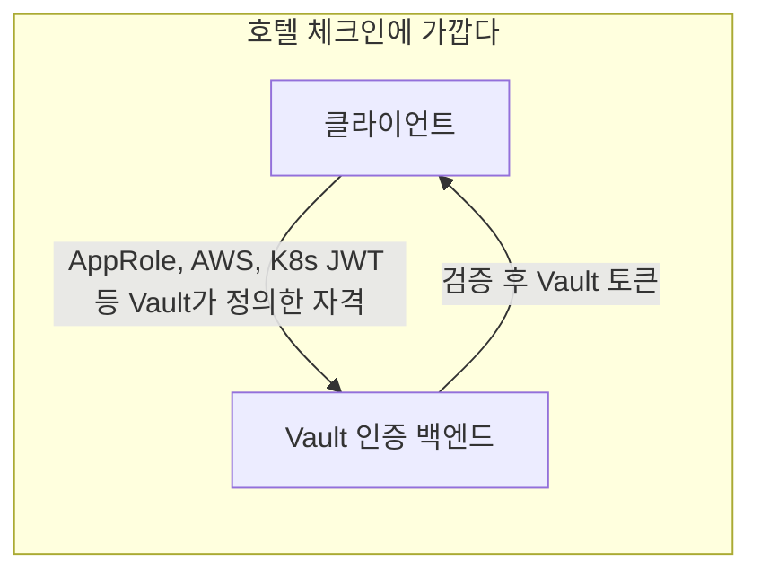
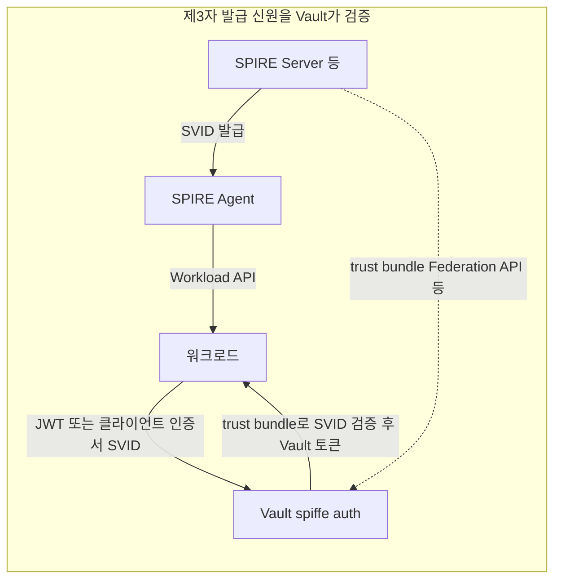

# SPIFFE 인증 방법 (Enterprise)

> 개념 문서: [HashiCorp Vault — SPIFFE auth method](https://developer.hashicorp.com/vault/docs/auth/spiffe)  
> HTTP API: [SPIFFE auth method (API)](https://developer.hashicorp.com/vault/api-docs/auth/spiffe)

`spiffe` 인증 방법은 **JWT 또는 X.509 기반 SPIFFE SVID**를 사용해 Vault에 로그인할 수 있게 합니다. 신뢰는 구성된 **trust bundle**(신뢰 앵커)에 뿌리를 둡니다.

::: warning 라이선스
Vault Enterprise와 해당 플러그인 사용 권한이 필요합니다.
:::

## SPIRE 서버와의 관계 — Vault는 발급자가 아니다

| 역할 | 설명 |
|------|------|
| **SPIRE Server** 등 SPIFFE 구현 | 워크로드에 **SVID를 발급**하고, 도메인별 **신뢰 번들**을 관리하는 쪽(발급 기관) |
| **Vault `spiffe` auth** | 클라이언트가 보낸 SVID를 trust bundle로 **검증**하고, SPIFFE ID를 Vault 정책에 매핑해 **Vault 토큰**을 발급하는 쪽(신뢰 당사자) |

즉 Vault는 SPIRE를 “대체”하지 않으며, 워크로드 신원을 만드는 책임은 SPIRE(또는 동등한 SPIFFE 구현)에 있습니다.

::: tip SPIFFE·SPIRE 개념

SPIFFE·SPIRE 개념이 필요하면 [SPIFFE/SPIRE 개요](../../../01-Infrastructure/Security/spiffe-spire-overview.md)를 먼저 읽으면 됩니다.

:::

## 비유: 호텔 체크인과 레스토랑 주문

완전한 대응은 아니지만, **“누가 신원을 만들고, Vault가 무엇을 하느냐”**를 구분하는 데는 도움이 됩니다.

| 구분 | 비유 | 설명 |
|------|------|------|
| **일반 Vault 인증** | **호텔 체크인** | 손님이 프런트(Vault)에 직접 여권·회원 정보 등 **Vault가 이해하는 자격**을 제시하고, 호텔이 검증한 뒤 **객실 키(토큰)**를 줍니다. “키를 줄 권한”의 중심이 Vault 쪽에 있습니다. |
| **SPIFFE 인증** | **레스토랑에서 제휴 식권·멤버십으로 주문** | 식권(SVID)은 이미 **제휴사(SPIRE 등)**가 발급했고, 레스토랑(Vault)은 **위조 여부만 검증**(trust bundle으로 서명·키 확인)한 뒤 주문(시크릿 접근)을 허용합니다. 레스토랑이 식권을 인쇄하지 않습니다. |

JWT를 `Authorization: Bearer`로 보내는 모습은 “카운터에 **미리 받은 티켓**을 내밀고 메뉴를 고른다”에 가깝고, X.509 SVID는 “**신분증 형태의 공인 자격**을 TLS로 제시한다”에 가깝습니다.  
페더레이션·갱신 같은 세부는 이 비유에 다 담기 어렵으므로, 아래 흐름도와 API 예시를 함께 보는 것이 좋습니다.

### 프로세스 흐름 (mermaid)

#### 일반 Vault 인증



#### SPIFFE 인증


## 구성 요약

- 마운트당 **하나의 trust domain**과, 그에 맞는 **profile**(번들 가져오기 방식)을 둡니다.
- **역할(role)**에서 **워크로드 ID 패턴**(`workload_id_patterns`)을 SPIFFE ID의 경로 부분과 매칭해 **Vault 정책**을 붙입니다. SPIFFE ID에서 trust domain 접두어(`spiffe://<domain>/`)를 떼면 워크로드 ID가 됩니다.
- Trust bundle은 **정적(static)**으로 넣거나, **원격 HTTPS / SPIFFE 엔드포인트**에서 가져옵니다.
- **SPIRE 연동:** SPIRE가 `https_web` 또는 `https_spiffe` 유형의 Federation API를 제공하면, Vault가 해당 URL에서 번들을 가져올 수 있습니다([API의 profile 항목](https://developer.hashicorp.com/vault/api-docs/auth/spiffe#create-configuration)).

## Vault 구성 및 인증 예시 (HTTP API)

아래는 [SPIFFE auth API](https://developer.hashicorp.com/vault/api-docs/auth/spiffe)를 기준으로 한 **최소 예시**입니다. 경로는 `spiffe` 마운트를 가정합니다.

### 1. 인증 방법 활성화 (JWT 시 Authorization 헤더)

JWT SVID를 `Authorization: Bearer`로 보내려면 마운트 시 **passthrough**가 필요합니다.

```bash
vault auth enable -path=spiffe -passthrough-request-headers="Authorization" spiffe
```

### 2. Trust domain·번들 프로필 구성

`POST /auth/spiffe/config` 로 trust domain과 `profile`을 설정합니다. `profile` 예:

| profile | 용도 |
|---------|------|
| `static` | 설정 본문에 번들을 직접 넣음 |
| `https_web_bundle` | HTTPS에서 JWKS 형식 번들 수신(SPIRE Federation `https_web`과 연계 가능) |
| `https_spiffe_bundle` | SPIFFE 엔드포인트에서 번들 수신(`https_spiffe` Federation) |
| `https_web_pem` | HTTPS에서 PEM 인증서를 번들로 사용 |

**원격에서 가져오는 예** (`https_web_bundle` — 필드명은 API 버전에 맞게 조정):

```json
{
  "trust_domain": "example.org",
  "profile": "https_web_bundle",
  "endpoint_url": "https://spire.example.org",
  "endpoint_root_ca_truststore_pem": "-----BEGIN CERTIFICATE-----\n...\n-----END CERTIFICATE-----\n",
  "audience": ["vault"]
}
```

- `audience`: **JWT SVID**에 허용할 audience 목록. 비어 있으면 **모든 JWT SVID 거부**입니다.
- `defer_bundle_fetch`: `true`면 원격 번들이 아직 없어도 설정만 반영(초기 fetch 생략)할 때 사용합니다.
- 캐시된 번들을 **즉시 갱신**하려면 동일 엔드포인트에 **빈 페이로드**로 `POST`합니다.

정적 번들(`static`)은 `bundle`에 PEM 또는 JWKS 문서를 넣습니다.

### 3. 역할 — 워크로드 ID 패턴 → 정책

`POST /auth/spiffe/role/:name`

```json
{
  "workload_id_patterns": ["team1/web*", "team2/+/api"],
  "token_policies": ["spiffe-web"]
}
```

- 패턴은 SPIFFE ID에서 `spiffe://<trust_domain>/` 를 뗀 **경로**에 대해 매칭합니다.
- `*`는 접두 일치, `+`는 **한 경로 세그먼트** 와일드카드입니다.
- 여러 역할이 겹치면 Vault의 **정책 우선순위** 규칙이 적용됩니다.

### 4. 로그인

`POST /auth/spiffe/login`

- **JWT:** `Authorization: Bearer <svid-jwt>` 헤더, 본문에 필요 시 `"role": "<역할명>"`, `"type": "jwt"` 또는 `"auto"`.
- **X.509:** TLS 클라이언트 인증서로 SVID 제시, `"type": "cert"` 또는 `"auto"`.

```bash
curl -X POST \
  -H "Authorization: Bearer $SVID_JWT" \
  -d '{"role":"my-role","type":"auto"}' \
  https://vault.example.com/v1/auth/spiffe/login
```

## X.509 SVID 사용 시

클라이언트 인증서를 TLS로 받으려면 Vault 설정에서 `tls_disable` 및 `tls_disable_client_certs`가 **클라이언트 인증서를 허용하는 값**이어야 합니다(클라이언트 인증서가 Vault까지 전달되도록).

## JWT SVID 사용 시

- 클라이언트는 `Authorization: Bearer <svid-jwt>` 형태로 JWT를 보냅니다. 위에서처럼 **`Authorization` passthrough**가 필요합니다.
- 구성 API의 **`audience`** 배열에 허용 값을 넣고, 클라이언트 JWT의 audience가 그중 하나와 맞아야 합니다. 목록이 비어 있으면 JWT SVID는 모두 거부됩니다.

## Trust bundle 형식·갱신

- JWT·X.509 SPIFFE ID를 쓰려면 trust bundle에 **X.509와 JWKS(JWK)** 요건을 맞춥니다(형식은 [공식 문서](https://developer.hashicorp.com/vault/docs/auth/spiffe#supported-trust-bundle-formats) 참고).
- 원격 번들은 캐시되며, refresh hint가 없으면 기본 **1시간** 간격으로 갱신됩니다. Performance 리플리카 클러스터에서는 활성 노드가 각각 갱신할 수 있습니다.

## 로드밸런서·리버스 프록시 앞에 둘 때

TLS가 프록시에서 종료되면 클라이언트 인증서가 Vault까지 오지 않을 수 있습니다. 프런트엔드에서 검증한 클라이언트 인증서를 요청 헤더로 넘기고, Vault listener가 해당 헤더를 신뢰하도록 구성해야 하며, 프록시–Vault 구간은 이상적으로 **mTLS**로 보호합니다.

## 참고 링크

- [HashiCorp Vault — SPIFFE auth method](https://developer.hashicorp.com/vault/docs/auth/spiffe)
- [HashiCorp Vault — SPIFFE auth HTTP API](https://developer.hashicorp.com/vault/api-docs/auth/spiffe)
- [SPIFFE Overview](https://spiffe.io/docs/latest/spiffe-about/overview/)
- [SPIRE Concepts](https://spiffe.io/docs/latest/spire-about/spire-concepts/)
