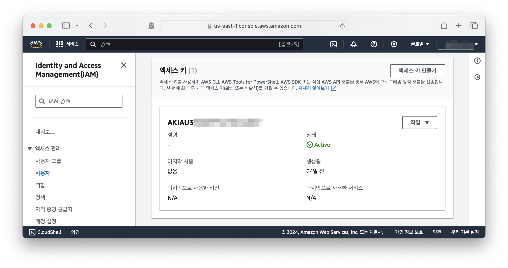
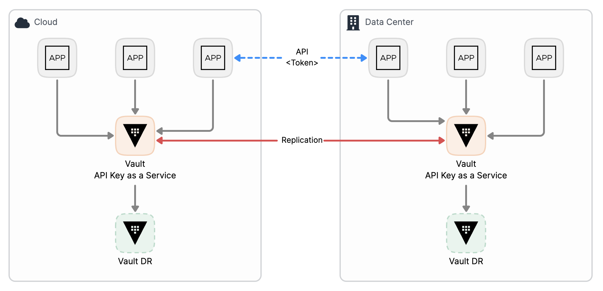
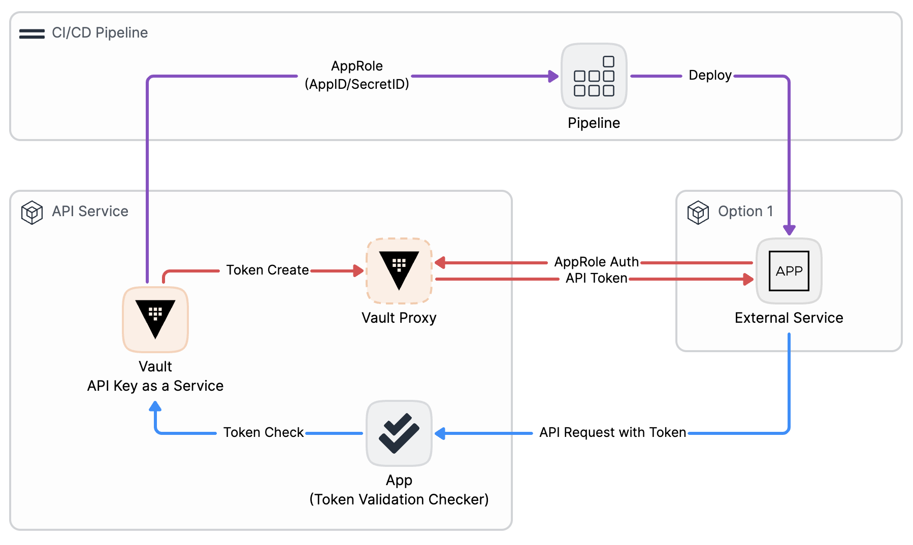
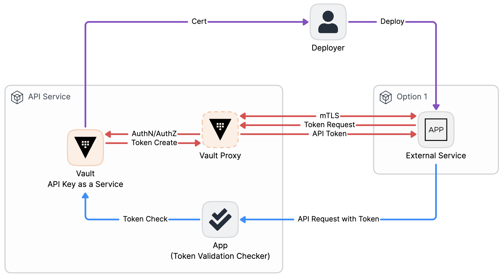
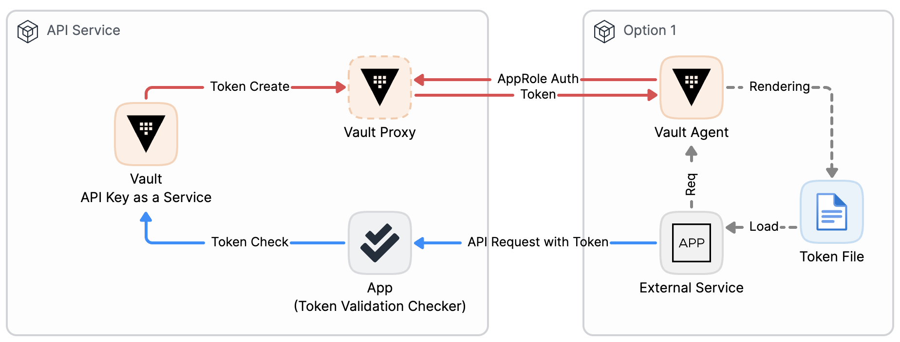

# API 보안을 위한 Vault 활용 (API Key)

> 참고 1: [OWASP Top 10 API Securit Risks - 2023](https://owasp.org/API-Security/editions/2023/en/0x11-t10/)
> 참고 2: [Cloudflare API 보안 가이드](https://cf-assets.www.cloudflare.com/slt3lc6tev37/5zfIEoxvRDHLRbkBaLJqsT/c712b0273971194774fc7326b3b1da34/Whitepaper_A-Guide-to-API-Security_Korean_20220622.pdf)

API는 서로 다른 앱 간 통신을 가능하게 하여 서로 다른 앱, 서로 다른 기업 및 조직 간 데이터 교환으로 더큰 서비스와 다양한 비즈니스를 구성하도록 합니다. 이는 개별 앱이 보유한 다양한 기능과 데이터가 결합되기 때문입니다. API 전략은 엔드유저와 대면하는 서비스와 별개로 앱과 앱 간의 소비하는 모델을 만들기도 합니다.

데이터와 기능이 호출되면 여기에 비용이 발생함은 물론 데이터의 보안과 접근에 대한 보호가 필요해집니다. 내외부의 API에 대한 공격은 지속적으로 증가하고 있고, 공격자는 API의 취약점을 지속적으로, 그리고 이전보다 더 많이 공격합니다. API의 보안이 설계단계에서 취약하거나 보안을 고려하지 않고 개발하는 경우에는 이후 수많은 API간 통신이 발생하는 중이라 수정에 대한 영향도가 커질 수 있습니다.

API 보안으로 인해 데이터가 누출되는 사건은 국내외로 지속적으로 발생하고 있습니다.
- [(기사)초기 비번 그대로 쓴 LG유플](https://www.joongang.co.kr/article/25158501#home)
- [(기사)삼성전자 영국 온라인 스토어 고객 정보 유출](https://www.businesspost.co.kr/BP?command=article_view&num=333412)
- [(기사)Facebook Accounts Leaked Online](https://threatpost.com/facebook-accounts-leaked-check-exposed/165245/)
- [(기사)T-Mobile Website Allowed Hackers to Access Your Account Data](https://www.vice.com/en/article/wjx3e4/t-mobile-website-allowed-hackers-to-access-your-account-data-with-just-your-phone-number)

OWASP에서는 API의 보안위험 상위 10가지를 다음과 같이 정의합니다.

| 위협 | 설명 |
| - | - |
| 손상된 객체 수준의 권한 부여 | API는 종종 객체 식별자를 처리하는 엔드포인트를 노출시키며, 객체 수준의 액세스 제어 문제의 넓은 공격 표면을 만듭니다. 사용자 ID를 사용하여 데이터 소스에 액세스하는 모든 함수에 권한 확인을 구현하는 것이 중요합니다. |
| 손상된 인증 | 인증 메커니즘을 잘못 구현하면 공격자가 인증 토큰을 침해하거나 다른 사용자의 신원을 일시적 또는 영구적으로 가로챌 수 있습니다. 이는 API 보안을 저해할 수 있습니다. |
| 손상된 객체 속성 수준의 권한 부여 | 이는 과도한 데이터 노출과 대량 할당과 관련된 문제를 결합하며, 객체 속성 수준에서의 권한 검증 부재로 인해 권한이 없는 당사자에 의한 정보 노출 또는 조작이 발생합니다. |
| 제한 없는 리소스 소비 | API에 대한 성공적인 공격은 네트워크 대역폭, CPU, 메모리 및 저장소와 같은 리소스를 소비하거나, 이메일이나 생체 인증과 같은 기타 리소스를 소비하여 서비스 공급 업체를 통해 제공됩니다. 이는 서비스 거부 또는 운영 비용 증가로 이어질 수 있습니다. |
| 손상된 함수 수준의 권한 부여 | 복잡한 액세스 제어 정책과 관리 및 일반 기능 사이의 명확한 분리 부재로 인해 권한 결함이 발생할 수 있으며, 공격자가 다른 사용자의 리소스 또는 관리 기능에 액세스할 수 있습니다. |
| 민감한 비즈니스 흐름에 대한 제한 없는 액세스 | 이 위험이 있는 API는 비즈니스 흐름을 노출시키며, 자동화된 방식으로 과도하게 사용될 경우 비즈니스에 해를 끼칠 수 있는 기능을 보완하지 않습니다. |
| 서버 측 요청 위조 | SSRF 결함은 사용자 제공 URI를 유효성 검사하지 않고 원격 리소스를 가져올 때 발생하며, 이를 통해 공격자는 응용 프로그램이 예상치 못한 대상으로 조작된 요청을 보내도록 강제할 수 있습니다. |
| 보안 구성 오류 | API 및 이를 지원하는 시스템의 복잡한 구성은 종종 무시되거나 안전한 방식으로 구성되지 않을 수 있으며, 이는 다양한 유형의 공격으로 이어질 수 있습니다. |
| 부적절한 인벤토리 관리 | API는 종종 더 많은 엔드포인트를 노출시키며, 적절하고 최신의 문서 및 호스트 및 배포된 API 버전의 인벤토리 관리가 중요합니다. |
| API의 안전하지 않은 사용 | 개발자는 사용자 입력보다 제3자 API에서 받은 데이터를 더 신뢰하며, 더 약한 보안 표준을 채택합니다. 공격자는 목표 API를 직접 공격하는 대신 통합된 제3자 서비스를 대상으로하기 때문에 API를 손상시킬 수 있습니다. |

보안 위협에 대해 HashiCorp의 솔루션들이 지원하는 방식은 다음과 같습니다.

| 솔루션 | 설명 |
| - | - |
| Vault | 1) API에서 사용되는 인증 메커니즘을 제공하고, 인가에 대한 데이터를 함께 관리하여 통합된 인증/인가를 설계합니다. 2) 발행된 인증 정보는 수명이 짧고 자동화된 갱신 프로세스를 제공합니다. 3) 인증된 앱, 장비간 통신을 위한 인증서 서비스를 제공합니다. 4) 데이터의 암호화 복호화 서비스를 제공합니다. |
| Consul | 1) 비즈니스 흐름 및 인벤토리 관리를 정의하여 의도된 API 흐름을 정의합니다. 2) 서비스 메시를 통해 신뢰관계인 서비스 간에 통신할 수 있도록 정의합니다. 3) 서비스 마다 요청에 대한 제한을 적용합니다.  |
| Terraform | 인프라 보안 구성을 표준화 하고, 보안 정책을 준수하는 인프라 구성을 하도록 돕습니다. |

여기서는 Vault의 API 보안에 대한 인증 메커니즘을 설명 합니다.

> 기타 참고
> - [(Consul) 서비스 메시로 트래픽 제어(영상)](https://youtu.be/eFdwlCNLL8s?si=oocJgV8HTXai1gcX)
> - [(Terraform) 센티널, 코드화된 정책 적용 익히기(영상)](https://youtu.be/_TbhKFp2sd4?si=PFh7_SekV40UL7Ax)
> - [(Vault) PKI를 사용하여 mTLS 구성의 인증서 자동화](./mtls)

## 1. API를 위한 인증과 인가, API 키/토큰

API로 서비스를 기획하는 경우 요청을 식별하고 적절한 권한을 부여하기 위해 API 키 또는 API 토큰을 사용할 수 있습니다. 우리가 이야기하는 클라우드 또한 API로 구성된 인프라와 서비스 덩어리 입니다. 서비스를 사용하고 외부 서비스와 연계하기 위해 클라우드를 비롯 수많은 API 서비스는 식별가능한 인증과 사용에 대한 권한 용도로 `API 키/토큰`을 제공 합니다.



[API 키란 무엇인가요?](https://aws.amazon.com/ko/what-is/api-key/) 라는 AWS 문서에 보면 API 키 모범 사례에서 인증과 인가를 위한 ==중요한== API 키/토큰에 대해 어떻게 관리해야 하는지 알려줍니다.

- 사용자 인증에 API 키를 사용하지 마세요. API 키는 사용자 액세스를 규제하기 위한 것이 아닙니다. 마찬가지로 전송 중에 표시될 수 있으므로 기밀 정보를 API 키에 포함하지 마세요. 
- API 키를 소스 코드나 리포지토리에 직접 임베드하지 마세요. 삭제하지 않으면 애플리케이션을 게시할 때 일반에 노출될 수 있습니다. 
- API 키를 더 이상 사용하지 않을 때는 삭제하세요. 보다 강력한 API 보안을 위해 키에 만료 시간을 추가하는 것을 고려해 보세요.

::: tip 모범 사례를 정리해보면
1. 사용자(사람)보다는 앱 인증에 사용하고
2. 평문의 고정된 값으로 기록하지 않기를 권장하고
3. 사용하지 않는 경우 삭제하고 만료 시간을 정의해야 합니다.
:::

API 키/토큰이 제공하는 인증 및 인가에 더불어, 위의 모범 사례를 적용하면 OWASP에서 지적한 위협중 다음을 해결할 수 있습니다.
- 손상된 객체 수준의 권한 부여
- 손상된 인증
- 손상된 객체 속성 수준의 권한 부여
- 손상된 함수 수준의 권한 부여

::: danger 하지만 다음과 같은 이유로 이같은 모범사례를 직접 구현하기란 어렵습니다.
- 기록하지 않는다면 누군가 대신 넣어주거나(Injection) 별도 API 키/토큰 저장소를 두어 가져올 수 있어야 한다. (이때 또 저장소에 대한 인증이 필요하다.)
- 삭제에 대한 훈련이 부족하고, 서비스의 끊김 없이 교체할 수 있는 자동화 방안이 필요하다.
:::

API 서비스를 위한 API 키/토큰 발급 및 관리 시스템을 제공하고, 모범사례를 구현하기위해 Vault를 활용할 수 있습니다.

## 2. API 키/토큰을 위한 Vault 요소

### 2.1 Vault Token

> [Vault Token의 이해](https://docmoa.github.io/04-HashiCorp/06-Vault/01-Information/vault-token.html)

`Vault Token`은 Vault 내에서는 인증 이후의 API 인증/인가를 담당하는 요소입니다. API 키/토큰 요소 및 발급 서비스로서 다음의 특징을 갖습니다.
- 영구적이지 않고 생생 시 마다 고유한 값을 갖습니다
- 메타 데이터 정의를 통해 사용자가 API 앱을 개발함에 있어 필요한 데이터를 담아 사용자와 권한을 구분하는 용도로도 활용가능합니다.
- Vault Audit Log를 통해 생성 요청을 감사할 수 있습니다.
- 손상된 API 키/토큰으로 확인 된 경우 강제 만료(Revoke)
- `token_bound_cidrs` 옵션을 통해 Vault Token에 대해 검증 요청이 가능하(사용) 네트워크 CIDR 대역을 지장할 수 있습니다.
- Vault Sentinel 기능을 통해 발급 요청에 대한 옵션값 정책을 정의할 수 있습니다.
- Vault Rate Limit 기능과 Quota를 사용하여 Vault Token 발급 및 검증에 호출 건수를 제한할 수 있습니다.
- Vault Performance Replication 기능을 사용하여 다수의 클러스터 환경에서 동일한 구성을 중앙 관리합니다.
- Vault Disaster Recovery 기능을 사용하여 Vault 장애시 전환을 통해 기존 발급된 Vault Token 내역을 복구할 수 있습니다.

`API 키 관리 서비스`로서의 Vault는 분산 및 클라우드 환경에서 관리를 담당하는 요소를 격리 및 가용성을 확보할 수 있습니다.



Token을 생성하는 CLI를 다음과 같이 실행하여 출력된 결과를 확인해봅니다.

::: details Vault Dev 모드로 실행
[Vault Download 안내 링크](https://developer.hashicorp.com/vault/install?product_intent=vault)

```bash
# 서버 실행
vault server -dev -dev-root-token-id=root
```

```bash
# Dev용 ROOT Token
VAULT_TOKEN=root
```

:::

```json:no-line-numbers {15,17,24-26,29}
$ vault token create -format=json \
  -policy=default \
  -ttl=30 \
  -metadata=type=api-admin \
  -orphan=true

{
  "request_id": "8e2a416d-5587-90d1-68bd-d930a2005442",
  "lease_id": "",
  "lease_duration": 0,
  "renewable": false,
  "data": null,
  "warnings": null,
  "auth": {
    "client_token": "hvs.CAESIJz-I42G1S4nWalCu3yrKwV63FW-3wKV4H****",
    "accessor": "JOmunQGBUBgC4gaYzOt3gL8k",
    "policies": [
      "default"
    ],
    "token_policies": [
      "default"
    ],
    "identity_policies": null,
    "metadata": {
      "type": "api-admin"
    },
    "orphan": true,
    "entity_id": "",
    "lease_duration": 30,
    "renewable": true,
    "mfa_requirement": null
  }
}
```

API 키/토큰 요소로 활용되는 Vault Token의 요소와 특성은 다음과 같습니다.

| 요소 | 특성 |
| - | - |
| auth.client_token | 발생된 고유 API 키/토큰으로 활용합니다. 발급 시마다 고유한 값을 갖습니다. |
| auth.policies | `default` 정책은 해당 토큰으로 Vault내에서 자기 자신의 상태 및 정보를 확인할 수 있는 권한을 부여 합니다. |
| auth.metadata | API 키/토큰을 구분할 메타데이터로 활용됩니다. 사용자 식별 데이터를 저장하거나 권한에 대해 정의할 수 있습니다. |
| auth.lease_duration | 발생된 토큰의 유효 기간을 나타냅니다. |

검증을 위한 절차로 Token(auth.client_token 값)을 조회한 경우 정상인 경우 다음의 결과를 확인할 수 있습니다.

```json:no-line-numbers
$ vault token lookup -format=json hvs.CAESIFIvewF8ayV-6Qe_YYtrYjnFRUJaMXHOOHNuo23****

{
  "request_id": "8d7af9d6-5af4-8f30-da8d-3bcfd3f10d44",
  "lease_id": "",
  "lease_duration": 0,
  "renewable": false,
  "data": {
    "accessor": "1tn5yr9Ybadum7I1EIirgaBN",
    "creation_time": 1710836854,
    "creation_ttl": 30,
    "display_name": "token",
    "entity_id": "",
    "expire_time": "2024-03-19T17:28:04.530353+09:00",
    "explicit_max_ttl": 0,
    "id": "hvs.CAESIFIvewF8ayV-6Qe_YYtrYjnFRUJaMXHOOHNuo23****",
    "issue_time": "2024-03-19T17:27:34.530355+09:00",
    "meta": {
      "type": "api-admin"
    },
    "num_uses": 0,
    "orphan": true,
    "path": "auth/token/create",
    "policies": [
      "default"
    ],
    "renewable": true,
    "ttl": 26,
    "type": "service"
  },
  "warnings": null
}
```

Vault Token의 TTL이 만료된 경우 Vault 내에서 이미 Token이 만료처리(Revoke) 되므로 권한없음의 에러를 반환 합니다.

```bash
$ vault token lookup -format=json hvs.CAESIFIvewF8ayV-6Qe_YYtrYjnFRUJaMXHOOHNuo23****
Error looking up token: Error making API request.

URL: POST http://127.0.0.1:8200/v1/auth/token/lookup
Code: 403. Errors:

* bad token
```

### 2.2 Vault Token Role

Cloud 서비스, IAM, 인증 서비스 등을 다뤄본 사용자라면 정책(policy)과 역할(role)에 대한 개념을 지속적으로 접하게 됩니다. 역할은 다수의 정책이 부여된 권한 템플릿이라 볼 수도 있습니다.

| 용어 | 설명 |
| - | - |
| 정책(Policy) | 리소스에 대한 사용 권한을 정의합니다. |
| 역할(Role) | Identity 요소로, 정책이 부여된 대상으로, 다수의 정책을 갖습니다. |

앞서 [2.1 Vault Token](#21-vault-token)에서 정의되는 Vault Token은 발급 할 때마다 수명(TTL)과 메타데이터 등의 옵션을 항상 지정해야 하는 반면, Vault Token Role을 정의하면 미리 설정된 값으로 매번 같은 조건의 Vault Token이 생성되게 됩니다.

다음과 같이 역할을 정의할 수 있습니다.

```bash
vault write /auth/token/roles/api-admin \
  orphan=true \
  token_explicit_max_ttl=30 \
  token_period=30 \
  token_type=service \
  allowed_policies=default \
  disallowed_policies=root
```

정의된 `api-admin` 역할을 지정하여 Vault Token을 생성합니다. (`metadata`는 생성시 넣어주는 값으로 미리 역할에 지정할 수는 없습니다.)

```json:no-line-numbers
$ vault token create -format=json -role=api-admin -metadata=foo=bar

{
  "request_id": "f09c2ed5-00d9-50d1-125d-c11422aa688f",
  "lease_id": "",
  "lease_duration": 0,
  "renewable": false,
  "data": null,
  "warnings": null,
  "auth": {
    "client_token": "hvs.CAESIKuBuHgqkFZ3IIuY80JzQq5kGci-9Jd2Xix****",
    "accessor": "asIKCp1Wtyb0VdzjPHEvN4EE",
    "policies": [
      "default"
    ],
    "token_policies": [
      "default"
    ],
    "identity_policies": null,
    "metadata": {
      "foo": "bar"
    },
    "orphan": true,
    "entity_id": "",
    "lease_duration": 30,
    "renewable": true,
    "mfa_requirement": null
  }
}
```

앞서 Vault Token을 직접 생성하는 것과의 차이는 대부분의 옵션(수명주기, 독립된 Token 여부, 불필요한 Vault의 정책 부여 막기)이 미리 선언 되었다는 점과, 역할 고유의 값이 조회시 확인됩니다.

```json:no-line-numbers {23,28}
$ vault token lookup -format=json hvs.CAESIKuBuHgqkFZ3IIuY80JzQq5kGci-9Jd2X****

{
  "request_id": "809a0395-b33c-ebf1-9ff4-f98a984d2ba8",
  "lease_id": "",
  "lease_duration": 0,
  "renewable": false,
  "data": {
    "accessor": "asIKCp1Wtyb0VdzjPHEvN4EE",
    "creation_time": 1710837749,
    "creation_ttl": 30,
    "display_name": "token",
    "entity_id": "",
    "expire_time": "2024-03-19T17:42:59.684424+09:00",
    "explicit_max_ttl": 0,
    "id": "hvs.CAESIKuBuHgqkFZ3IIuY80JzQq5kGci-9Jd2Xix2****",
    "issue_time": "2024-03-19T17:42:29.684426+09:00",
    "meta": {
      "foo": "bar"
    },
    "num_uses": 0,
    "orphan": true,
    "path": "auth/token/create/api-admin",
    "policies": [
      "default"
    ],
    "renewable": true,
    "role": "api-admin",
    "ttl": 26,
    "type": "service"
  },
  "warnings": null
}
```

`role` 항목이 추가되어 해당 토큰이 어떤 역할로 부터 생성되었는지 확인 가능합니다. 앱에서는 이런 역할 값을 조회하여 내부적으로 권한 부여를 추가할 수 있습니다.

### 2.3 자동화

Vault Token이 제공하는 API Key에 수명주기 기능은 모범사례인 비영구성을 만족하나, 이경우 자동화가 뒷받침되어야 합니다. 앱 및 API를 호출하는 외부 서비스는 API Key를 수명주기 만료 전에 갱신할 수 있어야 합니다. 앱으로 개발되는 경우 개발 로직에 자동화 행위를 추가할 수 있지만, 정적인 파일이나 구성에 존재해야 하는 경우 분산된 서비스 수만큼의 수작업이 발생할 수 있습니다.

::: tip 자동화의 핵심은 인증!
API Key를 요청하는 대상 또한 믿을 수 있는 대상이여야 합니다. 기존 클라우드 서비스 또는 SaaS 서비스에서 API Key를 생성하는 경우, 관리자인 사람이 어떤 방식(ID/PW, OIDC 등)을 통해 믿을 수 있는 사용자인지 인증 한뒤 API Key를 생성하였습니다. 이같은 수동 작업을 자동화하려면 API Key를 사용하려는 대상이 직접 인증 방식을 통해 API Key를 발급 및 갱신할 수 있어야 합니다.
:::

Vault는 다음의 기전을 사용하여 모범사례를 준수하면서 자동화가능한 방안을 제공합니다. 기본 구조와 행위의 순서는 다음과 같습니다.


1. API Token이 필요한 서비스는 Token을 요청할 수 있는 권한이 있음을 인증받아야 합니다.
2. Token 발급을 담당하는 Vault로 직접 접속하기 보다 제한된 기능만 수행하는 `Vault Proxy`를 통해 요청합니다.
3. 인증이 통과하면 `Vault Proxy`는 Vault 서버로부터 Token을 생성하고, 요청한 서비스로 반환 합니다.
4. 서비스는 Token을 API 요청에 담아 API 서비스로 요청합니다.
5. API 서비스는 전달받은 API Token을 Vault 서버에 검증하고 부여된 권한을 확인하여 응답합니다.

#### 🚀 [자동화 방안 1] 앱에서 인증과 Token 발급 처리

개발되는 앱은 Vault의 다양한 인증 방식들을 사용하여 신뢰할 수 있는 앱임을 증명할 수 있습니다. 앱이 독자적으로 Vault에 인증 받는데 가장 많이 사용되는 수단은 AppRole 방식 입니다.

> 참고 : [Vault로 Spring Boot 구성관리](https://docmoa.github.io/04-HashiCorp/06-Vault/04-UseCase/spring-boot.html)

- CICD 도구는 Vault와 상호 인증됩니다.
- 배포 파이프라인상에서 Vault AppRole의 인증 정보(App ID, Secret ID)를 획득합니다.
- 앱이 배포될 때 AppRole 인증정보로 Vault Proxy에 인증 받습니다.
- 앱은 Vault Proxy로 API 요청에 필요한 API Key(Token)를 Vault Token Role 기반으로 발급 받습니다.



#### 🚀 [자동화 방안 2] mTLS를 이용하여 네트워크 인증 처리

mTLS(Mutual TLS)는 네트워크 연결 시 상호간 인증서를 검증하여 신뢰할 수 있는 네트워킹을 가능하게 합니다. Vault Proxy로의 접속이 가능하려면 앱은 인증서를 기반으로 해당 앱/장치가 신뢰할 수 있음을 증명 합니다. 이경우 Vault Proxy가 Vault 서버로 미리 인증을 받기 때문에 API Key를 요청하는 서비스는 요청하는 Vault Token Role 이름만 알면 됩니다. 주로 Public 네트워크를 통해 들어오는 요청을 처리하는 ATM기, POS기, IoT 등 장치에 대한 인증에 활용됩니다.

인증서 또한 유효기간이 있으므로, 인증서 교체를 자동화 하기 위해서는 [방안 3](#자동화-방안-3-vault-agent를-이용한-자동화-위임)에서 활용하는 `Vault Agent`를 활용할 수 있습니다.

> 참고 : [mTLS 를 사용한 상호간 인증](https://docmoa.github.io/04-HashiCorp/06-Vault/04-UseCase/mtls.html)
> 사례 : [Starbucks](https://www.hashicorp.com/resources/starbucks-secrets-at-the-retail-edge-with-hashicorp-vault)



- 최초 배포 시 유효한 인증서를 함께 배포 합니다.
- API Key를 요청하는 서비스는 Vault Proxy로의 mTLS로 상호한 보안네트워크를 구성합니다.
- API Key를 요청하는 서비스는 Vault Token Role 기반으로 API Key(Token)를 요청합니다.

#### 🚀 [자동화 방안 3] Vault Agent를 이용한 자동화 위임

API Key를 요구하는 대상 서비스가 외부에 별도 구성되거나, 독립된 시스템, 또는 [방안 1](#자동화-방안-1-앱에서-인증과-token-발급-처리)과 [방안 2](#자동화-방안-2-mtls를-이용하여-네트워크-인증-처리)로 해결이 불가능한 경우 대상 시스템에 인증 및 발급 후 처리를 담당하는 `Vault Agent`를 구성할 수 있습니다. `Vault Agent`는 앱/사람 대신 1) Vault에 인증하고 2) Token을 발급 및 갱신하고 3) 필요시 파일로 저장히고 4) 추가적인 작업을 실행할 수 있는 도구 입니다.

> 참고 : [Vault Agent를 사용한 인증서 교체](https://docmoa.github.io/04-HashiCorp/06-Vault/02-Secret_Engine/pki-nginx.html)



- API를 요청하는 앱이 구성되어있는 인프라에 Vault Agent를 구성합니다.
- Vault Agent가 Vault Proxy(또는 Server) 인증 및 인가 합니다.
- API Key를 획득하려는 앱은 Vault Agent를 통해 API Key를 요청하거나, Vault Agent가 생성해주는 파일을 읽어 API Key를 획득 합니다.

::: details Vault Agent로 Token 발급/갱신 테스트

Vault Agent의 Token생성 권한을 정의하는 `admin-role-token-create.hcl` 정책 정의 파일을 생성합니다.

```hcl title="admin-role-token-create.hcl"
path "auth/token/create/api-admin" {
  capabilities = ["create", "update"]
}

path "auth/token/lookup-self" {
    capabilities = ["read"]
}
```

정책을 생성합니다.
```bash
vault policy write admin-role-token-create admin-role-token-create.hcl
```

Vault Agent는 `admin-role-token-create` 정책의 권한이 있는 인증 수단이면 됩니다. 다양한 방식을 지원하고, 여기서는 단순하게 Token을 생성하여 권한을 부여합니다.

```bash
vault token create -field=token -policy=admin-role-token-create -no-default-policy > vault-token
```

API Key를 파일로 랜더링하기위한 `token.tpl` 템플릿 파일의 예는 다음과 같습니다.

```hcl title="token.tpl"
{{- with secret "auth/token/create/api-admin" "meta=foo=bar" -}}
{{ .Auth.ClientToken }}
{{- end }}
```

다음으로 Vault Agent의 동작을 확인하기 위한 `config.hcl`은 다음과 같습니다.

```hcl title="config.hcl" {15,20-24}
pid_file = "./pidfile"

vault {
  address = "http://127.0.0.1:8200"
  retry {
    num_retries = 3
  }
}

auto_auth {
  method {
    type = "token_file"

    config = {
      token_file_path = "vault-token"
    }
  }
}

template {
  source = "./token.tpl"
  destination = "./template.txt"
  command = "VAULT_TOKEN=$(cat template.txt) vault token lookup"
}
```

- `token_file_path`는 앞서 생성한 Vault Agent 인증/인가를 위해 생성한 Token이 저장되어 있습니다.
- `template`에 동적으로 생성할 정의가 되어있습니다.
  - `token.tpl`에 정의된 Vault에서 Token 생성 후 저장되는 정보는 `template.txt`에 저장됩니다.
  - 후속 작업에 대한 정의로 Token을 검증하는 커맨드를 실행합니다.

다음의 명령어로 Vault Agent를 실행합니다.

```bash
vault agent -config=./config.hcl
```

실행 후 Token을 새로 생성한 결과와, 잠시 후 Token의 TTL이 만료되면, 다시 갱신하는 로그를 확인할 수 있습니다.

```log
==> Vault Agent started! Log data will stream in below:

==> Vault Agent configuration:

           Api Address 1: http://bufconn
                     Cgo: disabled
               Log Level: 
                 Version: Vault v1.15.6, built 2024-02-28T17:07:34Z
             Version Sha: 615cf6f1dce9aa91bc2035ce33b9f689952218f0

2024-03-19T21:47:39.977+0900 [INFO]  agent.exec.server: starting exec server
...
2024-03-19T21:47:39.979+0900 [INFO]  agent: (runner) starting
2024-03-19T21:47:39.986+0900 [INFO]  agent: (runner) rendered "./token.tpl" => "./template.txt"
2024-03-19T21:47:39.986+0900 [INFO]  agent: (runner) executing command "[\"VAULT_TOKEN=$(cat template.txt) vault token lookup\"]" from "./token.tpl" => "./template.txt"
2024-03-19T21:47:39.986+0900 [INFO]  agent: (child) spawning: sh -c VAULT_TOKEN=$(cat template.txt) vault token lookup
Key                  Value
---                  -----
accessor             QL767YYmSy31S7c9p6ahuyMH
creation_time        1710852459
creation_ttl         30s
display_name         token
entity_id            n/a
expire_time          2024-03-19T21:48:09.983135+09:00
explicit_max_ttl     0s
id                   hvs.CAESIFPtfDQGPlyDzkA5wmCkU5A5XmhhJX4Gh4KHGh****
issue_time           2024-03-19T21:47:39.982003+09:00
last_renewal         2024-03-19T21:47:39.983135+09:00
last_renewal_time    1710852459
meta                 map[foo:bar]
num_uses             0
orphan               true
path                 auth/token/create/api-admin
policies             [default]
renewable            true
role                 api-admin
ttl                  29s
type                 service
2024-03-19T21:48:01.901+0900 [WARN]  agent: vault.write(auth/token/create/api-admin -> dafc7ee0): TTL of "30s" exceeded the effective max_ttl of "8s"; TTL value is capped accordingly
2024-03-19T21:48:01.901+0900 [WARN]  agent: vault.write(auth/token/create/api-admin -> dafc7ee0): renewer done (maybe the lease expired)
2024-03-19T21:48:01.905+0900 [INFO]  agent: (runner) rendered "./token.tpl" => "./template.txt"
2024-03-19T21:48:01.905+0900 [INFO]  agent: (runner) executing command "[\"VAULT_TOKEN=$(cat template.txt) vault token lookup\"]" from "./token.tpl" => "./template.txt"
2024-03-19T21:48:01.905+0900 [INFO]  agent: (child) spawning: sh -c VAULT_TOKEN=$(cat template.txt) vault token lookup
Key                  Value
---                  -----
accessor             RqB3ArHnIIYbjDWSQni7gTx2
creation_time        1710852481
creation_ttl         30s
display_name         token
entity_id            n/a
expire_time          2024-03-19T21:48:31.902519+09:00
explicit_max_ttl     0s
id                   hvs.CAESIHr-v_t37t0twlNhOhTTj3PyYzhtHQrDYvV1SLuhV****
issue_time           2024-03-19T21:48:01.902053+09:00
last_renewal         2024-03-19T21:48:01.902519+09:00
last_renewal_time    1710852481
meta                 map[foo:bar]
num_uses             0
orphan               true
path                 auth/token/create/api-admin
policies             [default]
renewable            true
role                 api-admin
ttl                  29s
type                 service
```

:::


#### 🚀 [자동화 방안 4] 플랫폼 수준에서의 자동화

API Key 발급과 갱신을 플랫폼 수준에서 자동화 할 수 있습니다. HashiCorp의 Nomad나 Kubernetes같은 오케스트레이터 수준에서 Vault와 통합되고, 생성되는 Token을 Secret 리소스로 갱신할 수 있습니다.

> 참고 : [Integrate Nomad](https://docmoa.github.io/04-HashiCorp/06-Vault/04-UseCase/nomad-integration.html)
> 참고 : [Integrate Kubernetes](https://docmoa.github.io/04-HashiCorp/06-Vault/04-UseCase/vault-k8s-usecase-csi-injection.html#_3-vso-vault-secret-operator)


Kubernetes의 경우 VSO는 Secret만을 지원하기 때문에 Auth 유형인 Token인 경우 Sidecar injector 방식으로 연동합니다.

::: details Kubernetes 예제

먼저 Vault Helm 차트를 등록합니다.

```bash
helm repo add hashicorp https://helm.releases.hashicorp.com
```

Vault가 Kubernetes 외부에 있다는 가정하에 다음과 같이 설치 합니다. `global.externalVaultAddr`는 Kubernetes상에서 연동가능한 외부 Vault 주소 입니다.

```bash
helm install vault hashicorp/vault \
    --set "global.externalVaultAddr=$EXTERNAL_VAULT_ADDR" \
    --set "injector.enabled=true"
```

정상적으로 설치되면 `vault-agent-injector-*` Pod를 확인할 수 있습니다.

```bash
$ kubectl get pods

NAME                                    READY   STATUS    RESTARTS   AGE
vault-agent-injector-598675d8dd-fjxdz   1/1     Running   0          3m19s
```

Kuberntes에 구성된 `vault` Service Account를 확인합니다.

```bash
kubectl describe serviceaccount vault
```

Kubernetes 1.24+ 에서는 `vault` Service Account Token이 자동생성되지 않으므로, 해당 버전인 경우 다음을 실행하여 `Secret`을 생성합니다.

Service Account를 위한 Token을 생성합니다.
```bash
kubectl apply -f - <<EOF
apiVersion: v1
kind: Secret
metadata:
  name: vault-token-g955r
  annotations:
    kubernetes.io/service-account.name: vault
type: kubernetes.io/service-account-token
EOF
```

`VAULT_HELM_SECRET_NAME` 환경변수에 시크릿 이름을 선언합니다.

```bash
VAULT_HELM_SECRET_NAME=$(kubectl get secrets --output=json | jq -r '.items[].metadata | select(.name|startswith("vault-token-")).name')
```


Vault와 Kubernetes간 인증/인가를 위한 인증 방식을 추가합니다.

```bash
vault auth enable kubernetes
```

앞서 시크릿에서 JWT, CA, Host 정보를 환경변수에 선언합니다.
```bash
TOKEN_REVIEW_JWT=$(kubectl get secret $VAULT_HELM_SECRET_NAME --output='go-template={{ .data.token }}' | base64 --decode)
KUBE_CA_CERT=$(kubectl config view --raw --minify --flatten --output='jsonpath={.clusters[].cluster.certificate-authority-data}' | base64 --decode)
KUBE_HOST=$(kubectl config view --raw --minify --flatten --output='jsonpath={.clusters[].cluster.server}')
```

Vault의 Kubernetes 인증/인가 방식에 구성 정보를 추가합니다.

```bash
vault write auth/kubernetes/config \
     token_reviewer_jwt="$TOKEN_REVIEW_JWT" \
     kubernetes_host="$KUBE_HOST" \
     kubernetes_ca_cert="$KUBE_CA_CERT" \
     issuer="https://kubernetes.default.svc.cluster.local"
```

Kubernetes Service Account 및 맵핑할 Vault의 정책을 정의합니다.

```bash
vault write auth/kubernetes/role/injection \
    bound_service_account_names=webapp-vault \
    bound_service_account_namespaces=default \
    policies=admin-role-token-create \
    ttl=20m
```

다음과 같이 정의된 Deployment를 적용합니다.

```bash
kubectl apply -f - <<EOF
apiVersion: v1
kind: Pod
metadata:
  name: webapp-injection
  labels:
    app: issues
  annotations:
    vault.hashicorp.com/agent-inject: "true"
    vault.hashicorp.com/agent-inject-status: "update"
    vault.hashicorp.com/agent-inject-secret-my-api-key.txt: "auth/token/create/api-admin"
    vault.hashicorp.com/agent-inject-template-my-api-key.txt: |
      {{- with secret "auth/token/create/api-admin" "meta=foo=bar" -}}
      {{ .Auth.ClientToken }}
      {{- end }}
    # Vault의 Kubernetes인증으로 등록되어있는 Role 이름
    vault.hashicorp.com/role: "injection"
  labels:
    app: issues
spec:
  serviceAccountName: webapp-vault
  containers:
  - name: webapp
    image: nginx
EOF
```

내부에 저장된 API Key를 확인합니다.

```bash
$ kubectl exec -it webapp-injection -c webapp -- cat /vault/secrets/my-api-key.txt

hvs.CAESICi60HIi3mA8nG3rgx2WTGfI6HQVsHMWJkqcJg68znyDGh****
```

약 20초 후 자동으로 갱신됨을 확인합니다.

```bash
kubectl exec -it webapp-injection -c webapp -- cat /vault/secrets/my-api-key.txt

hvs.CAESIIj-RS6NxOFpRWMXlwYCcnG2wfb-WwGJxhlTqSI4hhbBGh****
```

:::