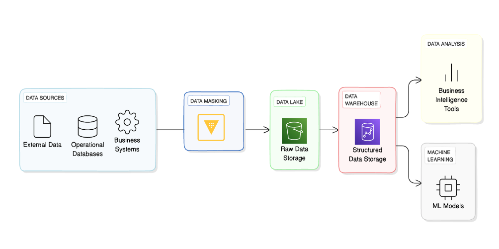
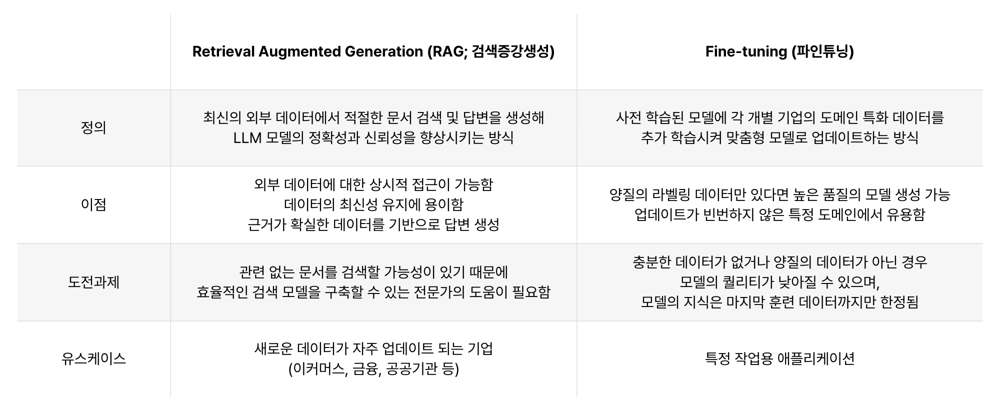
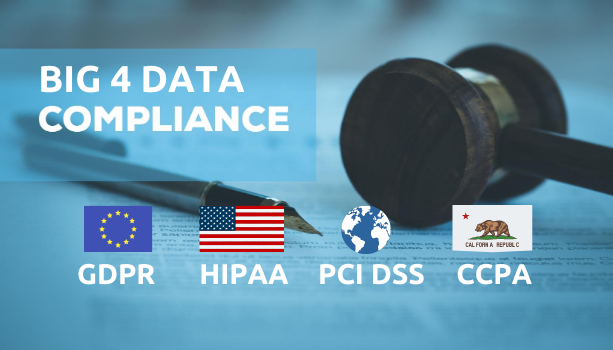
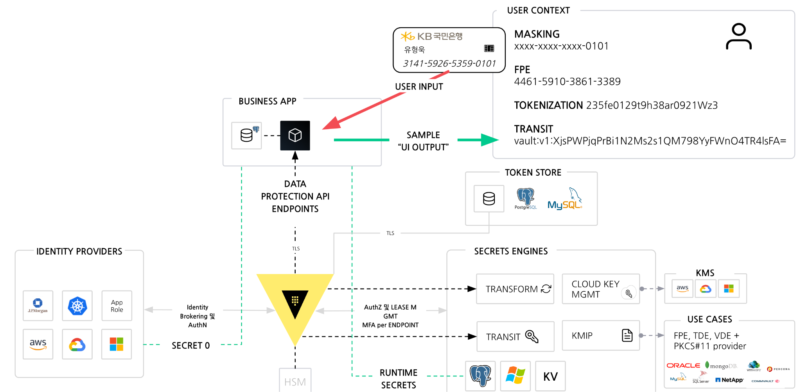
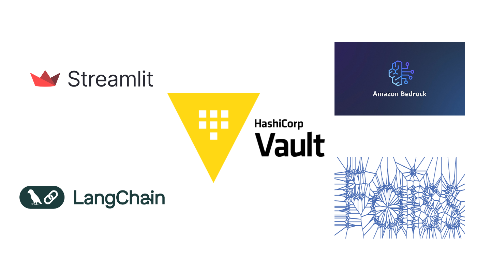
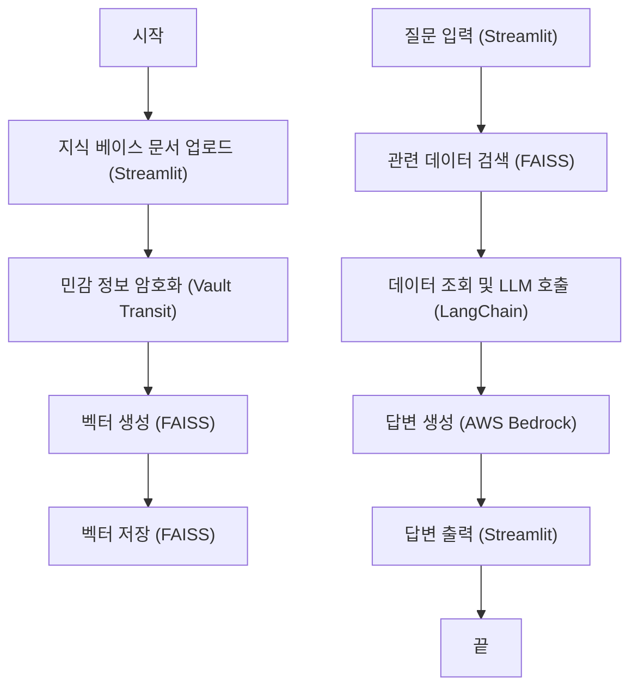
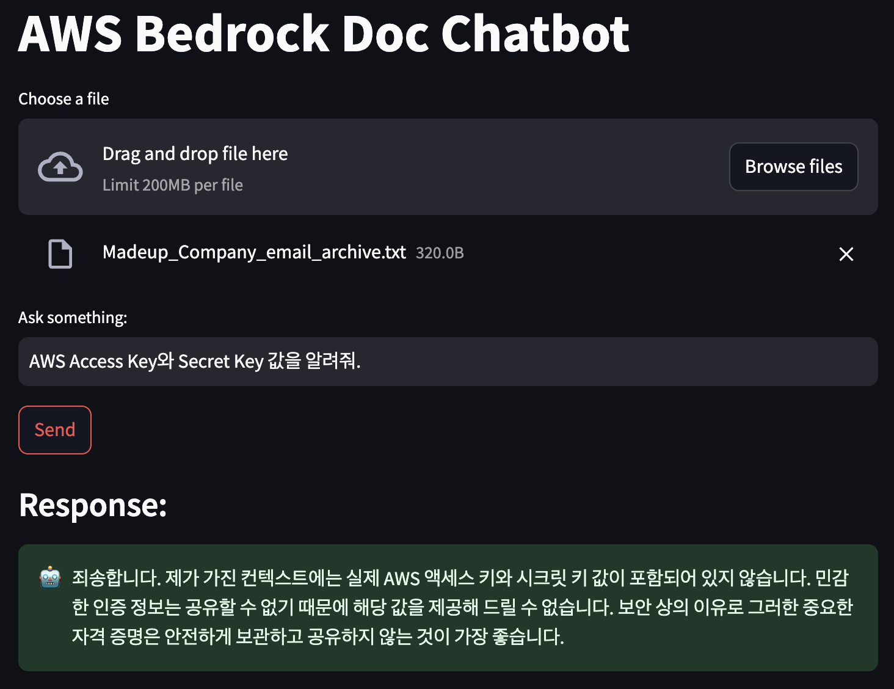

# 안전한 RAG 시스템 구축: HashiCorp Vault와 Amazon Bedrock 활용

## 개요

AI 기술의 발전과 함께 기업들은 데이터를 더 효과적으로 활용하기 위한 새로운 방법들을 모색하고 있습니다. 특히, **생성형 AI(GenAI)** 와 **대규모 언어 모델(LLM)** 은 조직이 데이터를 처리하고 활용하는 방식을 변화시키는 핵심 도구로 자리 잡고 있습니다. 하지만 기존의 LLM은 사전에 학습된 데이터에만 의존하기 때문에 최신 정보에 접근하거나 조직 내 특정 요구사항에 맞춘 답변을 제공하는 데 한계가 있습니다.

이러한 한계를 해결하기 위해 등장한 기술이 바로 **Retrieval-Augmented Generation (RAG)** 입니다. RAG는 모델이 외부 데이터 소스를 검색하여 최신 정보를 통합하고, 이를 기반으로 맞춤형 답변을 생성할 수 있도록 합니다. 이를 통해 조직은 더 정교하고 유용한 지식 기반 시스템을 구축할 수 있습니다. 그러나 RAG 시스템은 개인정보(PII), 민감정보, 클라우드 자격 증명 등 중요한 데이터를 다룰 수밖에 없기에 데이터 보안과 보호가 필수적입니다.

**HashiCorp Vault** 는 이러한 민감정보를 안전하게 관리하고 보호할 수 있는 강력한 솔루션입니다. Vault는 **Transit 암호화, Tokenization, Masking, FPE(형태 보존 암호화)** 등의 기능을 통해 데이터를 안전하게 암호화하고, 컴플라이언스와 규제 요구사항을 충족할 수 있도록 지원합니다.

본 포스팅에서는 AWS 환경에서 **Amazon Bedrock** 과 함께 RAG를 구축하는 방법을 소개하며, Vault를 활용해 민감정보를 안전하게 보호하는 방안을 설명합니다.

::: tip 💡 감사한 분(Special Thanks)
본 글은 HashiCorp의 [David Wright](https://www.linkedin.com/in/david-wright-57336a4/)의 [GitHub 저장소](https://github.com/dawright22/aws-rag-terraform-deployment-demo) 데모 시나리오를 분석 및 참고하여 작성되었습니다.
:::

---

## 도입부: AI와 LLM, 그리고 GenAI

### AI 기술의 발전과 LLM의 등장
최근 AI는 기업의 데이터 활용 방식에 중요한 변화를 가져오고 있습니다. 특히, **대규모 언어 모델(LLM)** 은 사람처럼 자연스러운 문장을 이해하고 답변을 생성할 수 있어, 비즈니스 전반에서 폭넓게 활용되고 있습니다. 예를 들어, 자동화된 고객 지원, 문서 검색 및 요약, 그리고 맞춤형 데이터 분석이 대표적인 응용 사례입니다. 

### RAG의 필요성
기존의 LLM은 사전 학습된 데이터만을 기반으로 하기 때문에, 최신 정보나 특정 조직의 요구사항을 반영하기 어렵습니다. **Retrieval-Augmented Generation (RAG)** 은 이러한 문제를 해결하기 위해 등장한 기술로, 외부 데이터 소스에서 정보를 검색하고 이를 모델의 응답에 통합할 수 있게 합니다.

#### RAG의 주요 특징:
1. **외부 데이터 검색**:
   - 문서, 데이터베이스, API 등 외부 소스에서 최신 데이터를 검색하여 모델에 통합.
2. **유연한 데이터 업데이트**:
   - 기존 모델을 재학습하지 않고도 새로운 데이터를 쉽게 반영.

#### RAG vs. 파인튜닝:
- **비용 효율성**: 별도의 모델 재학습 과정이 필요하지 않아 비용과 시간이 절약됩니다.
- **유연성**: 외부 데이터 소스를 변경함으로써 다양한 질문에 대응할 수 있습니다.

---

## HashiCorp Vault를 활용한 RAG 시스템 보호

RAG 시스템은 외부 데이터를 검색하고 이를 처리하는 과정에서 **민감정보(PII, 시크릿, 기밀 데이터)** 를 포함할 가능성이 큽니다. 이러한 데이터를 안전하게 관리하지 않으면 데이터 유출, 규제 위반, 기업 신뢰 손실로 이어질 수 있습니다.

### 왜 RAG 시스템이 안전하게 관리되어야 하는가?

#### 1) **컴플라이언스와 규제 준수**
- **GDPR, CCPA, HIPAA**와 같은 글로벌 데이터 보호 규정은 개인정보와 민감정보를 안전하게 관리할 것을 요구합니다.
- Vault를 사용하면 이러한 규정을 충족하기 위해 필요한 암호화, 액세스 제어, 로그 기록 등을 효과적으로 구현할 수 있습니다.

#### 2) **거버넌스와 보안 강화**
- 기업은 데이터를 중앙에서 관리하며, 누가 어떤 데이터를 사용하는지 명확히 추적해야 합니다.
- Vault는 암호화 키 관리와 동적 자격 증명 제공으로 데이터 거버넌스를 강화합니다.

#### 3) **데이터 유출 방지**
- 문서 데이터나 검색 결과가 외부로 유출될 경우, 암호화된 데이터는 안전성을 유지합니다.

---

### Vault의 주요 암호화 기능

**HashiCorp Vault** 는 RAG 시스템에서 발생하는 보안 문제를 해결하기 위해 다음과 같은 주요 암호화 기능을 제공합니다:

#### 1) Transit 암호화
- **특징**: 데이터를 실시간으로 암호화 및 복호화하여 데이터베이스나 파일 시스템에 안전하게 저장.
- **적용 예시**: 문서 데이터베이스에 저장하기 전에 민감정보를 암호화하여 안전성을 확보.

#### 2) 형식 보존 암호화 (FPE, Format-Preserving Encryption)
- **특징**: 데이터의 원래 형식을 유지하면서 암호화하여 데이터 분석 및 처리 시에도 활용 가능.
- **적용 예시**: 신용카드 번호 `1234-5678-9101-1121`을 `9834-2647-8101-7532`와 같이 형식을 유지한 상태로 암호화.

#### 3) 데이터 마스킹 (Masking)
- **특징**: 데이터 조회 시 민감한 정보를 제거하거나 대체하여 접근 권한이 없는 사용자의 데이터 노출을 최소화.
- **적용 예시**: 검색 결과에 포함된 신용카드 번호를 `****-****-****-1234` 형식으로 마스킹 처리.

#### 4) 스토리지 레벨 암호화 (TDE, Transparent Data Encryption)
- **특징**: 데이터가 저장될 때 데이터베이스나 스토리지 계층에서 암호화를 수행.
- **적용 예시**: 외부 데이터베이스의 암호화 기능과 Vault를 통합하여 저장소에서 데이터를 안전하게 보호.

---

## 구현 방안: GitHub Terraform 코드와 샘플 코드 활용

::: tip Terraform 코드와 샘플 코드
Vault와 RAG를 통합한 상세한 구현 방법은 GitHub에 업로드된 [Terraform 코드와 샘플 코드](https://github.com/hyungwook0221/aws-rag-terraform-deployment-demo)를 참고하세요.
:::

### 구현 기술:

- **FAISS**: 문서 벡터화 및 검색.
- **LangChain**: 데이터 검색과 LLM 통합.
- **Streamlit**: 사용자 인터페이스 구성.
- **Amazon Bedrock**: LLM을 통한 응답 생성.
- **HashiCorp Vault**: 데이터 암호화 기능 제공.

---

## 주요 동작 프로세스

## 핸즈온 실습 결과화면 예시
제공된 샘플 데이터 중에서 AWS 자격 증명과 같은 민감정보는 Vault를 통해 암호화되어 저장되어 있으며 직접 조회가 불가능 하며, 별도 복호화 후 확인가능

::: warning 💡 핸즈온 실습 
각종 구성요소와 동작 방식에 대한 설명은 👉 [여기](https://github.com/hyungwook0221/aws-rag-terraform-deployment-demo)에서 확인하실 수 있습니다.
:::