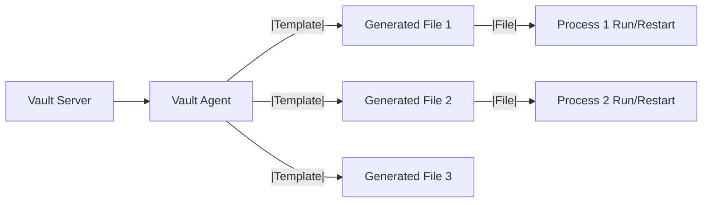
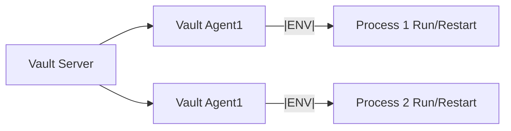
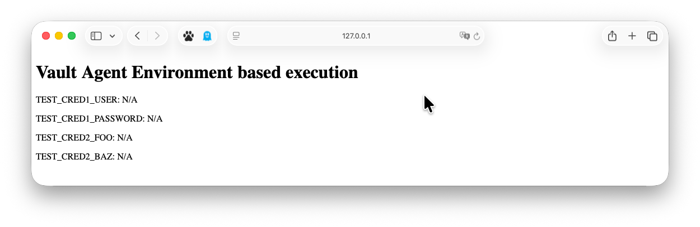
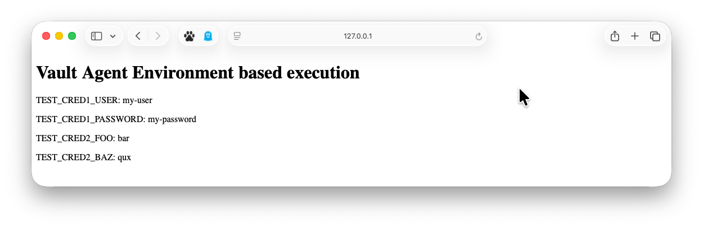
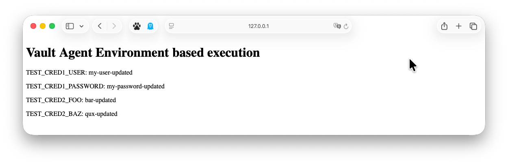

# Vault Agent - env exec

> 참고 URL : <https://developer.hashicorp.com/vault/tutorials/vault-agent/agent-env-vars>

## Vault Agent Template vs Environemnt based execution

기존 Vault Agent Template 방식은 단일 Vault Agent에서 다수의 Template을 관리하는 방식이였습니다.



Vault Agent Environment based execution 방식은 단일 Vault Agent에서 대상이되는 단일 Process에 대한 환경변수를 관리하는 방식입니다. 이 방식은 시크릿을 ENV로 전달하여 파일에 남기지 않고 시크릿을 프로그램에 전달하는 방식입니다.



## Demo

데모를 위한 파일 구조는 다음과 같습니다.

::: file-tree

- .vault-dev-token
- main.py
- vault-agent.hcl

:::

### 1. Vault Dev Server Run

```bash
vault server -dev -dev-root-token-id=root
```

### 2. Sample secret write

```bash
export VAULT_ADDR=http://127.0.0.1:8200
export VAULT_TOKEN=root
vault kv put secret/test-cred1 user=my-user password=my-password
vault kv put secret/test-cred2 foo=bar baz=qux
```

### 3. Sample Python Process

Sample Python Process는 다음과 같습니다.

```python title="main.py"
from flask import Flask
import os

app = Flask(__name__)

index_html = f"""
<!DOCTYPE html>
<html>
<head>
    <title>Vault Agent Environment based execution</title>
</head>
<body>
    <h1>Vault Agent Environment based execution</h1>
    <p>TEST_CRED1_USER: {os.getenv('TEST_CRED1_USER', 'N/A')}</p>
    <p>TEST_CRED1_PASSWORD: {os.getenv('TEST_CRED1_PASSWORD', 'N/A')}</p>
    <p>TEST_CRED2_FOO: {os.getenv('TEST_CRED2_FOO', 'N/A')}</p>
    <p>TEST_CRED2_BAZ: {os.getenv('TEST_CRED2_BAZ', 'N/A')}</p>
</body>
</html>
"""

@app.route('/')
def hello_world():
    return index_html

if __name__ == '__main__':
    app.run(debug=True)
```

환경변수 없이 실행하면, `N/A`가 출력됩니다.



### 4. Vault Agent Run

Vault Agent에서 사용할 인증 토큰 파일은 다음과 같습니다.

```bash title=".vault-dev-token"
root
```

Vault Agent 구성 파일은 다음과 같습니다.

```hcl title="vault-agent.hcl"
auto_auth {
   method {
      type = "token_file"

      config {
         token_file_path = "./.vault-dev-token"
      }
   }
}

template_config {
   static_secret_render_interval = "10s"
   exit_on_retry_failure         = true
}

vault {
   address = "http://127.0.0.1:8200"
}

env_template "TEST_CRED1_USER" {
   contents             = "{{ with secret \"secret/data/test-cred1\" }}{{ .Data.data.user }}{{ end }}"
   error_on_missing_key = true
}
env_template "TEST_CRED1_PASSWORD" {
   contents             = "{{ with secret \"secret/data/test-cred1\" }}{{ .Data.data.password }}{{ end }}"
   error_on_missing_key = true
}
env_template "TEST_CRED2_FOO" {
   contents             = "{{ with secret \"secret/data/test-cred2\" }}{{ .Data.data.foo }}{{ end }}"
   error_on_missing_key = true
}
  env_template "TEST_CRED2_BAZ" {
   contents             = "{{ with secret \"secret/data/test-cred2\" }}{{ .Data.data.baz }}{{ end }}"
   error_on_missing_key = true
}

exec {
   command                   = ["python3", "main.py"]
   restart_on_secret_changes = "always"
   restart_stop_signal       = "SIGTERM"
}
```

Vault Agent를 실행합니다.

```bash
vault agent -config=vault-agent.hcl
```

출력에서는 rendered 정보가 출력되며, 시크릿 엔진은 Static한 KV를 사용했으므로, `static_secret_render_interval` 값에 따라 주기적으로 rendered 정보가 출력됩니다.

```log title="vault agent output"
026-03-17T14:28:54.393+0900 [INFO]  agent: (runner) rendered "(dynamic)" => "TEST_CRED1_USER"
2026-03-17T14:28:54.394+0900 [INFO]  agent: (runner) rendered "(dynamic)" => "TEST_CRED1_PASSWORD"
2026-03-17T14:28:54.394+0900 [INFO]  agent: (runner) rendered "(dynamic)" => "TEST_CRED2_FOO"
2026-03-17T14:28:54.394+0900 [INFO]  agent: (runner) rendered "(dynamic)" => "TEST_CRED2_BAZ"
```

웹 브라우저에서 `http://127.0.0.1:5000` 에 접속하면, 환경변수를 확인할 수 있습니다.



::: warning 주의사항
`exec` 블록은 1개만 사용 할 수 있습니다. 여러 개의 프로세스를 실행하려면, 여러 개의 Vault Agent를 실행해야 합니다.

만약 둘 이상의 `exec` 블록이 선언되어있다면, 아래와 같은 에러가 발생합니다.

```log title="vault agent output"
error loading configuration from vault-agent.hcl: error parsing 'exec': at most one "exec" block is allowed
```
:::

### 5. Secret Update

시크릿을 업데이트합니다.

```bash
export VAULT_ADDR=http://127.0.0.1:8200
export VAULT_TOKEN=root
vault kv put secret/test-cred1 user=my-user-updated password=my-password-updated
vault kv put secret/test-cred2 foo=bar-updated baz=qux-updated
```

Vault Agent에서 변경된 시크릿이 감지되면, 해당 환경변수가 업데이트됩니다.

`restart_on_secret_changes` 설정 여부에 따라 프로세스가 재시작됩니다.



### 6. System check

Vault Agent로 실행된 Process의 환경변수를 확인하려면, `ps eww` 같이 e 플래그의 표시를 랩핑해서 확인할 수 있습니다.

```bash:no-line-numbers
> ps -ef | grep python3
[출력 없음]

> ps -ef | grep Python3
501 55740 54469   0  2:30오후 ttys012    0:00.16 /Library/Developer/CommandLineTools/Library/Frameworks/Python3.framework/Versions/3.9/Resources/Python.app/Contents/MacOS/Python main.py

> ps eww 55740
[프로세스 환경변수 출력]... TEST_CRED1_PASSWORD=my-password-updated TEST_CRED1_USER=my-user-updated TEST_CRED2_BAZ=qux-updated TEST_CRED2_FOO=bar-updated ...

> ps -ef | grep vault-agentps -ef | grep vault-agent
501 54469 51736   0  2:26오후 ttys012    0:00.69 vault agent -config=vault-agent.hcl

> env | grep TEST_
```

### 7. 활용 - Linux Systemd Service

Linux Systemd Service를 사용하여 Vault Agent를 실행할 수 있습니다.

```bash title="vault-agent.service"
[Unit]
Description=Vault Agent
After=network-online.target

[Service]
ExecStart=/usr/local/bin/vault agent -config=vault-agent.hcl
```
