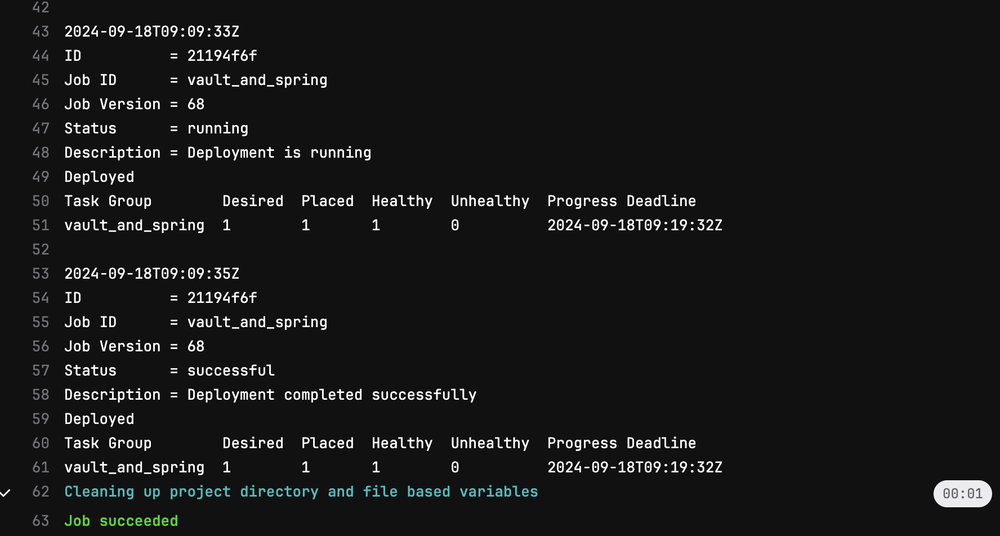
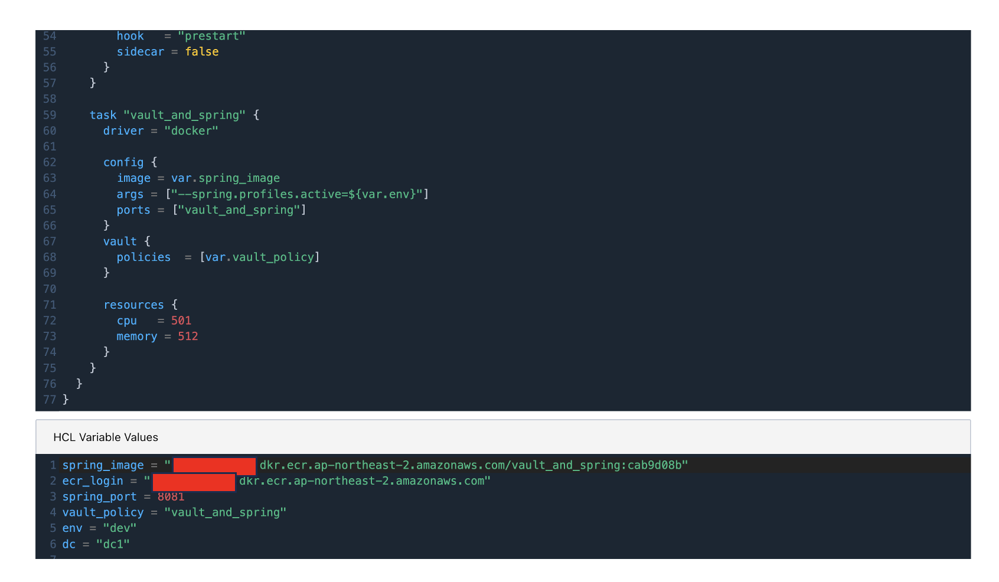

---
head:
  - - meta
    - name: Gitlab 파이프라인의 Secret을 Vault로 관리
      content: Gitlab CI, Vault, Nomad를 통한 DevSecOps 배포 파이프라인 구현
author : "unghee"      
tag: ["vault", "nomad", "gitlab", "gitlab-ci"]

---

# Gitlab 파이프라인의 Secret을 Vault로 관리

> Vault 설정 참고 링크: [Hashicorp 공홈](https://developer.hashicorp.com/well-architected-framework/security/security-cicd-vault)

> Nomad Vault 연동 참고 링크: [docmoa](https://docmoa.github.io/04-HashiCorp/07-Nomad/04-UseCase/spring-boot-with-vaultandNomad.html)

Application을 배포할때 우리는 **Application의 Secret**만 관리하는 것이 아닌, **CI또는 CD 단계에서 사용되는 Secret**의 정보 또한 우리가 관리하는 대상이 됩니다.

가령 그러한 정보들은 다음과 같습니다.
- kubernetes api 통신을 위한 **kubectl**
- Nomad Deploy에 필요한 role이 적용된 **Token**
- 다이렉트로 EC2에 배포하기 위한 **ssh pem**
- Argo-cd 배포를 위한 인증정보
- 그밖에 다양한 연동 tool의 인증, 인가정보

이러한 다양한 Secret은 Vault를 통해 **동적으로 관리**할 수 있으며, 동적인 Secret Engine이 제공되지 않는다면 KV Secret Engine을 통해서 **Static한 Data**를 저장해서 관리 할 수도 있습니다.

이번 파이프라인은 Vault에서 Nomad Token을 받아오기 위한 Secret Engine을 만들고 Gitlab CI에서 배포 시 Token을 생성하여 Application을 배포하는 과정을 테스트해보도록 하겠습니다.

1. Vault Secret Engine 설정
- Vault Secret Engine은 아래와 같이 설정했습니다.
```hcl:no-line-numbers
#Vault에서 제공하는 Nomad Secret Engine을 생성합니다.
resource "vault_nomad_secret_backend" "config" {
  backend                   = "nomad"
  description               = "mzc nomad-server description"
  default_lease_ttl_seconds = "360"
  max_lease_ttl_seconds     = "720"
  address                   = "https://${var.nomad_addr}"
  token                     = data.local_file.nomad_bootstrap.content
}

#해당 role에 대해서는 배포를 위해 management 권한으로 설정합니다.
resource "vault_nomad_secret_role" "nomad_role" {
  backend   = vault_nomad_secret_backend.config.backend
  role      = "nomad_role"
  global    = true
  type      = "management"
}
```

2. Vault gitlab jwt 연동
- Gitlab CI에서 Vault의 인증인가를 받기 위해 JWT 연동을 진행합니다.
  - 해당 auth의 role에 token policy는 1번에서 생성한 nomad secret engine의 접근 가능하게 설정합니다.

```hcl:no-line-numbers
resource "vault_jwt_auth_backend" "gitlab" {
  description = "JWT Auth for GitLab"  
  path               = "gitlab-jwt"
  oidc_discovery_url = "https://gitlab-url.url"
  bound_issuer       = "https://gitlab-url.url"  
}

resource "vault_policy" "nomad_mgmt" {
  name = "nomad-mgmt"

  policy = <<EOT
path "nomad/creds/nomad_role" {
  capabilities = ["read","create"]
}
path "nomad/creds/nomad_role/*" {
  capabilities = ["read","create"]
}
EOT
}

#제 환경의 gitlab repository(project)의 id가 5입니다.
resource "vault_jwt_auth_backend_role" "gitlab_role" {
  backend            = vault_jwt_auth_backend.gitlab.path
  role_name          = "gitlab-role"
  role_type          = "jwt"
  bound_audiences    = ["https://gitlab-url.url"]
  user_claim         = "user_email"
  token_policies     = [vault_policy.nomad_mgmt.name]
  bound_claims = {
    project_id = "5",
    ref = "main",
    ref_type = "branch"
  }  
}
```

3. Gitlab-CI 설정
- .gitlab-ci.yml 파일입니다.
  - 파이프라인 전체는 아니며 Gitlab ci에서 Vault의 인증인가를 받고 Nomad Token을 활용하는 CD 단계로 보시면 됩니다.
  - bound_audiences에 기입 한 값 기준으로 체크 후 임시 Token을 발급받습니다.
  - jwt Token을 기반으로 미리 연동해 둔 gitlab-role에 대한 token을 받아옵니다.
  - gitlab-role token을 활용하여 Nomad token을 다음 stage로 넘겨줍니다.

```yaml:no-line-numbers
---
vault-integrate:
  stage: vault_token_inject
  image: hashicorp/vault:latest  
  id_tokens:
    VAULT_AUTH_TOKEN:
      #bound_audiences에 기입 한 값 기준으로 체크 후 임시 Token을 발급받습니다.
      #물론 bound_claims에 있는 값도 일치해야 합니다.
      aud: https://gitlab-url.url
  script: |
    export VAULT_ADDR=https://$VAULT_URL:8200
    export VAULT_NAMESPACE=admin
    #jwt Token을 기반으로 미리 연동해 둔 gitlab-role에 대한 token을 받아옵니다.
    export VAULT_TOKEN="$(vault write -field=token auth/gitlab-jwt/login role=gitlab-role jwt=$VAULT_AUTH_TOKEN)"
    export NOMAD_DEPLOY_TOKEN="$(vault read -field=secret_id nomad/creds/nomad_role)"

    echo "export NOMAD_TOKEN=$NOMAD_DEPLOY_TOKEN" > nomad.token
  #nomad deploy에 필요한 token 전달  
  artifacts:
    paths:
      - nomad.token    
  tags:
    - dpt-runner-1       

nomad-run-job:      
  stage: deploy  
  #environment: production
  image: registry.gitlab.com/internetarchive/nomad/master
  script: |
    source nomad.token

    cd nomad_job
    chmod +x ./nomad
    cat <<EOF > dev.env
    spring_image = "$ecr_url:$CI_COMMIT_SHORT_SHA"
    ecr_login = "$ecr_login"
    spring_port = 8081
    vault_policy = "vault_and_spring"
    env = "dev"
    dc = "dc1"
    EOF
    
    export NOMAD_ADDR=https://$Nomad_URL:4646
    #export NOMAD_TOKEN=$NOMAD_TOKEN
    ./nomad run -var-file="dev.env" vault_spring.nomad 
  tags:
    - dpt-runner-1    
```

4. 결과 확인
- pipe line은 성공적으로 완료되었습니다.


- Nomad에서도 배포가 완료되었습니다.


5. 마치며

Nomad에서도 Terraform과 마찬가지로 변수를 사용할 수 있으며, 이를 통해 보안 값을 관리할 수 있습니다. 하지만, Secret는 가능한 한 최소한으로 노출해야 하며, 이를 위한 인증과 인가 과정이 명확하고 논리적으로 설정되어야 합니다.

이러한 환경에서 Vault를 사용하면 Secret에 대한 노출을 줄이고, 안전한 방식으로 인증 및 인가 과정을 처리할 수 있습니다. Vault를 통해 Secret을 안전하게 저장하고 관리하면서도, Nomad와 Terraform 같은 도구에서 이를 동적으로 불러오는 구조는 보안성과 유연성을 동시에 제공합니다.

DevSecOps의 세계는 복잡하고 넓지만, Vault와 같은 솔루션을 활용하면 구축 과정이 더 효율적이고 안전한 파이프라인을 제공할 수 있습니다. 이로 인해 전체 시스템의 보안이 강화되면서도 관리가 용이해지며, 조직의 보안 표준을 유지하면서 DevOps 파이프라인을 최적화할 수 있습니다.