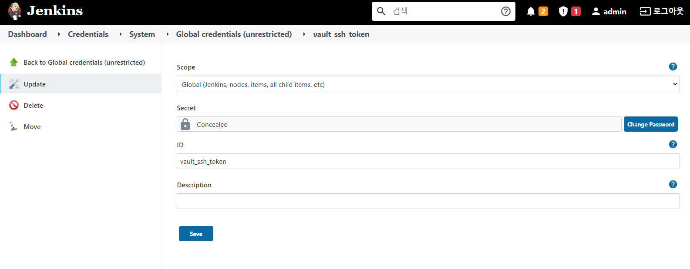

---
meta:
  - name: description
    content: Vault를 활용하여 jenkins에 ssh(otp) 활용
tags: ["vault", "jenkins", "otp", "token"]
---
# jenkins with vault otp
jenkins와 vault otp를 연동하여 pipe line에서 ssh/scp test

## otp 설정은 docmoa의 ssh-otp 참고
- [OTP 설정 링크](/04-HashiCorp/06-Vault/02-Secret_Engine/ssh-otp-redhat.html)

## vault token 설정
```bash
# ssh 권한을 사용 할 policy 생성
$ tee ssh-policy.hcl <<EOF
# To list SSH secrets paths
path "ssh/*" {
  capabilities = [ "list" ]
}
# To use the configured SSH secrets engine otp_key_role role
path "ssh/creds/otp_key_role" {
  capabilities = ["create", "read", "update"]
}
EOF

#ssh(otp) 정책 생성
$ vault policy write ssh ssh-policy.hcl

#rest api에서 사용 할 token 생성
$ vault token create -policy=ssh
```

## otp token을 활용하여 jenkins credentials 생성


## otp를 사용한 ssh, scp pipe line
``` bash
// jenkins pipe line v1
pipeline {
    agent any
    environment {
      // 위에서 생성한 credential id
      ssh_token = credentials('vault_ssh_token')
    }
    options {
        buildDiscarder(logRotator(numToKeepStr: '20'))
        disableConcurrentBuilds()
    }
    stages{   
      stage('SSH') {
          steps{
            // 1. curl로 받아 온 password를 변수에 담음
            // 2. ssh에 자동으로 패스워드를 입력하기 위해 sshpass 명령어 추가 사용 
            // -o StrictHostKeyChecking=no는 최초 로그인에 known_hosts에 등록하는 문구 무시
            // scp도 동일하게 사용 가능
            // 주의할점은 다음라인은 jenkins 서버로 돌아온다.
            sh '''
            ssh_passwd=$(curl --header "X-Vault-Token: $ssh_token" --request POST --data '{"ip": "172.21.2.56"}' http://172.21.2.50:8200/v1/ssh/creds/otp_key_role  | jq ".data.key" | tr -d '""')
            sshpass -p $ssh_passwd ssh ubuntu@172.21.2.56 -o StrictHostKeyChecking=no "cd /usr/local \
            && ls -la \
            && pwd"

            ssh_passwd=$(curl --header "X-Vault-Token: $ssh_token" --request POST --data '{"ip": "172.21.2.56"}' http://172.21.2.50:8200/v1/ssh/creds/otp_key_role  | jq ".data.key" | tr -d '""')
            sshpass -p $ssh_passwd scp -o StrictHostKeyChecking=no ~/a ubuntu@172.21.2.56:~/test 
            '''
          }
      }
    }
}
```