# JupyterHub 와 Vault 통합인증

JypyterHub는 사용자에게 개별 Jupyter Notebook을 제공하는 도구입니다. 기존에는 사용자마다 개별적으로 Jypyter Notebook을 설치하고 관리하는 방식이였지만 JupyterHub를 사용하면 사용자 별로 개별적인 환경을 제공할 수 있습니다. 또한 JupyterHub는 사용자 인증을 위해 다양한 방법을 제공합니다. 그 중 하나가 OIDC(OpenID Connect)를 사용하는 방법입니다. OIDC는 인증 정보를 외부 인증 서버에서 가져오는 방식으로, 사용자 인증을 위한 표준 프로토콜입니다.

여기서는 Vault의 계정 관리와 시크릿 소비자를 하나의 Identity Provider(IdP) 로 관리하는 방법을 설명합니다. 이를 위해서는 사용자가 인증을 받고 나서 받은 Vault Token을 사용하여 JupyterHub에서 사용자 인증을 처리하는 방식으로 처리해야 합니다.

## 1. Jupyter notebook에서 Vault OIDC 인증

기존에는 Jupyter Notebook에서 Vault의 시크릿을 가져오기 위해서는 Hvac 라이브러리를 사용하여 인증을 처리하는 방식으로 손쉽게 시크릿을 사용할 수 있었습니다. 예를들어 아래와 같이 kerberos 인증에 필요한 시크릿 정보를 Vault로 부터 가져오는 방식은 사용자가 개별적으로 Python 코드 방식으로 Vault로부터 시크릿을 가져오는 방식으로 손쉽게 시크릿을 사용할 수 있었습니다. 특히 Vault의 `Auth Method`가 OIDC인 경우 Vault에 인증하는 방식을 통합하여 관리하고, Jupyter Notebook에서도 Vault의 OIDC 방식으로 로그인 처리 시 로그인 팝업을 통해 인증 후 Vault Token을 받고 이후 시크릿을 가져오는 동작을 처리할 수 있었습니다.

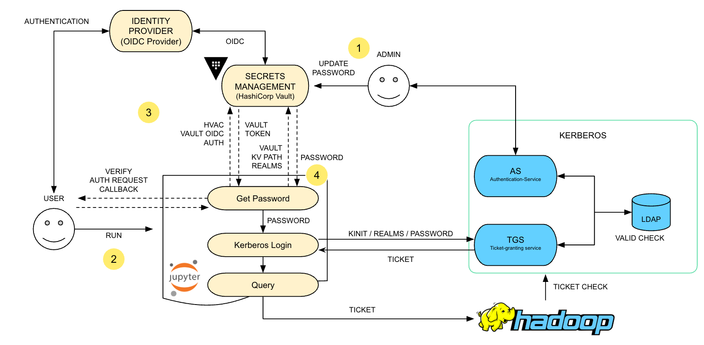

```python
import webbrowser
import http.server
import hvac
import urllib.parse

# CHANGEME: these params might have to be changed to match your Vault configuration.
# Specifically
# 1. auth/oidc/role/XXX allowed_redirect_uris must contain the
#    OIDC_REDIRECT_URI string used below.
# 2. Role must match your environment's role for this client.
OIDC_CALLBACK_PORT = 8250
OIDC_REDIRECT_URI = f'http://localhost:{OIDC_CALLBACK_PORT}/oidc/callback'
ROLE = 'default' # Use None (not empty string) for the default Role
SELF_CLOSING_PAGE = '''
<!doctype html>
<html>
<head>
<script>
// Closes IE, Edge, Chrome, Brave
window.onload = function load() {
  window.open('', '_self', '');
  window.close();
};
</script>
</head>
<body>
  <p>Authentication successful, you can close the browser now.</p>
  <script>
    // Needed for Firefox security
    setTimeout(function() {
          window.close()
    }, 5000);
  </script>
</body>
</html>
'''

def main():
    client = hvac.Client(
        url="https://vault-server:8200",
        namespace="admin"
    )

    auth_url_response = client.auth.oidc.oidc_authorization_url_request(
        role=ROLE,
        redirect_uri=OIDC_REDIRECT_URI,
    )
    auth_url = auth_url_response['data']['auth_url']
    if auth_url == '':
        return None # TODO: throw a nicer error

    params = urllib.parse.parse_qs(auth_url.split('?')[1])
    auth_url_nonce = params['nonce'][0]
    auth_url_state = params['state'][0]

    webbrowser.open(auth_url)
    token = login_oidc_get_token()

    auth_result = client.auth.oidc.oidc_callback(
        code=token,
        path='oidc',
        nonce=auth_url_nonce,
        state=auth_url_state,
    )
    new_token = auth_result['auth']['client_token']
    print(f'Client token returned: {new_token}')

    # If you want to continue using the client here
    # update the client to use the new token
    client.token = new_token
    return client

# handles the callback
def login_oidc_get_token():
    from http.server import BaseHTTPRequestHandler, HTTPServer

    class HttpServ(HTTPServer):
        def __init__(self, *args, **kwargs):
            HTTPServer.__init__(self, *args, **kwargs)
            self.token = None

    class AuthHandler(BaseHTTPRequestHandler):
        token = ''

        def do_GET(self):
            params = urllib.parse.parse_qs(self.path.split('?')[1])
            self.server.token = params['code'][0]
            self.send_response(200)
            self.end_headers()
            self.wfile.write(str.encode(SELF_CLOSING_PAGE))

    server_address = ('', OIDC_CALLBACK_PORT)
    httpd = HttpServ(server_address, AuthHandler)
    httpd.handle_request()
    return httpd.token

if __name__ == '__main__':
    client = main()
    if client and client.is_authenticated():
        secret_version_response = client.secrets.kv.v2.read_secret_version(
            mount_point ='my_kv',
            path='docker',
        )
        print('Latest version of secret under path "docker" contains the following keys: {data}'.format(
            data=secret_version_response['data']['data']['DOCKER_USER'],
        ))
        pass
```

<VidStack
  src="youtube.com/dm3xZgVnl8g"
  title="YouTube video player"
/>

## 2. Jupyter Hub에서 Vault OIDC 인증

> Demo 코드 참고: [jupyterhub-vault-demo - Keycloak 구성](https://github.com/Great-Stone/jupyterhub-vault-demo)

JupyterHub는 사용자 인증을 위해 다양한 방법을 제공합니다. 그 중 하나가 OIDC(OpenID Connect)를 사용하는 방법입니다. OIDC는 인증 정보를 외부 인증 서버에서 가져오는 방식으로, 사용자 인증을 위한 표준 프로토콜입니다.

JupyterHub에서 사용자가 받는 Jupyter notebook에서 앞서 설명한 방식으로 OIDC를 사용하여 Vault의 OIDC로 인증을 받고자 하는 경우에는 Popup 처리가 불가능하여 OIDC 인증 단계로 넘어갈 수가 없습니다. 따라서 JupyterHub를 사용하는 경우 사용자가 인증을 받고 나서 받은 Vault Token을 사용하여 JupyterHub에서 사용자 인증을 처리하는 방식으로 처리해야 합니다.

::: tip 왜 Kuberetes와 Vault를 통합하지 않았나?
예제에서 JupyterHub는 Kubernetes 환경에 배포됩니다. 일반적으로 Kubernetes 환경에서 Vault 연계 시 Service Account를 사용하여 인증합니다. 하지만 JupyterHub에서 사용자는 개별적으로 인증을 받아야 하며, 이경우 Service Account를 사용하는 것이 아니라 사용자가 인증을 받아야 합니다. 이를 위해서는 IdP를 사용하여 사용자 인증을 처리해야 합니다.
:::

Demo 환경을 참고하여 설명합니다.

- Keycloak (tested 26.2.5)
- JupyterHub (tested helm chart4.2.0 - hub 5.3.0)
- Minikube (tested 1.36.0)
- Vault (tested 1.20.0)
- Terraform (tested 1.12.2)

### IdP 구성

여기서는 IdP(Identity Provider)로 Keycloak을 사용합니다. Keycloak은 오픈소스 인증 및 권한 부여 플랫폼으로, OIDC(OpenID Connect) 및 OAuth2.0을 지원합니다.
아래는 [jupyterhub-vault-demo](https://github.com/Great-Stone/jupyterhub-vault-demo) 저장소에서 사용한 Keycloak의 주요 구성 내용입니다.

#### Keycloak 주요 설정

- **Realm 생성**:  
  - "HashiCorp"라는 이름의 Realm을 생성합니다.
  - 토큰 수명(Token lifespan)은 1시간으로 설정합니다.

- **사용자(User) 생성**:  
  - `reader` 사용자 (비밀번호: reader) - 읽기 전용 권한  
  - `management` 사용자 (비밀번호: management) - 관리 권한

- **역할(Role) 생성**:  
  - `reader` 역할: 읽기 전용 권한  
  - `management` 역할: 관리 권한 (reader 역할 포함)

- **OIDC 클라이언트 생성**:  
  - `vault-oidc`라는 이름의 OIDC 클라이언트를 생성하여 Vault와 JupyterHub 인증 연동에 사용합니다.
  - 클라이언트 설정에서 `redirect_uri`로 JupyterHub와 Vault에서 사용하는 콜백 URL을 등록합니다.

- **프로토콜 매퍼(Protocol Mapper) 설정**:  
  - JWT 토큰에 사용자명(`preferred_username`), 역할 정보(`resource_access`), 이메일 등 필요한 정보를 포함하도록 매퍼를 추가합니다.

#### Keycloak 실행 방법

1. [Keycloak 공식 사이트](https://www.keycloak.org/downloads)에서 Keycloak을 다운로드합니다.
2. Java 21 이상이 설치된 환경에서 압축을 해제한 후, `bin` 디렉토리에서 아래 명령어로 실행합니다.
   ```bash
   export KC_BOOTSTRAP_ADMIN_USERNAME="admin"
   export KC_BOOTSTRAP_ADMIN_PASSWORD="password"
   ./kc.sh start-dev
   ```
3. 브라우저에서 `http://localhost:8080`에 접속하여 관리자로 로그인 후 위의 설정을 진행합니다.

#### 참고

- Keycloak의 Realm, 사용자, 역할, 클라이언트, 매퍼 등은 Terraform을 통해 자동으로 구성할 수도 있습니다.
- 자세한 예제 및 자동화 코드는 [jupyterhub-vault-demo/terraform](https://github.com/Great-Stone/jupyterhub-vault-demo/tree/main/terraform) 디렉토리에서 확인할 수 있습니다.

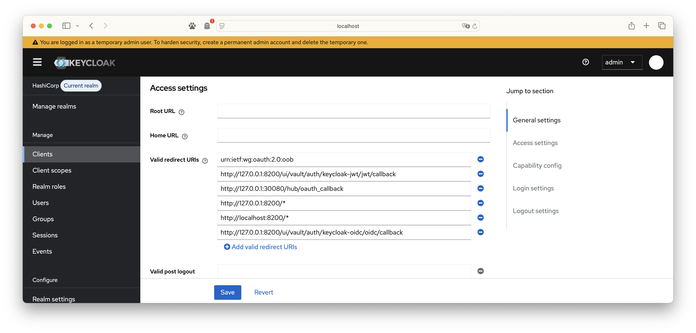

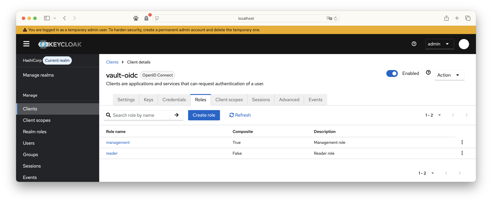

### Vault의 OIDC 및 JWT 인증

Vault의 OIDC 인증은 사용자가 Keycloak에서 인증을 받고 나서 받은 JWT 토큰을 사용하여 Vault에 인증을 처리하는 방식으로 처리합니다. Vault에 인증하기위해 Keycloak의 OIDC 인증을 사용하기도 하지만, 동일한 OIDC를 사용하는 타 애플리케이션과의 연계를 위해 JWT 토큰을 사용하는 방식으로도 처리할 수 있습니다.

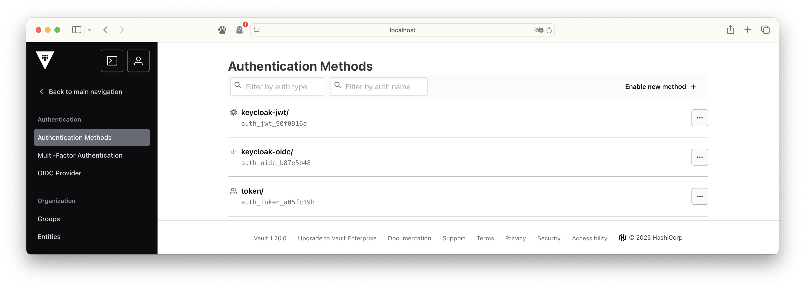

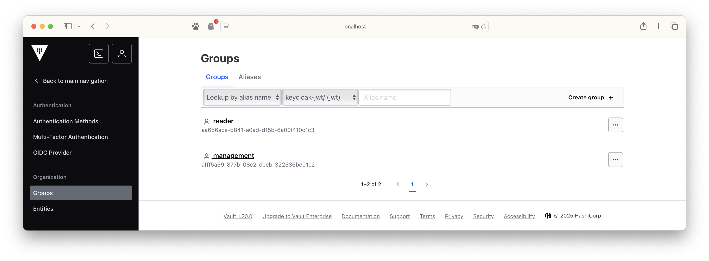

### Jupyter Hub와 OIDC 인증

JupyterHub는 사용자 인증을 위해 다양한 방법을 제공합니다. 그 중 하나가 OIDC(OpenID Connect)를 사용하는 방법입니다. OIDC는 인증 정보를 외부 인증 서버에서 가져오는 방식으로, 사용자 인증을 위한 표준 프로토콜입니다.

다음은 예제에서 사용된 JupyterHub 설치를 위한 helm chart 설정 내용입니다.

- OIDC 인증을 위한 설정
  - hub.config.JupyterHub.authenticator_class: 인증 클래스 설정
  - hub.config.JupyterHub.admin_access: 관리자 권한 설정
  - hub.config.JupyterHub.admin_users: 관리자 사용자 설정
  - hub.config.GenericOAuthenticator.client_id: 클라이언트 ID 설정
  - hub.config.GenericOAuthenticator.client_secret: 클라이언트 시크릿 설정

- JWT 토큰을 받기위해 필요한 설정
  - hub.config.CryptKeeper.keys: JWT 토큰을 받기위해 필요한 암호화 키 설정
  - hub.config.Authenticator.enable_auth_state: JWT 토큰을 받기위해 필요한 설정

- JWT 토큰을 받고 Notebook에서 사용하기 위한 설정
  - hub.config.my-config.py: JWT 토큰을 받고 Notebook에서 사용하기 위한 설정
  - hub.config.db: 데이터베이스 설정
  - hub.config.singleuser: 사용자 설정
  - hub.config.proxy: 프록시 설정

- JupyterHub spawner에서 전달한 값을 사용자 별 Notebook에서 사용하기 위한 설정
  - singleuser.extraEnv: 사용자 별 Notebook에서 사용하기 위한 설정
  - singleuser.lifecycleHooks.postStart: 사용자 별 Notebook에서 사용하기 위한 설정

```yaml
hub:
  config:
    # JWT 토큰을 받기위해 필요한 암호화 키 설정
    CryptKeeper:
      keys:
        - ${crypt_keeper_key}
    # JWT 토큰을 받기위해 필요한 설정
    Authenticator:
      enable_auth_state: true
    JupyterHub:
      authenticator_class: "oauthenticator.generic.GenericOAuthenticator"
      admin_access: true
      admin_users:
        - management
    GenericOAuthenticator:
      client_id: "${client_id}"
      client_secret: "${client_secret}"
      oauth_callback_url: "${callback_url}"
      authorize_url: "${authorize_url}"
      token_url: "${token_url}"
      userdata_url: "${userdata_url}"
      scope:
        - openid
        - email
        - profile
      username_key: "preferred_username"
      userdata_params:
        state: state
      login_service: "Keycloak"
  extraConfig:
    my-config.py: |
      import jwt, time, json, urllib.request, os, base64
      async def pass_oidc_token(spawner):
          auth_state = await spawner.user.get_auth_state()
          if not auth_state:
              spawner.log.info("auth_state is None!")
              return
          id_token = auth_state.get('id_token')
          if id_token:
              try:
                  payload = jwt.decode(id_token, options={"verify_signature": False})
                  now = int(time.time())
                  if payload.get("exp", 0) < now:
                      spawner.log.error("OIDC token expired, forcing re-login")
                      from tornado import web
                      raise web.HTTPError(401, "OIDC token expired")
              except Exception as e:
                  spawner.log.error(f"Token decode error: {e}")
          # vault-test-jwt-login.py 에서 사용할 JWT Token을 여기서 입력 받는다.        
          spawner.environment['VAULT_OIDC_TOKEN'] = id_token

          # 1. Vault JWT 로그인 (POST /v1/auth/keycloak-jwt/login)
          vault_addr = "http://host.minikube.internal:8200"
          vault_role = "default"
          login_url = f"{vault_addr}/v1/auth/keycloak-jwt/login"
          login_data = json.dumps({
              "role": vault_role,
              "jwt": id_token
          }).encode("utf-8")
          req = urllib.request.Request(login_url, data=login_data, headers={"Content-Type": "application/json"})
          with urllib.request.urlopen(req) as resp:
              login_response = json.loads(resp.read().decode())
          client_token = login_response["auth"]["client_token"]

          # 2. Vault KV2 시크릿 읽기 (GET /v1/notebook-secret-kv-v2/data/test)
          secret_url = f"{vault_addr}/v1/notebook-secret-kv-v2/data/test"
          req2 = urllib.request.Request(secret_url, headers={"X-Vault-Token": client_token})
          with urllib.request.urlopen(req2) as resp2:
              secret_response = json.loads(resp2.read().decode())
          secret = secret_response['data']['data']['data']
          
          # 시크릿을 파일로 저장하고 환경변수로 전달
          try:
              secret_file_path = "/tmp/vault_secret_file.txt"
              with open(secret_file_path, "w", encoding='utf-8') as f:
                  f.write(str(secret))
              spawner.environment['VAULT_SECRET_FILE'] = secret_file_path
              spawner.environment['MY_SECRET'] = str(secret)
              spawner.log.info(f"Secret saved to: {secret_file_path}")
          except Exception as e:
              spawner.log.error(f"Error saving secret: {e}")
              spawner.environment['MY_SECRET'] = str(secret)
      c.KubeSpawner.pre_spawn_hook = pass_oidc_token
  db:
    type: sqlite-memory

singleuser:
  storage:
    type: none
  extraEnv:
    # .Values에서 Hub에서 전달받은 환경변수를 notebook 환경변수로 받아오기
    JUPYTER_ENABLE_LAB: "yes"
    MY_SECRET: "{{ .Values.singleuser.extraEnv.MY_SECRET | default \"\" }}"
    VAULT_SECRET_FILE: "{{ .Values.singleuser.extraEnv.VAULT_SECRET_FILE | default \"\" }}"
  lifecycleHooks:
    postStart:
      exec:
        command:
          - "sh"
          - "-c"
          - |
            pip install hvac PyJWT
            echo $MY_SECRET | base64 -d > $VAULT_SECRET_FILE

proxy:
  service:
    type: NodePort
    nodePorts:
      http: 30080

```

JupyterHub가 설치되면 port-forward를 통해 접속할 수 있습니다.

```bash
kubectl port-forward svc/proxy-public 30080:80 -n default
```

<http://127.0.0.1:30080> 에 접속하면 JupyterHub의 로그인 화면이 나타납니다.

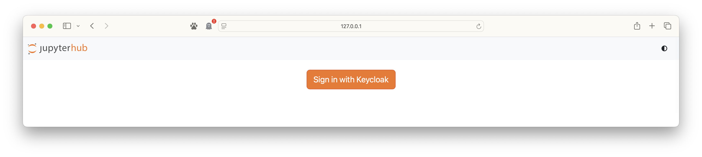

Keycloak의 로그인 화면이 나타납니다.

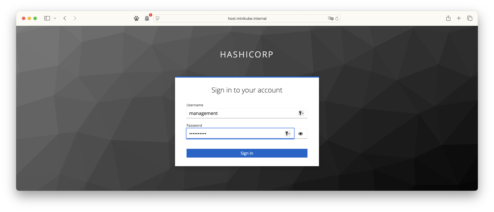

로그인이 성공하면 Jupyter Notebook 서버를 실행할 버튼이 확인됩니다.

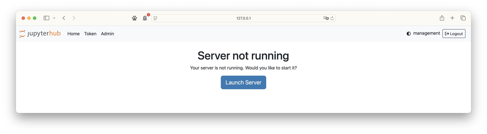

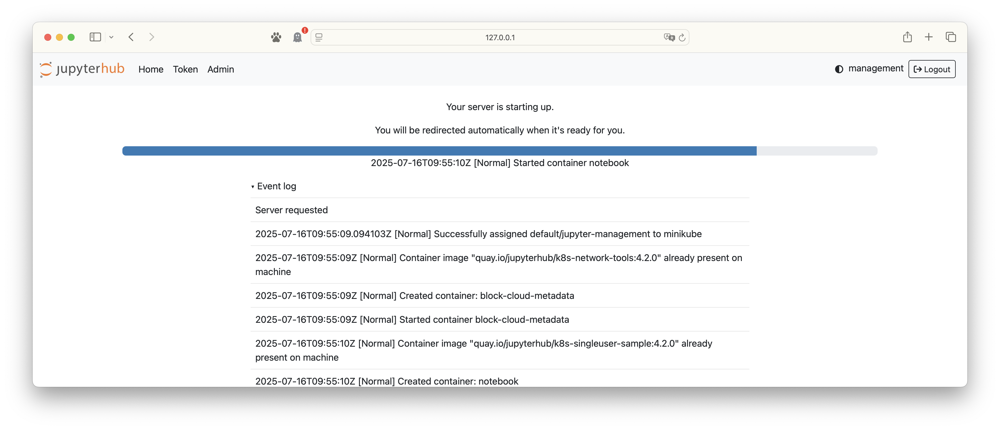

Jupyter Notebook이 정상적으로 실행되면 Pod 목록에서 실행된 Jupyter Notebook 서버를 확인할 수 있습니다. 예제에서는 `management` 사용자로 실행하였으므로 `notebook-management`이름으로 Pod가 실행됩니다.

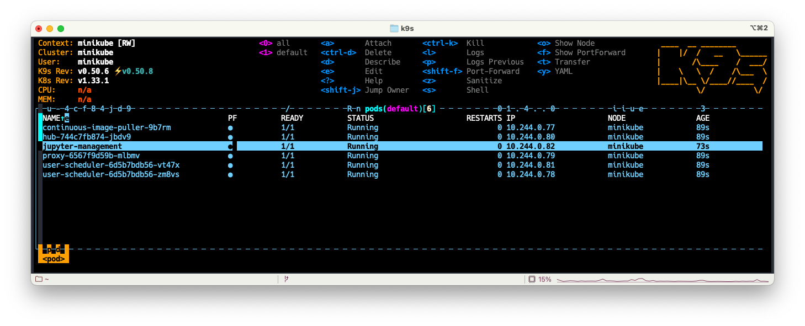

## 3. Notebook 에서 Vault의 시크릿 가져오기

예제에서는 총 3가지 방식으로 Vault의 시크릿을 가져오는 방법을 설명합니다.

- OIDC 로그인 후 JWT 토큰을 활용하여 Vault에 인증
- JupyterHub에서 Vault에 JWT로 로그인 하여 시크릿 데이터를 Notebook에 전달
- OIDC 팝업이 불가능하여 개발용으로 제공되는 OOB 사용

### 3.1 OIDC 로그인 후 JWT 토큰을 활용하여 Vault에 인증

OIDC 로그인 후 JWT 토큰을 활용하여 Vault에 인증하는 방식은 아래와 같은 순서로 진행됩니다.

1. 사용자가 JupyterHub에 접속하고 로그인을 시도합니다.
2. JupyterHub는 Keycloak에 OIDC 인증 요청을 보냅니다.
3. Keycloak은 사용자가 로그인한 정보를 확인하고 JWT 토큰을 발급합니다.
4. JupyterHub는 발급된 JWT 토큰을 환경변수 등으로 전달합니다.

이 방식의 장점은 사용자가 인증을 받고 나서 받은 JWT 토큰을 활용하여 Vault에 인증을 처리하는 방식으로 처리할 수 있습니다. 또한 사용자가 인증을 받고 나서 받은 JWT 토큰을 활용하여 Vault에 인증을 처리하는 방식으로 처리할 수 있습니다. 하지만 JWT 토큰은 만료 시간이 있으므로 만료 시간이 지나면 인증을 다시 받아야 합니다.

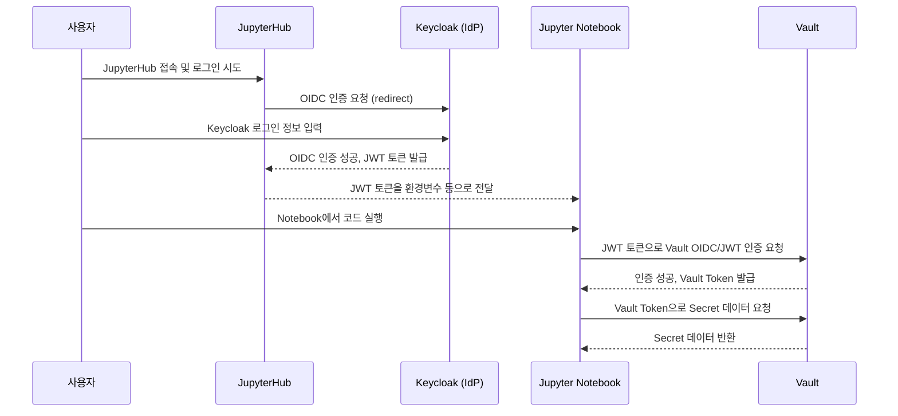

```python
import os, jwt, time, datetime, requests
import hvac

def get_latest_jwt():
    hub_api_url = "http://hub:8081/hub/user/token"
    api_token = os.environ.get("JUPYTERHUB_API_TOKEN")
    headers = {"Authorization": f"token {api_token}"}
    resp = requests.get(hub_api_url, headers=headers)
    if resp.status_code == 200:
        try:
            return resp.json().get("id_token")
        except Exception as e:
            print("❌ 응답을 JSON으로 파싱하지 못했습니다:", str(e))
            print("응답 내용:", resp.text)
            return None
    else:
        print(f"❌ 최신 JWT 토큰을 받아오지 못했습니다. (status: {resp.status_code})")
        print("응답 내용:", resp.text)
        return None

def check_and_use_jwt(token):
    payload = jwt.decode(token, options={"verify_signature": False})
    exp = payload.get("exp")
    now = int(time.time())
    remain = exp - now
    print("JWT 만료까지 남은 시간:", remain, "초")
    # 이미 만료
    if remain <= 0:
        print("❌ JWT 토큰이 만료되었습니다. JupyterHub에서 다시 로그인 후 서버를 재시작하세요.")
        from IPython.display import display, HTML
        display(HTML("""
            <div style="color:red;font-weight:bold;">
                ⚠️ JWT 토큰이 만료되었습니다.<br>
                <a href="/hub/home" target="_blank">여기를 클릭해 <b>노트북 서버(컨테이너)를 재시작</b>하세요!
            </div>
        """))
        return None
    # 10분 이하 남음
    elif remain <= 600:
        print("⚠️ JWT 토큰이 10분 이내로 곧 만료됩니다. 최신 토큰을 받아옵니다.")
        token_new = get_latest_jwt()
        if not token_new:
            print("재로그인 필요! JupyterHub에서 서버를 재시작하세요.")
            from IPython.display import display, HTML
            display(HTML("""
                <div style="color:red;font-weight:bold;">
                    ⚠️ JWT 토큰을 갱신할 수 없습니다.<br>
                    <a href="/hub/home" target="_blank">여기를 클릭해 <b>노트북 서버(컨테이너)를 재시작</b>하세요!
                </div>
            """))
            return None
        payload = jwt.decode(token_new, options={"verify_signature": False})
        print("최신 JWT payload:", payload)
        return token_new
    else:
        print("JWT 토큰이 충분히 남아 있습니다.")
        print("JWT payload:", payload)
        return token

token = os.environ.get("VAULT_OIDC_TOKEN")
token = check_and_use_jwt(token)
if not token:
    exit()  # 더 이상 진행하지 않음

print("JWT Token:", token[:30], "...")  # 토큰 일부만 출력

vault_addr = "http://host.minikube.internal:8200"
vault_role = "default"

client = hvac.Client(url=vault_addr)
login_response = client.auth.jwt.jwt_login(
    role=vault_role,
    jwt=token,
    path="keycloak-jwt"  # Vault에서 설정한 OIDC Auth Backend 경로
)

# Vault 클라이언트에 토큰 설정
client.token = login_response['auth']['client_token']
print("Vault client_token:", client.token)

# KV v2 시크릿 엔진에서 데이터 읽기
try:
    secret_response = client.secrets.kv.v2.read_secret_version(
        path='test',
        mount_point='notebook-secret-kv-v2',
        raise_on_deleted_version=True  # 경고 메시지 제거 
    )
    print("✅ 시크릿 데이터 조회 성공!")
    print("시크릿 데이터:", secret_response['data']['data'])
    print("메타데이터:")
    print("  - 생성 시간:", secret_response['data']['metadata']['created_time'])
    print("  - 버전:", secret_response['data']['metadata']['version'])
except Exception as e:
    print("❌ 시크릿 데이터 조회 실패:", str(e))
    print("현재 사용자가 management 권한을 가지고 있는지 확인하세요.")
```

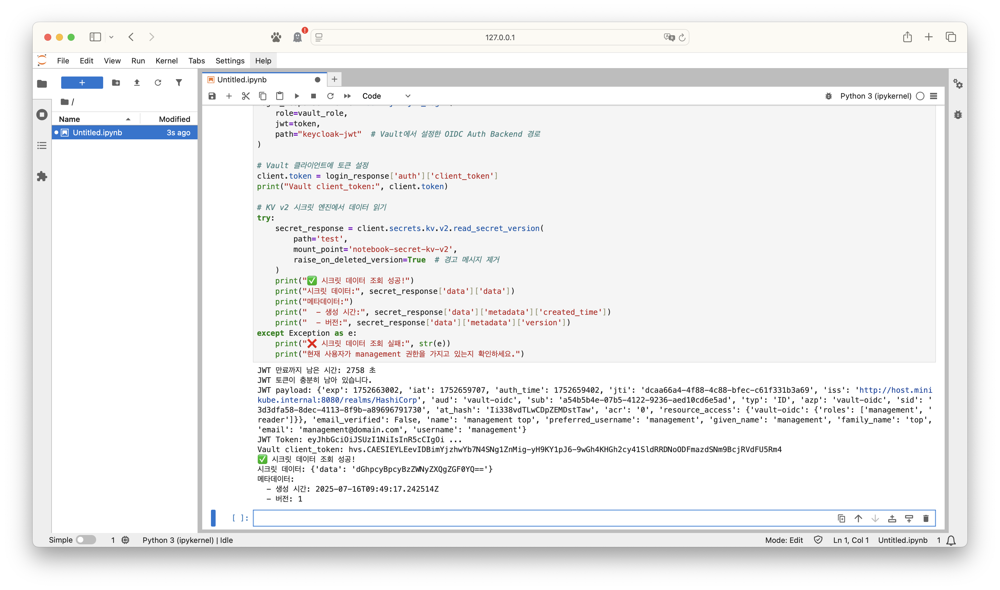

### 3.2 JupyterHub에서 Vault에 JWT로 로그인 하여 시크릿 데이터를 Notebook에 전달

JupyterHub에서 Vault에 JWT로 로그인 하여 시크릿 데이터를 Notebook에 전달하는 방식은 아래와 같은 순서로 진행됩니다.

1. 사용자가 JupyterHub에 접속하고 로그인을 시도합니다.
2. JupyterHub는 Keycloak에 OIDC 인증 요청을 보냅니다.
3. Keycloak은 사용자가 로그인한 정보를 확인하고 JWT 토큰을 발급합니다.
4. JupyterHub는 발급된 JWT 토큰을 사용하여 Vault에 인증을 요청합니다.
5. Vault는 인증을 처리하고 시크릿 데이터를 반환합니다.
6. JupyterHub는 반환된 시크릿 데이터를 Notebook에 전달합니다.

이 방식의 장점은 사용자가 Vault에 대한 존재를 모르고, 필요한 시크릿을 관리자 측면에서 제공할 수 있습니다.

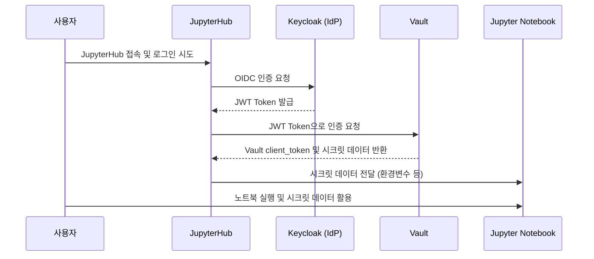

```python
import os

secret = os.environ.get("MY_SECRET")
print(secret)

file_path = os.environ.get("VAULT_SECRET_FILE")
print(file_path)

with open(file_path, "rb") as file:
    file_content = file.read()
    print(file_content)  # 출력 시 주의: 바이너리 데이터이므로 이진값이 출력됨
```

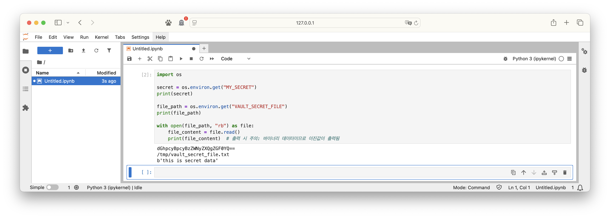

### 3.3 OIDC 팝업이 불가능하여 개발용으로 제공되는 OOB 사용

Jupyter Notebook에서 하듯, 사용자가 JupyterHub와 관계 없이 Vault에 OIDC 인증을 받고 나서 받은 JWT 토큰을 활용하여 Vault에 인증을 처리하는 방식으로 처리할 수 있습니다. 이경우 팝업이 불가능하므로 `urn:ietf:wg:oauth:2.0:oob`를 사용하여 인증을 처리할 수 있습니다.

::: tip OOB 인증 방식

OOB(Out-Of-Band) 인증 방식은 인증 팝업이 불가능하므로 `urn:ietf:wg:oauth:2.0:oob`를 사용하여 인증을 처리할 수 있습니다.
OOB인증 방식은 브라우저 팝업이나 리디렉션이 불가능한 환경에서 OIDC 인증을 진행해야 할 때 사용됩니다.  
Jupyter Notebook과 같이 내장 웹서버가 없거나, 외부에서 콜백을 받을 수 없는 환경에서는 일반적인 OIDC 리디렉션 방식(redirect_uri)이 동작하지 않습니다.  
이럴 때 OOB 인증 방식을 사용하면, 사용자가 인증을 완료한 후 인증 서버(Keycloak 등)에서 발급된 코드를 직접 복사하여 애플리케이션에 입력할 수 있습니다.

즉, OOB 방식은 다음과 같은 상황에서 유용합니다.

- Jupyter Notebook, CLI, 데스크탑 앱 등에서 외부에서 콜백을 받을 수 없는 경우
- 인증 팝업이나 리디렉션이 불가능한 환경(예: 터미널, 원격 서버 등)

OOB 인증 절차는 다음과 같습니다.

1. 애플리케이션이 인증 요청을 생성할 때 `redirect_uri`를 `urn:ietf:wg:oauth:2.0:oob`로 지정합니다.
2. 사용자는 인증 URL에 접속하여 로그인 및 권한 승인을 진행합니다.
3. 인증이 완료되면 인증 서버는 브라우저에 인증 코드(authorization code)를 표시합니다.
4. 사용자는 이 코드를 복사하여 애플리케이션에 입력합니다.
5. 애플리케이션은 이 코드를 이용해 토큰을 발급받아 인증을 완료합니다.

이 방식은 자동화에는 적합하지 않지만, 개발 및 테스트, 또는 브라우저 리디렉션이 불가능한 환경에서 매우 유용하게 사용됩니다.
:::

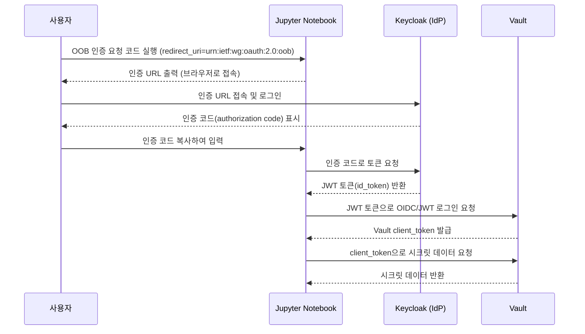

```python
import requests
import urllib.parse
import hvac
import base64

VAULT_ADDR = "http://host.minikube.internal:8200"
OIDC_PATH = "keycloak-oidc"
REDIRECT_URI = "urn:ietf:wg:oauth:2.0:oob"

# 1. auth_url 요청 (role 명시)
resp = requests.post(
    f"{VAULT_ADDR}/v1/auth/{OIDC_PATH}/oidc/auth_url",
    json={
        "redirect_uri": REDIRECT_URI,
        "role": "default"
    }
)
auth_url = resp.json()["data"]["auth_url"]
print("브라우저에서 아래 URL로 이동해 로그인하세요:")
print(auth_url)

# 2. auth_url에서 state 파라미터 추출
parsed = urllib.parse.urlparse(auth_url)
query = urllib.parse.parse_qs(parsed.query)
state = query["state"][0]
print("state 값(자동 추출):", state)

# 3. 브라우저에서 code만 복사
code = input("브라우저에서 code 값을 입력하세요: ")

# 4. Vault에 callback 요청 (GET)
params = {
    "code": code,
    "state": state,
    "redirect_uri": REDIRECT_URI
}
resp2 = requests.get(
    f"{VAULT_ADDR}/v1/auth/{OIDC_PATH}/oidc/callback",
    params=params
)
print("Vault 응답 상태코드:", resp2.status_code)
# print("Vault 응답 본문:", resp2.text)
try:
    result = resp2.json()
    client_token = result["auth"]["client_token"]

    # hvac 클라이언트로 Vault API 사용
    client = hvac.Client(url=VAULT_ADDR, token=client_token)
    # 예시: KV v2 시크릿 읽기
    secret = client.secrets.kv.v2.read_secret_version(
        path="test",
        mount_point="notebook-secret-kv-v2",
        raise_on_deleted_version=True
    )
    print("Vault 시크릿:", secret["data"]["data"]["data"])

    # 파일로 저장
    with open("vault_secret.txt", "w") as f:
        f.write(base64.b64decode(secret["data"]["data"]["data"]).decode("utf-8"))

    with open("vault_secret.txt", "rb") as f:
        file_content = f.read()
        print("파일 내용")
        print(file_content)

except Exception as e:
    print("JSON 파싱 에러:", e)
```

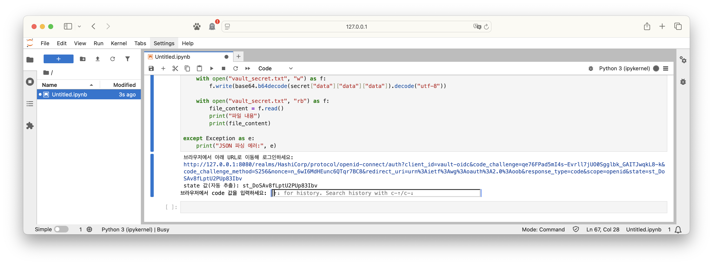

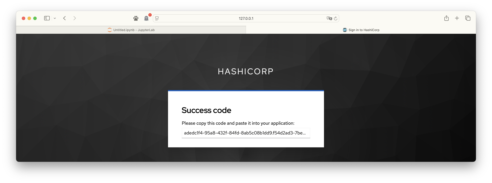

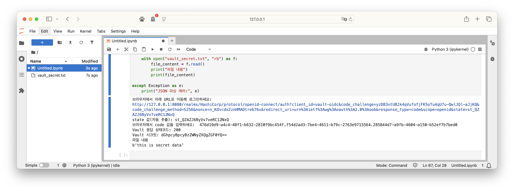

## 마무리.

Vault에서 제공하는 JWT 인증 방식을 사용하면 공통된 IDP 사용시 획득할 수 있는 JWT Token을 사용하여 다수의 애플리케이션에서 공통된 인증을 처리할 수 있습니다. 이를 통해 인증 정보를 공통화하고 관리를 단순화할 수 있습니다.

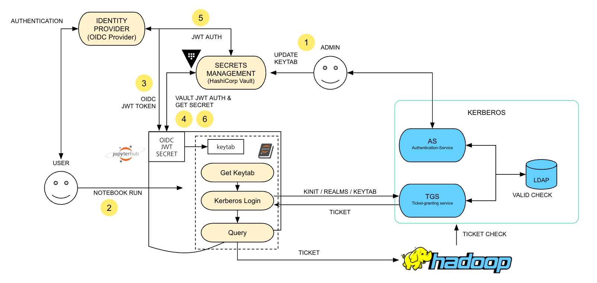

이번 데모에서 처럼 JupyterHub와 Vault를 Keycloak 기반 OIDC 인증으로 통합함으로써, 사용자는 하나의 인증 체계로 Jupyter Notebook 환경과 시크릿 관리 시스템 모두에 안전하게 접근할 수 있습니다. 이 과정에서 JWT 토큰을 활용하면, 인증 정보를 여러 시스템에서 일관되게 사용할 수 있어 관리가 단순해지고, 보안성도 크게 향상됩니다.

특히, JupyterHub와 같은 멀티유저 환경에서는 각 사용자가 개별적으로 Vault에 접근하거나, 관리자가 필요한 시크릿을 안전하게 전달하는 다양한 방식을 선택할 수 있습니다. 이경우 기존처럼 플랫폼 수준에서 사용되는 Kubernetes 인증이나 Cloud 인증 방식은 사용하지 못합니다.

OIDC 팝업 인증, JupyterHub를 통한 토큰 전달, OOB(Out-Of-Band) 인증 등 환경에 맞는 인증 방식을 적용하면, 사용자 경험과 보안 요구사항을 모두 만족시킬 수 있습니다.
실제 운영 환경에서는 토큰 만료, 권한 분리, 시크릿 전달 방식 등 세부적인 보안 정책을 함께 고려해야 하며, Keycloak과 Vault의 설정을 코드로 관리하면(예: Terraform) 더욱 효율적이고 재현성 있는 인프라 운영이 가능합니다.


