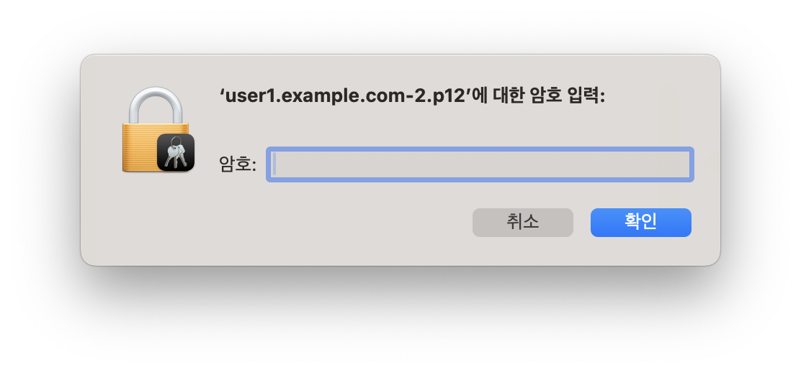

---
head:
  - - meta
    - name: Vault를 활용한 mTLS 인증 자동화로 웹 서비스 보안 강화하기
      content: Vault PKI와 mTLS를 활용한 웹서버 인증
tag: ["vault", "pki", "mTLS"]

---


# Vault를 활용한 mTLS 인증 자동화로 웹 서비스 보안 강화하기

웹 서비스의 보안은 현대 IT 인프라에서 가장 중요한 요소 중 하나입니다. 특히 민감한 데이터를 다루는 서비스에서는 단순한 사용자명/패스워드 인증을 넘어선 보다 강력한 보안 메커니즘이 필요합니다. 이러한 맥락에서 상호 TLS(mTLS) 인증은 클라이언트와 서버 간의 양방향 인증을 제공하는 강력한 보안 솔루션입니다.

## mTLS의 필요성과 도전 과제

> 참고 'mTLS 인증' : <https://wiki.kreonet.net/web-auth-sso/mtls-51119765.html>

mTLS(mutual TLS)는 클라이언트와 서버가 서로를 인증하는 프로토콜입니다. 일반적인 TLS가 서버만을 인증하는 것과 달리, mTLS에서는 클라이언트도 인증서를 통해 자신의 신원을 증명해야 합니다. 이는 다음과 같은 이점을 제공합니다:

- 무단 액세스 방지
- 중간자 공격 차단
- 클라이언트 신원의 암호화 기반 검증
- API와 서비스에 대한 세밀한 접근 제어

특히 상호간 인증이라는 점에서 무작위로 웹사이트를 크롤링 하거나, 외부인이 접근하지 말아야할 웹 리소스를 보호할 수 있습니다.

하지만 mTLS 구현에는 여러 가지 어려움이 있습니다:

- 인증서 수명 주기 관리의 복잡성
- 인증서 배포와 갱신의 번거로움
- 사용자 경험 저하 가능성
- 인프라 구성의 복잡성 증가

## HashiCorp Vault를 활용한 자동화된 mTLS 구현

HashiCorp Vault는 이러한 mTLS 구현의 어려움을 해결할 수 있는 강력한 도구입니다. Vault의 PKI 시크릿 엔진을 활용하면 다음과 같은 이점을 얻을 수 있습니다:

### 1. 자동화된 인증서 수명 주기 관리

Vault는 PKI 시크릿 엔진을 통해 인증서의 발급, 갱신, 폐기를 자동화할 수 있습니다. 이는 다음과 같은 장점을 제공합니다:

- 인증서 만료 관리의 자동화
- 실시간 인증서 발급 및 갱신
- 중앙화된 인증서 관리

### 2. 세밀한 접근 제어

Vault의 정책 기반 접근 제어를 통해 다음과 같은 보안 강화가 가능합니다:

- 사용자/애플리케이션별 맞춤형 인증서 정책
- 역할 기반 접근 제어(RBAC) 구현
- 감사 로그를 통한 모든 인증서 작업 추적

### 3. 보안 강화

Vault를 통한 mTLS 구현은 다음과 같은 보안 이점을 제공합니다:

- 중요 시스템에 대한 무단 접근 차단
- 암호화된 통신 보장
- 민감한 데이터의 노출 위험 감소

## 실제 적용 사례

Vault를 통한 mTLS 구현은 다음과 같은 환경에서 특히 유용합니다:

- 마이크로서비스 아키텍처
  - 서비스 간 통신의 보안 강화
  - 서비스 신원 확인의 자동화
- 기업 내부 시스템
  - 중요 관리 도구에 대한 접근 제어
  - 내부 API의 보안 강화
- 규제 대상 산업
  - 컴플라이언스 요구사항 충족
  - 감사 추적 기능 제공

::: info 관련 글
서비스 간 mTLS에 대해서는 다음 글에서 데모와 함께 다루었습니다.

[Vault PKI - mTLS demo](https://docmoa.github.io/04-HashiCorp/06-Vault/04-UseCase/mtls.html)
:::

## 구현 예시

> - GitHub Source : <https://github.com/Great-Stone/vault-pki-ssl-client-auth>
>
> - GitHub 한국어 README (macOS, Linux) : <https://github.com/Great-Stone/vault-pki-ssl-client-auth/blob/main/README_KR.md>
>
> - GitHub 한국어 README (windows11) : <https://github.com/Great-Stone/vault-pki-ssl-client-auth/blob/main/README_WIN.md>

Vault를 사용한 mTLS 구현은 다음과 같은 단계로 이루어집니다:

- Vault PKI 시크릿 엔진 설정
- 인증서 발급 정책 및 역할 구성
- 클라이언트 인증서(인증용) 자동 발급 시스템 구축
- 웹 서버의 mTLS 구성
- 클라이언트 인증 자동화 구현

인증서를 발급받고, 대상 웹서버에 접근하는 프로세스는 다음과 같습니다.


::: warning 데모 실행 준비사항

필수 설치 및 실행 환경은 다음과 같습니다.

- Vault, Nomad, Docker가 실행가능한 환경이여야 합니다.
  - Install Vault - <https://developer.hashicorp.com/vault/install?product_intent=vault>
  - Install Nomad - <https://developer.hashicorp.com/nomad/install?product_intent=nomad>
- Python 3 및 필요한 패키지 (flask, hvac, cryptography)를 설치해야 합니다.

:::

::: info

빠른 구성 및 테스트를 위해 CLI(shell, powershell)로 설명되었습니다. UI나 Terraform을 사용하는 것도 무방합니다.

:::

### 1. Setup ENV

명령어를 실행할 터미널에서 다음을 설정합니다.

::: code-tabs
@tab macOS/Linux

```bash
export NOMAD_ADDR='http://127.0.0.1:4646'
export VAULT_ADDR='http://127.0.0.1:8200'
export VAULT_TOKEN=root
export NOMAD_POLICY=nomad-server
```

@tab Windows

```bash
$env:NOMAD_ADDR = 'http://127.0.0.1:4646'
$env:VAULT_ADDR = 'http://127.0.0.1:8200'
$env:VAULT_TOKEN = 'root'
$env:NOMAD_POLICY = 'nomad-server'
```
:::

### 2. Run Vault

다른 창에서 실행

::: code-tabs
@tab macOS/Linux

```bash
export VAULT_TOKEN=root
vault server -dev -dev-listen-address=0.0.0.0:8200 -dev-root-token-id=$VAULT_TOKEN
```

@tab Windows

```bash
$env:VAULT_TOKEN = 'root'
vault server -dev -dev-listen-address=0.0.0.0:8200 -dev-root-token-id=$env:VAULT_TOKEN
```
:::

### 3. Setup Vault PKI

- 웹서버의 `HTTPS(TLS)` 구성을 위한 PKI와 클라이언트 인증을 위한 PKI는 별개 입니다. 여기서는 구성 편의 상 같은 PKI 엔진을 사용합니다.
- 사용자 인증을 받기 위한 PKI Role인 `pki/roles/user-auth`에는 `client_flag=true` 옵션이 추가되어 클라이언트 인증용 인증서를 발급하도록 합니다.

::: code-tabs
@tab macOS/Linux

```bash
vault secrets enable pki
vault secrets tune -max-lease-ttl=87600h pki
vault write pki/root/generate/internal \
  key_bits=2048 \
  private_key_format=pem \
  signature_bits=256 \
  country=KR \
  province=Seoul \
  locality=KR \
  organization=COMPANY \
  ou=DEV \
  common_name=example.com \
  ttl=87600h

vault write pki/config/urls \
  issuing_certificates="http://127.0.0.1:8200/v1/pki/ca" \
  crl_distribution_points="http://127.0.0.1:8200/v1/pki/crl"

vault write pki/roles/example-dot-com \
  allowed_domains=example.com \
  allow_subdomains=true \
  max_ttl=72h

vault write pki/roles/user-auth \
  allowed_domains=example.com \
  allow_subdomains=true \
  client_flag=true \
  max_ttl=72h

vault policy write pki_policy - <<-EOF
  path "pki/issue/*" {
    capabilities = [ "create", "read", "update", "delete", "list", "sudo" ]
  }
EOF
```

@tab Windows

```powershell
vault secrets enable pki
vault secrets tune -max-lease-ttl=87600h pki
vault write pki/root/generate/internal `
  key_bits=2048 `
  private_key_format=pem `
  signature_bits=256 `
  country=KR `
  province=Seoul `
  locality=KR `
  organization=COMPANY `
  ou=DEV `
  common_name=example.com `
  ttl=87600h

vault write pki/config/urls `
  issuing_certificates="http://127.0.0.1:8200/v1/pki/ca" `
  crl_distribution_points="http://127.0.0.1:8200/v1/pki/crl"

vault write pki/roles/example-dot-com `
  allowed_domains=example.com `
  allow_subdomains=true `
  max_ttl=72h

vault write pki/roles/user-auth `
  allowed_domains=example.com `
  allow_subdomains=true `
  client_flag=true `
  max_ttl=72h

# PowerShell에서 Here-String 사용
@"
path "pki/issue/*" {
  capabilities = [ "create", "read", "update", "delete", "list", "sudo" ]
}
"@ | vault policy write pki_policy -
```
:::

### 4. Vault Policy & Token for Nomad

인증서 적용을 자동화하기위해 Nomad를 활용하였습니다. 예제에서 제시한 Nginx의 인증서를 수동으로 파일을 작성하여 설정해주어도 무방합니다. 또한 K8s 환경에서는 VSO를 연계하여 사용하여도 됩니다.

> VSO 설명 : <https://docmoa.github.io/04-HashiCorp/06-Vault/04-UseCase/vault-k8s-usecase-csi-injection.html>

::: code-tabs
@tab macOS/Linux

```bash
cat <<EOF | vault policy write $NOMAD_POLICY -
path "auth/token/create/nomad-cluster" {
  capabilities = ["update"]
}

path "auth/token/roles/nomad-cluster" {
  capabilities = ["read"]
}

path "auth/token/lookup-self" {
  capabilities = ["read"]
}

path "auth/token/lookup" {
  capabilities = ["update"]
}

path "auth/token/revoke-accessor" {
  capabilities = ["update"]
}

path "sys/capabilities-self" {
  capabilities = ["update"]
}

path "auth/token/renew-self" {
  capabilities = ["update"]
}
EOF
```

@tab Windows

```powershell
@"
path "auth/token/create/nomad-cluster" {
  capabilities = ["update"]
}

path "auth/token/roles/nomad-cluster" {
  capabilities = ["read"]
}

path "auth/token/lookup-self" {
  capabilities = ["read"]
}

path "auth/token/lookup" {
  capabilities = ["update"]
}

path "auth/token/revoke-accessor" {
  capabilities = ["update"]
}

path "sys/capabilities-self" {
  capabilities = ["update"]
}

path "auth/token/renew-self" {
  capabilities = ["update"]
}
"@ | vault policy write $env:NOMAD_POLICY -
```
:::

### 5. Run Nomad with Vault Toekn

Nginx를 실행 및 관리하기 위한 Nomad를 실행합니다. Nomad에서 Vault의 PKI가 발급하는 인증서를 자동 생성/갱신 하기위해 Vault의 Token을 사용합니다.

- [4. Vault Policy & Token for Nomad](#4-vault-policy--token-for-nomad)에서 구성한 Vault와의 인증을 위한 Token Role을 생성합니다.
  - Token Role 생성 시 pki에 대한 권한이 부여된 정책을 사용할 수 있도록 `allowed_policies="pki_policy"` 옵션을 추가합니다.
  - Nomad 연계를 위한 자체 정책인 `nomad-server`는 생성할 수 없도록 `disallowed_policies="$NOMAD_POLICY"` 옵션을 추가합니다.
  - `orphan=true` 옵션을 주면 최대 만료 TTL 없이 계속 갱신할 수 있는 고아 토큰으로 생성됩니다.

::: code-tabs
@tab macOS/Linux

```bash
export NOMAD_POLICY=nomad-server

vault write auth/token/roles/nomad-cluster allowed_policies="pki_policy" disallowed_policies="$NOMAD_POLICY" token_explicit_max_ttl=0 orphan=true token_period="259200" renewable=true

# 토큰 생성 및 임시 파일에 저장
vault token create -field token -policy $NOMAD_POLICY -period 72h -orphan > /tmp/token.txt

# 토큰을 사용하여 Nomad 실행
nomad agent -dev -vault-enabled=true -vault-address=http://127.0.0.1:8200 -vault-token=$(cat /tmp/token.txt) -vault-tls-skip-verify=true -vault-create-from-role=nomad-cluster
```

@tab Windows

```bash
$env:NOMAD_POLICY = 'nomad-server'

vault write auth/token/roles/nomad-cluster allowed_policies="pki_policy" disallowed_policies="$env:NOMAD_POLICY" token_explicit_max_ttl=0 orphan=true token_period="259200" renewable=true

# 토큰 생성 및 임시 파일에 저장
vault token create -field token -policy $env:NOMAD_POLICY -period 72h -orphan | Out-File -FilePath "$env:TEMP\token.txt"

# 토큰을 사용하여 Nomad 실행
nomad agent -dev -vault-enabled=true -vault-address=http://127.0.0.1:8200 -vault-token=(Get-Content "$env:TEMP\token.txt") -vault-tls-skip-verify=true -vault-create-from-role=nomad-cluster
```
:::

### 6. Setup Vault Userpass

사용자는 브라우저 접속을 위한 인증서를 받기위한 인증 메커니즘이 필요합니다. 여기서는 별도의 IDP를 구성하지 않고 Vault의 `userpass`인증으로 사용자 인증을 처리합니다.
- `user1`이라는 사용자를 생성하고, 해당 사용자는 pki를 요청할 수 있는 정책을 소유합니다.

::: tip
Vault는 API를 제공하므로, 타 시스템에서 인증 IDP로도 사용할 수 있습니다.
:::

```bash
vault auth enable userpass
vault write auth/userpass/users/user1 password=password policies=pki_policy
```

### 7. Nginx run on Nomad with mTLS configuration

클라이언트 인증서 인증 옵션이 적용된 Nginx를 배포 합니다. UI에서 배포하는 것도 가능합니다.

::: tabs

@tab CLI

GitHub에서 받은 코드 위치에서 `nginx.job.hcl`을 확인하고 실행합니다.

Docker가 실행되어있어야 합니다.

```bash
nomad job run nginx.job.hcl
```

Nomad 실행 로그를 확인해보면 `using alloc directory` 라는 곳에 임시로(Nomadr가 dev mode여서) 파일을 생성합니다.

```log
...
2025-02-12T10:11:48.561+0900 [INFO]  client: using alloc directory: alloc_dir=/private/var/folders/vw/ds0qqs412s9f8yfc7yrlhz5r0000gn/T/NomadClient3290112717
```

Job이 정상적으로 실행되면 해당 위치에서 생성된 파일을 확인할 수 있습니다.


@tab UI

1. <http://localhost:4646> 으로 접속하여 `Run Job` 버튼을 클릭합니다.


2. `Job Definition` 란에 `nginx.job.hcl` 파일 내용을 붙여넣고 `Plan` 버튼을 클릭합니다. 이서 정상적으로 Plan이 완료되면 `Run` 버튼을 클릭합니다.


3. 정상적으로 배포가 완료되면 해당 Alloc > Task >`server` 의 `Files` 탭으로 이동하면 생성된 인증서와 웹 리소스를 확인할 수 있습니다.


:::

::: details Nomad Job 설명
```hcl
job "nginx" {
  datacenters = ["dc1"]

  group "nginx" {
    network {
      port "https" {
        to      = 443
        static  = 443
      }
    }

    task "server" {

      driver = "docker"

      config {
        image = "nginx"
        ports = ["https"]

        # Docker의 Volume으로 생성된 인증서와 웹페이지를 지정합니다.
        volumes = [
          "local/conf.d:/etc/nginx/conf.d",
          "local/certs:/etc/nginx/certs",
          "local/www:/home/www",
          "local/secure:/home/secure"
        ]
      }

      # Nginx용 구성 파일을 템플릿팅 합니다.
      template {
        data = <<-EOF
        server {
          listen 443 ssl;
          server_name service-a.example.com;
          ssl_certificate "/etc/nginx/certs/server.pem";
          ssl_certificate_key "/etc/nginx/certs/server.key";

          ssl_client_certificate  "/etc/nginx/certs/server.pem"; # 클라이언트 인증서 확인을 위한 CA 인증서, TLS를 위한 웹서버용 인증서와는 별도 관리 가능
          # ssl_verify_client       on; # 클라이언트 인증서 검증 활성화
          ssl_verify_client       optional;

          ssl_protocols           TLSv1.2 TLSv1.3;
          ssl_session_timeout     10m;
          
          proxy_read_timeout      300;
          proxy_buffers           64 16k;

          location / {
            root /home/www;
            index index.html;
          }

          location /secure { # 클라이언트 인증서가 확인되지 않으면 이 경로에는 접근할 수 없습니다.
            if ($ssl_client_verify != SUCCESS) { return 403; }
            alias /home/secure;
            index index.html;
          }
        }
        EOF

        destination   = "local/conf.d/default.conf"
        change_mode   = "signal"
        change_signal = "SIGHUP"
      }

      # Nginx용 서버인증서(HTTPS)를 생성합니다.
      template {
        data = <<-EOF
        {{ with secret "pki/issue/example-dot-com" "common_name=service-a.example.com" "ttl=60m" }}
        {{ .Data.certificate }}
        {{ .Data.issuing_ca }}{{ end }}
        EOF
        destination   = "local/certs/server.pem"
      }

      # Nginx용 서버인증서(HTTPS) 키를 생성합니다.
      template {
        data = <<-EOF
        {{ with secret "pki/issue/example-dot-com" "common_name=service-a.example.com" "ttl=60m" }}
        {{ .Data.private_key }}{{ end }}
        EOF
        destination   = "local/certs/server.key"
      }

      # Nginx용 클라이언트 인증서를 확인할 수 있는 CA 인증서를 생성합니다.
      template {
        data = <<-EOF
        {{ with secret "pki/root/generate/internal" "common_name=example.com" "ttl=87600h" }}
        {{ .Data.certificate }}{{ end }}
        EOF
        destination   = "local/certs/ca.pem"
      }

      template {
        data = <<-EOF
        <h1>Default page</h1>
        EOF
        destination   = "local/www/index.html"
      }

      template {
        data = <<-EOF
        <h1>Secure page</h1>
        EOF
        destination   = "local/secure/index.html"
      }
    }
  }
}
```
:::

### 8. Set `hosts` file and browser check

dns로 페이지를 접근할 수 있도록 `hosts` 파일을 수정합니다.

::: tabs
@tab macOS/Linux

`/etc/hosts` 파일을 관리자 권한으로 수정합니다:

```bash
echo "127.0.0.1   service-a.example.com" >> /etc/hosts
```

@tab Windows

Windows의 hosts 파일을 관리자 권한으로 수정합니다:

메모장을 관리자 권한으로 실행
`C:\Windows\System32\drivers\etc\hosts` 파일을 열기
다음 줄 추가:

```txt
127.0.0.1   service-a.example.com
```
:::

#### 8.1 check page - Default

각 페이지에 접속하여 어떻게 출력되는지 확인합니다.

click(allow) : [https://service-a.example.com](https://service-a.example.com)

서비스용 인증서는 공인 인증서가 아니고, Vault가 생성한 Root CA를 시스템에 등록하지 않았기 때문에 경고 페이지가 발생합니다. `세부사항 보기`로 이동하여 웹 사이트를 허용합니다.


Default page가 있는 `Root`경로는 인증을 요구하지 않으므로 접속이 확인됩니다.


#### 8.2 check page - Default

Nginx 서버 구성에서 `/secure` 경로는 인증이 안되는경우 오류를 반환하도록 구성했습니다.

```ini {2}
location /secure { # 클라이언트 인증서가 확인되지 않으면 이 경로에는 접근할 수 없습니다.
  if ($ssl_client_verify != SUCCESS) { return 403; }
  alias /home/secure;
  index index.html;
}
```

click(deny) : [https://service-a.example.com/secure](https://service-a.example.com/secure)

인증에 필요한 인증서가 제시되지 않았으므로, 해당 페이지에서는 403에러를 반환합니다.


### 9. pkcs12 client key 받기

웹서버 인증에 필요한 인증서를 발급받는 절차를 설명합니다. GitHub에서 다운받은 디렉토리에서 `₩pk12-app` 위치에서 실행합니다.

::: warning

- Python3 가 필요합니다.
- 필요 패키지를 설치해야 합니다.

```bash
python -m pip install flask hvac cryptography
```

:::

Python으로 작성된 파일을 실행합니다.

```bash
python main.py
```

해당 앱은 `8888`포트로 열려있습니다. <http://127.0.0.1:8888> 페이지로 이동합니다.


앞서 생성한 Vault userpass 인증의 username인 `user1`과 password인 `password`를 입력하고, 인증서용 비밀번호(예: `1234`)를 입력하면 Vault로 부터 PEM인증서를 받아 pkcs#12 인증서로 변환 후 다운로드가 진행됩니다.

만약 Vault 에서 PEM을 직접 받는 경우, `OpenSSL`을 사용하여 다음과 같이 PEM 인증서를 pkcs#12 형태로 변경할 수 있습니다.

```bash
openssl pkcs12 -export -out user1.p12 \
  -inkey private_key.pem -in certificate.pem \
  -certfile issuing_ca.pem
```

다운 받은 인증서를 더블클릭하여 Host OS에 인증서를 등록합니다. 등록시 인증서 발급 때 입력한 인증서용 비밀번호가 필요합니다.



인증서 등록이 완료되면 내 인증서 목록에 표기됩니다.


## 10. 인증서로 웹서버 인증 받기

다시 인증서를 요구하는 페이지로 이동합니다.

click : [https://service-a.example.com/secure](https://service-a.example.com/secure)

`example.com`에 대한 인증서이므로, 브라우저에서는 해당 DNS가 같으면 자동으로 인식합니다.


인증서를 등록하면 이제 `secure` 경로의 페이지 내용을 확인할 수 있습니다.


## 결론

Vault를 활용한 mTLS 구현은 현대 웹 서비스의 보안 요구사항을 효과적으로 충족시킬 수 있는 솔루션입니다. 자동화된 인증서 관리, 세밀한 접근 제어, 강력한 보안성을 통해 민감한 데이터와 시스템을 보호할 수 있습니다. 특히 Vault의 자동화 기능은 운영 부담을 줄이면서도 보안을 강화할 수 있는 균형 잡힌 접근 방식을 제공합니다.
보안은 단순한 기능이 아닌 지속적인 프로세스입니다. Vault를 통한 mTLS 구현은 이러한 보안 프로세스를 자동화하고 표준화하는 데 큰 도움이 될 것입니다.