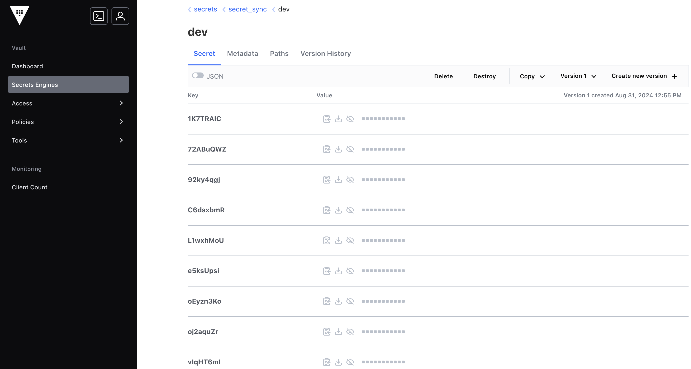
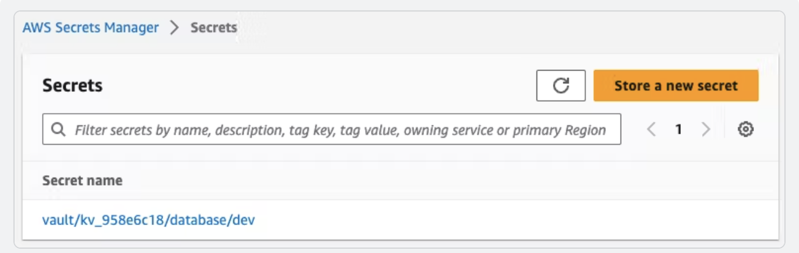

---
head:
  - - meta
    - name: Vault Secret를 AWS Secret manager 연동
      content: CSP Secret을 Vault로 관리
author : "unghee"
tag: ["SecretManager", "vault", "aws"]

---

# Vault Secret를 AWS Secret manager 연동

> Secret Sync 공식 자료: [Secret Sync](https://developer.hashicorp.com/vault/docs/sync)

> AWS Secret Manager Sync 자료: [Secret Manager Sync](https://developer.hashicorp.com/vault/docs/sync/awssm)

현대의 IT 환경에서는 다양한 클라우드 서비스를 사용하는 것이 일반적입니다. 
대부분의 경우 AWS를 주로 사용하지만, AWS를 비롯한 클라우드 서비스 제공자(CSP)에서 간헐적으로 발생하는 서비스 이슈를 경험할 때가 있습니다. 특히, AWS 리전의 장애가 발생할 경우를 대비하여, GCP나 Azure, 나아가 IDC를 백업 용도로 고려하는 것이 중요합니다. 
관리형 Kubernetes와 같은 관리형 서비스의 대책도 중요하지만, 오늘은 관리형 Secret 도구에 대한 대처 방안에 대해 알아보겠습니다.

Vault를 사용하면 여러 CSP의 Sync를 통해 하나의 Vault Secret으로 여러 CSP에 Secret을 동기화할 수 있습니다. 이를 통해 각 CSP의 관리형 Kubernetes 환경에 동일한 Secret을 적용할 수 있어, 애플리케이션의 Secret 형상을 일관되게 유지하고 관리할 수 있습니다.

이제, 이 기능을 어떻게 적용할 수 있는지 알아보겠습니다.

## Vault Secret과 AWS Secret Manager의 비밀정보를 동기화 과정

1. 먼저 Vault Policy는 다음과 같이 필요합니다.
```bash
path "sys/sync/*" {
  capabilities = ["read", "list", "create", "update", "delete"]
}
 
path "secret_sync/*" {
  capabilities = ["read"]
}
 ```

2. Secret Engine을 만들고 데이터를 넣도록 하겠습니다.
```bash
resource "vault_mount" "secret_sync" {
  path        = "secret_sync"
  type        = "kv"
  options     = { version = "2" }
  description = "KV Version 2 secret engine mount"
}

resource "vault_kv_secret_v2" "secret_sync" {
  mount                      = vault_mount.secret_sync.path
  name                       = "dev"
  cas                        = 1
  delete_all_versions        = true
  data_json                  = jsonencode(local.secrets_map)
}
```

- 더미 데이터는 다음과 같습니다.
```bash
cat secret.csv
key,secret_path,secret_key,secret_value
1,path1,oEyzn3Ko,ueWXdREVkbO8
2,path2,L1wxhMoU,McY5TAQDQFfQ
3,path3,92ky4qgj,onahCbfYh8IN
4,path4,oj2aquZr,YvPZOwthQpii
5,path5,vIqHT6mI,xRRxYsMwklPK
6,path6,C6dsxbmR,Gryegjb99vvR
7,path7,e5ksUpsi,hLNFqIFF7gl7
8,path8,1K7TRAIC,r4uSkISmyvWp
9,path9,xfTzJl3r,tSFrxHjhpXfs
10,path10,72ABuQWZ,FthcwQESffIo
```

3. vault ui에서 정상적으로 배포된 secret을 확인합니다.



4. 정상적으로 배포된 Vault Secret을 AWS Secret Manager에 Sync를 진행합니다.
- Terraform code는 다음과 같습니다.

```bash
# name template 참고 링크: https://developer.hashicorp.com/vault/docs/sync#name-template
resource "vault_secrets_sync_aws_destination" "static_aws" {
  name                 = "aws_secret_sync"
  access_key_id        = var.aws_access_key_id
  secret_access_key    = var.aws_secret_access_key
  region               = "ap-northeast-2"
  secret_name_template = "vault_{{ .MountAccessor | lowercase }}_{{ .SecretPath | lowercase }}"
}

resource "vault_secrets_sync_association" "static_gh_token" {
  name        = vault_secrets_sync_aws_destination.static_aws.name
  type        = vault_secrets_sync_aws_destination.static_aws.type
  mount       = "secret_sync"
  secret_name = "dev"
}
```

5. 배포를 진행하고 AWS Console에서 확인하면 다음과 같습니다.

:::참고 Vault Secret의 License가 없어, 공식홈페이지의 결과 화면입니다.


## Secret Sync 기능은 다음의 서비스의 동기화를 지원하고 있습니다.

- aws
- azure
- gcp
- github
- vercel

:::참고

github action에서는 다음과 같이 활용도 가능합니다.

```bash
---
      - name: Login to AWS ECR
        run: |
          echo "Set vars"
          AWS_ACCOUNT_ID=$(echo "$AWS_ACCOUNT_ID" | jq -r '.AWS_ACCOUNT_ID')
          AWS_ACCESS_KEY_ID=$(echo "$AWS_ACCESS_KEY_ID" | jq -r '.AWS_ACCESS_KEY_ID')
          AWS_SECRET_ACCESS_KEY=$(echo "$AWS_SECRET_ACCESS_KEY" | jq -r '.AWS_SECRET_ACCESS_KEY')
          echo "Login to AWS ECR"
          aws ecr get-login-password --region $AWS_DEFAULT_REGION | docker login --username AWS --password-stdin $AWS_ACCOUNT_ID.dkr.ecr.$AWS_DEFAULT_REGION.amazonaws.com
        env:
          AWS_DEFAULT_REGION: ${{ vars.AWS_DEFAULT_REGION }}
          AWS_ACCOUNT_ID: ${{ secrets.VAULT_KV_5047F8B7_AWS_ACCOUNT_ID }}
          AWS_ACCESS_KEY_ID: ${{ secrets.VAULT_KV_5047F8B7_AWS_ACCESS_KEY_ID }}
          AWS_SECRET_ACCESS_KEY: ${{ secrets.VAULT_KV_5047F8B7_AWS_SECRET_ACCESS_KEY }}
---          
```