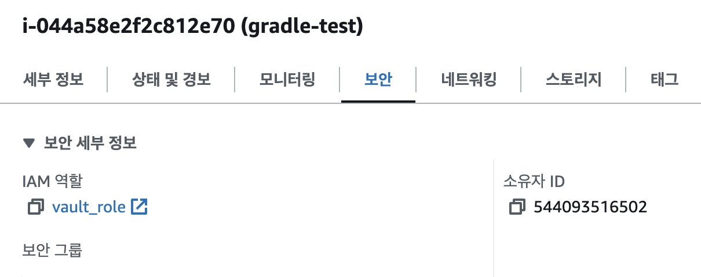

---
head:
  - - meta
    - name: Spring Boot Vault aws-auth Version
      content: Spring Boot에 구성관리로 Vault 사용 aws-auth Version
author : "unghee"      
tag: ["vault", "java", "spring", "aws-auth"]

---

# Vault로 Spring Boot 구성관리 aws-auth Version

> token, app-role로 관리: [docmoa](https://docmoa.github.io/04-HashiCorp/06-Vault/04-UseCase/spring-boot.html)

Spring boot에서는 Token, App-role을 제외하고 aws-auth를 통해서도 Secret을 주입 할 수 있습니다.
aws-auth에서는 다음의 두 기능을 지원합니다.

- AWS IAM
  - EC2에 적용되는 AWS IAM Name을 기반으로 인증, 인가를 받고 Application이 **실행** 될 때 Secret을 주입합니다.
- EC2 Tag
  - EC2에 적용되는 AWS Tag Name의 Value 기반으로 인증, 인가를 받고 Application이 **실행** 될 때 Secret을 주입합니다.

두 기능에 대한 장점은 Spring boot의 공통 영역인 application.yaml의 token이나 app-role의 값이 노출되는 것을 방지할 수 있고, ci/cd 단계 또한 치환하는 과정이 줄어듭니다.

자세한 기능들은 아래의 설정을 보면서 알아보겠습니다.

1. Vault Secret 설정
- Vault Secret은 아래와 같이 설정했습니다.
- 여기서 생성하는 **Secret Engine**명과 **KV Path**명을 기준으로 자동화를 쉽게 할 수 있습니다.
```bash
# Vault Secret engine의 이름을 spring* application 이름과 동일하게 맞추면 조금 더 설정이 쉽습니다.
resource "vault_mount" "kv_spring" {
  path    = "java_and_vault"
  type    = "kv"
  options = { version = "2" }
}

# secret engine path는 profile 명으로 지정한다면 조금 더 설정이 쉽습니다.
resource "vault_kv_secret_v2" "kv_java_and_vault_dev" {
  mount               = vault_mount.kv_spring.path
  name                = "dev"
  cas                 = 1
  delete_all_versions = false
  data_json = jsonencode({
    "cloud.aws.s3.accessKey"     = "aws_access",
    "cloud.aws.s3.bucket"        = "gc-vault-test",
    "cloud.aws.s3.region"        = "ap-northeast-2",
    "cloud.aws.s3.secretKey"     = "aws_secret",
    "spring.datasource.password" = "password",
    "spring.datasource.url"      = "db_url",
    "spring.datasource.username" = "username"
  })
}
```

2. Vault AWS-Auth 설정 (IAM, EC2-Tag)
- aws_spring_boot_iam
  - iam 기준으로 인증하는 aws-auth role입니다.
  - 미리 생성한 aws iam을 "bound_iam_role_arns"에 명시합니다.
- aws_spring_boot_ec2
  - ec2 tag 기준으로 인증하는 aws-auth role입니다.
  - ec2에 tag key로 "role_tag" value로는 output인 "vault_ec2_tag"에 값을 입력합니다.

```bash
resource "vault_policy" "policy_spring_boot" {
  name = "spring-boot-vault"

  policy = <<EOT
path "${vault_mount.kv_spring.path}/data/java_and_vault" {
  capabilities = ["read"]
}

path "${vault_mount.kv_spring.path}/data/java_and_vault/dev" {
  capabilities = ["read"]
}
EOT
}

resource "vault_auth_backend" "aws" {
  type = "aws"
  path = "aws"
}

resource "vault_aws_auth_backend_role" "aws_spring_boot_iam" {
  backend   = vault_auth_backend.aws.path
  role      = "aws-spring-boot-iam"
  auth_type = "iam"
  bound_iam_role_arns = [
    "arn:aws:iam::accountID:role/vault_role"
  ]
  inferred_entity_type = "ec2_instance"
  inferred_aws_region  = "ap-northeast-2"
  token_policies       = ["${vault_policy.policy_spring_boot.name}"]
}

resource "vault_aws_auth_backend_role" "aws_spring_boot_ec2" {
  backend           = vault_auth_backend.aws.path
  role              = "aws-spring-boot-ec2"
  auth_type         = "ec2"
  bound_account_ids = ["accountID"]
  role_tag          = "svc_type"
  token_policies    = ["${vault_policy.policy_spring_boot.name}"]
}

resource "vault_aws_auth_backend_role_tag" "aws_spring_boot_ec2_tag" {
  backend = vault_auth_backend.aws.path
  role    = vault_aws_auth_backend_role.aws_spring_boot_ec2.role
}

output "vault_ec2_tag" {
  value = vault_aws_auth_backend_role_tag.aws_spring_boot_ec2_tag.tag_value
}
```

3. 공통영역 (AWS-IAM)
- application.yaml 파일입니다. 
- 아래와 같이 datasource와 aws 접근 정보를 생략한다고 해도 제 데이터는 Vault Secret Engine Path의 key명 기준으로 Value값을 치환합니다.
- ex)s3 접근하는 accesskey는 "cloud.aws.s3.accessKey"의 Value 값인 "aws_access"를 치환합니다.
```bash
spring:
  thymeleaf:
    check-template-location: true
    prefix: classpath:/templates/
    suffix: .html
    mode: HTML
    encoding: UTF-8
    content-type: text/html
    cache: false
  devtools:
    livereload:
      enabled: true
  cloud:
    vault:
      host: vault_URL
      port: 8200
      scheme: https
      namespace: admin
      #인증은 AWS IAM으로 합니다.
      authentication: AWS_IAM
      aws-iam:
        aws-path: aws
        #위에서 Vault에서 만든 role을 명시합니다.
        role: aws-spring-boot-iam
        endpoint-uri: https://sts.ap-northeast-2.amazonaws.com
      config:
        lifecycle:
          enabled: true
          min-renewal: 10s
          renew-interval: 10s
      kv:
        enabled: true
        backend: kv_example
        profile-separator: /
      application-name: java_and_vault
      profiles: dev
      generic:
        enabled: false

  config:
    import: vault://
```

4. 공통영역 (AWS-EC2-Tag)
- application.yaml 파일입니다. 
- 아래와 같이 datasource와 aws 접근 정보를 생략한다고 해도 제 데이터는 Vault Secret Engine Path의 key명 기준으로 Value값을 치환합니다.
- ex)s3 접근하는 accesskey는 "cloud.aws.s3.accessKey"의 Value 값인 "aws_access"를 치환합니다.

::: warning
nonce는 application의 인식값입니다. 지정하지 않고 해당 ec2에서 실행된다면 다음의 명령어로 확인하여야 합니다.
```bash
#vault read auth/ung/identity-accesslist/instance-id
vault read auth/ung/identity-accesslist/i-044a58e2f2c812e70
Key                          Value
---                          -----
client_nonce                 vault-spring-boot-ec2
creation_time                2024-08-17T05:03:54.352543462Z
disallow_reauthentication    false
expiration_time              2024-10-04T04:28:32.766397546Z
last_updated_time            2024-09-02T04:28:32.766397546Z
pending_time                 2024-09-02T01:24:19Z
role                         aws-spring-boot
```
:::

```bash
spring:
  thymeleaf:
    check-template-location: true
    prefix: classpath:/templates/
    suffix: .html
    mode: HTML
    encoding: UTF-8
    content-type: text/html
    cache: false
  devtools:
    livereload:
      enabled: true
  cloud:
    bootstrap:
      enabled: true
    vault:
      host: vault_URL
      port: 8200
      scheme: https
      namespace: admin
      #인증을 AWS EC2에 Tag기반으로 합니다.
      authentication: AWS_EC2
      aws-ec2:
        aws-ec2-path: aws
        #위에서 만든 ec2 tag의 role명을 명시합니다.
        role: aws-spring-boot-ec2
        nonce: vault-spring-boot-ec2
      config:
        lifecycle:
          enabled: true
          min-renewal: 10s
          renew-interval: 10s
      kv:
        enabled: true
        backend: kv_example
        profile-separator: /
      application-name: java_and_vault
      profiles: dev
      generic:
        enabled: false
  config:
    import: vault://

logging:
  level:
    org.springframework.vault: TRACE
    org.springframework.cloud.vault: TRACE

# Vault Path Info
# /{backend}/{default-context}
# /{backend}/{default-context}/{profiles}
# /{backend}/{application-name}
# /{backend}/{application-name}/{profiles}
```

5. 적용 확인
- 4번까지 설정을 하였다면 사실 EC2의 적용하는 것은 어렵지 않을 것입니다.
- 먼저 IAM 적용입니다. 배포하려는 ec2에 IAM을 attch하면 됩니다.


- 다음으로는 ec2 tag입니다. 배포하려는 ec2에 tag에는 "svc_type" value에는 vault_ec2_tag의 output값을 넣어줍니다.


- ec2에서는 아래와 같이 결과를 확인할 수 있습니다.


