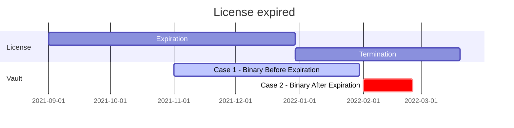

# Vault +1.12 라이선스

::: tip 관련 URL
<https://developer.hashicorp.com/vault/docs/enterprise/license/faq#q-how-do-the-license-termination-changes-affect-upgrades>
:::

## License 기한 영향도

- expiration : 엔터프라이즈 사용 기간의 만료
- termination : 라이선스 사용 종료
- expiration ~ termination 기간을 유예기간이라 하며, 이 때 Vault는 잠김(Seal)
- 라이선스 적용 가이드
  - <https://www.hashicorp.com/products/vault/trial>
  - 평가 라이선스는 유예기간이 1일
  - 평가 요청(한국): <korea@hasihcorp.com>

## 라이선스 exprire(기간 만료)



- License

  - Expiration : 2022-6-19
  - Termination : 2032-6-18

- 측정 시점 : 2022-12-9

- Case 1 : Vault 바이너리가 릴리즈된 시점이 expiration 기간보다 이전인 경우

  - 실행 가능

  - 사용은 불가

    ```log
    2022-12-09T14:39:09.474+0900 [ERROR] core.licensing: core: licensing error: expiration_time="2022-06-19 00:00:00 +0000 UTC" time_left=-4157h39m9s
    ```

  

- Case 2 : Vault 바이너리가 릴리즈된 시점이 expiration 기간보다 이후인 경우

  - 실행 불가

    ```log
    Error initializing core: licensing could not be initialized: license validation failed: 1 error occurred:
    	* license expiration date is before version build date
    ```

- Case 3 : 평가 라이선스의 Termination 시점 이후

  - 실행 불가

- Case 3 : 일반 라이선스의 Termination 시점 이후

  - 바이너리 릴리즈 기준으로 expiration 기간과 비교하여 Case1, 2와 같이 동작


## 라이선스 갱신

expiration되었지만 실행은 가능한 이유

- 운영중인 경우 프로세스 다운은 발생하지 않음
- `/sys/config/reload/license` 로 변경된 환경변수 또는 파일을 다시 읽음
  - 내용 : <https://developer.hashicorp.com/vault/docs/enterprise/license/autoloading>
  - 구성 파일에서 `license_path`로 지정된 파일 경로 입력
  - 환경 변수 `VAULT_LICENSE`에 라이선스 내용 입력
  - 환경 변수 `VAULT_LICENSE_PATH`에 라이선스 파일 경로 입력

