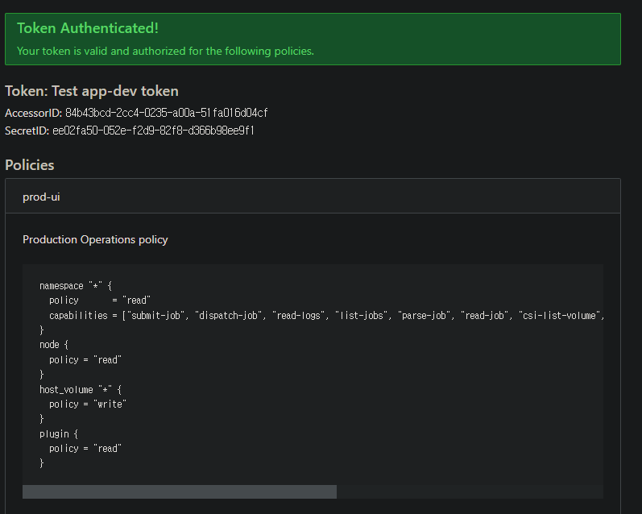
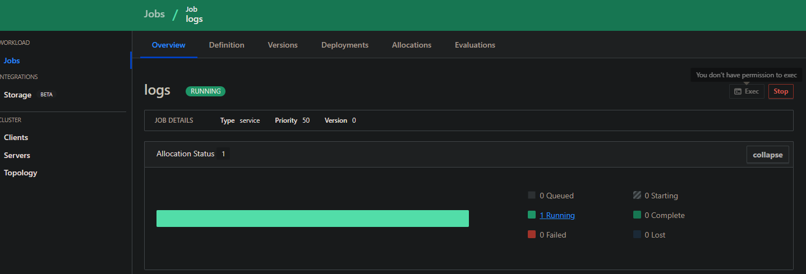

---
meta:
  - name: description
    content: Nomad ACL
tags: ["Nomad", "ACL"]
---

# Nomad UI Token 
::: tip
해당 Token의 policy는 특정인이 원하여 만들었으며, 더 다양한 제약과 허용을 할 수 있습니다. 해당 policy는 아래와 같은 제약과 허용을 합니다.
1. UI에서 exec(job에 접근) 제한
2. 그 외에 job, node, volume, server등의 모든 화면 읽어오기
:::

## Nomad cli

```bash
#원하는 권한이 있는 policy file
$ cat nomad-ui-policy.hcl
namespace "*" {
  policy       = "read"
  capabilities = ["submit-job", "dispatch-job", "read-logs", "list-jobs", "parse-job", "read-job", "csi-list-volume", "csi-read-volume", "list-scaling-policies", "read-scaling-policy", "read-job-scaling", "read-fs"]
}
node {
  policy = "read"
}
host_volume "*" {
  policy = "write"
}
plugin {
  policy = "read"
}

#위에서 만든 policy 파일을 nomad cluster에 적용
$ nomad acl policy apply -description "Production UI policy" prod-ui nomad-ui-policy.hcl

#해당 policy로 token생성(policy는 여러개를 넣을 수도 있음)
$ nomad acl token create -name="prod ui token" -policy=prod-ui -type=client | tee ui-prod.token
#웹 브라우저 로그인을 위해 Secret ID 복사
```

## Nomad UI
아래는 위에서 만들어진 토큰으로 로그인한 화면입니다.


아래 그림과 같이 exec버튼이 비활성화되어 있는 걸 볼 수 있습니다.

